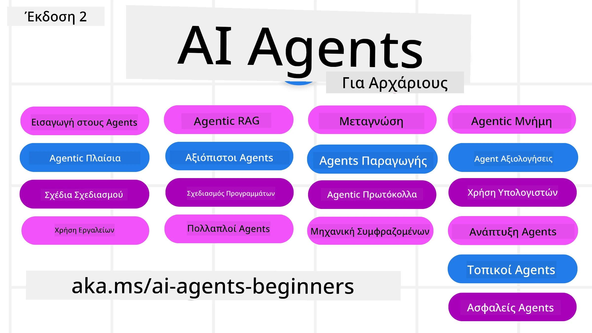

# Πράκτορες Τεχνητής Νοημοσύνης για Αρχάριους - Ένα Μάθημα



## Ένα μάθημα που διδάσκει όλα όσα χρειάζεστε για να ξεκινήσετε να δημιουργείτε Πράκτορες Τεχνητής Νοημοσύνης

[](https://github.com/microsoft/ai-agents-for-beginners/blob/master/LICENSE?WT.mc_id=academic-105485-koreyst)
[](https://GitHub.com/microsoft/ai-agents-for-beginners/graphs/contributors/?WT.mc_id=academic-105485-koreyst)
[](https://GitHub.com/microsoft/ai-agents-for-beginners/issues/?WT.mc_id=academic-105485-koreyst)
[](https://GitHub.com/microsoft/ai-agents-for-beginners/pulls/?WT.mc_id=academic-105485-koreyst)
[](http://makeapullrequest.com?WT.mc_id=academic-105485-koreyst)

### 🌐 Υποστήριξη Πολλών Γλωσσών

#### Υποστηρίζεται μέσω GitHub Action (Αυτοματοποιημένο & Πάντα Ενημερωμένο)

<!-- CO-OP TRANSLATOR LANGUAGES TABLE START -->
[Αραβικά](../ar/README.md) | [Μπενγκάλι](../bn/README.md) | [Βουλγαρικά](../bg/README.md) | [Βιρμανικά (Μυανμάρ)](../my/README.md) | [Κινέζικα (Απλοποιημένα)](../zh-CN/README.md) | [Κινέζικα (Παραδοσιακά, Χονγκ Κονγκ)](../zh-HK/README.md) | [Κινέζικα (Παραδοσιακά, Μακάο)](../zh-MO/README.md) | [Κινέζικα (Παραδοσιακά, Ταϊβάν)](../zh-TW/README.md) | [Κροατικά](../hr/README.md) | [Τσέχικα](../cs/README.md) | [Δανέζικα](../da/README.md) | [Ολλανδικά](../nl/README.md) | [Εσθονικά](../et/README.md) | [Φινλανδικά](../fi/README.md) | [Γαλλικά](../fr/README.md) | [Γερμανικά](../de/README.md) | [Ελληνικά](./README.md) | [Εβραϊκά](../he/README.md) | [Χίντι](../hi/README.md) | [Ουγγρικά](../hu/README.md) | [Ινδονησιακά](../id/README.md) | [Ιταλικά](../it/README.md) | [Ιαπωνικά](../ja/README.md) | [Κανάντα](../kn/README.md) | [Χμερ](../km/README.md) | [Κορεατικά](../ko/README.md) | [Λιθουανικά](../lt/README.md) | [Μαλαισιανά](../ms/README.md) | [Μαλαγιαλάμ](../ml/README.md) | [Μαραθαί](../mr/README.md) | [Νεπάλ](../ne/README.md) | [Νιγηριανό Πίτζιν](../pcm/README.md) | [Νορβηγικά](../no/README.md) | [Περσικά (Φαρσί)](../fa/README.md) | [Πολωνικά](../pl/README.md) | [Πορτογαλικά (Βραζιλία)](../pt-BR/README.md) | [Πορτογαλικά (Πορτογαλία)](../pt-PT/README.md) | [Πουντζάμπι (Γκουρμούκι)](../pa/README.md) | [Ρουμανικά](../ro/README.md) | [Ρωσικά](../ru/README.md) | [Σερβικά (Κυριλλικά)](../sr/README.md) | [Σλοβάκικα](../sk/README.md) | [Σλοβενικά](../sl/README.md) | [Ισπανικά](../es/README.md) | [Σουαχίλι](../sw/README.md) | [Σουηδικά](../sv/README.md) | [Ταγκάλογκ (Φιλιππινέζικα)](../tl/README.md) | [Ταμίλ](../ta/README.md) | [Τελούγκου](../te/README.md) | [Ταϊλανδικά](../th/README.md) | [Τούρκικα](../tr/README.md) | [Ουκρανικά](../uk/README.md) | [Ούρντου](../ur/README.md) | [Βιετναμέζικα](../vi/README.md)

> **Προτιμάτε τοπικό κλωνοποίηση;**
>
> Αυτό το αποθετήριο περιλαμβάνει πάνω από 50 μεταφράσεις γλωσσών, που αυξάνουν σημαντικά το μέγεθος λήψης. Για κλωνοποίηση χωρίς τις μεταφράσεις, χρησιμοποιήστε sparse checkout:
>
> **Bash / macOS / Linux:**
> ```bash
> git clone --filter=blob:none --sparse https://github.com/microsoft/ai-agents-for-beginners.git
> cd ai-agents-for-beginners
> git sparse-checkout set --no-cone '/*' '!translations' '!translated_images'
> ```
>
> **CMD (Windows):**
> ```cmd
> git clone --filter=blob:none --sparse https://github.com/microsoft/ai-agents-for-beginners.git
> cd ai-agents-for-beginners
> git sparse-checkout set --no-cone "/*" "!translations" "!translated_images"
> ```
>
> Αυτό σας δίνει όλα όσα χρειάζεστε για να ολοκληρώσετε το μάθημα με πολύ πιο γρήγορη λήψη.
<!-- CO-OP TRANSLATOR LANGUAGES TABLE END -->

**Εάν θέλετε να υποστηρίζονται πρόσθετες γλώσσες μετάφρασης, είναι καταχωρημένες [εδώ](https://github.com/Azure/co-op-translator/blob/main/getting_started/supported-languages.md)**

[](https://GitHub.com/microsoft/ai-agents-for-beginners/watchers/?WT.mc_id=academic-105485-koreyst)
[](https://GitHub.com/microsoft/ai-agents-for-beginners/network/?WT.mc_id=academic-105485-koreyst)
[](https://GitHub.com/microsoft/ai-agents-for-beginners/stargazers/?WT.mc_id=academic-105485-koreyst)

[](https://discord.gg/nTYy5BXMWG)


## 🌱 Ξεκινώντας

Αυτό το μάθημα περιλαμβάνει μαθήματα που καλύπτουν τα βασικά της δημιουργίας Πρακτόρων Τεχνητής Νοημοσύνης. Κάθε μάθημα καλύπτει το δικό του θέμα, οπότε ξεκινήστε από όπου θέλετε!

Υπάρχει υποστήριξη πολλών γλωσσών για αυτό το μάθημα. Μεταβείτε στις [διαθέσιμες γλώσσες εδώ](#-multi-language-support).

Αν είναι η πρώτη φορά που δημιουργείτε με γενετικά μοντέλα Τεχνητής Νοημοσύνης, ρίξτε μια ματιά στο μάθημά μας [Generative AI For Beginners](https://aka.ms/genai-beginners), το οποίο περιλαμβάνει 21 μαθήματα για δημιουργία με GenAI.

Μην ξεχάσετε να [αποθηκεύσετε με αστέρι (🌟) αυτό το αποθετήριο](https://docs.github.com/en/get-started/exploring-projects-on-github/saving-repositories-with-stars?WT.mc_id=academic-105485-koreyst) και να [κάνετε fork αυτό το αποθετήριο](https://github.com/microsoft/ai-agents-for-beginners/fork) για να τρέξετε τον κώδικα.

### Γνωρίστε Άλλους Μαθητές, Λάβετε Απαντήσεις στις Ερωτήσεις Σας

Αν κολλήσετε ή έχετε ερωτήσεις σχετικά με τη δημιουργία Πρακτόρων Τεχνητής Νοημοσύνης, συμμετάσχετε στο αποκλειστικό μας κανάλι Discord στο [Microsoft Foundry Discord](https://aka.ms/ai-agents/discord).

### Τι Χρειάζεστε

Κάθε μάθημα σε αυτό το μάθημα περιλαμβάνει παραδείγματα κώδικα, τα οποία μπορούν να βρεθούν στον φάκελο code_samples. Μπορείτε να [κάνετε fork αυτό το αποθετήριο](https://github.com/microsoft/ai-agents-for-beginners/fork) για να δημιουργήσετε το δικό σας αντίγραφο.

Τα παραδείγματα κώδικα σε αυτές τις ασκήσεις χρησιμοποιούν το Microsoft Agent Framework με το Azure AI Foundry Agent Service V2:

- [Microsoft Foundry](https://aka.ms/ai-agents-beginners/ai-foundry) - Απαιτείται Λογαριασμός Azure

Αυτό το μάθημα χρησιμοποιεί τα ακόλουθα πλαίσια και υπηρεσίες AI Agent από τη Microsoft:

- [Microsoft Agent Framework (MAF)](https://aka.ms/ai-agents-beginners/agent-framework)
- [Azure AI Foundry Agent Service V2](https://aka.ms/ai-agents-beginners/ai-agent-service)

Ορισμένα παραδείγματα κώδικα υποστηρίζουν επίσης εναλλακτικούς παρόχους συμβατούς με OpenAI, όπως το [MiniMax](https://platform.minimaxi.com/), που προσφέρει μοντέλα με μεγάλο πλαίσιο (έως 204K tokens). Δείτε το [Course Setup](./00-course-setup/README.md) για λεπτομέρειες ρυθμίσεων.

Για περισσότερες πληροφορίες σχετικά με την εκτέλεση του κώδικα για αυτό το μάθημα, μεταβείτε στο [Course Setup](./00-course-setup/README.md).

## 🙏 Θέλετε να βοηθήσετε;

Έχετε προτάσεις ή βρήκατε ορθογραφικά ή κώδικα λάθη; [Ανοίξτε ένα ζήτημα](https://github.com/microsoft/ai-agents-for-beginners/issues?WT.mc_id=academic-105485-koreyst) ή [Δημιουργήστε μια αίτηση έλξης](https://github.com/microsoft/ai-agents-for-beginners/pulls?WT.mc_id=academic-105485-koreyst)


## 📂 Κάθε μάθημα περιλαμβάνει

- Ένα γραπτό μάθημα που βρίσκεται στο README και ένα σύντομο βίντεο
- Παραδείγματα κώδικα Python που χρησιμοποιούν το Microsoft Agent Framework με Azure AI Foundry
- Συνδέσμους σε επιπλέον πόρους για να συνεχίσετε τη μάθησή σας


## 🗃️ Μαθήματα

| **Μάθημα**                                  | **Κείμενο & Κώδικας**                              | **Βίντεο**                                                | **Επιπλέον Μάθηση**                                                                    |
|----------------------------------------------|----------------------------------------------------|------------------------------------------------------------|----------------------------------------------------------------------------------------|
| Εισαγωγή στους Πράκτορες AI και Περιπτώσεις Χρήσης | [Σύνδεσμος](./01-intro-to-ai-agents/README.md)       | [Βίντεο](https://youtu.be/3zgm60bXmQk?si=z8QygFvYQv-9WtO1) | [Σύνδεσμος](https://aka.ms/ai-agents-beginners/collection?WT.mc_id=academic-105485-koreyst) |
| Εξερεύνηση Πλαισίων Agentic AI                | [Σύνδεσμος](./02-explore-agentic-frameworks/README.md) | [Βίντεο](https://youtu.be/ODwF-EZo_O8?si=Vawth4hzVaHv-u0H) | [Σύνδεσμος](https://aka.ms/ai-agents-beginners/collection?WT.mc_id=academic-105485-koreyst) |
| Κατανόηση Σχεδιαστικών Προτύπων Agentic AI   | [Σύνδεσμος](./03-agentic-design-patterns/README.md)    | [Βίντεο](https://youtu.be/m9lM8qqoOEA?si=BIzHwzstTPL8o9GF) | [Σύνδεσμος](https://aka.ms/ai-agents-beginners/collection?WT.mc_id=academic-105485-koreyst) |
| Σχεδιαστικό Πρότυπο Χρήσης Εργαλείων          | [Σύνδεσμος](./04-tool-use/README.md)                | [Βίντεο](https://youtu.be/vieRiPRx-gI?si=2z6O2Xu2cu_Jz46N) | [Σύνδεσμος](https://aka.ms/ai-agents-beginners/collection?WT.mc_id=academic-105485-koreyst) |
| Agentic RAG                                  | [Σύνδεσμος](./05-agentic-rag/README.md)             | [Βίντεο](https://youtu.be/WcjAARvdL7I?si=gKPWsQpKiIlDH9A3) | [Σύνδεσμος](https://aka.ms/ai-agents-beginners/collection?WT.mc_id=academic-105485-koreyst) |
| Δημιουργία Αξιόπιστων Πρακτόρων AI           | [Σύνδεσμος](./06-building-trustworthy-agents/README.md) | [Βίντεο](https://youtu.be/iZKkMEGBCUQ?si=jZjpiMnGFOE9L8OK ) | [Σύνδεσμος](https://aka.ms/ai-agents-beginners/collection?WT.mc_id=academic-105485-koreyst) |
| Σχεδιαστικό Πρότυπο Προγραμματισμού          | [Σύνδεσμος](./07-planning-design/README.md)         | [Βίντεο](https://youtu.be/kPfJ2BrBCMY?si=6SC_iv_E5-mzucnC) | [Σύνδεσμος](https://aka.ms/ai-agents-beginners/collection?WT.mc_id=academic-105485-koreyst) |
| Σχεδιαστικό Πρότυπο Πολυπρακτόρων             | [Σύνδεσμος](./08-multi-agent/README.md)             | [Βίντεο](https://youtu.be/V6HpE9hZEx0?si=rMgDhEu7wXo2uo6g) | [Σύνδεσμος](https://aka.ms/ai-agents-beginners/collection?WT.mc_id=academic-105485-koreyst) |
| Πρότυπο Σχεδιασμού Μεταγνώσης                 | [Link](./09-metacognition/README.md)               | [Video](https://youtu.be/His9R6gw6Ec?si=8gck6vvdSNCt6OcF)  | [Link](https://aka.ms/ai-agents-beginners/collection?WT.mc_id=academic-105485-koreyst) |
| Πράκτορες AI σε Παραγωγή                      | [Link](./10-ai-agents-production/README.md)        | [Video](https://youtu.be/l4TP6IyJxmQ?si=31dnhexRo6yLRJDl)  | [Link](https://aka.ms/ai-agents-beginners/collection?WT.mc_id=academic-105485-koreyst) |
| Χρήση Πρωτοκόλλων Πρακτόρων (MCP, A2A και NLWeb) | [Link](./11-agentic-protocols/README.md)           | [Video](https://youtu.be/X-Dh9R3Opn8)                                 | [Link](https://aka.ms/ai-agents-beginners/collection?WT.mc_id=academic-105485-koreyst) |
| Μηχανική Πλαισίου για Πράκτορες AI            | [Link](./12-context-engineering/README.md)         | [Video](https://youtu.be/F5zqRV7gEag)                                 | [Link](https://aka.ms/ai-agents-beginners/collection?WT.mc_id=academic-105485-koreyst) |
| Διαχείριση Μνήμης Πρακτόρα                      | [Link](./13-agent-memory/README.md)     |      [Video](https://youtu.be/QrYbHesIxpw?si=vZkVwKrQ4ieCcIPx)                                                      |                                                                                        |
| Εξερεύνηση Πλαισίου Πρακτόρων της Microsoft        | [Link](./14-microsoft-agent-framework/README.md)                            |                                                            |                                                                                        |
| Δημιουργία Πρακτόρων Χρήστη Υπολογιστών (CUA)           | [Link](./15-browser-use/README.md)     |                                                            | [Link](https://docs.browser-use.com/examples/templates/playwright-integration)         |
| Ανάπτυξη Κλιμακούμενων Πρακτόρων                    | Έρχεται Σύντομα                            |                                                            |                                                                                        |
| Δημιουργία Τοπικών Πρακτόρων AI                     | Έρχεται Σύντομα                               |                                                            |                                                                                        |
| Ασφάλεια Πρακτόρων AI                           | [Link](./18-securing-ai-agents/README.md)  |                                                            | [Link](https://aka.ms/ai-agents-beginners/collection?WT.mc_id=academic-105485-koreyst) |

## 🎒 Άλλα Μαθήματα

Η ομάδα μας παράγει και άλλα μαθήματα! Ρίξτε μια ματιά:

<!-- CO-OP TRANSLATOR OTHER COURSES START -->
### LangChain
[](https://aka.ms/langchain4j-for-beginners)
[](https://aka.ms/langchainjs-for-beginners?WT.mc_id=m365-94501-dwahlin)
[](https://github.com/microsoft/langchain-for-beginners?WT.mc_id=m365-94501-dwahlin)
---

### Azure / Edge / MCP / Πράκτορες
[](https://github.com/microsoft/AZD-for-beginners?WT.mc_id=academic-105485-koreyst)
[](https://github.com/microsoft/edgeai-for-beginners?WT.mc_id=academic-105485-koreyst)
[](https://github.com/microsoft/mcp-for-beginners?WT.mc_id=academic-105485-koreyst)
[](https://github.com/microsoft/ai-agents-for-beginners?WT.mc_id=academic-105485-koreyst)

---
 
### Σειρά Γενετικής Τεχνητής Νοημοσύνης
[](https://github.com/microsoft/generative-ai-for-beginners?WT.mc_id=academic-105485-koreyst)
[-9333EA?style=for-the-badge&labelColor=E5E7EB&color=9333EA)](https://github.com/microsoft/Generative-AI-for-beginners-dotnet?WT.mc_id=academic-105485-koreyst)
[-C084FC?style=for-the-badge&labelColor=E5E7EB&color=C084FC)](https://github.com/microsoft/generative-ai-for-beginners-java?WT.mc_id=academic-105485-koreyst)
[-E879F9?style=for-the-badge&labelColor=E5E7EB&color=E879F9)](https://github.com/microsoft/generative-ai-with-javascript?WT.mc_id=academic-105485-koreyst)

---
 
### Βασική Μάθηση
[](https://aka.ms/ml-beginners?WT.mc_id=academic-105485-koreyst)
[](https://aka.ms/datascience-beginners?WT.mc_id=academic-105485-koreyst)
[](https://aka.ms/ai-beginners?WT.mc_id=academic-105485-koreyst)
[](https://github.com/microsoft/Security-101?WT.mc_id=academic-96948-sayoung)
[](https://aka.ms/webdev-beginners?WT.mc_id=academic-105485-koreyst)
[](https://aka.ms/iot-beginners?WT.mc_id=academic-105485-koreyst)
[](https://github.com/microsoft/xr-development-for-beginners?WT.mc_id=academic-105485-koreyst)

---
 
### Σειρά Copilot
[](https://aka.ms/GitHubCopilotAI?WT.mc_id=academic-105485-koreyst)
[](https://github.com/microsoft/mastering-github-copilot-for-dotnet-csharp-developers?WT.mc_id=academic-105485-koreyst)
[](https://github.com/microsoft/CopilotAdventures?WT.mc_id=academic-105485-koreyst)
<!-- CO-OP TRANSLATOR OTHER COURSES END -->

## 🌟 Ευχαριστίες Κοινότητας

Ευχαριστούμε τον [Shivam Goyal](https://www.linkedin.com/in/shivam2003/) για τη συνεισφορά σημαντικών δειγμάτων κώδικα που παρουσιάζουν το Agentic RAG.

## Συνεισφορά

Αυτό το έργο καλωσορίζει συνεισφορές και προτάσεις. Οι περισσότερες συνεισφορές απαιτούν να συμφωνήσετε με μια
Συμφωνία Αδειοδότησης Συνεισφοράς (CLA) που δηλώνει ότι έχετε το δικαίωμα και όντως παραχωρείτε σε εμάς
τα δικαιώματα να χρησιμοποιήσουμε τη συνεισφορά σας. Για λεπτομέρειες, επισκεφθείτε <https://cla.opensource.microsoft.com>.

Όταν υποβάλλετε ένα αίτημα έλξης, ένα bot CLA θα καθορίσει αυτόματα αν πρέπει να προσκομίσετε
ένα CLA και θα διακοσμήσει κατάλληλα το PR (π.χ., έλεγχος κατάστασης, σχόλιο). Απλώς ακολουθήστε τις οδηγίες
που παρέχονται από το bot. Θα χρειαστεί να το κάνετε αυτό μόνο μία φορά για όλα τα αποθετήρια που χρησιμοποιούν το CLA μας.

Αυτό το έργο έχει υιοθετήσει τον [Κώδικα Δεοντολογίας Ανοιχτού Κώδικα της Microsoft](https://opensource.microsoft.com/codeofconduct/).
Για περισσότερες πληροφορίες δείτε τις [Συχνές Ερωτήσεις για τον Κώδικα Δεοντολογίας](https://opensource.microsoft.com/codeofconduct/faq/) ή
επικοινωνήστε στο [opencode@microsoft.com](mailto:opencode@microsoft.com) για οποιεσδήποτε επιπλέον ερωτήσεις ή σχόλια.

## Εμπορικά Σήματα

Αυτό το έργο μπορεί να περιέχει εμπορικά σήματα ή λογότυπα για έργα, προϊόντα ή υπηρεσίες. Η εξουσιοδοτημένη χρήση
των εμπορικών σημάτων ή λογοτύπων της Microsoft υπόκειται και πρέπει να ακολουθεί
τις [Οδηγίες Χρήσης Εμπορικών Σημάτων & Εμπορικών Μαρκών της Microsoft](https://www.microsoft.com/legal/intellectualproperty/trademarks/usage/general).
Η χρήση των εμπορικών σημάτων ή λογοτύπων της Microsoft σε τροποποιημένες εκδόσεις αυτού του έργου δεν πρέπει να προκαλεί σύγχυση ή να υπονοεί χορηγία της Microsoft.
Οποιαδήποτε χρήση εμπορικών σημάτων ή λογοτύπων τρίτων υπόκειται στις πολιτικές αυτών των τρίτων.

## Λήψη Βοήθειας


Αν κολλήσετε ή έχετε οποιεσδήποτε ερωτήσεις σχετικά με την κατασκευή εφαρμογών AI, συμμετάσχετε:

[](https://aka.ms/foundry/discord)

Εάν έχετε σχόλια προϊόντος ή σφάλματα κατά την κατασκευή επισκεφθείτε:

[](https://aka.ms/foundry/forum)

---

<!-- CO-OP TRANSLATOR DISCLAIMER START -->
**Αποποίηση ευθυνών**:
Αυτό το έγγραφο έχει μεταφραστεί χρησιμοποιώντας την υπηρεσία μετάφρασης με τεχνητή νοημοσύνη [Co-op Translator](https://github.com/Azure/co-op-translator). Ενώ επιδιώκουμε την ακρίβεια, παρακαλούμε να έχετε υπόψη ότι οι αυτοματοποιημένες μεταφράσεις ενδέχεται να περιέχουν λάθη ή ανακρίβειες. Το πρωτότυπο έγγραφο στη μητρική του γλώσσα πρέπει να θεωρείται η αυθεντική πηγή. Για κρίσιμες πληροφορίες, συνιστάται επαγγελματική ανθρώπινη μετάφραση. Δεν φέρουμε ευθύνη για τυχόν παρεξηγήσεις ή λανθασμένες ερμηνείες που προκύπτουν από τη χρήση αυτής της μετάφρασης.
<!-- CO-OP TRANSLATOR DISCLAIMER END -->