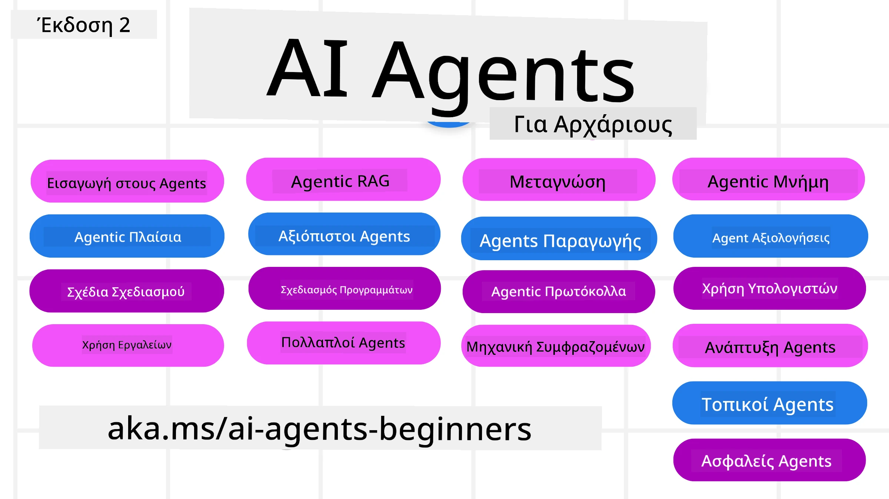

# Πράκτορες Τεχνητής Νοημοσύνης για Αρχάριους - Ένα Μάθημα



## Ένα μάθημα που διδάσκει όλα όσα χρειάζεστε για να ξεκινήσετε να δημιουργείτε Πράκτορες Τεχνητής Νοημοσύνης

[](https://github.com/microsoft/ai-agents-for-beginners/blob/master/LICENSE?WT.mc_id=academic-105485-koreyst)
[](https://GitHub.com/microsoft/ai-agents-for-beginners/graphs/contributors/?WT.mc_id=academic-105485-koreyst)
[](https://GitHub.com/microsoft/ai-agents-for-beginners/issues/?WT.mc_id=academic-105485-koreyst)
[](https://GitHub.com/microsoft/ai-agents-for-beginners/pulls/?WT.mc_id=academic-105485-koreyst)
[](http://makeapullrequest.com?WT.mc_id=academic-105485-koreyst)

### 🌐 Υποστήριξη Πολύγλωσσης

#### Υποστηρίζεται μέσω GitHub Action (Αυτοματοποιημένο & Πάντα Ενημερωμένο)

<!-- CO-OP TRANSLATOR LANGUAGES TABLE START -->
[Arabic](../ar/README.md) | [Bengali](../bn/README.md) | [Bulgarian](../bg/README.md) | [Burmese (Myanmar)](../my/README.md) | [Chinese (Simplified)](../zh-CN/README.md) | [Chinese (Traditional, Hong Kong)](../zh-HK/README.md) | [Chinese (Traditional, Macau)](../zh-MO/README.md) | [Chinese (Traditional, Taiwan)](../zh-TW/README.md) | [Croatian](../hr/README.md) | [Czech](../cs/README.md) | [Danish](../da/README.md) | [Dutch](../nl/README.md) | [Estonian](../et/README.md) | [Finnish](../fi/README.md) | [French](../fr/README.md) | [German](../de/README.md) | [Greek](./README.md) | [Hebrew](../he/README.md) | [Hindi](../hi/README.md) | [Hungarian](../hu/README.md) | [Indonesian](../id/README.md) | [Italian](../it/README.md) | [Japanese](../ja/README.md) | [Kannada](../kn/README.md) | [Khmer](../km/README.md) | [Korean](../ko/README.md) | [Lithuanian](../lt/README.md) | [Malay](../ms/README.md) | [Malayalam](../ml/README.md) | [Marathi](../mr/README.md) | [Nepali](../ne/README.md) | [Nigerian Pidgin](../pcm/README.md) | [Norwegian](../no/README.md) | [Persian (Farsi)](../fa/README.md) | [Polish](../pl/README.md) | [Portuguese (Brazil)](../pt-BR/README.md) | [Portuguese (Portugal)](../pt-PT/README.md) | [Punjabi (Gurmukhi)](../pa/README.md) | [Romanian](../ro/README.md) | [Russian](../ru/README.md) | [Serbian (Cyrillic)](../sr/README.md) | [Slovak](../sk/README.md) | [Slovenian](../sl/README.md) | [Spanish](../es/README.md) | [Swahili](../sw/README.md) | [Swedish](../sv/README.md) | [Tagalog (Filipino)](../tl/README.md) | [Tamil](../ta/README.md) | [Telugu](../te/README.md) | [Thai](../th/README.md) | [Turkish](../tr/README.md) | [Ukrainian](../uk/README.md) | [Urdu](../ur/README.md) | [Vietnamese](../vi/README.md)

> **Προτιμάτε να κάνετε κλωνοποίηση τοπικά;**
>
> Αυτό το αποθετήριο περιλαμβάνει μεταφράσεις σε πάνω από 50 γλώσσες που αυξάνουν σημαντικά το μέγεθος της λήψης. Για να κάνετε κλωνοποίηση χωρίς τις μεταφράσεις, χρησιμοποιήστε sparse checkout:
>
> **Bash / macOS / Linux:**
> ```bash
> git clone --filter=blob:none --sparse https://github.com/microsoft/ai-agents-for-beginners.git
> cd ai-agents-for-beginners
> git sparse-checkout set --no-cone '/*' '!translations' '!translated_images'
> ```
>
> **CMD (Windows):**
> ```cmd
> git clone --filter=blob:none --sparse https://github.com/microsoft/ai-agents-for-beginners.git
> cd ai-agents-for-beginners
> git sparse-checkout set --no-cone "/*" "!translations" "!translated_images"
> ```
>
> Αυτό σας παρέχει όλα όσα χρειάζεστε για να ολοκληρώσετε το μάθημα με πολύ πιο γρήγορη λήψη.
<!-- CO-OP TRANSLATOR LANGUAGES TABLE END -->

**Εάν επιθυμείτε να υποστηριχθούν επιπλέον γλώσσες μετάφρασης, αυτές αναφέρονται [εδώ](https://github.com/Azure/co-op-translator/blob/main/getting_started/supported-languages.md).**

[](https://GitHub.com/microsoft/ai-agents-for-beginners/watchers/?WT.mc_id=academic-105485-koreyst)
[](https://GitHub.com/microsoft/ai-agents-for-beginners/network/?WT.mc_id=academic-105485-koreyst)
[](https://GitHub.com/microsoft/ai-agents-for-beginners/stargazers/?WT.mc_id=academic-105485-koreyst)

[](https://discord.com/invite/ATgtXmAS5D)


## 🌱 Ξεκινώντας

Αυτό το μάθημα έχει μαθήματα που καλύπτουν τα βασικά του χτισίματος Πρακτόρων Τεχνητής Νοημοσύνης. Κάθε μάθημα καλύπτει το δικό του θέμα, οπότε ξεκινήστε όποτε θέλετε!

Υπάρχει υποστήριξη πολλαπλών γλωσσών για αυτό το μάθημα. Μεταβείτε στις [διαθέσιμες γλώσσες εδώ](#-multi-language-support).

Αν είναι η πρώτη φορά που φτιάχνετε με Μοντέλα Γενετικής Τεχνητής Νοημοσύνης, δείτε το μάθημά μας [Generative AI For Beginners](https://aka.ms/genai-beginners), το οποίο περιλαμβάνει 21 μαθήματα για το χτίσιμο με GenAI.

Μην ξεχάσετε να [αποθηκεύσετε (🌟) αυτό το αποθετήριο](https://docs.github.com/en/get-started/exploring-projects-on-github/saving-repositories-with-stars?WT.mc_id=academic-105485-koreyst) και να [φτιάξετε fork αυτό το αποθετήριο](https://github.com/microsoft/ai-agents-for-beginners/fork) για να τρέξετε τον κώδικα.

### Γνωρίστε Άλλους Μαθητές, Λάβετε Απαντήσεις σε Ερωτήσεις

Αν κολλήσετε ή έχετε οποιεσδήποτε ερωτήσεις για το χτίσιμο Πρακτόρων Τεχνητής Νοημοσύνης, μπείτε στο αποκλειστικό κανάλι Discord στο [Microsoft Foundry Discord](https://aka.ms/ai-agents/discord).

### Τι Χρειάζεστε

Κάθε μάθημα σε αυτό το μάθημα περιλαμβάνει παραδείγματα κώδικα, τα οποία μπορείτε να βρείτε στο φάκελο code_samples. Μπορείτε να [φτιάξετε fork αυτό το αποθετήριο](https://github.com/microsoft/ai-agents-for-beginners/fork) για να δημιουργήσετε το δικό σας αντίγραφο.

Τα παραδείγματα κώδικα σε αυτές τις ασκήσεις χρησιμοποιούν το Microsoft Agent Framework με την Υπηρεσία Microsoft Foundry Agent V2:

- [Microsoft Foundry](https://aka.ms/ai-agents-beginners/ai-foundry) - Απαιτείται Λογαριασμός Azure

Αυτό το μάθημα χρησιμοποιεί τα ακόλουθα πλαίσια και υπηρεσίες Πρακτόρων Τεχνητής Νοημοσύνης από τη Microsoft:

- [Microsoft Agent Framework (MAF)](https://aka.ms/ai-agents-beginners/agent-framework)
- [Microsoft Foundry Agent Service V2](https://aka.ms/ai-agents-beginners/ai-agent-service)

Ορισμένα παραδείγματα κώδικα υποστηρίζουν επίσης εναλλακτικούς παρόχους συμβατούς με OpenAI όπως το [MiniMax](https://platform.minimaxi.com/), που προσφέρει μοντέλα μεγάλης μνήμης (έως 204K tokens). Δείτε τις λεπτομέρειες διαμόρφωσης στο [Course Setup](./00-course-setup/README.md).

Για περισσότερες πληροφορίες σχετικά με το πώς να τρέξετε τον κώδικα για αυτό το μάθημα, επισκεφτείτε το [Course Setup](./00-course-setup/README.md).

## 🙏 Θέλετε να βοηθήσετε;

Έχετε προτάσεις ή βρήκατε ορθογραφικά ή λάθη κώδικα; [Ανοίξτε ένα issue](https://github.com/microsoft/ai-agents-for-beginners/issues?WT.mc_id=academic-105485-koreyst) ή [Δημιουργήστε ένα pull request](https://github.com/microsoft/ai-agents-for-beginners/pulls?WT.mc_id=academic-105485-koreyst)


## 📂 Κάθε μάθημα περιλαμβάνει

- Ένα γραπτό μάθημα που βρίσκεται στο README και ένα σύντομο βίντεο
- Παραδείγματα κώδικα Python που χρησιμοποιούν το Microsoft Agent Framework με Microsoft Foundry
- Συνδέσμους σε επιπλέον πηγές για να συνεχίσετε τη μάθησή σας


## 🗃️ Μαθήματα

| **Μάθημα**                                  | **Κείμενο & Κώδικας**                              | **Βίντεο**                                                   | **Επιπλέον Μάθηση**                                                                    |
|----------------------------------------------|----------------------------------------------------|-------------------------------------------------------------|----------------------------------------------------------------------------------------|
| Εισαγωγή σε Πράκτορες Τεχνητής Νοημοσύνης και Περιπτώσεις Χρήσης | [Link](./01-intro-to-ai-agents/README.md)          | [Video](https://youtu.be/3zgm60bXmQk?si=z8QygFvYQv-9WtO1)   | [Link](https://aka.ms/ai-agents-beginners/collection?WT.mc_id=academic-105485-koreyst) |
| Εξερεύνηση Πλαισίων Πρακτόρων                | [Link](./02-explore-agentic-frameworks/README.md)  | [Video](https://youtu.be/ODwF-EZo_O8?si=Vawth4hzVaHv-u0H)   | [Link](https://aka.ms/ai-agents-beginners/collection?WT.mc_id=academic-105485-koreyst) |
| Κατανόηση Προτύπων Σχεδιασμού Πρακτόρων      | [Link](./03-agentic-design-patterns/README.md)     | [Video](https://youtu.be/m9lM8qqoOEA?si=BIzHwzstTPL8o9GF)   | [Link](https://aka.ms/ai-agents-beginners/collection?WT.mc_id=academic-105485-koreyst) |
| Σχεδιαστικό Πρότυπο Χρήσης Εργαλείων          | [Link](./04-tool-use/README.md)                    | [Video](https://youtu.be/vieRiPRx-gI?si=2z6O2Xu2cu_Jz46N)   | [Link](https://aka.ms/ai-agents-beginners/collection?WT.mc_id=academic-105485-koreyst) |
| Agentic RAG                                  | [Link](./05-agentic-rag/README.md)                 | [Video](https://youtu.be/WcjAARvdL7I?si=gKPWsQpKiIlDH9A3)   | [Link](https://aka.ms/ai-agents-beginners/collection?WT.mc_id=academic-105485-koreyst) |
| Δημιουργία Αξιόπιστων Πρακτόρων               | [Link](./06-building-trustworthy-agents/README.md) | [Video](https://youtu.be/iZKkMEGBCUQ?si=jZjpiMnGFOE9L8OK )  | [Link](https://aka.ms/ai-agents-beginners/collection?WT.mc_id=academic-105485-koreyst) |
| Σχεδιαστικό Πρότυπο Σχεδιασμού                | [Link](./07-planning-design/README.md)             | [Video](https://youtu.be/kPfJ2BrBCMY?si=6SC_iv_E5-mzucnC)   | [Link](https://aka.ms/ai-agents-beginners/collection?WT.mc_id=academic-105485-koreyst) |
| Σχεδιαστικό Πρότυπο Πολλαπλών Πρακτόρων       | [Link](./08-multi-agent/README.md)                 | [Video](https://youtu.be/V6HpE9hZEx0?si=rMgDhEu7wXo2uo6g)   | [Link](https://aka.ms/ai-agents-beginners/collection?WT.mc_id=academic-105485-koreyst) |
| Σχέδιο Μεταγνωστικής Σκέψης                 | [Link](./09-metacognition/README.md)               | [Video](https://youtu.be/His9R6gw6Ec?si=8gck6vvdSNCt6OcF)  | [Link](https://aka.ms/ai-agents-beginners/collection?WT.mc_id=academic-105485-koreyst) |
| Πράκτορες Τεχνητής Νοημοσύνης σε Παραγωγή                      | [Link](./10-ai-agents-production/README.md)        | [Video](https://youtu.be/l4TP6IyJxmQ?si=31dnhexRo6yLRJDl)  | [Link](https://aka.ms/ai-agents-beginners/collection?WT.mc_id=academic-105485-koreyst) |
| Χρήση Πρωτοκόλλων Πρακτόρων (MCP, A2A και NLWeb) | [Link](./11-agentic-protocols/README.md)           | [Video](https://youtu.be/X-Dh9R3Opn8)                                 | [Link](https://aka.ms/ai-agents-beginners/collection?WT.mc_id=academic-105485-koreyst) |
| Μηχανική Πλαισίου για Πράκτορες Τεχνητής Νοημοσύνης            | [Link](./12-context-engineering/README.md)         | [Video](https://youtu.be/F5zqRV7gEag)                                 | [Link](https://aka.ms/ai-agents-beginners/collection?WT.mc_id=academic-105485-koreyst) |
| Διαχείριση Μνημονικής των Πρακτόρων                      | [Link](./13-agent-memory/README.md)     |      [Video](https://youtu.be/QrYbHesIxpw?si=vZkVwKrQ4ieCcIPx)                                                      |                                                                                        |
| Εξερεύνηση Πλαισίου Πρακτόρων Microsoft                         | [Link](./14-microsoft-agent-framework/README.md)                            |                                                            |                                                                                        |
| Δημιουργία Πρακτόρων Χρήσης Υπολογιστή (CUA)           | [Link](./15-browser-use/README.md)     |                                                            | [Link](https://docs.browser-use.com/examples/templates/playwright-integration)         |
| Ανάπτυξη Κλιμακούμενων Πρακτόρων                    | Coming Soon                            |                                                            |                                                                                        |
| Δημιουργία Τοπικών Πρακτόρων Τεχνητής Νοημοσύνης                     | Coming Soon                               |                                                            |                                                                                        |
| Ασφάλεια Πρακτόρων Τεχνητής Νοημοσύνης                           | [Link](./18-securing-ai-agents/README.md)  |                                                            | [Link](https://aka.ms/ai-agents-beginners/collection?WT.mc_id=academic-105485-koreyst) |

## 🎒 Άλλα Μαθήματα

Η ομάδα μας παράγει και άλλα μαθήματα! Δείτε:

<!-- CO-OP TRANSLATOR OTHER COURSES START -->
### LangChain
[](https://aka.ms/langchain4j-for-beginners)
[](https://aka.ms/langchainjs-for-beginners?WT.mc_id=m365-94501-dwahlin)
[](https://github.com/microsoft/langchain-for-beginners?WT.mc_id=m365-94501-dwahlin)
---

### Azure / Edge / MCP / Πράκτορες
[](https://github.com/microsoft/AZD-for-beginners?WT.mc_id=academic-105485-koreyst)
[](https://github.com/microsoft/edgeai-for-beginners?WT.mc_id=academic-105485-koreyst)
[](https://github.com/microsoft/mcp-for-beginners?WT.mc_id=academic-105485-koreyst)
[](https://github.com/microsoft/ai-agents-for-beginners?WT.mc_id=academic-105485-koreyst)

---
 
### Σειρά Γενετικής Τεχνητής Νοημοσύνης
[](https://github.com/microsoft/generative-ai-for-beginners?WT.mc_id=academic-105485-koreyst)
[-9333EA?style=for-the-badge&labelColor=E5E7EB&color=9333EA)](https://github.com/microsoft/Generative-AI-for-beginners-dotnet?WT.mc_id=academic-105485-koreyst)
[-C084FC?style=for-the-badge&labelColor=E5E7EB&color=C084FC)](https://github.com/microsoft/generative-ai-for-beginners-java?WT.mc_id=academic-105485-koreyst)
[-E879F9?style=for-the-badge&labelColor=E5E7EB&color=E879F9)](https://github.com/microsoft/generative-ai-with-javascript?WT.mc_id=academic-105485-koreyst)

---
 
### Βασική Μάθηση
[](https://aka.ms/ml-beginners?WT.mc_id=academic-105485-koreyst)
[](https://aka.ms/datascience-beginners?WT.mc_id=academic-105485-koreyst)
[](https://aka.ms/ai-beginners?WT.mc_id=academic-105485-koreyst)
[](https://github.com/microsoft/Security-101?WT.mc_id=academic-96948-sayoung)
[](https://aka.ms/webdev-beginners?WT.mc_id=academic-105485-koreyst)
[](https://aka.ms/iot-beginners?WT.mc_id=academic-105485-koreyst)
[](https://github.com/microsoft/xr-development-for-beginners?WT.mc_id=academic-105485-koreyst)

---
 
### Σειρά Copilot
[](https://aka.ms/GitHubCopilotAI?WT.mc_id=academic-105485-koreyst)
[](https://github.com/microsoft/mastering-github-copilot-for-dotnet-csharp-developers?WT.mc_id=academic-105485-koreyst)
[](https://github.com/microsoft/CopilotAdventures?WT.mc_id=academic-105485-koreyst)
<!-- CO-OP TRANSLATOR OTHER COURSES END -->

## 🌟 Ευχαριστίες Κοινότητας

Ευχαριστούμε τον [Shivam Goyal](https://www.linkedin.com/in/shivam2003/) για τη συνεισφορά σημαντικών δειγμάτων κώδικα που παρουσιάζουν το Agentic RAG.

## Συμμετοχή

Αυτό το έργο καλωσορίζει συνεισφορές και προτάσεις. Οι περισσότερες συνεισφορές απαιτούν τη συμφωνία σας σε μια
Συμφωνία Άδειας Συνεργασίας (CLA) που δηλώνει ότι έχετε το δικαίωμα και πράγματι παραχωρείτε σε εμάς
τα δικαιώματα να χρησιμοποιήσουμε τη συνεισφορά σας. Για λεπτομέρειες, επισκεφθείτε <https://cla.opensource.microsoft.com>.

Όταν υποβάλετε ένα αίτημα έλξης (pull request), ένα bot CLA θα καθορίσει αυτόματα αν χρειάζεται να παράσχετε
CLA και θα διακοσμήσει κατάλληλα το PR (π.χ., έλεγχος κατάστασης, σχόλιο). Απλώς ακολουθήστε τις οδηγίες
που παρέχει το bot. Θα χρειαστεί να το κάνετε μόνο μία φορά για όλα τα αποθετήρια που χρησιμοποιούν το CLA μας.

Αυτό το έργο έχει υιοθετήσει τον [Κώδικα Δεοντολογίας Ανοικτού Κώδικα της Microsoft](https://opensource.microsoft.com/codeofconduct/).
Για περισσότερες πληροφορίες δείτε το [FAQ Κώδικα Δεοντολογίας](https://opensource.microsoft.com/codeofconduct/faq/) ή
επικοινωνήστε με [opencode@microsoft.com](mailto:opencode@microsoft.com) για οποιεσδήποτε επιπλέον ερωτήσεις ή σχόλια.

## Εμπορικά Σήματα

Αυτό το έργο μπορεί να περιέχει εμπορικά σήματα ή λογότυπα για έργα, προϊόντα ή υπηρεσίες. Η εξουσιοδοτημένη χρήση των εμπορικών σημάτων ή λογότυπων της Microsoft
υπόκειται σε και πρέπει να ακολουθεί
[Τις Οδηγίες Χρήσης Εμπορικών Σημάτων & Μάρκας της Microsoft](https://www.microsoft.com/legal/intellectualproperty/trademarks/usage/general).
Η χρήση εμπορικών σημάτων ή λογότυπων της Microsoft σε τροποποιημένες εκδόσεις αυτού του έργου δεν πρέπει να προκαλεί σύγχυση ή να υποδηλώνει χορηγία από τη Microsoft.
Οποιαδήποτε χρήση εμπορικών σημάτων ή λογότυπων τρίτων υπόκειται στις πολιτικές εκείνων των τρίτων.

## Λήψη Βοήθειας


Εάν κολλήσετε ή έχετε οποιεσδήποτε ερωτήσεις σχετικά με την κατασκευή εφαρμογών τεχνητής νοημοσύνης, συμμετέχετε:

[](https://aka.ms/foundry/discord)

Αν έχετε σχόλια προϊόντος ή σφάλματα κατά την ανάπτυξη επισκεφθείτε:

[](https://aka.ms/foundry/forum)

---

<!-- CO-OP TRANSLATOR DISCLAIMER START -->
**Αποποίηση ευθυνών**:
Αυτό το έγγραφο έχει μεταφραστεί χρησιμοποιώντας την υπηρεσία μετάφρασης με τεχνητή νοημοσύνη [Co-op Translator](https://github.com/Azure/co-op-translator). Ενώ επιδιώκουμε την ακρίβεια, παρακαλούμε να έχετε υπόψη ότι οι αυτοματοποιημένες μεταφράσεις ενδέχεται να περιέχουν λάθη ή ανακρίβειες. Το πρωτότυπο έγγραφο στη μητρική του γλώσσα πρέπει να θεωρείται η αυθεντική πηγή. Για κρίσιμες πληροφορίες, συνιστάται επαγγελματική ανθρώπινη μετάφραση. Δεν φέρουμε ευθύνη για τυχόν παρεξηγήσεις ή λανθασμένες ερμηνείες που προκύπτουν από τη χρήση αυτής της μετάφρασης.
<!-- CO-OP TRANSLATOR DISCLAIMER END -->