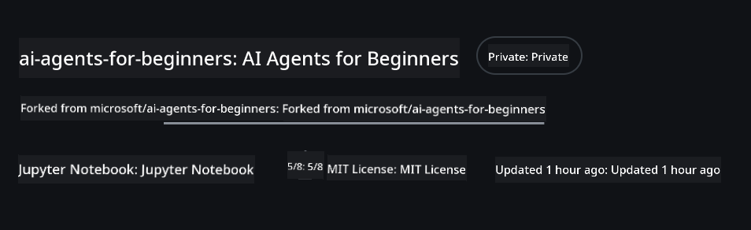
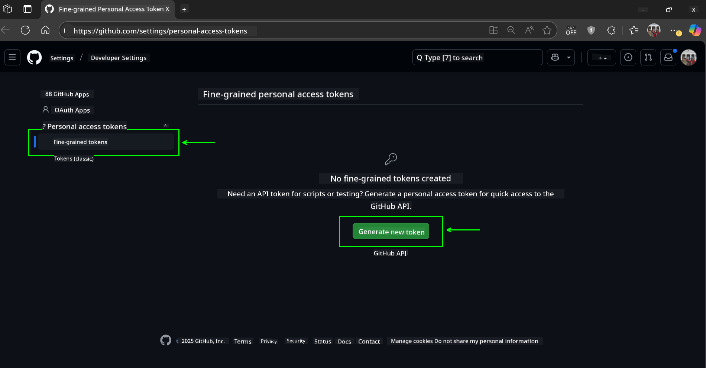
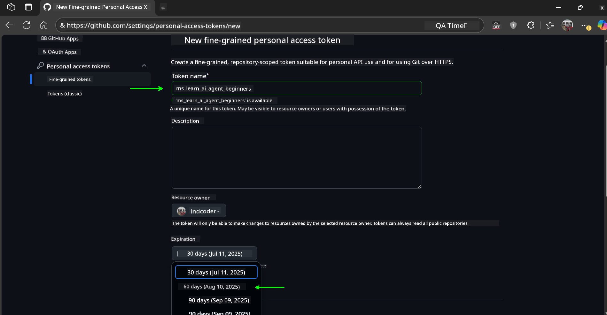
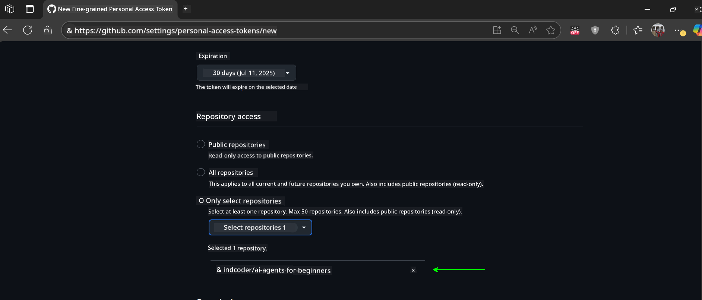
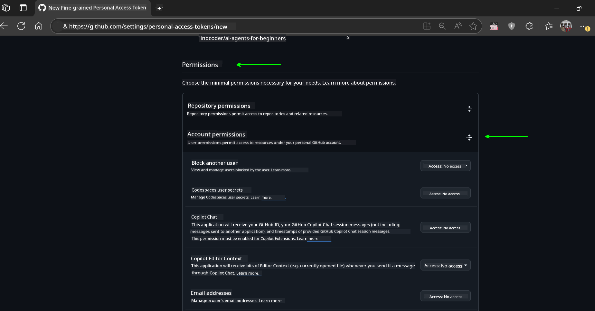
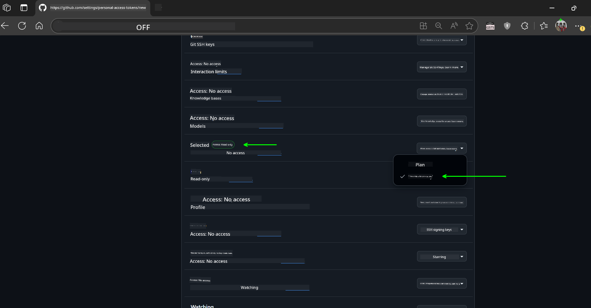
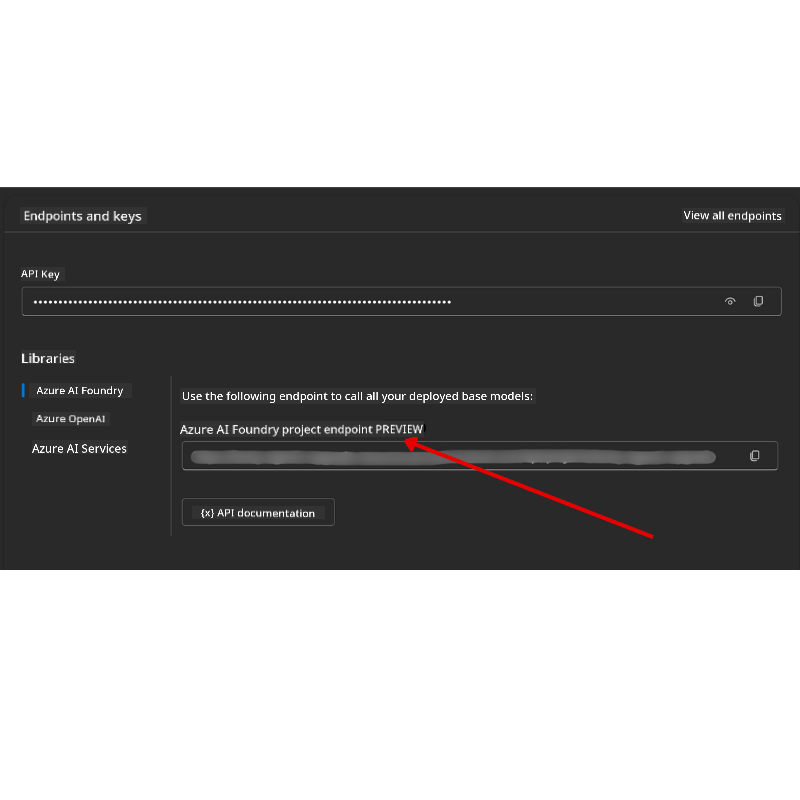

<!--
CO_OP_TRANSLATOR_METADATA:
{
  "original_hash": "c6a79c8f2b56a80370ff7e447765524f",
  "translation_date": "2025-07-24T07:29:24+00:00",
  "source_file": "00-course-setup/README.md",
  "language_code": "en"
}
-->
# Course Setup

## Introduction

This lesson will guide you on how to run the code samples provided in this course.

## Clone or Fork this Repo

To get started, clone or fork the GitHub repository. This will create your own version of the course materials, allowing you to run, test, and modify the code as needed.

You can do this by clicking the link to:

You should now have your own forked version of this course at the following link:



## Running the Code

This course includes a series of Jupyter Notebooks that provide hands-on experience in building AI Agents.

The code samples use one of the following:

**Requires GitHub Account - Free**:

1) Semantic Kernel Agent Framework + GitHub Models Marketplace. Labeled as (semantic-kernel.ipynb)  
2) AutoGen Framework + GitHub Models Marketplace. Labeled as (autogen.ipynb)  

**Requires Azure Subscription**:  
3) Azure AI Foundry + Azure AI Agent Service. Labeled as (azureaiagent.ipynb)  

We recommend trying all three types of examples to determine which one works best for you.

The setup steps you need to follow depend on the option you choose:

## Requirements

- Python 3.12+  
  - **NOTE**: If Python 3.12 is not installed, make sure to install it. Then create your virtual environment using Python 3.12 to ensure the correct versions are installed from the `requirements.txt` file.  
- A GitHub Account - For access to the GitHub Models Marketplace  
- Azure Subscription - For access to Azure AI Foundry  
- Azure AI Foundry Account - For access to the Azure AI Agent Service  

A `requirements.txt` file is included in the root of this repository, listing all the required Python packages for running the code samples.

Install the packages by running the following command in your terminal at the root of the repository:

```bash
pip install -r requirements.txt
```

We recommend creating a Python virtual environment to avoid conflicts and issues.

## Setup VSCode

Ensure that the correct version of Python is selected in VSCode.


## Set Up for Samples using GitHub Models 

### Step 1: Retrieve Your GitHub Personal Access Token (PAT)

This course uses the GitHub Models Marketplace, which provides free access to Large Language Models (LLMs) for building AI Agents.

To use GitHub Models, you need to create a [GitHub Personal Access Token](https://docs.github.com/en/authentication/keeping-your-account-and-data-secure/managing-your-personal-access-tokens).

You can do this by navigating to your GitHub Account.

Follow the [Principle of Least Privilege](https://docs.github.com/en/get-started/learning-to-code/storing-your-secrets-safely) when creating your token. This means granting only the permissions necessary to run the code samples in this course.

1. Select the `Fine-grained tokens` option on the left side of your screen.  
   Then click `Generate new token`.  

   

2. Enter a descriptive name for your token to reflect its purpose, making it easy to identify later. Set an expiration date (recommended: 30 days; you can choose a shorter period like 7 days for added security).  

   

3. Limit the token's scope to your fork of this repository.  

   

4. Restrict the token's permissions: Under **Permissions**, toggle **Account Permissions**, navigate to **Models**, and enable only the read-access required for GitHub Models.  

     
     

Copy the newly created token. You will now add this to your `.env` file included in this course.

### Step 2: Create Your `.env` File

To create your `.env` file, run the following command in your terminal:

```bash
cp .env.example .env
```

This will copy the example file and create a `.env` file in your directory, where you can fill in the values for the environment variables.

Open the `.env` file in your preferred text editor and paste your token into the `GITHUB_TOKEN` field.

You should now be ready to run the code samples in this course.

## Set Up for Samples using Azure AI Foundry and Azure AI Agent Service

### Step 1: Retrieve Your Azure Project Endpoint

Follow the steps to create a hub and project in Azure AI Foundry as described here: [Hub resources overview](https://learn.microsoft.com/en-us/azure/ai-foundry/concepts/ai-resources).

Once your project is created, retrieve the connection string for your project.

You can find this on the **Overview** page of your project in the Azure AI Foundry portal.



### Step 2: Create Your `.env` File

To create your `.env` file, run the following command in your terminal:

```bash
cp .env.example .env
```

This will copy the example file and create a `.env` file in your directory, where you can fill in the values for the environment variables.

Open the `.env` file in your preferred text editor and paste your token into the `PROJECT_ENDPOINT` field.

### Step 3: Sign in to Azure

As a security best practice, use [keyless authentication](https://learn.microsoft.com/azure/developer/ai/keyless-connections?tabs=csharp%2Cazure-cli?WT.mc_id=academic-105485-koreyst) to authenticate to Azure OpenAI with Microsoft Entra ID.

Open a terminal and run `az login --use-device-code` to sign in to your Azure account.

After logging in, select your subscription in the terminal.

## Additional Environment Variables - Azure Search and Azure OpenAI 

For the Agentic RAG Lesson (Lesson 5), some samples use Azure Search and Azure OpenAI.

To run these samples, add the following environment variables to your `.env` file:

### Overview Page (Project)

- `AZURE_SUBSCRIPTION_ID` - Found under **Project details** on the **Overview** page of your project.  
- `AZURE_AI_PROJECT_NAME` - Located at the top of the **Overview** page for your project.  
- `AZURE_OPENAI_SERVICE` - Found in the **Included capabilities** tab for **Azure OpenAI Service** on the **Overview** page.  

### Management Center

- `AZURE_OPENAI_RESOURCE_GROUP` - Found under **Project properties** on the **Overview** page of the **Management Center**.  
- `GLOBAL_LLM_SERVICE` - Found under **Connected resources**. If not listed, check the **Azure portal** under your resource group for the AI Services resource name.  

### Models + Endpoints Page

- `AZURE_OPENAI_EMBEDDING_DEPLOYMENT_NAME` - Select your embedding model (e.g., `text-embedding-ada-002`) and note the **Deployment name** from the model details.  
- `AZURE_OPENAI_CHAT_DEPLOYMENT_NAME` - Select your chat model (e.g., `gpt-4o-mini`) and note the **Deployment name** from the model details.  

### Azure Portal

- `AZURE_OPENAI_ENDPOINT` - Found under **Azure AI services**, click on it, then go to **Resource Management**, **Keys and Endpoint**, and scroll down to the "Azure OpenAI endpoints" section. Copy the endpoint labeled "Language APIs".  
- `AZURE_OPENAI_API_KEY` - From the same screen, copy KEY 1 or KEY 2.  
- `AZURE_SEARCH_SERVICE_ENDPOINT` - Found under your **Azure AI Search** resource in the **Overview** section.  
- `AZURE_SEARCH_API_KEY` - Found under **Settings**, then **Keys**, where you can copy the primary or secondary admin key.  

### External Webpage

- `AZURE_OPENAI_API_VERSION` - Found on the [API version lifecycle](https://learn.microsoft.com/en-us/azure/ai-services/openai/api-version-deprecation#latest-ga-api-release) page under **Latest GA API release**.  

### Setup Keyless Authentication

Instead of hardcoding your credentials, use a keyless connection with Azure OpenAI. To do this, import `DefaultAzureCredential` and call the `DefaultAzureCredential` function to retrieve the credential.

```python
from azure.identity import DefaultAzureCredential, InteractiveBrowserCredential
```

## Stuck Somewhere?

If you encounter any issues during setup, feel free to join our community or support channels for assistance.

## Next Lesson

You are now ready to run the code for this course. Enjoy exploring the world of AI Agents!  

[Introduction to AI Agents and Agent Use Cases](../01-intro-to-ai-agents/README.md)  

**Disclaimer**:  
This document has been translated using the AI translation service [Co-op Translator](https://github.com/Azure/co-op-translator). While we aim for accuracy, please note that automated translations may include errors or inaccuracies. The original document in its native language should be regarded as the authoritative source. For critical information, professional human translation is advised. We are not responsible for any misunderstandings or misinterpretations resulting from the use of this translation.