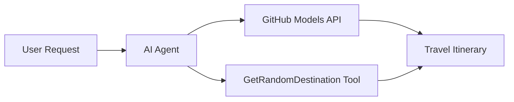

<!--
CO_OP_TRANSLATOR_METADATA:
{
  "original_hash": "23afd9be7b6ba5b69a44c3b6a78e07f6",
  "translation_date": "2025-11-06T10:00:56+00:00",
  "source_file": "01-intro-to-ai-agents/code_samples/01-dotnet-agent-framework.md",
  "language_code": "en"
}
-->
# 🌍 AI Travel Agent with Microsoft Agent Framework (.NET)

## 📋 Scenario Overview

This notebook showcases how to create an intelligent travel planning agent using the Microsoft Agent Framework for .NET. The agent is capable of automatically generating personalized day-trip itineraries for random destinations worldwide.

**Key Features:**
- 🎲 **Random Destination Selection**: Utilizes a custom tool to choose vacation spots
- 🗺️ **Smart Trip Planning**: Develops detailed day-by-day itineraries
- 🔄 **Real-time Streaming**: Offers both instant and streaming responses
- 🛠️ **Custom Tool Integration**: Demonstrates how to expand agent functionalities

## 🔧 Technical Architecture

### Core Technologies
- **Microsoft Agent Framework**: The latest .NET implementation for developing AI agents
- **GitHub Models Integration**: Employs GitHub's AI model inference service
- **OpenAI API Compatibility**: Utilizes OpenAI client libraries with custom endpoints
- **Secure Configuration**: API key management based on environment variables

### Key Components
1. **AIAgent**: The primary agent orchestrator managing conversation flow
2. **Custom Tools**: `GetRandomDestination()` function accessible to the agent
3. **Chat Client**: Conversation interface powered by GitHub Models
4. **Streaming Support**: Capability for generating real-time responses

### Integration Pattern


## 🚀 Getting Started

**Prerequisites:**
- .NET 10.0 or higher
- GitHub Models API access token
- Environment variables set up in `.env` file

**Required Environment Variables:**
```env
GITHUB_TOKEN=your_github_token
GITHUB_ENDPOINT=https://models.inference.ai.azure.com
GITHUB_MODEL_ID=gpt-4o-mini
```

Execute the code sample below step-by-step to see the travel agent in action!

---

## .NET Single File App: AI Travel Agent Example

Refer to `01-dotnet-agent-framework.cs` for the complete runnable code sample.

```bash
dotnet run 01-dotnet-agent-framework.cs
```

### Sample Code

```csharp
static string GetRandomDestination()
{
    var destinations = new List<string>
    {
        "Paris, France",
        "Tokyo, Japan",
        "New York City, USA",
        "Sydney, Australia",
        "Rome, Italy",
        "Barcelona, Spain",
        "Cape Town, South Africa",
        "Rio de Janeiro, Brazil",
        "Bangkok, Thailand",
        "Vancouver, Canada"
    };
    var random = new Random();
    int index = random.Next(destinations.Count);
    return destinations[index];
}

// Extract configuration from environment variables
var github_endpoint = Environment.GetEnvironmentVariable("GITHUB_ENDPOINT") ?? throw new InvalidOperationException("GITHUB_ENDPOINT is not set.");
var github_model_id = Environment.GetEnvironmentVariable("GITHUB_MODEL_ID") ?? "gpt-4o-mini";
var github_token = Environment.GetEnvironmentVariable("GITHUB_TOKEN") ?? throw new InvalidOperationException("GITHUB_TOKEN is not set.");

// Configure OpenAI Client Options
var openAIOptions = new OpenAIClientOptions()
{
    Endpoint = new Uri(github_endpoint)
};

// Initialize OpenAI Client with GitHub Models Configuration
var openAIClient = new OpenAIClient(new ApiKeyCredential(github_token), openAIOptions);

// Create AI Agent with Travel Planning Capabilities
AIAgent agent = openAIClient
    .GetChatClient(github_model_id)
    .CreateAIAgent(
        instructions: "You are a helpful AI Agent that can help plan vacations for customers at random destinations",
        tools: [AIFunctionFactory.Create(GetRandomDestination)]
    );

// Execute Agent: Plan a Day Trip (Non-Streaming)
Console.WriteLine(await agent.RunAsync("Plan me a day trip"));

// Execute Agent: Plan a Day Trip (Streaming Response)
await foreach (var update in agent.RunStreamingAsync("Plan me a day trip"))
{
    Console.Write(update);
}
```

---

**Disclaimer**:  
This document has been translated using the AI translation service [Co-op Translator](https://github.com/Azure/co-op-translator). While we aim for accuracy, please note that automated translations may include errors or inaccuracies. The original document in its native language should be regarded as the authoritative source. For critical information, professional human translation is advised. We are not responsible for any misunderstandings or misinterpretations resulting from the use of this translation.