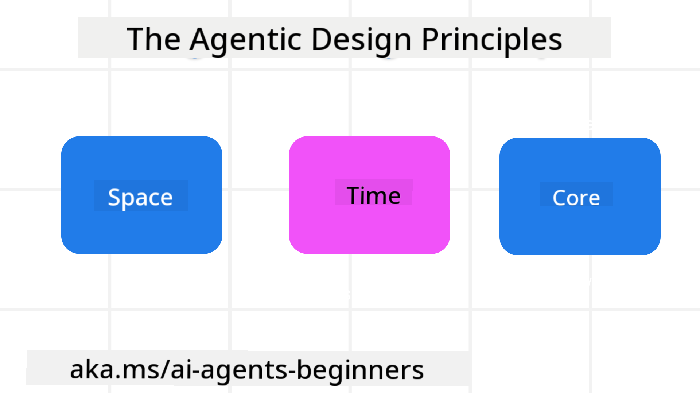

<!--
CO_OP_TRANSLATOR_METADATA:
{
  "original_hash": "4c46e4ff9e349c521e2b0b17f51afa64",
  "translation_date": "2025-08-30T07:05:39+00:00",
  "source_file": "03-agentic-design-patterns/README.md",
  "language_code": "en"
}
-->

> _(Click the image above to view video of this lesson)_
# AI Agentic Design Principles

## Introduction

There are many ways to approach building AI Agentic Systems. Since ambiguity is an inherent feature of Generative AI design, it can sometimes be challenging for engineers to determine where to begin. To help developers create customer-focused agentic systems that address their business needs, we’ve developed a set of human-centric UX Design Principles. These principles are not a rigid framework but rather a starting point for teams designing and building agent experiences.

In general, agents should:

- Expand and enhance human capabilities (brainstorming, problem-solving, automation, etc.)
- Bridge knowledge gaps (helping users get up to speed on specific topics, translation, etc.)
- Facilitate and support collaboration in ways that align with individual preferences for working with others
- Help us become better versions of ourselves (e.g., acting as a life coach/task manager, teaching emotional regulation and mindfulness skills, fostering resilience, etc.)

## This Lesson Will Cover

- What the Agentic Design Principles are
- Guidelines for implementing these design principles
- Examples of applying the design principles

## Learning Goals

After completing this lesson, you will be able to:

1. Explain what the Agentic Design Principles are
2. Describe the guidelines for applying the Agentic Design Principles
3. Understand how to create an agent using the Agentic Design Principles

## The Agentic Design Principles

### Agent (Space)

This refers to the environment in which the agent operates. These principles guide the design of agents for engaging in both physical and digital worlds.

- **Connecting, not collapsing** – Facilitate connections between people, events, and actionable knowledge to promote collaboration and interaction.
  - Agents help link events, knowledge, and individuals.
  - Agents foster closer connections between people. They are not intended to replace or diminish human roles.
- **Easily accessible yet occasionally invisible** – The agent primarily operates in the background, stepping in only when it’s relevant and appropriate.
  - The agent is easily discoverable and accessible to authorized users on any device or platform.
  - The agent supports multimodal inputs and outputs (e.g., sound, voice, text).
  - The agent can seamlessly shift between foreground and background roles, as well as between proactive and reactive modes, depending on the user’s needs.
  - The agent may operate invisibly, but its background processes and collaboration with other agents remain transparent and controllable by the user.

### Agent (Time)

This pertains to how the agent functions over time. These principles guide the design of agents interacting across past, present, and future contexts.

- **Past**: Reflecting on history, including both state and context.
  - The agent provides more relevant results by analyzing richer historical data beyond just events, people, or states.
  - The agent draws connections from past events and actively reflects on memory to engage with current situations.
- **Now**: Nudging rather than merely notifying.
  - The agent adopts a holistic approach to interacting with users. When an event occurs, the agent goes beyond static notifications or formalities. It can simplify workflows or dynamically generate cues to direct the user’s attention at the right moment.
  - The agent delivers information tailored to the contextual environment, social and cultural dynamics, and user intent.
  - The agent’s interactions can evolve gradually, growing in complexity to empower users over time.
- **Future**: Adapting and evolving.
  - The agent adapts to various devices, platforms, and modalities.
  - The agent adjusts to user behavior, accessibility needs, and is freely customizable.
  - The agent evolves through continuous user interaction and feedback.

### Agent (Core)

These are the fundamental elements at the heart of an agent’s design.

- **Embrace uncertainty but establish trust**.
  - A certain degree of uncertainty is inherent in agent design. It’s an expected feature.
  - Trust and transparency are foundational to agent design.
  - Users maintain control over when the agent is active or inactive, and the agent’s status is always clearly visible.

## The Guidelines to Implement These Principles

When applying the design principles outlined above, follow these guidelines:

1. **Transparency**: Inform users that AI is involved, explain how it works (including past actions), and provide ways for users to give feedback and adjust the system.
2. **Control**: Allow users to customize, set preferences, and personalize the system. Ensure they have control over the system’s attributes (including the ability to delete data).
3. **Consistency**: Strive for consistent, multimodal experiences across devices and platforms. Use familiar UI/UX elements where possible (e.g., a microphone icon for voice interaction) and minimize cognitive load for users (e.g., concise responses, visual aids, and ‘Learn More’ options).

## How To Design a Travel Agent using These Principles and Guidelines

Imagine you’re designing a Travel Agent. Here’s how you might apply the Design Principles and Guidelines:

1. **Transparency** – Inform users that the Travel Agent is AI-powered. Provide basic instructions for getting started (e.g., a “Hello” message, sample prompts). Clearly document this on the product page. Display a history of prompts the user has previously asked. Make it clear how to provide feedback (e.g., thumbs up/down, a “Send Feedback” button). Clearly state any usage or topic restrictions for the agent.
2. **Control** – Ensure users can modify the agent after it’s been created, such as by adjusting the System Prompt. Allow users to choose the agent’s verbosity, writing style, and any topics it should avoid. Enable users to view and delete associated files, data, prompts, and past conversations.
3. **Consistency** – Use standard, recognizable icons for actions like sharing prompts, adding files or photos, and tagging people or items. For example, use a paperclip icon for file uploads/sharing and an image icon for uploading graphics.

### Got More Questions about AI Agentic Design Patterns?

Join the [Azure AI Foundry Discord](https://aka.ms/ai-agents/discord) to connect with other learners, attend office hours, and get your AI Agent questions answered.

## Additional Resources

- 

## Previous Lesson

[Exploring Agentic Frameworks](../02-explore-agentic-frameworks/README.md)

## Next Lesson

[Tool Use Design Pattern](../04-tool-use/README.md)

---

**Disclaimer**:  
This document has been translated using the AI translation service [Co-op Translator](https://github.com/Azure/co-op-translator). While we strive for accuracy, please note that automated translations may contain errors or inaccuracies. The original document in its native language should be regarded as the authoritative source. For critical information, professional human translation is recommended. We are not responsible for any misunderstandings or misinterpretations resulting from the use of this translation.