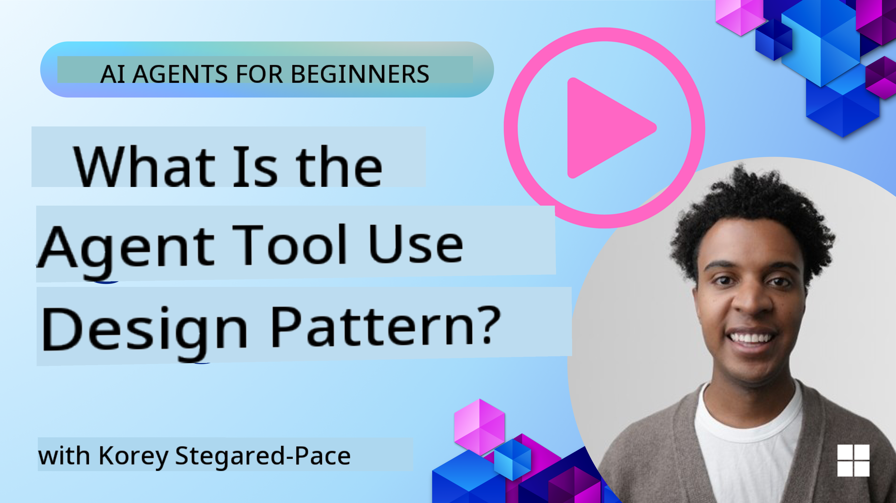
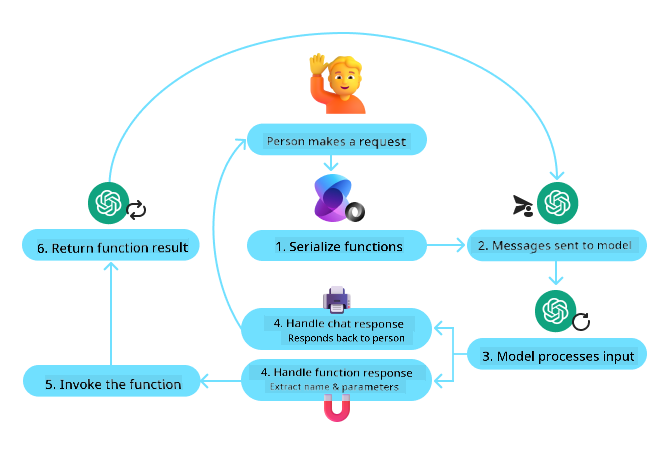
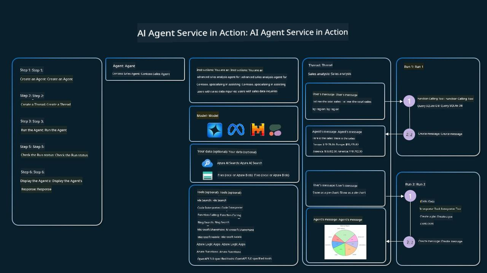

<!--
CO_OP_TRANSLATOR_METADATA:
{
  "original_hash": "4a5ccc4ad1dba85fbc2087cf3b986544",
  "translation_date": "2025-08-30T07:02:33+00:00",
  "source_file": "04-tool-use/README.md",
  "language_code": "en"
}
-->
[](https://youtu.be/vieRiPRx-gI?si=cEZ8ApnT6Sus9rhn)

> _(Click the image above to view video of this lesson)_

# Tool Use Design Pattern

Tools are fascinating because they expand the range of capabilities AI agents can have. Instead of being limited to a predefined set of actions, an agent equipped with a tool can perform a much wider variety of tasks. In this chapter, we’ll explore the Tool Use Design Pattern, which explains how AI agents can utilize specific tools to achieve their objectives.

## Introduction

In this lesson, we aim to answer the following questions:

- What is the Tool Use Design Pattern?
- What are the use cases where it can be applied?
- What are the essential components needed to implement this design pattern?
- What are the key considerations for building trustworthy AI agents using the Tool Use Design Pattern?

## Learning Goals

By the end of this lesson, you will be able to:

- Define the Tool Use Design Pattern and its purpose.
- Identify scenarios where the Tool Use Design Pattern is applicable.
- Understand the core components required to implement the design pattern.
- Recognize considerations for ensuring trustworthiness in AI agents using this design pattern.

## What is the Tool Use Design Pattern?

The **Tool Use Design Pattern** is about enabling LLMs to interact with external tools to accomplish specific tasks. Tools are essentially code that an agent can execute to perform actions. A tool could be as simple as a calculator function or as complex as an API call to a third-party service, like retrieving stock prices or weather forecasts. In the context of AI agents, tools are designed to be executed in response to **model-generated function calls**.

## What are the use cases it can be applied to?

AI agents can use tools to handle complex tasks, gather information, or make decisions. The Tool Use Design Pattern is particularly useful in scenarios requiring dynamic interaction with external systems, such as databases, web services, or code interpreters. Some common use cases include:

- **Dynamic Information Retrieval:** Agents can query external APIs or databases to fetch real-time data (e.g., querying a SQLite database for analysis, retrieving stock prices, or checking the weather).
- **Code Execution and Interpretation:** Agents can run code or scripts to solve mathematical problems, generate reports, or perform simulations.
- **Workflow Automation:** Automating repetitive or multi-step workflows by integrating tools like task schedulers, email services, or data pipelines.
- **Customer Support:** Agents can interact with CRM systems, ticketing platforms, or knowledge bases to resolve user queries.
- **Content Generation and Editing:** Agents can use tools like grammar checkers, text summarizers, or content safety evaluators to assist with content creation tasks.

## What are the elements/building blocks needed to implement the Tool Use Design Pattern?

These components enable AI agents to perform a wide variety of tasks. Let’s break down the key elements required to implement the Tool Use Design Pattern:

- **Function/Tool Schemas:** Detailed descriptions of available tools, including their names, purposes, required parameters, and expected outputs. These schemas help the LLM understand what tools are available and how to construct valid requests.
- **Function Execution Logic:** Determines how and when tools are invoked based on the user’s intent and the conversation context. This may involve planner modules, routing mechanisms, or conditional flows to dynamically decide tool usage.
- **Message Handling System:** Manages the conversational flow between user inputs, LLM responses, tool calls, and tool outputs.
- **Tool Integration Framework:** Connects the agent to various tools, whether they are simple functions or complex external services.
- **Error Handling & Validation:** Handles failures in tool execution, validates parameters, and manages unexpected responses.
- **State Management:** Tracks conversation context, previous tool interactions, and persistent data to ensure consistency across multi-turn interactions.

Next, let’s dive deeper into Function/Tool Calling.

### Function/Tool Calling

Function calling is the primary mechanism that allows Large Language Models (LLMs) to interact with tools. The terms 'Function' and 'Tool' are often used interchangeably because 'functions' (reusable blocks of code) are the 'tools' agents use to perform tasks. For a function to be executed, the LLM compares the user’s request with the function’s description. A schema containing descriptions of all available functions is sent to the LLM, which then selects the most appropriate function for the task and returns its name and arguments. The selected function is executed, its response is sent back to the LLM, and the LLM uses this information to respond to the user’s request.

To implement function calling for agents, developers need:

1. An LLM model that supports function calling.
2. A schema containing function descriptions.
3. The code for each described function.

Here’s an example of retrieving the current time in a city:

1. **Initialize an LLM that supports function calling:**

    Not all models support function calling, so it’s important to verify that the LLM you’re using does. For instance, <a href="https://learn.microsoft.com/azure/ai-services/openai/how-to/function-calling" target="_blank">Azure OpenAI</a> supports function calling. Start by initializing the Azure OpenAI client.

    ```python
    # Initialize the Azure OpenAI client
    client = AzureOpenAI(
        azure_endpoint = os.getenv("AZURE_OPENAI_ENDPOINT"), 
        api_key=os.getenv("AZURE_OPENAI_API_KEY"),  
        api_version="2024-05-01-preview"
    )
    ```

2. **Create a Function Schema:**

    Define a JSON schema that includes the function name, a description of its purpose, and the names and descriptions of its parameters. Pass this schema to the client along with the user’s request (e.g., finding the time in San Francisco). Note that the LLM returns a **tool call**, not the final answer. As mentioned earlier, the LLM provides the name of the selected function and the arguments to be passed to it.

    ```python
    # Function description for the model to read
    tools = [
        {
            "type": "function",
            "function": {
                "name": "get_current_time",
                "description": "Get the current time in a given location",
                "parameters": {
                    "type": "object",
                    "properties": {
                        "location": {
                            "type": "string",
                            "description": "The city name, e.g. San Francisco",
                        },
                    },
                    "required": ["location"],
                },
            }
        }
    ]
    ```
   
    ```python
  
    # Initial user message
    messages = [{"role": "user", "content": "What's the current time in San Francisco"}] 
  
    # First API call: Ask the model to use the function
      response = client.chat.completions.create(
          model=deployment_name,
          messages=messages,
          tools=tools,
          tool_choice="auto",
      )
  
      # Process the model's response
      response_message = response.choices[0].message
      messages.append(response_message)
  
      print("Model's response:")  

      print(response_message)
  
    ```

    ```bash
    Model's response:
    ChatCompletionMessage(content=None, role='assistant', function_call=None, tool_calls=[ChatCompletionMessageToolCall(id='call_pOsKdUlqvdyttYB67MOj434b', function=Function(arguments='{"location":"San Francisco"}', name='get_current_time'), type='function')])
    ```
  
3. **Implement the function code to perform the task:**

    Once the LLM selects the function, the corresponding code must be implemented and executed. For example, you can write Python code to get the current time. Additionally, you’ll need to extract the function name and arguments from the response_message to obtain the final result.

    ```python
      def get_current_time(location):
        """Get the current time for a given location"""
        print(f"get_current_time called with location: {location}")  
        location_lower = location.lower()
        
        for key, timezone in TIMEZONE_DATA.items():
            if key in location_lower:
                print(f"Timezone found for {key}")  
                current_time = datetime.now(ZoneInfo(timezone)).strftime("%I:%M %p")
                return json.dumps({
                    "location": location,
                    "current_time": current_time
                })
      
        print(f"No timezone data found for {location_lower}")  
        return json.dumps({"location": location, "current_time": "unknown"})
    ```

    ```python
     # Handle function calls
      if response_message.tool_calls:
          for tool_call in response_message.tool_calls:
              if tool_call.function.name == "get_current_time":
     
                  function_args = json.loads(tool_call.function.arguments)
     
                  time_response = get_current_time(
                      location=function_args.get("location")
                  )
     
                  messages.append({
                      "tool_call_id": tool_call.id,
                      "role": "tool",
                      "name": "get_current_time",
                      "content": time_response,
                  })
      else:
          print("No tool calls were made by the model.")  
  
      # Second API call: Get the final response from the model
      final_response = client.chat.completions.create(
          model=deployment_name,
          messages=messages,
      )
  
      return final_response.choices[0].message.content
     ```

    ```bash
      get_current_time called with location: San Francisco
      Timezone found for san francisco
      The current time in San Francisco is 09:24 AM.
     ```

Function calling is central to most agent tool use designs, but implementing it from scratch can be challenging. As discussed in [Lesson 2](../../../02-explore-agentic-frameworks), agentic frameworks provide pre-built components to simplify tool use implementation.

## Tool Use Examples with Agentic Frameworks

Here are examples of how to implement the Tool Use Design Pattern using different agentic frameworks:

### Semantic Kernel

<a href="https://learn.microsoft.com/azure/ai-services/agents/overview" target="_blank">Semantic Kernel</a> is an open-source AI framework for .NET, Python, and Java developers working with Large Language Models (LLMs). It simplifies function calling by automatically describing your functions and their parameters to the model through a process called <a href="https://learn.microsoft.com/semantic-kernel/concepts/ai-services/chat-completion/function-calling/?pivots=programming-language-python#1-serializing-the-functions" target="_blank">serializing</a>. It also manages the communication between the model and your code. Additionally, Semantic Kernel provides pre-built tools like <a href="https://github.com/microsoft/semantic-kernel/blob/main/python/samples/getting_started_with_agents/openai_assistant/step4_assistant_tool_file_search.py" target="_blank">File Search</a> and <a href="https://github.com/microsoft/semantic-kernel/blob/main/python/samples/getting_started_with_agents/openai_assistant/step3_assistant_tool_code_interpreter.py" target="_blank">Code Interpreter</a>.

The following diagram illustrates the function calling process with Semantic Kernel:



In Semantic Kernel, functions/tools are referred to as <a href="https://learn.microsoft.com/semantic-kernel/concepts/plugins/?pivots=programming-language-python" target="_blank">Plugins</a>. You can convert the `get_current_time` function into a plugin by encapsulating it in a class and using the `kernel_function` decorator to provide a description. When you create a kernel with the GetCurrentTimePlugin, the kernel automatically serializes the function and its parameters, generating the schema to send to the LLM.

```python
from semantic_kernel.functions import kernel_function

class GetCurrentTimePlugin:
    async def __init__(self, location):
        self.location = location

    @kernel_function(
        description="Get the current time for a given location"
    )
    def get_current_time(location: str = ""):
        ...

```

```python 
from semantic_kernel import Kernel

# Create the kernel
kernel = Kernel()

# Create the plugin
get_current_time_plugin = GetCurrentTimePlugin(location)

# Add the plugin to the kernel
kernel.add_plugin(get_current_time_plugin)
```
  
### Azure AI Agent Service

<a href="https://learn.microsoft.com/azure/ai-services/agents/overview" target="_blank">Azure AI Agent Service</a> is a newer agentic framework designed to help developers securely build, deploy, and scale high-quality, extensible AI agents without managing the underlying compute and storage resources. It’s particularly useful for enterprise applications, as it offers enterprise-grade security and is fully managed.

Compared to using the LLM API directly, Azure AI Agent Service offers several advantages:

- Automatic tool calling – no need to parse tool calls, invoke tools, or handle responses; all of this is managed server-side.
- Securely managed data – conversation state is stored in threads, eliminating the need for manual state management.
- Pre-built tools – tools for interacting with data sources, such as Bing, Azure AI Search, and Azure Functions.

The tools in Azure AI Agent Service fall into two categories:

1. Knowledge Tools:
    - <a href="https://learn.microsoft.com/azure/ai-services/agents/how-to/tools/bing-grounding?tabs=python&pivots=overview" target="_blank">Grounding with Bing Search</a>
    - <a href="https://learn.microsoft.com/azure/ai-services/agents/how-to/tools/file-search?tabs=python&pivots=overview" target="_blank">File Search</a>
    - <a href="https://learn.microsoft.com/azure/ai-services/agents/how-to/tools/azure-ai-search?tabs=azurecli%2Cpython&pivots=overview-azure-ai-search" target="_blank">Azure AI Search</a>

2. Action Tools:
    - <a href="https://learn.microsoft.com/azure/ai-services/agents/how-to/tools/function-calling?tabs=python&pivots=overview" target="_blank">Function Calling</a>
    - <a href="https://learn.microsoft.com/azure/ai-services/agents/how-to/tools/code-interpreter?tabs=python&pivots=overview" target="_blank">Code Interpreter</a>
    - <a href="https://learn.microsoft.com/azure/ai-services/agents/how-to/tools/openapi-spec?tabs=python&pivots=overview" target="_blank">OpenAI defined tools</a>
    - <a href="https://learn.microsoft.com/azure/ai-services/agents/how-to/tools/azure-functions?pivots=overview" target="_blank">Azure Functions</a>

The Agent Service allows you to use these tools together as a `toolset`. It also uses `threads` to track the history of messages in a conversation.

Imagine you’re a sales agent at a company called Contoso. You want to create a conversational agent that can answer questions about your sales data.

The following image illustrates how Azure AI Agent Service can analyze your sales data:



To use these tools with the service, you can create a client and define a tool or toolset. The following Python code demonstrates how to implement this. The LLM can decide whether to use the user-defined function, `fetch_sales_data_using_sqlite_query`, or the pre-built Code Interpreter based on the user’s request.

```python 
import os
from azure.ai.projects import AIProjectClient
from azure.identity import DefaultAzureCredential
from fetch_sales_data_functions import fetch_sales_data_using_sqlite_query # fetch_sales_data_using_sqlite_query function which can be found in a fetch_sales_data_functions.py file.
from azure.ai.projects.models import ToolSet, FunctionTool, CodeInterpreterTool

project_client = AIProjectClient.from_connection_string(
    credential=DefaultAzureCredential(),
    conn_str=os.environ["PROJECT_CONNECTION_STRING"],
)

# Initialize function calling agent with the fetch_sales_data_using_sqlite_query function and adding it to the toolset
fetch_data_function = FunctionTool(fetch_sales_data_using_sqlite_query)
toolset = ToolSet()
toolset.add(fetch_data_function)

# Initialize Code Interpreter tool and adding it to the toolset. 
code_interpreter = code_interpreter = CodeInterpreterTool()
toolset = ToolSet()
toolset.add(code_interpreter)

agent = project_client.agents.create_agent(
    model="gpt-4o-mini", name="my-agent", instructions="You are helpful agent", 
    toolset=toolset
)
```

## What are the special considerations for using the Tool Use Design Pattern to build trustworthy AI agents?

A common concern with SQL dynamically generated by LLMs is security, particularly the risk of SQL injection or malicious actions, such as dropping or tampering with the database. While these concerns are valid, they can be effectively mitigated by properly configuring database access permissions. For most databases, this involves setting them to read-only mode. For database services like PostgreSQL or Azure SQL, the app should be assigned a read-only (SELECT) role.

Running the app in a secure environment further enhances protection. In enterprise scenarios, data is typically extracted and transformed from operational systems into a read-only database or data warehouse with a user-friendly schema. This approach ensures that the data is secure, optimized for performance and accessibility, and that the app has restricted, read-only access.

### Got More Questions about the Tool Use Design Patterns?
Join the [Azure AI Foundry Discord](https://aka.ms/ai-agents/discord) to connect with other learners, participate in office hours, and get your questions about AI Agents answered.

## Additional Resources

## Previous Lesson

[Understanding Agentic Design Patterns](../03-agentic-design-patterns/README.md)

## Next Lesson

[Agentic RAG](../05-agentic-rag/README.md)

---

**Disclaimer**:  
This document has been translated using the AI translation service [Co-op Translator](https://github.com/Azure/co-op-translator). While we strive for accuracy, please note that automated translations may contain errors or inaccuracies. The original document in its native language should be regarded as the authoritative source. For critical information, professional human translation is recommended. We are not responsible for any misunderstandings or misinterpretations resulting from the use of this translation.