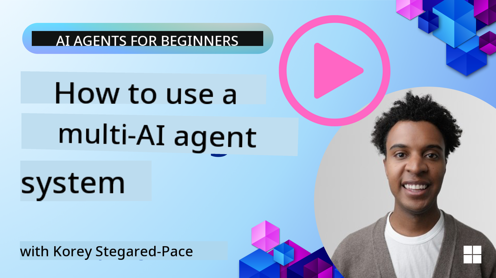
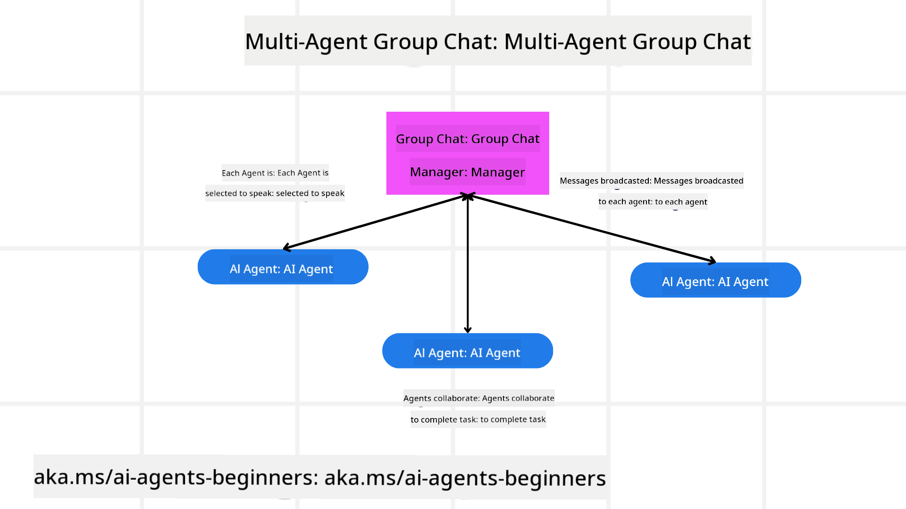
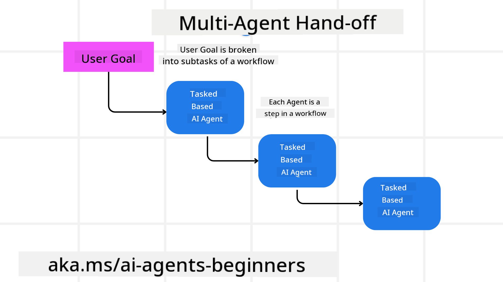
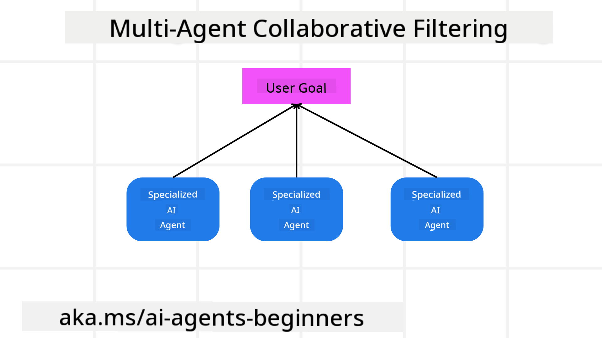

<!--
CO_OP_TRANSLATOR_METADATA:
{
  "original_hash": "1a008c204051cba8d0e253b75f261c41",
  "translation_date": "2025-08-30T07:01:19+00:00",
  "source_file": "08-multi-agent/README.md",
  "language_code": "en"
}
-->

> _(Click the image above to view video of this lesson)_

# Multi-agent design patterns

When working on a project involving multiple agents, you'll need to consider the multi-agent design pattern. However, it may not be immediately obvious when to transition to multi-agents or what benefits they offer.

## Introduction

In this lesson, we aim to answer the following questions:

- In what scenarios are multi-agents applicable?
- What are the advantages of using multi-agents compared to a single agent handling multiple tasks?
- What are the key components of implementing the multi-agent design pattern?
- How can we monitor and understand the interactions between multiple agents?

## Learning Goals

By the end of this lesson, you should be able to:

- Identify scenarios where multi-agents are a good fit.
- Understand the benefits of using multi-agents over a single agent.
- Grasp the foundational elements of implementing the multi-agent design pattern.

Why does this matter?

*Multi-agents are a design pattern that enables multiple agents to collaborate to achieve a shared goal.*

This approach is widely used in fields like robotics, autonomous systems, and distributed computing.

## Scenarios Where Multi-Agents Are Applicable

What kinds of situations are ideal for using multi-agents? The truth is, there are many scenarios where multiple agents are advantageous, particularly in the following cases:

- **Large workloads**: When tasks are extensive, they can be divided into smaller chunks and assigned to different agents. This allows for parallel processing and faster completion. For example, processing a large dataset.
- **Complex tasks**: Similar to large workloads, complex tasks can be broken into smaller subtasks, with each agent specializing in a specific aspect. A good example is autonomous vehicles, where different agents handle navigation, obstacle detection, and communication with other vehicles.
- **Diverse expertise**: Different agents can bring unique expertise, enabling them to handle various aspects of a task more effectively than a single agent. For instance, in healthcare, agents can manage diagnostics, treatment planning, and patient monitoring.

## Advantages of Using Multi-Agents Over a Singular Agent

While a single agent system may work well for simple tasks, multi-agents offer several advantages for more complex tasks:

- **Specialization**: Each agent can focus on a specific task. A single agent trying to handle everything may struggle with complex tasks, potentially performing poorly in areas it isn't optimized for.
- **Scalability**: It's easier to scale a system by adding more agents than by overloading a single agent.
- **Fault Tolerance**: If one agent fails, others can continue functioning, ensuring the system remains reliable.

For example, consider booking a trip for a user. A single agent system would need to handle all aspects of the process—finding flights, booking hotels, and arranging rental cars. This would require the agent to manage tools for all these tasks, resulting in a complex, monolithic system that's hard to maintain and scale. In contrast, a multi-agent system could have specialized agents for flights, hotels, and rental cars, making the system modular, easier to maintain, and scalable.

Think of it like comparing a small, family-run travel agency where one person does everything to a franchise where different specialists handle different aspects of the booking process.

## Building Blocks of Implementing the Multi-Agent Design Pattern

To implement the multi-agent design pattern, you need to understand its key components.

Using the example of booking a trip, the building blocks include:

- **Agent Communication**: Agents (e.g., for flights, hotels, and rental cars) need to share information about the user's preferences and constraints. For instance, the flight agent must communicate with the hotel agent to ensure the hotel is booked for the same dates as the flight. You'll need to decide *which agents share information and how*.
- **Coordination Mechanisms**: Agents must coordinate their actions to meet the user's preferences and constraints. For example, if the user wants a hotel near the airport but rental cars are only available at the airport, the hotel and car rental agents must coordinate. You'll need to decide *how agents coordinate their actions*.
- **Agent Architecture**: Agents need an internal structure to make decisions and learn from user interactions. For example, the flight agent should decide which flights to recommend based on user preferences. You'll need to determine *how agents make decisions and learn*. For instance, the flight agent might use a machine learning model to improve recommendations over time.
- **Visibility into Multi-Agent Interactions**: It's crucial to monitor how agents interact. This requires tools for tracking activities and interactions, such as logging, monitoring, visualization tools, and performance metrics.
- **Multi-Agent Patterns**: There are various patterns for implementing multi-agent systems, such as centralized, decentralized, and hybrid architectures. You'll need to choose the one that best suits your use case.
- **Human in the Loop**: In many cases, human intervention is necessary. Agents should know when to ask for human input, such as confirming a booking or handling special requests.

## Visibility into Multi-Agent Interactions

Monitoring agent interactions is essential for debugging, optimizing, and ensuring the system's effectiveness. This requires tools for tracking activities and interactions, such as logging, visualization tools, and performance metrics.

For example, in a trip booking scenario, you could use a dashboard to display the status of each agent, the user's preferences, and agent interactions. The dashboard might show travel dates, flight recommendations, hotel options, and car rental suggestions, providing a clear view of how agents are working together and whether user needs are being met.

Key aspects include:

- **Logging and Monitoring Tools**: Log each action taken by an agent, including the agent's identity, the action, the time, and the outcome. This data can be used for debugging and optimization.
- **Visualization Tools**: Use visual tools to intuitively display agent interactions, such as a graph showing information flow between agents. This helps identify bottlenecks and inefficiencies.
- **Performance Metrics**: Track metrics like task completion time, task throughput, and recommendation accuracy. These insights can guide system improvements.

## Multi-Agent Patterns

Here are some patterns for building multi-agent applications:

### Group Chat

This pattern is ideal for creating group chat applications where multiple agents communicate. Use cases include team collaboration, customer support, and social networking.

In this pattern, each agent represents a user, and messages are exchanged using a messaging protocol. Agents can send, receive, and respond to messages.

This can be implemented using a centralized server or a decentralized architecture.

### Hand-off

This pattern is useful for applications where agents hand off tasks to each other, such as customer support, task management, and workflow automation.

In this pattern, each agent represents a task or workflow step, and tasks are handed off based on predefined rules.

### Collaborative Filtering

This pattern is for applications where agents collaborate to make recommendations. Each agent contributes its expertise to improve the recommendation process.

For example, in stock market recommendations:

- **Industry Expert**: One agent specializes in a specific industry.
- **Technical Analysis**: Another agent focuses on technical analysis.
- **Fundamental Analysis**: A third agent handles fundamental analysis.

Together, they provide a comprehensive recommendation.

## Scenario: Refund Process

Consider a customer seeking a refund. Multiple agents may be involved, divided into process-specific and general agents.

**Process-Specific Agents**:

- **Customer Agent**: Initiates the refund process.
- **Seller Agent**: Processes the refund.
- **Payment Agent**: Handles payment refunds.
- **Resolution Agent**: Resolves issues during the process.
- **Compliance Agent**: Ensures regulatory compliance.

**General Agents**:

- **Shipping Agent**: Manages product returns (also used for general shipping).
- **Feedback Agent**: Collects customer feedback.
- **Escalation Agent**: Handles escalations to higher support levels.
- **Notification Agent**: Sends updates to the customer.
- **Analytics Agent**: Analyzes refund-related data.
- **Audit Agent**: Audits the refund process.
- **Reporting Agent**: Generates refund process reports.
- **Knowledge Agent**: Maintains a knowledge base.
- **Security Agent**: Ensures process security.
- **Quality Agent**: Monitors process quality.

These examples illustrate how to decide which agents to include in your multi-agent system.

## Assignment
Design a multi-agent system for a customer support process. Identify the agents involved in the process, their roles and responsibilities, and how they interact with each other. Consider both agents specific to the customer support process and general agents that can be used in other parts of your business.

> Take a moment to think before reading the solution below—you might need more agents than you initially expect.

> TIP: Consider the various stages of the customer support process, as well as agents required for any supporting systems.

## Solution

[Solution](./solution/solution.md)

## Knowledge checks

Question: When should you consider using multi-agents?

- [ ] A1: When you have a small workload and a simple task.
- [ ] A2: When you have a large workload
- [ ] A3: When you have a simple task.

[Solution quiz](./solution/solution-quiz.md)

## Summary

In this lesson, we explored the multi-agent design pattern, including the situations where multi-agents are suitable, the benefits of using multiple agents instead of a single one, the fundamental components for implementing the multi-agent design pattern, and how to monitor the interactions between the agents.

### Have More Questions about the Multi-Agent Design Pattern?

Join the [Azure AI Foundry Discord](https://aka.ms/ai-agents/discord) to connect with other learners, attend office hours, and get your AI Agents questions answered.

## Additional resources

- 

## Previous Lesson

[Planning Design](../07-planning-design/README.md)

## Next Lesson

[Metacognition in AI Agents](../09-metacognition/README.md)

---

**Disclaimer**:  
This document has been translated using the AI translation service [Co-op Translator](https://github.com/Azure/co-op-translator). While we strive for accuracy, please note that automated translations may contain errors or inaccuracies. The original document in its native language should be regarded as the authoritative source. For critical information, professional human translation is recommended. We are not responsible for any misunderstandings or misinterpretations resulting from the use of this translation.