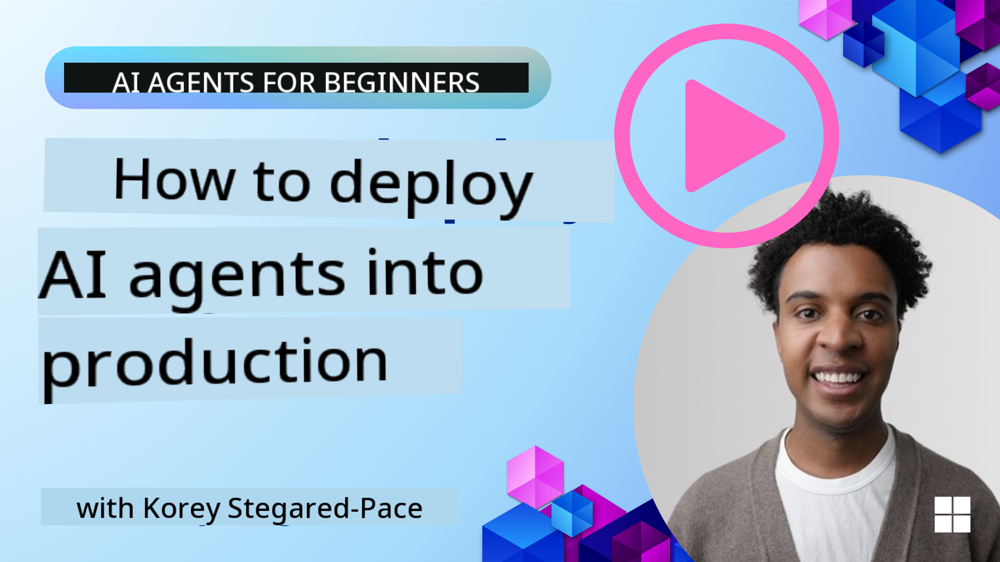

<!--
CO_OP_TRANSLATOR_METADATA:
{
  "original_hash": "cdfd0acc8592c1af14f8637833450375",
  "translation_date": "2025-08-30T07:00:47+00:00",
  "source_file": "10-ai-agents-production/README.md",
  "language_code": "en"
}
-->
# AI Agents in Production: Observability & Evaluation

[](https://youtu.be/l4TP6IyJxmQ?si=reGOyeqjxFevyDq9)

As AI agents transition from experimental prototypes to real-world applications, understanding their behavior, monitoring their performance, and systematically evaluating their outputs becomes crucial.

## Learning Goals

After completing this lesson, you will understand how to:
- Grasp the core concepts of agent observability and evaluation
- Apply techniques to improve the performance, costs, and effectiveness of agents
- Systematically evaluate your AI agents and determine what to assess
- Manage costs when deploying AI agents to production
- Instrument agents built with AutoGen

The aim is to provide you with the knowledge to turn your "black box" agents into transparent, manageable, and reliable systems.

_**Note:** Deploying safe and trustworthy AI agents is essential. Check out the [Building Trustworthy AI Agents](./06-building-trustworthy-agents/README.md) lesson for more information._

## Traces and Spans

Observability tools like [Langfuse](https://langfuse.com/) or [Azure AI Foundry](https://learn.microsoft.com/en-us/azure/ai-foundry/what-is-azure-ai-foundry) often represent agent runs as traces and spans.

- **Trace**: Represents the entire agent task from start to finish (e.g., handling a user query).
- **Spans**: Represent individual steps within the trace (e.g., calling a language model or retrieving data).


Without observability, an AI agent can feel like a "black box"—its internal state and reasoning are opaque, making it hard to diagnose issues or optimize performance. Observability transforms agents into "glass boxes," providing transparency that is essential for building trust and ensuring proper functionality.

## Why Observability Matters in Production Environments

Deploying AI agents in production environments introduces new challenges and requirements. Observability becomes a critical capability rather than a "nice-to-have":

*   **Debugging and Root-Cause Analysis**: When an agent fails or produces unexpected outputs, observability tools provide traces that help identify the source of the error. This is especially important for complex agents involving multiple LLM calls, tool interactions, and conditional logic.
*   **Latency and Cost Management**: AI agents often rely on LLMs and external APIs billed per token or call. Observability enables precise tracking of these calls, helping identify operations that are slow or expensive. Teams can optimize prompts, choose more efficient models, or redesign workflows to manage costs and ensure a smooth user experience.
*   **Trust, Safety, and Compliance**: In many applications, ensuring agents behave safely and ethically is crucial. Observability provides an audit trail of agent actions and decisions, helping detect and mitigate issues like prompt injection, harmful content generation, or mishandling of personally identifiable information (PII). For example, traces can be reviewed to understand why an agent provided a specific response or used a particular tool.
*   **Continuous Improvement Loops**: Observability data forms the basis for iterative development. By monitoring real-world agent performance, teams can identify areas for improvement, gather data for fine-tuning models, and validate changes. This creates a feedback loop where production insights from online evaluation inform offline experimentation, leading to better agent performance over time.

## Key Metrics to Track

To monitor and understand agent behavior, various metrics and signals should be tracked. While specific metrics may vary depending on the agent's purpose, some are universally important.

Here are common metrics monitored by observability tools:

**Latency:** How quickly does the agent respond? Long wait times negatively impact user experience. Measure latency for tasks and individual steps by tracing agent runs. For example, an agent taking 20 seconds for all model calls could be sped up by using a faster model or running model calls in parallel.

**Costs:** What’s the expense per agent run? AI agents rely on LLM calls billed per token or external APIs. Frequent tool usage or multiple prompts can quickly increase costs. For instance, if an agent calls an LLM five times for marginal quality improvement, assess whether the cost is justified or if fewer calls or a cheaper model could suffice. Real-time monitoring can also identify unexpected spikes (e.g., bugs causing excessive API loops).

**Request Errors:** How many requests did the agent fail? This includes API errors or failed tool calls. To make your agent more robust in production, set up fallbacks or retries. For example, if LLM provider A is down, switch to LLM provider B as a backup.

**User Feedback:** Direct user evaluations provide valuable insights, such as explicit ratings (👍thumbs-up/👎down, ⭐1-5 stars) or textual comments. Consistent negative feedback signals that the agent is not functioning as expected.

**Implicit User Feedback:** User behaviors offer indirect feedback even without explicit ratings. Examples include immediate question rephrasing, repeated queries, or clicking a retry button. For instance, repeated user queries indicate the agent is not meeting expectations.

**Accuracy:** How often does the agent produce correct or desirable outputs? Accuracy definitions vary (e.g., problem-solving correctness, information retrieval accuracy, user satisfaction). Start by defining success for your agent. Track accuracy via automated checks, evaluation scores, or task completion labels, such as marking traces as "succeeded" or "failed."

**Automated Evaluation Metrics:** Set up automated evaluations. For example, use an LLM to score the agent’s output for helpfulness, accuracy, or other criteria. Open-source libraries like [RAGAS](https://docs.ragas.io/) for RAG agents or [LLM Guard](https://llm-guard.com/) for detecting harmful language or prompt injection can assist.

Combining these metrics provides the best coverage of an AI agent’s health. In this chapter's [example notebook](./code_samples/10_autogen_evaluation.ipynb), we'll explore how these metrics appear in real examples. First, we'll learn about a typical evaluation workflow.

## Instrument your Agent

To collect tracing data, you’ll need to instrument your code. The goal is to enable the agent code to emit traces and metrics that can be captured, processed, and visualized by an observability platform.

**OpenTelemetry (OTel):** [OpenTelemetry](https://opentelemetry.io/) is an industry standard for LLM observability, offering APIs, SDKs, and tools for generating, collecting, and exporting telemetry data.

Instrumentation libraries often wrap existing agent frameworks, simplifying the process of exporting OpenTelemetry spans to an observability tool. Below is an example of instrumenting an AutoGen agent using the [OpenLit instrumentation library](https://github.com/openlit/openlit):

```python
import openlit

openlit.init(tracer = langfuse._otel_tracer, disable_batch = True)
```

The [example notebook](./code_samples/10_autogen_evaluation.ipynb) in this chapter demonstrates how to instrument your AutoGen agent.

**Manual Span Creation:** While instrumentation libraries provide a good baseline, there are cases where more detailed or custom information is needed. You can manually create spans to add custom application logic or enrich spans with custom attributes (tags or metadata). These attributes might include business-specific data, intermediate computations, or debugging context, such as `user_id`, `session_id`, or `model_version`.

Example of manually creating traces and spans using the [Langfuse Python SDK](https://langfuse.com/docs/sdk/python/sdk-v3):

```python
from langfuse import get_client
 
langfuse = get_client()
 
span = langfuse.start_span(name="my-span")
 
span.end()
```

## Agent Evaluation

Observability provides metrics, but evaluation involves analyzing that data (and performing tests) to assess how well an AI agent is performing and identify areas for improvement. In other words, once you have traces and metrics, how do you use them to judge the agent and make decisions?

Regular evaluation is essential because AI agents are often non-deterministic and can evolve (due to updates or model behavior drift). Without evaluation, you wouldn’t know if your "smart agent" is performing well or has regressed.

There are two types of evaluations for AI agents: **online evaluation** and **offline evaluation**. Both are valuable and complement each other. Offline evaluation is typically the first step before deploying an agent.

### Offline Evaluation


Offline evaluation involves testing the agent in a controlled environment using test datasets rather than live user queries. Curated datasets with known expected outputs or correct behaviors are used to evaluate the agent.

For example, if you’ve built a math word-problem agent, you might use a [test dataset](https://huggingface.co/datasets/gsm8k) of 100 problems with known answers. Offline evaluation is often conducted during development (and can be part of CI/CD pipelines) to check improvements or guard against regressions. The benefit is that it’s **repeatable and provides clear accuracy metrics since you have ground truth**. You might also simulate user queries and compare the agent’s responses to ideal answers or use automated metrics as described earlier.

The challenge with offline evaluation is ensuring the test dataset is comprehensive and remains relevant. The agent might perform well on a fixed test set but encounter very different queries in production. Therefore, test sets should be updated with new edge cases and examples reflecting real-world scenarios. A mix of small “smoke test” cases and larger evaluation sets is useful: small sets for quick checks and larger ones for broader performance metrics.

### Online Evaluation 


Online evaluation involves assessing the agent in a live, real-world environment during actual usage in production. It includes monitoring the agent’s performance on real user interactions and continuously analyzing outcomes.

For example, you might track success rates, user satisfaction scores, or other metrics on live traffic. The advantage of online evaluation is that it **captures unexpected scenarios that might not arise in a controlled setting**—you can observe model drift over time (e.g., if the agent’s effectiveness declines as input patterns change) and identify unexpected queries or situations not covered in your test data. It provides a true picture of the agent’s behavior in the wild.

Online evaluation often involves collecting implicit and explicit user feedback, as discussed earlier, and possibly running shadow tests or A/B tests (comparing a new agent version against the old). The challenge is obtaining reliable labels or scores for live interactions, which may rely on user feedback or downstream metrics (e.g., whether the user clicked the result).

### Combining the two

Online and offline evaluations complement each other. Insights from online monitoring (e.g., new user query types where the agent performs poorly) can be used to enhance offline test datasets. Conversely, agents performing well in offline tests can be confidently deployed and monitored online.

Many teams adopt a loop:

_evaluate offline -> deploy -> monitor online -> collect new failure cases -> add to offline dataset -> refine agent -> repeat_.

## Common Issues

As you deploy AI agents to production, you may encounter various challenges. Here are some common issues and potential solutions:

| **Issue**    | **Potential Solution**   |
| ------------- | ------------------ |
| AI Agent not performing tasks consistently | - Refine the prompt given to the AI Agent; be clear on objectives.<br>- Identify where dividing the tasks into subtasks and handling them by multiple agents can help. |
| AI Agent running into continuous loops  | - Ensure you have clear termination terms and conditions so the Agent knows when to stop the process. |

# Observability in AI Agents

Observability is crucial for understanding and improving the performance of AI agents. It allows you to monitor, debug, and optimize workflows effectively. In this section, we’ll explore how observability can help identify and resolve common issues in agent systems.

## Common Issues in AI Agents

Here are some typical challenges you might encounter when deploying AI agents, along with strategies to address them:

| **Issue**                                   | **Resolution**                                                                 |
|---------------------------------------------|--------------------------------------------------------------------------------|
| Agent responses are inconsistent            | - Refine the prompts to ensure clarity and specificity.<br>- Use a larger model for tasks requiring complex reasoning. |
| AI Agent tool calls are not performing well | - Test and validate the tool's output outside of the agent system.<br>- Adjust parameters, prompts, and tool naming for better alignment. |
| Multi-Agent system not performing consistently | - Ensure prompts for each agent are specific and distinct.<br>- Implement a hierarchical system with a "routing" or controller agent to determine the appropriate agent for each task. |

Many of these issues can be identified more effectively with observability tools. The traces and metrics discussed earlier help pinpoint exactly where problems occur in the agent workflow, making debugging and optimization much more efficient.

## Managing Costs

Here are some strategies to manage the costs of deploying AI agents in production:

**Using Smaller Models:** Small Language Models (SLMs) can perform well for certain use cases and significantly reduce costs. As mentioned earlier, building an evaluation system to compare performance against larger models is the best way to determine how well an SLM fits your use case. Consider using SLMs for simpler tasks like intent classification or parameter extraction, while reserving larger models for complex reasoning.

**Using a Router Model:** Another strategy is to use a mix of models with varying sizes. You can use an LLM/SLM or serverless function to route requests based on complexity to the most suitable model. This approach reduces costs while ensuring optimal performance for each task. For example, route simple queries to smaller, faster models, and reserve expensive large models for tasks requiring complex reasoning.

**Caching Responses:** Identify common requests and tasks, and provide pre-generated responses before they go through your agent system. You can even implement a flow to measure how similar a new request is to cached ones using basic AI models. This strategy can significantly reduce costs for frequently asked questions or repetitive workflows.

## Let’s See How This Works in Practice

In the [example notebook for this section](./code_samples/10_autogen_evaluation.ipynb), you’ll find examples of how observability tools can be used to monitor and evaluate your agent.

### Got More Questions About AI Agents in Production?

Join the [Azure AI Foundry Discord](https://aka.ms/ai-agents/discord) to connect with other learners, attend office hours, and get your AI agent-related questions answered.

## Previous Lesson

[Metacognition Design Pattern](../09-metacognition/README.md)

## Next Lesson

[Agentic Protocols](../11-agentic-protocols/README.md)

---

**Disclaimer**:  
This document has been translated using the AI translation service [Co-op Translator](https://github.com/Azure/co-op-translator). While we aim for accuracy, please note that automated translations may include errors or inaccuracies. The original document in its native language should be regarded as the authoritative source. For critical information, professional human translation is advised. We are not responsible for any misunderstandings or misinterpretations resulting from the use of this translation.