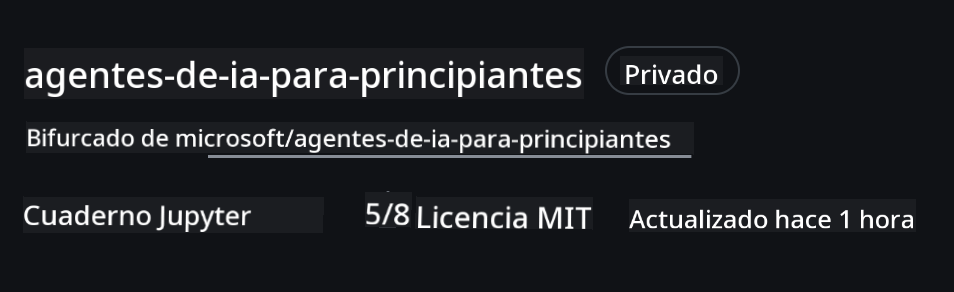
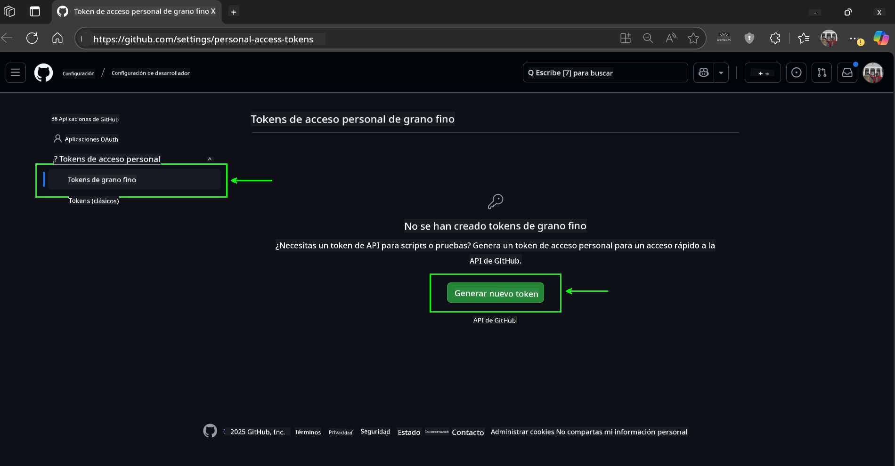
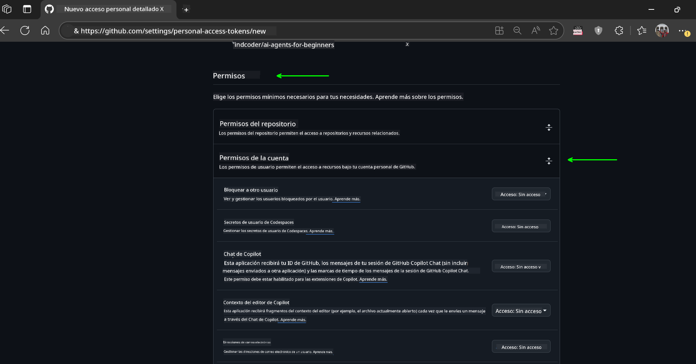
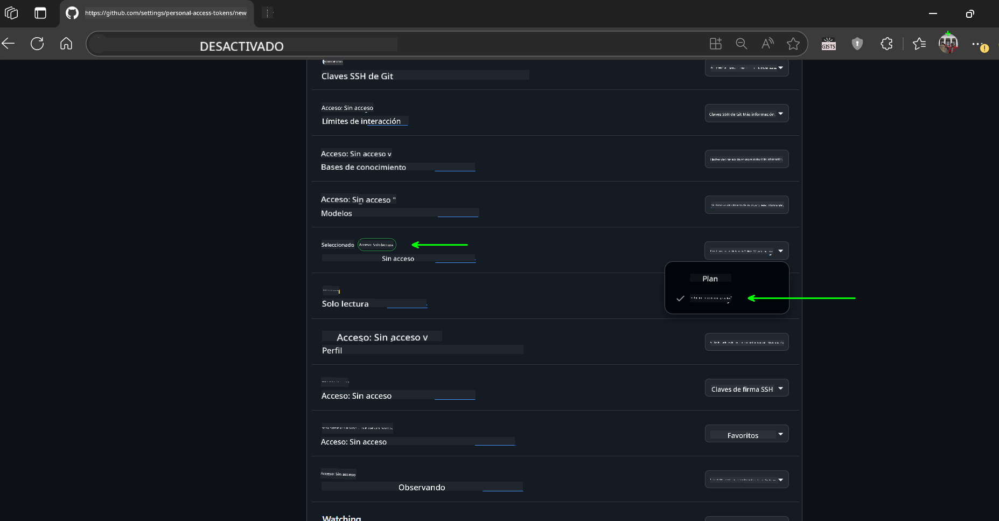
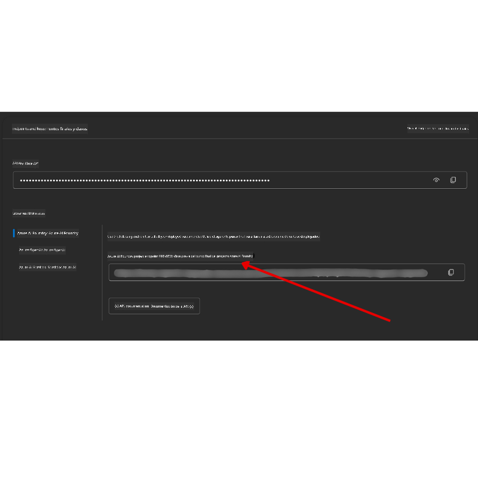

<!--
CO_OP_TRANSLATOR_METADATA:
{
  "original_hash": "c6a79c8f2b56a80370ff7e447765524f",
  "translation_date": "2025-07-24T07:33:07+00:00",
  "source_file": "00-course-setup/README.md",
  "language_code": "es"
}
-->
# Configuración del Curso

## Introducción

En esta lección aprenderás cómo ejecutar los ejemplos de código de este curso.

## Clonar o Hacer un Fork de este Repositorio

Para comenzar, clona o haz un fork del repositorio de GitHub. Esto te permitirá tener tu propia versión del material del curso para que puedas ejecutar, probar y modificar el código.

Esto se puede hacer haciendo clic en el enlace a

Deberías tener ahora tu propia versión del curso en el siguiente enlace:



## Ejecutar el Código

Este curso incluye una serie de Jupyter Notebooks que puedes ejecutar para obtener experiencia práctica construyendo Agentes de IA.

Los ejemplos de código utilizan:

**Requiere una cuenta de GitHub - Gratis**:

1) Semantic Kernel Agent Framework + GitHub Models Marketplace. Etiquetado como (semantic-kernel.ipynb)  
2) AutoGen Framework + GitHub Models Marketplace. Etiquetado como (autogen.ipynb)

**Requiere una suscripción a Azure**:  
3) Azure AI Foundry + Azure AI Agent Service. Etiquetado como (azureaiagent.ipynb)

Te animamos a probar los tres tipos de ejemplos para ver cuál funciona mejor para ti.

La opción que elijas determinará los pasos de configuración que debes seguir a continuación:

## Requisitos

- Python 3.12+  
  - **NOTA**: Si no tienes Python 3.12 instalado, asegúrate de instalarlo. Luego crea tu entorno virtual (venv) usando python3.12 para garantizar que se instalen las versiones correctas desde el archivo requirements.txt.
- Una cuenta de GitHub - Para acceder al GitHub Models Marketplace
- Suscripción a Azure - Para acceder a Azure AI Foundry
- Cuenta de Azure AI Foundry - Para acceder al Azure AI Agent Service

Hemos incluido un archivo `requirements.txt` en la raíz de este repositorio que contiene todos los paquetes de Python necesarios para ejecutar los ejemplos de código.

Puedes instalarlos ejecutando el siguiente comando en tu terminal en la raíz del repositorio:

```bash
pip install -r requirements.txt
```

Recomendamos crear un entorno virtual de Python para evitar conflictos y problemas.

## Configurar VSCode

Asegúrate de estar utilizando la versión correcta de Python en VSCode.


## Configuración para los Ejemplos con Modelos de GitHub

### Paso 1: Obtén tu Token de Acceso Personal (PAT) de GitHub

Este curso utiliza el GitHub Models Marketplace, que proporciona acceso gratuito a Modelos de Lenguaje Extenso (LLMs) que usarás para construir Agentes de IA.

Para usar los modelos de GitHub, necesitarás crear un [Token de Acceso Personal de GitHub](https://docs.github.com/en/authentication/keeping-your-account-and-data-secure/managing-your-personal-access-tokens).

Esto se puede hacer accediendo a tu cuenta de GitHub.

Por favor, sigue el [Principio de Menor Privilegio](https://docs.github.com/en/get-started/learning-to-code/storing-your-secrets-safely) al crear tu token. Esto significa que solo debes otorgar al token los permisos necesarios para ejecutar los ejemplos de código de este curso.

1. Selecciona la opción `Fine-grained tokens` en el lado izquierdo de tu pantalla.

    Luego selecciona `Generate new token`.

    

1. Ingresa un nombre descriptivo para tu token que refleje su propósito, facilitando su identificación más adelante. Establece una fecha de expiración (recomendado: 30 días; puedes elegir un período más corto como 7 días si prefieres una postura más segura).

    

1. Limita el alcance del token a tu fork de este repositorio.

    

1. Restringe los permisos del token: Bajo **Permissions**, activa **Account Permissions**, navega hasta **Models** y habilita solo el acceso de lectura necesario para los modelos de GitHub.

    

    

Copia tu nuevo token recién creado. Ahora lo agregarás a tu archivo `.env` incluido en este curso.

### Paso 2: Crea tu Archivo `.env`

Para crear tu archivo `.env`, ejecuta el siguiente comando en tu terminal.

```bash
cp .env.example .env
```

Esto copiará el archivo de ejemplo y creará un `.env` en tu directorio, donde completarás los valores de las variables de entorno.

Con tu token copiado, abre el archivo `.env` en tu editor de texto favorito y pega tu token en el campo `GITHUB_TOKEN`.

Ahora deberías poder ejecutar los ejemplos de código de este curso.

## Configuración para los Ejemplos con Azure AI Foundry y Azure AI Agent Service

### Paso 1: Obtén el Endpoint de tu Proyecto de Azure

Sigue los pasos para crear un hub y un proyecto en Azure AI Foundry que se encuentran aquí: [Hub resources overview](https://learn.microsoft.com/en-us/azure/ai-foundry/concepts/ai-resources)

Una vez que hayas creado tu proyecto, necesitarás obtener la cadena de conexión para tu proyecto.

Esto se puede hacer accediendo a la página **Overview** de tu proyecto en el portal de Azure AI Foundry.



### Paso 2: Crea tu Archivo `.env`

Para crear tu archivo `.env`, ejecuta el siguiente comando en tu terminal.

```bash
cp .env.example .env
```

Esto copiará el archivo de ejemplo y creará un `.env` en tu directorio, donde completarás los valores de las variables de entorno.

Con tu token copiado, abre el archivo `.env` en tu editor de texto favorito y pega tu token en el campo `PROJECT_ENDPOINT`.

### Paso 3: Inicia Sesión en Azure

Como una práctica recomendada de seguridad, utilizaremos [autenticación sin claves](https://learn.microsoft.com/azure/developer/ai/keyless-connections?tabs=csharp%2Cazure-cli?WT.mc_id=academic-105485-koreyst) para autenticarnos en Azure OpenAI con Microsoft Entra ID.

A continuación, abre una terminal y ejecuta `az login --use-device-code` para iniciar sesión en tu cuenta de Azure.

Una vez que hayas iniciado sesión, selecciona tu suscripción en la terminal.

## Variables de Entorno Adicionales - Azure Search y Azure OpenAI

Para la lección sobre Agentic RAG - Lección 5 - hay ejemplos que utilizan Azure Search y Azure OpenAI.

Si deseas ejecutar estos ejemplos, necesitarás agregar las siguientes variables de entorno a tu archivo `.env`:

### Página de Resumen (Proyecto)

- `AZURE_SUBSCRIPTION_ID` - Consulta **Project details** en la página **Overview** de tu proyecto.

- `AZURE_AI_PROJECT_NAME` - Mira en la parte superior de la página **Overview** de tu proyecto.

- `AZURE_OPENAI_SERVICE` - Encuentra esto en la pestaña **Included capabilities** para **Azure OpenAI Service** en la página **Overview**.

### Centro de Gestión

- `AZURE_OPENAI_RESOURCE_GROUP` - Ve a **Project properties** en la página **Overview** del **Management Center**.

- `GLOBAL_LLM_SERVICE` - Bajo **Connected resources**, encuentra el nombre de conexión de **Azure AI Services**. Si no está listado, consulta el **Azure portal** en tu grupo de recursos para el nombre del recurso de AI Services.

### Página de Modelos + Endpoints

- `AZURE_OPENAI_EMBEDDING_DEPLOYMENT_NAME` - Selecciona tu modelo de embeddings (por ejemplo, `text-embedding-ada-002`) y anota el **Deployment name** de los detalles del modelo.

- `AZURE_OPENAI_CHAT_DEPLOYMENT_NAME` - Selecciona tu modelo de chat (por ejemplo, `gpt-4o-mini`) y anota el **Deployment name** de los detalles del modelo.

### Portal de Azure

- `AZURE_OPENAI_ENDPOINT` - Busca **Azure AI services**, haz clic en él, luego ve a **Resource Management**, **Keys and Endpoint**, desplázate hacia abajo hasta "Azure OpenAI endpoints" y copia el que dice "Language APIs".

- `AZURE_OPENAI_API_KEY` - Desde la misma pantalla, copia la CLAVE 1 o CLAVE 2.

- `AZURE_SEARCH_SERVICE_ENDPOINT` - Encuentra tu recurso de **Azure AI Search**, haz clic en él y consulta **Overview**.

- `AZURE_SEARCH_API_KEY` - Luego ve a **Settings** y luego a **Keys** para copiar la clave de administrador primaria o secundaria.

### Página Externa

- `AZURE_OPENAI_API_VERSION` - Visita la página [API version lifecycle](https://learn.microsoft.com/en-us/azure/ai-services/openai/api-version-deprecation#latest-ga-api-release) bajo **Latest GA API release**.

### Configurar Autenticación sin Claves

En lugar de codificar tus credenciales, utilizaremos una conexión sin claves con Azure OpenAI. Para hacerlo, importaremos `DefaultAzureCredential` y luego llamaremos a la función `DefaultAzureCredential` para obtener las credenciales.

```python
from azure.identity import DefaultAzureCredential, InteractiveBrowserCredential
```

## ¿Tienes Problemas?

Si tienes algún problema al ejecutar esta configuración, únete a nuestro

## Próxima Lección

Ahora estás listo para ejecutar el código de este curso. ¡Disfruta aprendiendo más sobre el mundo de los Agentes de IA!

[Introducción a los Agentes de IA y Casos de Uso de Agentes](../01-intro-to-ai-agents/README.md)

**Descargo de responsabilidad**:  
Este documento ha sido traducido utilizando el servicio de traducción automática [Co-op Translator](https://github.com/Azure/co-op-translator). Aunque nos esforzamos por garantizar la precisión, tenga en cuenta que las traducciones automatizadas pueden contener errores o imprecisiones. El documento original en su idioma nativo debe considerarse como la fuente autorizada. Para información crítica, se recomienda una traducción profesional realizada por humanos. No nos hacemos responsables de malentendidos o interpretaciones erróneas que puedan surgir del uso de esta traducción.