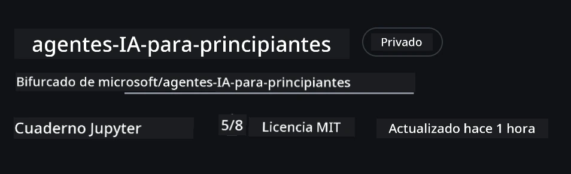
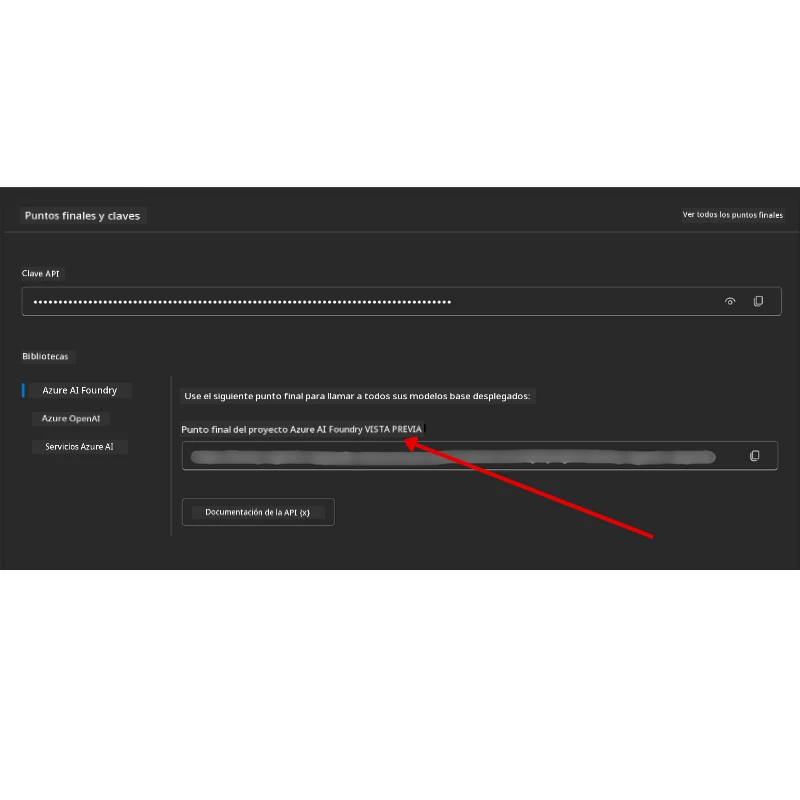

# Configuración del Curso

## Introducción

Esta lección cubrirá cómo ejecutar los ejemplos de código de este curso.

## Únete a Otros Estudiantes y Obtén Ayuda

Antes de comenzar a clonar tu repositorio, únete al [canal de Discord AI Agents For Beginners](https://aka.ms/ai-agents/discord) para obtener ayuda con la configuración, cualquier pregunta sobre el curso o para conectarte con otros estudiantes.

## Clona o Haz un Fork de este Repositorio

Para comenzar, por favor clona o haz un fork del repositorio de GitHub. Esto hará tu propia versión del material del curso para que puedas ejecutar, probar y ajustar el código.

Esto se puede hacer haciendo clic en el enlace para <a href="https://github.com/microsoft/ai-agents-for-beginners/fork" target="_blank">hacer un fork del repositorio</a>

Ahora deberías tener tu propia versión bifurcada de este curso en el siguiente enlace:



### Clonación Superficial (recomendada para taller / Codespaces)

  >El repositorio completo puede ser grande (~3 GB) cuando descargas todo el historial y todos los archivos. Si solo vas a asistir al taller o solo necesitas algunas carpetas de lecciones, una clonación superficial (o clonación escasa) descarga mucho menos.

#### Clonación superficial rápida — historial mínimo, todos los archivos

Sustituye `<your-username>` en los siguientes comandos por la URL de tu fork (o la URL upstream si prefieres).

Para clonar solo el historial del último commit (descarga pequeña):

```bash
git clone --depth 1 https://github.com/<your-username>/ai-agents-for-beginners.git
```

Para clonar una rama específica:

```bash
git clone --depth 1 --branch <branch-name> https://github.com/<your-username>/ai-agents-for-beginners.git
```

#### Clonación parcial (escasa) — blobs mínimos + solo carpetas seleccionadas

Esto utiliza clonación parcial y sparse-checkout (requiere Git 2.25+ y se recomienda un Git moderno con soporte para clonación parcial):

```bash
git clone --depth 1 --filter=blob:none --sparse https://github.com/<your-username>/ai-agents-for-beginners.git
```

Ingresa a la carpeta del repositorio:

```bash
cd ai-agents-for-beginners
```

Luego especifica qué carpetas quieres (el ejemplo abajo muestra dos carpetas):

```bash
git sparse-checkout set 00-course-setup 01-intro-to-ai-agents
```

Después de clonar y verificar los archivos, si solo necesitas los archivos y quieres liberar espacio (sin historial de git), por favor elimina los metadatos del repositorio (💀irrevocable — perderás toda la funcionalidad de Git):

```bash
# zsh/bash
rm -rf .git
```

```powershell
# PowerShell
Remove-Item -Recurse -Force .git
```

#### Uso de GitHub Codespaces (recomendado para evitar descargas locales grandes)

- Crea un nuevo Codespace para este repositorio vía la [UI de GitHub](https://github.com/codespaces).  

- En la terminal del Codespace recién creado, ejecuta uno de los comandos de clonación superficial/escasa arriba para traer solo las carpetas de lecciones que necesites al entorno del Codespace.
- Opcional: después de clonar dentro de Codespaces, elimina .git para recuperar espacio extra (consulta los comandos de eliminación arriba).
- Nota: Si prefieres abrir el repositorio directamente en Codespaces (sin una clonación extra), ten en cuenta que Codespaces construirá el entorno devcontainer y puede que aún así provisione más de lo que necesitas.

#### Consejos

- Siempre reemplaza la URL de clonación con la de tu fork si quieres editar/commitear.
- Si después necesitas más historial o archivos, puedes obtenerlos o ajustar sparse-checkout para incluir carpetas adicionales.

## Ejecutando el Código

Este curso ofrece una serie de Jupyter Notebooks que puedes ejecutar para obtener experiencia práctica construyendo Agentes de IA.

Los ejemplos de código usan **Microsoft Agent Framework (MAF)** con el `FoundryChatClient`, que se conecta a **Microsoft Foundry Agent Service V2** (la API de Respuestas) a través de **Microsoft Foundry**.

Todos los notebooks de Python están etiquetados como `*-python-agent-framework.ipynb`.

## Requisitos

- Python 3.12+
  - **NOTA**: Si no tienes Python3.12 instalado, asegúrate de instalarlo. Luego crea tu entorno virtual usando python3.12 para asegurar que se instalen las versiones correctas desde el archivo requirements.txt.
  
    >Ejemplo

    Crea el directorio para el entorno virtual de Python:

    ```bash
    python -m venv venv
    ```

    Luego activa el entorno virtual para:

    ```bash
    # zsh/bash
    source venv/bin/activate
    ```
  
    ```dos
    # Command Prompt for Windows
    venv\Scripts\activate
    ```

- .NET 10+: Para los ejemplos de código que usan .NET, asegúrate de instalar [.NET 10 SDK](https://dotnet.microsoft.com/download/dotnet/10.0) o superior. Luego, verifica la versión instalada del SDK de .NET:

    ```bash
    dotnet --list-sdks
    ```

- **Azure CLI** — Requerido para autenticación. Instálalo desde [aka.ms/installazurecli](https://aka.ms/installazurecli).
- **Suscripción de Azure** — Para acceso a Microsoft Foundry y Microsoft Foundry Agent Service.
- **Proyecto Microsoft Foundry** — Un proyecto con un modelo desplegado (ejemplo: `gpt-5-mini`). Consulta [Paso 1](#paso-1-crea-un-proyecto-en-microsoft-foundry) abajo.

Hemos incluido un archivo `requirements.txt` en la raíz de este repositorio que contiene todos los paquetes Python requeridos para ejecutar los ejemplos de código.

Puedes instalarlos ejecutando el siguiente comando en tu terminal en la raíz del repositorio:

```bash
pip install -r requirements.txt
```

Recomendamos crear un entorno virtual de Python para evitar conflictos y problemas.

## Configuración de VSCode

Asegúrate de que estás usando la versión correcta de Python en VSCode.


## Configuración de Microsoft Foundry y Microsoft Foundry Agent Service

### Paso 1: Crea un Proyecto en Microsoft Foundry

Necesitas un **hub** y un **proyecto** en Microsoft Foundry con un modelo desplegado para ejecutar los notebooks.

1. Ve a [ai.azure.com](https://ai.azure.com) e inicia sesión con tu cuenta de Azure.
2. Crea un **hub** (o usa uno existente). Consulta: [Resumen de recursos de Hub](https://learn.microsoft.com/azure/ai-foundry/concepts/ai-resources).
3. Dentro del hub, crea un **proyecto**.
4. Despliega un modelo (ejemplo: `gpt-5-mini`) desde **Modelos + Puntos de conexión** → **Desplegar modelo**.

### Paso 2: Obtén el Endpoint de tu Proyecto y el Nombre del Despliegue del Modelo

Desde tu proyecto en el portal de Microsoft Foundry:

- **Endpoint del Proyecto** — Ve a la página de **Resumen** y copia la URL del endpoint.



- **Nombre del Despliegue del Modelo** — Ve a **Modelos + Puntos de conexión**, selecciona tu modelo desplegado y anota el **Nombre del despliegue** (ejemplo: `gpt-5-mini`).

### Paso 3: Inicia sesión en Azure con `az login`

La mayoría de los notebooks se autentican a través de tu **inicio de sesión en Azure CLI** — usando `AzureCliCredential` o `DefaultAzureCredential` (ambos toman la sesión de tu `az login`) desde el paquete `azure-identity` — por lo que no requieren claves API. Algunas lecciones y integraciones opcionales usan claves API; consulta los prerrequisitos de cada lección para las variables de entorno adicionales. Esto requiere que hayas iniciado sesión mediante Azure CLI.

1. **Instala Azure CLI** si no lo tienes ya: [aka.ms/installazurecli](https://aka.ms/installazurecli)

2. **Inicia sesión** ejecutando:

    ```bash
    az login
    ```

    O si estás en un entorno remoto/Codespace sin navegador:

    ```bash
    az login --use-device-code
    ```

3. **Selecciona tu suscripción** si te lo solicita — elige la que contiene tu proyecto Foundry.

4. **Verifica** que estás autenticado:

    ```bash
    az account show
    ```

> **¿Por qué `az login`?** Los notebooks se autentican usando `AzureCliCredential` (o `DefaultAzureCredential`, que también toma tu inicio de sesión en Azure CLI) del paquete `azure-identity`. Esto significa que tu sesión de Azure CLI proporciona las credenciales — no hay claves API o secretos en tu archivo `.env`. Esta es una [mejor práctica de seguridad](https://learn.microsoft.com/azure/developer/ai/keyless-connections).

### Paso 4: Crea tu Archivo `.env`

Copia el archivo de ejemplo:

```bash
# zsh/bash
cp .env.example .env
```

```powershell
# PowerShell
Copy-Item .env.example .env
```

Abre `.env` y completa estos dos valores:

```env
AZURE_AI_PROJECT_ENDPOINT=https://<your-project>.services.ai.azure.com/api/projects/<your-project-id>
AZURE_AI_MODEL_DEPLOYMENT_NAME=gpt-5-mini
```

| Variable | Dónde encontrarla |
|----------|-----------------|
| `AZURE_AI_PROJECT_ENDPOINT` | Portal Foundry → tu proyecto → página de **Resumen** |
| `AZURE_AI_MODEL_DEPLOYMENT_NAME` | Portal Foundry → **Modelos + Puntos de conexión** → nombre de tu modelo desplegado |

¡Eso es todo para la mayoría de las lecciones! Los notebooks se autenticarán automáticamente a través de tu sesión de `az login`.

### Paso 5: Instala las Dependencias de Python

```bash
pip install -r requirements.txt
```

Recomendamos ejecutar esto dentro del entorno virtual que creaste anteriormente.

## Configuración Opcional: Azure AI Search (Lecciones 5 y 16)

Las lecciones 5 (Agentic RAG) y 16 se ejecutan directamente con una **base de conocimiento en memoria** — no se requieren recursos adicionales de Azure. Si quieres respaldarlas con un índice real de **Azure AI Search**, nota que el **notebook de la lección 16 usa actualmente autenticación basada en clave**: cambia de búsqueda en memoria a Azure AI Search sólo cuando **ambos** `AZURE_SEARCH_SERVICE_ENDPOINT` **y** `AZURE_SEARCH_API_KEY` están configurados, y de lo contrario permanece en búsqueda en memoria — así que para usarlo con un índice real debes configurar también la clave administrativa. La autenticación sin claves con Microsoft Entra ID (RBAC) es el enfoque recomendado para tu propio código en producción, consistente con el flujo `az login` usado en todo el curso.

Los pasos RBAC siguientes aplican a los ejemplos de esta guía de configuración y a tu propio código. No habilitan la autenticación sin clave en el notebook de la lección 16; esa lección aún requiere tanto el endpoint como la clave administrativa para usar Azure AI Search.

1. **Habilita el acceso basado en roles** en tu servicio de búsqueda:

    ```bash
    az search service update --name <service-name> --resource-group <resource-group> --auth-options aadOrApiKey
    ```

2. **Asígnate los roles necesarios** (crear/cargar índices y consultar):

    ```bash
    az role assignment create --assignee <your-user-or-principal-id> --role "Search Service Contributor" --scope $(az search service show -g <resource-group> -n <service-name> --query id -o tsv)
    az role assignment create --assignee <your-user-or-principal-id> --role "Search Index Data Contributor" --scope $(az search service show -g <resource-group> -n <service-name> --query id -o tsv)
    ```

3. **Agrega el endpoint** a tu archivo `.env`:

| Variable | Dónde encontrarla |
|----------|-----------------|
| `AZURE_SEARCH_SERVICE_ENDPOINT` | Portal de Azure → tu recurso **Azure AI Search** → **Resumen** → URL |
| `AZURE_SEARCH_API_KEY` | Requerido (junto con el endpoint) para habilitar Azure AI Search en la lección 16, que usa autenticación basada en clave. Portal de Azure → **Configuraciones** → **Claves** → clave primaria administrativa |

> ¿Por qué sin clave? Las claves administrativas otorgan acceso total de escritura a tu servicio de búsqueda y pueden filtrarse mediante archivos `.env`. Con RBAC, en cambio, se usa tu identidad de `az login` — el mismo patrón sin clave Entra ID que usan los notebooks del curso (mediante `AzureCliCredential` / `DefaultAzureCredential`). Consulta [Conectar a Azure AI Search usando roles](https://learn.microsoft.com/azure/search/search-security-rbac).

Consulta la [guía de configuración de Azure AI Search](./AzureSearch.md) para ejemplos completos de creación de índices en Python y .NET.

## Configuración Adicional para Lecciones que Llaman Azure OpenAI Directamente (Lecciones 6 y 8)

Algunos notebooks de las lecciones 6 y 8 llaman a **Azure OpenAI** directamente (usando la **API de Respuestas**) en lugar de pasar por un proyecto Microsoft Foundry. Estos ejemplos usaban antes los Modelos GitHub, que están obsoletos y no soportan la API de Respuestas. Agrega estas variables a tu archivo `.env`:

| Variable | Dónde encontrarla |
|----------|-----------------|
| `AZURE_OPENAI_ENDPOINT` | Portal de Azure → tu recurso **Azure OpenAI** → **Claves y Endpoint** → Endpoint (ejemplo: `https://<tu-recurso>.openai.azure.com`) |
| `AZURE_OPENAI_DEPLOYMENT` | El nombre de tu modelo desplegado (ejemplo: `gpt-5-mini`) que soporta la API de Respuestas |
| `AZURE_OPENAI_API_KEY` | Opcional — solo si usas autenticación basada en clave en lugar de `az login` / Entra ID |

> La API de Respuestas usa el endpoint estable `/openai/v1/`, por lo que no requiere `api-version`. Inicia sesión con `az login` para usar autenticación sin clave Entra ID.

## Proveedor Alternativo: MiniMax (Compatible con OpenAI)

[MiniMax](https://platform.minimaxi.com/) ofrece modelos de contexto largo (hasta 204K tokens) a través de una API compatible con OpenAI. Dado que el `OpenAIChatClient` del Microsoft Agent Framework funciona con cualquier endpoint compatible con OpenAI, puedes usar MiniMax como alternativa directa para las lecciones que usan `OpenAIChatClient`.

Agrega estas variables a tu archivo `.env`:

| Variable | Dónde encontrarla |
|----------|-----------------|
| `MINIMAX_API_KEY` | [Plataforma MiniMax](https://platform.minimaxi.com/) → Claves API |
| `MINIMAX_BASE_URL` | Usa `https://api.minimax.io/v1` (valor predeterminado) |
| `MINIMAX_MODEL_ID` | Nombre del modelo a usar (ejemplo, `MiniMax-M3`) |

**Modelos de ejemplo**: `MiniMax-M3` (recomendado), `MiniMax-M2.7`, `MiniMax-M2.7-highspeed` (respuestas más rápidas). Los nombres y la disponibilidad de los modelos pueden cambiar con el tiempo, y el acceso a un modelo dado puede depender de tu cuenta.

Los ejemplos de código que usan `OpenAIChatClient` (por ejemplo, el flujo de reserva de hotel en la Lección 14) detectarán y usarán automáticamente tu configuración de MiniMax cuando `MINIMAX_API_KEY` esté configurado.


## Proveedor Alternativo: Foundry Local (Ejecuta Modelos en el Dispositivo)

[Foundry Local](https://foundrylocal.ai) es un entorno de ejecución ligero que descarga, administra y sirve modelos de lenguaje **completamente en tu propia máquina** a través de una API compatible con OpenAI — sin necesidad de la nube.

Debido a que el `OpenAIChatClient` del Microsoft Agent Framework funciona con cualquier punto final compatible con OpenAI, Foundry Local es una alternativa local para usar en lugar de Azure OpenAI.

**1. Instala Foundry Local**

```bash
# Windows
winget install Microsoft.FoundryLocal

# macOS
brew install foundrylocal
```

**2. Descarga y ejecuta un modelo** (esto también inicia el servicio local):

```bash
foundry model list          # ver modelos disponibles
foundry model run phi-4-mini
```

**3. Instala el SDK de Python** usado para descubrir el punto final local:

```bash
pip install foundry-local-sdk
```

**4. Apunta el Microsoft Agent Framework a tu modelo local:**

```python
from foundry_local import FoundryLocalManager
from agent_framework.openai import OpenAIChatClient

# Descarga (si es necesario) y sirve el modelo localmente, luego descubre el endpoint/puerto.
manager = FoundryLocalManager("phi-4-mini")

chat_client = OpenAIChatClient(
    base_url=manager.endpoint,      # p.ej. http://localhost:<puerto>/v1
    api_key=manager.api_key,        # siempre "no requerido" para Foundry Local
    model_id=manager.get_model_info("phi-4-mini").id,
)

agent = chat_client.as_agent(
    name="LocalAgent",
    instructions="You are a helpful assistant running fully on-device.",
)
```

> **Nota:** Foundry Local expone un punto final de **Chat Completions** compatible con OpenAI. Úsalo para desarrollo local y escenarios sin conexión. Para el conjunto completo de funciones de la **API de Respuestas** (conversaciones con estado, etc.), usa Azure OpenAI o un proyecto de Microsoft Foundry.

## Configuración Adicional para la Lección 8 (Flujo de Trabajo con Bing Grounding)

El cuaderno de flujo condicional en la lección 8 usa **Bing grounding** a través de Microsoft Foundry. Si planeas ejecutar ese ejemplo, agrega esta variable a tu archivo `.env`:

| Variable | Dónde encontrarla |
|----------|-----------------|
| `BING_CONNECTION_ID` | Portal de Microsoft Foundry → tu proyecto → **Administración** → **Recursos conectados** → tu conexión Bing → copia el ID de conexión |

## Solución de Problemas

### Errores de Verificación del Certificado SSL en macOS

Si estás en macOS y encuentras un error como:

```plaintext
ssl.SSLCertVerificationError: [SSL: CERTIFICATE_VERIFY_FAILED] certificate verify failed: self-signed certificate in certificate chain
```

Este es un problema conocido con Python en macOS donde los certificados SSL del sistema no se confían automáticamente. Prueba las siguientes soluciones en orden:

**Opción 1: Ejecuta el script Install Certificates de Python (recomendado)**

```bash
# Reemplaza 3.XX con la versión de Python que tienes instalada (p. ej., 3.12 o 3.13):
/Applications/Python\ 3.XX/Install\ Certificates.command
```

**Opción 2: Usa `connection_verify=False` en tu cuaderno (solo para cuadernos GitHub Models)**

En el cuaderno de la Lección 6 (`06-building-trustworthy-agents/code_samples/06-system-message-framework.ipynb`), ya hay una solución comentada. Descomenta `connection_verify=False` cuando tengas errores de certificado:

```python
client = ChatCompletionsClient(
    endpoint=endpoint,
    credential=AzureKeyCredential(token),
    connection_verify=False,  # Desactiva la verificación SSL si encuentras errores de certificado
)
```

> **⚠️ Advertencia:** Desactivar la verificación SSL (`connection_verify=False`) reduce la seguridad al omitir la validación del certificado. Úsalo solo como una solución temporal en entornos de desarrollo. Nunca lo uses en producción.

**Opción 3: Instala y usa `truststore`**

```bash
pip install truststore
```

Luego agrega lo siguiente al inicio de tu cuaderno o script antes de hacer cualquier llamada de red:

```python
import truststore
truststore.inject_into_ssl()
```

## ¿Atascado en algún lugar?

Si tienes algún problema ejecutando esta configuración, únete a nuestro <a href="https://discord.gg/kzRShWzttr" target="_blank">Discord de la Comunidad Azure AI</a> o <a href="https://github.com/microsoft/ai-agents-for-beginners/issues?WT.mc_id=academic-105485-koreyst" target="_blank">crea un issue</a>.

## Próxima Lección

Ahora estás listo para ejecutar el código de este curso. ¡Feliz aprendizaje sobre el mundo de los Agentes de IA! 

[Introducción a los Agentes de IA y Casos de Uso](../01-intro-to-ai-agents/README.md)

---

<!-- CO-OP TRANSLATOR DISCLAIMER START -->
**Descargo de responsabilidad**:
Este documento ha sido traducido utilizando el servicio de traducción automática [Co-op Translator](https://github.com/Azure/co-op-translator). Aunque nos esforzamos por la precisión, tenga en cuenta que las traducciones automatizadas pueden contener errores o inexactitudes. El documento original en su idioma nativo debe considerarse la fuente autorizada. Para información crítica, se recomienda una traducción profesional humana. No somos responsables de cualquier malentendido o interpretación errónea que surja del uso de esta traducción.
<!-- CO-OP TRANSLATOR DISCLAIMER END -->