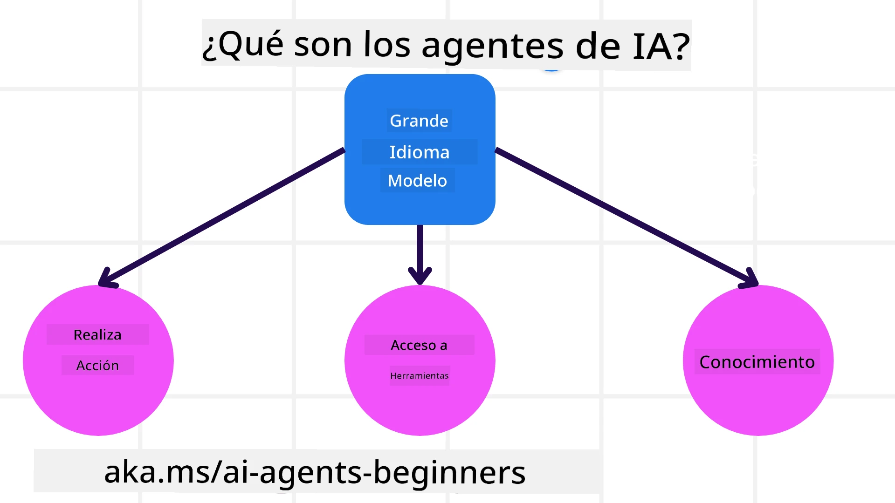
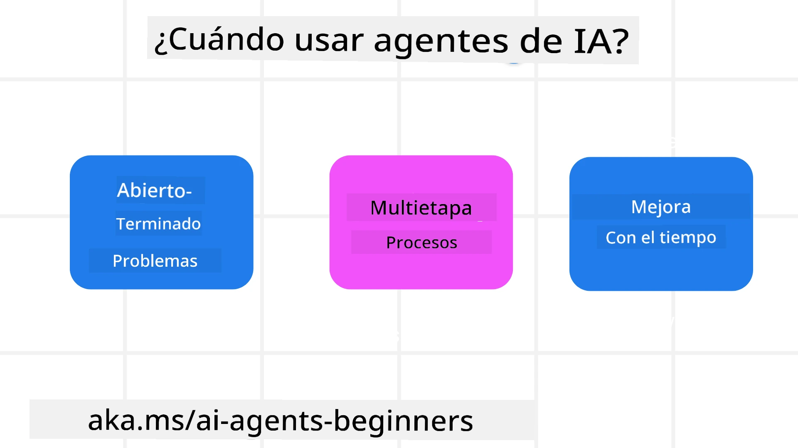

> _(Haz clic en la imagen de arriba para ver el video de esta lección)_

# Introducción a los Agentes de IA y Casos de Uso de Agentes

¡Bienvenido al curso "AI Agents for Beginners"! Este curso ofrece conocimientos fundamentales y ejemplos aplicados para construir Agentes de IA.

Únete a la <a href="https://discord.gg/kzRShWzttr" target="_blank">Azure AI Discord Community</a> para conocer a otros estudiantes y creadores de Agentes de IA y hacer cualquier pregunta que tengas sobre este curso.

Para comenzar este curso, empezamos por obtener una mejor comprensión de qué son los Agentes de IA y cómo podemos usarlos en las aplicaciones y flujos de trabajo que construimos.

## Introducción

Esta lección cubre:

- ¿Qué son los Agentes de IA y cuáles son los diferentes tipos de agentes?
- ¿Qué casos de uso son los más adecuados para los Agentes de IA y cómo pueden ayudarnos?
- ¿Cuáles son algunos de los bloques constructivos básicos al diseñar soluciones agénticas?

## Objetivos de Aprendizaje
Después de completar esta lección, deberías poder:

- Comprender los conceptos de Agentes de IA y cómo se diferencian de otras soluciones de IA.
- Aplicar los Agentes de IA de la manera más eficiente.
- Diseñar soluciones agénticas de forma productiva tanto para usuarios como para clientes.

## Definiendo los Agentes de IA y Tipos de Agentes de IA

### ¿Qué son los Agentes de IA?

Los Agentes de IA son **sistemas** que permiten que los **Modelos de Lenguaje a Gran Escala(LLMs)** **realicen acciones** al extender sus capacidades dándoles a los LLMs **acceso a herramientas** y **conocimiento**.

Desglosemos esta definición en partes más pequeñas:

- **Sistema** - Es importante pensar en los agentes no solo como un único componente sino como un sistema de muchos componentes. A nivel básico, los componentes de un Agente de IA son:
  - **Entorno** - El espacio definido donde el Agente de IA opera. Por ejemplo, si tuviéramos un agente de reserva de viajes, el entorno podría ser el sistema de reservas de viajes que el Agente de IA utiliza para completar tareas.
  - **Sensores** - Los entornos contienen información y proporcionan retroalimentación. Los Agentes de IA usan sensores para recopilar e interpretar esta información sobre el estado actual del entorno. En el ejemplo del Agente de Reserva de Viajes, el sistema de reservas puede proporcionar información como disponibilidad de hoteles o precios de vuelos.
  - **Actuadores** - Una vez que el Agente de IA recibe el estado actual del entorno, para la tarea actual el agente determina qué acción realizar para cambiar el entorno. Para el agente de reservas de viajes, podría ser reservar una habitación disponible para el usuario.

**Modelos de Lenguaje a Gran Escala** - El concepto de agentes existía antes de la creación de los LLMs. La ventaja de construir Agentes de IA con LLMs es su capacidad para interpretar el lenguaje humano y los datos. Esta capacidad permite que los LLMs interpreten la información del entorno y definan un plan para cambiar el entorno.

**Realizar acciones** - Fuera de los sistemas de Agentes de IA, los LLMs están limitados a situaciones en las que la acción es generar contenido o información basada en el prompt del usuario. Dentro de los sistemas de Agentes de IA, los LLMs pueden llevar a cabo tareas interpretando la solicitud del usuario y usando las herramientas disponibles en su entorno.

**Acceso a herramientas** - A qué herramientas tiene acceso el LLM lo define 1) el entorno en el que opera y 2) el desarrollador del Agente de IA. En nuestro ejemplo del agente de viajes, las herramientas del agente están limitadas por las operaciones disponibles en el sistema de reservas y/o el desarrollador puede limitar el acceso del agente a vuelos.

**Memoria+Conocimiento** - La memoria puede ser de corto plazo en el contexto de la conversación entre el usuario y el agente. A largo plazo, fuera de la información proporcionada por el entorno, los Agentes de IA también pueden recuperar conocimiento de otros sistemas, servicios, herramientas e incluso otros agentes. En el ejemplo del agente de viajes, este conocimiento podría ser la información sobre las preferencias de viaje del usuario ubicada en una base de datos de clientes.

### Los diferentes tipos de agentes

Ahora que tenemos una definición general de Agentes de IA, veamos algunos tipos específicos de agentes y cómo se aplicarían a un agente de reservas de viajes.

| **Tipo de Agente**                | **Descripción**                                                                                                                       | **Ejemplo**                                                                                                                                                                                                                   |
| ----------------------------- | ------------------------------------------------------------------------------------------------------------------------------------- | ----------------------------------------------------------------------------------------------------------------------------------------------------------------------------------------------------------------------------- |
| **Agentes Reflexivos Simples**      | Realizan acciones inmediatas basadas en reglas predefinidas.                                                                                  | El agente de viajes interpreta el contexto del correo y reenvía quejas de viaje al servicio de atención al cliente.                                                                                                                          |
| **Agentes Reflexivos Basados en Modelo** | Realizan acciones basadas en un modelo del mundo y en cambios a ese modelo.                                                              | El agente de viajes prioriza rutas con cambios de precio significativos basándose en el acceso a datos históricos de precios.                                                                                                             |
| **Agentes Basados en Objetivos**         | Crean planes para alcanzar objetivos específicos interpretando la meta y determinando acciones para alcanzarla.                                  | El agente de viajes reserva un trayecto determinando los arreglos de viaje necesarios (coche, transporte público, vuelos) desde la ubicación actual hasta el destino.                                                                                |
| **Agentes Basados en Utilidad**      | Consideran preferencias y sopesan compensaciones numéricamente para determinar cómo alcanzar los objetivos.                                               | El agente de viajes maximiza la utilidad sopesando conveniencia frente a costo al reservar el viaje.                                                                                                                                          |
| **Agentes de Aprendizaje**           | Mejoran con el tiempo respondiendo a la retroalimentación y ajustando las acciones en consecuencia.                                                        | El agente de viajes mejora usando la retroalimentación de los clientes de encuestas post-viaje para hacer ajustes en futuras reservas.                                                                                                               |
| **Agentes Jerárquicos**       | Presentan múltiples agentes en un sistema por niveles, con agentes de nivel superior dividiendo tareas en subtareas para que agentes de nivel inferior las completen. | El agente de viajes cancela un viaje dividiendo la tarea en subtareas (por ejemplo, cancelar reservas específicas) y haciendo que agentes de nivel inferior las completen, informando de vuelta al agente de nivel superior.                                     |
| **Sistemas Multiagente (MAS)** | Agentes completan tareas de forma independiente, ya sea cooperando o compitiendo.                                                           | Cooperativo: Varios agentes reservan servicios de viaje específicos como hoteles, vuelos y entretenimiento. Competitivo: Varios agentes gestionan y compiten por un calendario compartido de reservas de hotel para alojar clientes en el hotel. |

## Cuándo usar Agentes de IA

En la sección anterior, usamos el caso de uso del Agente de Viajes para explicar cómo los diferentes tipos de agentes pueden usarse en distintos escenarios de reservas de viajes. Continuaremos usando esta aplicación a lo largo del curso.

Veamos los tipos de casos de uso para los que los Agentes de IA son más adecuados:

- **Problemas Abiertos** - permitir que el LLM determine los pasos necesarios para completar una tarea porque no siempre se puede codificar rígidamente en un flujo de trabajo.
- **Procesos de Múltiples Pasos** - tareas que requieren un nivel de complejidad en el que el Agente de IA necesita usar herramientas o información a lo largo de múltiples interacciones en lugar de una recuperación de un solo paso.  
- **Mejora con el Tiempo** - tareas donde el agente puede mejorar con el tiempo al recibir retroalimentación ya sea de su entorno o de los usuarios para ofrecer una mejor utilidad.

Tratamos más consideraciones sobre el uso de Agentes de IA en la lección "Construyendo Agentes de IA Confiables".

## Fundamentos de Soluciones Agénticas

### Desarrollo de Agentes

El primer paso para diseñar un sistema de Agente de IA es definir las herramientas, acciones y comportamientos. En este curso, nos enfocamos en usar el **Azure AI Agent Service** para definir nuestros Agentes. Ofrece características como:

- Selección de modelos abiertos como OpenAI, Mistral y Llama
- Uso de datos con licencia a través de proveedores como Tripadvisor
- Uso de herramientas estandarizadas OpenAPI 3.0

### Patrones Agénticos

La comunicación con los LLMs se realiza mediante prompts. Dada la naturaleza semiautónoma de los Agentes de IA, no siempre es posible o necesario volver a hacer un prompt manualmente al LLM después de un cambio en el entorno. Usamos **Patrones Agénticos** que nos permiten hacer prompting al LLM durante múltiples pasos de una manera más escalable.

Este curso está dividido en algunos de los patrones Agénticos populares actuales.

### Frameworks Agénticos

Los Frameworks Agénticos permiten a los desarrolladores implementar patrones agénticos mediante código. Estos frameworks ofrecen plantillas, plugins y herramientas para una mejor colaboración entre Agentes de IA. Estos beneficios proporcionan capacidades para una mejor observabilidad y resolución de problemas de los sistemas de Agentes de IA.

En este curso, exploraremos el Microsoft Agent Framework (MAF) para construir agentes de IA listos para producción.

## Ejemplos de código

- Python: [Agent Framework](./code_samples/01-python-agent-framework.ipynb)
- .NET: [Agent Framework](./code_samples/01-dotnet-agent-framework.md)

## ¿Tienes más preguntas sobre Agentes de IA?

Únete al [Microsoft Foundry Discord](https://aka.ms/ai-agents/discord) para conocer a otros estudiantes, asistir a horas de oficina y obtener respuestas a tus preguntas sobre Agentes de IA.

## Lección anterior

[Configuración del curso](../00-course-setup/README.md)

## Próxima lección

[Explorando Frameworks Agénticos](../02-explore-agentic-frameworks/README.md)

---

<!-- CO-OP TRANSLATOR DISCLAIMER START -->
Descargo de responsabilidad:
Este documento ha sido traducido usando el servicio de traducción automática [Co-op Translator](https://github.com/Azure/co-op-translator). Si bien nos esforzamos por la precisión, tenga en cuenta que las traducciones automatizadas pueden contener errores o inexactitudes. El documento original en su idioma nativo debe considerarse la fuente autorizada. Para información crítica, se recomienda una traducción profesional realizada por un traductor humano. No nos hacemos responsables de ningún malentendido o interpretación errónea que surja del uso de esta traducción.
<!-- CO-OP TRANSLATOR DISCLAIMER END -->