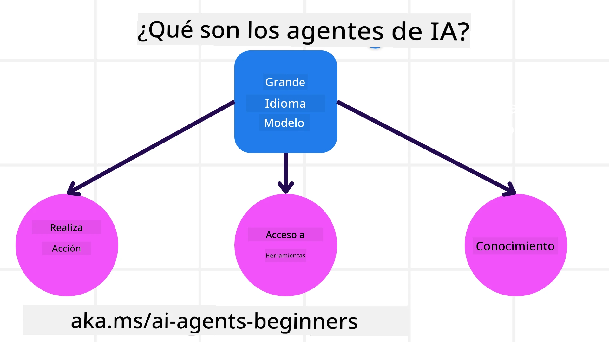
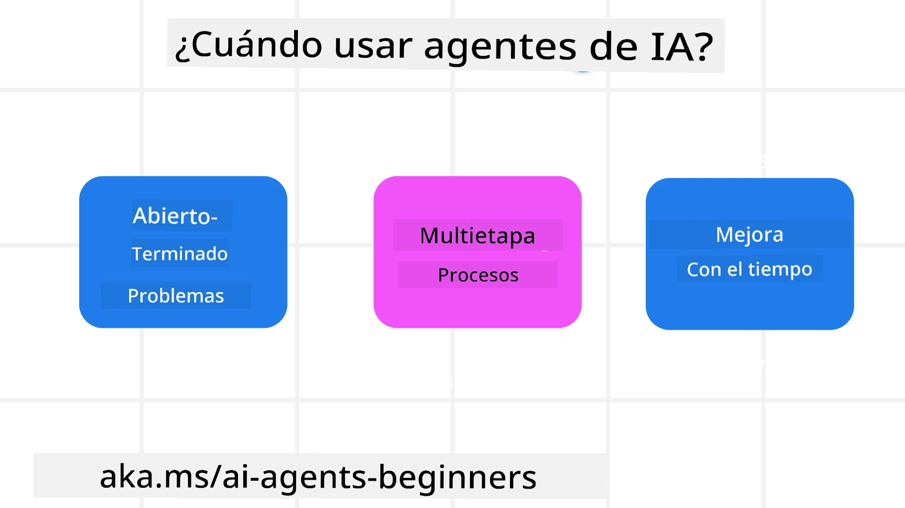

> _(Haz clic en la imagen de arriba para ver el video de esta lección)_

# Introducción a los Agentes de IA y Casos de Uso de Agentes

¡Bienvenido al curso **Agentes de IA para Principiantes**! Este curso te brinda el conocimiento fundamental — y código funcional real — para comenzar a construir Agentes de IA desde cero.

Ven a saludar en la <a href="https://discord.gg/kzRShWzttr" target="_blank">Comunidad de Discord de Azure AI</a> — está llena de aprendices y creadores de IA que están felices de responder preguntas.

Antes de ponernos a construir, asegurémonos de entender realmente qué es un Agente de IA y cuándo tiene sentido usar uno.

---

## Introducción

Esta lección cubre:

- Qué son los Agentes de IA y los diferentes tipos que existen
- Para qué tipos de tareas los Agentes de IA son más adecuados
- Los bloques fundamentales que usarás al diseñar una solución agentica

## Objetivos de Aprendizaje

Al final de esta lección, deberías poder:

- Explicar qué es un Agente de IA y cómo se diferencia de una solución de IA regular
- Saber cuándo recurrir a un Agente de IA (y cuándo no)
- Bosquejar un diseño básico de solución agentica para un problema del mundo real

---

## Definiendo Agentes de IA y Tipos de Agentes de IA

### ¿Qué son los Agentes de IA?

Aquí hay una manera simple de pensarlo:

> **Los Agentes de IA son sistemas que permiten que los Modelos de Lenguaje Grande (LLMs) realmente *hagan cosas* — dándoles herramientas y conocimiento para actuar en el mundo, no solo responder a instrucciones.**

Desglosemos un poco esto:

- **Sistema** — Un Agente de IA no es solo una cosa. Es una colección de partes trabajando juntas. En su núcleo, cada agente tiene tres piezas:
  - **Entorno** — El espacio en el que el agente trabaja. Para un agente de reservas de viajes, este sería la plataforma de reservas misma.
  - **Sensores** — Cómo el agente lee el estado actual de su entorno. Nuestro agente de viajes podría verificar la disponibilidad de hoteles o precios de vuelos.
  - **Actuadores** — Cómo el agente toma acción. El agente de viajes podría reservar una habitación, enviar una confirmación o cancelar una reserva.

- **Modelos de Lenguaje Grande** — Los agentes existían antes de los LLMs, pero los LLMs son lo que hace que los agentes modernos sean tan poderosos. Pueden entender el lenguaje natural, razonar sobre el contexto y convertir una solicitud vaga del usuario en un plan concreto de acción.

- **Realizar Acciones** — Sin un sistema de agente, un LLM solo genera texto. Dentro de un sistema de agente, el LLM puede realmente *ejecutar* pasos — buscar en una base de datos, llamar a una API, enviar un mensaje.

- **Acceso a Herramientas** — Las herramientas que el agente puede usar dependen de (1) el entorno en el que se ejecuta y (2) lo que el desarrollador decidió darle. Un agente de viajes podría poder buscar vuelos pero no editar registros de clientes — todo depende de cómo esté configurado.

- **Memoria + Conocimiento** — Los agentes pueden tener memoria a corto plazo (la conversación actual) y memoria a largo plazo (una base de datos de clientes, interacciones pasadas). El agente de viajes podría “recordar” que prefieres asientos junto a la ventana.

---

### Los Diferentes Tipos de Agentes de IA

No todos los agentes están construidos igual. Aquí tienes un desglose de los principales tipos, usando un agente de reservas de viajes como ejemplo recurrente:

| **Tipo de Agente** | **Qué Hace** | **Ejemplo de Agente de Viajes** |
|---|---|---|
| **Agentes Reflexivos Simples** | Sigue reglas codificadas — no tiene memoria ni planificación. | Ve un correo de queja → lo reenvía a servicio al cliente. Eso es todo. |
| **Agentes Reflexivos Basados en Modelo** | Mantiene un modelo interno del mundo y lo actualiza conforme cambian las cosas. | Rastrea precios históricos de vuelos y marca rutas que se vuelven caras de repente. |
| **Agentes Basados en Metas** | Tiene una meta en mente y resuelve cómo alcanzarla paso a paso. | Reserva un viaje completo (vuelos, coche, hotel) desde tu ubicación actual para llegar a tu destino. |
| **Agentes Basados en Utilidad** | No solo encuentra *una* solución — encuentra la *mejor* ponderando las compensaciones. | Equilibra costo vs. conveniencia para encontrar el viaje que mejor se adapta a tus preferencias. |
| **Agentes de Aprendizaje** | Mejora con el tiempo aprendiendo del feedback. | Ajusta las recomendaciones futuras de reservas según resultados de encuestas posteriores al viaje. |
| **Agentes Jerárquicos** | Un agente de alto nivel divide el trabajo en subtareas y las delega a agentes de nivel inferior. | Una solicitud de "cancelar viaje" se divide en: cancelar vuelo, cancelar hotel, cancelar alquiler de coche — cada una manejada por un sub-agente. |
| **Sistemas Multi-Agente (MAS)** | Varios agentes independientes trabajando juntos (o compitiendo). | Cooperativo: agentes separados manejan hoteles, vuelos y entretenimiento. Competitivo: varios agentes compiten para llenar habitaciones de hotel al mejor precio. |

---

## Cuándo Usar Agentes de IA

Solo porque *puedes* usar un Agente de IA no significa que siempre *debas*. Aquí están las situaciones donde los agentes realmente destacan:

- **Problemas Abiertos** — Cuando los pasos para resolver un problema no pueden preprogramarse. Necesitas que el LLM descubra el camino dinámicamente.
- **Procesos Multi-Pasos** — Tareas que requieren usar herramientas a lo largo de varias interacciones, no solo una consulta o generación única.
- **Mejora con el Tiempo** — Cuando quieres que el sistema se vuelva más inteligente basado en feedback del usuario o señales del entorno.

Analizaremos más a fondo cuándo (y cuándo *no*) usar Agentes de IA en la lección **Construyendo Agentes de IA Confiables** más adelante en el curso.

---

## Fundamentos de Soluciones Agenticas

### Desarrollo de Agentes

Lo primero que haces al construir un agente es definir *qué puede hacer* — sus herramientas, acciones y comportamientos.

En este curso, usamos el **Azure AI Agent Service** como nuestra plataforma principal. Este soporta:

- Modelos de proveedores como OpenAI, Mistral y Meta (Llama)
- Datos licenciados de proveedores como Tripadvisor
- Definiciones de herramientas estandarizadas OpenAPI 3.0

### Patrones Agenticos

Te comunicas con LLMs a través de prompts. Con agentes, no siempre puedes crear manualmente cada prompt — el agente necesita actuar a lo largo de muchos pasos. Ahí es donde entran los **Patrones Agenticos**. Son estrategias reutilizables para prompting y orquestar LLMs de manera más escalable y confiable.

Este curso está estructurado alrededor de los patrones agenticos más comunes y útiles.

### Frameworks Agenticos

Los Frameworks Agenticos ofrecen a los desarrolladores plantillas, herramientas e infraestructura listas para construir agentes. Facilitan:

- Conectar herramientas y capacidades
- Observar qué está haciendo el agente (y depurar cuando algo falla)
- Colaborar entre múltiples agentes

En este curso, nos enfocamos en el **Microsoft Agent Framework (MAF)** para construir agentes listos para producción.

---

## Ejemplos de Código

¿Listo para verlo en acción? Aquí están los ejemplos de código para esta lección:

- 🐍 Python: [Agent Framework](./code_samples/01-python-agent-framework.ipynb)
- 🔷 .NET: [Agent Framework](./code_samples/01-dotnet-agent-framework.md)

---

## ¿Tienes Preguntas?

Únete al [Microsoft Foundry Discord](https://discord.com/invite/ATgtXmAS5D) para conectar con otros aprendices, asistir a horas de oficina y resolver tus dudas sobre Agentes de IA con la comunidad.

---

## Lección Anterior

[Configuración del Curso](../00-course-setup/README.md)

## Próxima Lección

[Explorando Frameworks Agenticos](../02-explore-agentic-frameworks/README.md)

---

<!-- CO-OP TRANSLATOR DISCLAIMER START -->
**Descargo de responsabilidad**:
Este documento ha sido traducido utilizando el servicio de traducción automática [Co-op Translator](https://github.com/Azure/co-op-translator). Aunque nos esforzamos por la precisión, tenga en cuenta que las traducciones automatizadas pueden contener errores o inexactitudes. El documento original en su idioma nativo debe considerarse la fuente autorizada. Para información crítica, se recomienda una traducción profesional humana. No somos responsables de cualquier malentendido o interpretación errónea que surja del uso de esta traducción.
<!-- CO-OP TRANSLATOR DISCLAIMER END -->