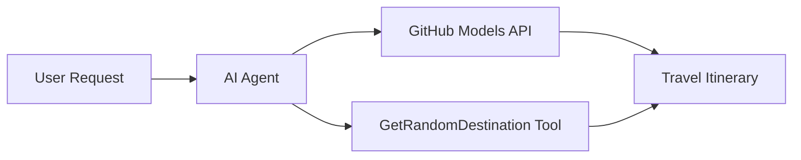

# 🌍 Agente de Viajes con Microsoft Agent Framework (.NET)

## 📋 Resumen del Escenario

Este cuaderno muestra cómo construir un agente inteligente para la planificación de viajes utilizando el Microsoft Agent Framework para .NET. El agente puede generar automáticamente itinerarios personalizados de excursiones de un día para destinos aleatorios alrededor del mundo.

**Capacidades Clave:**
- 🎲 **Selección Aleatoria de Destinos**: Utiliza una herramienta personalizada para elegir lugares de vacaciones
- 🗺️ **Planificación Inteligente de Viajes**: Crea itinerarios detallados día a día
- 🔄 **Transmisión en Tiempo Real**: Soporta respuestas inmediatas y en streaming
- 🛠️ **Integración de Herramientas Personalizadas**: Demuestra cómo extender las capacidades del agente

## 🔧 Arquitectura Técnica

### Tecnologías Principales
- **Microsoft Agent Framework**: Implementación más reciente de .NET para el desarrollo de agentes de IA
- **Integración con Modelos de GitHub**: Utiliza el servicio de inferencia de modelos de IA de GitHub
- **Compatibilidad con la API de OpenAI**: Aprovecha las bibliotecas cliente de OpenAI con endpoints personalizados
- **Configuración Segura**: Gestión de claves API basada en el entorno

### Componentes Clave
1. **AIAgent**: El orquestador principal del agente que maneja el flujo de conversación
2. **Herramientas Personalizadas**: Función `GetRandomDestination()` disponible para el agente
3. **Cliente de Chat**: Interfaz de conversación respaldada por los Modelos de GitHub
4. **Soporte de Streaming**: Capacidades de generación de respuestas en tiempo real

### Patrón de Integración


## 🚀 Primeros Pasos

**Requisitos Previos:**
- .NET 9.0 o superior
- Token de acceso a la API de Modelos de GitHub
- Variables de entorno configuradas en el archivo `.env`

**Variables de Entorno Requeridas:**
```env
GITHUB_TOKEN=your_github_token
GITHUB_ENDPOINT=https://models.inference.ai.azure.com
GITHUB_MODEL_ID=gpt-4o-mini
```

¡Ejecuta las celdas a continuación en secuencia para ver al agente de viajes en acción!

---

## .NET Single File App: AI Travel Agent Example

See `01-dotnet-agent-framework.cs` for the complete runnable code sample.

Ejecute el ejemplo de código a continuación:

```bash
dotnet run 01-dotnet-agent-framework.cs
```

### Sample Code

```csharp
static string GetRandomDestination()
{
    var destinations = new List<string>
    {
        "Paris, France",
        "Tokyo, Japan",
        "New York City, USA",
        "Sydney, Australia",
        "Rome, Italy",
        "Barcelona, Spain",
        "Cape Town, South Africa",
        "Rio de Janeiro, Brazil",
        "Bangkok, Thailand",
        "Vancouver, Canada"
    };
    var random = new Random();
    int index = random.Next(destinations.Count);
    return destinations[index];
}

// Extract configuration from environment variables
var github_endpoint = Environment.GetEnvironmentVariable("GITHUB_ENDPOINT") ?? throw new InvalidOperationException("GITHUB_ENDPOINT is not set.");
var github_model_id = Environment.GetEnvironmentVariable("GITHUB_MODEL_ID") ?? "gpt-4o-mini";
var github_token = Environment.GetEnvironmentVariable("GITHUB_TOKEN") ?? throw new InvalidOperationException("GITHUB_TOKEN is not set.");

// Configure OpenAI Client Options
var openAIOptions = new OpenAIClientOptions()
{
    Endpoint = new Uri(github_endpoint)
};

// Initialize OpenAI Client with GitHub Models Configuration
var openAIClient = new OpenAIClient(new ApiKeyCredential(github_token), openAIOptions);

// Create AI Agent with Travel Planning Capabilities
AIAgent agent = openAIClient
    .GetChatClient(github_model_id)
    .CreateAIAgent(
        instructions: "You are a helpful AI Agent that can help plan vacations for customers at random destinations",
        tools: [AIFunctionFactory.Create(GetRandomDestination)]
    );

// Execute Agent: Plan a Day Trip (Non-Streaming)
Console.WriteLine(await agent.RunAsync("Plan me a day trip"));

// Execute Agent: Plan a Day Trip (Streaming Response)
await foreach (var update in agent.RunStreamingAsync("Plan me a day trip"))
{
    Console.Write(update);
}
```
