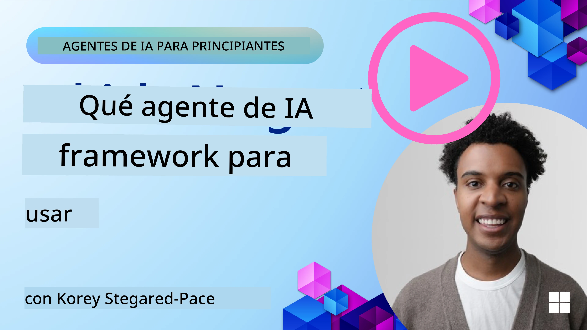

[](https://youtu.be/ODwF-EZo_O8?si=1xoy_B9RNQfrYdF7)

> _(Haga clic en la imagen de arriba para ver el video de esta lección)_

# Explorar marcos de agentes de IA

Los marcos de agentes de IA son plataformas de software diseñadas para simplificar la creación, el despliegue y la gestión de agentes de IA. Estos marcos proporcionan a los desarrolladores componentes, abstracciones y herramientas preconstruidas que agilizan el desarrollo de sistemas de IA complejos.

Estos marcos ayudan a los desarrolladores a centrarse en los aspectos únicos de sus aplicaciones al ofrecer enfoques estandarizados para los desafíos comunes en el desarrollo de agentes de IA. Mejoran la escalabilidad, la accesibilidad y la eficiencia en la construcción de sistemas de IA.

## Introducción 

Esta lección cubrirá:

- ¿Qué son los marcos de agentes de IA y qué permiten lograr a los desarrolladores?
- ¿Cómo pueden los equipos usar estos marcos para prototipar, iterar y mejorar rápidamente las capacidades de su agente?
- ¿Cuáles son las diferencias entre los marcos y herramientas creados por Microsoft (<a href="https://aka.ms/ai-agents-beginners/ai-agent-service" target="_blank">Azure AI Agent Service</a> y el <a href="https://learn.microsoft.com/azure/ai-services/openai/how-to/responses" target="_blank">Microsoft Agent Framework</a>)?
- ¿Puedo integrar mis herramientas existentes del ecosistema Azure directamente, o necesito soluciones independientes?
- ¿Qué es Azure AI Agents service y cómo me está ayudando esto?

## Objetivos de aprendizaje

Los objetivos de esta lección son ayudarle a entender:

- El papel de los marcos de agentes de IA en el desarrollo de IA.
- Cómo aprovechar los marcos de agentes de IA para construir agentes inteligentes.
- Capacidades clave habilitadas por los marcos de agentes de IA.
- Las diferencias entre Microsoft Agent Framework y Azure AI Agent Service.

## ¿Qué son los marcos de agentes de IA y qué permiten hacer a los desarrolladores?

Los marcos tradicionales de IA pueden ayudarle a integrar IA en sus aplicaciones y mejorar estas aplicaciones de las siguientes maneras:

- **Personalización**: La IA puede analizar el comportamiento y las preferencias del usuario para proporcionar recomendaciones, contenido y experiencias personalizadas.
Example: Streaming services like Netflix use AI to suggest movies and shows based on viewing history, enhancing user engagement and satisfaction.
- **Automatización y eficiencia**: La IA puede automatizar tareas repetitivas, optimizar flujos de trabajo y mejorar la eficiencia operativa.
Example: Customer service apps use AI-powered chatbots to handle common inquiries, reducing response times and freeing up human agents for more complex issues.
- **Mejora de la experiencia del usuario**: La IA puede mejorar la experiencia general del usuario proporcionando funciones inteligentes como reconocimiento de voz, procesamiento de lenguaje natural y texto predictivo.
Example: Virtual assistants like Siri and Google Assistant use AI to understand and respond to voice commands, making it easier for users to interact with their devices.

### Todo eso suena genial, ¿entonces por qué necesitamos el Marco de Agentes de IA?

Los marcos de agentes de IA representan algo más que simples marcos de IA. Están diseñados para permitir la creación de agentes inteligentes que puedan interactuar con usuarios, otros agentes y el entorno para alcanzar objetivos específicos. Estos agentes pueden mostrar comportamiento autónomo, tomar decisiones y adaptarse a condiciones cambiantes. Veamos algunas capacidades clave habilitadas por los marcos de agentes de IA:

- **Colaboración y coordinación de agentes**: Permiten la creación de múltiples agentes de IA que pueden trabajar juntos, comunicarse y coordinarse para resolver tareas complejas.
- **Automatización y gestión de tareas**: Proporcionan mecanismos para automatizar flujos de trabajo de varios pasos, delegación de tareas y gestión dinámica de tareas entre agentes.
- **Comprensión contextual y adaptación**: Dotan a los agentes de la capacidad de comprender el contexto, adaptarse a entornos cambiantes y tomar decisiones basadas en información en tiempo real.

En resumen, los agentes le permiten hacer más, llevar la automatización al siguiente nivel y crear sistemas más inteligentes que puedan adaptarse y aprender de su entorno.

## ¿Cómo prototipar, iterar y mejorar rápidamente las capacidades del agente?

Este es un panorama que evoluciona rápidamente, pero hay algunas cosas comunes en la mayoría de los marcos de agentes de IA que pueden ayudarle a prototipar e iterar rápidamente, a saber, componentes modularizados, herramientas colaborativas y aprendizaje en tiempo real. Vamos a profundizar en estos:

- **Use componentes modulares**: Los SDK de IA ofrecen componentes preconstruidos como conectores de IA y de memoria, llamadas a funciones usando lenguaje natural o complementos de código, plantillas de prompts y más.
- **Aproveche las herramientas colaborativas**: Diseñe agentes con roles y tareas específicas, permitiéndoles probar y refinar flujos de trabajo colaborativos.
- **Aprenda en tiempo real**: Implemente bucles de retroalimentación donde los agentes aprendan de las interacciones y ajusten su comportamiento de forma dinámica.

### Use componentes modulares

SDKs como el Microsoft Agent Framework ofrecen componentes preconstruidos como conectores de IA, definiciones de herramientas y gestión de agentes.

**Cómo pueden usar estos los equipos**: Los equipos pueden ensamblar rápidamente estos componentes para crear un prototipo funcional sin empezar desde cero, lo que permite experimentar e iterar rápidamente.

**Cómo funciona en la práctica**: Puede usar un parser preconstruido para extraer información de la entrada del usuario, un módulo de memoria para almacenar y recuperar datos, y un generador de prompts para interactuar con los usuarios, todo sin tener que construir estos componentes desde cero.

**Código de ejemplo**. Veamos un ejemplo de cómo puede usar el Microsoft Agent Framework con `AzureAIProjectAgentProvider` para que el modelo responda a la entrada del usuario con llamadas a herramientas:

``` python
# Ejemplo de Microsoft Agent Framework en Python

import asyncio
import os
from typing import Annotated

from agent_framework.azure import AzureAIProjectAgentProvider
from azure.identity import AzureCliCredential


# Definir una función de herramienta de ejemplo para reservar viajes
def book_flight(date: str, location: str) -> str:
    """Book travel given location and date."""
    return f"Travel was booked to {location} on {date}"


async def main():
    provider = AzureAIProjectAgentProvider(credential=AzureCliCredential())
    agent = await provider.create_agent(
        name="travel_agent",
        instructions="Help the user book travel. Use the book_flight tool when ready.",
        tools=[book_flight],
    )

    response = await agent.run("I'd like to go to New York on January 1, 2025")
    print(response)
    # Ejemplo de salida: Su vuelo a Nueva York el 1 de enero de 2025 ha sido reservado con éxito. ¡Buen viaje! ✈️🗽


if __name__ == "__main__":
    asyncio.run(main())
```

Lo que puede ver en este ejemplo es cómo puede aprovechar un parser preconstruido para extraer información clave de la entrada del usuario, como el origen, el destino y la fecha de una solicitud de reserva de vuelo. Este enfoque modular le permite centrarse en la lógica de alto nivel.

### Aproveche las herramientas colaborativas

Marcos como el Microsoft Agent Framework facilitan la creación de múltiples agentes que pueden trabajar juntos.

**Cómo pueden usar estos los equipos**: Los equipos pueden diseñar agentes con roles y tareas específicos, permitiéndoles probar y refinar flujos de trabajo colaborativos y mejorar la eficiencia general del sistema.

**Cómo funciona en la práctica**: Puede crear un equipo de agentes donde cada agente tenga una función especializada, como recuperación de datos, análisis o toma de decisiones. Estos agentes pueden comunicarse y compartir información para lograr un objetivo común, como responder a una consulta de un usuario o completar una tarea.

**Código de ejemplo (Microsoft Agent Framework)**:

```python
# Creando múltiples agentes que trabajan juntos usando el Microsoft Agent Framework

import os
from agent_framework.azure import AzureAIProjectAgentProvider
from azure.identity import AzureCliCredential

provider = AzureAIProjectAgentProvider(credential=AzureCliCredential())

# Agente de Recuperación de Datos
agent_retrieve = await provider.create_agent(
    name="dataretrieval",
    instructions="Retrieve relevant data using available tools.",
    tools=[retrieve_tool],
)

# Agente de Análisis de Datos
agent_analyze = await provider.create_agent(
    name="dataanalysis",
    instructions="Analyze the retrieved data and provide insights.",
    tools=[analyze_tool],
)

# Ejecutar agentes en secuencia en una tarea
retrieval_result = await agent_retrieve.run("Retrieve sales data for Q4")
analysis_result = await agent_analyze.run(f"Analyze this data: {retrieval_result}")
print(analysis_result)
```

Lo que se ve en el código anterior es cómo puede crear una tarea que implique a múltiples agentes trabajando juntos para analizar datos. Cada agente realiza una función específica y la tarea se ejecuta coordinando a los agentes para lograr el resultado deseado. Al crear agentes dedicados con roles especializados, puede mejorar la eficiencia y el rendimiento de las tareas.

### Aprenda en tiempo real

Los marcos avanzados proporcionan capacidades para comprensión contextual y adaptación en tiempo real.

**Cómo pueden usar estos los equipos**: Los equipos pueden implementar bucles de retroalimentación donde los agentes aprendan de las interacciones y ajusten su comportamiento de forma dinámica, lo que conduce a una mejora continua y refinamiento de las capacidades.

**Cómo funciona en la práctica**: Los agentes pueden analizar la retroalimentación del usuario, los datos del entorno y los resultados de las tareas para actualizar su base de conocimiento, ajustar algoritmos de toma de decisiones y mejorar el rendimiento con el tiempo. Este proceso iterativo de aprendizaje permite a los agentes adaptarse a condiciones cambiantes y a las preferencias de los usuarios, mejorando la efectividad general del sistema.

## ¿Cuáles son las diferencias entre Microsoft Agent Framework y Azure AI Agent Service?

Hay muchas formas de comparar estos enfoques, pero veamos algunas diferencias clave en términos de diseño, capacidades y casos de uso objetivo:

## Microsoft Agent Framework (MAF)

Microsoft Agent Framework proporciona un SDK optimizado para construir agentes de IA usando `AzureAIProjectAgentProvider`. Permite a los desarrolladores crear agentes que aprovechan modelos de Azure OpenAI con llamadas a herramientas integradas, gestión de conversaciones y seguridad de nivel empresarial mediante identidad de Azure.

**Casos de uso**: Construir agentes de IA listos para producción con uso de herramientas, flujos de trabajo de varios pasos y escenarios de integración empresarial.

Aquí hay algunos conceptos centrales importantes del Microsoft Agent Framework:

- **Agents**. Un agente se crea mediante `AzureAIProjectAgentProvider` y se configura con un nombre, instrucciones y herramientas. El agente puede:
  - **Procesar mensajes de usuario** y generar respuestas usando modelos de Azure OpenAI.
  - **Llamar herramientas** automáticamente según el contexto de la conversación.
  - **Mantener el estado de la conversación** a lo largo de múltiples interacciones.

  Aquí hay un fragmento de código que muestra cómo crear un agente:

    ```python
    import os
    from agent_framework.azure import AzureAIProjectAgentProvider
    from azure.identity import AzureCliCredential

    provider = AzureAIProjectAgentProvider(credential=AzureCliCredential())
    agent = await provider.create_agent(
        name="my_agent",
        instructions="You are a helpful assistant.",
    )

    response = await agent.run("Hello, World!")
    print(response)
    ```

- **Tools**. El framework admite definir herramientas como funciones de Python que el agente puede invocar automáticamente. Las herramientas se registran al crear el agente:

    ```python
    def get_weather(location: str) -> str:
        """Get the current weather for a location."""
        return f"The weather in {location} is sunny, 72\u00b0F."

    agent = await provider.create_agent(
        name="weather_agent",
        instructions="Help users check the weather.",
        tools=[get_weather],
    )
    ```

- **Coordinación multiagente**. Puede crear múltiples agentes con diferentes especializaciones y coordinar su trabajo:

    ```python
    planner = await provider.create_agent(
        name="planner",
        instructions="Break down complex tasks into steps.",
    )

    executor = await provider.create_agent(
        name="executor",
        instructions="Execute the planned steps using available tools.",
        tools=[execute_tool],
    )

    plan = await planner.run("Plan a trip to Paris")
    result = await executor.run(f"Execute this plan: {plan}")
    ```

- **Integración de identidad de Azure**. El framework usa `AzureCliCredential` (o `DefaultAzureCredential`) para autenticación segura sin claves, eliminando la necesidad de gestionar claves de API directamente.

## Azure AI Agent Service

Azure AI Agent Service es una incorporación más reciente, introducida en Microsoft Ignite 2024. Permite el desarrollo y despliegue de agentes de IA con modelos más flexibles, como la posibilidad de llamar directamente a LLMs de código abierto como Llama 3, Mistral y Cohere.

Azure AI Agent Service proporciona mecanismos de seguridad empresarial y métodos de almacenamiento de datos más robustos, lo que lo hace adecuado para aplicaciones empresariales.

Funciona listo para usar con Microsoft Agent Framework para construir y desplegar agentes.

Este servicio está actualmente en Public Preview y admite Python y C# para la creación de agentes.

Usando el SDK de Python de Azure AI Agent Service, podemos crear un agente con una herramienta definida por el usuario:

```python
import asyncio
from azure.identity import DefaultAzureCredential
from azure.ai.projects import AIProjectClient

# Definir funciones de herramientas
def get_specials() -> str:
    """Provides a list of specials from the menu."""
    return """
    Special Soup: Clam Chowder
    Special Salad: Cobb Salad
    Special Drink: Chai Tea
    """

def get_item_price(menu_item: str) -> str:
    """Provides the price of the requested menu item."""
    return "$9.99"


async def main() -> None:
    credential = DefaultAzureCredential()
    project_client = AIProjectClient.from_connection_string(
        credential=credential,
        conn_str="your-connection-string",
    )

    agent = project_client.agents.create_agent(
        model="gpt-4o-mini",
        name="Host",
        instructions="Answer questions about the menu.",
        tools=[get_specials, get_item_price],
    )

    thread = project_client.agents.create_thread()

    user_inputs = [
        "Hello",
        "What is the special soup?",
        "How much does that cost?",
        "Thank you",
    ]

    for user_input in user_inputs:
        print(f"# User: '{user_input}'")
        message = project_client.agents.create_message(
            thread_id=thread.id,
            role="user",
            content=user_input,
        )
        run = project_client.agents.create_and_process_run(
            thread_id=thread.id, agent_id=agent.id
        )
        messages = project_client.agents.list_messages(thread_id=thread.id)
        print(f"# Agent: {messages.data[0].content[0].text.value}")


if __name__ == "__main__":
    asyncio.run(main())
```

### Conceptos clave

Azure AI Agent Service tiene los siguientes conceptos centrales:

- **Agent**. Azure AI Agent Service se integra con Microsoft Foundry. Dentro de AI Foundry, un agente de IA actúa como un microservicio "inteligente" que puede usarse para responder preguntas (RAG), realizar acciones o automatizar por completo flujos de trabajo. Lo consigue combinando el poder de los modelos generativos de IA con herramientas que le permiten acceder e interactuar con fuentes de datos del mundo real. Aquí hay un ejemplo de un agente:

    ```python
    agent = project_client.agents.create_agent(
        model="gpt-4o-mini",
        name="my-agent",
        instructions="You are helpful agent",
        tools=code_interpreter.definitions,
        tool_resources=code_interpreter.resources,
    )
    ```

    En este ejemplo, se crea un agente con el modelo `gpt-4o-mini`, un nombre `my-agent` y las instrucciones `You are helpful agent`. El agente está equipado con herramientas y recursos para realizar tareas de interpretación de código.

- **Thread and messages**. El thread es otro concepto importante. Representa una conversación o interacción entre un agente y un usuario. Los threads pueden usarse para seguir el progreso de una conversación, almacenar información de contexto y gestionar el estado de la interacción. Aquí hay un ejemplo de un thread:

    ```python
    thread = project_client.agents.create_thread()
    message = project_client.agents.create_message(
        thread_id=thread.id,
        role="user",
        content="Could you please create a bar chart for the operating profit using the following data and provide the file to me? Company A: $1.2 million, Company B: $2.5 million, Company C: $3.0 million, Company D: $1.8 million",
    )
    
    # Ask the agent to perform work on the thread
    run = project_client.agents.create_and_process_run(thread_id=thread.id, agent_id=agent.id)
    
    # Fetch and log all messages to see the agent's response
    messages = project_client.agents.list_messages(thread_id=thread.id)
    print(f"Messages: {messages}")
    ```

    En el código anterior, se crea un thread. A continuación, se envía un mensaje al thread. Al llamar a `create_and_process_run`, se solicita al agente que realice trabajo en el thread. Finalmente, se obtienen y registran los mensajes para ver la respuesta del agente. Los mensajes indican el progreso de la conversación entre el usuario y el agente. También es importante entender que los mensajes pueden ser de diferentes tipos como texto, imagen o archivo, es decir, el trabajo de los agentes ha dado como resultado por ejemplo una imagen o una respuesta de texto, por ejemplo. Como desarrollador, puede usar esta información para procesar más la respuesta o presentarla al usuario.

- **Se integra con Microsoft Agent Framework**. Azure AI Agent Service funciona sin problemas con Microsoft Agent Framework, lo que significa que puede construir agentes usando `AzureAIProjectAgentProvider` y desplegarlos a través del Agent Service para escenarios de producción.

**Casos de uso**: Azure AI Agent Service está diseñado para aplicaciones empresariales que requieren despliegue de agentes de IA seguro, escalable y flexible.

## ¿Cuál es la diferencia entre estos enfoques?
 
Parece que hay superposición, pero hay algunas diferencias clave en términos de su diseño, capacidades y casos de uso objetivo:
 
- **Microsoft Agent Framework (MAF)**: Es un SDK listo para producción para construir agentes de IA. Proporciona una API optimizada para crear agentes con llamadas a herramientas, gestión de conversaciones e integración de identidad de Azure.
- **Azure AI Agent Service**: Es una plataforma y servicio de despliegue en Azure Foundry para agentes. Ofrece conectividad integrada con servicios como Azure OpenAI, Azure AI Search, Bing Search y ejecución de código.
 
¿Aún no está seguro de cuál elegir?

### Casos de uso
 
Veamos si podemos ayudarle repasando algunos casos de uso comunes:
 
> Q: Estoy creando aplicaciones de agentes de IA para producción y quiero empezar rápidamente
>

>A: Microsoft Agent Framework es una gran opción. Proporciona una API simple y de estilo Python a través de `AzureAIProjectAgentProvider` que le permite definir agentes con herramientas e instrucciones en solo unas pocas líneas de código.

>Q: Necesito un despliegue de nivel empresarial con integraciones de Azure como Search y ejecución de código
>
> A: Azure AI Agent Service es la opción más adecuada. Es un servicio de plataforma que ofrece capacidades integradas para múltiples modelos, Azure AI Search, Bing Search y Azure Functions. Facilita la creación de sus agentes en el Foundry Portal y su despliegue a escala.
 
> Q: Sigo confundido, sólo déme una opción
>
> A: Comience con Microsoft Agent Framework para construir sus agentes y luego use Azure AI Agent Service cuando necesite desplegarlos y escalarlos en producción. Este enfoque le permite iterar rápidamente en la lógica de su agente mientras tiene una ruta clara hacia el despliegue empresarial.
 
Resumamos las diferencias clave en una tabla:

| Framework | Focus | Core Concepts | Use Cases |
| --- | --- | --- | --- |
| Microsoft Agent Framework | Streamlined agent SDK with tool calling | Agents, Tools, Azure Identity | Building AI agents, tool use, multi-step workflows |
| Azure AI Agent Service | Flexible models, enterprise security, Code generation, Tool calling | Modularity, Collaboration, Process Orchestration | Secure, scalable, and flexible AI agent deployment |

## ¿Puedo integrar mis herramientas del ecosistema Azure existentes directamente, o necesito soluciones independientes?
La respuesta es sí, puedes integrar tus herramientas existentes del ecosistema de Azure directamente con Azure AI Agent Service, especialmente, ya que ha sido construido para funcionar sin problemas con otros servicios de Azure. Por ejemplo, podrías integrar Bing, Azure AI Search y Azure Functions. También existe una integración profunda con Microsoft Foundry.

The Microsoft Agent Framework also integrates with Azure services through `AzureAIProjectAgentProvider` and Azure identity, letting you call Azure services directly from your agent tools.

## Ejemplos de código

- Python: [Agent Framework](./code_samples/02-python-agent-framework.ipynb)
- .NET: [Agent Framework](./code_samples/02-dotnet-agent-framework.md)

## ¿Tienes más preguntas sobre AI Agent Frameworks?

Únete al [Microsoft Foundry Discord](https://aka.ms/ai-agents/discord) para reunirte con otros aprendices, asistir a horas de oficina y resolver tus preguntas sobre Agentes de IA.

## Referencias

- <a href="https://techcommunity.microsoft.com/blog/azure-ai-services-blog/introducing-azure-ai-agent-service/4298357" target="_blank">Azure Agent Service</a>
- <a href="https://learn.microsoft.com/azure/ai-services/openai/how-to/responses" target="_blank">Microsoft Agent Framework - Azure OpenAI Responses</a>
- <a href="https://learn.microsoft.com/azure/ai-services/agents/overview" target="_blank">Azure AI Agent service</a>

## Lección anterior

[Introducción a los agentes de IA y casos de uso de agentes](../01-intro-to-ai-agents/README.md)

## Lección siguiente

[Comprender los patrones de diseño agénticos](../03-agentic-design-patterns/README.md)

---

<!-- CO-OP TRANSLATOR DISCLAIMER START -->
Aviso legal:
Este documento ha sido traducido utilizando el servicio de traducción automática Co‑op Translator (https://github.com/Azure/co-op-translator). Aunque nos esforzamos por la precisión, tenga en cuenta que las traducciones automáticas pueden contener errores o imprecisiones. El documento original en su idioma nativo debe considerarse la fuente autorizada. Para información crítica, se recomienda una traducción profesional realizada por un traductor humano. No nos hacemos responsables de ningún malentendido o interpretación errónea que pueda derivarse del uso de esta traducción.
<!-- CO-OP TRANSLATOR DISCLAIMER END -->