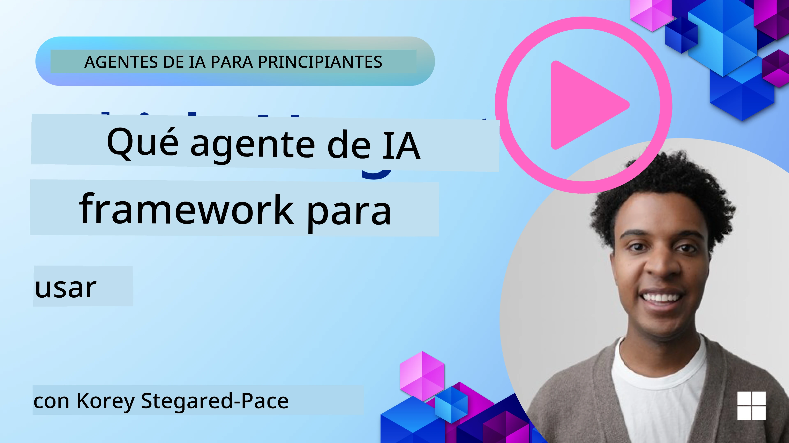

[](https://youtu.be/ODwF-EZo_O8?si=1xoy_B9RNQfrYdF7)

> _(Haz clic en la imagen de arriba para ver el video de esta lección)_

# Explorar Frameworks de Agentes de IA

Los frameworks de agentes de IA son plataformas de software diseñadas para simplificar la creación, implementación y gestión de agentes de IA. Estos frameworks proporcionan a los desarrolladores componentes preconstruidos, abstracciones y herramientas que agilizan el desarrollo de sistemas complejos de IA.

Estos frameworks ayudan a los desarrolladores a centrarse en los aspectos únicos de sus aplicaciones al proporcionar enfoques estandarizados para desafíos comunes en el desarrollo de agentes de IA. Mejoran la escalabilidad, accesibilidad y eficiencia en la construcción de sistemas de IA.

## Introducción 

Esta lección cubrirá:

- ¿Qué son los Frameworks de Agentes de IA y qué permiten lograr a los desarrolladores?
- ¿Cómo pueden los equipos usar estos para prototipar rápidamente, iterar y mejorar las capacidades de sus agentes?
- ¿Cuáles son las diferencias entre los frameworks y herramientas creados por Microsoft (<a href="https://aka.ms/ai-agents-beginners/ai-agent-service" target="_blank">Azure AI Agent Service</a> y el <a href="https://learn.microsoft.com/azure/ai-services/openai/how-to/responses" target="_blank">Microsoft Agent Framework</a>)?
- ¿Puedo integrar mis herramientas existentes del ecosistema Azure directamente, o necesito soluciones independientes?
- ¿Qué es el servicio Azure AI Agents y cómo me está ayudando?

## Objetivos de aprendizaje

Los objetivos de esta lección son ayudarte a comprender:

- El rol de los Frameworks de Agentes de IA en el desarrollo de IA.
- Cómo aprovechar Frameworks de Agentes de IA para construir agentes inteligentes.
- Capacidades clave habilitadas por los Frameworks de Agentes de IA.
- Las diferencias entre el Microsoft Agent Framework y Azure AI Agent Service.

## ¿Qué son los Frameworks de Agentes de IA y qué permiten hacer a los desarrolladores?

Los Frameworks tradicionales de IA pueden ayudarte a integrar IA en tus aplicaciones y mejorar estas aplicaciones en las siguientes formas:

- **Personalización**: La IA puede analizar el comportamiento y preferencias del usuario para ofrecer recomendaciones, contenido y experiencias personalizadas.  
Ejemplo: Servicios de streaming como Netflix usan IA para sugerir películas y programas basados en el historial de visualización, mejorando el compromiso y la satisfacción del usuario.  
- **Automatización y Eficiencia**: La IA puede automatizar tareas repetitivas, optimizar flujos de trabajo y mejorar la eficiencia operativa.  
Ejemplo: Aplicaciones de servicio al cliente usan chatbots con IA para manejar consultas comunes, reduciendo tiempos de respuesta y liberando agentes humanos para asuntos más complejos.  
- **Mejora de la Experiencia del Usuario**: La IA puede mejorar la experiencia general del usuario proporcionando funciones inteligentes como reconocimiento de voz, procesamiento de lenguaje natural y texto predictivo.  
Ejemplo: Asistentes virtuales como Siri y Google Assistant usan IA para entender y responder a comandos de voz, facilitando la interacción de los usuarios con sus dispositivos.

### Todo eso suena genial, ¿pero por qué necesitamos el Framework de Agentes de IA?

Los frameworks de agentes de IA representan algo más que simples frameworks de IA. Están diseñados para habilitar la creación de agentes inteligentes que pueden interactuar con usuarios, otros agentes y el entorno para alcanzar objetivos específicos. Estos agentes pueden exhibir comportamientos autónomos, tomar decisiones y adaptarse a condiciones cambiantes. Veamos algunas capacidades clave habilitadas por los Frameworks de Agentes de IA:

- **Colaboración y Coordinación entre Agentes**: Permiten la creación de múltiples agentes de IA que pueden trabajar juntos, comunicarse y coordinarse para resolver tareas complejas.  
- **Automatización y Gestión de Tareas**: Proveen mecanismos para automatizar flujos de trabajo multi-paso, delegación de tareas y gestión dinámica de tareas entre agentes.  
- **Comprensión Contextual y Adaptación**: Dotan a los agentes con la capacidad de entender el contexto, adaptarse a ambientes cambiantes y tomar decisiones basadas en información en tiempo real.

En resumen, los agentes te permiten hacer más, llevar la automatización al siguiente nivel, crear sistemas más inteligentes que pueden adaptarse y aprender de su entorno.

## ¿Cómo prototipar rápidamente, iterar y mejorar las capacidades del agente?

Este es un campo en rápido movimiento, pero hay algunos elementos comunes en la mayoría de los Frameworks de Agentes de IA que pueden ayudarte a prototipar e iterar rápidamente, tales como componentes modulares, herramientas colaborativas y aprendizaje en tiempo real. Veamos estos:

- **Usa Componentes Modulares**: Los SDKs de IA ofrecen componentes preconstruidos como conectores de IA y memoria, llamadas a funciones usando lenguaje natural o plugins de código, plantillas de prompts y más.  
- **Aprovecha Herramientas Colaborativas**: Diseña agentes con roles y tareas específicas, permitiéndoles probar y refinar flujos colaborativos.  
- **Aprende en Tiempo Real**: Implementa bucles de retroalimentación donde los agentes aprenden de las interacciones y ajustan su comportamiento dinámicamente.

### Usa Componentes Modulares

SDKs como el Microsoft Agent Framework ofrecen componentes preconstruidos como conectores de IA, definiciones de herramientas y gestión de agentes.

**Cómo los equipos pueden usar estos**: Los equipos pueden ensamblar rápidamente estos componentes para crear un prototipo funcional sin comenzar desde cero, permitiendo experimentación y iteración rápida.

**Cómo funciona en la práctica**: Puedes usar un parser predefinido para extraer información de la entrada del usuario, un módulo de memoria para almacenar y recuperar datos, y un generador de prompts para interactuar con los usuarios, todo sin tener que construir estos componentes desde cero.

**Ejemplo de código**. Veamos un ejemplo de cómo puedes usar el Microsoft Agent Framework con `AzureAIProjectAgentProvider` para que el modelo responda a la entrada del usuario con llamadas a herramientas:

``` python
# Ejemplo del Marco de Trabajo de Microsoft Agent en Python

import asyncio
import os
from typing import Annotated

from agent_framework.azure import AzureAIProjectAgentProvider
from azure.identity import AzureCliCredential


# Define una función de herramienta de ejemplo para reservar viajes
def book_flight(date: str, location: str) -> str:
    """Book travel given location and date."""
    return f"Travel was booked to {location} on {date}"


async def main():
    provider = AzureAIProjectAgentProvider(credential=AzureCliCredential())
    agent = await provider.create_agent(
        name="travel_agent",
        instructions="Help the user book travel. Use the book_flight tool when ready.",
        tools=[book_flight],
    )

    response = await agent.run("I'd like to go to New York on January 1, 2025")
    print(response)
    # Salida de ejemplo: Su vuelo a Nueva York el 1 de enero de 2025 ha sido reservado con éxito. ¡Buen viaje! ✈️🗽


if __name__ == "__main__":
    asyncio.run(main())
```
  
Lo que puedes ver en este ejemplo es cómo aprovechar un parser preconstruido para extraer información clave de la entrada del usuario, como el origen, destino y fecha de una solicitud de reserva de vuelo. Este enfoque modular te permite centrarte en la lógica de alto nivel.

### Aprovecha Herramientas Colaborativas

Frameworks como el Microsoft Agent Framework facilitan la creación de múltiples agentes que pueden trabajar juntos.

**Cómo los equipos pueden usar estos**: Los equipos pueden diseñar agentes con roles y tareas específicas, permitiéndoles probar y refinar flujos colaborativos y mejorar la eficiencia del sistema general.

**Cómo funciona en la práctica**: Puedes crear un equipo de agentes donde cada agente tenga una función especializada, como recuperación de datos, análisis o toma de decisiones. Estos agentes pueden comunicarse y compartir información para lograr un objetivo común, como responder una consulta del usuario o completar una tarea.

**Ejemplo de código (Microsoft Agent Framework)**:

```python
# Creando múltiples agentes que trabajan juntos usando el Marco de Agentes de Microsoft

import os
from agent_framework.azure import AzureAIProjectAgentProvider
from azure.identity import AzureCliCredential

provider = AzureAIProjectAgentProvider(credential=AzureCliCredential())

# Agente de Recuperación de Datos
agent_retrieve = await provider.create_agent(
    name="dataretrieval",
    instructions="Retrieve relevant data using available tools.",
    tools=[retrieve_tool],
)

# Agente de Análisis de Datos
agent_analyze = await provider.create_agent(
    name="dataanalysis",
    instructions="Analyze the retrieved data and provide insights.",
    tools=[analyze_tool],
)

# Ejecutar agentes en secuencia en una tarea
retrieval_result = await agent_retrieve.run("Retrieve sales data for Q4")
analysis_result = await agent_analyze.run(f"Analyze this data: {retrieval_result}")
print(analysis_result)
```
  
Lo que ves en el código anterior es cómo crear una tarea que involucra múltiples agentes trabajando juntos para analizar datos. Cada agente realiza una función específica y la tarea se ejecuta coordinando a los agentes para lograr el resultado deseado. Al crear agentes dedicados con roles especializados, puedes mejorar la eficiencia y el rendimiento de las tareas.

### Aprende en Tiempo Real

Frameworks avanzados ofrecen capacidades para comprensión contextual y adaptación en tiempo real.

**Cómo los equipos pueden usar estos**: Los equipos pueden implementar bucles de retroalimentación donde los agentes aprenden de las interacciones y ajustan su comportamiento dinámicamente, llevando la mejora y refinamiento continuo de capacidades.

**Cómo funciona en la práctica**: Los agentes pueden analizar feedback del usuario, datos ambientales y resultados de tareas para actualizar su base de conocimiento, ajustar algoritmos de toma de decisiones y mejorar el rendimiento con el tiempo. Este proceso de aprendizaje iterativo permite que los agentes se adapten a condiciones cambiantes y preferencias de usuario, aumentando la efectividad general del sistema.

## ¿Cuáles son las diferencias entre el Microsoft Agent Framework y Azure AI Agent Service?

Existen muchas formas de comparar estos enfoques, pero veamos algunas diferencias clave en términos de su diseño, capacidades y casos de uso objetivo:

## Microsoft Agent Framework (MAF)

El Microsoft Agent Framework proporciona un SDK simplificado para construir agentes de IA usando `AzureAIProjectAgentProvider`. Permite a los desarrolladores crear agentes que aprovechan los modelos de Azure OpenAI con llamadas a herramientas integradas, gestión de conversaciones y seguridad empresarial con identidad Azure.

**Casos de uso**: Construcción de agentes de IA listos para producción con uso de herramientas, flujos de trabajo multi-paso y escenarios de integración empresarial.

Aquí algunos conceptos fundamentales importantes del Microsoft Agent Framework:

- **Agentes**. Un agente se crea mediante `AzureAIProjectAgentProvider` y se configura con un nombre, instrucciones y herramientas. El agente puede:
  - **Procesar mensajes de usuario** y generar respuestas usando modelos de Azure OpenAI.
  - **Llamar herramientas** automáticamente basado en el contexto de la conversación.
  - **Mantener estado de la conversación** a través de múltiples interacciones.

  Aquí un fragmento de código mostrando cómo crear un agente:

    ```python
    import os
    from agent_framework.azure import AzureAIProjectAgentProvider
    from azure.identity import AzureCliCredential

    provider = AzureAIProjectAgentProvider(credential=AzureCliCredential())
    agent = await provider.create_agent(
        name="my_agent",
        instructions="You are a helpful assistant.",
    )

    response = await agent.run("Hello, World!")
    print(response)
    ```
  
- **Herramientas**. El framework soporta definir herramientas como funciones Python que el agente puede invocar automáticamente. Las herramientas se registran al crear el agente:

    ```python
    def get_weather(location: str) -> str:
        """Get the current weather for a location."""
        return f"The weather in {location} is sunny, 72\u00b0F."

    agent = await provider.create_agent(
        name="weather_agent",
        instructions="Help users check the weather.",
        tools=[get_weather],
    )
    ```
  
- **Coordinación Multi-Agente**. Puedes crear múltiples agentes con especializaciones diferentes y coordinar su trabajo:

    ```python
    planner = await provider.create_agent(
        name="planner",
        instructions="Break down complex tasks into steps.",
    )

    executor = await provider.create_agent(
        name="executor",
        instructions="Execute the planned steps using available tools.",
        tools=[execute_tool],
    )

    plan = await planner.run("Plan a trip to Paris")
    result = await executor.run(f"Execute this plan: {plan}")
    ```
  
- **Integración con Identidad Azure**. El framework usa `AzureCliCredential` (o `DefaultAzureCredential`) para autenticación segura sin usar claves, eliminando la necesidad de gestionar claves API directamente.

## Azure AI Agent Service

Azure AI Agent Service es una adición más reciente, presentada en Microsoft Ignite 2024. Permite el desarrollo e implementación de agentes de IA con modelos más flexibles, como llamar directamente a LLMs de código abierto como Llama 3, Mistral y Cohere.

Azure AI Agent Service provee mecanismos de seguridad empresarial más robustos y métodos de almacenamiento de datos, haciéndolo adecuado para aplicaciones empresariales.

Funciona listo para usar con el Microsoft Agent Framework para construir y desplegar agentes.

Este servicio está actualmente en Vista Previa Pública y soporta Python y C# para construir agentes.

Usando el SDK Python de Azure AI Agent Service, podemos crear un agente con una herramienta definida por el usuario:

```python
import asyncio
from azure.identity import DefaultAzureCredential
from azure.ai.projects import AIProjectClient

# Definir funciones de herramienta
def get_specials() -> str:
    """Provides a list of specials from the menu."""
    return """
    Special Soup: Clam Chowder
    Special Salad: Cobb Salad
    Special Drink: Chai Tea
    """

def get_item_price(menu_item: str) -> str:
    """Provides the price of the requested menu item."""
    return "$9.99"


async def main() -> None:
    credential = DefaultAzureCredential()
    project_client = AIProjectClient.from_connection_string(
        credential=credential,
        conn_str="your-connection-string",
    )

    agent = project_client.agents.create_agent(
        model="gpt-4o-mini",
        name="Host",
        instructions="Answer questions about the menu.",
        tools=[get_specials, get_item_price],
    )

    thread = project_client.agents.create_thread()

    user_inputs = [
        "Hello",
        "What is the special soup?",
        "How much does that cost?",
        "Thank you",
    ]

    for user_input in user_inputs:
        print(f"# User: '{user_input}'")
        message = project_client.agents.create_message(
            thread_id=thread.id,
            role="user",
            content=user_input,
        )
        run = project_client.agents.create_and_process_run(
            thread_id=thread.id, agent_id=agent.id
        )
        messages = project_client.agents.list_messages(thread_id=thread.id)
        print(f"# Agent: {messages.data[0].content[0].text.value}")


if __name__ == "__main__":
    asyncio.run(main())
```
  
### Conceptos fundamentales

Azure AI Agent Service tiene los siguientes conceptos clave:

- **Agente**. Azure AI Agent Service se integra con Microsoft Foundry. Dentro de AI Foundry, un Agente de IA actúa como un microservicio "inteligente" que puede usarse para responder preguntas (RAG), realizar acciones o automatizar completamente flujos de trabajo. Lo logra combinando el poder de modelos generativos de IA con herramientas que le permiten acceder e interactuar con fuentes de datos del mundo real. Aquí un ejemplo de un agente:

    ```python
    agent = project_client.agents.create_agent(
        model="gpt-4o-mini",
        name="my-agent",
        instructions="You are helpful agent",
        tools=code_interpreter.definitions,
        tool_resources=code_interpreter.resources,
    )
    ```
  
    En este ejemplo, se crea un agente con el modelo `gpt-4o-mini`, un nombre `my-agent`, y las instrucciones `You are helpful agent`. El agente está equipado con herramientas y recursos para realizar tareas de interpretación de código.

- **Hilo y mensajes**. El hilo es otro concepto importante. Representa una conversación o interacción entre un agente y un usuario. Los hilos pueden usarse para seguir el progreso de una conversación, almacenar información contextual y gestionar el estado de la interacción. Aquí un ejemplo de un hilo:

    ```python
    thread = project_client.agents.create_thread()
    message = project_client.agents.create_message(
        thread_id=thread.id,
        role="user",
        content="Could you please create a bar chart for the operating profit using the following data and provide the file to me? Company A: $1.2 million, Company B: $2.5 million, Company C: $3.0 million, Company D: $1.8 million",
    )
    
    # Pídele al agente que realice el trabajo en el hilo
    run = project_client.agents.create_and_process_run(thread_id=thread.id, agent_id=agent.id)
    
    # Obtén y registra todos los mensajes para ver la respuesta del agente
    messages = project_client.agents.list_messages(thread_id=thread.id)
    print(f"Messages: {messages}")
    ```
  
    En el código anterior se crea un hilo. Luego se envía un mensaje al hilo. Al llamar a `create_and_process_run`, se pide al agente que realice trabajo en el hilo. Finalmente, se obtienen y registran los mensajes para ver la respuesta del agente. Los mensajes indican el progreso de la conversación entre el usuario y el agente. También es importante entender que los mensajes pueden ser de diferentes tipos como texto, imagen o archivo; es decir, el trabajo de los agentes puede resultar por ejemplo en una imagen o en una respuesta de texto. Como desarrollador, puedes usar esta información para procesar aún más la respuesta o presentarla al usuario.

- **Integración con Microsoft Agent Framework**. Azure AI Agent Service funciona perfectamente con el Microsoft Agent Framework, lo cual significa que puedes construir agentes usando `AzureAIProjectAgentProvider` y desplegarlos a través del Agent Service para escenarios productivos.

**Casos de uso**: Azure AI Agent Service está diseñado para aplicaciones empresariales que requieren despliegue seguro, escalable y flexible de agentes de IA.

## ¿Cuál es la diferencia entre estos enfoques?

Parece que hay superposición, pero existen diferencias clave en términos de diseño, capacidades y casos de uso objetivo:

- **Microsoft Agent Framework (MAF)**: Es un SDK listo para producción para construir agentes de IA. Proporciona una API simplificada para crear agentes con llamadas a herramientas, gestión de conversaciones e integración con identidad Azure.  
- **Azure AI Agent Service**: Es una plataforma y servicio de despliegue en Azure Foundry para agentes. Ofrece conectividad integrada a servicios como Azure OpenAI, Azure AI Search, Bing Search y ejecución de código.

¿Aún no sabes cuál elegir?

### Casos de uso

Veamos si podemos ayudarte repasando algunos casos de uso comunes:

> P: Estoy construyendo aplicaciones de agentes de IA en producción y quiero comenzar rápido

>R: Microsoft Agent Framework es una gran elección. Proporciona una API sencilla y en Python vía `AzureAIProjectAgentProvider` que te permite definir agentes con herramientas e instrucciones en pocas líneas de código.

> P: Necesito un despliegue empresarial con integraciones Azure como Search y ejecución de código

>R: Azure AI Agent Service es la mejor opción. Es un servicio de plataforma que provee capacidades integradas para múltiples modelos, Azure AI Search, Bing Search y Azure Functions. Facilita construir tus agentes en Foundry Portal y desplegarlos a escala.

> P: Sigo confundido, dame solo una opción

>R: Comienza con Microsoft Agent Framework para construir tus agentes, y luego usa Azure AI Agent Service cuando necesites desplegarlos y escalarlos en producción. Este enfoque te permite iterar rápidamente en la lógica del agente mientras tienes un camino claro a despliegue empresarial.

Resumamos las diferencias clave en una tabla:

| Framework | Enfoque | Conceptos Clave | Casos de Uso |
| --- | --- | --- | --- |
| Microsoft Agent Framework | SDK simplificado para agentes con llamadas a herramientas | Agentes, Herramientas, Identidad Azure | Construcción de agentes IA, uso de herramientas, flujos multi-paso |
| Azure AI Agent Service | Modelos flexibles, seguridad empresarial, generación de código, llamadas a herramientas | Modularidad, Colaboración, Orquestación de procesos | Despliegue seguro, escalable y flexible de agentes IA |

## ¿Puedo integrar mis herramientas existentes del ecosistema Azure directamente, o necesito soluciones independientes?
La respuesta es sí, puedes integrar tus herramientas existentes del ecosistema de Azure directamente con Azure AI Agent Service especialmente, ya que ha sido diseñado para trabajar sin problemas con otros servicios de Azure. Por ejemplo, podrías integrar Bing, Azure AI Search y Azure Functions. También existe una integración profunda con Microsoft Foundry.

El Microsoft Agent Framework también se integra con los servicios de Azure a través de `AzureAIProjectAgentProvider` e identidad de Azure, lo que te permite llamar a los servicios de Azure directamente desde tus herramientas de agente.

## Sample Codes

- Python: [Agent Framework](./code_samples/02-python-agent-framework.ipynb)
- .NET: [Agent Framework](./code_samples/02-dotnet-agent-framework.md)

## ¿Tienes más preguntas sobre AI Agent Frameworks?

Únete al [Microsoft Foundry Discord](https://discord.com/invite/ATgtXmAS5D) para conocerte con otros aprendices, asistir a horas de oficina y obtener respuestas a tus preguntas sobre AI Agents.

## Referencias

- <a href="https://techcommunity.microsoft.com/blog/azure-ai-services-blog/introducing-azure-ai-agent-service/4298357" target="_blank">Azure Agent Service</a>
- <a href="https://learn.microsoft.com/azure/ai-services/openai/how-to/responses" target="_blank">Microsoft Agent Framework - Azure OpenAI Responses</a>
- <a href="https://learn.microsoft.com/azure/ai-services/agents/overview" target="_blank">Azure AI Agent service</a>

## Lección anterior

[Introducción a AI Agents y casos de uso de agentes](../01-intro-to-ai-agents/README.md)

## Próxima lección

[Comprendiendo patrones de diseño ágente](../03-agentic-design-patterns/README.md)

---

<!-- CO-OP TRANSLATOR DISCLAIMER START -->
**Descargo de responsabilidad**:
Este documento ha sido traducido utilizando el servicio de traducción automática [Co-op Translator](https://github.com/Azure/co-op-translator). Aunque nos esforzamos por la precisión, tenga en cuenta que las traducciones automatizadas pueden contener errores o inexactitudes. El documento original en su idioma nativo debe considerarse la fuente autorizada. Para información crítica, se recomienda una traducción profesional humana. No somos responsables de cualquier malentendido o interpretación errónea que surja del uso de esta traducción.
<!-- CO-OP TRANSLATOR DISCLAIMER END -->