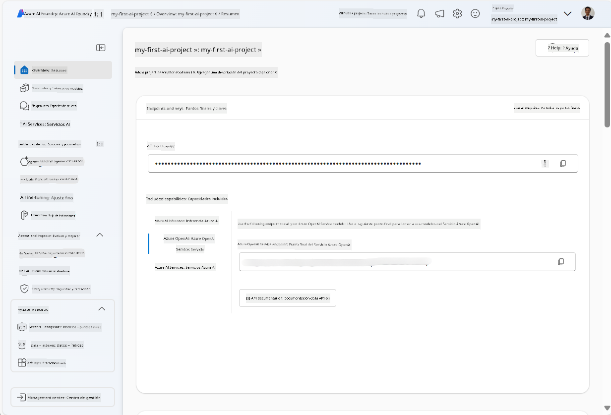
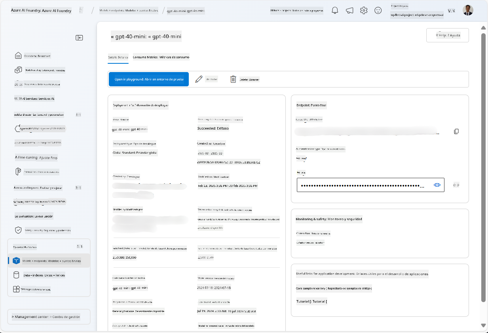
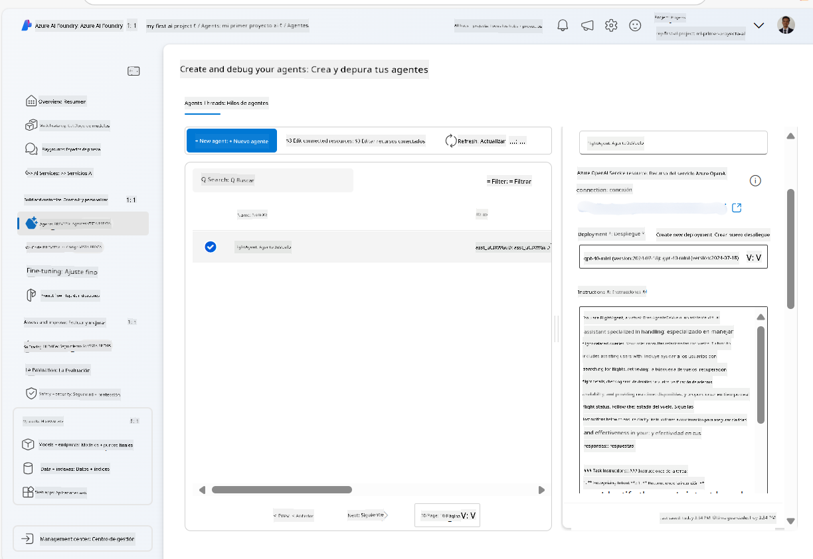
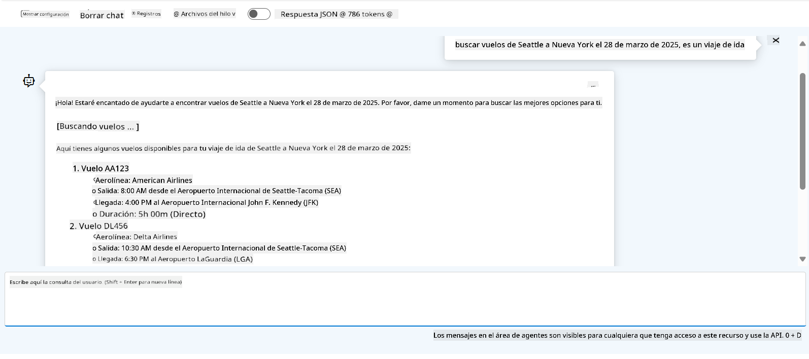

<!--
CO_OP_TRANSLATOR_METADATA:
{
  "original_hash": "7e92870dc0843e13d4dabc620c09d2d9",
  "translation_date": "2025-07-12T08:14:45+00:00",
  "source_file": "02-explore-agentic-frameworks/azure-ai-foundry-agent-creation.md",
  "language_code": "es"
}
-->
# Desarrollo del Servicio Azure AI Agent

En este ejercicio, usarás las herramientas del servicio Azure AI Agent en el [portal Azure AI Foundry](https://ai.azure.com/?WT.mc_id=academic-105485-koreyst) para crear un agente para Reserva de Vuelos. El agente podrá interactuar con los usuarios y proporcionar información sobre vuelos.

## Requisitos previos

Para completar este ejercicio, necesitas lo siguiente:
1. Una cuenta de Azure con una suscripción activa. [Crea una cuenta gratis](https://azure.microsoft.com/free/?WT.mc_id=academic-105485-koreyst).
2. Necesitas permisos para crear un hub de Azure AI Foundry o que te hayan creado uno.
    - Si tu rol es Colaborador u Owner, puedes seguir los pasos de este tutorial.

## Crear un hub de Azure AI Foundry

> **Note:** Azure AI Foundry antes se conocía como Azure AI Studio.

1. Sigue estas indicaciones del [blog de Azure AI Foundry](https://learn.microsoft.com/en-us/azure/ai-studio/?WT.mc_id=academic-105485-koreyst) para crear un hub de Azure AI Foundry.
2. Cuando tu proyecto esté creado, cierra cualquier consejo que aparezca y revisa la página del proyecto en el portal Azure AI Foundry, que debería verse similar a la siguiente imagen:

    

## Desplegar un modelo

1. En el panel izquierdo de tu proyecto, en la sección **My assets**, selecciona la página **Models + endpoints**.
2. En la página **Models + endpoints**, en la pestaña **Model deployments**, en el menú **+ Deploy model**, selecciona **Deploy base model**.
3. Busca el modelo `gpt-4o-mini` en la lista, luego selecciónalo y confírmalo.

    > **Note**: Reducir el TPM ayuda a evitar el uso excesivo de la cuota disponible en la suscripción que estás usando.

    

## Crear un agente

Ahora que has desplegado un modelo, puedes crear un agente. Un agente es un modelo de IA conversacional que puede usarse para interactuar con los usuarios.

1. En el panel izquierdo de tu proyecto, en la sección **Build & Customize**, selecciona la página **Agents**.
2. Haz clic en **+ Create agent** para crear un nuevo agente. En el cuadro de diálogo **Agent Setup**:
    - Ingresa un nombre para el agente, como `FlightAgent`.
    - Asegúrate de que esté seleccionado el despliegue del modelo `gpt-4o-mini` que creaste anteriormente.
    - Configura las **Instructions** según el prompt que quieres que el agente siga. Aquí tienes un ejemplo:
    ```
    You are FlightAgent, a virtual assistant specialized in handling flight-related queries. Your role includes assisting users with searching for flights, retrieving flight details, checking seat availability, and providing real-time flight status. Follow the instructions below to ensure clarity and effectiveness in your responses:

    ### Task Instructions:
    1. **Recognizing Intent**:
       - Identify the user's intent based on their request, focusing on one of the following categories:
         - Searching for flights
         - Retrieving flight details using a flight ID
         - Checking seat availability for a specified flight
         - Providing real-time flight status using a flight number
       - If the intent is unclear, politely ask users to clarify or provide more details.
        
    2. **Processing Requests**:
        - Depending on the identified intent, perform the required task:
        - For flight searches: Request details such as origin, destination, departure date, and optionally return date.
        - For flight details: Request a valid flight ID.
        - For seat availability: Request the flight ID and date and validate inputs.
        - For flight status: Request a valid flight number.
        - Perform validations on provided data (e.g., formats of dates, flight numbers, or IDs). If the information is incomplete or invalid, return a friendly request for clarification.

    3. **Generating Responses**:
    - Use a tone that is friendly, concise, and supportive.
    - Provide clear and actionable suggestions based on the output of each task.
    - If no data is found or an error occurs, explain it to the user gently and offer alternative actions (e.g., refine search, try another query).
    
    ```
> [!NOTE]
> Para un prompt más detallado, puedes consultar [este repositorio](https://github.com/ShivamGoyal03/RoamMind) para más información.
    
> Además, puedes agregar una **Knowledge Base** y **Actions** para mejorar las capacidades del agente y que proporcione más información o realice tareas automáticas basadas en las solicitudes del usuario. Para este ejercicio, puedes omitir estos pasos.
    


3. Para crear un nuevo agente multi-IA, simplemente haz clic en **New Agent**. El agente recién creado aparecerá en la página de Agents.

## Probar el agente

Después de crear el agente, puedes probar cómo responde a las consultas de los usuarios en el playground del portal Azure AI Foundry.

1. En la parte superior del panel **Setup** de tu agente, selecciona **Try in playground**.
2. En el panel **Playground**, puedes interactuar con el agente escribiendo consultas en la ventana de chat. Por ejemplo, puedes pedirle al agente que busque vuelos de Seattle a Nueva York para el día 28.

    > **Note**: El agente puede no proporcionar respuestas precisas, ya que no se está usando información en tiempo real en este ejercicio. El objetivo es probar la capacidad del agente para entender y responder a las consultas basándose en las instrucciones dadas.

    

3. Después de probar el agente, puedes personalizarlo aún más agregando más intenciones, datos de entrenamiento y acciones para mejorar sus capacidades.

## Limpiar recursos

Cuando termines de probar el agente, puedes eliminarlo para evitar costos adicionales.
1. Abre el [portal de Azure](https://portal.azure.com) y revisa el contenido del grupo de recursos donde desplegaste los recursos del hub usados en este ejercicio.
2. En la barra de herramientas, selecciona **Delete resource group**.
3. Ingresa el nombre del grupo de recursos y confirma que deseas eliminarlo.

## Recursos

- [Documentación de Azure AI Foundry](https://learn.microsoft.com/en-us/azure/ai-studio/?WT.mc_id=academic-105485-koreyst)
- [Portal Azure AI Foundry](https://ai.azure.com/?WT.mc_id=academic-105485-koreyst)
- [Introducción a Azure AI Studio](https://techcommunity.microsoft.com/blog/educatordeveloperblog/getting-started-with-azure-ai-studio/4095602?WT.mc_id=academic-105485-koreyst)
- [Fundamentos de agentes de IA en Azure](https://learn.microsoft.com/en-us/training/modules/ai-agent-fundamentals/?WT.mc_id=academic-105485-koreyst)
- [Azure AI Discord](https://aka.ms/AzureAI/Discord)

**Aviso legal**:  
Este documento ha sido traducido utilizando el servicio de traducción automática [Co-op Translator](https://github.com/Azure/co-op-translator). Aunque nos esforzamos por la precisión, tenga en cuenta que las traducciones automáticas pueden contener errores o inexactitudes. El documento original en su idioma nativo debe considerarse la fuente autorizada. Para información crítica, se recomienda la traducción profesional realizada por humanos. No nos hacemos responsables de malentendidos o interpretaciones erróneas derivadas del uso de esta traducción.