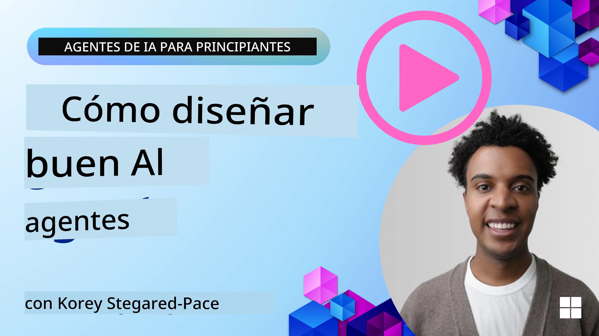
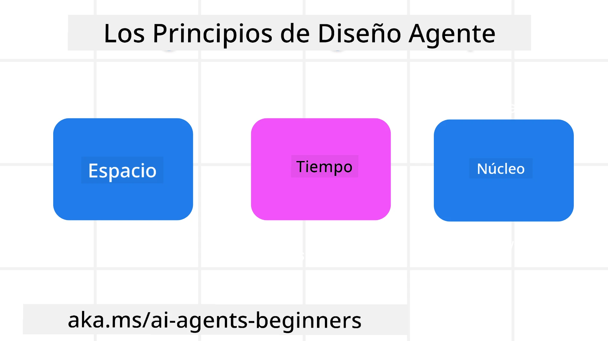

> _(Haga clic en la imagen de arriba para ver el video de esta lección)_
# Principios de diseño agente de IA

## Introducción

Hay muchas formas de pensar en la construcción de sistemas agente de IA. Dado que la ambigüedad es una característica y no un error en el diseño de IA generativa, a veces es difícil para los ingenieros saber por dónde empezar. Hemos creado un conjunto de principios de diseño UX centrados en el ser humano para que los desarrolladores puedan construir sistemas agenticos centrados en el cliente que resuelvan sus necesidades empresariales. Estos principios de diseño no son una arquitectura prescriptiva, sino un punto de partida para los equipos que definen y construyen experiencias agenticas.

En general, los agentes deben:

- Ampliar y escalar las capacidades humanas (lluvia de ideas, resolución de problemas, automatización, etc.)
- Rellenar las brechas de conocimiento (ponernos al día en dominios de conocimiento, traducción, etc.)
- Facilitar y apoyar la colaboración de la manera en que preferimos trabajar con otros como individuos
- Hacernos mejores versiones de nosotros mismos (por ejemplo, coach de vida/maestro de tareas, ayudándonos a aprender regulación emocional y habilidades de atención plena, construir resiliencia, etc.)

## Esta lección cubrirá

- Cuáles son los principios de diseño agentico
- Cuáles son algunas pautas a seguir al implementar estos principios de diseño
- Algunos ejemplos de uso de los principios de diseño

## Objetivos de aprendizaje

Después de completar esta lección, podrá:

1. Explicar qué son los principios de diseño agentico
2. Explicar las pautas para usar los principios de diseño agentico
3. Entender cómo construir un agente usando los principios de diseño agentico

## Los principios de diseño agentico

### Agente (Espacio)

Este es el entorno en el que el agente opera. Estos principios informan cómo diseñamos agentes para participar en mundos físicos y digitales.

- **Conectar, no colapsar** – ayudar a conectar personas con otras personas, eventos y conocimiento accionable para permitir la colaboración y la conexión.
- Los agentes ayudan a conectar eventos, conocimiento y personas.
- Los agentes acercan a las personas. No están diseñados para reemplazar o menospreciar a las personas.
- **Fácilmente accesible pero ocasionalmente invisible** – el agente opera principalmente en segundo plano y solo nos alerta cuando es relevante y apropiado.
  - El agente es fácilmente descubrible y accesible para usuarios autorizados en cualquier dispositivo o plataforma.
  - El agente soporta entradas y salidas multimodales (sonido, voz, texto, etc.).
  - El agente puede transitar sin problemas entre primer plano y segundo plano; entre proactivo y reactivo, dependiendo de su percepción de las necesidades del usuario.
  - El agente puede operar en forma invisible, pero su ruta de proceso en segundo plano y colaboración con otros agentes es transparente y controlable por el usuario.

### Agente (Tiempo)

Así es como el agente opera a lo largo del tiempo. Estos principios informan cómo diseñamos agentes que interactúan a través del pasado, presente y futuro.

- **Pasado**: Reflexionando sobre la historia que incluye tanto el estado como el contexto.
  - El agente proporciona resultados más relevantes basados en el análisis de datos históricos más ricos que solo el evento, personas o estados.
  - El agente crea conexiones a partir de eventos pasados y reflexiona activamente en la memoria para involucrarse con situaciones actuales.
- **Ahora**: Más empujones que notificaciones.
  - El agente encarna un enfoque integral para interactuar con las personas. Cuando ocurre un evento, el agente va más allá de la notificación estática u otra formalidad estática. El agente puede simplificar flujos o generar dinámicamente señales para dirigir la atención del usuario en el momento adecuado.
  - El agente ofrece información basada en el entorno contextual, cambios sociales y culturales y adaptada a la intención del usuario.
  - La interacción con el agente puede ser gradual, evolucionando/creciendo en complejidad para empoderar a los usuarios a largo plazo.
- **Futuro**: Adaptarse y evolucionar.
  - El agente se adapta a varios dispositivos, plataformas y modalidades.
  - El agente se adapta al comportamiento del usuario, necesidades de accesibilidad y es libremente personalizable.
  - El agente es moldeado y evoluciona a través de la interacción continua con el usuario.

### Núcleo del agente

Estos son los elementos clave en el núcleo del diseño de un agente.

- **Aceptar la incertidumbre pero establecer confianza**.
  - Se espera cierto nivel de incertidumbre del agente. La incertidumbre es un elemento clave del diseño agente.
  - La confianza y la transparencia son capas fundamentales del diseño del agente.
  - Los humanos controlan cuándo el agente está encendido/apagado y el estado del agente es claramente visible en todo momento.

## Las pautas para implementar estos principios

Cuando use estos principios de diseño, use las siguientes pautas:

1. **Transparencia**: Informar al usuario que la IA está involucrada, cómo funciona (incluyendo acciones pasadas), y cómo dar retroalimentación y modificar el sistema.
2. **Control**: Permitir al usuario personalizar, especificar preferencias, personalizar y tener control sobre el sistema y sus atributos (incluida la capacidad de olvidar).
3. **Consistencia**: Apuntar a experiencias consistentes y multimodales a través de dispositivos y puntos finales. Usar elementos UI/UX familiares cuando sea posible (por ejemplo, icono de micrófono para interacción por voz) y reducir la carga cognitiva del cliente tanto como sea posible (por ejemplo, respuestas concisas, ayudas visuales y contenido ‘Aprender más’).

## Cómo diseñar un agente de viajes usando estos principios y pautas

Imagine que está diseñando un agente de viajes, aquí está cómo podría pensar en usar los principios y pautas de diseño:

1. **Transparencia** – Informe al usuario que el agente de viajes es un agente habilitado con IA. Proporcione algunas instrucciones básicas sobre cómo comenzar (por ejemplo, un mensaje de “Hola”, indicaciones de ejemplo). Documente esto claramente en la página del producto. Muestre la lista de indicaciones que el usuario ha solicitado en el pasado. Haga claro cómo proporcionar retroalimentación (pulgares arriba y abajo, botón Enviar Retroalimentación, etc.). Articule claramente si el agente tiene restricciones de uso o temas.
2. **Control** – Asegúrese de que esté claro cómo el usuario puede modificar el agente después de que se haya creado con cosas como la indicación del sistema. Permita al usuario elegir cuán detallado es el agente, su estilo de escritura y cualquier advertencia sobre lo que el agente no debe comentar. Permita al usuario ver y eliminar cualquier archivo o dato asociado, indicaciones y conversaciones pasadas.
3. **Consistencia** – Asegúrese de que los iconos para compartir indicaciones, agregar un archivo o foto y etiquetar a alguien o algo sean estándar y reconocibles. Use el icono de clip para indicar carga/compartición de archivos con el agente, y un icono de imagen para indicar carga de gráficos.

## Códigos de muestra

- Python: [Agent Framework](./code_samples/03-python-agent-framework.ipynb)
- .NET: [Agent Framework](./code_samples/03-dotnet-agent-framework.md)

## ¿Tiene más preguntas sobre patrones de diseño agentico de IA?

Únase al [Microsoft Foundry Discord](https://discord.com/invite/ATgtXmAS5D) para reunirse con otros aprendices, asistir a horas de oficina y resolver sus preguntas sobre agentes de IA.

## Recursos adicionales

- <a href="https://openai.com" target="_blank">Prácticas para gobernar sistemas agente de IA | OpenAI</a>
- <a href="https://microsoft.com" target="_blank">El proyecto HAX Toolkit - Microsoft Research</a>
- <a href="https://responsibleaitoolbox.ai" target="_blank">Caja de herramientas de IA responsable</a>

## Lección anterior

[Explorando marcos agenticos](../02-explore-agentic-frameworks/README.md)

## Próxima lección

[Patrón de diseño de uso de herramientas](../04-tool-use/README.md)

---

<!-- CO-OP TRANSLATOR DISCLAIMER START -->
**Descargo de responsabilidad**:
Este documento ha sido traducido utilizando el servicio de traducción automática [Co-op Translator](https://github.com/Azure/co-op-translator). Aunque nos esforzamos por la precisión, tenga en cuenta que las traducciones automatizadas pueden contener errores o inexactitudes. El documento original en su idioma nativo debe considerarse la fuente autorizada. Para información crítica, se recomienda una traducción profesional humana. No somos responsables de cualquier malentendido o interpretación errónea que surja del uso de esta traducción.
<!-- CO-OP TRANSLATOR DISCLAIMER END -->