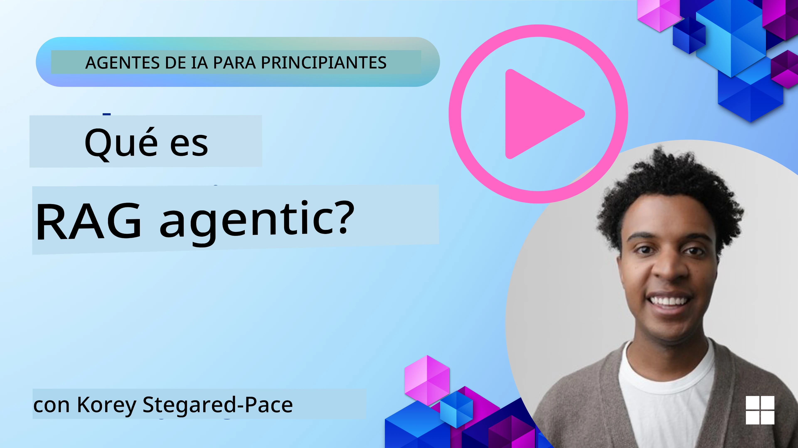
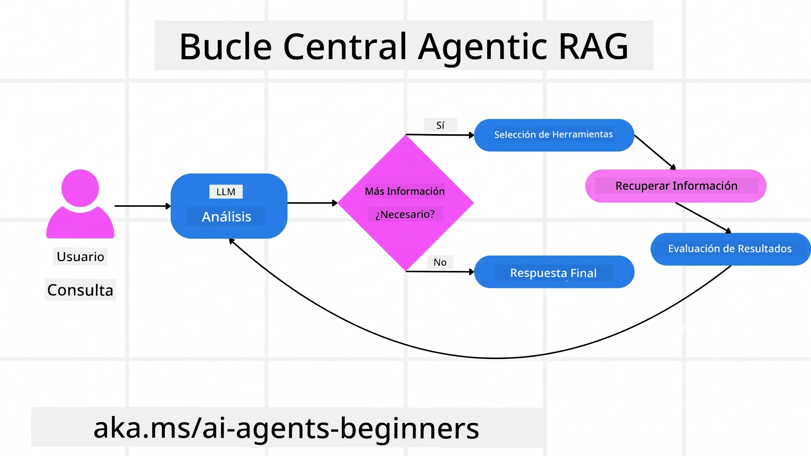
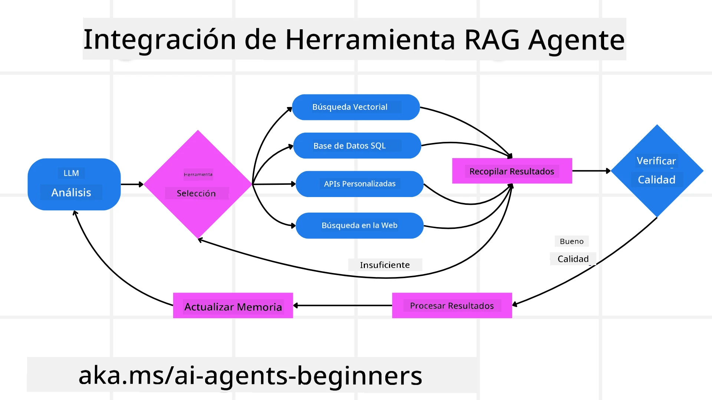
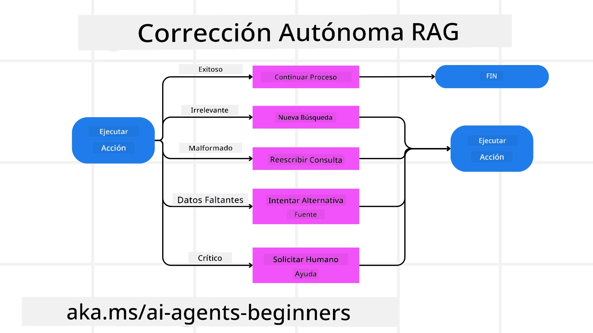
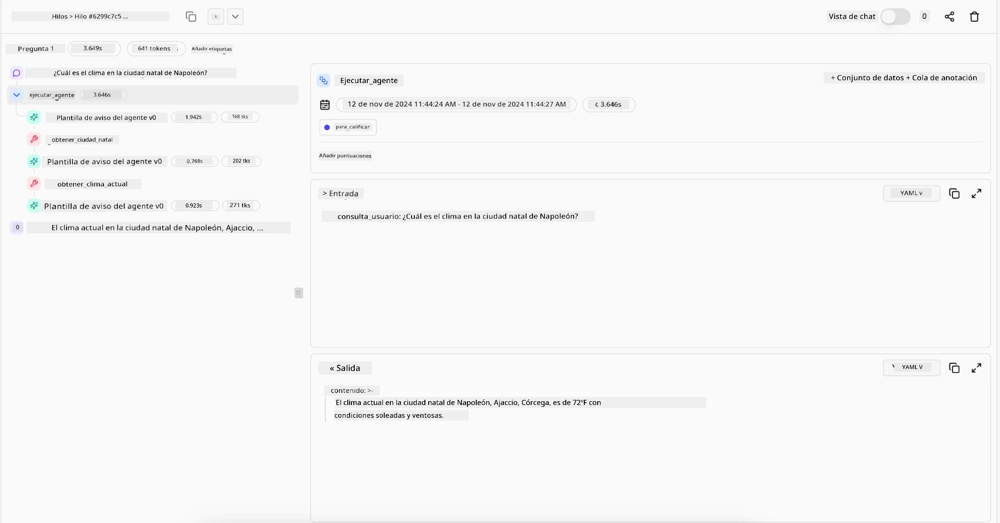

> _(Haz clic en la imagen de arriba para ver el video de esta lección)_

# Agentic RAG

Esta lección ofrece una visión completa sobre Agentic Retrieval-Augmented Generation (Agentic RAG), un paradigma emergente de IA donde los modelos de lenguaje grande (LLMs) planifican autónomamente sus siguientes pasos mientras obtienen información de fuentes externas. A diferencia de los patrones estáticos de recuperación y lectura, Agentic RAG implica llamadas iterativas al LLM, intercaladas con llamadas a herramientas o funciones y salidas estructuradas. El sistema evalúa los resultados, refina las consultas, invoca herramientas adicionales si es necesario y continúa este ciclo hasta lograr una solución satisfactoria.

## Introducción

En esta lección se cubrirá

- **Entender Agentic RAG:** Aprende sobre el paradigma emergente en IA donde los modelos de lenguaje grande (LLMs) planifican autónomamente sus próximos pasos mientras obtienen información de fuentes de datos externas.
- **Comprender el estilo iterativo Maker-Checker:** Comprende el ciclo de llamadas iterativas al LLM, intercaladas con llamadas a herramientas o funciones y salidas estructuradas, diseñadas para mejorar la corrección y manejar consultas mal formadas.
- **Explorar aplicaciones prácticas:** Identifica escenarios donde Agentic RAG destaca, como entornos donde la corrección es prioritaria, interacciones complejas con bases de datos y flujos de trabajo extendidos.

## Objetivos de aprendizaje

Después de completar esta lección, sabrás cómo/comprenderás:

- **Comprensión de Agentic RAG:** Aprende sobre el paradigma emergente en IA donde los modelos de lenguaje grande (LLMs) planifican autónomamente sus próximos pasos mientras extraen información de fuentes de datos externas.
- **Estilo Iterativo Maker-Checker:** Entiende el concepto de un ciclo de llamadas iterativas al LLM, intercaladas con llamadas a herramientas o funciones y salidas estructuradas, diseñadas para mejorar la corrección y manejar consultas mal formadas.
- **Tomar control del proceso de razonamiento:** Comprende la capacidad del sistema para asumir su proceso de razonamiento, tomando decisiones sobre cómo abordar problemas sin depender de caminos predefinidos.
- **Flujo de trabajo:** Entiende cómo un modelo agentic decide independientemente recuperar informes de tendencias del mercado, identificar datos de competidores, correlacionar métricas internas de ventas, sintetizar hallazgos y evaluar la estrategia.
- **Bucles iterativos, integración de herramientas y memoria:** Aprende acerca del patrón de interacción en bucle del sistema, manteniendo estado y memoria a través de los pasos para evitar bucles repetitivos y tomar decisiones informadas.
- **Manejo de modos de falla y autocorrección:** Explora los mecanismos robustos de autocorrección del sistema, incluyendo iteración y re-consultas, uso de herramientas diagnósticas y respaldo en supervisión humana.
- **Limitaciones de la agencia:** Comprende las limitaciones de Agentic RAG, enfocándose en la autonomía específica del dominio, dependencia de la infraestructura y respeto por las restricciones.
- **Casos de uso prácticos y valor:** Identifica escenarios donde Agentic RAG destaca, como entornos enfocados en la corrección, interacciones complejas con bases de datos y flujos de trabajo extendidos.
- **Gobernanza, transparencia y confianza:** Aprende sobre la importancia de la gobernanza y la transparencia, incluyendo razonamiento explicable, control de sesgos y supervisión humana.

## ¿Qué es Agentic RAG?

Agentic Retrieval-Augmented Generation (Agentic RAG) es un paradigma emergente de IA donde los modelos de lenguaje grande (LLMs) planifican autónomamente sus próximos pasos mientras extraen información de fuentes externas. A diferencia de los patrones estáticos de recuperación y lectura, Agentic RAG implica llamadas iterativas al LLM, intercaladas con llamadas a herramientas o funciones y salidas estructuradas. El sistema evalúa resultados, refina consultas, invoca herramientas adicionales si es necesario y continúa este ciclo hasta lograr una solución satisfactoria. Este estilo iterativo de “maker-checker” mejora la corrección, maneja consultas mal formadas y asegura resultados de alta calidad.

El sistema asume activamente su proceso de razonamiento, reescribiendo consultas fallidas, eligiendo diferentes métodos de recuperación e integrando múltiples herramientas—como búsqueda vectorial en Azure AI Search, bases de datos SQL o APIs personalizadas—antes de finalizar su respuesta. La cualidad distintiva de un sistema agentic es su capacidad para asumir su propio proceso de razonamiento. Las implementaciones tradicionales de RAG dependen de caminos predefinidos, pero un sistema agentic determina autónomamente la secuencia de pasos basada en la calidad de la información que encuentra.

## Definiendo Agentic Retrieval-Augmented Generation (Agentic RAG)

Agentic Retrieval-Augmented Generation (Agentic RAG) es un paradigma emergente en el desarrollo de IA donde los LLMs no solo extraen información de fuentes de datos externas sino que también planifican autónomamente sus pasos siguientes. A diferencia de los patrones estáticos de recuperación y lectura o secuencias cuidadosamente guionizadas de indicaciones, Agentic RAG implica un ciclo de llamadas iterativas al LLM, intercaladas con llamadas a herramientas o funciones y salidas estructuradas. En cada paso, el sistema evalúa los resultados obtenidos, decide si refinar sus consultas, invoca herramientas adicionales si es necesario, y continúa este ciclo hasta lograr una solución satisfactoria.

Este estilo iterativo tipo “maker-checker” está diseñado para mejorar la corrección, manejar consultas mal formadas en bases de datos estructuradas (por ejemplo, NL2SQL), y asegurar resultados equilibrados y de alta calidad. En lugar de depender únicamente de cadenas de indicaciones cuidadosamente diseñadas, el sistema asume activamente su proceso de razonamiento. Puede reescribir consultas fallidas, elegir distintos métodos de recuperación e integrar múltiples herramientas—como búsqueda vectorial en Azure AI Search, bases de datos SQL o APIs personalizadas—antes de finalizar su respuesta. Esto elimina la necesidad de marcos de orquestación excesivamente complejos. En cambio, un ciclo relativamente simple de “llamada LLM → uso de herramienta → llamada LLM → …” puede producir salidas sofisticadas y bien fundamentadas.

## Asumiendo el Proceso de Razonamiento

La cualidad distintiva que hace que un sistema sea “agentic” es su capacidad para asumir su proceso de razonamiento. Las implementaciones tradicionales de RAG a menudo dependen de que humanos definan previamente un camino para el modelo: una cadena de pensamiento que describe qué recuperar y cuándo.
Pero cuando un sistema es verdaderamente agentic, decide internamente cómo abordar el problema. No está simplemente ejecutando un guion; está determinando autónomamente la secuencia de pasos basada en la calidad de la información que encuentra.
Por ejemplo, si se le pide crear una estrategia de lanzamiento de producto, no depende únicamente de una indicación que describa todo el flujo de investigación y toma de decisiones. En cambio, el modelo agentic decide independientemente:

1. Recuperar informes de tendencias actuales del mercado usando Bing Web Grounding
2. Identificar datos relevantes de competidores utilizando Azure AI Search.
3. Correlacionar métricas históricas internas de ventas usando Azure SQL Database.
4. Sintetizar los hallazgos en una estrategia cohesionada orquestada vía Azure OpenAI Service.
5. Evaluar la estrategia para detectar brechas o inconsistencias, solicitando otra ronda de recuperación si es necesario.
Todos estos pasos—refinar consultas, elegir fuentes, iterar hasta “estar satisfecho” con la respuesta—son decididos por el modelo, no preprogramados por un humano.

## Bucles Iterativos, Integración de Herramientas y Memoria

Un sistema agentic se basa en un patrón de interacción en bucle:

- **Llamada inicial:** La meta del usuario (es decir, la indicación del usuario) se presenta al LLM.
- **Invocación de herramienta:** Si el modelo identifica información faltante o instrucciones ambiguas, selecciona una herramienta o método de recuperación—como una consulta a base de datos vectorial (por ejemplo, búsqueda híbrida Azure AI Search sobre datos privados) o una consulta SQL estructurada—para obtener más contexto.
- **Evaluación y Refinamiento:** Tras revisar los datos devueltos, el modelo decide si la información es suficiente. De no ser así, refina la consulta, prueba con otra herramienta o ajusta su enfoque.
- **Repetir hasta estar satisfecho:** Este ciclo continúa hasta que el modelo determina que tiene suficiente claridad y evidencia para entregar una respuesta final bien razonada.
- **Memoria y estado:** Debido a que el sistema mantiene estado y memoria a lo largo de los pasos, puede recordar intentos previos y sus resultados, evitando bucles repetitivos y tomando decisiones más informadas conforme avanza.

Con el tiempo, esto genera una sensación de comprensión evolutiva, permitiendo al modelo manejar tareas complejas de múltiples pasos sin requerir intervención humana constante o reformulación de la indicación.

## Manejo de Modos de Falla y Autocorrección

La autonomía de Agentic RAG también implica mecanismos robustos de autocorrección. Cuando el sistema encuentra callejones sin salida—como recuperar documentos irrelevantes o enfrentar consultas mal formadas—puede:

- **Iterar y volver a consultar:** En lugar de devolver respuestas de bajo valor, el modelo intenta nuevas estrategias de búsqueda, reescribe consultas de base de datos o explora conjuntos de datos alternativos.
- **Usar herramientas diagnósticas:** El sistema puede invocar funciones adicionales diseñadas para ayudar a depurar sus pasos de razonamiento o confirmar la corrección de los datos recuperados. Herramientas como Azure AI Tracing serán importantes para habilitar una observabilidad y monitoreo robustos.
- **Respaldarse en supervisión humana:** Para escenarios de alta importancia o fallas repetidas, el modelo podría señalar incertidumbre y solicitar orientación humana. Una vez que el humano proporciona retroalimentación correctiva, el modelo puede incorporar esa lección en adelante.

Este enfoque iterativo y dinámico permite al modelo mejorar continuamente, asegurando que no sea un sistema de un solo intento, sino uno que aprende de sus errores durante una sesión dada.

## Límites de la Agencia

A pesar de su autonomía dentro de una tarea, Agentic RAG no es análogo a la Inteligencia Artificial General. Sus capacidades “agentic” están confinadas a las herramientas, fuentes de datos y políticas proporcionadas por desarrolladores humanos. No puede inventar sus propias herramientas ni salirse de los límites del dominio establecidos. En cambio, destaca en orquestar dinámicamente los recursos disponibles.
Las diferencias clave respecto a formas de IA más avanzadas incluyen:

1. **Autonomía Específica del Dominio:** Los sistemas Agentic RAG se enfocan en lograr objetivos definidos por el usuario dentro de un dominio conocido, empleando estrategias como reescritura de consultas o selección de herramientas para mejorar resultados.
2. **Dependencia de Infraestructura:** Las capacidades del sistema dependen de las herramientas y datos integrados por los desarrolladores. No puede superar estos límites sin intervención humana.
3. **Respeto por Restricciones:** Las directrices éticas, reglas de cumplimiento y políticas de negocio siguen siendo muy importantes. La libertad del agente siempre está condicionada por medidas de seguridad y mecanismos de supervisión (espero).

## Casos prácticos y valor

Agentic RAG destaca en escenarios que requieren refinamiento iterativo y precisión:

1. **Entornos donde la corrección es prioritaria:** En controles de cumplimiento, análisis regulatorios o investigaciones legales, el modelo agentic puede verificar hechos repetidamente, consultar múltiples fuentes y reescribir consultas hasta producir una respuesta exhaustivamente validada.
2. **Interacciones complejas con bases de datos:** Cuando se trata de datos estructurados donde las consultas con frecuencia fallan o necesitan ajustes, el sistema puede refinar autónomamente sus consultas usando Azure SQL o Microsoft Fabric OneLake, asegurando que la recuperación final se alinee con la intención del usuario.
3. **Flujos de trabajo extendidos:** Sesiones de duración prolongada pueden evolucionar conforme surgen nueva información. Agentic RAG puede incorporar datos continuamente, ajustando estrategias conforme aprende más del espacio problemático.

## Gobernanza, Transparencia y Confianza

A medida que estos sistemas se vuelven más autónomos en su razonamiento, la gobernanza y la transparencia son cruciales:

- **Razonamiento explicable:** El modelo puede proporcionar una pista de auditoría de las consultas realizadas, las fuentes consultadas y los pasos de razonamiento seguidos para llegar a su conclusión. Herramientas como Azure AI Content Safety y Azure AI Tracing / GenAIOps pueden ayudar a mantener la transparencia y mitigar riesgos.
- **Control de sesgos y recuperación equilibrada:** Los desarrolladores pueden ajustar estrategias de recuperación para asegurar que se consideren fuentes de datos equilibradas y representativas, y auditar regularmente los resultados para detectar sesgos o patrones desviados usando modelos personalizados para organizaciones avanzadas de ciencia de datos con Azure Machine Learning.
- **Supervisión humana y cumplimiento:** Para tareas sensibles, la revisión humana sigue siendo esencial. Agentic RAG no reemplaza el juicio humano en decisiones de alto riesgo, sino que lo complementa entregando opciones más cuidadosamente verificadas.

Tener herramientas que proporcionen un registro claro de las acciones es esencial. Sin ellas, depurar un proceso de múltiples pasos puede ser muy difícil. Véase el siguiente ejemplo de Literal AI (empresa detrás de Chainlit) para una ejecución de agente:

## Conclusión

Agentic RAG representa una evolución natural en cómo los sistemas de IA manejan tareas complejas e intensivas en datos. Adoptando un patrón de interacción en bucle, seleccionando herramientas autónomamente y refinando consultas hasta lograr un resultado de alta calidad, el sistema va más allá de seguir indicaciones estáticas hacia un tomador de decisiones más adaptativo y consciente del contexto. Aunque aún limitado por infraestructuras definidas por humanos y directrices éticas, estas capacidades agentic posibilitan interacciones de IA más ricas, dinámicas y, en última instancia, más útiles tanto para empresas como para usuarios finales.

### ¿Tienes más preguntas sobre Agentic RAG?

Únete al [Microsoft Foundry Discord](https://discord.com/invite/ATgtXmAS5D) para conectar con otros aprendices, asistir a horas de consulta y resolver tus preguntas sobre Agentes de IA.

## Recursos adicionales

- <a href="https://learn.microsoft.com/training/modules/use-own-data-azure-openai" target="_blank">Implementar Retrieval Augmented Generation (RAG) con Azure OpenAI Service: Aprende a usar tus propios datos con Azure OpenAI Service. Este módulo de Microsoft Learn ofrece una guía completa para implementar RAG</a>
- <a href="https://learn.microsoft.com/azure/ai-studio/concepts/evaluation-approach-gen-ai" target="_blank">Evaluación de aplicaciones de IA generativa con Microsoft Foundry: Este artículo cubre la evaluación y comparación de modelos en conjuntos de datos públicos, incluyendo aplicaciones Agentic AI y arquitecturas RAG</a>
- <a href="https://weaviate.io/blog/what-is-agentic-rag" target="_blank">Qué es Agentic RAG | Weaviate</a>
- <a href="https://ragaboutit.com/agentic-rag-a-complete-guide-to-agent-based-retrieval-augmented-generation/" target="_blank">Agentic RAG: Guía completa para generación aumentada por recuperación basada en agentes – Noticias de generación RAG</a>
- <a href="https://huggingface.co/learn/cookbook/agent_rag" target="_blank">Agentic RAG: potencia tu RAG con reformulación de consultas y auto-consulta! Recetario de IA de código abierto de Hugging Face</a>
- <a href="https://youtu.be/aQ4yQXeB1Ss?si=2HUqBzHoeB5tR04U" target="_blank">Añadiendo capas agentivas a RAG</a>
- <a href="https://www.youtube.com/watch?v=zeAyuLc_f3Q&t=244s" target="_blank">El futuro de los asistentes de conocimiento: Jerry Liu</a>
- <a href="https://www.youtube.com/watch?v=AOSjiXP1jmQ" target="_blank">Cómo construir sistemas Agentic RAG</a>
- <a href="https://ignite.microsoft.com/sessions/BRK102?source=sessions" target="_blank">Uso del servicio Microsoft Foundry Agent para escalar tus agentes de IA</a>

### Artículos Académicos

- <a href="https://arxiv.org/abs/2303.17651" target="_blank">2303.17651 Auto-mejora: refinamiento iterativo con retroalimentación propia</a>
- <a href="https://arxiv.org/abs/2303.11366" target="_blank">2303.11366 Reflexión: agentes de lenguaje con aprendizaje por refuerzo verbal</a>
- <a href="https://arxiv.org/abs/2305.11738" target="_blank">2305.11738 CRITIC: Los grandes modelos de lenguaje pueden autocorregirse con críticas interactivas de herramientas</a>
- <a href="https://arxiv.org/abs/2501.09136" target="_blank">2501.09136 Generación aumentada por recuperación agentiva: una encuesta sobre Agentic RAG</a>

## Lección anterior

[Patrón de diseño de uso de herramientas](../04-tool-use/README.md)

## Siguiente lección

[Construyendo agentes de IA confiables](../06-building-trustworthy-agents/README.md)

---

<!-- CO-OP TRANSLATOR DISCLAIMER START -->
**Descargo de responsabilidad**:
Este documento ha sido traducido utilizando el servicio de traducción automática [Co-op Translator](https://github.com/Azure/co-op-translator). Aunque nos esforzamos por la precisión, tenga en cuenta que las traducciones automatizadas pueden contener errores o inexactitudes. El documento original en su idioma nativo debe considerarse la fuente autorizada. Para información crítica, se recomienda una traducción profesional humana. No somos responsables de cualquier malentendido o interpretación errónea que surja del uso de esta traducción.
<!-- CO-OP TRANSLATOR DISCLAIMER END -->