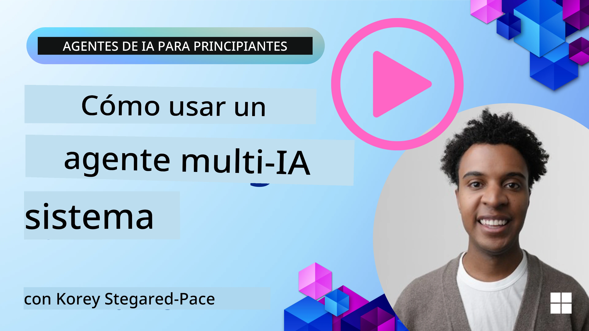
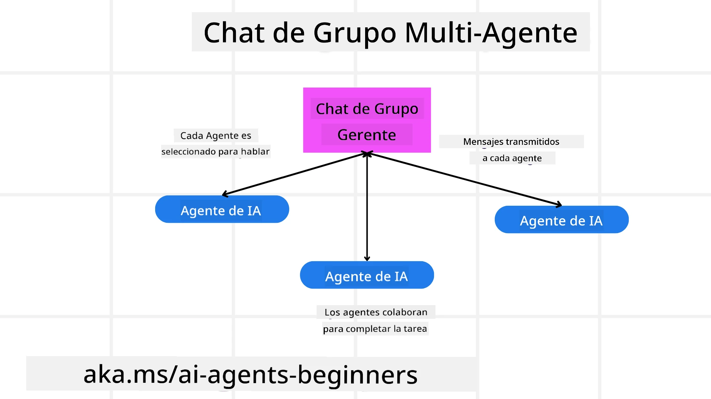
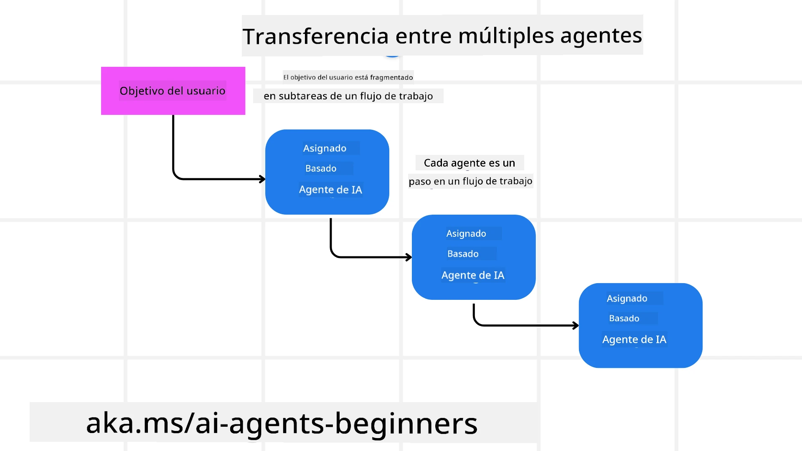
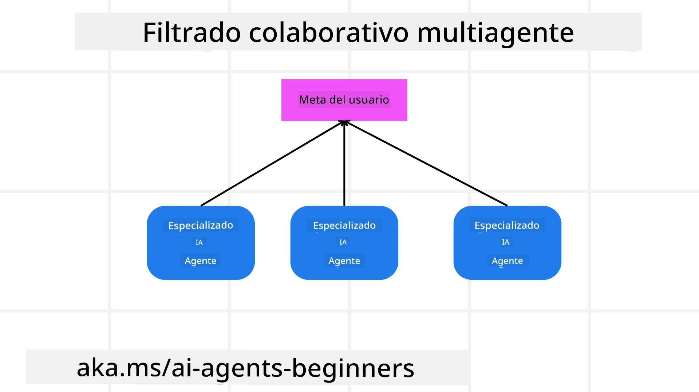

> _(Haz clic en la imagen de arriba para ver el video de esta lección)_

# Patrones de diseño multiagente

Tan pronto como comienzas a trabajar en un proyecto que involucra múltiples agentes, necesitarás considerar el patrón de diseño multiagente. Sin embargo, puede no ser inmediatamente claro cuándo cambiar a multiagentes y cuáles son las ventajas.

## Introducción

En esta lección, buscamos responder las siguientes preguntas:

- ¿Cuáles son los escenarios donde los multiagentes son aplicables?
- ¿Cuáles son las ventajas de usar multiagentes en lugar de un solo agente singular que realiza múltiples tareas?
- ¿Cuáles son los bloques constructores para implementar el patrón de diseño multiagente?
- ¿Cómo podemos tener visibilidad de cómo los múltiples agentes interactúan entre sí?

## Objetivos de aprendizaje

Después de esta lección, deberías ser capaz de:

- Identificar escenarios donde los multiagentes son aplicables
- Reconocer las ventajas de usar multiagentes en lugar de un agente singular.
- Comprender los bloques constructores para implementar el patrón de diseño multiagente.

¿Cuál es la visión general?

*Los multiagentes son un patrón de diseño que permite que múltiples agentes trabajen juntos para lograr un objetivo común*.

Este patrón es ampliamente utilizado en diversos campos, incluyendo robótica, sistemas autónomos y computación distribuida.

## Escenarios donde los multiagentes son aplicables

Entonces, ¿en qué escenarios es un buen caso de uso el empleo de multiagentes? La respuesta es que existen muchos escenarios donde emplear múltiples agentes es beneficioso, especialmente en los siguientes casos:

- **Grandes cargas de trabajo**: Las grandes cargas de trabajo pueden dividirse en tareas más pequeñas y asignarse a diferentes agentes, permitiendo el procesamiento paralelo y una finalización más rápida. Un ejemplo de esto es en el caso de una gran tarea de procesamiento de datos.
- **Tareas complejas**: Las tareas complejas, al igual que las grandes cargas de trabajo, pueden dividirse en subtareas más pequeñas y asignarse a diferentes agentes, cada uno especializado en un aspecto específico de la tarea. Un buen ejemplo de esto es en el caso de vehículos autónomos donde diferentes agentes gestionan la navegación, la detección de obstáculos y la comunicación con otros vehículos.
- **Experiencia diversa**: Diferentes agentes pueden tener conocimientos variados, permitiéndoles manejar diferentes aspectos de una tarea de manera más efectiva que un solo agente. En este caso, un buen ejemplo es en el ámbito de la salud donde los agentes pueden encargarse de diagnósticos, planes de tratamiento y monitoreo del paciente.

## Ventajas de usar multiagentes frente a un agente singular

Un sistema con un solo agente podría funcionar bien para tareas simples, pero para tareas más complejas, usar múltiples agentes puede ofrecer varias ventajas:

- **Especialización**: Cada agente puede estar especializado en una tarea específica. La falta de especialización en un solo agente significa que tienes un agente que puede hacer todo pero podría confundirse sobre qué hacer cuando enfrenta una tarea compleja. Por ejemplo, podría terminar realizando una tarea para la cual no está mejor preparado.
- **Escalabilidad**: Es más fácil escalar sistemas añadiendo más agentes en lugar de sobrecargar un solo agente.
- **Tolerancia a fallos**: Si un agente falla, otros pueden continuar funcionando, asegurando la confiabilidad del sistema.

Veamos un ejemplo, vamos a reservar un viaje para un usuario. Un sistema de un solo agente tendría que gestionar todos los aspectos del proceso de reserva del viaje, desde buscar vuelos hasta reservar hoteles y autos de alquiler. Para lograr esto con un solo agente, el agente necesitaría tener herramientas para manejar todas estas tareas. Esto podría llevar a un sistema complejo y monolítico que sea difícil de mantener y escalar. Por otro lado, un sistema multiagente podría tener diferentes agentes especializados en buscar vuelos, reservar hoteles y autos de alquiler. Esto haría que el sistema sea más modular, más fácil de mantener y escalable.

Compara esto con una agencia de viajes manejada como una tienda familiar versus una agencia de viajes manejada como una franquicia. La tienda familiar tendría un solo agente manejando todos los aspectos del proceso de reserva del viaje, mientras que la franquicia tendría diferentes agentes manejando diferentes aspectos del proceso de reserva del viaje.

## Bloques constructores para implementar el patrón de diseño multiagente

Antes de que puedas implementar el patrón de diseño multiagente, necesitas entender los bloques constructores que componen el patrón.

Vamos a concretar esto nuevamente con el ejemplo de reservar un viaje para un usuario. En este caso, los bloques constructores incluirían:

- **Comunicación entre agentes**: Los agentes para buscar vuelos, reservar hoteles y autos de alquiler necesitan comunicarse y compartir información sobre las preferencias y restricciones del usuario. Necesitas decidir los protocolos y métodos para esta comunicación. Lo que esto significa concretamente es que el agente para buscar vuelos necesita comunicarse con el agente para reservar hoteles para asegurar que el hotel esté reservado para las mismas fechas que el vuelo. Eso significa que los agentes necesitan compartir información sobre las fechas de viaje del usuario, por lo que debes decidir *qué agentes están compartiendo información y cómo están compartiendo esa información*.
- **Mecanismos de coordinación**: Los agentes necesitan coordinar sus acciones para garantizar que se cumplan las preferencias y restricciones del usuario. Una preferencia del usuario podría ser que desea un hotel cercano al aeropuerto, mientras que una restricción podría ser que los autos de alquiler solo están disponibles en el aeropuerto. Esto significa que el agente para reservar hoteles necesita coordinarse con el agente para reservar autos de alquiler para asegurar que se cumplan las preferencias y restricciones del usuario. Esto significa que debes decidir *cómo los agentes están coordinando sus acciones*.
- **Arquitectura del agente**: Los agentes necesitan tener una estructura interna para tomar decisiones y aprender de sus interacciones con el usuario. Esto significa que el agente para buscar vuelos necesita tener la estructura interna para tomar decisiones sobre qué vuelos recomendar al usuario. Esto significa que debes decidir *cómo los agentes están tomando decisiones y aprendiendo de sus interacciones con el usuario*. Ejemplos de cómo un agente aprende y mejora podrían ser que el agente para buscar vuelos podría usar un modelo de aprendizaje automático para recomendar vuelos al usuario en función de sus preferencias pasadas.
- **Visibilidad de las interacciones multiagente**: Necesitas tener visibilidad de cómo los múltiples agentes están interactuando entre sí. Esto significa que necesitas herramientas y técnicas para rastrear actividades e interacciones de los agentes. Esto podría ser en forma de herramientas de registro y monitoreo, herramientas de visualización y métricas de rendimiento.
- **Patrones multiagente**: Existen diferentes patrones para implementar sistemas multiagente, como arquitecturas centralizadas, descentralizadas e híbridas. Debes decidir el patrón que mejor se adapte a tu caso de uso.
- **Humano en el ciclo**: En la mayoría de los casos, tendrás un humano en el ciclo y necesitas indicarle a los agentes cuándo pedir intervención humana. Esto podría ser en forma de un usuario solicitando un hotel o vuelo específico que los agentes no hayan recomendado o pidiendo confirmación antes de reservar un vuelo o hotel.

## Visibilidad de las interacciones multiagente

Es importante que tengas visibilidad de cómo los múltiples agentes están interactuando entre sí. Esta visibilidad es esencial para depurar, optimizar y asegurar la efectividad general del sistema. Para lograr esto, necesitas tener herramientas y técnicas para rastrear actividades e interacciones de los agentes. Esto podría ser en forma de herramientas de registro y monitoreo, herramientas de visualización y métricas de rendimiento.

Por ejemplo, en el caso de reservar un viaje para un usuario, podrías tener un panel que muestre el estado de cada agente, las preferencias y restricciones del usuario y las interacciones entre agentes. Este panel podría mostrar las fechas de viaje del usuario, los vuelos recomendados por el agente de vuelos, los hoteles recomendados por el agente de hoteles y los autos de alquiler recomendados por el agente de autos de alquiler. Esto te daría una vista clara de cómo los agentes están interactuando entre sí y si se están cumpliendo las preferencias y restricciones del usuario.

Veamos cada uno de estos aspectos con más detalle.

- **Herramientas de registro y monitoreo**: Quieres tener registros para cada acción tomada por un agente. Una entrada de registro podría almacenar información sobre el agente que tomó la acción, la acción realizada, la hora en que se realizó la acción y el resultado de la acción. Esta información luego puede usarse para depurar, optimizar y más.

- **Herramientas de visualización**: Las herramientas de visualización pueden ayudarte a ver las interacciones entre agentes de una manera más intuitiva. Por ejemplo, podrías tener un gráfico que muestre el flujo de información entre agentes. Esto podría ayudarte a identificar cuellos de botella, ineficiencias y otros problemas en el sistema.

- **Métricas de rendimiento**: Las métricas de rendimiento pueden ayudarte a rastrear la efectividad del sistema multiagente. Por ejemplo, podrías medir el tiempo que tarda en completarse una tarea, el número de tareas completadas por unidad de tiempo y la precisión de las recomendaciones hechas por los agentes. Esta información puede ayudarte a identificar áreas para mejorar y optimizar el sistema.

## Patrones multiagente

Vamos a profundizar en algunos patrones concretos que podemos usar para crear aplicaciones multiagente. Aquí hay algunos patrones interesantes que vale la pena considerar:

### Chat grupal

Este patrón es útil cuando quieres crear una aplicación de chat grupal donde múltiples agentes pueden comunicarse entre sí. Los casos de uso típicos para este patrón incluyen colaboración de equipos, soporte al cliente y redes sociales.

En este patrón, cada agente representa a un usuario en el chat grupal, y los mensajes se intercambian entre agentes usando un protocolo de mensajería. Los agentes pueden enviar mensajes al chat grupal, recibir mensajes del chat grupal y responder a mensajes de otros agentes.

Este patrón puede implementarse usando una arquitectura centralizada donde todos los mensajes se enrutan a través de un servidor central, o una arquitectura descentralizada donde los mensajes se intercambian directamente.

### Transferencia

Este patrón es útil cuando quieres crear una aplicación donde múltiples agentes pueden transferirse tareas entre ellos.

Los casos de uso típicos para este patrón incluyen soporte al cliente, gestión de tareas y automatización de flujos de trabajo.

En este patrón, cada agente representa una tarea o un paso en un flujo de trabajo, y los agentes pueden transferir tareas a otros agentes basados en reglas predefinidas.

### Filtrado colaborativo

Este patrón es útil cuando quieres crear una aplicación donde múltiples agentes pueden colaborar para hacer recomendaciones a los usuarios.

La razón para que múltiples agentes colaboren es porque cada agente puede tener experiencia diferente y puede contribuir al proceso de recomendación de distintas maneras.

Tomemos un ejemplo donde un usuario quiere una recomendación sobre la mejor acción para comprar en el mercado bursátil.

- **Experto en la industria**: Un agente podría ser un experto en una industria específica.
- **Análisis técnico**: Otro agente podría ser un experto en análisis técnico.
- **Análisis fundamental**: y otro agente podría ser un experto en análisis fundamental. Al colaborar, estos agentes pueden proporcionar una recomendación más completa al usuario.

## Escenario: Proceso de reembolso

Considera un escenario donde un cliente está intentando obtener un reembolso por un producto, puede haber bastantes agentes involucrados en este proceso, pero vamos a dividirlos entre agentes específicos para este proceso y agentes generales que pueden usarse en otros procesos.

**Agentes específicos para el proceso de reembolso**:

A continuación algunos agentes que podrían estar involucrados en el proceso de reembolso:

- **Agente del cliente**: Este agente representa al cliente y es responsable de iniciar el proceso de reembolso.
- **Agente del vendedor**: Este agente representa al vendedor y es responsable de procesar el reembolso.
- **Agente de pagos**: Este agente representa el proceso de pago y es responsable de reembolsar el pago del cliente.
- **Agente de resolución**: Este agente representa el proceso de resolución y es responsable de resolver cualquier problema que surja durante el proceso de reembolso.
- **Agente de cumplimiento**: Este agente representa el proceso de cumplimiento y es responsable de asegurar que el proceso de reembolso cumpla con regulaciones y políticas.

**Agentes generales**:

Estos agentes pueden ser usados por otras partes de tu negocio.

- **Agente de envíos**: Este agente representa el proceso de envío y es responsable de enviar el producto de vuelta al vendedor. Este agente puede usarse tanto para el proceso de reembolso como para el envío general de un producto a través de una compra, por ejemplo.
- **Agente de retroalimentación**: Este agente representa el proceso de retroalimentación y es responsable de recopilar retroalimentación del cliente. La retroalimentación podría darse en cualquier momento, no solo durante el proceso de reembolso.
- **Agente de escalamiento**: Este agente representa el proceso de escalamiento y es responsable de escalar problemas a un nivel superior de soporte. Puedes usar este tipo de agente para cualquier proceso donde necesites escalar un problema.
- **Agente de notificaciones**: Este agente representa el proceso de notificaciones y es responsable de enviar notificaciones al cliente en varias etapas del proceso de reembolso.
- **Agente de analítica**: Este agente representa el proceso de análisis y es responsable de analizar datos relacionados con el proceso de reembolso.
- **Agente de auditoría**: Este agente representa el proceso de auditoría y es responsable de auditar el proceso de reembolso para asegurarse de que se está realizando correctamente.
- **Agente de reportes**: Este agente representa el proceso de generación de reportes y es responsable de generar informes sobre el proceso de reembolso.
- **Agente de conocimiento**: Este agente representa el proceso de gestión del conocimiento y es responsable de mantener una base de conocimiento de información relacionada con el proceso de reembolso. Este agente podría tener conocimientos tanto en reembolsos como en otras partes de tu negocio.
- **Agente de seguridad**: Este agente representa el proceso de seguridad y es responsable de asegurar la seguridad del proceso de reembolso.
- **Agente de calidad**: Este agente representa el proceso de calidad y es responsable de asegurar la calidad del proceso de reembolso.

Hay bastantes agentes listados anteriormente tanto para el proceso específico de reembolso como para los agentes generales que pueden usarse en otras partes de tu negocio. Espero que esto te dé una idea de cómo puedes decidir qué agentes usar en tu sistema multiagente.

## Tarea

Diseña un sistema multiagente para un proceso de soporte al cliente. Identifica los agentes involucrados en el proceso, sus roles y responsabilidades, y cómo interactúan entre sí. Considera tanto agentes específicos para el proceso de soporte al cliente como agentes generales que puedan usarse en otras partes de tu negocio.
> Piénsalo antes de leer la siguiente solución, puede que necesites más agentes de los que crees.

> CONSEJO: Piensa en las diferentes etapas del proceso de soporte al cliente y también considera los agentes necesarios para cualquier sistema.

## Solución

[Solución](./solution/solution.md)

## Comprobaciones de conocimiento

Pregunta: ¿Cuándo deberías considerar usar múltiples agentes?

- [ ] A1: Cuando tienes una carga de trabajo pequeña y una tarea sencilla.
- [ ] A2: Cuando tienes una carga de trabajo grande
- [ ] A3: Cuando tienes una tarea sencilla.

[Solución del cuestionario](./solution/solution-quiz.md)

## Resumen

En esta lección, hemos analizado el patrón de diseño de múltiples agentes, incluyendo los escenarios donde es aplicable usar múltiples agentes, las ventajas de utilizar múltiples agentes sobre un agente singular, los componentes básicos para implementar el patrón de diseño de múltiples agentes y cómo tener visibilidad de cómo interactúan entre sí los múltiples agentes.

### ¿Tienes más preguntas sobre el patrón de diseño de múltiples agentes?

Únete al [Microsoft Foundry Discord](https://aka.ms/ai-agents/discord) para conocer a otros estudiantes, asistir a horas de oficina y resolver tus dudas sobre Agentes de IA.

## Recursos adicionales

- <a href="https://learn.microsoft.com/azure/ai-services/agents/overview" target="_blank">Documentación del Framework de Agentes de Microsoft</a>
- <a href="https://www.analyticsvidhya.com/blog/2024/10/agentic-design-patterns/" target="_blank">Patrones de diseño agénticos</a>

## Lección anterior

[Planificación del diseño](../07-planning-design/README.md)

## Próxima lección

[Metacognición en Agentes de IA](../09-metacognition/README.md)

---

<!-- CO-OP TRANSLATOR DISCLAIMER START -->
**Aviso legal**:  
Este documento ha sido traducido utilizando el servicio de traducción automática [Co-op Translator](https://github.com/Azure/co-op-translator). Aunque nos esforzamos por la precisión, tenga en cuenta que las traducciones automáticas pueden contener errores o inexactitudes. El documento original en su idioma nativo debe considerarse la fuente autorizada. Para información crítica, se recomienda la traducción profesional realizada por humanos. No nos hacemos responsables de malentendidos o interpretaciones erróneas que puedan surgir del uso de esta traducción.
<!-- CO-OP TRANSLATOR DISCLAIMER END -->