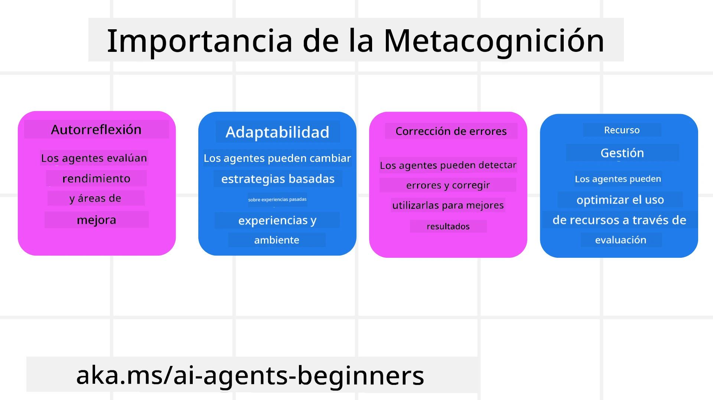
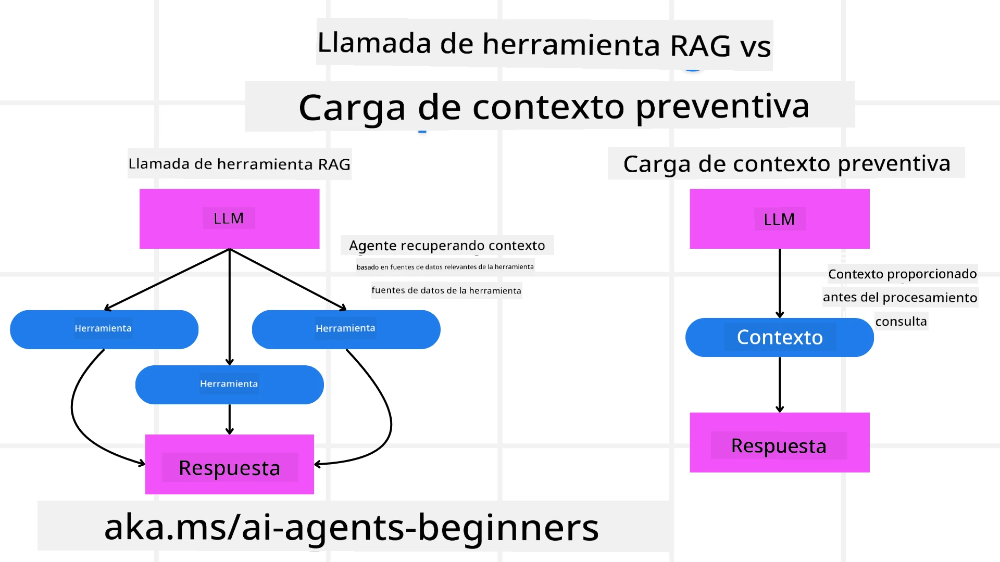

[](https://youtu.be/His9R6gw6Ec?si=3_RMb8VprNvdLRhX)

> _(Haz clic en la imagen de arriba para ver el video de esta lección)_
# Metacognición en Agentes de IA

## Introducción

¡Bienvenido a la lección sobre metacognición en agentes de IA! Este capítulo está diseñado para principiantes que tienen curiosidad sobre cómo los agentes de IA pueden pensar sobre sus propios procesos de pensamiento. Al final de esta lección, comprenderás conceptos clave y estarás equipado con ejemplos prácticos para aplicar la metacognición en el diseño de agentes de IA.

## Objetivos de Aprendizaje

Después de completar esta lección, podrás:

1. Entender las implicaciones de los bucles de razonamiento en la definición de agentes.
2. Usar técnicas de planificación y evaluación para ayudar a agentes que se autocorrigen.
3. Crear tus propios agentes capaces de manipular código para cumplir tareas.

## Introducción a la Metacognición

La metacognición se refiere a los procesos cognitivos de orden superior que implican pensar acerca del propio pensamiento. Para los agentes de IA, esto significa ser capaces de evaluar y ajustar sus acciones basándose en la autoconciencia y en experiencias pasadas. La metacognición, o "pensar sobre pensar," es un concepto importante en el desarrollo de sistemas de IA agenticos. Implica que los sistemas de IA sean conscientes de sus propios procesos internos y puedan monitorear, regular y adaptar su comportamiento en consecuencia. De manera similar a como lo hacemos cuando leemos la situación o analizamos un problema. Esta autoconciencia puede ayudar a los sistemas de IA a tomar mejores decisiones, identificar errores y mejorar su desempeño con el tiempo—nuevamente vinculándose con la prueba de Turing y el debate sobre si la IA dominará.

En el contexto de sistemas de IA agenticos, la metacognición puede ayudar a abordar varios desafíos, tales como:
- Transparencia: Asegurar que los sistemas de IA puedan explicar su razonamiento y decisiones.
- Razonamiento: Mejorar la habilidad de los sistemas de IA para sintetizar información y tomar decisiones acertadas.
- Adaptación: Permitir que los sistemas de IA se ajusten a nuevos entornos y condiciones cambiantes.
- Percepción: Mejorar la precisión de los sistemas de IA al reconocer e interpretar datos de su entorno.

### ¿Qué es la Metacognición?

La metacognición, o "pensar sobre pensar," es un proceso cognitivo de orden superior que implica la autoconciencia y la autorregulación de los propios procesos cognitivos. En el ámbito de la IA, la metacognición capacita a los agentes para evaluar y adaptar sus estrategias y acciones, llevando a una mejor capacidad para resolver problemas y tomar decisiones. Al entender la metacognición, puedes diseñar agentes de IA que no solo sean más inteligentes sino también más adaptables y eficientes. En la verdadera metacognición, observarías al AI razonando explícitamente sobre su propio razonamiento.

Ejemplo: "Priorizé vuelos más baratos porque... podría estar perdiendo vuelos directos, así que voy a revisar nuevamente."
Llevar un seguimiento de cómo o por qué escogió una ruta determinada.
- Notar que cometió errores porque confió demasiado en las preferencias del usuario de la última vez, por lo que modifica su estrategia de toma de decisiones y no solo la recomendación final.
- Diagnosticar patrones como, "Siempre que escucho que el usuario menciona 'demasiada gente,' no solo debo eliminar ciertas atracciones, sino también reflexionar que mi método para elegir 'las principales atracciones' está sesgado si siempre clasifico por popularidad."

### Importancia de la Metacognición en Agentes de IA

La metacognición juega un papel crucial en el diseño de agentes de IA por varias razones:



- Autorreflexión: Los agentes pueden evaluar su propio desempeño e identificar áreas de mejora.
- Adaptabilidad: Los agentes pueden modificar sus estrategias basándose en experiencias pasadas y entornos cambiantes.
- Corrección de Errores: Los agentes pueden detectar y corregir errores de forma autónoma, logrando resultados más precisos.
- Gestión de Recursos: Los agentes pueden optimizar el uso de recursos, como tiempo y potencia computacional, planificando y evaluando sus acciones.

## Componentes de un Agente de IA

Antes de adentrarnos en los procesos metacognitivos, es esencial entender los componentes básicos de un agente de IA. Un agente de IA típicamente consiste en:

- Persona: La personalidad y características del agente, que definen cómo interactúa con los usuarios.
- Herramientas: Las capacidades y funciones que el agente puede desempeñar.
- Habilidades: El conocimiento y experiencia que posee el agente.

Estos componentes trabajan juntos para crear una "unidad de experiencia" que puede realizar tareas específicas.

**Ejemplo**:
Considera un agente de viajes, un servicio que no solo planifica tus vacaciones sino que también ajusta su camino basado en datos en tiempo real y experiencias previas de los clientes.

### Ejemplo: Metacognición en un Servicio de Agente de Viajes

Imagina que estás diseñando un servicio de agente de viajes impulsado por IA. Este agente, "Agente de Viajes," ayuda a los usuarios a planificar sus vacaciones. Para incorporar la metacognición, el Agente de Viajes necesita evaluar y ajustar sus acciones basándose en la autoconciencia y experiencias pasadas. Aquí te mostramos cómo la metacognición podría jugar un rol:

#### Tarea Actual

La tarea actual es ayudar a un usuario a planificar un viaje a París.

#### Pasos para Completar la Tarea

1. **Reunir Preferencias del Usuario**: Preguntar al usuario sobre sus fechas de viaje, presupuesto, intereses (por ejemplo, museos, gastronomía, compras), y cualquier requisito específico.
2. **Recopilar Información**: Buscar opciones de vuelos, alojamientos, atracciones y restaurantes que coincidan con las preferencias del usuario.
3. **Generar Recomendaciones**: Proporcionar un itinerario personalizado con detalles de vuelos, reservaciones de hotel y actividades sugeridas.
4. **Ajustar en Base a Comentarios**: Pedir retroalimentación al usuario sobre las recomendaciones y hacer los ajustes necesarios.

#### Recursos Requeridos

- Acceso a bases de datos de vuelos y hoteles.
- Información sobre atracciones y restaurantes parisinos.
- Datos de retroalimentación del usuario de interacciones anteriores.

#### Experiencia y Autorreflexión

El Agente de Viajes utiliza la metacognición para evaluar su desempeño y aprender de experiencias pasadas. Por ejemplo:

1. **Análisis de Comentarios de Usuario**: El Agente de Viajes revisa la retroalimentación para determinar qué recomendaciones fueron bien recibidas y cuáles no. Ajusta sus sugerencias futuras en consecuencia.
2. **Adaptabilidad**: Si un usuario ha mencionado anteriormente que no le gustan los lugares concurridos, el Agente de Viajes evitará recomendar puntos turísticos populares durante las horas pico en el futuro.
3. **Corrección de Errores**: Si el Agente de Viajes cometió un error en una reserva pasada, como sugerir un hotel que estaba completamente lleno, aprende a verificar la disponibilidad con mayor rigor antes de hacer recomendaciones.

#### Ejemplo Práctico para Desarrolladores

Aquí hay un ejemplo simplificado de cómo podría verse el código del Agente de Viajes incorporando metacognición:

```python
class Travel_Agent:
    def __init__(self):
        self.user_preferences = {}
        self.experience_data = []

    def gather_preferences(self, preferences):
        self.user_preferences = preferences

    def retrieve_information(self):
        # Buscar vuelos, hoteles y atracciones según las preferencias
        flights = search_flights(self.user_preferences)
        hotels = search_hotels(self.user_preferences)
        attractions = search_attractions(self.user_preferences)
        return flights, hotels, attractions

    def generate_recommendations(self):
        flights, hotels, attractions = self.retrieve_information()
        itinerary = create_itinerary(flights, hotels, attractions)
        return itinerary

    def adjust_based_on_feedback(self, feedback):
        self.experience_data.append(feedback)
        # Analizar comentarios y ajustar recomendaciones futuras
        self.user_preferences = adjust_preferences(self.user_preferences, feedback)

# Ejemplo de uso
travel_agent = Travel_Agent()
preferences = {
    "destination": "Paris",
    "dates": "2025-04-01 to 2025-04-10",
    "budget": "moderate",
    "interests": ["museums", "cuisine"]
}
travel_agent.gather_preferences(preferences)
itinerary = travel_agent.generate_recommendations()
print("Suggested Itinerary:", itinerary)
feedback = {"liked": ["Louvre Museum"], "disliked": ["Eiffel Tower (too crowded)"]}
travel_agent.adjust_based_on_feedback(feedback)
```

#### Por qué Importa la Metacognición

- **Autorreflexión**: Los agentes pueden analizar su desempeño e identificar áreas para mejorar.
- **Adaptabilidad**: Los agentes pueden modificar estrategias basándose en retroalimentación y condiciones cambiantes.
- **Corrección de Errores**: Los agentes pueden detectar y corregir errores de forma autónoma.
- **Gestión de Recursos**: Los agentes pueden optimizar el uso de recursos como tiempo y potencia computacional.

Al incorporar la metacognición, el Agente de Viajes puede proporcionar recomendaciones de viaje más personalizadas y precisas, mejorando la experiencia general del usuario.

---

## 2. Planificación en Agentes

La planificación es un componente crítico del comportamiento de un agente de IA. Implica delinear los pasos necesarios para alcanzar un objetivo, considerando el estado actual, los recursos y posibles obstáculos.

### Elementos de la Planificación

- **Tarea Actual**: Definir la tarea claramente.
- **Pasos para Completar la Tarea**: Desglosar la tarea en pasos manejables.
- **Recursos Requeridos**: Identificar los recursos necesarios.
- **Experiencia**: Utilizar experiencias pasadas para informar la planificación.

**Ejemplo**:
Aquí están los pasos que el Agente de Viajes necesita para ayudar a un usuario a planificar su viaje efectivamente:

### Pasos para Agente de Viajes

1. **Reunir Preferencias del Usuario**
   - Preguntar al usuario por detalles sobre las fechas de viaje, presupuesto, intereses y requisitos específicos.
   - Ejemplos: "¿Cuándo planeas viajar?" "¿Cuál es tu rango de presupuesto?" "¿Qué actividades disfrutas en vacaciones?"

2. **Recopilar Información**
   - Buscar opciones de viaje relevantes basadas en las preferencias del usuario.
   - **Vuelos**: Buscar vuelos disponibles dentro del presupuesto y fechas preferidas del usuario.
   - **Alojamientos**: Encontrar hoteles o propiedades de renta que coincidan con las preferencias de ubicación, precio y servicios.
   - **Atracciones y Restaurantes**: Identificar atracciones populares, actividades y opciones gastronómicas que se alineen con los intereses del usuario.

3. **Generar Recomendaciones**
   - Compilar la información recopilada en un itinerario personalizado.
   - Proporcionar detalles como opciones de vuelo, reservaciones de hotel y actividades sugeridas, asegurándose de adaptar las recomendaciones a las preferencias del usuario.

4. **Presentar Itinerario al Usuario**
   - Compartir el itinerario propuesto con el usuario para su revisión.
   - Ejemplo: "Aquí tienes un itinerario sugerido para tu viaje a París. Incluye detalles de vuelos, reservaciones de hotel y una lista de actividades y restaurantes recomendados. ¡Déjame saber qué opinas!"

5. **Recolectar Retroalimentación**
   - Pedir al usuario comentarios sobre el itinerario propuesto.
   - Ejemplos: "¿Te gustan las opciones de vuelo?" "¿El hotel es adecuado para tus necesidades?" "¿Hay actividades que quieras agregar o eliminar?"

6. **Ajustar en Base a la Retroalimentación**
   - Modificar el itinerario basándose en los comentarios del usuario.
   - Hacer cambios necesarios en las recomendaciones de vuelo, alojamiento y actividades para que encajen mejor con las preferencias del usuario.

7. **Confirmación Final**
   - Presentar el itinerario actualizado para la confirmación final del usuario.
   - Ejemplo: "He realizado los ajustes según tus comentarios. Aquí está el itinerario actualizado. ¿Todo está bien para ti?"

8. **Reserva y Confirmación**
   - Una vez que el usuario aprueba el itinerario, proceder con la reserva de vuelos, alojamientos y actividades planificadas.
   - Enviar detalles de confirmación al usuario.

9. **Brindar Soporte Continuo**
   - Mantenerse disponible para asistir al usuario con cualquier cambio o solicitud adicional antes y durante su viaje.
   - Ejemplo: "Si necesitas más ayuda durante tu viaje, ¡no dudes en contactarme en cualquier momento!"

### Ejemplo de Interacción

```python
class Travel_Agent:
    def __init__(self):
        self.user_preferences = {}
        self.experience_data = []

    def gather_preferences(self, preferences):
        self.user_preferences = preferences

    def retrieve_information(self):
        flights = search_flights(self.user_preferences)
        hotels = search_hotels(self.user_preferences)
        attractions = search_attractions(self.user_preferences)
        return flights, hotels, attractions

    def generate_recommendations(self):
        flights, hotels, attractions = self.retrieve_information()
        itinerary = create_itinerary(flights, hotels, attractions)
        return itinerary

    def adjust_based_on_feedback(self, feedback):
        self.experience_data.append(feedback)
        self.user_preferences = adjust_preferences(self.user_preferences, feedback)

# Ejemplo de uso dentro de una solicitud de reserva
travel_agent = Travel_Agent()
preferences = {
    "destination": "Paris",
    "dates": "2025-04-01 to 2025-04-10",
    "budget": "moderate",
    "interests": ["museums", "cuisine"]
}
travel_agent.gather_preferences(preferences)
itinerary = travel_agent.generate_recommendations()
print("Suggested Itinerary:", itinerary)
feedback = {"liked": ["Louvre Museum"], "disliked": ["Eiffel Tower (too crowded)"]}
travel_agent.adjust_based_on_feedback(feedback)
```

## 3. Sistema Correctivo RAG

Primero comencemos entendiendo la diferencia entre Herramienta RAG y Carga de Contexto Preemptiva



### Generación Aumentada por Recuperación (RAG)

RAG combina un sistema de recuperación con un modelo generativo. Cuando se realiza una consulta, el sistema de recuperación obtiene documentos o datos relevantes de una fuente externa, y esta información recuperada se usa para aumentar la entrada del modelo generativo. Esto ayuda al modelo a generar respuestas más precisas y contextualmente relevantes.

En un sistema RAG, el agente recupera información relevante de una base de conocimientos y la usa para generar respuestas o acciones apropiadas.

### Enfoque Correctivo RAG

El enfoque Correctivo RAG se centra en usar técnicas RAG para corregir errores y mejorar la precisión de los agentes de IA. Esto implica:

1. **Técnica de Prompting (Solicitud)**: Usar prompts específicos para guiar al agente en la recuperación de información relevante.
2. **Herramienta**: Implementar algoritmos y mecanismos que permiten al agente evaluar la relevancia de la información recuperada y generar respuestas precisas.
3. **Evaluación**: Evaluar continuamente el desempeño del agente y hacer ajustes para mejorar su precisión y eficiencia.

#### Ejemplo: Correctivo RAG en un Agente de Búsqueda

Considera un agente de búsqueda que recupera información de la web para responder consultas del usuario. El enfoque Correctivo RAG podría involucrar:

1. **Técnica de Prompting**: Formular consultas de búsqueda basadas en la entrada del usuario.
2. **Herramienta**: Usar procesamiento de lenguaje natural y algoritmos de aprendizaje automático para clasificar y filtrar resultados de búsqueda.
3. **Evaluación**: Analizar retroalimentación del usuario para identificar y corregir inexactitudes en la información recuperada.

### Correctivo RAG en el Agente de Viajes

Correctivo RAG (Generación Aumentada por Recuperación) mejora la capacidad de la IA para recuperar y generar información mientras corrige cualquier inexactitud. Veamos cómo el Agente de Viajes puede usar el enfoque Correctivo RAG para brindar recomendaciones de viaje más precisas y relevantes.

Esto implica:

- **Técnica de Prompting:** Usar solicitudes específicas para guiar al agente en la recuperación de información relevante.
- **Herramienta:** Implementar algoritmos y mecanismos que permitan al agente evaluar la relevancia de la información recuperada y generar respuestas precisas.
- **Evaluación:** Evaluar continuamente el desempeño del agente y hacer ajustes para mejorar su precisión y eficiencia.

#### Pasos para Implementar Correctivo RAG en el Agente de Viajes

1. **Interacción Inicial con el Usuario**
   - El Agente de Viajes recopila preferencias iniciales del usuario, como destino, fechas de viaje, presupuesto e intereses.
   - Ejemplo:

     ```python
     preferences = {
         "destination": "Paris",
         "dates": "2025-04-01 to 2025-04-10",
         "budget": "moderate",
         "interests": ["museums", "cuisine"]
     }
     ```

2. **Recuperación de Información**
   - El Agente de Viajes recupera información sobre vuelos, alojamientos, atracciones y restaurantes basado en las preferencias del usuario.
   - Ejemplo:

     ```python
     flights = search_flights(preferences)
     hotels = search_hotels(preferences)
     attractions = search_attractions(preferences)
     ```

3. **Generación de Recomendaciones Iniciales**
   - El Agente de Viajes usa la información recuperada para generar un itinerario personalizado.
   - Ejemplo:

     ```python
     itinerary = create_itinerary(flights, hotels, attractions)
     print("Suggested Itinerary:", itinerary)
     ```

4. **Recolección de Retroalimentación del Usuario**
   - El Agente de Viajes solicita comentarios al usuario sobre las recomendaciones iniciales.
   - Ejemplo:

     ```python
     feedback = {
         "liked": ["Louvre Museum"],
         "disliked": ["Eiffel Tower (too crowded)"]
     }
     ```

5. **Proceso Correctivo RAG**
   - **Técnica de Prompting**: El Agente de Viajes formula nuevas consultas basadas en la retroalimentación del usuario.
     - Ejemplo:

       ```python
       if "disliked" in feedback:
           preferences["avoid"] = feedback["disliked"]
       ```

   - **Herramienta**: El Agente de Viajes usa algoritmos para clasificar y filtrar nuevos resultados de búsqueda, enfatizando la relevancia basada en la retroalimentación del usuario.
     - Ejemplo:

       ```python
       new_attractions = search_attractions(preferences)
       new_itinerary = create_itinerary(flights, hotels, new_attractions)
       print("Updated Itinerary:", new_itinerary)
       ```

   - **Evaluación**: El Agente de Viajes evalúa continuamente la relevancia y precisión de sus recomendaciones analizando la retroalimentación del usuario y haciendo ajustes necesarios.
     - Ejemplo:

       ```python
       def adjust_preferences(preferences, feedback):
           if "liked" in feedback:
               preferences["favorites"] = feedback["liked"]
           if "disliked" in feedback:
               preferences["avoid"] = feedback["disliked"]
           return preferences

       preferences = adjust_preferences(preferences, feedback)
       ```

#### Ejemplo Práctico

Aquí hay un ejemplo simplificado en Python que incorpora el enfoque Correctivo RAG en el Agente de Viajes:

```python
class Travel_Agent:
    def __init__(self):
        self.user_preferences = {}
        self.experience_data = []

    def gather_preferences(self, preferences):
        self.user_preferences = preferences

    def retrieve_information(self):
        flights = search_flights(self.user_preferences)
        hotels = search_hotels(self.user_preferences)
        attractions = search_attractions(self.user_preferences)
        return flights, hotels, attractions

    def generate_recommendations(self):
        flights, hotels, attractions = self.retrieve_information()
        itinerary = create_itinerary(flights, hotels, attractions)
        return itinerary

    def adjust_based_on_feedback(self, feedback):
        self.experience_data.append(feedback)
        self.user_preferences = adjust_preferences(self.user_preferences, feedback)
        new_itinerary = self.generate_recommendations()
        return new_itinerary

# Uso de ejemplo
travel_agent = Travel_Agent()
preferences = {
    "destination": "Paris",
    "dates": "2025-04-01 to 2025-04-10",
    "budget": "moderate",
    "interests": ["museums", "cuisine"]
}
travel_agent.gather_preferences(preferences)
itinerary = travel_agent.generate_recommendations()
print("Suggested Itinerary:", itinerary)
feedback = {"liked": ["Louvre Museum"], "disliked": ["Eiffel Tower (too crowded)"]}
new_itinerary = travel_agent.adjust_based_on_feedback(feedback)
print("Updated Itinerary:", new_itinerary)
```

### Carga de Contexto Preemptiva
La Carga de Contexto Preventiva implica cargar el contexto relevante o información de fondo en el modelo antes de procesar una consulta. Esto significa que el modelo tiene acceso a esta información desde el inicio, lo que puede ayudarle a generar respuestas más informadas sin necesidad de recuperar datos adicionales durante el proceso.

Aquí hay un ejemplo simplificado de cómo podría verse una carga de contexto preventiva para una aplicación de agente de viajes en Python:

```python
class TravelAgent:
    def __init__(self):
        # Pre-cargar destinos populares y su información
        self.context = {
            "Paris": {"country": "France", "currency": "Euro", "language": "French", "attractions": ["Eiffel Tower", "Louvre Museum"]},
            "Tokyo": {"country": "Japan", "currency": "Yen", "language": "Japanese", "attractions": ["Tokyo Tower", "Shibuya Crossing"]},
            "New York": {"country": "USA", "currency": "Dollar", "language": "English", "attractions": ["Statue of Liberty", "Times Square"]},
            "Sydney": {"country": "Australia", "currency": "Dollar", "language": "English", "attractions": ["Sydney Opera House", "Bondi Beach"]}
        }

    def get_destination_info(self, destination):
        # Obtener información del destino desde el contexto precargado
        info = self.context.get(destination)
        if info:
            return f"{destination}:\nCountry: {info['country']}\nCurrency: {info['currency']}\nLanguage: {info['language']}\nAttractions: {', '.join(info['attractions'])}"
        else:
            return f"Sorry, we don't have information on {destination}."

# Ejemplo de uso
travel_agent = TravelAgent()
print(travel_agent.get_destination_info("Paris"))
print(travel_agent.get_destination_info("Tokyo"))
```

#### Explicación

1. **Inicialización (método `__init__`)**: La clase `TravelAgent` precarga un diccionario que contiene información sobre destinos populares como París, Tokio, Nueva York y Sídney. Este diccionario incluye detalles como el país, la moneda, el idioma y las principales atracciones de cada destino.

2. **Recuperación de Información (método `get_destination_info`)**: Cuando un usuario consulta sobre un destino específico, el método `get_destination_info` obtiene la información relevante del diccionario de contexto pre-cargado.

Al pre-cargar el contexto, la aplicación del agente de viajes puede responder rápidamente a las consultas de los usuarios sin tener que recuperar esta información de una fuente externa en tiempo real. Esto hace que la aplicación sea más eficiente y receptiva.

### Inicializando el Plan con un Objetivo Antes de Iterar

Inicializar un plan con un objetivo implica comenzar con un objetivo claro o resultado deseado en mente. Al definir este objetivo desde el principio, el modelo puede usarlo como principio rector durante todo el proceso iterativo. Esto ayuda a garantizar que cada iteración se acerque más a lograr el resultado deseado, haciendo el proceso más eficiente y enfocado.

Aquí hay un ejemplo de cómo podrías inicializar un plan de viaje con un objetivo antes de iterar para un agente de viajes en Python:

### Escenario

Un agente de viajes quiere planificar unas vacaciones personalizadas para un cliente. El objetivo es crear un itinerario de viaje que maximice la satisfacción del cliente basado en sus preferencias y presupuesto.

### Pasos

1. Definir las preferencias y el presupuesto del cliente.
2. Inicializar el plan inicial basado en estas preferencias.
3. Iterar para refinar el plan, optimizando la satisfacción del cliente.

#### Código Python

```python
class TravelAgent:
    def __init__(self, destinations):
        self.destinations = destinations

    def bootstrap_plan(self, preferences, budget):
        plan = []
        total_cost = 0

        for destination in self.destinations:
            if total_cost + destination['cost'] <= budget and self.match_preferences(destination, preferences):
                plan.append(destination)
                total_cost += destination['cost']

        return plan

    def match_preferences(self, destination, preferences):
        for key, value in preferences.items():
            if destination.get(key) != value:
                return False
        return True

    def iterate_plan(self, plan, preferences, budget):
        for i in range(len(plan)):
            for destination in self.destinations:
                if destination not in plan and self.match_preferences(destination, preferences) and self.calculate_cost(plan, destination) <= budget:
                    plan[i] = destination
                    break
        return plan

    def calculate_cost(self, plan, new_destination):
        return sum(destination['cost'] for destination in plan) + new_destination['cost']

# Ejemplo de uso
destinations = [
    {"name": "Paris", "cost": 1000, "activity": "sightseeing"},
    {"name": "Tokyo", "cost": 1200, "activity": "shopping"},
    {"name": "New York", "cost": 900, "activity": "sightseeing"},
    {"name": "Sydney", "cost": 1100, "activity": "beach"},
]

preferences = {"activity": "sightseeing"}
budget = 2000

travel_agent = TravelAgent(destinations)
initial_plan = travel_agent.bootstrap_plan(preferences, budget)
print("Initial Plan:", initial_plan)

refined_plan = travel_agent.iterate_plan(initial_plan, preferences, budget)
print("Refined Plan:", refined_plan)
```

#### Explicación del Código

1. **Inicialización (método `__init__`)**: La clase `TravelAgent` se inicializa con una lista de destinos potenciales, cada uno con atributos como nombre, costo y tipo de actividad.

2. **Inicialización del Plan (método `bootstrap_plan`)**: Este método crea un plan de viaje inicial basado en las preferencias y el presupuesto del cliente. Itera a través de la lista de destinos y los añade al plan si coinciden con las preferencias del cliente y se ajustan al presupuesto.

3. **Coincidencia de Preferencias (método `match_preferences`)**: Este método verifica si un destino coincide con las preferencias del cliente.

4. **Iteración del Plan (método `iterate_plan`)**: Este método refina el plan inicial intentando reemplazar cada destino en el plan con una mejor opción, considerando las preferencias del cliente y las restricciones del presupuesto.

5. **Cálculo del Coste (método `calculate_cost`)**: Este método calcula el coste total del plan actual, incluyendo un posible nuevo destino.

#### Ejemplo de Uso

- **Plan Inicial**: El agente de viajes crea un plan inicial basado en las preferencias del cliente para visitas turísticas y un presupuesto de $2000.
- **Plan Refinado**: El agente de viajes itera el plan, optimizándolo según las preferencias y el presupuesto del cliente.

Al inicializar el plan con un objetivo claro (por ejemplo, maximizar la satisfacción del cliente) y luego iterar para refinarlo, el agente de viajes puede crear un itinerario personalizado y optimizado para el cliente. Este enfoque asegura que el plan de viaje se alinee con las preferencias y presupuesto del cliente desde el comienzo y mejore en cada iteración.

### Aprovechando el LLM para Reordenar y Puntuar

Los Modelos de Lenguaje Grande (LLMs) pueden usarse para reordenar y puntuar evaluando la relevancia y calidad de documentos recuperados o respuestas generadas. Así es como funciona:

**Recuperación:** El paso inicial de recuperación obtiene un conjunto de documentos o respuestas candidatas basado en la consulta.

**Reordenamiento:** El LLM evalúa estas candidatas y las reordena basándose en su relevancia y calidad. Este paso asegura que la información más relevante y de mejor calidad se presente primero.

**Puntuación:** El LLM asigna puntuaciones a cada candidato, reflejando su relevancia y calidad. Esto ayuda a seleccionar la mejor respuesta o documento para el usuario.

Al aprovechar los LLM para reordenar y puntuar, el sistema puede proporcionar información más precisa y relevante contextual, mejorando la experiencia global del usuario.

Aquí hay un ejemplo de cómo un agente de viajes podría usar un Modelo de Lenguaje Grande (LLM) para reordenar y puntuar destinos de viaje según las preferencias del usuario en Python:

#### Escenario – Viaje basado en Preferencias

Un agente de viajes quiere recomendar los mejores destinos de viaje a un cliente según sus preferencias. El LLM ayudará a reordenar y puntuar los destinos para asegurar que se presenten las opciones más relevantes.

#### Pasos:

1. Recopilar las preferencias del usuario.
2. Recuperar una lista de posibles destinos de viaje.
3. Usar el LLM para reordenar y puntuar los destinos según las preferencias del usuario.

Así puedes actualizar el ejemplo anterior para usar Azure OpenAI Services:

#### Requisitos

1. Necesitas tener una suscripción a Azure.
2. Crear un recurso Azure OpenAI y obtener tu clave API.

#### Ejemplo Código Python

```python
import requests
import json

class TravelAgent:
    def __init__(self, destinations):
        self.destinations = destinations

    def get_recommendations(self, preferences, api_key, endpoint):
        # Generar un prompt para Azure OpenAI
        prompt = self.generate_prompt(preferences)
        
        # Definir encabezados y payload para la solicitud
        headers = {
            'Content-Type': 'application/json',
            'Authorization': f'Bearer {api_key}'
        }
        payload = {
            "prompt": prompt,
            "max_tokens": 150,
            "temperature": 0.7
        }
        
        # Llamar a la API de Azure OpenAI para obtener los destinos reordenados y puntuados
        response = requests.post(endpoint, headers=headers, json=payload)
        response_data = response.json()
        
        # Extraer y devolver las recomendaciones
        recommendations = response_data['choices'][0]['text'].strip().split('\n')
        return recommendations

    def generate_prompt(self, preferences):
        prompt = "Here are the travel destinations ranked and scored based on the following user preferences:\n"
        for key, value in preferences.items():
            prompt += f"{key}: {value}\n"
        prompt += "\nDestinations:\n"
        for destination in self.destinations:
            prompt += f"- {destination['name']}: {destination['description']}\n"
        return prompt

# Ejemplo de uso
destinations = [
    {"name": "Paris", "description": "City of lights, known for its art, fashion, and culture."},
    {"name": "Tokyo", "description": "Vibrant city, famous for its modernity and traditional temples."},
    {"name": "New York", "description": "The city that never sleeps, with iconic landmarks and diverse culture."},
    {"name": "Sydney", "description": "Beautiful harbour city, known for its opera house and stunning beaches."},
]

preferences = {"activity": "sightseeing", "culture": "diverse"}
api_key = 'your_azure_openai_api_key'
endpoint = 'https://your-endpoint.com/openai/deployments/your-deployment-name/completions?api-version=2022-12-01'

travel_agent = TravelAgent(destinations)
recommendations = travel_agent.get_recommendations(preferences, api_key, endpoint)
print("Recommended Destinations:")
for rec in recommendations:
    print(rec)
```

#### Explicación del Código - Preference Booker

1. **Inicialización**: La clase `TravelAgent` se inicializa con una lista de posibles destinos de viaje, cada uno con atributos como nombre y descripción.

2. **Obteniendo Recomendaciones (método `get_recommendations`)**: Este método genera un prompt para el servicio Azure OpenAI basado en las preferencias del usuario y realiza una solicitud HTTP POST a la API de Azure OpenAI para obtener destinos reordenados y puntuados.

3. **Generación del Prompt (método `generate_prompt`)**: Este método construye un prompt para Azure OpenAI, incluyendo las preferencias del usuario y la lista de destinos. El prompt guía al modelo para reordenar y puntuar los destinos según las preferencias indicadas.

4. **Llamada a la API**: La biblioteca `requests` se usa para hacer una petición HTTP POST al endpoint de Azure OpenAI. La respuesta contiene los destinos reordenados y puntuados.

5. **Ejemplo de Uso**: El agente de viajes recopila las preferencias del usuario (por ejemplo, interés en turismo y cultura diversa) y usa el servicio Azure OpenAI para obtener recomendaciones reordenadas y puntuadas para destinos de viaje.

Asegúrate de reemplazar `your_azure_openai_api_key` con tu clave Azure OpenAI real y `https://your-endpoint.com/...` con la URL del endpoint real de tu despliegue Azure OpenAI.

Al aprovechar el LLM para reordenar y puntuar, el agente de viajes puede proporcionar recomendaciones de viajes más personalizadas y relevantes a los clientes, mejorando su experiencia en general.

### RAG: Técnica de Prompting vs Herramienta

Retrieval-Augmented Generation (RAG) puede ser tanto una técnica de prompting como una herramienta en el desarrollo de agentes de IA. Entender la diferencia entre ambos puede ayudarte a aprovechar RAG de forma más efectiva en tus proyectos.

#### RAG como Técnica de Prompting

**¿Qué es?**

- Como técnica de prompting, RAG implica formular consultas o prompts específicos para guiar la recuperación de información relevante de un corpus o base de datos grande. Esta información se usa luego para generar respuestas o acciones.

**Cómo funciona:**

1. **Formular Prompts**: Crear prompts o consultas bien estructuradas basadas en la tarea o la entrada del usuario.
2. **Recuperar Información**: Usar los prompts para buscar datos relevantes en una base de conocimientos o conjunto de datos preexistente.
3. **Generar Respuesta**: Combinar la información recuperada con modelos generativos de IA para producir una respuesta integral y coherente.

**Ejemplo en Agente de Viajes**:

- Entrada del usuario: "Quiero visitar museos en París."
- Prompt: "Encuentra los mejores museos en París."
- Información Recuperada: Detalles sobre Museo del Louvre, Musée d'Orsay, etc.
- Respuesta Generada: "Aquí tienes algunos de los mejores museos en París: Museo del Louvre, Musée d'Orsay y Centro Pompidou."

#### RAG como Herramienta

**¿Qué es?**

- Como herramienta, RAG es un sistema integrado que automatiza el proceso de recuperación y generación, facilitando a los desarrolladores implementar funcionalidades complejas de IA sin la necesidad de crear manualmente prompts para cada consulta.

**Cómo funciona:**

1. **Integración**: Incluir RAG dentro de la arquitectura del agente de IA, permitiendo que maneje automáticamente las tareas de recuperación y generación.
2. **Automatización**: La herramienta gestiona todo el proceso, desde recibir la entrada del usuario hasta generar la respuesta final, sin requerir prompts explícitos en cada paso.
3. **Eficiencia**: Mejora el rendimiento del agente al optimizar el proceso de recuperación y generación, permitiendo respuestas más rápidas y precisas.

**Ejemplo en Agente de Viajes**:

- Entrada del usuario: "Quiero visitar museos en París."
- Herramienta RAG: Recupera automáticamente información sobre museos y genera una respuesta.
- Respuesta Generada: "Aquí tienes algunos de los mejores museos en París: Museo del Louvre, Musée d'Orsay y Centro Pompidou."

### Comparación

| Aspecto                | Técnica de Prompting                                   | Herramienta                                          |
|------------------------|-------------------------------------------------------|-----------------------------------------------------|
| **Manual vs Automático**| Formulación manual de prompts para cada consulta.     | Proceso automatizado de recuperación y generación.  |
| **Control**            | Ofrece más control sobre el proceso de recuperación.  | Optimiza y automatiza recuperación y generación.    |
| **Flexibilidad**       | Permite prompts personalizados según necesidades.     | Más eficiente para implementaciones a gran escala. |
| **Complejidad**        | Requiere crear y ajustar prompts.                      | Más fácil de integrar en la arquitectura del agente.|

### Ejemplos Prácticos

**Ejemplo de Técnica de Prompting:**

```python
def search_museums_in_paris():
    prompt = "Find top museums in Paris"
    search_results = search_web(prompt)
    return search_results

museums = search_museums_in_paris()
print("Top Museums in Paris:", museums)
```

**Ejemplo de Herramienta:**

```python
class Travel_Agent:
    def __init__(self):
        self.rag_tool = RAGTool()

    def get_museums_in_paris(self):
        user_input = "I want to visit museums in Paris."
        response = self.rag_tool.retrieve_and_generate(user_input)
        return response

travel_agent = Travel_Agent()
museums = travel_agent.get_museums_in_paris()
print("Top Museums in Paris:", museums)
```

### Evaluando la Relevancia

Evaluar la relevancia es un aspecto crucial del rendimiento de un agente de IA. Garantiza que la información recuperada y generada por el agente sea apropiada, precisa y útil para el usuario. Veamos cómo evaluar la relevancia en agentes de IA, incluyendo ejemplos prácticos y técnicas.

#### Conceptos Clave en la Evaluación de Relevancia

1. **Conciencia del Contexto**:
   - El agente debe entender el contexto de la consulta del usuario para recuperar y generar información relevante.
   - Ejemplo: Si un usuario pregunta por "los mejores restaurantes en París", el agente debe tener en cuenta las preferencias del usuario, como tipo de cocina y presupuesto.

2. **Precisión**:
   - La información proporcionada por el agente debe ser veraz y actualizada.
   - Ejemplo: Recomendar restaurantes que estén abiertos actualmente y con buenas reseñas, en lugar de opciones desactualizadas o cerradas.

3. **Intención del Usuario**:
   - El agente debe inferir la intención del usuario detrás de la consulta para proporcionar la información más relevante.
   - Ejemplo: Si un usuario pregunta por "hoteles económicos", el agente debería priorizar opciones asequibles.

4. **Bucle de Retroalimentación**:
   - Recopilar y analizar continuamente la retroalimentación del usuario ayuda al agente a refinar su proceso de evaluación de relevancia.
   - Ejemplo: Incorporar calificaciones y comentarios de usuarios sobre recomendaciones previas para mejorar respuestas futuras.

#### Técnicas Prácticas para Evaluar la Relevancia

1. **Puntuación de Relevancia**:
   - Asignar una puntuación de relevancia a cada elemento recuperado según qué tan bien coincide con la consulta y preferencias del usuario.
   - Ejemplo:

     ```python
     def relevance_score(item, query):
         score = 0
         if item['category'] in query['interests']:
             score += 1
         if item['price'] <= query['budget']:
             score += 1
         if item['location'] == query['destination']:
             score += 1
         return score
     ```

2. **Filtrado y Clasificación**:
   - Filtrar elementos irrelevantes y clasificar los restantes según sus puntuaciones de relevancia.
   - Ejemplo:

     ```python
     def filter_and_rank(items, query):
         ranked_items = sorted(items, key=lambda item: relevance_score(item, query), reverse=True)
         return ranked_items[:10]  # Devuelve los 10 elementos más relevantes
     ```

3. **Procesamiento de Lenguaje Natural (NLP)**:
   - Utilizar técnicas de NLP para comprender la consulta del usuario y recuperar información relevante.
   - Ejemplo:

     ```python
     def process_query(query):
         # Usa PLN para extraer información clave de la consulta del usuario
         processed_query = nlp(query)
         return processed_query
     ```

4. **Integración de Retroalimentación del Usuario**:
   - Recoger retroalimentación de usuario sobre las recomendaciones dadas y usarla para ajustar futuras evaluaciones de relevancia.
   - Ejemplo:

     ```python
     def adjust_based_on_feedback(feedback, items):
         for item in items:
             if item['name'] in feedback['liked']:
                 item['relevance'] += 1
             if item['name'] in feedback['disliked']:
                 item['relevance'] -= 1
         return items
     ```

#### Ejemplo: Evaluando la Relevancia en Agente de Viajes

Aquí tienes un ejemplo práctico de cómo Travel Agent puede evaluar la relevancia de sus recomendaciones de viaje:

```python
class Travel_Agent:
    def __init__(self):
        self.user_preferences = {}
        self.experience_data = []

    def gather_preferences(self, preferences):
        self.user_preferences = preferences

    def retrieve_information(self):
        flights = search_flights(self.user_preferences)
        hotels = search_hotels(self.user_preferences)
        attractions = search_attractions(self.user_preferences)
        return flights, hotels, attractions

    def generate_recommendations(self):
        flights, hotels, attractions = self.retrieve_information()
        ranked_hotels = self.filter_and_rank(hotels, self.user_preferences)
        itinerary = create_itinerary(flights, ranked_hotels, attractions)
        return itinerary

    def filter_and_rank(self, items, query):
        ranked_items = sorted(items, key=lambda item: self.relevance_score(item, query), reverse=True)
        return ranked_items[:10]  # Devolver los 10 elementos más relevantes

    def relevance_score(self, item, query):
        score = 0
        if item['category'] in query['interests']:
            score += 1
        if item['price'] <= query['budget']:
            score += 1
        if item['location'] == query['destination']:
            score += 1
        return score

    def adjust_based_on_feedback(self, feedback, items):
        for item in items:
            if item['name'] in feedback['liked']:
                item['relevance'] += 1
            if item['name'] in feedback['disliked']:
                item['relevance'] -= 1
        return items

# Ejemplo de uso
travel_agent = Travel_Agent()
preferences = {
    "destination": "Paris",
    "dates": "2025-04-01 to 2025-04-10",
    "budget": "moderate",
    "interests": ["museums", "cuisine"]
}
travel_agent.gather_preferences(preferences)
itinerary = travel_agent.generate_recommendations()
print("Suggested Itinerary:", itinerary)
feedback = {"liked": ["Louvre Museum"], "disliked": ["Eiffel Tower (too crowded)"]}
updated_items = travel_agent.adjust_based_on_feedback(feedback, itinerary['hotels'])
print("Updated Itinerary with Feedback:", updated_items)
```

### Búsqueda con Intención

Buscar con intención implica entender e interpretar el propósito o meta subyacente detrás de la consulta de un usuario para recuperar y generar información lo más relevante y útil posible. Este enfoque va más allá de simplemente coincidir palabras clave y se concentra en captar las necesidades reales y el contexto del usuario.

#### Conceptos Clave en la Búsqueda con Intención

1. **Comprender la Intención del Usuario**:
   - La intención del usuario puede clasificarse en tres tipos principales: informativa, de navegación y transaccional.
     - **Intención Informativa**: El usuario busca información sobre un tema (por ejemplo, "¿Cuáles son los mejores museos en París?").
     - **Intención de Navegación**: El usuario quiere ir a un sitio web o página específica (por ejemplo, "Sitio oficial del Museo del Louvre").
     - **Intención Transaccional**: El usuario desea realizar una transacción, como reservar un vuelo o hacer una compra (por ejemplo, "Reservar un vuelo a París").

2. **Conciencia del Contexto**:
   - Analizar el contexto de la consulta del usuario ayuda a identificar con precisión su intención. Esto incluye considerar interacciones previas, preferencias y detalles específicos de la consulta actual.

3. **Procesamiento de Lenguaje Natural (NLP)**:
   - Se emplean técnicas de NLP para entender e interpretar las consultas en lenguaje natural que proporcionan los usuarios. Esto incluye tareas como reconocimiento de entidades, análisis de sentimiento y parsing de consulta.

4. **Personalización**:
   - Personalizar los resultados de búsqueda según el historial, preferencias y retroalimentación del usuario mejora la relevancia de la información recuperada.

#### Ejemplo Práctico: Búsqueda con Intención en Agente de Viajes

Veamos Travel Agent como ejemplo para implementar búsqueda con intención.

1. **Recopilación de Preferencias del Usuario**

   ```python
   class Travel_Agent:
       def __init__(self):
           self.user_preferences = {}

       def gather_preferences(self, preferences):
           self.user_preferences = preferences
   ```

2. **Comprender la Intención del Usuario**

   ```python
   def identify_intent(query):
       if "book" in query or "purchase" in query:
           return "transactional"
       elif "website" in query or "official" in query:
           return "navigational"
       else:
           return "informational"
   ```

3. **Conciencia del Contexto**


   ```python
   def analyze_context(query, user_history):
       # Combina la consulta actual con el historial del usuario para entender el contexto
       context = {
           "current_query": query,
           "user_history": user_history
       }
       return context
   ```

4. **Buscar y personalizar resultados**

   ```python
   def search_with_intent(query, preferences, user_history):
       intent = identify_intent(query)
       context = analyze_context(query, user_history)
       if intent == "informational":
           search_results = search_information(query, preferences)
       elif intent == "navigational":
           search_results = search_navigation(query)
       elif intent == "transactional":
           search_results = search_transaction(query, preferences)
       personalized_results = personalize_results(search_results, user_history)
       return personalized_results

   def search_information(query, preferences):
       # Ejemplo de lógica de búsqueda para intención informativa
       results = search_web(f"best {preferences['interests']} in {preferences['destination']}")
       return results

   def search_navigation(query):
       # Ejemplo de lógica de búsqueda para intención de navegación
       results = search_web(query)
       return results

   def search_transaction(query, preferences):
       # Ejemplo de lógica de búsqueda para intención transaccional
       results = search_web(f"book {query} to {preferences['destination']}")
       return results

   def personalize_results(results, user_history):
       # Ejemplo de lógica de personalización
       personalized = [result for result in results if result not in user_history]
       return personalized[:10]  # Devolver los 10 mejores resultados personalizados
   ```

5. **Ejemplo de uso**

   ```python
   travel_agent = Travel_Agent()
   preferences = {
       "destination": "Paris",
       "interests": ["museums", "cuisine"]
   }
   travel_agent.gather_preferences(preferences)
   user_history = ["Louvre Museum website", "Book flight to Paris"]
   query = "best museums in Paris"
   results = search_with_intent(query, preferences, user_history)
   print("Search Results:", results)
   ```

---

## 4. Generación de Código como Herramienta

Los agentes generadores de código usan modelos de IA para escribir y ejecutar código, resolviendo problemas complejos y automatizando tareas.

### Agentes Generadores de Código

Los agentes generadores de código utilizan modelos de IA generativa para escribir y ejecutar código. Estos agentes pueden resolver problemas complejos, automatizar tareas y proporcionar conocimientos valiosos generando y ejecutando código en varios lenguajes de programación.

#### Aplicaciones Prácticas

1. **Generación automática de código**: Generar fragmentos de código para tareas específicas, como análisis de datos, extracción web o aprendizaje automático.
2. **SQL como RAG**: Utilizar consultas SQL para recuperar y manipular datos desde bases de datos.
3. **Resolución de problemas**: Crear y ejecutar código para resolver problemas específicos, como optimizar algoritmos o analizar datos.

#### Ejemplo: Agente Generador de Código para Análisis de Datos

Imagina que estás diseñando un agente generador de código. Así es como podría funcionar:

1. **Tarea**: Analizar un conjunto de datos para identificar tendencias y patrones.
2. **Pasos**:
   - Cargar el conjunto de datos en una herramienta de análisis de datos.
   - Generar consultas SQL para filtrar y agregar los datos.
   - Ejecutar las consultas y recuperar los resultados.
   - Utilizar los resultados para generar visualizaciones e insights.
3. **Recursos requeridos**: Acceso al conjunto de datos, herramientas de análisis de datos y capacidades SQL.
4. **Experiencia**: Usar resultados de análisis anteriores para mejorar la precisión y relevancia de futuros análisis.

### Ejemplo: Agente Generador de Código para Agente de Viajes

En este ejemplo, diseñaremos un agente generador de código, Agente de Viajes, para ayudar a los usuarios a planificar su viaje generando y ejecutando código. Este agente puede manejar tareas como obtener opciones de viaje, filtrar resultados y compilar un itinerario utilizando IA generativa.

#### Descripción general del Agente Generador de Código

1. **Recopilación de preferencias del usuario**: Recopila entradas del usuario como destino, fechas de viaje, presupuesto e intereses.
2. **Generación de código para obtener datos**: Genera fragmentos de código para recuperar datos sobre vuelos, hoteles y atracciones.
3. **Ejecución del código generado**: Ejecuta el código generado para obtener información en tiempo real.
4. **Generación del itinerario**: Compila los datos obtenidos en un plan de viaje personalizado.
5. **Ajuste basado en retroalimentación**: Recibe retroalimentación del usuario y regenera código si es necesario para refinar los resultados.

#### Implementación paso a paso

1. **Recopilación de preferencias del usuario**

   ```python
   class Travel_Agent:
       def __init__(self):
           self.user_preferences = {}

       def gather_preferences(self, preferences):
           self.user_preferences = preferences
   ```

2. **Generación de código para obtener datos**

   ```python
   def generate_code_to_fetch_data(preferences):
       # Ejemplo: Generar código para buscar vuelos según las preferencias del usuario
       code = f"""
       def search_flights():
           import requests
           response = requests.get('https://api.example.com/flights', params={preferences})
           return response.json()
       """
       return code

   def generate_code_to_fetch_hotels(preferences):
       # Ejemplo: Generar código para buscar hoteles
       code = f"""
       def search_hotels():
           import requests
           response = requests.get('https://api.example.com/hotels', params={preferences})
           return response.json()
       """
       return code
   ```

3. **Ejecución del código generado**

   ```python
   def execute_code(code):
       # Ejecuta el código generado usando exec
       exec(code)
       result = locals()
       return result

   travel_agent = Travel_Agent()
   preferences = {
       "destination": "Paris",
       "dates": "2025-04-01 to 2025-04-10",
       "budget": "moderate",
       "interests": ["museums", "cuisine"]
   }
   travel_agent.gather_preferences(preferences)
   
   flight_code = generate_code_to_fetch_data(preferences)
   hotel_code = generate_code_to_fetch_hotels(preferences)
   
   flights = execute_code(flight_code)
   hotels = execute_code(hotel_code)

   print("Flight Options:", flights)
   print("Hotel Options:", hotels)
   ```

4. **Generación del itinerario**

   ```python
   def generate_itinerary(flights, hotels, attractions):
       itinerary = {
           "flights": flights,
           "hotels": hotels,
           "attractions": attractions
       }
       return itinerary

   attractions = search_attractions(preferences)
   itinerary = generate_itinerary(flights, hotels, attractions)
   print("Suggested Itinerary:", itinerary)
   ```

5. **Ajuste basado en retroalimentación**

   ```python
   def adjust_based_on_feedback(feedback, preferences):
       # Ajustar las preferencias según los comentarios del usuario
       if "liked" in feedback:
           preferences["favorites"] = feedback["liked"]
       if "disliked" in feedback:
           preferences["avoid"] = feedback["disliked"]
       return preferences

   feedback = {"liked": ["Louvre Museum"], "disliked": ["Eiffel Tower (too crowded)"]}
   updated_preferences = adjust_based_on_feedback(feedback, preferences)
   
   # Regenerar y ejecutar el código con las preferencias actualizadas
   updated_flight_code = generate_code_to_fetch_data(updated_preferences)
   updated_hotel_code = generate_code_to_fetch_hotels(updated_preferences)
   
   updated_flights = execute_code(updated_flight_code)
   updated_hotels = execute_code(updated_hotel_code)
   
   updated_itinerary = generate_itinerary(updated_flights, updated_hotels, attractions)
   print("Updated Itinerary:", updated_itinerary)
   ```

### Aprovechando el conocimiento ambiental y el razonamiento

Basarse en el esquema de la tabla puede mejorar el proceso de generación de consultas aprovechando el conocimiento ambiental y el razonamiento.

Aquí hay un ejemplo de cómo se puede hacer esto:

1. **Entendiendo el esquema**: El sistema entenderá el esquema de la tabla y usará esta información para fundamentar la generación de consultas.
2. **Ajuste basado en retroalimentación**: El sistema ajustará las preferencias del usuario basándose en la retroalimentación y razonará sobre qué campos en el esquema deben actualizarse.
3. **Generación y ejecución de consultas**: El sistema generará y ejecutará consultas para obtener datos actualizados de vuelos y hoteles según las nuevas preferencias.

Aquí hay un ejemplo actualizado de código Python que incorpora estos conceptos:

```python
def adjust_based_on_feedback(feedback, preferences, schema):
    # Ajustar las preferencias basándose en la retroalimentación del usuario
    if "liked" in feedback:
        preferences["favorites"] = feedback["liked"]
    if "disliked" in feedback:
        preferences["avoid"] = feedback["disliked"]
    # Razonamiento basado en el esquema para ajustar otras preferencias relacionadas
    for field in schema:
        if field in preferences:
            preferences[field] = adjust_based_on_environment(feedback, field, schema)
    return preferences

def adjust_based_on_environment(feedback, field, schema):
    # Lógica personalizada para ajustar preferencias basándose en el esquema y la retroalimentación
    if field in feedback["liked"]:
        return schema[field]["positive_adjustment"]
    elif field in feedback["disliked"]:
        return schema[field]["negative_adjustment"]
    return schema[field]["default"]

def generate_code_to_fetch_data(preferences):
    # Generar código para obtener datos de vuelos basándose en las preferencias actualizadas
    return f"fetch_flights(preferences={preferences})"

def generate_code_to_fetch_hotels(preferences):
    # Generar código para obtener datos de hoteles basándose en las preferencias actualizadas
    return f"fetch_hotels(preferences={preferences})"

def execute_code(code):
    # Simular la ejecución del código y devolver datos simulados
    return {"data": f"Executed: {code}"}

def generate_itinerary(flights, hotels, attractions):
    # Generar itinerario basado en vuelos, hoteles y atracciones
    return {"flights": flights, "hotels": hotels, "attractions": attractions}

# Ejemplo de esquema
schema = {
    "favorites": {"positive_adjustment": "increase", "negative_adjustment": "decrease", "default": "neutral"},
    "avoid": {"positive_adjustment": "decrease", "negative_adjustment": "increase", "default": "neutral"}
}

# Ejemplo de uso
preferences = {"favorites": "sightseeing", "avoid": "crowded places"}
feedback = {"liked": ["Louvre Museum"], "disliked": ["Eiffel Tower (too crowded)"]}
updated_preferences = adjust_based_on_feedback(feedback, preferences, schema)

# Regenerar y ejecutar código con preferencias actualizadas
updated_flight_code = generate_code_to_fetch_data(updated_preferences)
updated_hotel_code = generate_code_to_fetch_hotels(updated_preferences)

updated_flights = execute_code(updated_flight_code)
updated_hotels = execute_code(updated_hotel_code)

updated_itinerary = generate_itinerary(updated_flights, updated_hotels, feedback["liked"])
print("Updated Itinerary:", updated_itinerary)
```

#### Explicación - Reserva basada en retroalimentación

1. **Conciencia del esquema**: El diccionario `schema` define cómo deben ajustarse las preferencias basándose en la retroalimentación. Incluye campos como `favorites` y `avoid`, con ajustes correspondientes.
2. **Ajuste de preferencias (método `adjust_based_on_feedback`)**: Este método ajusta las preferencias basándose en la retroalimentación del usuario y el esquema.
3. **Ajustes basados en el entorno (método `adjust_based_on_environment`)**: Este método personaliza los ajustes basándose en el esquema y la retroalimentación.
4. **Generación y ejecución de consultas**: El sistema genera código para obtener datos actualizados de vuelos y hoteles basado en las preferencias ajustadas y simula la ejecución de estas consultas.
5. **Generación del itinerario**: El sistema crea un itinerario actualizado basado en los nuevos datos de vuelos, hoteles y atracciones.

Al hacer que el sistema sea consciente del entorno y razone basándose en el esquema, puede generar consultas más precisas y relevantes, lo que conduce a mejores recomendaciones de viaje y una experiencia de usuario más personalizada.

### Uso de SQL como Técnica de Generación Aumentada por Recuperación (RAG)

SQL (Lenguaje de Consulta Estructurado) es una herramienta poderosa para interactuar con bases de datos. Cuando se usa como parte de un enfoque de Generación Aumentada por Recuperación (RAG), SQL puede recuperar datos relevantes de bases de datos para informar y generar respuestas o acciones en agentes de IA. Exploremos cómo se puede usar SQL como técnica RAG en el contexto del Agente de Viajes.

#### Conceptos clave

1. **Interacción con bases de datos**:
   - SQL se utiliza para consultar bases de datos, recuperar información relevante y manipular datos.
   - Ejemplo: Obtener detalles de vuelos, información de hoteles y atracciones de una base de datos de viajes.

2. **Integración con RAG**:
   - Las consultas SQL se generan basándose en la entrada y preferencias del usuario.
   - Los datos recuperados se utilizan luego para generar recomendaciones o acciones personalizadas.

3. **Generación dinámica de consultas**:
   - El agente de IA genera consultas SQL dinámicas según el contexto y necesidades del usuario.
   - Ejemplo: Personalizar consultas SQL para filtrar resultados según presupuesto, fechas e intereses.

#### Aplicaciones

- **Generación automática de código**: Generar fragmentos de código para tareas específicas.
- **SQL como RAG**: Utilizar consultas SQL para manipular datos.
- **Resolución de problemas**: Crear y ejecutar código para resolver problemas.

**Ejemplo**:
Un agente de análisis de datos:

1. **Tarea**: Analizar un conjunto de datos para encontrar tendencias.
2. **Pasos**:
   - Cargar el conjunto de datos.
   - Generar consultas SQL para filtrar datos.
   - Ejecutar consultas y recuperar resultados.
   - Generar visualizaciones e insights.
3. **Recursos**: Acceso al conjunto de datos, capacidades SQL.
4. **Experiencia**: Usar resultados pasados para mejorar futuros análisis.

#### Ejemplo práctico: Uso de SQL en Agente de Viajes

1. **Recopilación de preferencias del usuario**

   ```python
   class Travel_Agent:
       def __init__(self):
           self.user_preferences = {}

       def gather_preferences(self, preferences):
           self.user_preferences = preferences
   ```

2. **Generación de consultas SQL**

   ```python
   def generate_sql_query(table, preferences):
       query = f"SELECT * FROM {table} WHERE "
       conditions = []
       for key, value in preferences.items():
           conditions.append(f"{key}='{value}'")
       query += " AND ".join(conditions)
       return query
   ```

3. **Ejecución de consultas SQL**

   ```python
   import sqlite3

   def execute_sql_query(query, database="travel.db"):
       connection = sqlite3.connect(database)
       cursor = connection.cursor()
       cursor.execute(query)
       results = cursor.fetchall()
       connection.close()
       return results
   ```

4. **Generación de recomendaciones**

   ```python
   def generate_recommendations(preferences):
       flight_query = generate_sql_query("flights", preferences)
       hotel_query = generate_sql_query("hotels", preferences)
       attraction_query = generate_sql_query("attractions", preferences)
       
       flights = execute_sql_query(flight_query)
       hotels = execute_sql_query(hotel_query)
       attractions = execute_sql_query(attraction_query)
       
       itinerary = {
           "flights": flights,
           "hotels": hotels,
           "attractions": attractions
       }
       return itinerary

   travel_agent = Travel_Agent()
   preferences = {
       "destination": "Paris",
       "dates": "2025-04-01 to 2025-04-10",
       "budget": "moderate",
       "interests": ["museums", "cuisine"]
   }
   travel_agent.gather_preferences(preferences)
   itinerary = generate_recommendations(preferences)
   print("Suggested Itinerary:", itinerary)
   ```

#### Ejemplos de consultas SQL

1. **Consulta de vuelo**

   ```sql
   SELECT * FROM flights WHERE destination='Paris' AND dates='2025-04-01 to 2025-04-10' AND budget='moderate';
   ```

2. **Consulta de hotel**

   ```sql
   SELECT * FROM hotels WHERE destination='Paris' AND budget='moderate';
   ```

3. **Consulta de atracción**

   ```sql
   SELECT * FROM attractions WHERE destination='Paris' AND interests='museums, cuisine';
   ```

Al aprovechar SQL como parte de la técnica de Generación Aumentada por Recuperación (RAG), agentes de IA como Agente de Viajes pueden recuperar y utilizar dinámicamente datos relevantes para proporcionar recomendaciones precisas y personalizadas.

### Ejemplo de Metacognición

Para demostrar una implementación de metacognición, creemos un agente simple que *reflexiona sobre su proceso de toma de decisiones* mientras resuelve un problema. Para este ejemplo, construiremos un sistema donde un agente intenta optimizar la elección de un hotel, pero luego evalúa su propio razonamiento y ajusta su estrategia cuando comete errores o decisiones subóptimas.

Simularemos esto usando un ejemplo básico donde el agente selecciona hoteles basándose en una combinación de precio y calidad, pero "reflexionará" sobre sus decisiones y ajustará en consecuencia.

#### Cómo ilustra esto la metacognición:

1. **Decisión inicial**: El agente elegirá el hotel más barato, sin entender el impacto de la calidad.
2. **Reflexión y evaluación**: Después de la elección inicial, el agente verificará si el hotel es una mala elección usando retroalimentación del usuario. Si descubre que la calidad del hotel fue demasiado baja, reflexionará sobre su razonamiento.
3. **Ajuste de estrategia**: El agente ajustará su estrategia basado en esa reflexión cambiando de "más barato" a "mayor calidad", mejorando así su proceso de toma de decisiones en iteraciones futuras.

Aquí hay un ejemplo:

```python
class HotelRecommendationAgent:
    def __init__(self):
        self.previous_choices = []  # Almacena los hoteles elegidos previamente
        self.corrected_choices = []  # Almacena las elecciones corregidas
        self.recommendation_strategies = ['cheapest', 'highest_quality']  # Estrategias disponibles

    def recommend_hotel(self, hotels, strategy):
        """
        Recommend a hotel based on the chosen strategy.
        The strategy can either be 'cheapest' or 'highest_quality'.
        """
        if strategy == 'cheapest':
            recommended = min(hotels, key=lambda x: x['price'])
        elif strategy == 'highest_quality':
            recommended = max(hotels, key=lambda x: x['quality'])
        else:
            recommended = None
        self.previous_choices.append((strategy, recommended))
        return recommended

    def reflect_on_choice(self):
        """
        Reflect on the last choice made and decide if the agent should adjust its strategy.
        The agent considers if the previous choice led to a poor outcome.
        """
        if not self.previous_choices:
            return "No choices made yet."

        last_choice_strategy, last_choice = self.previous_choices[-1]
        # Supongamos que tenemos algunos comentarios de usuario que nos dicen si la última elección fue buena o no
        user_feedback = self.get_user_feedback(last_choice)

        if user_feedback == "bad":
            # Ajusta la estrategia si la elección anterior fue insatisfactoria
            new_strategy = 'highest_quality' if last_choice_strategy == 'cheapest' else 'cheapest'
            self.corrected_choices.append((new_strategy, last_choice))
            return f"Reflecting on choice. Adjusting strategy to {new_strategy}."
        else:
            return "The choice was good. No need to adjust."

    def get_user_feedback(self, hotel):
        """
        Simulate user feedback based on hotel attributes.
        For simplicity, assume if the hotel is too cheap, the feedback is "bad".
        If the hotel has quality less than 7, feedback is "bad".
        """
        if hotel['price'] < 100 or hotel['quality'] < 7:
            return "bad"
        return "good"

# Simula una lista de hoteles (precio y calidad)
hotels = [
    {'name': 'Budget Inn', 'price': 80, 'quality': 6},
    {'name': 'Comfort Suites', 'price': 120, 'quality': 8},
    {'name': 'Luxury Stay', 'price': 200, 'quality': 9}
]

# Crea un agente
agent = HotelRecommendationAgent()

# Paso 1: El agente recomienda un hotel usando la estrategia "más barato"
recommended_hotel = agent.recommend_hotel(hotels, 'cheapest')
print(f"Recommended hotel (cheapest): {recommended_hotel['name']}")

# Paso 2: El agente reflexiona sobre la elección y ajusta la estrategia si es necesario
reflection_result = agent.reflect_on_choice()
print(reflection_result)

# Paso 3: El agente recomienda de nuevo, esta vez usando la estrategia ajustada
adjusted_recommendation = agent.recommend_hotel(hotels, 'highest_quality')
print(f"Adjusted hotel recommendation (highest_quality): {adjusted_recommendation['name']}")
```

#### Habilidades de metacognición de los agentes

Lo clave aquí es la capacidad del agente para:
- Evaluar sus elecciones previas y proceso de toma de decisiones.
- Ajustar su estrategia basado en esa reflexión, es decir, metacognición en acción.

Esta es una forma simple de metacognición donde el sistema es capaz de ajustar su proceso de razonamiento basándose en retroalimentación interna.

### Conclusión

La metacognición es una herramienta poderosa que puede mejorar significativamente las capacidades de los agentes de IA. Al incorporar procesos metacognitivos, puedes diseñar agentes que sean más inteligentes, adaptables y eficientes. Usa los recursos adicionales para explorar más el fascinante mundo de la metacognición en agentes de IA.

### ¿Tienes más preguntas sobre el patrón de diseño de metacognición?

Únete a [Microsoft Foundry Discord](https://discord.com/invite/ATgtXmAS5D) para encontrarte con otros aprendices, asistir a horas de oficina y resolver tus preguntas sobre Agentes de IA.

## Lección anterior

[Patrón de diseño multi-agente](../08-multi-agent/README.md)

## Próxima lección

[Agentes de IA en producción](../10-ai-agents-production/README.md)

---

<!-- CO-OP TRANSLATOR DISCLAIMER START -->
**Descargo de responsabilidad**:
Este documento ha sido traducido utilizando el servicio de traducción automática [Co-op Translator](https://github.com/Azure/co-op-translator). Aunque nos esforzamos por la precisión, tenga en cuenta que las traducciones automatizadas pueden contener errores o inexactitudes. El documento original en su idioma nativo debe considerarse la fuente autorizada. Para información crítica, se recomienda una traducción profesional humana. No somos responsables de cualquier malentendido o interpretación errónea que surja del uso de esta traducción.
<!-- CO-OP TRANSLATOR DISCLAIMER END -->