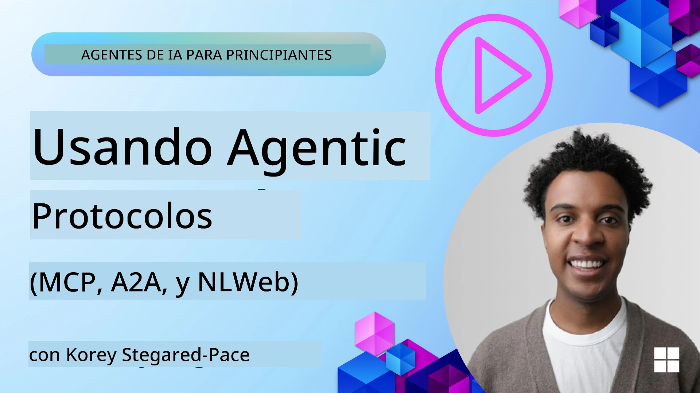
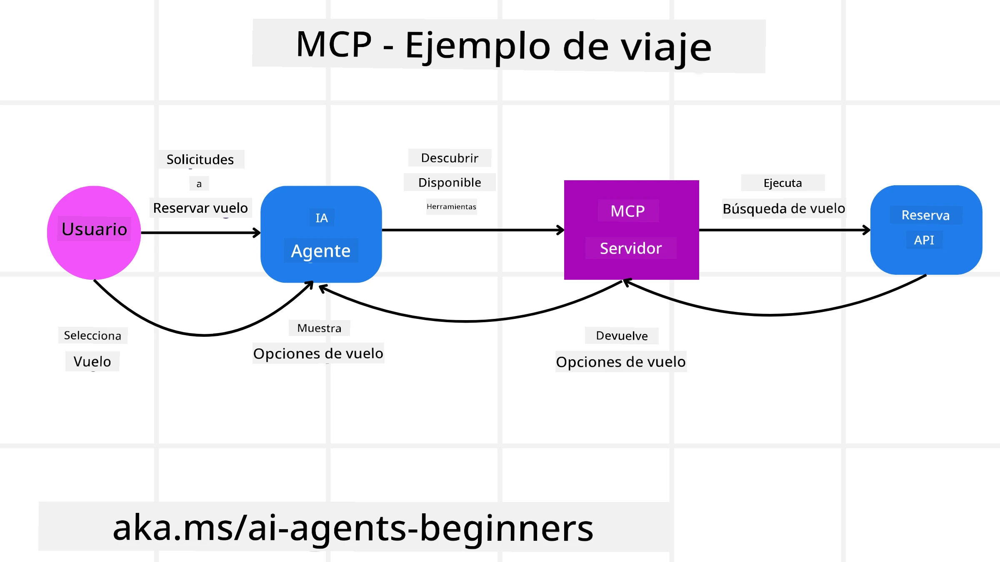
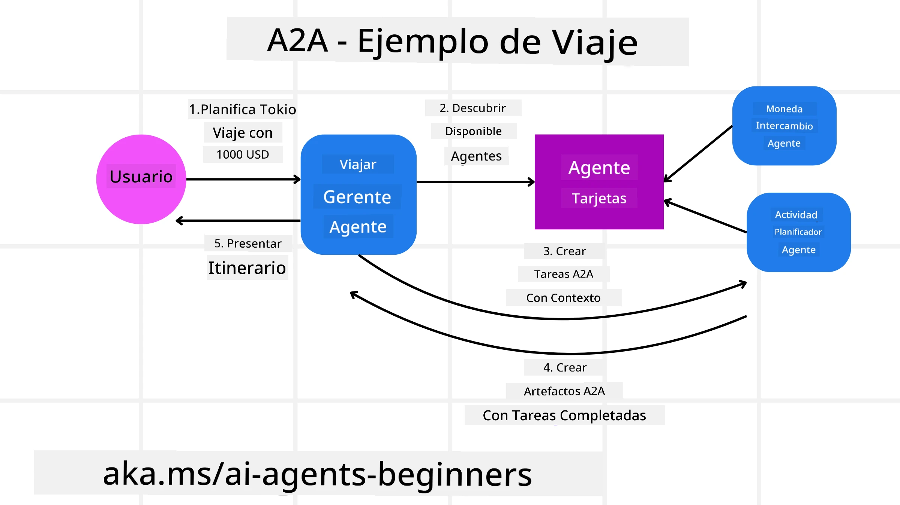
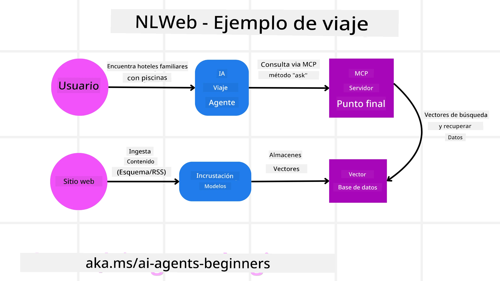

# Uso de Protocolos para Agentes (MCP, A2A y NLWeb)

> _(Haga clic en la imagen de arriba para ver el video de esta lección)_

A medida que crece el uso de agentes de IA, también aumenta la necesidad de protocolos que garanticen la estandarización, la seguridad y fomenten la innovación abierta. En esta lección, cubriremos 3 protocolos que buscan satisfacer esta necesidad: Model Context Protocol (MCP), Agent to Agent (A2A) y Natural Language Web (NLWeb).

## Introducción

En esta lección, cubriremos:

• Cómo **MCP** permite que los Agentes de IA accedan a herramientas y datos externos para completar tareas del usuario.

• Cómo **A2A** habilita la comunicación y colaboración entre diferentes agentes de IA.

• Cómo **NLWeb** lleva interfaces en lenguaje natural a cualquier sitio web, permitiendo que los agentes de IA descubran e interactúen con el contenido.

## Objetivos de aprendizaje

• **Identificar** el propósito central y los beneficios de MCP, A2A y NLWeb en el contexto de agentes de IA.

• **Explicar** cómo cada protocolo facilita la comunicación e interacción entre LLMs, herramientas y otros agentes.

• **Reconocer** los roles distintos que desempeña cada protocolo en la construcción de sistemas agenticos complejos.

## Model Context Protocol

El **Model Context Protocol (MCP)** es un estándar abierto que proporciona una forma estandarizada para que las aplicaciones ofrezcan contexto y herramientas a los LLMs. Esto posibilita un "adaptador universal" a diferentes fuentes de datos y herramientas a las que los Agentes de IA pueden conectarse de manera consistente.

Veamos los componentes de MCP, los beneficios en comparación con el uso directo de APIs y un ejemplo de cómo los agentes de IA podrían usar un servidor MCP.

### Componentes principales de MCP

MCP opera sobre una **arquitectura cliente-servidor** y los componentes principales son:

• **Hosts** son aplicaciones LLM (por ejemplo un editor de código como VSCode) que inician las conexiones a un Servidor MCP.

• **Clients** son componentes dentro de la aplicación host que mantienen conexiones uno-a-uno con los servidores.

• **Servers** son programas ligeros que exponen capacidades específicas.

Incluido en el protocolo hay tres primitivas principales que son las capacidades de un Servidor MCP:

• **Herramientas**: Son acciones o funciones discretas que un agente de IA puede invocar para realizar una acción. Por ejemplo, un servicio meteorológico podría exponer una herramienta "obtener clima", o un servidor de comercio electrónico podría exponer una herramienta "comprar producto". Los servidores MCP anuncian el nombre de cada herramienta, su descripción y el esquema de entrada/salida en su listado de capacidades.

• **Recursos**: Son elementos de datos o documentos de solo lectura que un servidor MCP puede proporcionar, y los clientes pueden recuperar bajo demanda. Ejemplos incluyen el contenido de archivos, registros de bases de datos o archivos de registro. Los recursos pueden ser texto (como código o JSON) o binarios (como imágenes o PDFs).

• **Prompts (Plantillas)**: Son plantillas predefinidas que ofrecen indicaciones sugeridas, permitiendo flujos de trabajo más complejos.

### Beneficios de MCP

MCP ofrece ventajas significativas para los Agentes de IA:

• **Descubrimiento dinámico de herramientas**: Los agentes pueden recibir dinámicamente una lista de herramientas disponibles de un servidor junto con descripciones de lo que hacen. Esto contrasta con las APIs tradicionales, que a menudo requieren codificación estática para integraciones, lo que significa que cualquier cambio en la API exige actualizaciones de código. MCP ofrece un enfoque de "integrar una vez", conduciendo a una mayor adaptabilidad.

• **Interoperabilidad entre LLMs**: MCP funciona con diferentes LLMs, proporcionando flexibilidad para cambiar modelos centrales y evaluar un mejor rendimiento.

• **Seguridad estandarizada**: MCP incluye un método estándar de autenticación, mejorando la escalabilidad al agregar acceso a servidores MCP adicionales. Esto es más simple que administrar diferentes claves y tipos de autenticación para varias APIs tradicionales.

### Ejemplo de MCP

Imagine que un usuario quiere reservar un vuelo usando un asistente de IA potenciado por MCP.

1. **Conexión**: El asistente de IA (el cliente MCP) se conecta a un servidor MCP proporcionado por una aerolínea.

2. **Descubrimiento de herramientas**: El cliente pregunta al servidor MCP de la aerolínea: "¿Qué herramientas tienen disponibles?" El servidor responde con herramientas como "buscar vuelos" y "reservar vuelos".

3. **Invocación de la herramienta**: Usted le pide al asistente de IA: "Por favor busca un vuelo de Portland a Honolulu." El asistente de IA, usando su LLM, identifica que necesita invocar la herramienta "buscar vuelos" y pasa los parámetros relevantes (origen, destino) al servidor MCP.

4. **Ejecución y respuesta**: El servidor MCP, actuando como un envoltorio, realiza la llamada real a la API interna de reservas de la aerolínea. Luego recibe la información de los vuelos (por ejemplo, datos JSON) y la envía de vuelta al asistente de IA.

5. **Interacción adicional**: El asistente de IA presenta las opciones de vuelo. Una vez que usted selecciona un vuelo, el asistente podría invocar la herramienta "reservar vuelo" en el mismo servidor MCP, completando la reserva.

## Protocolo Agente a Agente (A2A)

Mientras MCP se enfoca en conectar LLMs a herramientas, el **Protocolo Agente a Agente (A2A)** da un paso más al habilitar la comunicación y colaboración entre diferentes agentes de IA. A2A conecta agentes de IA a través de distintas organizaciones, entornos y pilas tecnológicas para completar una tarea compartida.

Examinaremos los componentes y beneficios de A2A, junto con un ejemplo de cómo podría aplicarse en nuestra aplicación de viajes.

### Componentes principales de A2A

A2A se centra en permitir la comunicación entre agentes y hacer que trabajen juntos para completar una subtarea del usuario. Cada componente del protocolo contribuye a esto:

#### Tarjeta del Agente

Similar a cómo un servidor MCP comparte una lista de herramientas, una Tarjeta del Agente tiene:
- El Nombre del Agente .
- Una **descripción de las tareas generales** que realiza.
- Una **lista de habilidades específicas** con descripciones para ayudar a otros agentes (o incluso a usuarios humanos) a entender cuándo y por qué querrían invocar a ese agente.
- La **URL de Endpoint actual** del agente
- La **versión** y las **capacidades** del agente, tales como respuestas por streaming y notificaciones push.

#### Ejecutor del Agente

El Ejecutor del Agente es responsable de **pasar el contexto del chat del usuario al agente remoto**; el agente remoto necesita esto para entender la tarea que debe completarse. En un servidor A2A, un agente usa su propio Large Language Model (LLM) para analizar las solicitudes entrantes y ejecutar tareas usando sus propias herramientas internas.

#### Artefacto

Una vez que un agente remoto ha completado la tarea solicitada, su producto de trabajo se crea como un artefacto. Un artefacto **contiene el resultado del trabajo del agente**, una **descripción de lo que se completó**, y el **contexto de texto** que se envía a través del protocolo. Después de enviar el artefacto, la conexión con el agente remoto se cierra hasta que se necesite de nuevo.

#### Cola de Eventos

Este componente se usa para **manejar actualizaciones y pasar mensajes**. Es particularmente importante en producción para sistemas agenticos, para evitar que la conexión entre agentes se cierre antes de que una tarea esté completada, especialmente cuando los tiempos de finalización de tareas pueden ser largos.

### Beneficios de A2A

• **Colaboración mejorada**: Permite que agentes de diferentes proveedores y plataformas interactúen, compartan contexto y trabajen juntos, facilitando la automatización sin fisuras a través de sistemas tradicionalmente desconectados.

• **Flexibilidad en la selección de modelos**: Cada agente A2A puede decidir qué LLM usa para atender sus solicitudes, lo que permite modelos optimizados o ajustados por agente, a diferencia de una única conexión LLM en algunos escenarios MCP.

• **Autenticación integrada**: La autenticación está integrada directamente en el protocolo A2A, proporcionando un marco de seguridad robusto para las interacciones entre agentes.

### Ejemplo de A2A

Expandamos nuestro escenario de reserva de viajes, pero esta vez usando A2A.

1. **Solicitud del usuario a Multi-Agente**: Un usuario interactúa con un agente/cliente A2A "Agente de Viajes", quizás diciendo: "Por favor reserva un viaje completo a Honolulu para la próxima semana, incluyendo vuelos, hotel y un coche de alquiler".

2. **Orquestación por el Agente de Viajes**: El Agente de Viajes recibe esta solicitud compleja. Usa su LLM para razonar sobre la tarea y determina que necesita interactuar con otros agentes especializados.

3. **Comunicación entre agentes**: El Agente de Viajes usa el protocolo A2A para conectarse con agentes descendentes, como un "Agente de Aerolínea", un "Agente de Hotel" y un "Agente de Alquiler de Coches" creados por diferentes empresas.

4. **Ejecución delegada de tareas**: El Agente de Viajes envía tareas específicas a estos agentes especializados (por ejemplo, "Buscar vuelos a Honolulu", "Reservar un hotel", "Alquilar un coche"). Cada uno de estos agentes especializados, ejecutando sus propios LLMs y utilizando sus propias herramientas (que podrían ser servidores MCP), realiza su parte específica de la reserva.

5. **Respuesta consolidada**: Una vez que todos los agentes descendentes completan sus tareas, el Agente de Viajes compila los resultados (detalles de vuelos, confirmación de hotel, reserva de coche) y envía una respuesta integral, en estilo chat, de vuelta al usuario.

## Natural Language Web (NLWeb)

Los sitios web han sido durante mucho tiempo la forma principal para que los usuarios accedan a información y datos en internet.

Veamos los diferentes componentes de NLWeb, los beneficios de NLWeb y un ejemplo de cómo funciona nuestro NLWeb observando nuestra aplicación de viajes.

### Componentes de NLWeb

- **Aplicación NLWeb (Código del servicio central)**: El sistema que procesa preguntas en lenguaje natural. Conecta las distintas partes de la plataforma para crear respuestas. Puede pensarse como el **motor que potencia las funciones de lenguaje natural** de un sitio web.

- **Protocolo NLWeb**: Es un **conjunto básico de reglas para la interacción en lenguaje natural** con un sitio web. Devuelve respuestas en formato JSON (a menudo usando Schema.org). Su propósito es crear una base simple para la "Web de IA", de la misma manera que HTML hizo posible compartir documentos en línea.

- **Servidor MCP (Endpoint del Model Context Protocol)**: Cada configuración de NLWeb también funciona como un **servidor MCP**. Esto significa que puede **compartir herramientas (como un método “ask”) y datos** con otros sistemas de IA. En la práctica, esto hace que el contenido y las capacidades del sitio web sean utilizables por agentes de IA, permitiendo que el sitio se convierta en parte del ecosistema más amplio de agentes.

- **Modelos de embeddings**: Estos modelos se usan para **convertir el contenido del sitio web en representaciones numéricas llamadas vectores** (embeddings). Estos vectores capturan el significado de una forma que las computadoras pueden comparar y buscar. Se almacenan en una base de datos especial, y los usuarios pueden elegir qué modelo de embeddings desean usar.

- **Base de datos vectorial (Mecanismo de recuperación)**: Esta base de datos **almacena los embeddings del contenido del sitio web**. Cuando alguien hace una pregunta, NLWeb consulta la base vectorial para encontrar rápidamente la información más relevante. Devuelve una lista rápida de posibles respuestas, ordenadas por similitud. NLWeb funciona con diferentes sistemas de almacenamiento vectorial como Qdrant, Snowflake, Milvus, Azure AI Search y Elasticsearch.

### NLWeb por ejemplo

Considere de nuevo nuestro sitio web de reservas de viajes, pero esta vez está potenciado por NLWeb.

1. **Ingesta de datos**: Los catálogos de productos existentes del sitio de viajes (por ejemplo, listados de vuelos, descripciones de hoteles, paquetes turísticos) se formatean usando Schema.org o se cargan mediante feeds RSS. Las herramientas de NLWeb ingieren estos datos estructurados, crean embeddings y los almacenan en una base de datos vectorial local o remota.

2. **Consulta en lenguaje natural (Humano)**: Un usuario visita el sitio web y, en lugar de navegar por menús, escribe en una interfaz de chat: "Encuéntrame un hotel familiar en Honolulu con piscina para la próxima semana".

3. **Procesamiento por NLWeb**: La aplicación NLWeb recibe esta consulta. Envía la consulta a un LLM para su comprensión y simultáneamente busca en su base de datos vectorial los listados de hotel relevantes.

4. **Resultados precisos**: El LLM ayuda a interpretar los resultados de búsqueda de la base de datos, identificar las mejores coincidencias basadas en criterios como "familiar", "piscina" y "Honolulu", y luego formatea una respuesta en lenguaje natural. De manera crucial, la respuesta se refiere a hoteles reales del catálogo del sitio web, evitando información inventada.

5. **Interacción con agentes de IA**: Dado que NLWeb funciona como un servidor MCP, un agente de viajes externo de IA también podría conectarse a la instancia NLWeb de este sitio web. El agente de IA podría entonces usar el método `ask` para consultar el sitio directamente: `ask("Are there any vegan-friendly restaurants in the Honolulu area recommended by the hotel?")`. La instancia NLWeb procesaría esto, aprovechando su base de datos de información sobre restaurantes (si está cargada), y devolvería una respuesta JSON estructurada.

### ¿Tiene más preguntas sobre MCP/A2A/NLWeb?

Únase al [Discord de Microsoft Foundry](https://aka.ms/ai-agents/discord) para reunirse con otros aprendices, asistir a horas de oficina y resolver sus preguntas sobre Agentes de IA.

## Recursos

- [MCP para principiantes](https://aka.ms/mcp-for-beginners)  
- [Documentación de MCP](https://learn.microsoft.com/python/api/overview/azure/ai-projects-readme)
- [Repositorio NLWeb](https://github.com/nlweb-ai/NLWeb)
- [Marco de Agentes de Microsoft](https://aka.ms/ai-agents-beginners/agent-framewrok)

---

<!-- CO-OP TRANSLATOR DISCLAIMER START -->
Descargo de responsabilidad:
Este documento ha sido traducido utilizando el servicio de traducción por IA Co-op Translator (https://github.com/Azure/co-op-translator). Aunque nos esforzamos por la exactitud, tenga en cuenta que las traducciones automáticas pueden contener errores o inexactitudes. El documento original en su idioma nativo debe considerarse la fuente autorizada. Para información crítica, se recomienda una traducción profesional realizada por traductores humanos. No nos hacemos responsables de ningún malentendido o interpretación errónea que surja del uso de esta traducción.
<!-- CO-OP TRANSLATOR DISCLAIMER END -->