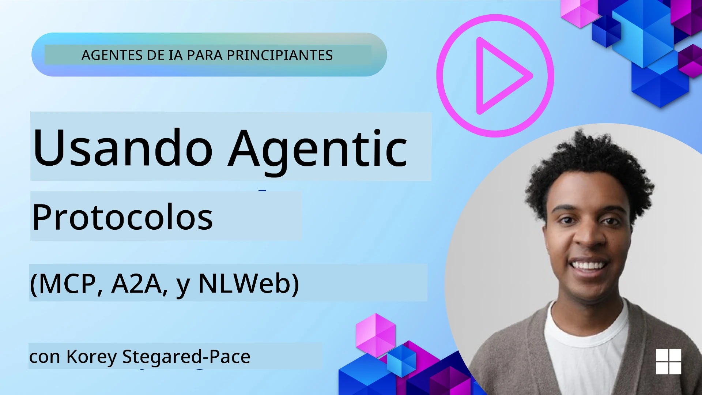
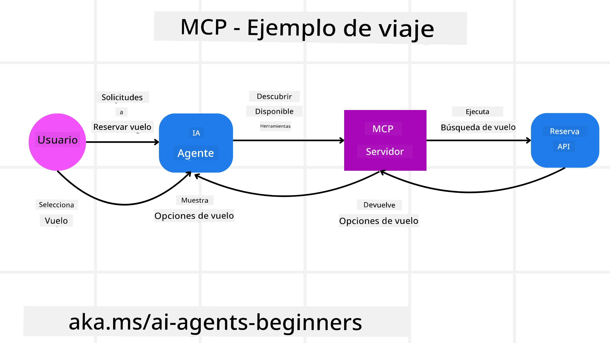
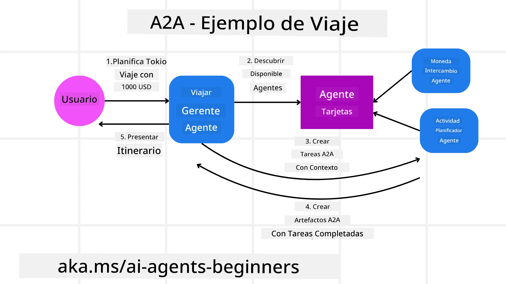
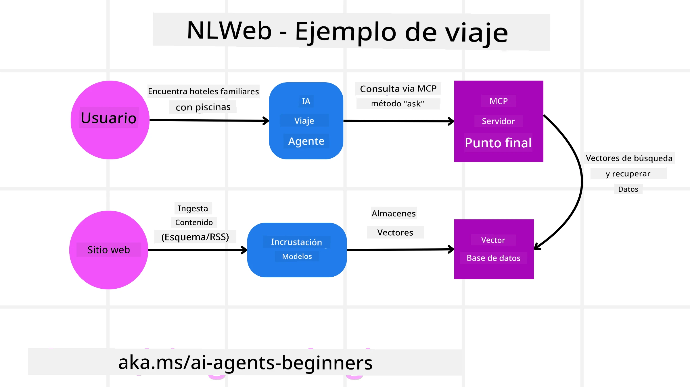

# Uso de Protocolos Agénticos (MCP, A2A y NLWeb)

> _(Haz clic en la imagen de arriba para ver el video de esta lección)_

A medida que crece el uso de agentes de IA, también crece la necesidad de protocolos que aseguren la estandarización, la seguridad y fomenten la innovación abierta. En esta lección, cubriremos 3 protocolos que buscan satisfacer esta necesidad: el Protocolo de Contexto de Modelo (MCP), Agente a Agente (A2A) y la Web de Lenguaje Natural (NLWeb).

## Introducción

En esta lección, cubriremos:

• Cómo **MCP** permite a los Agentes de IA acceder a herramientas y datos externos para completar tareas del usuario.

• Cómo **A2A** facilita la comunicación y colaboración entre diferentes agentes de IA.

• Cómo **NLWeb** lleva interfaces de lenguaje natural a cualquier sitio web, permitiendo que los Agentes de IA descubran e interactúen con el contenido.

## Objetivos de Aprendizaje

• **Identificar** el propósito principal y los beneficios de MCP, A2A y NLWeb en el contexto de los agentes de IA.

• **Explicar** cómo cada protocolo facilita la comunicación e interacción entre LLMs, herramientas y otros agentes.

• **Reconocer** los roles distintos que cada protocolo desempeña en la construcción de sistemas agénticos complejos.

## Protocolo de Contexto de Modelo

El **Protocolo de Contexto de Modelo (MCP)** es un estándar abierto que proporciona una manera estandarizada para que las aplicaciones suministren contexto y herramientas a los LLMs. Esto habilita un "adaptador universal" para diferentes fuentes de datos y herramientas a las que los Agentes de IA pueden conectarse de forma consistente.

Veamos los componentes de MCP, los beneficios comparados con el uso directo de API, y un ejemplo de cómo los agentes de IA pueden utilizar un servidor MCP.

### Componentes Básicos de MCP

MCP opera con una **arquitectura cliente-servidor** y los componentes básicos son:

• **Hosts** son aplicaciones LLM (por ejemplo, un editor de código como VSCode) que inician las conexiones a un servidor MCP.

• **Clientes** son componentes dentro de la aplicación host que mantienen conexiones uno a uno con los servidores.

• **Servidores** son programas ligeros que exponen capacidades específicas.

Incluido en el protocolo hay tres primitivas básicas que son las capacidades de un servidor MCP:

• **Herramientas**: Son acciones o funciones discretas que un agente de IA puede llamar para realizar una acción. Por ejemplo, un servicio meteorológico podría exponer una herramienta "obtener clima", o un servidor de comercio electrónico podría exponer una herramienta "comprar producto". Los servidores MCP anuncian el nombre, descripción y esquema de entrada/salida de cada herramienta en su listado de capacidades.

• **Recursos**: Son elementos de datos o documentos de solo lectura que un servidor MCP puede proporcionar, y los clientes pueden recuperarlos bajo demanda. Ejemplos incluyen contenido de archivos, registros de bases de datos o archivos de registro. Los recursos pueden ser texto (como código o JSON) o binarios (como imágenes o PDFs).

• **Prompts**: Son plantillas predefinidas que ofrecen solicitudes sugeridas, permitiendo flujos de trabajo más complejos.

### Beneficios de MCP

MCP ofrece ventajas significativas para los Agentes de IA:

• **Descubrimiento Dinámico de Herramientas**: Los agentes pueden recibir dinámicamente una lista de herramientas disponibles de un servidor junto con descripciones de lo que hacen. Esto contrasta con las API tradicionales, que a menudo requieren codificación estática para integraciones, lo que significa que cualquier cambio en la API necesita actualizaciones de código. MCP ofrece un enfoque de "integrar una vez", llevando a mayor adaptabilidad.

• **Interoperabilidad entre LLMs**: MCP funciona con diferentes LLMs, proporcionando flexibilidad para cambiar modelos centrales y evaluar mejor desempeño.

• **Seguridad Estandarizada**: MCP incluye un método estándar de autenticación, mejorando la escalabilidad al añadir acceso a servidores MCP adicionales. Esto es más simple que gestionar diferentes llaves y tipos de autenticación para varias APIs tradicionales.

### Ejemplo de MCP

Imagina que un usuario quiere reservar un vuelo utilizando un asistente de IA potenciado por MCP.

1. **Conexión**: El asistente de IA (el cliente MCP) se conecta a un servidor MCP proporcionado por una aerolínea.

2. **Descubrimiento de Herramientas**: El cliente pregunta al servidor MCP de la aerolínea, "¿Qué herramientas tienen disponibles?" El servidor responde con herramientas como "buscar vuelos" y "reservar vuelos".

3. **Invocación de Herramientas**: Luego, pides al asistente de IA, "Por favor busca un vuelo de Portland a Honolulu." El asistente de IA, usando su LLM, identifica que necesita llamar a la herramienta "buscar vuelos" y pasa los parámetros relevantes (origen, destino) al servidor MCP.

4. **Ejecución y Respuesta**: El servidor MCP, actuando como intermediario, hace la llamada real a la API interna de reservas de la aerolínea. Luego recibe la información del vuelo (por ejemplo, datos JSON) y la envía de regreso al asistente de IA.

5. **Interacción Adicional**: El asistente de IA presenta las opciones de vuelos. Una vez seleccionas un vuelo, el asistente podría invocar la herramienta "reservar vuelo" en el mismo servidor MCP, completando la reserva.

## Protocolo Agente a Agente (A2A)

Mientras MCP se enfoca en conectar LLMs con herramientas, el **protocolo Agente a Agente (A2A)** va un paso más allá permitiendo la comunicación y colaboración entre diferentes agentes de IA. A2A conecta agentes de IA de distintas organizaciones, entornos y pilas tecnológicas para completar una tarea compartida.

Examinaremos los componentes y beneficios de A2A, junto con un ejemplo de cómo podría aplicarse en nuestra aplicación de viajes.

### Componentes Básicos de A2A

A2A se centra en habilitar la comunicación entre agentes y que trabajen juntos para completar una subtarea del usuario. Cada componente del protocolo contribuye a esto:

#### Tarjeta de Agente

Similar a cómo un servidor MCP comparte una lista de herramientas, una Tarjeta de Agente tiene:
- El nombre del Agente.
- Una **descripción de las tareas generales** que completa.
- Una **lista de habilidades específicas** con descripciones para ayudar a otros agentes (o incluso usuarios humanos) a entender cuándo y por qué querrían llamar a ese agente.
- La **URL del punto de enlace actual** del agente.
- La **versión** y **capacidades** del agente, como respuestas en streaming y notificaciones push.

#### Ejecutor de Agente

El Ejecutor de Agente es responsable de **pasar el contexto del chat del usuario al agente remoto**, ya que este necesita comprender la tarea que debe completar. En un servidor A2A, un agente usa su propio Modelo de Lenguaje Extenso (LLM) para analizar solicitudes entrantes y ejecutar tareas usando sus propias herramientas internas.

#### Artefacto

Cuando un agente remoto ha completado la tarea solicitada, su producto de trabajo se crea como un artefacto. Un artefacto **contiene el resultado del trabajo del agente**, una **descripción de lo que se completó** y el **texto del contexto** que se envía a través del protocolo. Después de enviar el artefacto, la conexión con el agente remoto se cierra hasta que se necesite nuevamente.

#### Cola de Eventos

Este componente se usa para **manejar actualizaciones y pasar mensajes**. Es especialmente importante en producción para sistemas agénticos para evitar que la conexión entre agentes se cierre antes de que una tarea se complete, especialmente cuando las tareas pueden tomar más tiempo.

### Beneficios de A2A

• **Colaboración Mejorada**: Permite a agentes de diferentes proveedores y plataformas interactuar, compartir contexto y colaborar, facilitando automatización fluida entre sistemas tradicionalmente desconectados.

• **Flexibilidad en la Selección de Modelos**: Cada agente A2A puede decidir qué LLM usar para atender sus solicitudes, permitiendo modelos optimizados o ajustados por agente, a diferencia de la conexión única de LLM en algunos escenarios MCP.

• **Autenticación Integrada**: La autenticación está integrada directamente en el protocolo A2A, proporcionando un marco de seguridad robusto para las interacciones entre agentes.

### Ejemplo de A2A

Ampliemos nuestro escenario de reserva de viajes, pero esta vez usando A2A.

1. **Solicitud del Usuario a Multi-Agente**: Un usuario interactúa con un cliente/agente A2A "Agente de Viajes", tal vez diciendo, "Por favor, reserva un viaje completo a Honolulu para la próxima semana, incluyendo vuelos, hotel y alquiler de coche".

2. **Orquestación por el Agente de Viajes**: El Agente de Viajes recibe esta solicitud compleja. Usa su LLM para razonar sobre la tarea y determinar que debe interactuar con otros agentes especializados.

3. **Comunicación entre Agentes**: El Agente de Viajes entonces usa el protocolo A2A para conectar con agentes subordinados, como un "Agente de Aerolínea", un "Agente de Hotel" y un "Agente de Alquiler de Coches" creados por diferentes compañías.

4. **Ejecución Delegada de Tareas**: El Agente de Viajes envía tareas específicas a estos agentes especializados (ej., "Encuentra vuelos a Honolulu," "Reserva un hotel," "Alquila un coche"). Cada uno de estos agentes especializados, ejecutando sus propios LLMs y utilizando sus propias herramientas (que podrían ser servidores MCP), realiza su parte específica de la reserva.

5. **Respuesta Consolidada**: Una vez que todos los agentes subordinados completan sus tareas, el Agente de Viajes compila los resultados (detalles de vuelo, confirmación de hotel, reserva de coche) y envía una respuesta completa, estilo chat, al usuario.

## Web de Lenguaje Natural (NLWeb)

Los sitios web han sido durante mucho tiempo la forma principal para que los usuarios accedan a información y datos en internet.

Veamos los diferentes componentes de NLWeb, los beneficios de NLWeb y un ejemplo de cómo funciona NLWeb mirando nuestra aplicación de viajes.

### Componentes de NLWeb

- **Aplicación NLWeb (Código de Servicio Central)**: El sistema que procesa preguntas en lenguaje natural. Conecta las diferentes partes de la plataforma para crear respuestas. Se puede pensar en ello como el **motor que potencia las funciones de lenguaje natural** de un sitio web.

- **Protocolo NLWeb**: Es un **conjunto básico de reglas para la interacción en lenguaje natural** con un sitio web. Envía respuestas en formato JSON (a menudo usando Schema.org). Su propósito es crear un fundamento simple para la “Web AI”, de la misma manera que HTML hizo posible compartir documentos online.

- **Servidor MCP (Punto de Enlace del Protocolo de Contexto de Modelo)**: Cada configuración de NLWeb también funciona como un **servidor MCP**. Esto significa que puede **compartir herramientas (como un método "ask") y datos** con otros sistemas de IA. En la práctica, esto hace que el contenido y habilidades del sitio sean utilizables por agentes de IA, permitiendo que el sitio se convierta en parte del “ecosistema agéntico” más amplio.

- **Modelos de Embeddings**: Estos modelos se usan para **convertir el contenido del sitio web en representaciones numéricas llamadas vectores** (embeddings). Estos vectores capturan el significado de una manera que las computadoras pueden comparar y buscar. Se almacenan en una base de datos especial, y los usuarios pueden elegir qué modelo de embeddings quieren usar.

- **Base de Datos Vectorial (Mecanismo de Recuperación)**: Esta base almacena los embeddings del contenido del sitio web. Cuando alguien hace una pregunta, NLWeb consulta la base vectorial para encontrar rápidamente la información más relevante. Proporciona una lista rápida de posibles respuestas, clasificadas por similitud. NLWeb funciona con diferentes sistemas de almacenamiento vectorial como Qdrant, Snowflake, Milvus, Azure AI Search y Elasticsearch.

### NLWeb con un Ejemplo

Consideremos nuestro sitio web de reservas de viajes otra vez, pero esta vez, está potenciado por NLWeb.

1. **Ingesta de Datos**: Los catálogos de productos existentes del sitio web de viajes (por ejemplo, listados de vuelos, descripciones de hoteles, paquetes turísticos) se formatean usando Schema.org o se cargan vía feeds RSS. Las herramientas de NLWeb ingieren estos datos estructurados, crean embeddings y los almacenan en una base vectorial local o remota.

2. **Consulta en Lenguaje Natural (Humano)**: Un usuario visita el sitio web y, en lugar de navegar menús, escribe en una interfaz de chat: "Encuéntrame un hotel familiar en Honolulu con piscina para la próxima semana".

3. **Procesamiento NLWeb**: La aplicación NLWeb recibe esta consulta. La envía a un LLM para comprensión y simultáneamente busca en su base vectorial listados de hoteles relevantes.

4. **Resultados Precisos**: El LLM ayuda a interpretar los resultados de búsqueda de la base, identifica las mejores coincidencias basadas en los criterios "familiar," "piscina," y "Honolulu," y luego formatea una respuesta en lenguaje natural. Es crucial que la respuesta se refiera a hoteles reales del catálogo del sitio, evitando información inventada.

5. **Interacción del Agente de IA**: Como NLWeb funciona como un servidor MCP, un agente de viajes externo de IA podría también conectarse a esta instancia NLWeb del sitio. El agente de IA podría usar el método `ask` MCP para consultar el sitio directamente: `ask("¿Hay restaurantes veganos recomendados por el hotel en la zona de Honolulu?")`. La instancia NLWeb procesaría esto, aprovechando su base de datos de información sobre restaurantes (si está cargada) y devolvería una respuesta estructurada en JSON.

### ¿Tienes más preguntas sobre MCP/A2A/NLWeb?

Únete al [Microsoft Foundry Discord](https://discord.com/invite/ATgtXmAS5D) para encontrarte con otros aprendices, asistir a horas de oficina y obtener respuestas a tus preguntas sobre Agentes de IA.

## Recursos

- [MCP para Principiantes](https://aka.ms/mcp-for-beginners)  
- [Documentación de MCP](https://learn.microsoft.com/python/api/overview/azure/ai-projects-readme)
- [Repositorio NLWeb](https://github.com/nlweb-ai/NLWeb)
- [Framework de Agentes de Microsoft](https://learn.microsoft.com/en-us/agent-framework/overview/?wt.mc_id=youtube_26688_organicsocial_reactor&pivots=programming-language-python)

## Lección Anterior

[Agentes de IA en Producción](../10-ai-agents-production/README.md)

## Próxima Lección

[Ingeniería de Contexto para Agentes de IA](../12-context-engineering/README.md)

---

<!-- CO-OP TRANSLATOR DISCLAIMER START -->
**Descargo de responsabilidad**:
Este documento ha sido traducido utilizando el servicio de traducción automática [Co-op Translator](https://github.com/Azure/co-op-translator). Aunque nos esforzamos por la precisión, tenga en cuenta que las traducciones automatizadas pueden contener errores o inexactitudes. El documento original en su idioma nativo debe considerarse la fuente autorizada. Para información crítica, se recomienda una traducción profesional humana. No somos responsables de cualquier malentendido o interpretación errónea que surja del uso de esta traducción.
<!-- CO-OP TRANSLATOR DISCLAIMER END -->