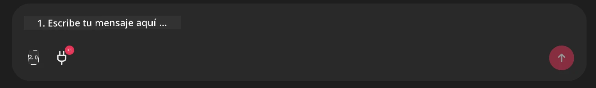

# Ejemplo del servidor MCP de Github

## Descripción

Esta fue una demostración creada para el AI Agents Hackathon organizada por Microsoft Reactor.

La herramienta se utiliza para recomendar proyectos para hackathons basados en los repositorios de Github de un usuario.
Esto se hace mediante:

1. **Github Agent** - Usando el Github MCP Server para recuperar repos y información sobre esos repos.
2. **Hackathon Agent** - Toma los datos del Github Agent y propone ideas creativas de proyectos para hackathons basadas en los proyectos, los lenguajes usados por el usuario y las categorías del AI Agents hackathon.
3. **Events Agent** - Basado en la sugerencia del hackathon agent, el events agent recomendará eventos relevantes de la serie AI Agent Hackathon.

## Ejecutar el código 

### Variables de entorno

Esta demostración usa Microsoft Agent Framework, Azure OpenAI Service, el Github MCP Server y Azure AI Search.

Asegúrate de tener las variables de entorno adecuadas configuradas para usar estas herramientas:

```python
AZURE_AI_PROJECT_ENDPOINT=""
AZURE_AI_MODEL_DEPLOYMENT_NAME=""
AZURE_SEARCH_SERVICE_ENDPOINT=""
AZURE_SEARCH_API_KEY=""
``` 

## Ejecutar el servidor Chainlit

Para conectarse al servidor MCP, esta demostración usa Chainlit como interfaz de chat. 

Para ejecutar el servidor, usa el siguiente comando en tu terminal:

```bash
chainlit run app.py -w
```

Esto debería iniciar tu servidor Chainlit en `localhost:8000` así como poblar tu índice de Azure AI Search con el contenido de `event-descriptions.md`. 

## Conectarse al MCP Server

Para conectarte al Github MCP Server, selecciona el icono de "plug" debajo del cuadro de chat "Type your message here..":



Desde allí puedes hacer clic en "Connect an MCP" para agregar el comando para conectar al Github MCP Server:

```bash
npx -y @modelcontextprotocol/server-github --env GITHUB_PERSONAL_ACCESS_TOKEN=[YOUR PERSONAL ACCESS TOKEN]
```

Reemplaza "[YOUR PERSONAL ACCESS TOKEN]" con tu Personal Access Token real. 

Después de conectarte, deberías ver un (1) junto al icono del plug para confirmar que está conectado. Si no, intenta reiniciar el servidor chainlit con `chainlit run app.py -w`.

## Uso de la demostración 

Para iniciar el flujo de trabajo del agente para recomendar proyectos de hackathon, puedes escribir un mensaje como: 

"Recommend hackathon projects for the Github user koreyspace"

El Router Agent analizará tu solicitud y determinará qué combinación de agentes (GitHub, Hackathon y Events) es la más adecuada para manejar tu consulta. Los agentes trabajan juntos para proporcionar recomendaciones completas basadas en el análisis de repositorios de GitHub, la ideación de proyectos y eventos tecnológicos relevantes.

---

<!-- CO-OP TRANSLATOR DISCLAIMER START -->
Descargo de responsabilidad:
Este documento ha sido traducido utilizando el servicio de traducción automática con IA [Co-op Translator](https://github.com/Azure/co-op-translator). Aunque nos esforzamos por garantizar la exactitud, tenga en cuenta que las traducciones automatizadas pueden contener errores o inexactitudes. La versión original del documento en su idioma nativo debe considerarse la fuente autorizada. Para información crítica, se recomienda una traducción profesional realizada por traductores humanos. No nos hacemos responsables de ningún malentendido o interpretación errónea que pueda surgir del uso de esta traducción.
<!-- CO-OP TRANSLATOR DISCLAIMER END -->