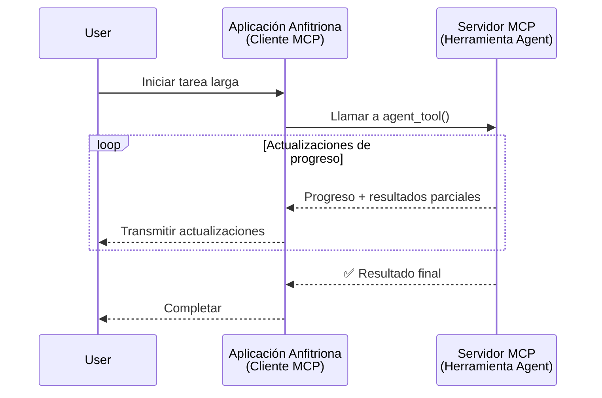
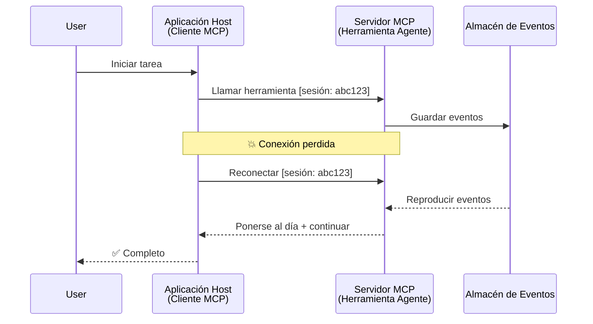
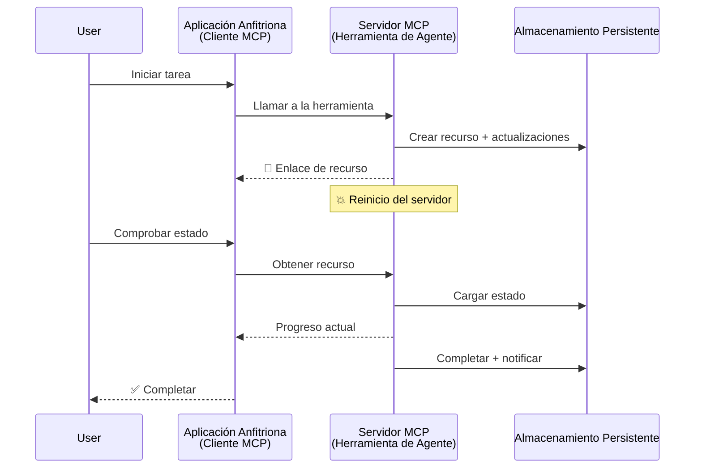
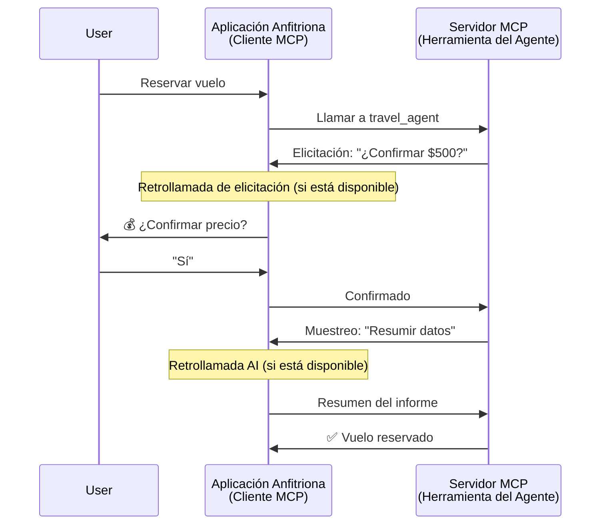
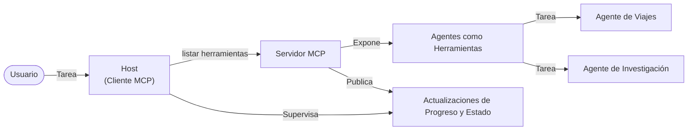

# Construyendo Sistemas de Comunicación Agente a Agente con MCP

> TL;DR - ¿Puedes construir comunicación Agent2Agent en MCP? ¡Sí!

MCP ha evolucionado significativamente más allá de su objetivo original de "proporcionar contexto a los LLM". Con mejoras recientes que incluyen [streams reanudables](https://modelcontextprotocol.io/docs/concepts/transports#resumability-and-redelivery), [elicitación](https://modelcontextprotocol.io/specification/2025-06-18/client/elicitation), [muestreo](https://modelcontextprotocol.io/specification/2025-06-18/client/sampling), y notificaciones ([progreso](https://modelcontextprotocol.io/specification/2025-06-18/basic/utilities/progress) y [recursos](https://modelcontextprotocol.io/specification/2025-06-18/schema#resourceupdatednotification)), MCP ahora proporciona una base sólida para construir sistemas complejos de comunicación agente a agente.

## La Idea Errónea sobre Agente/Herramienta

A medida que más desarrolladores exploran herramientas con comportamientos agenticos (ejecutarse durante largos períodos, puede requerir entrada adicional durante la ejecución, etc.), una idea errónea común es que MCP no es adecuado principalmente porque los ejemplos tempranos de sus herramientas primitivas se centraban en patrones simples de solicitud-respuesta.

Esta percepción está desactualizada. La especificación de MCP ha sido significativamente mejorada en los últimos meses con capacidades que cierran la brecha para construir comportamientos agenticos de larga duración:

- **Streaming y Resultados Parciales**: Actualizaciones en tiempo real del progreso durante la ejecución
- **Reanudabilidad**: Los clientes pueden reconectarse y continuar después de una desconexión
- **Durabilidad**: Los resultados sobreviven a reinicios del servidor (p. ej., a través de enlaces de recursos)
- **Interacciones Multi-turno**: Entrada interactiva durante la ejecución mediante elicitación y muestreo

Estas características pueden combinarse para habilitar aplicaciones agenticas y multi-agente complejas, todas desplegadas sobre el protocolo MCP.

Como referencia, nos referiremos a un agente como una "herramienta" que está disponible en un servidor MCP. Esto implica la existencia de una aplicación anfitriona que implementa un cliente MCP que establece una sesión con el servidor MCP y puede llamar al agente.

## ¿Qué Hace que una Herramienta MCP sea "Agentica"?

Antes de profundizar en la implementación, establezcamos qué capacidades de infraestructura se necesitan para soportar agentes de larga duración.

> Definiremos un agente como una entidad que puede operar autónomamente durante períodos extendidos, capaz de manejar tareas complejas que pueden requerir múltiples interacciones o ajustes basados en retroalimentación en tiempo real.

### 1. Streaming y Resultados Parciales

Los patrones tradicionales de solicitud-respuesta no funcionan para tareas de larga duración. Los agentes necesitan proporcionar:

- Actualizaciones de progreso en tiempo real
- Resultados intermedios

**Soporte MCP**: Las notificaciones de actualización de recursos permiten transmitir resultados parciales en streaming, aunque esto requiere un diseño cuidadoso para evitar conflictos con el modelo 1:1 de solicitud/respuesta de JSON-RPC.

| Característica              | Caso de Uso                                                                                                                                                                    | Soporte MCP                                                                              |
| -------------------------- | ----------------------------------------------------------------------------------------------------------------------------------------------------------------------------- | ---------------------------------------------------------------------------------------- |
| Actualizaciones en Tiempo Real | El usuario solicita una tarea de migración de código. El agente transmite el progreso: "10 % - Analizando dependencias... 25 % - Convirtiendo archivos TypeScript... 50 % - Actualizando importaciones..." | ✅ Notificaciones de progreso                                                            |
| Resultados Parciales        | Tarea "Generar un libro" transmite resultados parciales, p. ej., 1) Esquema del arco narrativo, 2) Lista de capítulos, 3) Cada capítulo a medida que se completa. El anfitrión puede inspeccionar, cancelar o redirigir en cualquier etapa. | ✅ Las notificaciones pueden "extenderse" para incluir resultados parciales, ver propuestas en PR 383, 776 |

<div align="center" style="font-style: italic; font-size: 0.95em; margin-bottom: 0.5em;">
<strong>Figura 1:</strong> Este diagrama ilustra cómo un agente MCP transmite actualizaciones de progreso en tiempo real y resultados parciales a la aplicación anfitriona durante una tarea de larga duración, permitiendo al usuario monitorizar la ejecución en tiempo real.
</div>



### 2. Reanudabilidad

Los agentes deben manejar interrupciones de red de forma elegante:

- Reconectarse tras desconexión (cliente)
- Continuar desde donde quedaron (reenvío de mensajes)

**Soporte MCP**: El transporte StreamableHTTP de MCP actualmente soporta reanudación de sesiones y reenvío de mensajes con IDs de sesión y última ID de evento. La nota importante aquí es que el servidor debe implementar un EventStore que permita la reproducción de eventos cuando el cliente se reconecta.  
Tome en cuenta que existe una propuesta comunitaria (PR #975) que explora streams reanudables independientes del transporte.

| Característica | Caso de Uso                                                                                                                                                | Soporte MCP                                                              |
| ------------- | --------------------------------------------------------------------------------------------------------------------------------------------------------- | ------------------------------------------------------------------------ |
| Reanudabilidad | El cliente se desconecta durante una tarea de larga duración. Al reconectarse, la sesión se reanuda con eventos perdidos reproducidos, continuando sin interrupciones donde se quedó. | ✅ Transporte StreamableHTTP con IDs de sesión, reproducción de eventos y EventStore |

<div align="center" style="font-style: italic; font-size: 0.95em; margin-bottom: 0.5em;">
<strong>Figura 2:</strong> Este diagrama muestra cómo el transporte StreamableHTTP de MCP y el almacén de eventos permiten reanudación de sesiones sin interrupciones: si el cliente se desconecta, puede reconectarse y reproducir eventos perdidos, continuando la tarea sin pérdida de progreso.
</div>



### 3. Durabilidad

Los agentes de larga duración necesitan estado persistente:

- Los resultados sobreviven a reinicios del servidor
- El estado puede recuperarse fuera de banda
- Seguimiento de progreso a través de sesiones

**Soporte MCP**: MCP ahora soporta un tipo de retorno de enlace de recurso para llamadas a herramientas. Hoy en día, un patrón posible es diseñar una herramienta que crea un recurso y devuelve inmediatamente un enlace de recurso. La herramienta puede continuar abordando la tarea en segundo plano y actualizar el recurso. A su vez, el cliente puede optar por hacer polling del estado de este recurso para obtener resultados parciales o completos (basados en qué actualizaciones de recurso provee el servidor) o suscribirse al recurso para recibir notificaciones de actualización.

Una limitación aquí es que hacer polling de recursos o suscribirse a actualizaciones puede consumir recursos con implicaciones a escala. Existe una propuesta comunitaria abierta (incluyendo #992) que explora la posibilidad de incluir webhooks o disparadores que el servidor pueda llamar para notificar al cliente/aplicación anfitriona sobre actualizaciones.

| Característica | Caso de Uso                                                                                                                                          | Soporte MCP                                                     |
| ------------- | --------------------------------------------------------------------------------------------------------------------------------------------------- | --------------------------------------------------------------- |
| Durabilidad   | El servidor falla durante una tarea de migración de datos. Los resultados y progreso sobreviven al reinicio, el cliente puede chequear estado y continuar desde recurso persistente. | ✅ Enlaces de recursos con almacenamiento persistente y notificaciones de estado |

Hoy en día, un patrón común es diseñar una herramienta que crea un recurso y devuelve inmediatamente un enlace de recurso. La herramienta puede en segundo plano abordar la tarea, emitir notificaciones de recurso que sirven como actualizaciones de progreso o incluyen resultados parciales, y actualizar el contenido del recurso según sea necesario.

<div align="center" style="font-style: italic; font-size: 0.95em; margin-bottom: 0.5em;">
<strong>Figura 3:</strong> Este diagrama demuestra cómo los agentes MCP usan recursos persistentes y notificaciones de estado para asegurar que las tareas de larga duración sobrevivan a reinicios de servidor, permitiendo a los clientes verificar el progreso y obtener resultados incluso después de fallos.
</div>



### 4. Interacciones Multi-Turno

Los agentes a menudo necesitan entrada adicional durante la ejecución:

- Clarificación o aprobación humana
- Asistencia AI para decisiones complejas
- Ajuste dinámico de parámetros

**Soporte MCP**: Totalmente soportado a través de muestreo (para entrada AI) y elicitación (para entrada humana).

| Característica              | Caso de Uso                                                                                                                                        | Soporte MCP                                        |
| -------------------------- | ------------------------------------------------------------------------------------------------------------------------------------------------- | -------------------------------------------------- |
| Interacciones Multi-Turno  | El agente de reserva de viajes solicita confirmación de precio al usuario, luego pide al AI resumir datos de viaje antes de completar la reserva. | ✅ Elicitación para entrada humana, muestreo para entrada AI |

<div align="center" style="font-style: italic; font-size: 0.95em; margin-bottom: 0.5em;">
<strong>Figura 4:</strong> Este diagrama muestra cómo los agentes MCP pueden solicitar interactivamente entrada humana o pedir asistencia AI durante la ejecución, soportando flujos de trabajo complejos y multi-turno como confirmaciones y toma dinámica de decisiones.
</div>



## Implementando Agentes de Larga Duración en MCP - Visión General del Código

Como parte de este artículo, proporcionamos un [repositorio de código](https://github.com/victordibia/ai-tutorials/tree/main/MCP%20Agents) que contiene una implementación completa de agentes de larga duración usando el SDK Python de MCP con transporte StreamableHTTP para reanudación de sesiones y reenvío de mensajes. La implementación demuestra cómo las capacidades MCP pueden combinarse para habilitar comportamientos sofisticados similares a agentes.

Específicamente, implementamos un servidor con dos herramientas agentes principales:

- **Agente de Viajes** - Simula un servicio de reserva de viajes con confirmación de precio vía elicitación
- **Agente de Investigación** - Realiza tareas de investigación con resúmenes asistidos por AI vía muestreo

Ambos agentes demuestran actualizaciones de progreso en tiempo real, confirmaciones interactivas, y capacidades completas de reanudación de sesiones.

### Conceptos Clave de la Implementación

Las siguientes secciones muestran la implementación del agente en el lado servidor y la gestión del anfitrión en el lado cliente para cada capacidad:

#### Streaming y Actualizaciones de Progreso - Estado de Tareas en Tiempo Real

El streaming permite a los agentes proporcionar actualizaciones en tiempo real del progreso durante tareas de larga duración, manteniendo a los usuarios informados sobre el estado de la tarea y resultados intermedios.

**Implementación del Servidor (el agente envía notificaciones de progreso):**

```python
# Desde server/server.py - Agente de viajes enviando actualizaciones de progreso
for i, step in enumerate(steps):
    await ctx.session.send_progress_notification(
        progress_token=ctx.request_id,
        progress=i * 25,
        total=100,
        message=step,
        related_request_id=str(ctx.request_id)
    )
    await anyio.sleep(2)  # Simular trabajo

# Alternativa: Registrar mensajes para actualizaciones detalladas paso a paso
await ctx.session.send_log_message(
    level="info",
    data=f"Processing step {current_step}/{steps} ({progress_percent}%)",
    logger="long_running_agent",
    related_request_id=ctx.request_id,
)
```

**Implementación del Cliente (el anfitrión recibe actualizaciones de progreso):**

```python
# Desde client/client.py - Cliente que maneja notificaciones en tiempo real
async def message_handler(message) -> None:
    if isinstance(message, types.ServerNotification):
        if isinstance(message.root, types.LoggingMessageNotification):
            console.print(f"📡 [dim]{message.root.params.data}[/dim]")
        elif isinstance(message.root, types.ProgressNotification):
            progress = message.root.params
            console.print(f"🔄 [yellow]{progress.message} ({progress.progress}/{progress.total})[/yellow]")

# Registrar el manejador de mensajes al crear la sesión
async with ClientSession(
    read_stream, write_stream,
    message_handler=message_handler
) as session:
```

#### Elicitación - Solicitar Entrada del Usuario

La elicitación permite a los agentes solicitar entrada del usuario durante la ejecución. Esto es esencial para confirmaciones, clarificaciones o aprobaciones durante tareas de larga duración.

**Implementación del Servidor (el agente solicita confirmación):**

```python
# Desde server/server.py - Agencia de viajes solicitando confirmación de precio
elicit_result = await ctx.session.elicit(
    message=f"Please confirm the estimated price of $1200 for your trip to {destination}",
    requestedSchema=PriceConfirmationSchema.model_json_schema(),
    related_request_id=ctx.request_id,
)

if elicit_result and elicit_result.action == "accept":
    # Continuar con la reserva
    logger.info(f"User confirmed price: {elicit_result.content}")
elif elicit_result and elicit_result.action == "decline":
    # Cancelar la reserva
    booking_cancelled = True
```

**Implementación del Cliente (el anfitrión provee la devolución de llamada para la elicitación):**

```python
# Desde client/client.py - Manejo de solicitudes de elicitación por parte del cliente
async def elicitation_callback(context, params):
    console.print(f"💬 Server is asking for confirmation:")
    console.print(f"   {params.message}")

    response = console.input("Do you accept? (y/n): ").strip().lower()

    if response in ['y', 'yes']:
        return types.ElicitResult(
            action="accept",
            content={"confirm": True, "notes": "Confirmed by user"}
        )
    else:
        return types.ElicitResult(
            action="decline",
            content={"confirm": False, "notes": "Declined by user"}
        )

# Registrar la devolución de llamada al crear la sesión
async with ClientSession(
    read_stream, write_stream,
    elicitation_callback=elicitation_callback
) as session:
```

#### Muestreo - Solicitar Asistencia AI

El muestreo permite a los agentes solicitar asistencia de modelos de lenguaje para decisiones complejas o generación de contenido durante la ejecución. Esto habilita flujos de trabajo híbridos humano-AI.

**Implementación del Servidor (el agente solicita asistencia AI):**

```python
# Desde server/server.py - Agente de investigación solicitando resumen de IA
sampling_result = await ctx.session.create_message(
    messages=[
        SamplingMessage(
            role="user",
            content=TextContent(type="text", text=f"Please summarize the key findings for research on: {topic}")
        )
    ],
    max_tokens=100,
    related_request_id=ctx.request_id,
)

if sampling_result and sampling_result.content:
    if sampling_result.content.type == "text":
        sampling_summary = sampling_result.content.text
        logger.info(f"Received sampling summary: {sampling_summary}")
```

**Implementación del Cliente (el anfitrión provee la devolución de llamada para muestreo):**

```python
# Desde client/client.py - Manejo del cliente para solicitudes de muestreo
async def sampling_callback(context, params):
    message_text = params.messages[0].content.text if params.messages else 'No message'
    console.print(f"🧠 Server requested sampling: {message_text}")

    # En una aplicación real, esto podría llamar a una API de LLM
    # Para fines de demostración, proporcionamos una respuesta simulada
    mock_response = "Based on current research, MCP has evolved significantly..."

    return types.CreateMessageResult(
        role="assistant",
        content=types.TextContent(type="text", text=mock_response),
        model="interactive-client",
        stopReason="endTurn"
    )

# Registrar la devolución de llamada al crear la sesión
async with ClientSession(
    read_stream, write_stream,
    sampling_callback=sampling_callback,
    elicitation_callback=elicitation_callback
) as session:
```

#### Reanudabilidad - Continuidad de Sesión a través de Desconexiones

La reanudabilidad asegura que las tareas de agentes de larga duración puedan sobrevivir a desconexiones del cliente y continuar sin problemas al reconectarse. Esto se implementa mediante tiendas de eventos y tokens de reanudación.

**Implementación del Event Store (el servidor mantiene el estado de la sesión):**

```python
# Desde server/event_store.py - Almacén de eventos simple en memoria
class SimpleEventStore(EventStore):
    def __init__(self):
        self._events: list[tuple[StreamId, EventId, JSONRPCMessage]] = []
        self._event_id_counter = 0

    async def store_event(self, stream_id: StreamId, message: JSONRPCMessage) -> EventId:
        """Store an event and return its ID."""
        self._event_id_counter += 1
        event_id = str(self._event_id_counter)
        self._events.append((stream_id, event_id, message))
        return event_id

    async def replay_events_after(self, last_event_id: EventId, send_callback: EventCallback) -> StreamId | None:
        """Replay events after the specified ID for resumption."""
        start_index = None
        stream_id = None
        for index, (event_stream_id, event_id, _) in enumerate(self._events):
            if event_id == last_event_id:
                start_index = index + 1
                stream_id = event_stream_id
                break

        if start_index is None:
            return None

        # Reproducir solo eventos posteriores del flujo original de la sesión.
        for event_stream_id, event_id, message in self._events[start_index:]:
            if event_stream_id != stream_id:
                continue
            await send_callback(EventMessage(message, event_id))

        return stream_id

# Desde server/server.py - Pasando el almacén de eventos al gestor de sesiones
def create_server_app(event_store: Optional[EventStore] = None) -> Starlette:
    server = ResumableServer()

    # Crear gestor de sesiones con almacén de eventos para la reanudación
    session_manager = StreamableHTTPSessionManager(
        app=server,
        event_store=event_store,  # El almacén de eventos permite la reanudación de la sesión
        json_response=False,
        security_settings=security_settings,
    )

    return Starlette(routes=[Mount("/mcp", app=session_manager.handle_request)])

# Uso: Inicializar con almacén de eventos
event_store = SimpleEventStore()
app = create_server_app(event_store)
```

**Metadata del Cliente con Token de Reanudación (el cliente se reconecta usando estado almacenado):**

```python
# Desde client/client.py - Reanudación del cliente con metadatos
if existing_tokens and existing_tokens.get("resumption_token"):
    # Usar el token de reanudación existente para continuar donde lo dejamos
    metadata = ClientMessageMetadata(
        resumption_token=existing_tokens["resumption_token"],
    )
else:
    # Crear una función de devolución de llamada para guardar el token de reanudación cuando se reciba
    def enhanced_callback(token: str):
        protocol_version = getattr(session, 'protocol_version', None)
        token_manager.save_tokens(session_id, token, protocol_version, command, args)

    metadata = ClientMessageMetadata(
        on_resumption_token_update=enhanced_callback,
    )

# Enviar solicitud con metadatos de reanudación
result = await session.send_request(
    types.ClientRequest(
        types.CallToolRequest(
            method="tools/call",
            params=types.CallToolRequestParams(name=command, arguments=args)
        )
    ),
    types.CallToolResult,
    metadata=metadata,
)
```

La aplicación anfitriona mantiene localmente IDs de sesión y tokens de reanudación, permitiendo reconectar a sesiones existentes sin perder progreso o estado.

### Organización del Código

<div align="center" style="font-style: italic; font-size: 0.95em; margin-bottom: 0.5em;">
<strong>Figura 5:</strong> Arquitectura del sistema de agentes basado en MCP
</div>



**Archivos Clave:**

- **`server/server.py`** - Servidor MCP reanudable con agentes de viajes e investigación que demuestran elicitación, muestreo y actualizaciones de progreso
- **`client/client.py`** - Aplicación anfitriona interactiva con soporte para reanudación, manejadores de callbacks y gestión de tokens
- **`server/event_store.py`** - Implementación de almacén de eventos que permite reanudación de sesión y reenvío de mensajes

## Extensión a Comunicación Multi-Agente en MCP

La implementación anterior puede extenderse a sistemas multi-agente mejorando la inteligencia y alcance de la aplicación anfitriona:

- **Descomposición Inteligente de Tareas**: El anfitrión analiza solicitudes complejas del usuario y las divide en subtareas para diferentes agentes especializados
- **Coordinación Multi-Servidor**: El anfitrión mantiene conexiones a múltiples servidores MCP, cada uno exponiendo diferentes capacidades de agentes
- **Gestión del Estado de Tareas**: El anfitrión sigue el progreso de múltiples tareas concurrentes de agentes, manejando dependencias y secuencias
- **Resiliencia y Reintentos**: El anfitrión gestiona fallos, implementa lógica de reintentos y rerutear tareas cuando agentes no están disponibles
- **Síntesis de Resultados**: El anfitrión combina salidas de múltiples agentes en resultados finales coherentes

El anfitrión evoluciona de un cliente simple a un orquestador inteligente, coordinando capacidades distribuidas de agentes mientras mantiene la misma base del protocolo MCP.

## Conclusión

Las capacidades mejoradas de MCP - notificaciones de recursos, elicitación/muestreo, streams reanudables, y recursos persistentes - permiten interacciones complejas agente a agente mientras mantienen la simplicidad del protocolo.

## Primeros Pasos

¿Listo para construir tu propio sistema agent2agent? Sigue estos pasos:

### 1. Ejecutar la Demo

```bash
# Inicie el servidor con almacenamiento de eventos para reanudación
python -m server.server --port 8006

# En otra terminal, ejecute el cliente interactivo
python -m client.client --url http://127.0.0.1:8006/mcp
```

**Comandos disponibles en modo interactivo:**

- `travel_agent` - Reserva viajes con confirmación de precio vía elicitación
- `research_agent` - Investiga temas con resúmenes asistidos por AI vía muestreo
- `list` - Muestra todas las herramientas disponibles
- `clean-tokens` - Limpia tokens de reanudación
- `help` - Muestra ayuda detallada de comandos
- `quit` - Salir del cliente

### 2. Probar Capacidades de Reanudación

- Inicia un agente de larga duración (p. ej., `travel_agent`)
- Interrumpe el cliente durante la ejecución (Ctrl+C)
- Reinicia el cliente - automáticamente reanudará desde donde se quedó

### 3. Explorar y Extender

- **Explora los ejemplos**: Revisa este [mcp-agents](https://github.com/victordibia/ai-tutorials/tree/main/MCP%20Agents)
- **Únete a la comunidad**: Participa en discusiones de MCP en GitHub
- **Experimenta**: Comienza con una tarea simple de larga duración y agrega gradualmente streaming, reanudabilidad y coordinación multi-agente

Esto demuestra cómo MCP permite comportamientos inteligentes de agentes mientras mantiene la simplicidad basada en herramientas.

En general, la especificación del protocolo MCP está evolucionando rápidamente; se recomienda al lector revisar el sitio oficial de documentación para las actualizaciones más recientes - https://modelcontextprotocol.io/introduction

---

<!-- CO-OP TRANSLATOR DISCLAIMER START -->
**Descargo de responsabilidad**:
Este documento ha sido traducido utilizando el servicio de traducción automática [Co-op Translator](https://github.com/Azure/co-op-translator). Aunque nos esforzamos por la precisión, tenga en cuenta que las traducciones automatizadas pueden contener errores o inexactitudes. El documento original en su idioma nativo debe considerarse la fuente autorizada. Para información crítica, se recomienda una traducción profesional humana. No somos responsables de cualquier malentendido o interpretación errónea que surja del uso de esta traducción.
<!-- CO-OP TRANSLATOR DISCLAIMER END -->