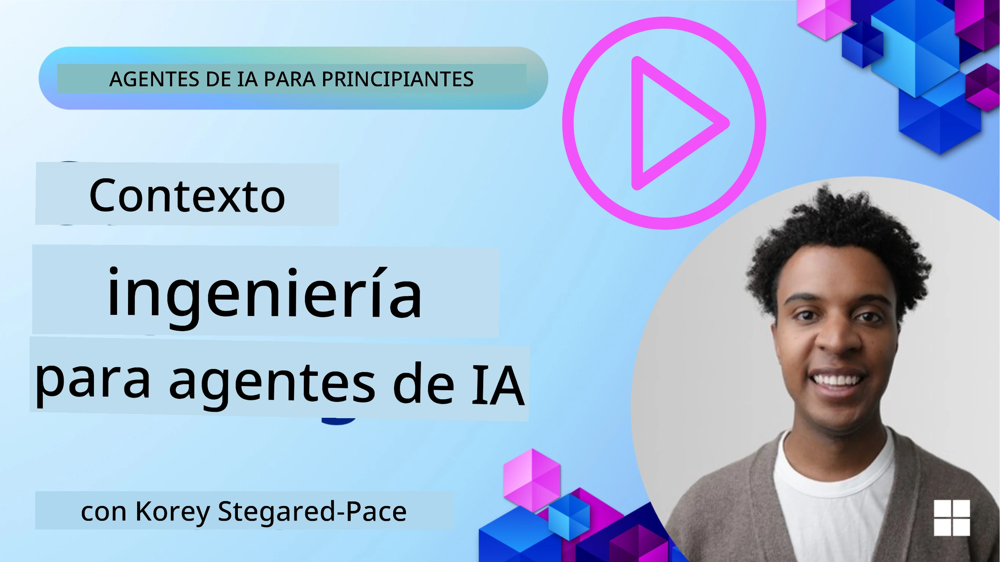
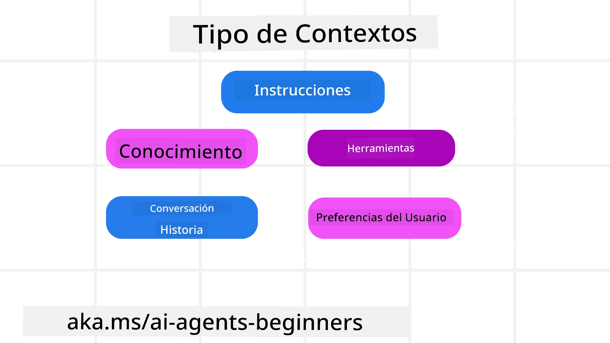
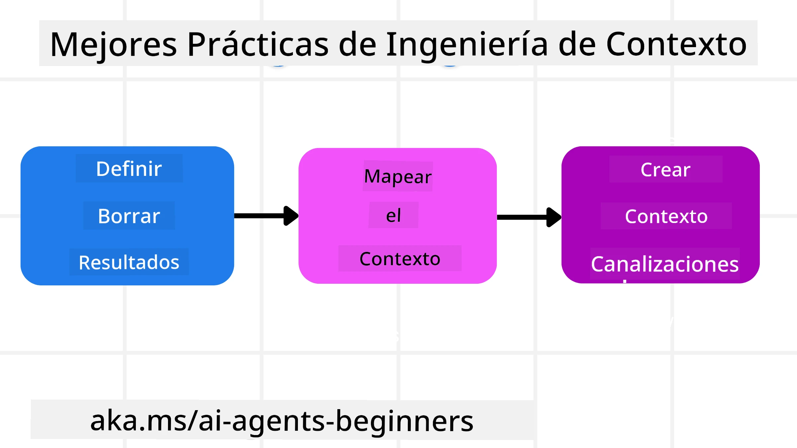

# Ingeniería de Contexto para Agentes de IA

> _(Haz clic en la imagen de arriba para ver el video de esta lección)_

Entender la complejidad de la aplicación para la que estás construyendo un agente de IA es importante para crear uno confiable. Necesitamos construir agentes de IA que gestionen eficazmente la información para abordar necesidades complejas más allá de la ingeniería de prompts.

En esta lección, veremos qué es la ingeniería de contexto y su papel en la construcción de agentes de IA.

## Introducción

Esta lección cubrirá:

• **Qué es la Ingeniería de Contexto** y por qué es diferente a la ingeniería de prompts.

• **Estrategias para una Ingeniería de Contexto efectiva**, incluyendo cómo escribir, seleccionar, comprimir y aislar información.

• **Fallas comunes de Contexto** que pueden descarrilar tu agente de IA y cómo solucionarlas.

## Objetivos de Aprendizaje

Después de completar esta lección, sabrás cómo:

• **Definir la ingeniería de contexto** y diferenciarla de la ingeniería de prompts.

• **Identificar los componentes clave del contexto** en aplicaciones de Modelos de Lenguaje Grande (LLM).

• **Aplicar estrategias para escribir, seleccionar, comprimir y aislar el contexto** para mejorar el rendimiento del agente.

• **Reconocer fallas comunes de contexto** como intoxicación, distracción, confusión y choque, e implementar técnicas de mitigación.

## ¿Qué es la Ingeniería de Contexto?

Para los agentes de IA, el contexto es lo que impulsa la planificación de un agente de IA para tomar ciertas acciones. La ingeniería de contexto es la práctica de asegurarse de que el agente de IA tenga la información adecuada para completar el siguiente paso de la tarea. La ventana de contexto es limitada en tamaño, por lo que, como constructores de agentes, debemos crear sistemas y procesos para gestionar la adición, eliminación y condensación de la información en la ventana de contexto.

### Ingeniería de Prompts vs Ingeniería de Contexto

La ingeniería de prompts se centra en un conjunto único y estático de instrucciones para guiar efectivamente a los agentes de IA con un conjunto de reglas. La ingeniería de contexto es cómo gestionar un conjunto dinámico de información, incluido el prompt inicial, para asegurar que el agente de IA tenga lo que necesita a lo largo del tiempo. La idea principal de la ingeniería de contexto es hacer que este proceso sea repetible y confiable.

### Tipos de Contexto

Es importante recordar que el contexto no es solo una cosa. La información que el agente de IA necesita puede provenir de una variedad de fuentes diferentes y depende de nosotros asegurarnos de que el agente tenga acceso a estas fuentes:

Los tipos de contexto que un agente de IA podría necesitar gestionar incluyen:

• **Instrucciones:** Son como las "reglas" del agente: prompts, mensajes del sistema, ejemplos pocos disparos (mostrando a la IA cómo hacer algo), y descripciones de herramientas que puede usar. Aquí es donde el enfoque de la ingeniería de prompts se combina con la ingeniería de contexto.

• **Conocimiento:** Esto cubre hechos, información recuperada de bases de datos o memorias a largo plazo que el agente ha acumulado. Incluye la integración de un sistema de Generación Aumentada por Recuperación (RAG) si un agente necesita acceso a diferentes almacenes de conocimiento y bases de datos.

• **Herramientas:** Son las definiciones de funciones externas, APIs y servidores MCP que el agente puede llamar, junto con el feedback (resultados) que obtiene de usarlas.

• **Historial de Conversación:** El diálogo en curso con un usuario. A medida que pasa el tiempo, estas conversaciones se vuelven más largas y complejas, lo que significa que ocupan espacio en la ventana de contexto.

• **Preferencias del Usuario:** Información aprendida sobre los gustos o disgustos de un usuario a lo largo del tiempo. Estos pueden almacenarse y utilizarse al tomar decisiones clave para ayudar al usuario.

## Estrategias para una Ingeniería de Contexto Efectiva

### Estrategias de Planificación

Una buena ingeniería de contexto comienza con una buena planificación. Aquí hay un enfoque que te ayudará a empezar a pensar cómo aplicar el concepto de ingeniería de contexto:

1. **Definir Resultados Claros** - Los resultados de las tareas que se asignarán a los agentes de IA deben estar claramente definidos. Responde la pregunta: "¿Cómo se verá el mundo cuando el agente de IA termine su tarea?" En otras palabras, qué cambio, información o respuesta debería tener el usuario después de interactuar con el agente de IA.

2. **Mapear el Contexto** - Una vez que hayas definido los resultados del agente de IA, necesitas responder a la pregunta "¿Qué información necesita el agente de IA para completar esta tarea?". De esta forma puedes empezar a mapear el contexto de dónde puede ubicarse esa información.

3. **Crear Pipelines de Contexto** - Ahora que sabes dónde está la información, necesitas responder a la pregunta "¿Cómo obtendrá el agente esta información?". Esto se puede hacer de diversas maneras, incluyendo RAG, uso de servidores MCP y otras herramientas.

### Estrategias Prácticas

La planificación es importante, pero una vez que la información empieza a fluir en la ventana de contexto de nuestro agente, necesitamos tener estrategias prácticas para gestionarla:

#### Gestión del Contexto

Mientras que parte de la información se añadirá automáticamente a la ventana de contexto, la ingeniería de contexto trata de tomar un rol más activo sobre esta información, lo cual se puede hacer con algunas estrategias:

 1. **Bloc de Notas del Agente**  
 Permite que un agente de IA tome notas de información relevante sobre las tareas actuales y las interacciones con el usuario durante una sola sesión. Esto debería existir fuera de la ventana de contexto en un archivo u objeto de ejecución que el agente pueda recuperar más tarde durante esta sesión si es necesario.

 2. **Memorias**  
 Los blocs de notas son buenos para gestionar información fuera de la ventana de contexto durante una sola sesión. Las memorias permiten a los agentes almacenar y recuperar información relevante a través de múltiples sesiones. Esto podría incluir resúmenes, preferencias del usuario y feedback para mejoras futuras.

 3. **Compresión del Contexto**  
 Cuando la ventana de contexto crece y se acerca a su límite, se pueden usar técnicas como la resumición y el recorte. Esto incluye mantener solo la información más relevante o eliminar mensajes más antiguos.

 4. **Sistemas Multi-Agente**  
 Desarrollar sistemas multi-agente es una forma de ingeniería de contexto porque cada agente tiene su propia ventana de contexto. Cómo se comparte y se pasa ese contexto a diferentes agentes es otra cosa que planificar al construir estos sistemas.

 5. **Entornos Sandbox**  
 Si un agente necesita ejecutar algún código o procesar grandes cantidades de información en un documento, esto puede tomar una gran cantidad de tokens para procesar los resultados. En lugar de almacenar todo esto en la ventana de contexto, el agente puede usar un entorno sandbox que pueda ejecutar este código y solo leer los resultados y otra información relevante.

 6. **Objetos de Estado en Tiempo de Ejecución**  
 Esto se hace creando contenedores de información para gestionar situaciones cuando el agente necesita tener acceso a cierta información. Para una tarea compleja, esto permitiría a un agente almacenar los resultados de cada sub-tarea paso a paso, permitiendo que el contexto permanezca conectado solo a esa sub-tarea específica.

#### Inspección del Contexto

Después de aplicar una de estas estrategias, vale la pena revisar qué recibió realmente la siguiente llamada al modelo. Una pregunta útil para depuración es:

> ¿El agente cargó demasiado contexto, el contexto incorrecto, o le faltó contexto que necesitaba?

No necesitas registrar prompts sin procesar, resultados de herramientas o contenidos de memorias para responder esa pregunta. En producción, prefiere registros pequeños de inspección de contexto que capturen conteos, IDs, hashes y etiquetas de políticas:

- **Selección:** Rastrea cuántos fragmentos candidatos, herramientas o memorias fueron considerados, cuántos fueron seleccionados, y qué regla o puntuación causó que los otros fueran filtrados.

- **Compresión:** Registra el rango de origen o ID de traza, el ID del resumen, una estimación del conteo de tokens antes y después de la compresión, y si el contenido bruto fue excluido de la siguiente llamada.

- **Aislamiento:** Anota qué sub-tarea se ejecutó en un agente, sesión o sandbox separado, qué resumen acotado se devolvió y si el resultado grande de una herramienta permaneció fuera del contexto del agente principal.

- **Memorias y RAG:** Almacena IDs de documentos recuperados, IDs de memorias, puntuaciones, IDs seleccionados y estado de redacción en lugar de texto completo recuperado.

- **Seguridad y privacidad:** Prefiere hashes, IDs, cubetas de tokens y etiquetas de políticas sobre texto sensible en prompts, argumentos de herramientas, resultados de herramientas o cuerpos de memorias de usuario.

El objetivo no es mantener más contexto, sino dejar suficiente evidencia para que un desarrollador pueda saber qué estrategia de contexto se ejecutó y si cambió la siguiente llamada al modelo de la manera prevista.

### Ejemplo de Ingeniería de Contexto

Digamos que queremos que un agente de IA **"Me reserve un viaje a París."**

• Un agente simple usando solo ingeniería de prompts podría simplemente responder: **"Está bien, ¿cuándo te gustaría ir a París?"**. Solo procesó tu pregunta directa en el momento que el usuario la hizo.

• Un agente que use las estrategias de ingeniería de contexto cubiertas haría mucho más. Antes de responder, su sistema podría:

  ◦ **Verificar tu calendario** para las fechas disponibles (recuperando datos en tiempo real).

 ◦ **Recordar preferencias de viajes pasados** (de memoria a largo plazo) como tu aerolínea preferida, presupuesto o si prefieres vuelos directos.

 ◦ **Identificar herramientas disponibles** para reserva de vuelos y hoteles.

- Luego, una respuesta de ejemplo podría ser: "¡Hola [Tu Nombre]! Veo que estás libre la primera semana de octubre. ¿Busco vuelos directos a París en [Aerolínea Preferida] dentro de tu presupuesto habitual de [Presupuesto]?" Esta respuesta más rica y consciente del contexto demuestra el poder de la ingeniería de contexto.

## Fallas Comunes de Contexto

### Intoxicación del Contexto

**Qué es:** Cuando una alucinación (información falsa generada por el LLM) o un error entra en el contexto y es referenciado repetidamente, causando que el agente persiga metas imposibles o desarrolle estrategias sin sentido.

**Qué hacer:** Implementar **validación de contexto** y **cuarentena**. Validar la información antes de que se añada a la memoria a largo plazo. Si se detecta posible intoxicación, iniciar nuevos hilos de contexto para evitar que la mala información se propague.

**Ejemplo en Reserva de Viaje:** Tu agente alucina un **vuelo directo desde un pequeño aeropuerto local a una ciudad internacional lejana** que en realidad no ofrece vuelos internacionales. Este detalle de vuelo inexistente se guarda en el contexto. Más tarde, cuando le pides al agente que reserve, sigue intentando encontrar boletos para esta ruta imposible, lo que causa errores repetidos.

**Solución:** Implementar un paso que **valide la existencia y rutas de vuelos con una API en tiempo real** _antes_ de añadir el detalle del vuelo al contexto activo del agente. Si la validación falla, la información errónea se "cuarentena" y no se usa más.

### Distracción del Contexto

**Qué es:** Cuando el contexto se vuelve tan grande que el modelo se enfoca demasiado en el historial acumulado en vez de usar lo que aprendió durante el entrenamiento, lo que lleva a acciones repetitivas o poco útiles. Los modelos pueden comenzar a cometer errores incluso antes de que la ventana de contexto esté llena.

**Qué hacer:** Usar **resumen del contexto**. Comprimir periódicamente la información acumulada en resúmenes más cortos, manteniendo detalles importantes y eliminando historia redundante. Esto ayuda a "reiniciar" el enfoque.

**Ejemplo en Reserva de Viaje:** Has estado discutiendo varios destinos de viaje soñados por mucho tiempo, incluyendo un relato detallado de un viaje de mochilero de hace dos años. Cuando finalmente pides **"encuéntrame un vuelo barato para el próximo mes,"** el agente se queda atrapado en los detalles antiguos e irrelevantes y sigue preguntando sobre tu equipo de mochilero o itinerarios pasados, descuidando tu solicitud actual.

**Solución:** Después de cierto número de turnos o cuando el contexto crece demasiado, el agente debería **resumir las partes más recientes y relevantes de la conversación** – enfocándose en tus fechas y destino actuales – y usar ese resumen condensado para la siguiente llamada al LLM, descartando la charla histórica menos relevante.

### Confusión del Contexto

**Qué es:** Cuando el contexto innecesario, a menudo en forma de demasiadas herramientas disponibles, hace que el modelo genere malas respuestas o llame a herramientas irrelevantes. Los modelos más pequeños son especialmente propensos a esto.

**Qué hacer:** Implementar **gestión de conjunto de herramientas** usando técnicas RAG. Almacenar descripciones de herramientas en una base de datos vectorial y seleccionar _solo_ las herramientas más relevantes para cada tarea específica. La investigación muestra que limitar la selección a menos de 30 es efectivo.

**Ejemplo en Reserva de Viaje:** Tu agente tiene acceso a docenas de herramientas: `reservar_vuelo`, `reservar_hotel`, `alquilar_auto`, `buscar_tours`, `convertidor_moneda`, `pronóstico_clima`, `reservas_restaurantes`, etc. Preguntas, **"¿Cuál es la mejor forma de moverse por París?"** Debido a la gran cantidad de herramientas, el agente se confunde y trata de llamar a `reservar_vuelo` _dentro_ de París, o `alquilar_auto` aunque prefieras transporte público, porque las descripciones de las herramientas pueden superponerse o simplemente no puede discernir cuál es la mejor.

**Solución:** Usar **RAG sobre descripciones de herramientas**. Cuando preguntas cómo moverse en París, el sistema recupera dinámicamente _solo_ las herramientas más relevantes como `alquilar_auto` o `info_transporte_publico` basándose en tu consulta, presentando un "conjunto" enfocado de herramientas al LLM.

### Choque de Contexto

**Qué es:** Cuando existe información conflictiva dentro del contexto, lo que provoca razonamientos inconsistentes o respuestas finales malas. Esto suele ocurrir cuando la información llega en etapas y las suposiciones tempranas incorrectas permanecen en el contexto.

**Qué hacer:** Usar **poda de contexto** y **descarga**. La poda significa eliminar información desactualizada o conflictiva cuando llegan nuevos detalles. La descarga le da al modelo un espacio de trabajo separado o "bloc de notas" para procesar información sin saturar el contexto principal.
**Ejemplo de Reserva de Viaje:** Inicialmente le dices a tu agente, **"Quiero volar en clase económica."** Más adelante en la conversación, cambias de opinión y dices, **"En realidad, para este viaje, vamos en clase ejecutiva."** Si ambas instrucciones permanecen en el contexto, el agente podría recibir resultados de búsqueda contradictorios o confundirse sobre qué preferencia priorizar.

**Solución:** Implementar **poda de contexto**. Cuando una nueva instrucción contradice a una antigua, la instrucción más antigua se elimina o se anula explícitamente en el contexto. Alternativamente, el agente puede usar una **libreta de borradores** para conciliar preferencias conflictivas antes de decidir, asegurando que solo la instrucción final y consistente guíe sus acciones.

## ¿Tienes Más Preguntas Sobre Ingeniería de Contexto?

Únete al [Microsoft Foundry Discord](https://aka.ms/ai-agents/discord) para conocer a otros aprendices, asistir a horas de consulta y obtener respuestas a tus preguntas sobre Agentes de IA.

---

<!-- CO-OP TRANSLATOR DISCLAIMER START -->
**Descargo de responsabilidad**:
Este documento ha sido traducido utilizando el servicio de traducción automática [Co-op Translator](https://github.com/Azure/co-op-translator). Aunque nos esforzamos por la precisión, tenga en cuenta que las traducciones automatizadas pueden contener errores o inexactitudes. El documento original en su idioma nativo debe considerarse la fuente autorizada. Para información crítica, se recomienda una traducción profesional humana. No somos responsables de cualquier malentendido o interpretación errónea que surja del uso de esta traducción.
<!-- CO-OP TRANSLATOR DISCLAIMER END -->