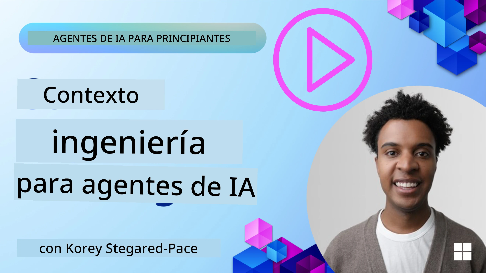
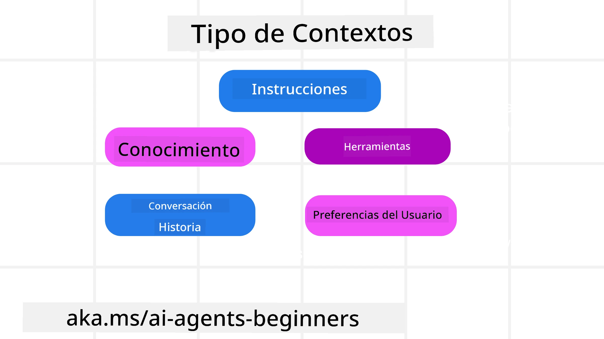
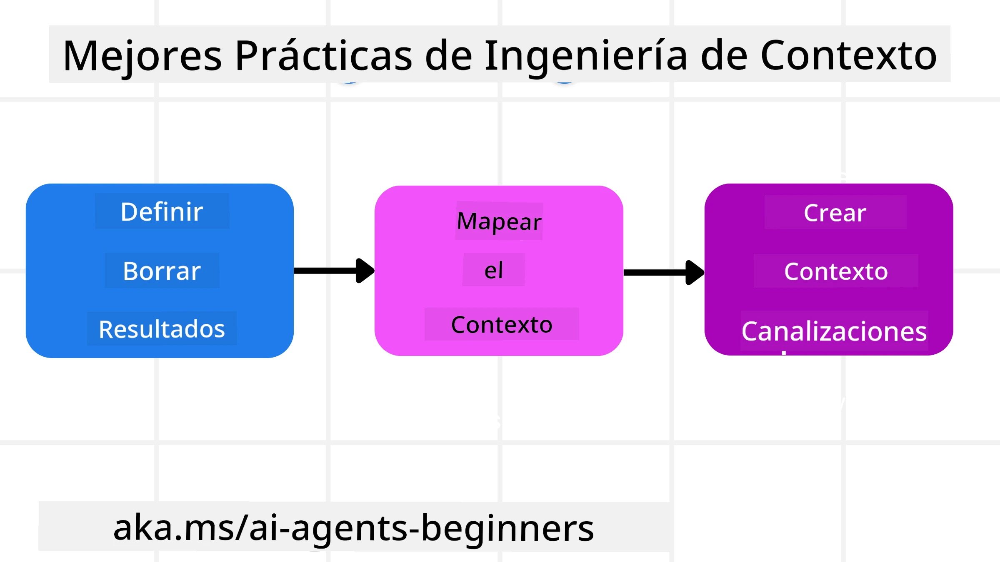

# Ingeniería de Contexto para Agentes de IA

> _(Haz clic en la imagen de arriba para ver el video de esta lección)_

Comprender la complejidad de la aplicación para la que estás construyendo un agente de IA es importante para crear uno confiable. Necesitamos construir Agentes de IA que gestionen eficazmente la información para abordar necesidades complejas más allá de la ingeniería de prompts.

En esta lección, veremos qué es la ingeniería de contexto y su papel en la construcción de agentes de IA.

## Introducción

Esta lección cubrirá:

• **Qué es la Ingeniería de Contexto** y por qué es diferente de la ingeniería de prompts.

• **Estrategias para una Ingeniería de Contexto efectiva**, incluyendo cómo escribir, seleccionar, comprimir y aislar información.

• **Fallas Comunes de Contexto** que pueden descarrilar a tu agente de IA y cómo solucionarlas.

## Objetivos de Aprendizaje

Después de completar esta lección, sabrás cómo:

• **Definir la ingeniería de contexto** y diferenciarla de la ingeniería de prompts.

• **Identificar los componentes clave del contexto** en aplicaciones de Modelos de Lenguaje Grande (LLM).

• **Aplicar estrategias para escribir, seleccionar, comprimir y aislar contexto** para mejorar el desempeño del agente.

• **Reconocer fallas comunes de contexto** como envenenamiento, distracción, confusión y choque, e implementar técnicas de mitigación.

## ¿Qué es la Ingeniería de Contexto?

Para los Agentes de IA, el contexto es lo que impulsa la planificación para que un Agente de IA tome ciertas acciones. La Ingeniería de Contexto es la práctica de asegurarse de que el Agente de IA tenga la información correcta para completar el siguiente paso de la tarea. La ventana de contexto tiene un tamaño limitado, por lo que como constructores de agentes necesitamos crear sistemas y procesos para gestionar la adición, eliminación y condensación de la información en la ventana de contexto.

### Ingeniería de Prompt vs Ingeniería de Contexto

La ingeniería de prompts se enfoca en un conjunto único de instrucciones estáticas para guiar eficazmente a los Agentes de IA con un conjunto de reglas. La ingeniería de contexto es cómo gestionar un conjunto dinámico de información, incluyendo el prompt inicial, para asegurar que el Agente de IA tenga lo que necesita con el tiempo. La idea principal alrededor de la ingeniería de contexto es hacer que este proceso sea repetible y confiable.

### Tipos de Contexto

Es importante recordar que el contexto no es solo una cosa. La información que el Agente de IA necesita puede venir de una variedad de fuentes diferentes y depende de nosotros asegurar que el agente tenga acceso a estas fuentes:

Los tipos de contexto que un agente de IA podría necesitar gestionar incluyen:

• **Instrucciones:** Son como las "reglas" del agente – prompts, mensajes del sistema, ejemplos few-shot (mostrando a la IA cómo hacer algo) y descripciones de herramientas que puede usar. Aquí es donde converge el enfoque de ingeniería de prompts con la ingeniería de contexto.

• **Conocimiento:** Cubre hechos, información recuperada de bases de datos o memorias a largo plazo que el agente ha acumulado. Esto incluye integrar un sistema de Generación Aumentada por Recuperación (RAG) si un agente necesita acceso a diferentes almacenes de conocimiento y bases de datos.

• **Herramientas:** Son las definiciones de funciones externas, APIs y Servidores MCP que el agente puede invocar, junto con la retroalimentación (resultados) que obtiene al usarlas.

• **Historial de Conversación:** El diálogo en curso con un usuario. A medida que pasa el tiempo, estas conversaciones se vuelven más largas y complejas, lo que significa que ocupan espacio en la ventana de contexto.

• **Preferencias del Usuario:** Información aprendida sobre los gustos o disgustos del usuario a lo largo del tiempo. Estas podrían almacenarse y usarse al tomar decisiones clave para ayudar al usuario.

## Estrategias para una Ingeniería de Contexto Efectiva

### Estrategias de Planificación

Una buena ingeniería de contexto comienza con una buena planificación. Aquí hay un enfoque que te ayudará a empezar a pensar en cómo aplicar el concepto de ingeniería de contexto:

1. **Definir Resultados Claros** - Los resultados de las tareas asignadas a Agentes de IA deben estar claramente definidos. Responde la pregunta: "¿Cómo se verá el mundo cuando el Agente de IA termine su tarea?" En otras palabras, qué cambio, información o respuesta debería tener el usuario después de interactuar con el Agente de IA.
2. **Mapear el Contexto** - Una vez que hayas definido los resultados del Agente de IA, necesitas responder a la pregunta "¿Qué información necesita el Agente de IA para completar esta tarea?". De esta forma puedes empezar a mapear el contexto de dónde puede estar ubicada esa información.
3. **Crear Pipelines de Contexto** - Ahora que sabes dónde está la información, necesitas responder a la pregunta "¿Cómo obtendrá el Agente esta información?". Esto se puede hacer de varias formas, incluyendo RAG, uso de servidores MCP y otras herramientas.

### Estrategias Prácticas

La planificación es importante, pero una vez que la información comienza a fluir en la ventana de contexto de nuestro agente, necesitamos tener estrategias prácticas para gestionarla:

#### Gestión del Contexto

Aunque parte de la información se añadirá automáticamente a la ventana de contexto, la ingeniería de contexto consiste en tomar un rol más activo con esta información, lo cual se puede hacer a través de algunas estrategias:

 1. **Bloc de Notas del Agente**  
 Esto permite que un Agente de IA tome notas de información relevante sobre las tareas actuales y las interacciones con el usuario durante una sola sesión. Esto debería existir fuera de la ventana de contexto en un archivo u objeto de tiempo de ejecución que el agente pueda recuperar después durante esa sesión si es necesario.

 2. **Memorias**  
 Los blocs de notas son buenos para gestionar información fuera de la ventana de contexto de una sola sesión. Las memorias permiten a los agentes almacenar y recuperar información relevante a lo largo de múltiples sesiones. Esto podría incluir resúmenes, preferencias del usuario y retroalimentación para mejoras futuras.

 3. **Compresión de Contexto**  
  Cuando la ventana de contexto crece y está cerca de su límite, se pueden usar técnicas como la resumición y el recorte. Esto incluye mantener solo la información más relevante o eliminar mensajes antiguos.

 4. **Sistemas Multi-Agente**  
  Desarrollar sistemas multi-agente es una forma de ingeniería de contexto porque cada agente tiene su propia ventana de contexto. Cómo se comparte y pasa ese contexto a diferentes agentes es otra cosa que planificar al construir estos sistemas.

 5. **Entornos Sandbox**  
  Si un agente necesita ejecutar código o procesar grandes cantidades de información en un documento, esto puede consumir muchos tokens para procesar los resultados. En lugar de almacenar todo esto en la ventana de contexto, el agente puede usar un entorno sandbox capaz de ejecutar este código y solo leer los resultados y otra información relevante.

 6. **Objetos de Estado en Tiempo de Ejecución**  
   Esto se hace creando contenedores de información para manejar situaciones cuando el Agente necesita tener acceso a cierta información. Para una tarea compleja, esto permitiría que un Agente almacene los resultados de cada subtarea paso a paso, permitiendo que el contexto permanezca conectado solo a esa subtarea específica.

#### Inspección del Contexto

Después de aplicar una de estas estrategias, vale la pena verificar qué recibió realmente la siguiente llamada al modelo. Una pregunta útil para depuración es:

> ¿Cargó el agente demasiado contexto, el contexto incorrecto o le faltó contexto que necesitaba?

No necesitas registrar prompts originales, salidas de herramientas o contenido de memoria para responder esa pregunta. En producción, prefiere registros pequeños de inspección de contexto que capturen conteos, IDs, hashes y etiquetas de política:

- **Selección:** Rastrea cuántos fragmentos candidatos, herramientas o memorias fueron considerados, cuántos fueron seleccionados y qué regla o puntuación causó que los demás fueran filtrados.
- **Compresión:** Registra el rango de origen o ID de traza, el ID del resumen, un conteo estimado de tokens antes y después de la compresión, y si el contenido bruto fue excluido de la siguiente llamada.
- **Aislamiento:** Anota qué subtarea se ejecutó en un agente, sesión o sandbox separado, qué resumen acotado fue devuelto y si la salida grande de herramientas permaneció fuera del contexto del agente principal.
- **Memoria y RAG:** Almacena IDs de documentos recuperados, IDs de memoria, puntuaciones, IDs seleccionados y estado de redacción en lugar del texto completo recuperado.
- **Seguridad y privacidad:** Prefiere hashes, IDs, cubos de tokens y etiquetas de política sobre texto sensible de prompts, argumentos de herramientas, resultados de herramientas o cuerpos de memoria del usuario.

El objetivo no es mantener más contexto. Es dejar suficiente evidencia para que un desarrollador pueda decir qué estrategia de contexto se usó y si cambió la siguiente llamada al modelo de la manera prevista.

### Ejemplo de Ingeniería de Contexto

Supongamos que queremos que un agente de IA **"Reserve un viaje a París para mí."**

• Un agente simple que solo use ingeniería de prompts podría responder: **"Está bien, ¿cuándo te gustaría ir a París?"**. Solo procesó tu pregunta directa en el momento que el usuario la hizo.

• Un agente que use las estrategias de ingeniería de contexto cubiertas haría mucho más. Antes de responder, su sistema podría:

  ◦ **Revisar tu calendario** para fechas disponibles (recuperando datos en tiempo real).

 ◦ **Recordar preferencias de viaje pasadas** (de memoria a largo plazo) como tu aerolínea preferida, presupuesto o si prefieres vuelos directos.

 ◦ **Identificar herramientas disponibles** para reservas de vuelos y hoteles.

- Entonces, una respuesta ejemplo podría ser:  "¡Hola [Tu Nombre]! Veo que estás libre la primera semana de octubre. ¿Busco vuelos directos a París en [Aerolínea Preferida] dentro de tu presupuesto habitual de [Presupuesto]?". Esta respuesta más rica, consciente del contexto, demuestra el poder de la ingeniería de contexto.

## Fallas Comunes de Contexto

### Envenenamiento de Contexto

**Qué es:** Cuando una alucinación (información falsa generada por el LLM) o un error entra en el contexto y se referencia repetidamente, haciendo que el agente persiga metas imposibles o desarrolle estrategias sin sentido.

**Qué hacer:** Implementar **validación de contexto** y **cuarentena**. Valida la información antes de agregarla a la memoria a largo plazo. Si se detecta potencial envenenamiento, inicia hilos de contexto nuevos para prevenir que la información errónea se propague.

**Ejemplo de Reserva de Viaje:** Tu agente alucina un **vuelo directo desde un aeropuerto local pequeño hacia una ciudad internacional lejana** que en realidad no ofrece vuelos internacionales. Este detalle falso del vuelo se guarda en el contexto. Más tarde, cuando le pides al agente que reserve, sigue intentando encontrar boletos para esta ruta imposible, causando errores repetidos.

**Solución:** Implementar un paso que **valide la existencia del vuelo y rutas con una API en tiempo real** _antes_ de agregar el detalle del vuelo al contexto de trabajo del agente. Si la validación falla, la información errónea es "cuarentenada" y no se usa más.

### Distracción de Contexto

**Qué es:** Cuando el contexto se vuelve tan grande que el modelo se enfoca demasiado en el historial acumulado en lugar de usar lo que aprendió durante el entrenamiento, lo que conduce a acciones repetitivas o poco útiles. Los modelos pueden empezar a cometer errores incluso antes de que la ventana de contexto esté llena.

**Qué hacer:** Usar **resumen de contexto**. Comprimir periódicamente la información acumulada en resúmenes más cortos, manteniendo detalles importantes y eliminando historia redundante. Esto ayuda a "reiniciar" el enfoque.

**Ejemplo de Reserva de Viaje:** Has estado discutiendo varios destinos soñados durante mucho tiempo, incluyendo un relato detallado de tu viaje de mochilero de hace dos años. Cuando finalmente pides **"encuentra un vuelo barato para el próximo mes"**, el agente se queda atrapado en los detalles viejos e irrelevantes y sigue preguntando sobre tu equipo de mochilero o itinerarios pasados, descuidando tu solicitud actual.

**Solución:** Después de cierto número de turnos o cuando el contexto crece demasiado, el agente debería **resumir las partes más recientes y relevantes de la conversación** – enfocándose en tus fechas y destino de viaje actuales – y usar ese resumen condensado para la siguiente llamada al LLM, descartando el chat histórico menos relevante.

### Confusión de Contexto

**Qué es:** Cuando el contexto innecesario, a menudo en forma de demasiadas herramientas disponibles, hace que el modelo genere respuestas malas o llame a herramientas irrelevantes. Los modelos más pequeños son especialmente propensos a esto.

**Qué hacer:** Implementar **gestión de carga de herramientas** usando técnicas RAG. Almacenar descripciones de herramientas en una base de datos vectorial y seleccionar _solo_ las herramientas más relevantes para cada tarea específica. La investigación muestra limitar la selección de herramientas a menos de 30.

**Ejemplo de Reserva de Viaje:** Tu agente tiene acceso a docenas de herramientas: `book_flight`, `book_hotel`, `rent_car`, `find_tours`, `currency_converter`, `weather_forecast`, `restaurant_reservations`, etc. Preguntas, **"¿Cuál es la mejor forma de moverse por París?"** Debido a la gran cantidad de herramientas, el agente se confunde e intenta llamar a `book_flight` _dentro_ de París, o `rent_car` aunque prefieras transporte público, porque las descripciones de las herramientas podrían superponerse o simplemente no distingue cuál es la mejor.

**Solución:** Usar **RAG sobre las descripciones de herramientas**. Cuando preguntas cómo moverse por París, el sistema recupera dinámicamente _solo_ las herramientas más relevantes como `rent_car` o `public_transport_info` basado en tu consulta, presentando una "carga" de herramientas focalizada para el LLM.

### Choque de Contexto

**Qué es:** Cuando existe información contradictoria dentro del contexto, lo que lleva a razonamientos inconsistentes o respuestas finales malas. Esto suele suceder cuando la información llega en etapas, y supuestos tempranos erróneos permanecen en el contexto.

**Qué hacer:** Usar **poda de contexto** y **descarga**. La poda significa remover información desactualizada o conflictiva a medida que llegan nuevos detalles. La descarga da al modelo un área de trabajo separada "sandbox" para procesar información sin saturar el contexto principal.
**Ejemplo de Reserva de Viaje:** Inicialmente le dices a tu agente, **"Quiero volar en clase económica."** Más adelante en la conversación, cambias de opinión y dices, **"En realidad, para este viaje, vamos en clase business."** Si ambas instrucciones permanecen en el contexto, el agente podría recibir resultados de búsqueda contradictorios o confundirse sobre qué preferencia priorizar.

**Solución:** Implementa **recorte del contexto**. Cuando una nueva instrucción contradice a una anterior, la instrucción antigua se elimina o se anula explícitamente en el contexto. Alternativamente, el agente puede usar una **pizarra** para conciliar preferencias contradictorias antes de decidir, asegurando que solo la instrucción final y coherente guíe sus acciones.

## ¿Tienes Más Preguntas Sobre Ingeniería de Contexto?

Únete al [Microsoft Foundry Discord](https://discord.com/invite/ATgtXmAS5D) para conocer a otros estudiantes, asistir a horas de consulta y resolver tus dudas sobre Agentes de IA.

---

<!-- CO-OP TRANSLATOR DISCLAIMER START -->
**Descargo de responsabilidad**:
Este documento ha sido traducido utilizando el servicio de traducción automática [Co-op Translator](https://github.com/Azure/co-op-translator). Aunque nos esforzamos por la precisión, tenga en cuenta que las traducciones automatizadas pueden contener errores o inexactitudes. El documento original en su idioma nativo debe considerarse la fuente autorizada. Para información crítica, se recomienda una traducción profesional humana. No somos responsables de cualquier malentendido o interpretación errónea que surja del uso de esta traducción.
<!-- CO-OP TRANSLATOR DISCLAIMER END -->