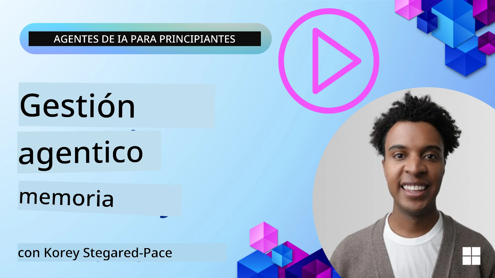

# Memoria para Agentes de IA 

Al hablar de los beneficios únicos de crear Agentes de IA, se discuten principalmente dos cosas: la capacidad de llamar a herramientas para completar tareas y la capacidad de mejorar con el tiempo. La memoria es la base para crear un agente auto-mejorable que pueda crear mejores experiencias para nuestros usuarios.

En esta lección, examinaremos qué es la memoria para Agentes de IA y cómo podemos gestionarla y utilizarla para el beneficio de nuestras aplicaciones.

## Introducción

Esta lección cubrirá:

• **Comprender la Memoria de los Agentes de IA**: Qué es la memoria y por qué es esencial para los agentes.

• **Implementación y Almacenamiento de Memoria**: Métodos prácticos para añadir capacidades de memoria a tus agentes de IA, centrándose en la memoria a corto y largo plazo.

• **Hacer que los Agentes de IA se Auto-mejoren**: Cómo la memoria permite que los agentes aprendan de interacciones pasadas y mejoren con el tiempo.

## Implementaciones Disponibles

Esta lección incluye dos tutoriales completos en notebooks:

• **[13-agent-memory.ipynb](./13-agent-memory.ipynb)**: Implementa memoria usando Mem0 y Azure AI Search con Microsoft Agent Framework

• **[13-agent-memory-cognee.ipynb](./13-agent-memory-cognee.ipynb)**: Implementa memoria estructurada usando Cognee, construyendo automáticamente un grafo de conocimiento respaldado por embeddings, visualizando el grafo y recuperación inteligente

## Objetivos de Aprendizaje

Después de completar esta lección, sabrás cómo:

• **Diferenciar entre varios tipos de memoria de agentes de IA**, incluyendo memoria de trabajo, a corto plazo y a largo plazo, así como formas especializadas como la memoria de persona y episódica.

• **Implementar y gestionar memoria a corto y largo plazo para agentes de IA** usando Microsoft Agent Framework, aprovechando herramientas como Mem0, Cognee, memoria Whiteboard e integrándola con Azure AI Search.

• **Comprender los principios detrás de agentes de IA auto-mejorables** y cómo sistemas robustos de gestión de memoria contribuyen al aprendizaje y adaptación continuos.

## Comprendiendo la Memoria de los Agentes de IA

En esencia, **la memoria para agentes de IA se refiere a los mecanismos que les permiten retener y recordar información**. Esta información puede ser detalles específicos sobre una conversación, preferencias del usuario, acciones pasadas o incluso patrones aprendidos.

Sin memoria, las aplicaciones de IA suelen ser sin estado, lo que significa que cada interacción comienza desde cero. Esto conduce a una experiencia de usuario repetitiva y frustrante donde el agente "olvida" el contexto o preferencias anteriores.

### ¿Por qué es Importante la Memoria?

La inteligencia de un agente está profundamente vinculada a su capacidad para recordar y utilizar información pasada. La memoria permite que los agentes sean:

• **Reflexivos**: Aprender de acciones y resultados pasados.

• **Interactivos**: Mantener el contexto durante una conversación en curso.

• **Proactivos y Reactivos**: Anticipar necesidades o responder adecuadamente basándose en datos históricos.

• **Autónomos**: Operar con mayor independencia al recurrir a conocimientos almacenados.

El objetivo de implementar memoria es hacer a los agentes más **confiables y capaces**.

### Tipos de Memoria

#### Memoria de Trabajo

Piensa en esto como un trozo de papel de borrador que un agente usa durante una única tarea o proceso de pensamiento en curso. Contiene información inmediata necesaria para calcular el siguiente paso.

Para los agentes de IA, la memoria de trabajo captura a menudo la información más relevante de una conversación, incluso si el historial completo del chat es largo o truncado. Se centra en extraer elementos clave como requisitos, propuestas, decisiones y acciones.

**Ejemplo de Memoria de Trabajo**

En un agente de reserva de viajes, la memoria de trabajo podría capturar la solicitud actual del usuario, como "Quiero reservar un viaje a París". Este requisito específico se mantiene en el contexto inmediato del agente para guiar la interacción actual.

#### Memoria a Corto Plazo

Este tipo de memoria retiene información durante la duración de una sola conversación o sesión. Es el contexto del chat actual, que permite al agente referirse a turnos previos en el diálogo.

En las muestras del SDK Python de [Microsoft Agent Framework](https://github.com/microsoft/agent-framework), esto se corresponde con `AgentSession`, creado con `agent.create_session()`. La sesión es la memoria a corto plazo incorporada del framework: mantiene el contexto de conversación disponible mientras se reutiliza esa misma sesión, pero ese contexto no se persiste cuando la sesión termina o la aplicación se reinicia. Usa memoria a largo plazo para hechos y preferencias que necesiten sobrevivir entre sesiones, típicamente mediante una base de datos, índice vectorial u otro almacenamiento persistente.

**Ejemplo de Memoria a Corto Plazo**

Si un usuario pregunta, "¿Cuánto costaría un vuelo a París?" y luego sigue con "¿Qué hay de alojamiento allí?", la memoria a corto plazo asegura que el agente sepa que "allí" se refiere a "París" dentro de la misma conversación.

#### Memoria a Largo Plazo

Esta es información que persiste a lo largo de múltiples conversaciones o sesiones. Permite a los agentes recordar preferencias del usuario, interacciones históricas o conocimiento general durante períodos extensos. Esto es importante para la personalización.

**Ejemplo de Memoria a Largo Plazo**

Una memoria a largo plazo podría almacenar que "Ben disfruta del esquí y actividades al aire libre, le gusta el café con vistas a la montaña y quiere evitar pistas de esquí avanzadas debido a una lesión pasada". Esta información, aprendida de interacciones previas, influye en las recomendaciones en futuras sesiones de planificación de viajes, haciéndolas muy personalizadas.

#### Memoria de Persona

Este tipo de memoria especializada ayuda a un agente a desarrollar una "personalidad" o "persona" consistente. Permite que el agente recuerde detalles sobre sí mismo o su rol previsto, haciendo las interacciones más fluidas y enfocadas.

**Ejemplo de Memoria de Persona**

Si el agente de viajes está diseñado para ser un "planificador experto de esquí", la memoria de persona podría reforzar este rol, influyendo en sus respuestas para alinearlas con el tono y conocimiento de un experto.

#### Memoria de Flujo de Trabajo/Episódica

Esta memoria almacena la secuencia de pasos que un agente toma durante una tarea compleja, incluyendo éxitos y fallos. Es como recordar "episodios" o experiencias pasadas para aprender de ellas.

**Ejemplo de Memoria Episódica**

Si el agente intentó reservar un vuelo específico pero falló por falta de disponibilidad, la memoria episódica podría registrar esta falla, permitiendo que el agente intente vuelos alternativos o informe al usuario sobre el problema de manera más informada en un intento posterior.

#### Memoria de Entidad

Esto implica extraer y recordar entidades específicas (como personas, lugares o cosas) y eventos de conversaciones. Permite que el agente construya un entendimiento estructurado de los elementos clave discutidos.

**Ejemplo de Memoria de Entidad**

De una conversación sobre un viaje pasado, el agente podría extraer "París," "Torre Eiffel," y "cena en el restaurante Le Chat Noir" como entidades. En una interacción futura, el agente podría recordar "Le Chat Noir" y ofrecer hacer una nueva reserva allí.

#### RAG Estructurado (Generación Aumentada por Recuperación)

Aunque RAG es una técnica amplia, se destaca "RAG Estructurado" como una tecnología potente de memoria. Extrae información densa y estructurada de varias fuentes (conversaciones, correos electrónicos, imágenes) y la usa para mejorar la precisión, cobertura y velocidad en respuestas. A diferencia de RAG clásico que se basa solo en similitud semántica, RAG Estructurado trabaja con la estructura inherente de la información.

**Ejemplo de RAG Estructurado**

En lugar de solo emparejar palabras clave, RAG Estructurado podría analizar detalles de un vuelo (destino, fecha, hora, aerolínea) de un correo y almacenarlos de forma estructurada. Esto permite consultas precisas como "¿Qué vuelo reservé a París el martes?"

## Implementación y Almacenamiento de Memoria

Implementar memoria para agentes de IA implica un proceso sistemático de **gestión de memoria**, que incluye generar, almacenar, recuperar, integrar, actualizar e incluso "olvidar" (o borrar) información. La recuperación es un aspecto particularmente crucial.

### Herramientas Especializadas de Memoria

#### Mem0

Una forma de almacenar y gestionar la memoria del agente es usando herramientas especializadas como Mem0. Mem0 actúa como una capa persistente de memoria, permitiendo que los agentes recuerden interacciones relevantes, almacenen preferencias de usuario y contexto factual, y aprendan de éxitos y fracasos con el tiempo. La idea aquí es que los agentes sin estado se transformen en agentes con estado.

Funciona a través de una **canalización de memoria de dos fases: extracción y actualización**. Primero, los mensajes añadidos al hilo de un agente se envían al servicio Mem0, que usa un Modelo de Lenguaje Grande (LLM) para resumir el historial de la conversación y extraer nuevas memorias. Posteriormente, una fase de actualización dirigida por LLM determina si se deben añadir, modificar o eliminar estas memorias, almacenándolas en un repositorio híbrido que puede incluir bases de datos vectoriales, de grafos y clave-valor. Este sistema también soporta varios tipos de memoria y puede incorporar memoria de grafo para gestionar relaciones entre entidades.

#### Cognee

Otro enfoque poderoso es usar **Cognee**, una memoria semántica de código abierto para agentes de IA que transforma datos estructurados y no estructurados en grafos de conocimiento consultables respaldados por embeddings. Cognee ofrece una **arquitectura de doble almacenamiento** que combina búsqueda por similitud vectorial con relaciones de grafos, permitiendo que los agentes entiendan no solo qué información es similar, sino cómo se relacionan los conceptos entre sí.

Sobresale en **recuperación híbrida** que mezcla similitud vectorial, estructura de grafos y razonamiento con LLM, desde la búsqueda en fragmentos hasta preguntas conscientes del grafo. El sistema mantiene una **memoria viva** que evoluciona y crece mientras permanece consultable como un grafo conectado, soportando tanto el contexto de sesión a corto plazo como la memoria persistente a largo plazo.

El tutorial en notebook de Cognee ([13-agent-memory-cognee.ipynb](./13-agent-memory-cognee.ipynb)) demuestra cómo construir esta capa unificada de memoria, con ejemplos prácticos de ingestión de diversas fuentes de datos, visualización del grafo de conocimiento y consultas con diferentes estrategias de búsqueda adaptadas a las necesidades específicas del agente.

### Almacenamiento de Memoria con RAG

Más allá de herramientas especializadas como Mem0, puedes aprovechar servicios de búsqueda robustos como **Azure AI Search como backend para almacenar y recuperar memorias**, especialmente para RAG estructurado.

Esto te permite fundamentar las respuestas de tu agente con tus propios datos, asegurando respuestas más relevantes y precisas. Azure AI Search puede usarse para almacenar memorias específicas de viajes de usuarios, catálogos de productos o cualquier otro conocimiento específico de dominio.

Azure AI Search soporta capacidades como **RAG Estructurado**, que sobresale en extraer y recuperar información densa y estructurada de grandes conjuntos de datos como historiales de conversación, correos electrónicos o incluso imágenes. Esto proporciona "precisión y cobertura sobrehumana" en comparación con enfoques tradicionales de fragmentación de texto y embeddings.

## Hacer que los Agentes de IA se Auto-mejoren

Un patrón común para agentes auto-mejorables implica introducir un **"agente de conocimiento"**. Este agente separado observa la conversación principal entre el usuario y el agente primario. Su rol es:

1. **Identificar información valiosa**: Determinar si alguna parte de la conversación merece guardarse como conocimiento general o preferencia específica del usuario.

2. **Extraer y resumir**: Destilar el aprendizaje o preferencia esencial de la conversación.

3. **Almacenar en una base de conocimiento**: Persistir esta información extraída, a menudo en una base de datos vectorial, para poder recuperarla después.

4. **Aumentar consultas futuras**: Cuando el usuario inicia una nueva consulta, el agente de conocimiento recupera información almacenada relevante y la añade al prompt del usuario, proporcionando contexto crucial al agente primario (similar a RAG).

### Optimizaciones para la Memoria

• **Gestión de Latencia**: Para evitar ralentizar las interacciones del usuario, se puede usar inicialmente un modelo más barato y rápido para comprobar rápidamente si la información vale la pena almacenar o recuperar, invocando solo cuando sea necesario el proceso más complejo de extracción/recuperación.

• **Mantenimiento de la Base de Conocimiento**: Para una base de conocimiento en crecimiento, la información de menor uso frecuente puede moverse a "almacenamiento frío" para gestionar costos.

## ¿Tienes Más Preguntas Sobre la Memoria de los Agentes?

Únete al [Microsoft Foundry Discord](https://discord.com/invite/ATgtXmAS5D) para reunirte con otros aprendices, asistir a horas de oficina y resolver tus preguntas sobre Agentes de IA.

---

<!-- CO-OP TRANSLATOR DISCLAIMER START -->
**Descargo de responsabilidad**:
Este documento ha sido traducido utilizando el servicio de traducción automática [Co-op Translator](https://github.com/Azure/co-op-translator). Aunque nos esforzamos por la precisión, tenga en cuenta que las traducciones automatizadas pueden contener errores o inexactitudes. El documento original en su idioma nativo debe considerarse la fuente autorizada. Para información crítica, se recomienda una traducción profesional humana. No somos responsables de cualquier malentendido o interpretación errónea que surja del uso de esta traducción.
<!-- CO-OP TRANSLATOR DISCLAIMER END -->