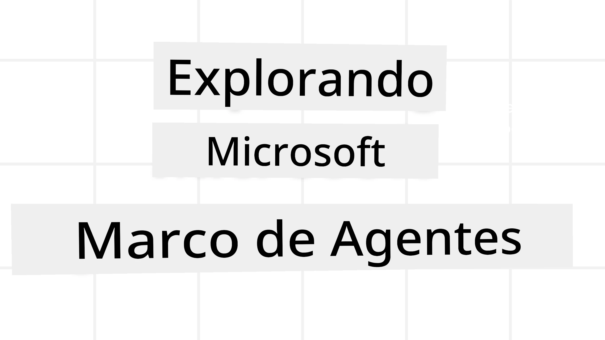
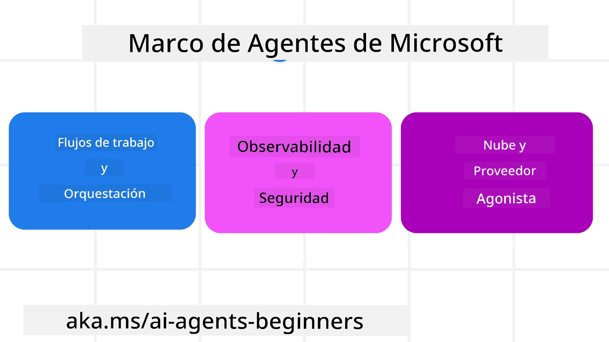
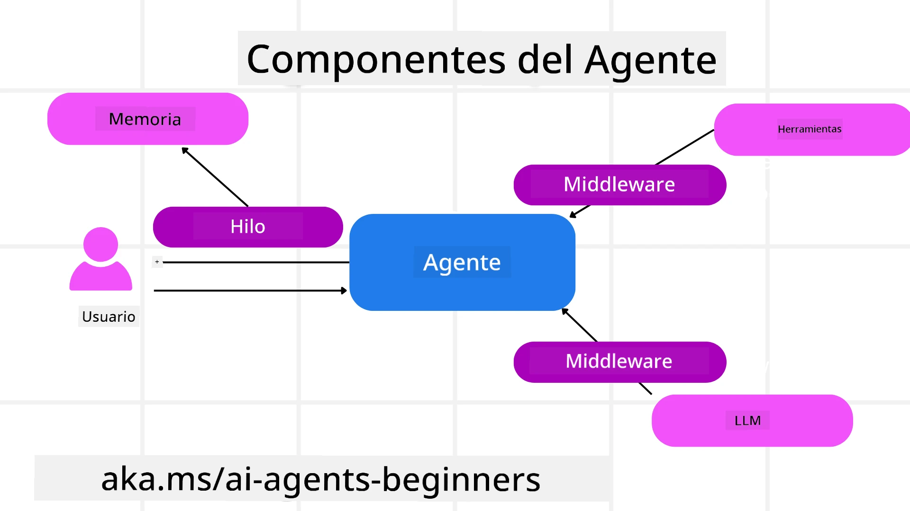

# Explorando Microsoft Agent Framework



### Introducción

Esta lección cubrirá:

- Comprender Microsoft Agent Framework: características clave y valor  
- Explorar los conceptos clave de Microsoft Agent Framework
- Patrones avanzados de MAF: flujos de trabajo, middleware y memoria

## Objetivos de aprendizaje

Después de completar esta lección, sabrá cómo:

- Construir Agentes de IA listos para producción usando Microsoft Agent Framework
- Aplicar las características principales de Microsoft Agent Framework a sus casos de uso agenticos
- Usar patrones avanzados incluyendo flujos de trabajo, middleware y observabilidad

## Ejemplos de código

Los ejemplos de código para [Microsoft Agent Framework (MAF)](https://aka.ms/ai-agents-beginners/agent-framework) se pueden encontrar en este repositorio en los archivos `xx-python-agent-framework` y `xx-dotnet-agent-framework`.

## Comprendiendo Microsoft Agent Framework



[Microsoft Agent Framework (MAF)](https://aka.ms/ai-agents-beginners/agent-framework) es el marco unificado de Microsoft para construir agentes de IA. Ofrece la flexibilidad para abordar la gran variedad de casos de uso agenticos que se ven tanto en entornos de producción como de investigación, incluyendo:

- **Orquestación secuencial de agentes** en escenarios donde se necesitan flujos de trabajo paso a paso.
- **Orquestación concurrente** en escenarios donde los agentes deben completar tareas al mismo tiempo.
- **Orquestación de chat grupal** en escenarios donde los agentes pueden colaborar juntos en una tarea.
- **Orquestación de transferencia (handoff)** en escenarios donde los agentes transfieren la tarea uno al otro a medida que se completan las subtareas.
- **Orquestación magnética** en escenarios donde un agente gestor crea y modifica una lista de tareas y maneja la coordinación de subagentes para completar la tarea.

Para entregar agentes de IA en producción, MAF también incluye características para:

- **Observabilidad** mediante el uso de OpenTelemetry donde cada acción del agente de IA, incluyendo invocación de herramientas, pasos de orquestación, flujos de razonamiento y monitoreo del desempeño a través de los dashboards de Microsoft Foundry.
- **Seguridad** al alojar agentes nativamente en Microsoft Foundry, que incluye controles de seguridad tales como acceso basado en roles, manejo de datos privados y seguridad de contenido incorporada.
- **Durabilidad** pues los hilos y flujos de trabajo del agente pueden pausar, reanudar y recuperarse de errores, permitiendo procesos de larga duración.
- **Control**, ya que se admiten flujos de trabajo con intervención humana donde las tareas se marcan como requeridas aprobación humana.

Microsoft Agent Framework también se enfoca en ser interoperable mediante:

- **Ser independiente de la nube** - Los agentes pueden ejecutarse en contenedores, localmente y en múltiples nubes diferentes.
- **Ser independiente del proveedor** - Los agentes pueden crearse a través de su SDK preferido incluyendo Azure OpenAI y OpenAI.
- **Integración con estándares abiertos** - Los agentes pueden utilizar protocolos como Agent-to-Agent (A2A) y Model Context Protocol (MCP) para descubrir y usar otros agentes y herramientas.
- **Plugins y Conectores** - Se pueden hacer conexiones a servicios de datos y memoria tales como Microsoft Fabric, SharePoint, Pinecone y Qdrant.

Veamos cómo estas características se aplican a algunos de los conceptos centrales de Microsoft Agent Framework.

## Conceptos clave de Microsoft Agent Framework

### Agentes



**Creando agentes**

La creación de agentes se realiza definiendo el servicio de inferencia (proveedor LLM), un conjunto de instrucciones que el agente de IA debe seguir, y un `name` asignado:

```python
agent = AzureOpenAIChatClient(credential=AzureCliCredential()).create_agent( instructions="You are good at recommending trips to customers based on their preferences.", name="TripRecommender" )
```

Lo anterior usa `Azure OpenAI` pero los agentes pueden crearse usando una variedad de servicios incluyendo `Microsoft Foundry Agent Service`:

```python
AzureAIAgentClient(async_credential=credential).create_agent( name="HelperAgent", instructions="You are a helpful assistant." ) as agent
```

APIs de OpenAI `Responses`, `ChatCompletion`

```python
agent = OpenAIResponsesClient().create_agent( name="WeatherBot", instructions="You are a helpful weather assistant.", )
```

```python
agent = OpenAIChatClient().create_agent( name="HelpfulAssistant", instructions="You are a helpful assistant.", )
```

o [MiniMax](https://platform.minimaxi.com/), que ofrece una API compatible con OpenAI con grandes ventanas de contexto (hasta 204K tokens):

```python
agent = OpenAIChatClient(base_url="https://api.minimax.io/v1", api_key=os.environ["MINIMAX_API_KEY"], model_id="MiniMax-M3").create_agent( name="HelpfulAssistant", instructions="You are a helpful assistant.", )
```

o agentes remotos usando el protocolo A2A:

```python
agent = A2AAgent( name=agent_card.name, description=agent_card.description, agent_card=agent_card, url="https://your-a2a-agent-host" )
```

**Ejecutando agentes**

Los agentes se ejecutan usando los métodos `.run` o `.run_stream` para respuestas no continuas o continuas respectivamente.

```python
result = await agent.run("What are good places to visit in Amsterdam?")
print(result.text)
```

```python
async for update in agent.run_stream("What are the good places to visit in Amsterdam?"):
    if update.text:
        print(update.text, end="", flush=True)

```

Cada ejecución del agente también puede tener opciones para personalizar parámetros como `max_tokens` usados por el agente, `tools` que el agente puede llamar, e incluso el `model` mismo usado para el agente.

Esto es útil en casos donde se requieren modelos o herramientas específicas para completar la tarea de un usuario.

**Herramientas**

Las herramientas pueden definirse tanto al definir el agente:

```python
def get_attractions( location: Annotated[str, Field(description="The location to get the top tourist attractions for")], ) -> str: """Get the top tourist attractions for a given location.""" return f"The top attractions for {location} are." 


# Al crear un ChatAgent directamente

agent = ChatAgent( chat_client=OpenAIChatClient(), instructions="You are a helpful assistant", tools=[get_attractions]

```

como también al ejecutar el agente:

```python

result1 = await agent.run( "What's the best place to visit in Seattle?", tools=[get_attractions] # Herramienta proporcionada solo para esta ejecución )
```

**Hilos de agentes**

Los hilos de agentes se usan para manejar conversaciones con múltiples intercambios. Los hilos se pueden crear mediante:

- Usar `get_new_thread()` que permite que el hilo se guarde con el tiempo
- Crear un hilo automáticamente al ejecutar un agente y que dure solo durante la ejecución actual.

Para crear un hilo, el código es:

```python
# Crear un nuevo hilo.
thread = agent.get_new_thread() # Ejecutar el agente con el hilo.
response = await agent.run("Hello, I am here to help you book travel. Where would you like to go?", thread=thread)

```

Luego puede serializar el hilo para almacenarlo para uso posterior:

```python
# Crear un nuevo hilo.
thread = agent.get_new_thread() 

# Ejecutar el agente con el hilo.

response = await agent.run("Hello, how are you?", thread=thread) 

# Serializar el hilo para almacenamiento.

serialized_thread = await thread.serialize() 

# Deserializar el estado del hilo después de cargarlo desde el almacenamiento.

resumed_thread = await agent.deserialize_thread(serialized_thread)
```

**Middleware de agente**

Los agentes interactúan con herramientas y LLMs para completar las tareas del usuario. En ciertos escenarios, queremos ejecutar o seguir acciones entre estas interacciones. El middleware de agente nos permite hacer esto mediante:

*Middleware de función*

Este middleware permite ejecutar una acción entre el agente y una función/herramienta que será llamada. Un ejemplo de cuándo se usaría esto es para hacer registro (logging) de la llamada a la función.

En el código abajo `next` define si debe invocarse el middleware siguiente o la función real.

```python
async def logging_function_middleware(
    context: FunctionInvocationContext,
    next: Callable[[FunctionInvocationContext], Awaitable[None]],
) -> None:
    """Function middleware that logs function execution."""
    # Pre-procesamiento: Registrar antes de la ejecución de la función
    print(f"[Function] Calling {context.function.name}")

    # Continuar con el siguiente middleware o la ejecución de la función
    await next(context)

    # Post-procesamiento: Registrar después de la ejecución de la función
    print(f"[Function] {context.function.name} completed")
```

*Middleware de chat*

Este middleware permite ejecutar o registrar una acción entre el agente y las solicitudes entre el LLM.

Esto contiene información importante como los `messages` que se envían al servicio de IA.

```python
async def logging_chat_middleware(
    context: ChatContext,
    next: Callable[[ChatContext], Awaitable[None]],
) -> None:
    """Chat middleware that logs AI interactions."""
    # Preprocesamiento: Registrar antes de la llamada a la IA
    print(f"[Chat] Sending {len(context.messages)} messages to AI")

    # Continuar al siguiente middleware o servicio de IA
    await next(context)

    # Postprocesamiento: Registrar después de la respuesta de la IA
    print("[Chat] AI response received")

```

**Memoria de agente**

Como se cubrió en la lección `Memoria Agentica`, la memoria es un elemento importante para permitir que el agente opere en diferentes contextos. MAF ofrece varios tipos diferentes de memorias:

*Almacenamiento en memoria*

Esta es la memoria almacenada en hilos durante la ejecución de la aplicación.

```python
# Crear un nuevo hilo.
thread = agent.get_new_thread() # Ejecutar el agente con el hilo.
response = await agent.run("Hello, I am here to help you book travel. Where would you like to go?", thread=thread)
```

*Mensajes persistentes*

Esta memoria se usa para almacenar el historial de conversaciones a través de diferentes sesiones. Se define usando `chat_message_store_factory`:

```python
from agent_framework import ChatMessageStore

# Crear un almacén de mensajes personalizado
def create_message_store():
    return ChatMessageStore()

agent = ChatAgent(
    chat_client=OpenAIChatClient(),
    instructions="You are a Travel assistant.",
    chat_message_store_factory=create_message_store
)

```

*Memoria dinámica*

Esta memoria se agrega al contexto antes de ejecutar agentes. Estas memorias pueden almacenarse en servicios externos tales como mem0:

```python
from agent_framework.mem0 import Mem0Provider

# Usando Mem0 para capacidades avanzadas de memoria
memory_provider = Mem0Provider(
    api_key="your-mem0-api-key",
    user_id="user_123",
    application_id="my_app"
)

agent = ChatAgent(
    chat_client=OpenAIChatClient(),
    instructions="You are a helpful assistant with memory.",
    context_providers=memory_provider
)

```

**Observabilidad de agente**

La observabilidad es importante para construir sistemas agenticos fiables y mantenibles. MAF se integra con OpenTelemetry para proporcionar trazas y medidores para una mejor observabilidad.

```python
from agent_framework.observability import get_tracer, get_meter

tracer = get_tracer()
meter = get_meter()
with tracer.start_as_current_span("my_custom_span"):
    # hacer algo
    pass
counter = meter.create_counter("my_custom_counter")
counter.add(1, {"key": "value"})
```

### Flujos de trabajo

MAF ofrece flujos de trabajo que son pasos predefinidos para completar una tarea e incluyen agentes de IA como componentes en esos pasos.

Los flujos de trabajo están compuestos por diferentes componentes que permiten un mejor control del flujo. Los flujos de trabajo también habilitan la **orquestación multi-agente** y **puntos de control** para guardar estados del flujo de trabajo.

Los componentes principales de un flujo de trabajo son:

**Ejecutores**

Los ejecutores reciben mensajes de entrada, realizan sus tareas asignadas y luego producen un mensaje de salida. Esto mueve el flujo de trabajo hacia la finalización de la tarea mayor. Los ejecutores pueden ser agentes de IA o lógica personalizada.

**Aristas**

Las aristas se usan para definir el flujo de mensajes en un flujo de trabajo. Estas pueden ser:

*Aristas directas* - Conexiones simples uno a uno entre ejecutores:

```python
from agent_framework import WorkflowBuilder

builder = WorkflowBuilder()
builder.add_edge(source_executor, target_executor)
builder.set_start_executor(source_executor)
workflow = builder.build()
```

*Aristas condicionales* - Se activan tras cumplirse cierta condición. Por ejemplo, cuando no hay habitaciones de hotel disponibles, un ejecutor puede sugerir otras opciones.

*Aristas switch-case* - Dirigen mensajes a diferentes ejecutores basados en condiciones definidas. Por ejemplo, si un cliente de viaje tiene acceso prioritario y sus tareas se manejarán a través de otro flujo de trabajo.

*Aristas fan-out* - Envían un mensaje a múltiples destinos.

*Aristas fan-in* - Recogen múltiples mensajes de diferentes ejecutores y envían a un destino único.

**Eventos**

Para proporcionar mejor observabilidad en los flujos de trabajo, MAF ofrece eventos incorporados para la ejecución incluyendo:

- `WorkflowStartedEvent`  - Inicio de la ejecución del flujo de trabajo
- `WorkflowOutputEvent` - El flujo de trabajo produce una salida
- `WorkflowErrorEvent` - El flujo de trabajo encuentra un error
- `ExecutorInvokeEvent`  - El ejecutor comienza a procesar
- `ExecutorCompleteEvent`  -  El ejecutor termina de procesar
- `RequestInfoEvent` - Se emite una solicitud

## Patrones avanzados de MAF

Las secciones anteriores cubren los conceptos clave de Microsoft Agent Framework. A medida que construya agentes más complejos, aquí hay algunos patrones avanzados para considerar:

- **Composición de middleware**: Encadenar múltiples manejadores de middleware (registro, autenticación, limitación de tasa) usando middleware de función y chat para un control detallado sobre el comportamiento del agente.
- **Puntos de control de flujo de trabajo**: Usar eventos de flujo de trabajo y serialización para guardar y reanudar procesos agentes de larga duración.
- **Selección dinámica de herramientas**: Combinar RAG sobre descripciones de herramientas con el registro de herramientas de MAF para presentar solo las herramientas relevantes por consulta.
- **Transferencia multi-agente**: Usar aristas de flujo de trabajo y enrutamiento condicional para orquestar transferencias entre agentes especializados.

## Ejemplos de código

Los ejemplos de código para Microsoft Agent Framework se pueden encontrar en este repositorio en los archivos `xx-python-agent-framework` y `xx-dotnet-agent-framework`.

## ¿Tiene más preguntas sobre Microsoft Agent Framework?

Únase al [Microsoft Foundry Discord](https://discord.com/invite/ATgtXmAS5D) para reunirse con otros aprendices, asistir a horas de oficina y obtener respuestas a sus preguntas sobre agentes de IA.

---

<!-- CO-OP TRANSLATOR DISCLAIMER START -->
**Descargo de responsabilidad**:
Este documento ha sido traducido utilizando el servicio de traducción automática [Co-op Translator](https://github.com/Azure/co-op-translator). Aunque nos esforzamos por la precisión, tenga en cuenta que las traducciones automatizadas pueden contener errores o inexactitudes. El documento original en su idioma nativo debe considerarse la fuente autorizada. Para información crítica, se recomienda una traducción profesional humana. No somos responsables de cualquier malentendido o interpretación errónea que surja del uso de esta traducción.
<!-- CO-OP TRANSLATOR DISCLAIMER END -->