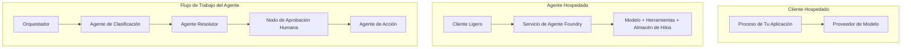
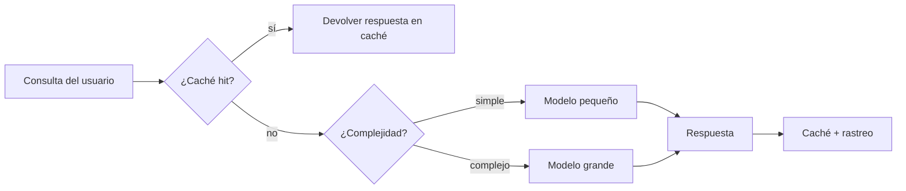
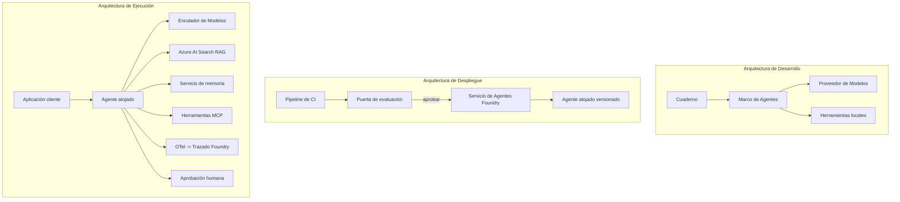

# Desplegando Agentes Escalables con Microsoft Foundry


Hasta este punto en el curso has construido agentes que se ejecutan en tu portátil, dentro de un cuaderno, activados por `az login` y un puñado de variables de entorno. Esa es exactamente la forma correcta de aprender. No es la forma correcta de ejecutar un agente del que miles de clientes dependen a las 3 a.m.

Esta lección trata sobre la brecha entre "funciona en mi máquina" y "funciona, de manera fiable y asequible, en producción". Cerramos esa brecha usando **Microsoft Foundry** y el **Microsoft Foundry Agent Service**, y lo hacemos construyendo un agente real de soporte al cliente que tiene herramientas, recuperación, memoria, evaluación y monitoreo.

## Introducción

Esta lección cubrirá:

- La diferencia entre un **agente prototipo** y un **agente desplegado**, y por qué la transición es principalmente sobre todo lo que está *alrededor* del modelo.
- **Patrones de despliegue** para agentes: alojado en cliente, alojado en servicio (Hosted Agents) y orquestado mediante flujos de trabajo.
- El **ciclo de vida del agente** en Microsoft Foundry — crear, versionar, desplegar, evaluar, observar, retirar.
- **Estrategias de escalado**: enrutamiento de modelos, caching, concurrencia y diseño sin estado.
- **Observabilidad** con OpenTelemetry y rastreo de Foundry.
- **Optimización de costos** a través de selección de modelos, enrutamiento y puertas de evaluación.
- **Consideraciones empresariales**: gobernanza, aprobación humana y ejecución segura de servidores MCP en producción.

## Objetivos de Aprendizaje

Después de completar esta lección, sabrás cómo:

- Elegir el patrón de despliegue correcto para una carga de trabajo de agente dada.
- Desplegar un agente en el Microsoft Foundry Agent Service para que esté versionado, gobernado y sea observable.
- Instrumentar un agente para el rastreo y conectar una canalización de evaluación que se ejecute antes de cada lanzamiento.
- Aplicar enrutamiento de modelos y caching para mantener la latencia y el costo bajo control a escala.
- Añadir una puerta de aprobación humana para acciones de alto riesgo e integrar un servidor MCP de manera segura en producción.

## Prerrequisitos

Esta lección asume que has completado las lecciones anteriores y te sientes cómodo con:

- Construcción de agentes con el [Microsoft Agent Framework](../14-microsoft-agent-framework/README.md) (Lección 14).
- [Uso de Herramientas](../04-tool-use/README.md) (Lección 4) y [RAG Agéntico](../05-agentic-rag/README.md) (Lección 5).
- [Memoria de Agente](../13-agent-memory/README.md) (Lección 13) y [Protocolos Agénticos / MCP](../11-agentic-protocols/README.md) (Lección 11).
- [Observabilidad y Evaluación](../10-ai-agents-production/README.md) (Lección 10) — esta lección se basa directamente en ella.

También necesitarás:

- Una **suscripción de Azure** y un **proyecto Microsoft Foundry** con al menos un modelo de chat desplegado.
- La **CLI de Azure** autenticada (`az login`).
- Python 3.12+ y los paquetes en el repositorio [`requirements.txt`](../../../requirements.txt).

## De Prototipo a Producción: Qué Cambia Realmente

Un agente prototipo y un agente de producción comparten el mismo ciclo central: razonar, llamar a herramientas, responder. Lo que cambia es todo lo envuelto alrededor de ese ciclo. El modelo representa tal vez el 20% de un agente en producción; el otro 80% es el esqueleto operativo.

| Preocupación | Prototipo | Producción |
| --- | --- | --- |
| **Hospedaje** | Corre en tu cuaderno | Corre como un servicio alojado, versionado y desplegado |
| **Identidad** | Tu token de `az login` | Identidad administrada con RBAC limitado |
| **Estado** | En memoria, se pierde al reiniciar | Externalizado (almacén de hilos, servicio de memoria) |
| **Fallas** | Ves el traceback | Reintentos, recuperaciones, buzón de mensajes fallidos, alertas |
| **Costo** | "Son unos centavos" | Rastreado por solicitud, enrutado, cacheado, presupuestado |
| **Calidad** | Revisión manual de salida | Evaluado automáticamente antes de cada lanzamiento |
| **Confianza** | Aprobación manual de cada acción | Políticas + intervención humana para acciones riesgosas |

Ten esta tabla en mente. Cada sección a continuación corresponde a una de estas filas.

## Patrones de Despliegue de Agentes

Hay tres patrones que usarás, a menudo en combinación.

### 1. Agentes Hospedados en Cliente

El objeto agente vive dentro del proceso de *tu* aplicación. Tu código llama directamente al proveedor del modelo; el ciclo de razonamiento se ejecuta en tu servicio. Esto es lo que ha hecho cada lección anterior.

- **Úsalo cuando** necesites control total sobre el ciclo, middleware personalizado, o estés incrustando el agente dentro de un backend existente.
- **Balance**: tú controlas el escalado, estado y resiliencia.

### 2. Agentes Hospedados (Foundry Agent Service)

El agente está *registrado como un recurso* en Microsoft Foundry. Foundry hospeda el ciclo de razonamiento, almacena hilos, aplica seguridad de contenido y RBAC, y hace visible el agente en el portal Foundry. Tu aplicación se convierte en un cliente ligero que crea hilos y lee respuestas.

- **Úsalo cuando** quieras durabilidad, observabilidad integrada, gobernanza y menor superficie operativa.
- **Balance**: menor control a bajo nivel a cambio de un entorno gestionado.

### 3. Flujos de Trabajo de Agente

Varios agentes (y herramientas) se componen en un grafo con control de flujo explícito — pasos secuenciales, ramificaciones, nodos de aprobación humana y puntos de control duraderos que pueden pausar y reanudar. Esta es la capacidad **Workflows** del Microsoft Agent Framework aplicada a escala de despliegue.

- **Úsalo cuando** una única tarea abarque varios agentes especializados o requiera un paso de aprobación en medio.
- **Balance**: más partes móviles; se necesita observabilidad a nivel de orquestación.



## El Ciclo de Vida del Agente en Microsoft Foundry

Desplegar un agente no es un `push` de una sola vez. Es un ciclo, y se parece mucho a un ciclo de lanzamiento de software porque eso es exactamente lo que es.


La idea clave, tomada de la [Lección 10](../10-ai-agents-production/README.md): **la evaluación offline es una puerta, no una ocurrencia tardía.** Una nueva versión de agente no se lanza a menos que supere tus umbrales de evaluación. La observabilidad en línea luego retroalimenta las fallas del mundo real al conjunto de pruebas offline. Ese es todo el ciclo.

## Estrategias de Escalado

Escalar un agente es diferente a escalar una API web sin estado, porque cada solicitud puede desencadenar múltiples llamadas costosas a modelos y herramientas. Cuatro técnicas soportan la mayoría de la carga.

**Manejo sin estado de solicitudes.** No mantengas estado por usuario en la memoria de tu proceso. Persiste los hilos de conversación en el almacén de hilos de Foundry o en un servicio de memoria para que cualquier instancia pueda manejar cualquier solicitud. Esto es lo que permite escalar horizontalmente — agregar instancias, sin sesiones persistentes.

**Enrutamiento de modelos.** No todas las solicitudes necesitan tu modelo más capaz (y costoso). Enruta solicitudes simples — clasificación de intención, respuestas cortas y fácticas — a un modelo pequeño y rápido, y reserva el modelo grande para razonamiento genuino. El **Model Router** de Foundry puede hacer esto por ti, o puedes implementar un clasificador ligero tú mismo. Construirás la versión DIY en el laboratorio.

**Caching de respuestas.** Muchas consultas de soporte son casi duplicados ("¿cómo reinicio mi contraseña?"). Cachea respuestas a preguntas comunes y sírvelas sin consultar al modelo. Incluso una tasa modesta de aciertos en caché reduce significativamente el costo y la latencia.

**Concurrencia y presión de retorno.** Los proveedores de modelos tienen límites de tasa. Limita tu concurrencia, usa reintentos con retroceso exponencial, y falla de forma elegante (una respuesta en cola tipo "estamos en ello" es mejor que un error 500).



## Observabilidad en Producción

No puedes operar lo que no puedes ver. Como se cubrió en la Lección 10, el Microsoft Agent Framework emite rastreos **OpenTelemetry** de forma nativa – cada llamada a modelos, invocación de herramientas y paso de orquestación se convierte en un span. En producción exportas esos spans a Microsoft Foundry (o cualquier backend compatible con OTel) para que puedas:

- Rastrear una queja de cliente de principio a fin a través de cada llamada a modelo y herramienta.
- Observar la latencia p50/p95 y el costo por solicitud a lo largo del tiempo.
- Alertar sobre picos de tasa de errores y anomalías de costo antes que tus usuarios (o tu equipo financiero) lo noten.

```python
from agent_framework.observability import get_tracer

tracer = get_tracer()

with tracer.start_as_current_span("support_request") as span:
    span.set_attribute("customer.tier", "enterprise")
    span.set_attribute("routed.model", "gpt-5-nano")
    # la ejecución del agente se registra automáticamente dentro de este intervalo
```

Atributos como `customer.tier` y `routed.model` son lo que convierte un muro de rastreos en preguntas respondibles ("¿los clientes empresariales son enrutados al modelo pequeño demasiado a menudo?").

## Optimización de Costos

El costo en agentes de producción está dominado por tokens. Tres palancas, en orden de impacto:

1. **Dimensionar adecuadamente el modelo.** Un modelo pequeño que pase tu puerta de evaluación casi siempre es más barato que uno grande que también pase. Usa la evaluación para *probar* que el modelo pequeño es suficientemente bueno en lugar de usar el modelo más grande por precaución.
2. **Enrutar por complejidad.** Como se mencionó — paga precios de modelo grande solo para solicitudes que necesitan razonamiento de modelo grande.
3. **Cachear agresivamente.** La llamada al modelo más barata es la que nunca haces.

Las puertas de evaluación y el control de costos son la misma disciplina vista desde dos ángulos: la evaluación te dice el *piso de calidad*, el enrutamiento y caching te mantienen lo más cerca posible del *costo* de ese piso.

## Consideraciones para Despliegues Empresariales

**Gobernanza.** Los Hosted Agents heredan el RBAC, seguridad de contenido y registro de auditoría de Foundry. Dale a cada agente una identidad administrada con los mínimos privilegios necesarios — acceso solo lectura a la base de conocimiento, acceso limitado a la API de tickets, nada más.

**Intervención humana.** Algunas acciones son demasiado importantes para automatizarse por completo — emitir un reembolso, eliminar una cuenta, escalar a un equipo legal. Microsoft Agent Framework soporta herramientas que requieren **aprobación previa**: el agente propone la acción, la ejecución se pausa, un humano aprueba o rechaza, y el flujo de trabajo continúa. Viste el primitivo en la [Lección 6](../06-building-trustworthy-agents/README.md); aquí lo despliegas.

**MCP en producción.** [MCP](../11-agentic-protocols/README.md) permite que tu agente consuma herramientas externas mediante una interfaz estándar. En producción, trata cada servidor MCP como un límite no confiable: fija la versión del servidor, ejecútalo con una identidad con alcance limitado, valida sus salidas y nunca le expongas secretos. Un servidor MCP es una dependencia, y las dependencias se parchean, auditan y limitan la tasa.



Esos tres diagramas — desarrollo, despliegue, tiempo de ejecución — son el mismo agente en tres etapas de su vida. El laboratorio que sigue te guía en su construcción.

## Laboratorio Práctico: Agente de Soporte al Cliente Listo para Producción

Abre [`code_samples/16-python-agent-framework.ipynb`](./code_samples/16-python-agent-framework.ipynb) y sigue paso a paso. Vas a ensamblar un **agente de soporte al cliente Contoso** con todas las preocupaciones de producción integradas:

1. **Llamada a herramientas** — consulta el estado de pedidos y abre tickets de soporte.
2. **RAG** — responde preguntas de política desde una base de conocimiento (Azure AI Search, con una solución alternativa en memoria para que el cuaderno funcione sin un recurso Search).
3. **Memoria** — recuerda al cliente a lo largo de los turnos de la conversación.
4. **Enrutamiento de modelos** — un clasificador de complejidad enruta cada solicitud a un modelo pequeño o grande.
5. **Caching de respuestas** — preguntas repetidas se sirven desde caché.
6. **Aprobación humana** — los reembolsos por encima de un umbral se pausan para aprobación humana.
7. **Canalización de evaluación** — un pequeño conjunto de pruebas offline puntúa el agente y actúa como puerta de lanzamiento.
8. **Observabilidad** — rastreo OpenTelemetry alrededor de cada solicitud.

### Recorrido

El cuaderno está organizado para que cada preocupación de producción sea una sección autónoma y ejecutable. El corazón es el manejador de solicitudes con enrutamiento y caching:

```python
async def handle_support_request(query: str, customer_id: str) -> str:
    # 1. Servir desde la caché cuando sea posible.
    cached = response_cache.get(normalize(query))
    if cached:
        return cached

    # 2. Enrutar según la complejidad para controlar el costo.
    model = "gpt-5-nano" if is_simple(query) else "gpt-5-mini"

    # 3. Ejecutar el agente dentro de un span de traza para observabilidad.
    with tracer.start_as_current_span("support_request") as span:
        span.set_attribute("routed.model", model)
        span.set_attribute("customer.id", customer_id)
        response = await support_agent.run(query, model=model)

    # 4. Cachear y devolver.
    response_cache.set(normalize(query), response.text)
    return response.text
```

La puerta de evaluación que protege un lanzamiento se ve así:

```python
async def evaluation_gate(agent, test_cases, threshold: float = 0.8) -> bool:
    passed = 0
    for case in test_cases:
        result = await agent.run(case["input"])
        if score_response(result.text, case["expected"]) >= 0.8:
            passed += 1
    pass_rate = passed / len(test_cases)
    print(f"Evaluation pass rate: {pass_rate:.0%} (gate: {threshold:.0%})")
    return pass_rate >= threshold  # desplegar solo si la puerta pasa
```

Lee cada línea — el cuaderno mantiene los primitivos deliberadamente pequeños para que nada esté oculto detrás de una llamada al framework.

## Validación de un Agente Desplegado con Pruebas Básicas

La puerta de evaluación anterior se ejecuta *offline* contra tu objeto agente. Una vez desplegado el agente como Hosted Agent, necesitas una verificación más, aún más simple: **¿el endpoint desplegado está respondiendo realmente?**

Desplegar "con éxito" solo prueba que el plano de control aceptó la definición — no prueba que el agente responda. Una dependencia perdida, un mal enrutamiento de modelos o una conexión expirada pueden dejar un despliegue verde que no devuelve nada. Una **prueba básica** lo detecta en segundos, en cada despliegue, sin el costo de una evaluación completa.

Este repositorio incluye una canalización de prueba básica lista para usar construida sobre la GitHub Action [AI Smoke Test](https://github.com/marketplace/actions/ai-smoke-test):

- **Catálogo** — [`tests/lesson-16-smoke-tests.json`](../../../tests/lesson-16-smoke-tests.json) contiene prompts y aserciones para el agente de soporte Contoso (respuestas fundamentadas en políticas, consulta de pedidos, mantener el tema, y continuidad en conversaciones multi-turno). Los catálogos para agentes de otras lecciones viven junto a él — ver [`tests/README.md`](../tests/README.md).
- **Flujo de trabajo** — [`.github/workflows/smoke-test.yml`](../../../.github/workflows/smoke-test.yml) inicia sesión con Azure OIDC y envía cada prompt al endpoint Responses del agente, fallando el trabajo ante cualquier aserción incorrecta.

```yaml
- name: Smoke-test hosted agent
  uses: JFolberth/ai-smoketest@v1
  with:
    project_endpoint: ${{ inputs.project_endpoint }}
    agent_name: ContosoSupportAgent
    tests_file: tests/lesson-16-smoke-tests.json
```


Ejecútalo desde la pestaña **Actions** una vez que tu agente esté desplegado, proporcionando el endpoint de tu proyecto Foundry y el nombre del agente. La identidad federada necesita el rol **Azure AI User** en el ámbito del proyecto Foundry. Piensa en las capas como una pirámide: las pruebas básicas (¿accesible y responde?) se ejecutan en cada despliegue, la evaluación offline (¿suficientemente buena para lanzar?) se ejecuta antes de la promoción, y la evaluación online (¿cómo está funcionando en el entorno real?) se ejecuta de forma continua.

## Verificación de Conocimientos

Prueba tu comprensión antes de pasar a la asignación.

**1. Aproximadamente ¿qué porcentaje de un agente en producción es "el modelo" y qué representa el resto?**

<details>
<summary>Respuesta</summary>

El modelo es una minoría del sistema — a menudo se cita alrededor del 20%. El resto es el esqueleto operativo: hospedaje y versionado, identidad y RBAC, estado externalizado, manejo de fallos, seguimiento de costos, evaluación y controles humano en el bucle. Pasar a producción es principalmente construir todo *alrededor* del ciclo de razonamiento.
</details>

**2. ¿Cuándo elegirías un Agente Hospedado sobre un agente hospedado en cliente?**

<details>
<summary>Respuesta</summary>

Cuando deseas un entorno gestionado con durabilidad incorporada (hilos que persisten y pueden continuar), observabilidad, seguridad de contenido y RBAC, y estás dispuesto a sacrificar algo del control de bajo nivel del ciclo de razonamiento para reducir la superficie operativa. Hospedar en cliente es preferible cuando necesitas control total sobre el ciclo o estás integrando el agente en un backend existente.
</details>

**3. ¿Por qué un agente escalable debe ser sin estado en su propia memoria de proceso?**

<details>
<summary>Respuesta</summary>

Para que cualquier instancia pueda manejar cualquier solicitud, lo que permite el escalado horizontal sin sesiones pegajosas. El estado de conversación por usuario se externaliza en un almacén de hilos o servicio de memoria. Si el estado viviera en la memoria del proceso, se perdería al reiniciar y no podrías distribuir la carga libremente.
</details>

**4. ¿Qué problema resuelve el enrutamiento del modelo y cómo se relaciona con la evaluación?**

<details>
<summary>Respuesta</summary>

El enrutamiento envía solicitudes simples a un modelo pequeño, barato y rápido y reserva el modelo grande para el razonamiento genuino, controlando tanto la latencia como el costo. Se relaciona con la evaluación porque esta es la que *demuestra* que el modelo pequeño es suficientemente bueno para una clase de solicitudes — el enrutamiento sin evaluación es una suposición.
</details>

**5. ¿Qué es una "puerta de evaluación" y dónde se sitúa en el ciclo de vida?**

<details>
<summary>Respuesta</summary>

Una puerta de evaluación ejecuta un conjunto de pruebas offline contra una nueva versión del agente y bloquea el despliegue a menos que la tasa de aprobación supere un umbral. Se sitúa entre "versión" y "despliegue" en el ciclo de vida, haciendo de la calidad una condición previa para la liberación en lugar de algo que se verifica después del lanzamiento.
</details>

**6. ¿Por qué el servidor MCP debe tratarse como un límite no confiable en producción?**

<details>
<summary>Respuesta</summary>

Porque es una dependencia externa a la que llama tu agente. Debes fijar su versión, ejecutarlo con una identidad limitada, validar sus salidas, limitar su tasa y nunca exponerle secretos — la misma disciplina que aplicas a cualquier dependencia de terceros. Sus salidas alimentan el razonamiento de tu agente, por lo que la confianza no validada es un riesgo de seguridad.
</details>

**7. ¿Qué cambio único usualmente tiene el mayor impacto en el costo de un agente en producción y por qué?**

<details>
<summary>Respuesta</summary>

Ajustar el tamaño del modelo — usar el modelo más pequeño que aún pase tu puerta de evaluación. El costo está dominado por los tokens, y un modelo más pequeño que cumple con el nivel de calidad es casi siempre más barato que uno más grande. Luego el almacenamiento en caché y el enrutamiento reducen aún más el costo, pero elegir el modelo base correcto tiene el mayor efecto de primer orden.
</details>

**8. ¿Qué papel juegan atributos de span como `customer.tier` y `routed.model` en la observabilidad?**

<details>
<summary>Respuesta</summary>

Transforman trazas crudas en preguntas comerciales que se pueden responder. Sin atributos tienes un muro de spans; con ellos puedes preguntar "¿los clientes empresariales están siendo dirigidos al modelo pequeño con demasiada frecuencia?" o "¿qué modelo maneja nuestras solicitudes más lentas?" Los atributos son cómo segmentas la telemetría por las dimensiones que importan para tu operación.
</details>

## Asignación

Toma el agente de soporte al cliente del laboratorio y refuérzalo para un escenario específico: **un agente de soporte de facturación por suscripción para una empresa SaaS.**

Tu entrega debe:

1. **Reemplazar las herramientas** con las relevantes para facturación: `get_subscription_status`, `get_invoice` y `issue_credit` (créditos superiores a $50 requieren aprobación humana).
2. **Agregar tres documentos RAG** que cubran la política de reembolso de la empresa, el ciclo de facturación y la política de cancelación.
3. **Extender el conjunto de evaluación** a al menos ocho casos, incluyendo al menos dos que *deberían* activar el camino de aprobación humana, y confirmar que tu puerta de evaluación aprueba o falla correctamente.
4. **Agregar un informe de costos**: después de ejecutar diez consultas mixtas a través del agente, imprimir cuántas fueron al modelo pequeño, cuántas al modelo grande y cuántas se sirvieron desde caché.

Escribe un párrafo corto (en una celda markdown) explicando qué regla de enrutamiento de modelo elegiste y cómo la validarías con tráfico real. No hay una única respuesta correcta — serás evaluado en función de si las preocupaciones de producción están integradas coherentemente.

## Resumen

En esta lección moviste un agente de prototipo a producción con Microsoft Foundry:

- El salto a producción es principalmente sobre el **esqueleto operativo** alrededor del modelo — hospedaje, identidad, estado, manejo de fallos, costos, calidad y confianza.
- Aprendiste los tres **patrones de despliegue** — cliente hospedado, Agentes Hospedados y Flujos de trabajo de Agentes — y cuándo aplicar cada uno.
- Recorriste el **ciclo de vida del agente**, donde la **evaluación offline actúa como puerta de liberación** y la observabilidad online retroalimenta fallos al conjunto de pruebas.
- Aplicaste **estrategias de escalado** — diseño sin estado, enrutamiento de modelos, caché y concurrencia limitada — y las conectaste con la **optimización de costos**.
- Integramos **controles empresariales**: RBAC, aprobación humana en el ciclo y una integración MCP segura para producción.
- Construiste un **agente de soporte al cliente listo para producción** que enlaza todas estas preocupaciones en código ejecutable.

La siguiente lección toma el camino opuesto: en vez de escalar agentes hasta la nube, los llevarás *hacia abajo* a una sola máquina de desarrollador y los ejecutarás completamente localmente.

## Recursos Adicionales

- <a href="https://learn.microsoft.com/azure/ai-foundry/what-is-azure-ai-foundry" target="_blank">Documentación de Microsoft Foundry</a>
- <a href="https://learn.microsoft.com/azure/ai-foundry/agents/overview" target="_blank">Descripción general del servicio Microsoft Foundry Agent</a>
- <a href="https://learn.microsoft.com/en-us/agent-framework/overview/?wt.mc_id=youtube_26688_organicsocial_reactor&pivots=programming-language-python" target="_blank">Microsoft Agent Framework</a>
- <a href="https://learn.microsoft.com/azure/ai-foundry/concepts/model-router" target="_blank">Router de modelo en Microsoft Foundry</a>
- <a href="https://learn.microsoft.com/azure/search/search-what-is-azure-search" target="_blank">Azure AI Search</a>
- <a href="https://opentelemetry.io/" target="_blank">OpenTelemetry</a>
- <a href="https://github.com/marketplace/actions/ai-smoke-test" target="_blank">AI Smoke Test GitHub Action</a>
- <a href="https://modelcontextprotocol.io/" target="_blank">Model Context Protocol (MCP)</a>

## Lección Anterior

[Construcción de Agentes de Uso Informático (CUA)](../15-browser-use/README.md)

## Próxima Lección

[Creación de Agentes AI Locales](../17-creating-local-ai-agents/README.md)

---

<!-- CO-OP TRANSLATOR DISCLAIMER START -->
**Descargo de responsabilidad**:
Este documento ha sido traducido utilizando el servicio de traducción automática [Co-op Translator](https://github.com/Azure/co-op-translator). Aunque nos esforzamos por la precisión, tenga en cuenta que las traducciones automatizadas pueden contener errores o inexactitudes. El documento original en su idioma nativo debe considerarse la fuente autorizada. Para información crítica, se recomienda una traducción profesional humana. No somos responsables de cualquier malentendido o interpretación errónea que surja del uso de esta traducción.
<!-- CO-OP TRANSLATOR DISCLAIMER END -->