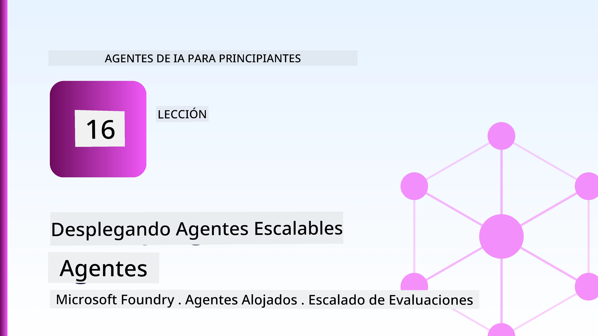
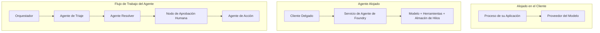
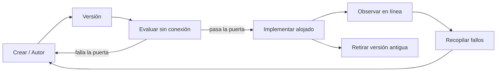
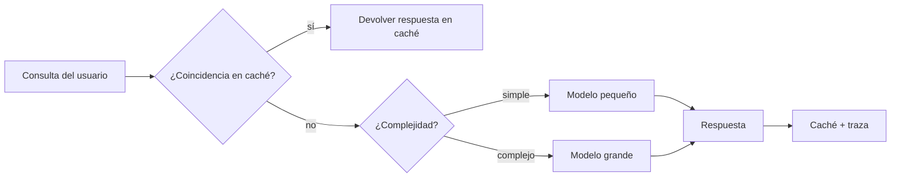
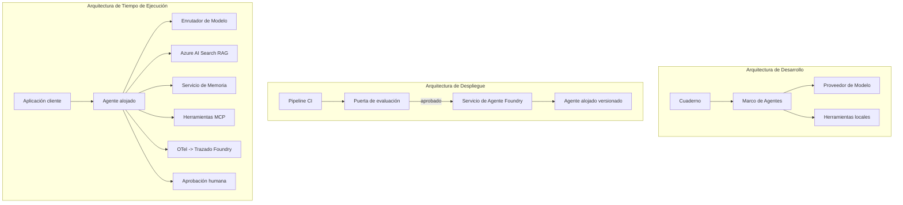

# Despliegue de Agentes Escalables con Microsoft Foundry



Hasta este punto en el curso, has construido agentes que se ejecutan en tu portátil, dentro de un cuaderno, impulsados por `az login` y un puñado de variables de entorno. Esa es la forma correcta de aprender. No es la forma correcta de ejecutar un agente del que miles de clientes dependen a las 3 a.m.

Esta lección trata sobre la brecha entre "funciona en mi máquina" y "funciona, de manera confiable y asequible, en producción". Cerramos esa brecha usando **Microsoft Foundry** y el **Servicio de Agentes de Microsoft Foundry**, y lo hacemos construyendo un agente real de soporte al cliente que tiene herramientas, recuperación, memoria, evaluación y monitoreo.

## Introducción

Esta lección cubrirá:

- La diferencia entre un **agente prototipo** y un **agente desplegado**, y por qué la transición se trata principalmente de todo lo que *rode* al modelo.
- **Patrones de despliegue** para agentes: hospedados en cliente, hospedados como servicio (Agentes Hospedados), y orquestados por flujo de trabajo.
- El **ciclo de vida del agente** en Microsoft Foundry — crear, versionar, desplegar, evaluar, observar, retirar.
- **Estrategias de escalado**: enrutamiento de modelo, caché, concurrencia y diseño sin estado.
- **Observabilidad** con OpenTelemetry y rastreo de Foundry.
- **Optimización de costos** mediante selección de modelo, enrutamiento y puertas de evaluación.
- **Consideraciones empresariales**: gobernanza, aprobación humana y ejecución segura de servidores MCP en producción.

## Objetivos de Aprendizaje

Después de completar esta lección, sabrás cómo:

- Elegir el patrón de despliegue adecuado para una carga de trabajo de agente dada.
- Desplegar un agente en el Servicio de Agentes de Microsoft Foundry para que esté versionado, gobernado y observable.
- Instrumentar un agente para el rastreo y conectar una tubería de evaluación que se ejecuta antes de cada lanzamiento.
- Aplicar enrutamiento de modelos y caché para mantener la latencia y el costo bajo control a escala.
- Añadir una puerta de aprobación humana para acciones de alto riesgo e integrar un servidor MCP de manera segura en producción.

## Prerrequisitos

Esta lección asume que has completado las lecciones anteriores y estás cómodo con:

- Construir agentes con el [Microsoft Agent Framework](../14-microsoft-agent-framework/README.md) (Lección 14).
- [Uso de Herramientas](../04-tool-use/README.md) (Lección 4) y [Agentic RAG](../05-agentic-rag/README.md) (Lección 5).
- [Memoria de Agente](../13-agent-memory/README.md) (Lección 13) y [Protocolos Agénticos / MCP](../11-agentic-protocols/README.md) (Lección 11).
- [Observabilidad y Evaluación](../10-ai-agents-production/README.md) (Lección 10) — esta lección se basa directamente en ella.

También necesitarás:

- Una **suscripción de Azure** y un **proyecto Microsoft Foundry** con al menos un modelo de chat desplegado.
- La **CLI de Azure** autenticada (`az login`).
- Python 3.12+ y los paquetes en el repositorio [`requirements.txt`](../../../requirements.txt).

## De Prototipo a Producción: Qué Cambia Realmente

Un agente prototipo y un agente en producción comparten el mismo ciclo central — razonar, llamar a herramientas, responder. Lo que cambia es todo lo que envuelve ese ciclo. El modelo es quizás el 20% de un agente en producción; el otro 80% es el esqueleto operativo.

| Aspecto | Prototipo | Producción |
| --- | --- | --- |
| **Hospedaje** | Se ejecuta en tu cuaderno | Se ejecuta como un servicio hospedado, versionado y desplegado |
| **Identidad** | Tu token de `az login` | Identidad administrada con RBAC con alcance |
| **Estado** | En memoria, perdido al reiniciar | Externalizado (almacén de hilos, servicio de memoria) |
| **Fallos** | Ves la traza de error | Reintentos, recuperaciones, buzón de mensajes fallidos, alertas |
| **Costo** | "Es unos centavos" | Rastreado por solicitud, enrutado, cacheado, presupuestado |
| **Calidad** | Evalúas visualmente la salida | Evaluado automáticamente antes de cada lanzamiento |
| **Confianza** | Apruebas cada acción | Política + intervención humana para acciones riesgosas |

Ten esta tabla en mente. Cada sección a continuación corresponde a una de estas filas.

## Patrones de Despliegue de Agentes

Hay tres patrones que usarás, a menudo en combinación.

### 1. Agentes Hospedados en el Cliente

El objeto agente vive dentro del proceso *de tu* aplicación. Tu código llama directamente al proveedor del modelo; el ciclo de razonamiento se ejecuta en tu servicio. Esto es lo que se ha hecho en todas las lecciones anteriores.

- **Úsalo cuando** necesitas control total sobre el ciclo, middleware personalizado, o estás integrando el agente dentro de un backend existente.
- **Compromiso**: tú gestionas el escalado, el estado y la resiliencia.

### 2. Agentes Hospedados (Servicio de Agentes Foundry)

El agente está *registrado como un recurso* en Microsoft Foundry. Foundry hospeda el ciclo de razonamiento, almacena los hilos, aplica las políticas de seguridad de contenido y RBAC, y hace visible el agente en el portal de Foundry. Tu aplicación se convierte en un cliente liviano que crea hilos y lee respuestas.

- **Úsalo cuando** quieras durabilidad, observabilidad incorporada, gobernanza y una menor superficie operativa.
- **Compromiso**: menos control a bajo nivel a cambio de un entorno administrado.

### 3. Flujos de Trabajo de Agentes

Múltiples agentes (y herramientas) se componen en un grafo con flujo de control explícito — pasos secuenciales, bifurcaciones, nodos de aprobación humana y puntos de control duraderos que pueden pausar y reanudar. Esta es la capacidad de **Flujos de Trabajo** del Microsoft Agent Framework aplicada a escala de despliegue.

- **Úsalo cuando** una sola tarea abarca varios agentes especializados o requiere un paso de aprobación en medio.
- **Compromiso**: más piezas móviles; necesita observabilidad a nivel de orquestación.



## El Ciclo de Vida del Agente en Microsoft Foundry

Desplegar un agente no es un `push` de una sola vez. Es un ciclo, y se parece mucho a un ciclo de lanzamiento de software porque eso es exactamente lo que es.



La idea clave, tomada de la [Lección 10](../10-ai-agents-production/README.md): **la evaluación offline es una puerta, no un pensamiento posterior.** Una nueva versión del agente no se lanza a menos que supere tus umbrales de evaluación. La observabilidad en línea luego retroalimenta fallos reales al conjunto de pruebas offline. Ese es todo el ciclo.

## Estrategias de Escalado

Escalar un agente es diferente de escalar una API web sin estado, porque cada solicitud puede activar múltiples llamadas costosas a modelos y herramientas. Cuatro técnicas cargan la mayor parte:

**Manejo de solicitudes sin estado.** No guardes estado por usuario en la memoria de tu proceso. Persiste los hilos de conversación en el almacén de hilos de Foundry o en un servicio de memoria para que cualquier instancia pueda manejar cualquier solicitud. Esto permite escalar horizontalmente — agrega instancias, sin sesiones pegajosas.

**Enrutamiento de modelos.** No todas las solicitudes necesitan tu modelo más capaz (y más caro). Enruta solicitudes simples — clasificación de intención, respuestas cortas y factuales — a un modelo pequeño y rápido, y reserva el modelo grande para razonamiento genuino. El **Enrutador de Modelo** de Foundry puede hacer esto por ti, o puedes implementar un clasificador ligero tú mismo. Construirás la versión DIY en el laboratorio.

**Caché de respuestas.** Muchas consultas de soporte son casi duplicados ("¿cómo restablezco mi contraseña?"). Cachea respuestas a preguntas comunes y sírvelas sin llamar al modelo. Incluso una tasa modesta de caché reduce significativamente costo y latencia.

**Concurrencia y presión de retorno.** Los proveedores de modelos tienen límites de tasa. Limita tu concurrencia, usa reintentos con retroceso exponencial, y falla con gracia (una respuesta en cola tipo "estamos en ello" es mejor que un error 500).



## Observabilidad en Producción

No puedes operar lo que no puedes ver. Como se cubrió en la Lección 10, el Microsoft Agent Framework emite rastreos **OpenTelemetry** de forma nativa — cada llamada a modelo, invocación de herramienta y paso de orquestación se convierte en un span. En producción exportas esos spans a Microsoft Foundry (o cualquier backend compatible con OTel) para:

- Rastrear una queja de cliente end-to-end a través de cada llamada a modelo y herramienta.
- Monitorear latencias p50/p95 y costos por solicitud a lo largo del tiempo.
- Alertar sobre picos en la tasa de errores y anomalías de costo antes que tus usuarios (o el equipo financiero) las noten.

```python
from agent_framework.observability import get_tracer

tracer = get_tracer()

with tracer.start_as_current_span("support_request") as span:
    span.set_attribute("customer.tier", "enterprise")
    span.set_attribute("routed.model", "gpt-5-nano")
    # la ejecución del agente se rastrea automáticamente dentro de este intervalo
```

Atributos como `customer.tier` y `routed.model` son los que convierten un muro de rastreos en preguntas respondibles ("¿los clientes empresariales son enrutados al modelo pequeño con demasiada frecuencia?").

## Optimización de Costos

El costo en agentes de producción está dominado por tokens. Tres palancas, de mayor a menor impacto:

1. **Dimensionar correctamente el modelo.** Un modelo pequeño que pase tu puerta de evaluación casi siempre es más barato que uno grande que también pasa. Usa la evaluación para *demostrar* que el modelo pequeño es suficientemente bueno en lugar de optar por el modelo más grande por precaución.
2. **Enrutar por complejidad.** Como se dijo antes — paga precios de modelo grande solo por solicitudes que necesitan razonamiento de modelo grande.
3. **Cachear agresivamente.** La llamada a modelo más barata es la que nunca haces.

Las puertas de evaluación y el control de costos son la misma disciplina vista desde dos ángulos: la evaluación te indica el *piso de calidad*, el enrutamiento y caché te mantienen lo más cerca posible del *costo* de ese piso.

## Consideraciones para Despliegue Empresarial

**Gobernanza.** Los Agentes Hospedados heredan el RBAC, la seguridad de contenido y el registro de auditoría de Foundry. Asigna a cada agente una identidad administrada con el menor privilegio necesario — acceso sólo lectura a la base de conocimiento, acceso limitado a la API de tickets, nada más.

**Intervención humana.** Algunas acciones son demasiado importantes para automatizar por completo — emitir un reembolso, borrar una cuenta, escalar a un equipo legal. El Microsoft Agent Framework soporta herramientas que **requieren aprobación**: el agente propone la acción, la ejecución se pausa, un humano aprueba o rechaza, y el flujo de trabajo continúa. Viste el primitivo en la [Lección 6](../06-building-trustworthy-agents/README.md); aquí lo despliegas.

**MCP en producción.** [MCP](../11-agentic-protocols/README.md) permite que tu agente consuma herramientas externas mediante una interfaz estándar. En producción, trata cada servidor MCP como un límite no confiable: fija la versión del servidor, ejecútalo con una identidad con alcance, valida sus salidas y nunca le expongas secretos. Un servidor MCP es una dependencia, y las dependencias se parchean, auditan y limitan.



Esos tres diagramas — desarrollo, despliegue, tiempo de ejecución — son el mismo agente en tres etapas de su vida. El laboratorio que sigue te guía para construirlo.

## Laboratorio Práctico: Un Agente de Soporte al Cliente Listo para Producción

Abre [`code_samples/16-python-agent-framework.ipynb`](./code_samples/16-python-agent-framework.ipynb) y trabaja con él de principio a fin. Ensamblarás un **agente de soporte al cliente de Contoso** con todas las preocupaciones de producción integradas:

1. **Llamadas a herramientas** — consulta estado de orden y abre tickets de soporte.
2. **RAG** — responde preguntas de políticas desde una base de conocimiento (Azure AI Search, con una solución alternativa en memoria para que el cuaderno funcione sin recurso Search).
3. **Memoria** — recuerda al cliente a lo largo de las interacciones.
4. **Enrutamiento de modelo** — un clasificador de complejidad envía cada solicitud a un modelo pequeño o grande.
5. **Caché de respuestas** — preguntas repetidas se sirven desde caché.
6. **Aprobación humana** — reembolsos por encima de un umbral se pausan para autorización humana.
7. **Tubería de evaluación** — un conjunto pequeño de pruebas offline califica al agente y actúa como puerta de lanzamiento.
8. **Observabilidad** — rastreo OpenTelemetry alrededor de cada solicitud.

### Recorrido

El cuaderno está organizado para que cada preocupación de producción sea una sección autónoma y ejecutable. El corazón es el manejador de solicitudes con enrutamiento y caché:

```python
async def handle_support_request(query: str, customer_id: str) -> str:
    # 1. Servir desde la caché cuando sea posible.
    cached = response_cache.get(normalize(query))
    if cached:
        return cached

    # 2. Enrutar por complejidad para controlar el costo.
    model = "gpt-5-nano" if is_simple(query) else "gpt-5-mini"

    # 3. Ejecutar el agente dentro de un span de traza para observabilidad.
    with tracer.start_as_current_span("support_request") as span:
        span.set_attribute("routed.model", model)
        span.set_attribute("customer.id", customer_id)
        response = await support_agent.run(query, model=model)

    # 4. Almacenar en caché y devolver.
    response_cache.set(normalize(query), response.text)
    return response.text
```

La puerta de evaluación que protege un lanzamiento es así:

```python
async def evaluation_gate(agent, test_cases, threshold: float = 0.8) -> bool:
    passed = 0
    for case in test_cases:
        result = await agent.run(case["input"])
        if score_response(result.text, case["expected"]) >= 0.8:
            passed += 1
    pass_rate = passed / len(test_cases)
    print(f"Evaluation pass rate: {pass_rate:.0%} (gate: {threshold:.0%})")
    return pass_rate >= threshold  # implementar solo si la puerta pasa
```

Lee cada línea — el cuaderno mantiene los primitivos deliberadamente pequeños para que nada quede oculto tras una llamada a framework.

## Validando un Agente Desplegado con Pruebas de Humo

La puerta de evaluación anterior se ejecuta *offline* contra tu objeto agente. Una vez que el agente está desplegado como Agente Hospedado, necesitas una chequeo más, aún más barato: **¿el endpoint desplegado realmente responde?**

Desplegar "exitosamente" sólo prueba que el plano de control aceptó la definición — no prueba que el agente responda. Una dependencia faltante, un enrutamiento de modelo incorrecto o una conexión expirada puede dejar un despliegue verde que no devuelve nada. Una **prueba de humo** detecta eso en segundos, en cada despliegue, sin el costo de una evaluación completa.

Este repositorio incluye una tubería de prueba de humo lista para usar basada en la acción GitHub [AI Smoke Test](https://github.com/marketplace/actions/ai-smoke-test):

- **Catálogo** — [`tests/lesson-16-smoke-tests.json`](../../../tests/lesson-16-smoke-tests.json) contiene solicitudes y aserciones para el agente de soporte de Contoso (respuestas fundamentadas en políticas, consulta de orden, mantenerse en tema y continuidad de hilo multi-turno). Catálogos para agentes de otras lecciones están junto a él — vea [`tests/README.md`](../tests/README.md).
- **Flujo de trabajo** — [`.github/workflows/smoke-test.yml`](../../../.github/workflows/smoke-test.yml) inicia sesión con Azure OIDC y envía cada solicitud al endpoint Responses del agente, fallando el trabajo ante cualquier aserción fallida.

```yaml
- name: Smoke-test hosted agent
  uses: JFolberth/ai-smoketest@v1
  with:
    project_endpoint: ${{ inputs.project_endpoint }}
    agent_name: ContosoSupportAgent
    tests_file: tests/lesson-16-smoke-tests.json
```


Ejecútalo desde la pestaña **Actions** una vez que tu agente esté desplegado, proporcionando el endpoint de tu proyecto Foundry y el nombre del agente. La identidad federada necesita el rol **Azure AI User** en el alcance del proyecto Foundry. Piensa en las capas como una pirámide: las pruebas de humo (¿alcanzable y responde?) se ejecutan en cada despliegue, la evaluación offline (¿lo suficientemente bueno para lanzar?) se ejecuta antes de la promoción, y la evaluación online (¿cómo está funcionando en el entorno real?) se ejecuta continuamente.

## Comprobación de Conocimientos

Pon a prueba tu comprensión antes de pasar a la tarea.

**1. Aproximadamente, ¿qué parte de un agente en producción es "el modelo" y qué es el resto?**

<details>
<summary>Respuesta</summary>

El modelo es una minoría del sistema — a menudo se cita alrededor del 20%. El resto es el esqueleto operativo: alojamiento y versionado, identidad y RBAC, estado externalizado, manejo de fallos, seguimiento de costos, evaluación y controles con intervención humana. Pasar a producción es en gran parte construir todo *alrededor* del bucle de razonamiento.
</details>

**2. ¿Cuándo elegirías un Agente Hospedado en vez de un agente alojado en el cliente?**

<details>
<summary>Respuesta</summary>

Cuando deseas un entorno gestionado con durabilidad incorporada (hilos que persisten y pueden reanudarse), observabilidad, seguridad de contenido y RBAC, y estás dispuesto a intercambiar algo de control de bajo nivel del bucle de razonamiento por una menor superficie operativa. Hospedado en cliente es preferible cuando necesitas control total sobre el bucle o cuando estás integrando el agente en un backend existente.
</details>

**3. ¿Por qué un agente escalable debe ser sin estado en su propia memoria de proceso?**

<details>
<summary>Respuesta</summary>

Para que cualquier instancia pueda manejar cualquier solicitud, lo que permite escalado horizontal sin sesiones adhesivas. El estado de la conversación por usuario se externaliza a una tienda de hilos o servicio de memoria. Si el estado viviera en la memoria del proceso, se perdería en el reinicio y no se podría distribuir la carga libremente.
</details>

**4. ¿Qué problema resuelve la enrutación de modelos y cómo se relaciona con la evaluación?**

<details>
<summary>Respuesta</summary>

La enrutación envía solicitudes simples a un modelo pequeño, barato y rápido y reserva el modelo grande para el razonamiento genuino, controlando tanto la latencia como el costo. Se relaciona con la evaluación porque la evaluación es lo que *demuestra* que el modelo pequeño es lo suficientemente bueno para una clase de solicitudes — enrutamiento sin evaluación es suponer.
</details>

**5. ¿Qué es una "puerta de evaluación" y dónde se sitúa en el ciclo de vida?**

<details>
<summary>Respuesta</summary>

Una puerta de evaluación ejecuta un conjunto de pruebas offline contra una nueva versión del agente y bloquea el despliegue a menos que la tasa de aprobación supere un umbral. Se sitúa entre "versión" y "despliegue" en el ciclo de vida, haciendo que la calidad sea una precondición para la liberación en lugar de algo que se verifica después del lanzamiento.
</details>

**6. ¿Por qué debe considerarse un servidor MCP como un límite no confiable en producción?**

<details>
<summary>Respuesta</summary>

Porque es una dependencia externa a la que tu agente llama. Debes fijar su versión, ejecutarlo con una identidad con alcance limitado, validar sus salidas, limitar la tasa de solicitudes y nunca exponerle secretos — la misma disciplina que aplicas a cualquier dependencia de terceros. Sus salidas fluyen hacia el razonamiento de tu agente, por lo que confiar sin validación es un riesgo de seguridad.
</details>

**7. ¿Qué cambio único suele tener el mayor impacto en el costo del agente en producción y por qué?**

<details>
<summary>Respuesta</summary>

Ajustar el tamaño del modelo — usar el modelo más pequeño que aún pasa tu puerta de evaluación. El costo está dominado por los tokens, y un modelo más pequeño que cumple con la barra de calidad casi siempre es más barato que uno más grande. La caché y la enrutación reducen aún más el costo, pero elegir el modelo base correcto tiene el mayor efecto de primer orden.
</details>

**8. ¿Qué papel juegan los atributos de span como `customer.tier` y `routed.model` en la observabilidad?**

<details>
<summary>Respuesta</summary>

Convierten trazas sin procesar en preguntas empresariales que se pueden responder. Sin atributos tienes un muro de spans; con ellos puedes preguntar "¿se están enviando los clientes empresariales al modelo pequeño con demasiada frecuencia?" o "¿qué modelo maneja nuestras solicitudes más lentas?" Los atributos son cómo segmentas la telemetría por las dimensiones que importan para tu operación.
</details>

## Tarea

Toma el agente de soporte al cliente del laboratorio y refuérzalo para un escenario específico: **un agente de soporte para facturación de suscripciones para una empresa SaaS.**

Tu entrega debe:

1. **Reemplazar las herramientas** con otras relevantes para facturación: `get_subscription_status`, `get_invoice` y `issue_credit` (los créditos superiores a $50 requieren aprobación humana).
2. **Agregar tres documentos RAG** que cubran la política de reembolsos de la empresa, ciclo de facturación y política de cancelación.
3. **Extender el conjunto de evaluación** a al menos ocho casos, incluyendo al menos dos que *deben* activar la ruta de aprobación humana, y confirmar que tu puerta de evaluación aprueba o falla correctamente.
4. **Agregar un informe de costos**: después de ejecutar diez consultas mixtas a través del agente, imprime cuántas fueron al modelo pequeño, cuántas al modelo grande y cuántas se sirvieron desde la caché.

Escribe un párrafo corto (en una celda markdown) explicando qué regla de enrutamiento de modelos elegiste y cómo la validarías con tráfico real. No hay una única respuesta correcta — se evaluará si las preocupaciones de producción están enlazadas de manera coherente.

## Resumen

En esta lección moviste un agente de prototipo a producción con Microsoft Foundry:

- El salto a producción es principalmente sobre el **esqueleto operativo** alrededor del modelo — alojamiento, identidad, estado, manejo de fallos, costo, calidad y confianza.
- Aprendiste los tres **patrones de despliegue** — alojado en cliente, Agentes Hospedados y Flujos de Trabajo de Agentes — y cuándo aplica cada uno.
- Recorriste el **ciclo de vida del agente**, donde la evaluación offline **actúa como una puerta de lanzamiento** y la observabilidad online retroalimenta fallos al conjunto de pruebas.
- Aplicaste **estrategias de escalado** — diseño sin estado, enrutamiento de modelos, caché y concurrencia limitada — y las conectaste a la **optimización de costos**.
- Integraste **controles empresariales**: RBAC, aprobación humana en el bucle y una integración MCP segura para producción.
- Construiste un **agente de soporte al cliente listo para producción** que une todas estas preocupaciones en código ejecutable.

La próxima lección toma el camino opuesto: en lugar de escalar agentes hacia la nube, los llevarás *hacia abajo* a una sola máquina de desarrollo y los ejecutarás completamente de forma local.

## Recursos Adicionales

- <a href="https://learn.microsoft.com/azure/ai-foundry/what-is-azure-ai-foundry" target="_blank">Documentación de Microsoft Foundry</a>
- <a href="https://learn.microsoft.com/azure/ai-foundry/agents/overview" target="_blank">Resumen del Servicio de Agentes de Microsoft Foundry</a>
- <a href="https://learn.microsoft.com/en-us/agent-framework/overview/?wt.mc_id=youtube_26688_organicsocial_reactor&pivots=programming-language-python" target="_blank">Microsoft Agent Framework</a>
- <a href="https://learn.microsoft.com/azure/ai-foundry/concepts/model-router" target="_blank">Enrutador de Modelos en Microsoft Foundry</a>
- <a href="https://learn.microsoft.com/azure/search/search-what-is-azure-search" target="_blank">Azure AI Search</a>
- <a href="https://opentelemetry.io/" target="_blank">OpenTelemetry</a>
- <a href="https://github.com/marketplace/actions/ai-smoke-test" target="_blank">Acción AI Smoke Test en GitHub</a>
- <a href="https://modelcontextprotocol.io/" target="_blank">Protocolo de Contexto de Modelos (MCP)</a>

## Lección Anterior

[Construyendo Agentes de Uso de Computadora (CUA)](../15-browser-use/README.md)

## Próxima Lección

[Creando Agentes AI Locales](../17-creating-local-ai-agents/README.md)

---

<!-- CO-OP TRANSLATOR DISCLAIMER START -->
**Descargo de responsabilidad**:
Este documento ha sido traducido utilizando el servicio de traducción automática [Co-op Translator](https://github.com/Azure/co-op-translator). Aunque nos esforzamos por la precisión, tenga en cuenta que las traducciones automatizadas pueden contener errores o inexactitudes. El documento original en su idioma nativo debe considerarse la fuente autorizada. Para información crítica, se recomienda una traducción profesional humana. No somos responsables de cualquier malentendido o interpretación errónea que surja del uso de esta traducción.
<!-- CO-OP TRANSLATOR DISCLAIMER END -->