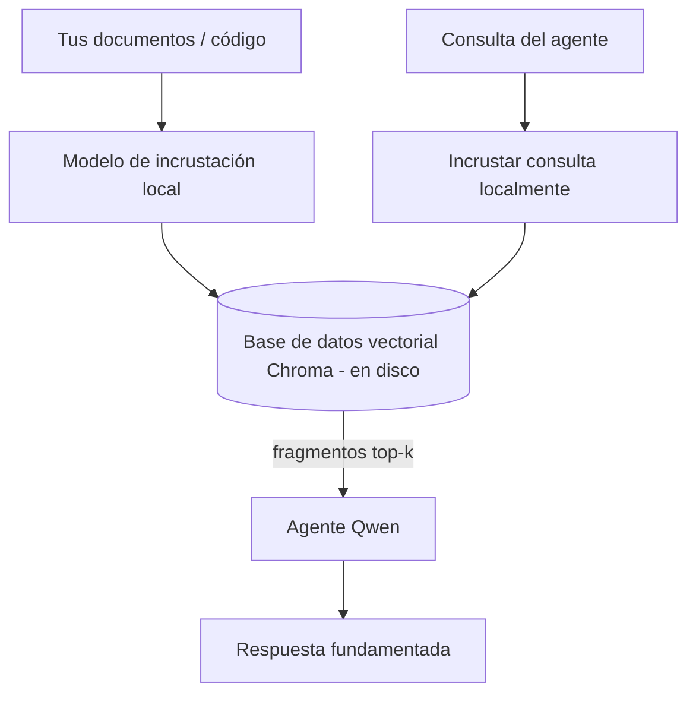
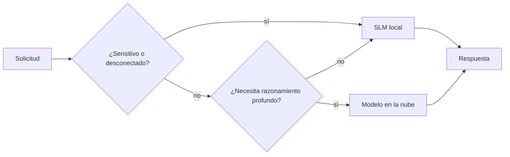

# Creación de Agentes de IA Locales Usando Microsoft Foundry Local y Qwen


La lección anterior aumentó la escala de los agentes *hacia arriba* en la nube. Esta los trae *hacia abajo* a una sola máquina. Al final tendrás un asistente de ingeniería funcional que razona, usa herramientas, lee tus archivos y busca en tu documentación — **sin una sola llamada de inferencia en la nube.**

¿Por qué querrías eso? Tres razones que surgen constantemente en el trabajo de ingeniería real:

- **Privacidad.** El código y los documentos nunca salen de la máquina. Ningún prompt, fragmento o dato del cliente cruza el límite de red.
- **Costo.** La inferencia local no tiene factura por token. Puedes iterar todo el día por el costo de la electricidad.
- **Sin conexión.** En un avión, en una instalación segura o durante un corte, el agente sigue funcionando.

La desventaja es que estás intercambiando un modelo de frontera en la nube por un **Modelo de Lenguaje Pequeño (SLM)** que se ejecuta en tu CPU, GPU o NPU. Esta lección trata de construir agentes que sean *buenos* dentro de esa limitación, en lugar de pretender que la limitación no existe.

## Introducción

Esta lección cubrirá:

- **Modelos de Lenguaje Pequeños (SLMs)** — qué son, dónde destacan y dónde no.
- **Microsoft Foundry Local** — un entorno de ejecución que descarga y sirve modelos en el dispositivo a través de una **API compatible con OpenAI**.
- **Modelos Qwen con llamadas a funciones** — SLMs que producen llamadas a herramientas confiables, lo que hace posible agentes locales (no solo chat local).
- **Herramientas locales, RAG local y MCP local** — dando capacidad al agente sin la nube.
- **Patrones híbridos** — cuándo mantener las cosas locales y cuándo usar la nube.

## Objetivos de Aprendizaje

Después de completar esta lección, sabrás cómo:

- Explicar las compensaciones de los SLMs y elegir casos de uso apropiados para agentes locales.
- Servir un modelo Qwen localmente con Foundry Local y conectarte a él a través del endpoint compatible con OpenAI.
- Construir un agente que llame herramientas y que funcione completamente en tu estación de trabajo.
- Añadir RAG local sobre tus propios documentos usando una base de datos vectorial local (Chroma).
- Conectar el agente a un servidor MCP local y razonar sobre diseños híbridos local/nube.

## Prerrequisitos

Esta lección asume que has completado las lecciones previas y estás cómodo con:

- [Uso de Herramientas](../04-tool-use/README.md) (Lección 4) y [RAG Agente](../05-agentic-rag/README.md) (Lección 5).
- [Protocolos Agentes / MCP](../11-agentic-protocols/README.md) (Lección 11).
- El [Microsoft Agent Framework](../14-microsoft-agent-framework/README.md) (Lección 14).

También necesitarás:

- Una estación de trabajo para desarrolladores. **8 GB de RAM es un mínimo realista**; 16 GB o más es cómodo. Una GPU o NPU ayuda pero no es obligatoria.
- **Microsoft Foundry Local** instalado (ver la sección de instalación abajo).
- Python 3.12+ y los paquetes en el repositorio [`requirements.txt`](../../../requirements.txt), además de `foundry-local-sdk`, `openai` y `chromadb` para esta lección.

## Modelos de Lenguaje Pequeños: La Herramienta Correcta para Trabajo Local

Un modelo de frontera en la nube tiene cientos de miles de millones de parámetros y un centro de datos detrás. Un SLM tiene unos pocos miles de millones de parámetros y debe caber en la RAM de tu portátil. Esa diferencia establece expectativas claras.

**Los SLMs son buenos en:**

- Tareas estructuradas y acotadas — clasificación, extracción, resumen de un documento conocido.
- **Llamadas a herramientas** — decidir qué función llamar y con qué argumentos.
- Iteración rápida, económica y privada sobre tus propios datos.

**Los SLMs son débiles en:**

- Razonamiento abierto y de múltiples pasos en contextos grandes.
- Conocimiento amplio del mundo (han visto menos y olvidan más).

La estrategia ganadora para agentes locales es entonces: **dejar que el SLM orqueste, y dejar que las herramientas hagan el trabajo pesado.** El modelo no necesita *conocer* tu base de código — solo necesita saber cuándo llamar a `read_file` y `search_docs`. Esto juega directamente con las fortalezas de un SLM.


## Microsoft Foundry Local

**Microsoft Foundry Local** es un entorno de ejecución ligero que descarga, administra y sirve modelos completamente en tu máquina. Su característica más importante para nosotros es que expone un **endpoint HTTP compatible con OpenAI** — lo que significa que el SDK de OpenAI y el cliente OpenAI del Microsoft Agent Framework funcionan con él con solo cambiar la `base_url`. Todo lo que aprendiste sobre construir agentes se transfiere directamente; solo el endpoint cambia de la nube a `localhost`.

Foundry Local también selecciona automáticamente la mejor versión de un modelo para tu hardware — una versión para CPU, una para CUDA/GPU o una para NPU — para que no tengas que optimizar manualmente por máquina.

### Instalación

Instala Foundry Local (consulta la [documentación](https://learn.microsoft.com/azure/ai-foundry/foundry-local/) para tu sistema operativo), luego verifica que funcione:

```bash
# Instalar (ejemplo; sigue la documentación para tu plataforma)
winget install Microsoft.FoundryLocal      # Windows
# brew install microsoft/foundrylocal/foundrylocal   # macOS

# Descarga y ejecuta un modelo Qwen, luego inicia el servicio local
foundry model run qwen2.5-7b-instruct
foundry service status
```

Una vez que el servicio está en ejecución, tienes un endpoint local compatible con OpenAI (típicamente `http://localhost:PORT/v1`). El notebook usa `foundry-local-sdk` para descubrir el endpoint automáticamente, por lo que no tienes que codificar el puerto.

## Llamadas a Funciones de Qwen: Por Qué Importa

Un agente es solo un agente si puede llamar herramientas. Muchos SLMs pueden chatear pero generan llamadas a funciones poco confiables o mal formadas. Los modelos **Qwen** están entrenados para llamadas a funciones y emiten estructuras de llamadas a herramientas bien formadas consistentemente — lo que es exactamente lo que convierte un modelo de chat local en un *agente* local.

El flujo es el bucle estándar de llamadas a herramientas que ya conoces, solo que ejecutándose en el dispositivo:


## RAG Local

La búsqueda en documentación es donde los agentes locales demuestran su valor. En lugar de esperar que el SLM haya memorizado la documentación de tu framework, incrustas esos documentos en una **base de datos vectorial local** y dejas que el agente recupere los fragmentos relevantes bajo demanda.

Usamos **Chroma**, un almacén vectorial incrustado que se ejecuta en el proceso sin servidor que manejar. La cadena de procesamiento es completamente local: modelo de incrustación local → vectores locales → recuperación local → SLM local.



Este es el mismo patrón de RAG Agente de la Lección 5 — el único cambio es que cada componente se ejecuta en tu máquina.

## Servidores MCP Locales

[MCP](../11-agentic-protocols/README.md) es un transporte, no un servicio en la nube. Un servidor MCP puede funcionar como un proceso local en `stdio`, exponiendo herramientas a tu agente mediante el protocolo estándar. Esto te permite reutilizar el ecosistema creciente de servidores MCP — acceso al sistema de archivos, operaciones de git, consultas a bases de datos — completamente sin conexión.

La postura de seguridad es diferente a la de la nube, pero no inexistente: un servidor MCP local sigue ejecutándose con los permisos de tu usuario, así que limita lo que puede tocar (un directorio de proyecto, no toda tu carpeta personal) y trata sus salidas como entradas para validar.

## Patrones Híbridos Local/Nube

Local primero no significa solo local. Los sistemas maduros enrután según sensibilidad y dificultad:

| Situación | Dónde se ejecuta |
| --- | --- |
| Código/datos sensibles, o sin conexión | **SLM Local** |
| Tarea simple y acotada | **SLM Local** (barato, rápido) |
| Razonamiento difícil de múltiples pasos en datos no sensibles | **Modelo en la nube** |
| Todo, durante un corte | **SLM Local** (degradación gradual) |

Esto refleja la idea de **enrutamiento de modelo** de la Lección 16 — excepto que uno de los "modelos" ahora es tu propia máquina. Un diseño robusto cae al local cuando la nube no está disponible, así que el agente se degrada en calidad en vez de fallar completamente.



## Laboratorio Práctico: Un Asistente de Ingeniería Local

Abre [`code_samples/17-local-agent-foundry-local.ipynb`](./code_samples/17-local-agent-foundry-local.ipynb) y trabaja con él. Construirás un **asistente de ingeniería local** que ejecuta completamente en tu estación de trabajo y puede:

1. **Llamar herramientas** — mediante llamadas a funciones Qwen a través de Foundry Local.
2. **Realizar operaciones de archivos locales** — listar y leer archivos en un directorio de proyecto.
3. **Analizar código** — informar métricas básicas sobre un archivo fuente.
4. **Buscar en la documentación** — RAG local sobre una carpeta de docs con Chroma.
5. **Usar MCP** — conectar a un servidor MCP local (con un salto elegante si no está configurado).

No se usa ningún tipo de inferencia en la nube en ningún momento.

### Recorrido

El asistente se conecta a Foundry Local a través del endpoint compatible con OpenAI, así que el código del agente se ve casi idéntico a las lecciones en la nube — solo cambia el cliente:

```python
from foundry_local import FoundryLocalManager
from openai import OpenAI

# Foundry Local descubre/descarga el modelo y nos proporciona un endpoint local.
manager = FoundryLocalManager(\"qwen2.5-7b-instruct\")
client = OpenAI(base_url=manager.endpoint, api_key=manager.api_key)  # api_key es un marcador de posición local
```

Las herramientas son funciones Python ordinarias restringidas a un directorio de proyecto:

```python
def read_file(path: str) -> str:
    \"\"\"Read a file, but only inside the sandboxed project directory.\"\"\"
    full = (PROJECT_ROOT / path).resolve()
    if PROJECT_ROOT not in full.parents and full != PROJECT_ROOT:
        return \"Access denied: path is outside the project directory.\"
    return full.read_text(encoding=\"utf-8\")
```

Nota la verificación del entorno restringido — incluso localmente, una herramienta que lee rutas arbitrarias es un riesgo. El notebook mantiene cada herramienta restringida a una sola raíz de proyecto.

## Preguntas de Conocimiento

Prueba tu comprensión antes de pasar a la tarea.

**1. Da dos razones concretas para ejecutar un agente localmente en vez de en la nube.**

<details>
<summary>Respuesta</summary>

Cualquiera de dos: **privacidad** (el código y datos nunca salen de la máquina), **costo** (no hay factura por inferencia por token), y **capacidad sin conexión** (funciona sin red — en un avión, en una instalación segura o durante un corte). Las restricciones regulatorias o de cumplimiento que prohíben enviar datos fuera del dispositivo son un motivo común para la privacidad.
</details>

**2. ¿Cuál es la división recomendada del trabajo entre un SLM y sus herramientas en un agente local, y por qué?**

<details>
<summary>Respuesta</summary>

Deja que el SLM **orqueste** (decida qué herramienta llamar y con qué argumentos) y deja que las **herramientas hagan el trabajo pesado** (leer archivos, recuperar docs, calcular resultados). Los SLMs son fuertes en decisiones acotadas como selección de herramientas, pero débiles en conocimiento amplio y razonamiento de múltiples pasos, por lo que apoyarse en las herramientas juega a sus fortalezas.
</details>

**3. ¿Qué hace posible reutilizar el código de agentes en la nube con Foundry Local?**

<details>
<summary>Respuesta</summary>

Foundry Local expone un **endpoint HTTP compatible con OpenAI**. El SDK de OpenAI y el cliente OpenAI del Agent Framework funcionan contra él solo cambiando la `base_url` (y usando una clave API local ficticia). Todo lo demás del código de agente permanece igual.
</details>

**4. ¿Por qué usamos específicamente un modelo Qwen para llamadas a funciones y no cualquier SLM?**

<details>
<summary>Respuesta</summary>

Porque un agente debe producir **llamadas a herramientas** confiables y bien formadas. Muchos SLMs pueden chatear pero generan estructuras de llamadas a herramientas mal formadas o inconsistentes. Los modelos Qwen están entrenados para llamadas a funciones y producen llamadas consistentes, lo que convierte un modelo de chat local en un agente funcional.
</details>

**5. En la cadena RAG local, ¿qué componentes se ejecutan en la máquina?**

<details>
<summary>Respuesta</summary>

Todos: el modelo de incrustación, la base de datos vectorial (Chroma, en disco), el paso de recuperación y el SLM. Los documentos se incrustan localmente, se almacenan localmente, se recuperan localmente y se razona sobre ellos por un modelo local — ningún componente toca la nube.
</details>

**6. Un servidor MCP local se ejecuta en tu máquina. ¿Eso lo hace automáticamente seguro? ¿Qué precaución debes tomar?**

<details>
<summary>Respuesta</summary>

No. Un servidor MCP local se ejecuta con los permisos de tu usuario, así que puede acceder a todo lo que tú puedas. Limítalo a lo que necesita (por ejemplo, un solo directorio de proyecto en lugar de toda tu carpeta personal) y trata sus salidas como entradas para validar antes de actuar sobre ellas.
</details>

**7. Describe una regla de enrutamiento híbrido sensata que incluya un modelo local.**

<details>
<summary>Respuesta</summary>

Dirige solicitudes sensibles o sin conexión al SLM local; dirige tareas simples y acotadas al SLM local por velocidad y costo; dirige razonamiento difícil y de múltiples pasos en datos no sensibles a un modelo en la nube; y cae al SLM local si la nube no está disponible para que el agente se degrade de manera gradual en lugar de fallar. Esto es enrutamiento de modelos (Lección 16) con la máquina local como uno de los modelos.
</details>

**8. ¿Cuál es una cifra realista mínima de RAM para ejecutar el agente local en esta lección, y qué ventaja te da más RAM?**

<details>
<summary>Respuesta</summary>

Alrededor de **8 GB** es un mínimo realista; 16 GB o más es cómodo. Más RAM te permite ejecutar modelos más grandes y capaces y mantener más contexto en memoria. Una GPU o NPU acelera la inferencia pero no es necesaria — Foundry Local selecciona una versión para CPU cuando no hay acelerador disponible.
</details>

## Tarea

Extiende el asistente de ingeniería local en un **revisor local de documentación** para un proyecto pequeño de tu elección (usa una de las carpetas de lecciones de este repositorio si quieres).

Tu entrega debe:

1. **Indexar una carpeta real de docs/código** en Chroma (al menos cinco archivos).
2. **Agregar una herramienta `find_todos`** que escanee el proyecto en busca de comentarios `TODO`/`FIXME` y los devuelva con archivo y número de línea — manteniendo la misma verificación del entorno restringido que `read_file`.

3. **Hazle tres preguntas al agente** que lo obliguen a combinar herramientas: una pregunta RAG pura, una que requiera leer un archivo específico y una que requiera encontrar TODOs.
4. **Mídelo**: cronometra cada una de las tres respuestas y anótalas en una celda de markdown. Comenta si la latencia es aceptable para tu flujo de trabajo previsto.

Luego escribe un párrafo corto sobre **qué moverías a la nube y qué mantendrías localmente** para este revisor, y por qué. Se evaluará si los componentes locales están conectados correctamente y si tu razonamiento híbrido es sólido, no la calidad del modelo.

## Resumen

En esta lección construiste un agente que se ejecuta completamente en tu propia máquina:

- Los **SLMs** intercambian amplitud por privacidad, costo y operación sin conexión — y destacan cuando **orquestan herramientas** en lugar de portar todo el conocimiento ellos mismos.
- **Foundry Local** sirve modelos en el dispositivo detrás de un **endpoint compatible con OpenAI**, por lo que tu código de agente en la nube se transfiere con un cambio de una línea.
- Los modelos de **llamadas a funciones Qwen** hacen posible llamadas confiables a herramientas locales — y por lo tanto *agentes* locales.
- **RAG local** (Chroma) y **MCP local** le dan al agente capacidad sin salir de la máquina.
- Los **patrones híbridos** te permiten enrutar por sensibilidad y dificultad, con lo local como una alternativa elegante.

Esto completa el arco de implementación: la Lección 16 escaló agentes a Microsoft Foundry, y esta lección los redujo a una sola estación de trabajo. La próxima lección se enfoca en mantener seguros los agentes desplegados.

## Recursos adicionales

- <a href="https://learn.microsoft.com/azure/ai-foundry/foundry-local/" target="_blank">Documentación de Microsoft Foundry Local</a>
- <a href="https://learn.microsoft.com/azure/ai-foundry/what-is-azure-ai-foundry" target="_blank">Documentación de Microsoft Foundry</a>
- <a href="https://learn.microsoft.com/en-us/agent-framework/overview/?wt.mc_id=youtube_26688_organicsocial_reactor&pivots=programming-language-python" target="_blank">Microsoft Agent Framework</a>
- <a href="https://qwen.readthedocs.io/en/latest/framework/function_call.html" target="_blank">Documentación de llamadas a funciones Qwen</a>
- <a href="https://modelcontextprotocol.io/" target="_blank">Protocolo de Contexto de Modelo (MCP)</a>
- <a href="https://docs.trychroma.com/" target="_blank">Base de datos vectorial Chroma</a>

## Lección anterior

[Desplegando agentes escalables](../16-deploying-scalable-agents/README.md)

## Próxima lección

[Asegurando agentes de IA](../18-securing-ai-agents/README.md)

---

<!-- CO-OP TRANSLATOR DISCLAIMER START -->
**Descargo de responsabilidad**:
Este documento ha sido traducido utilizando el servicio de traducción automática [Co-op Translator](https://github.com/Azure/co-op-translator). Aunque nos esforzamos por la precisión, tenga en cuenta que las traducciones automatizadas pueden contener errores o inexactitudes. El documento original en su idioma nativo debe considerarse la fuente autorizada. Para información crítica, se recomienda una traducción profesional humana. No somos responsables de cualquier malentendido o interpretación errónea que surja del uso de esta traducción.
<!-- CO-OP TRANSLATOR DISCLAIMER END -->