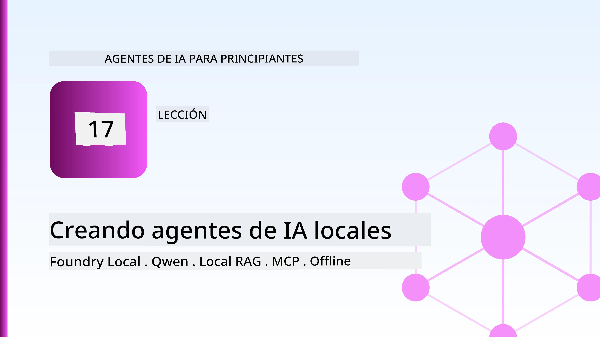
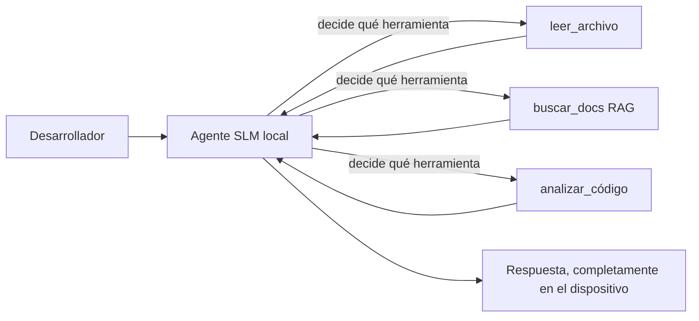
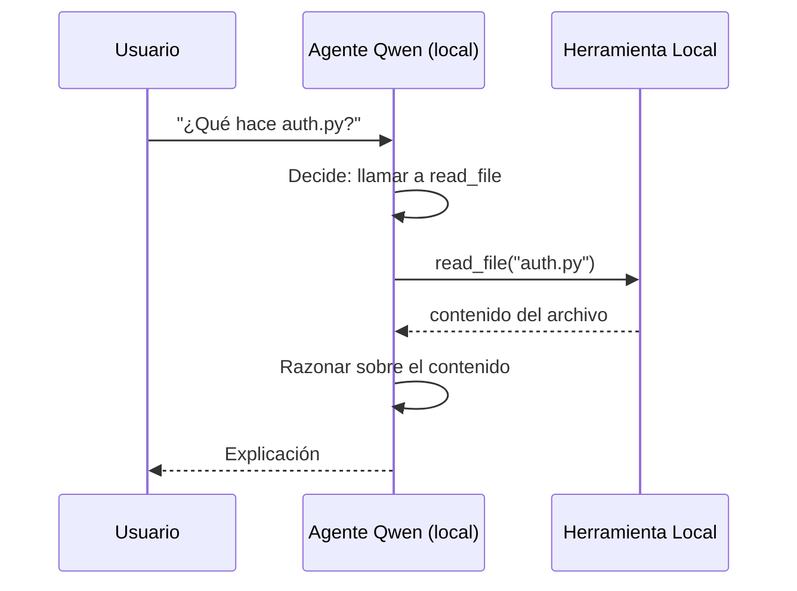
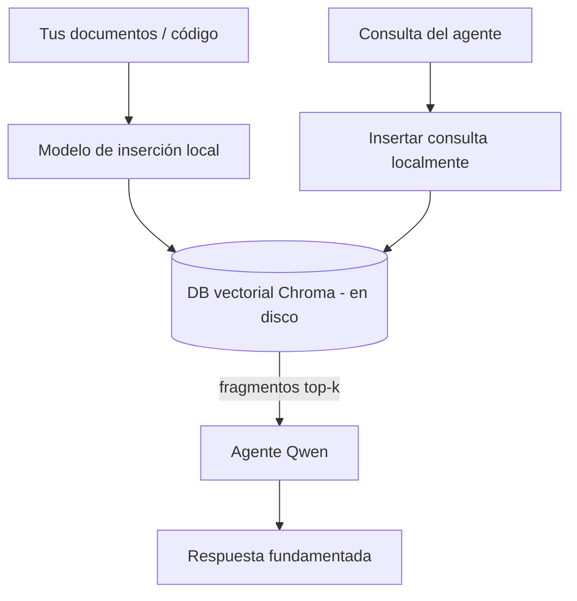
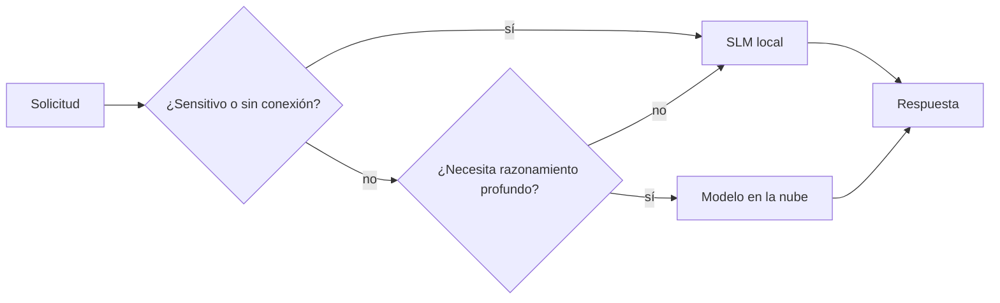

# Creación de Agentes de IA Locales Usando Microsoft Foundry Local y Qwen



La lección anterior escaló agentes *hacia arriba* en la nube. Esta los trae *hacia abajo* a una sola máquina. Al final tendrás un asistente de ingeniería funcional que razona, llama herramientas, lee tus archivos y busca en tu documentación — **sin una sola llamada de inferencia en la nube.**

¿Por qué querrías eso? Tres razones que surgen constantemente en el trabajo de ingeniería real:

- **Privacidad.** El código y los documentos nunca salen de la máquina. Ningún aviso, fragmento o dato del cliente cruza la frontera de la red.
- **Costo.** La inferencia local no tiene factura por token. Puedes iterar todo el día al precio de la electricidad.
- **Offline.** En un avión, en una instalación segura o durante un corte, el agente sigue funcionando.

La trampa es que estás intercambiando un modelo de frontera en la nube por un **Modelo de Lenguaje Pequeño (SLM)** que se ejecuta en tu CPU, GPU o NPU. Esta lección trata de construir agentes que sean *buenos* dentro de esa limitación en lugar de pretender que esa limitación no existe.

## Introducción

Esta lección cubrirá:

- **Modelos de Lenguaje Pequeños (SLMs)** — qué son, dónde destacan y dónde no.
- **Microsoft Foundry Local** — un entorno de ejecución que descarga y sirve modelos en el dispositivo a través de una **API compatible con OpenAI**.
- **Modelos Qwen con llamadas a funciones** — SLMs que producen llamadas a herramientas de manera confiable, lo que hace posible los agentes locales (no solo chat local).
- **Herramientas locales, RAG local y MCP local** — dando capacidad al agente sin la nube.
- **Patrones híbridos** — cuándo mantener las cosas locales y cuándo recurrir a la nube.

## Objetivos de Aprendizaje

Después de completar esta lección, sabrás cómo:

- Explicar los compromisos de los SLMs y elegir casos de uso apropiados para agentes locales.
- Servir un modelo Qwen localmente con Foundry Local y conectarte a él a través del endpoint compatible con OpenAI.
- Construir un agente que llame herramientas y se ejecute completamente en tu estación de trabajo.
- Añadir RAG local sobre tus propios documentos usando una base de datos vectorial local (Chroma).
- Conectar el agente a un servidor MCP local y razonar sobre diseños híbridos local/nube.

## Requisitos Previos

Esta lección asume que has completado las lecciones anteriores y te sientes cómodo con:

- [Uso de herramientas](../04-tool-use/README.md) (Lección 4) y [RAG agente](../05-agentic-rag/README.md) (Lección 5).
- [Protocolos agentes / MCP](../11-agentic-protocols/README.md) (Lección 11).
- El [Microsoft Agent Framework](../14-microsoft-agent-framework/README.md) (Lección 14).

También necesitas:

- Una estación de trabajo para desarrolladores. **8 GB de RAM es un mínimo realista**; 16 GB+ es cómodo. Una GPU o NPU ayuda pero no es requisito.
- **Microsoft Foundry Local** instalado (ver la sección de configuración abajo).
- Python 3.12+ y los paquetes en el repositorio [`requirements.txt`](../../../requirements.txt), además de `foundry-local-sdk`, `openai` y `chromadb` para esta lección.

## Modelos de Lenguaje Pequeños: La Herramienta Adecuada para Trabajo Local

Un modelo de frontera en la nube tiene cientos de miles de millones de parámetros y un centro de datos detrás. Un SLM tiene unos pocos miles de millones de parámetros y debe caber en la RAM de tu portátil. Esa diferencia establece expectativas claras.

**Los SLM son buenos en:**

- Tareas estructuradas y acotadas — clasificación, extracción, resumen de un documento conocido.
- **Llamadas a herramientas** — decidir qué función llamar y con qué argumentos.
- Iteración rápida, barata y privada con tus propios datos.

**Los SLM son más débiles en:**

- Razonamiento abierto y multi-salto con contexto amplio.
- Conocimiento amplio del mundo (han visto menos y olvidan más).

La estrategia ganadora para agentes locales es, por lo tanto: **dejar que el SLM orqueste y que las herramientas hagan el trabajo pesado.** El modelo no necesita *conocer* tu base de código — necesita saber cuándo llamar a `read_file` y `search_docs`. Eso aprovecha directamente las fortalezas de un SLM.



## Microsoft Foundry Local

**Microsoft Foundry Local** es un entorno ligero que descarga, administra y sirve modelos completamente en tu máquina. Su característica más importante para nosotros es que expone un **endpoint HTTP compatible con OpenAI**, lo que significa que el SDK de OpenAI y el cliente OpenAI del Microsoft Agent Framework funcionan con él cambiando solo el `base_url`. Todo lo que aprendiste sobre construir agentes se transfiere directamente; solo cambia el endpoint de la nube a `localhost`.

Foundry Local también elige automáticamente la mejor versión del modelo para tu hardware: una para CPU, otra para CUDA/GPU o para NPU — así evitas optimizar manualmente por máquina.

### Configuración

Instala Foundry Local (consulta la [documentación](https://learn.microsoft.com/azure/ai-foundry/foundry-local/) para tu OS), luego confirma que funciona:

```bash
# Instalar (ejemplo; siga la documentación para su plataforma)
winget install Microsoft.FoundryLocal      # Windows
# brew install microsoft/foundrylocal/foundrylocal   # macOS

# Descargue y ejecute un modelo Qwen, luego inicie el servicio local
foundry model run qwen2.5-7b-instruct
foundry service status
```

Una vez que el servicio esté activo tienes un endpoint local compatible con OpenAI (típicamente `http://localhost:PORT/v1`). El notebook usa `foundry-local-sdk` para descubrir el endpoint automáticamente, así no tienes que codificar el puerto.

## Llamadas a funciones en Qwen: Por qué Importa

Un agente es solo un agente si puede llamar herramientas. Muchos SLM pueden chatear pero producen llamadas a herramientas poco fiables o malformadas. Los modelos **Qwen** están entrenados para llamadas a funciones y emiten estructuras de llamadas bien formadas de forma consistente — lo que convierte un modelo de chat local en un *agente* local.

El flujo es el bucle estándar de llamadas a herramientas que ya conoces, solo que ejecutándose en el dispositivo:



## RAG Local

La búsqueda documental es donde los agentes locales tienen su valor. En lugar de esperar que el SLM memorice los documentos de tu framework, incrustas esos documentos en una **base de datos vectorial local** y dejas que el agente recupere los fragmentos relevantes a demanda.

Usamos **Chroma**, un almacén vectorial embebido que se ejecuta en proceso sin un servidor que administrar. La tubería es completamente local: modelo de incrustación local → vectores locales → recuperación local → SLM local.



Este es el mismo patrón Agentic RAG de la Lección 5 — el único cambio es que todos los componentes se ejecutan en tu máquina.

## Servidores MCP Locales

[MCP](../11-agentic-protocols/README.md) es un transporte, no un servicio en la nube. Un servidor MCP puede ejecutarse como un proceso local en `stdio`, exponiendo herramientas a tu agente mediante el protocolo estándar. Esto te permite reutilizar el ecosistema creciente de servidores MCP — acceso al sistema de archivos, operaciones git, consultas a bases de datos — completamente offline.

La postura de seguridad es diferente de la nube, pero no inexistente: un servidor MCP local aún se ejecuta con los permisos de tu usuario, así que limita lo que puede tocar (un directorio de proyecto, no toda tu carpeta personal) y trata sus salidas como entradas a validar.

## Patrones Híbridos Nube-y-Local

Local-primero no significa solo-local. Los sistemas maduros enrutan según sensibilidad y dificultad:

| Situación | Dónde se ejecuta |
| --- | --- |
| Código / datos sensibles, o sin conexión | **SLM local** |
| Tarea simple y acotada | **SLM local** (barato, rápido) |
| Razonamiento multi-salto difícil en datos no sensibles | **Modelo en la nube** |
| Todo, durante un corte | **SLM local** (degradación elegante) |

Esto refleja la idea de **enrutamiento de modelo** de la Lección 16 — excepto que uno de los "modelos" ahora es tu propia máquina. Un diseño robusto recurre a local cuando la nube no está disponible, para que el agente degrade en calidad en lugar de fallar por completo.



## Laboratorio Práctico: Un Asistente de Ingeniería Local

Abre [`code_samples/17-local-agent-foundry-local.ipynb`](./code_samples/17-local-agent-foundry-local.ipynb) y trabaja con él. Construirás un **asistente de ingeniería local** que se ejecuta completamente en tu estación de trabajo y puede:

1. **Llamar herramientas** — vía llamadas a funciones Qwen a través de Foundry Local.
2. **Realizar operaciones locales de archivos** — listar y leer archivos en un directorio de proyecto.
3. **Analizar código** — informar métricas básicas sobre un archivo fuente.
4. **Buscar documentación** — RAG local sobre una carpeta de documentos con Chroma.
5. **Usar MCP** — conectarse a un servidor MCP local (con un salto elegante si no está configurado).

No se usa inferencia en la nube en ningún momento.

### Recorrido

El asistente se conecta a Foundry Local a través del endpoint compatible con OpenAI, por lo que el código del agente se ve casi idéntico a las lecciones en la nube — solo cambia el cliente:

```python
from foundry_local import FoundryLocalManager
from openai import OpenAI

# Foundry Local descubre/descarga el modelo y nos proporciona un endpoint local.
manager = FoundryLocalManager(\"qwen2.5-7b-instruct\")
client = OpenAI(base_url=manager.endpoint, api_key=manager.api_key)  # api_key es un marcador de posición local
```

Las herramientas son funciones Python ordinarias acotadas a un directorio de proyecto:

```python
def read_file(path: str) -> str:
    \"\"\"Read a file, but only inside the sandboxed project directory.\"\"\"
    full = (PROJECT_ROOT / path).resolve()
    if PROJECT_ROOT not in full.parents and full != PROJECT_ROOT:
        return \"Access denied: path is outside the project directory.\"
    return full.read_text(encoding=\"utf-8\")
```

Nota la comprobación de sandbox — incluso localmente, una herramienta que lee rutas arbitrarias es una responsabilidad. El notebook mantiene cada herramienta acotada a una raíz de proyecto única.

## Verificación de Conocimientos

Pon a prueba tu comprensión antes de pasar a la tarea.

**1. Da dos razones concretas para ejecutar un agente localmente en lugar de en la nube.**

<details>
<summary>Respuesta</summary>

Cualquiera de dos: **privacidad** (el código y los datos nunca salen de la máquina), **costo** (sin factura por token de inferencia) y **capacidad offline** (funciona sin red — en un avión, en una instalación segura o durante un corte). Restricciones regulatorias o de cumplimiento que prohíben enviar datos fuera del dispositivo son un motor común de la razón de privacidad.
</details>

**2. ¿Cuál es la división recomendada del trabajo entre un SLM y sus herramientas en un agente local, y por qué?**

<details>
<summary>Respuesta</summary>

Dejar que el SLM **orqueste** (decida qué herramienta llamar y con qué argumentos) y dejar que las **herramientas hagan el trabajo pesado** (leer archivos, recuperar documentos, calcular resultados). Los SLM son fuertes en decisiones acotadas como la selección de herramientas pero débiles en conocimiento amplio y razonamiento multi-salto largo, así que apoyarse en herramientas juega a sus fortalezas.
</details>

**3. ¿Qué hace posible reutilizar el código de agente de la nube con Foundry Local?**

<details>
<summary>Respuesta</summary>

Foundry Local expone un **endpoint HTTP compatible con OpenAI**. El SDK de OpenAI y el cliente OpenAI del Agent Framework funcionan con él cambiando solo el `base_url` (y usando una clave API local de marcador de posición). Todo lo demás en el código del agente permanece igual.
</details>

**4. ¿Por qué usamos específicamente un modelo Qwen con llamadas a funciones en lugar de cualquier SLM?**

<details>
<summary>Respuesta</summary>

Porque un agente debe producir **llamadas a herramientas** fiables y bien formadas. Muchos SLM pueden chatear pero emiten estructuras de llamada a herramientas malformadas o inconsistentes. Los modelos Qwen están entrenados para llamadas a funciones y producen llamadas a herramientas consistentes, lo que convierte un modelo de chat local en un agente local funcional.
</details>

**5. En la tubería de RAG local, ¿qué componentes se ejecutan en la máquina?**

<details>
<summary>Respuesta</summary>

Todos ellos: el modelo de incrustación, la base de datos vectorial (Chroma, en disco), el paso de recuperación y el SLM. Los documentos se incrustan localmente, se almacenan localmente, se recuperan localmente y se razona sobre ellos con un modelo local — ningún componente toca la nube.
</details>

**6. Un servidor MCP local se ejecuta en tu máquina. ¿Eso lo hace automáticamente seguro? ¿Qué precaución debes tomar?**

<details>
<summary>Respuesta</summary>

No. Un servidor MCP local se ejecuta con los permisos de tu usuario, por lo que puede acceder a todo lo que tú puedas. Limítalo a lo que necesita (por ejemplo, un solo directorio de proyecto en vez de toda tu carpeta personal) y trata sus salidas como entradas que debes validar antes de actuar según ellas.
</details>

**7. Describe una regla de enrutamiento híbrida sensata que incluya un modelo local.**

<details>
<summary>Respuesta</summary>

Enruta solicitudes sensibles o sin conexión al SLM local; enruta tareas simples acotadas al SLM local por velocidad y costo; enruta razonamiento multi-salto difícil en datos no sensibles a un modelo en la nube; y recurre al SLM local si la nube no está disponible para que el agente degrade de manera elegante en lugar de fallar. Esto es enrutamiento de modelo (Lección 16) con la máquina local como uno de los modelos.
</details>

**8. ¿Cuál es una cifra realista mínima de RAM para ejecutar el agente local en esta lección, y qué te aporta más RAM?**

<details>
<summary>Respuesta</summary>

Alrededor de **8 GB** es un mínimo realista; 16 GB+ es cómodo. Más RAM te permite ejecutar modelos más grandes y capaces y mantener más contexto en memoria. Una GPU o NPU acelera la inferencia pero no es obligatoria — Foundry Local selecciona una versión para CPU cuando no hay acelerador disponible.
</details>

## Tarea

Extiende el asistente de ingeniería local a un **revisor local de documentación** para un proyecto pequeño de tu elección (usa alguna de las carpetas de lecciones de este repositorio si quieres).

Tu entrega debe:

1. **Indexar una carpeta real de documentación/código** en Chroma (al menos cinco archivos).
2. **Añadir una herramienta `find_todos`** que escanee el proyecto en busca de comentarios `TODO`/`FIXME` y los devuelva con archivo y línea — manteniendo la misma verificación de sandbox que `read_file`.

3. **Hazle tres preguntas al agente** que lo obliguen a combinar herramientas: una pregunta pura de RAG, una que requiera leer un archivo específico y otra que requiera encontrar tareas TODO.
4. **Mídelo**: mide el tiempo de cada una de las tres respuestas y anótalo en una celda de markdown. Comenta si la latencia es aceptable para tu flujo de trabajo previsto.

Luego escribe un párrafo corto sobre **qué moverías a la nube y qué mantendrías localmente** para este revisor, y por qué. Se te evaluará si los componentes locales están conectados correctamente y si tu razonamiento híbrido es sólido — no en la calidad del modelo.

## Resumen

En esta lección construiste un agente que se ejecuta completamente en tu propia máquina:

- **SLMs** intercambian amplitud por privacidad, costo y operación sin conexión — y brillan cuando **orquestan herramientas** en lugar de cargar todo el conocimiento por sí mismos.
- **Foundry Local** sirve modelos en el dispositivo detrás de un **endpoint compatible con OpenAI**, por lo que el código de tu agente en la nube se transfiere con un cambio de una línea.
- Los **modelos Qwen con llamadas a funciones** hacen posible la llamada confiable a herramientas locales — y por lo tanto *agentes* locales.
- **RAG local** (Chroma) y **MCP local** dan capacidad al agente sin salir de la máquina.
- Los **patrones híbridos** te permiten enrutar por sensibilidad y dificultad, con lo local como una solución de respaldo elegante.

Esto completa el arco de despliegue: la Lección 16 escaló agentes en Microsoft Foundry, y esta lección los redujo a una sola estación de trabajo. La siguiente lección se centra en mantener seguros los agentes desplegados.

## Recursos adicionales

- <a href="https://learn.microsoft.com/azure/ai-foundry/foundry-local/" target="_blank">Documentación de Microsoft Foundry Local</a>
- <a href="https://learn.microsoft.com/azure/ai-foundry/what-is-azure-ai-foundry" target="_blank">Documentación de Microsoft Foundry</a>
- <a href="https://learn.microsoft.com/en-us/agent-framework/overview/?wt.mc_id=youtube_26688_organicsocial_reactor&pivots=programming-language-python" target="_blank">Microsoft Agent Framework</a>
- <a href="https://qwen.readthedocs.io/en/latest/framework/function_call.html" target="_blank">Documentación de llamadas a funciones de Qwen</a>
- <a href="https://modelcontextprotocol.io/" target="_blank">Model Context Protocol (MCP)</a>
- <a href="https://docs.trychroma.com/" target="_blank">Base de datos vectorial Chroma</a>

## Lección anterior

[Desplegando Agentes Escalables](../16-deploying-scalable-agents/README.md)

## Próxima lección

[Asegurando Agentes de IA](../18-securing-ai-agents/README.md)

---

<!-- CO-OP TRANSLATOR DISCLAIMER START -->
**Descargo de responsabilidad**:
Este documento ha sido traducido utilizando el servicio de traducción automática [Co-op Translator](https://github.com/Azure/co-op-translator). Aunque nos esforzamos por la precisión, tenga en cuenta que las traducciones automatizadas pueden contener errores o inexactitudes. El documento original en su idioma nativo debe considerarse la fuente autorizada. Para información crítica, se recomienda una traducción profesional humana. No somos responsables de cualquier malentendido o interpretación errónea que surja del uso de esta traducción.
<!-- CO-OP TRANSLATOR DISCLAIMER END -->