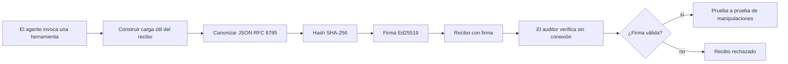

[Ver el video de la lección: Asegurando agentes de IA con recibos criptográficos](https://youtu.be/PLACEHOLDER_VIDEO_ID)

> _(Video de la lección y miniatura serán agregados por el equipo de contenido de Microsoft después de la fusión, siguiendo el patrón de la lección 14 / 15.)_

# Asegurando agentes de IA con recibos criptográficos

## Introducción

Esta lección cubrirá:

- Por qué las trazas de auditoría para agentes de IA son importantes para el cumplimiento, depuración y confianza.
- Qué es un recibo criptográfico y cómo se diferencia de una línea de registro sin firmar.
- Cómo producir un recibo firmado para una llamada a una herramienta del agente en Python simple.
- Cómo verificar un recibo sin conexión y detectar manipulaciones.
- Cómo encadenar recibos para que eliminar o reordenar uno rompa la cadena.
- Qué prueban los recibos y qué explícitamente no prueban.

## Objetivos de aprendizaje

Después de completar esta lección, sabrás cómo:

- Identificar los modos de falla que motivan la procedencia criptográfica para las acciones del agente.
- Producir un recibo firmado con Ed25519 sobre una carga útil JSON canónica.
- Verificar un recibo de forma independiente usando solo la clave pública del firmante.
- Detectar manipulaciones volviendo a ejecutar la verificación en un recibo modificado.
- Construir una secuencia de recibos encadenados por hash y explicar por qué la cadena importa.
- Reconocer el límite entre lo que prueban los recibos (atribución, integridad, orden) y lo que no prueban (correctitud de la acción, validez de la política).

## El problema: la traza de auditoría de tu agente

Imagina que has desplegado un agente de IA para Contoso Travel. El agente lee solicitudes de clientes, llama a una API de vuelos para buscar opciones y reserva asientos en nombre del cliente. El último trimestre, el agente procesó 50,000 reservas.

Hoy llega un auditor. Hace una pregunta simple: "Muéstrame qué hizo tu agente."

Entregas tus archivos de registro. El auditor los revisa y formula la pregunta más difícil: "¿Cómo sé que estos registros no fueron editados?"

Este es el problema de la traza de auditoría. La mayoría de los despliegues de agentes hoy dependen de:

- **Registros de aplicación**: escritos por el agente mismo, editables por cualquiera con acceso al sistema de archivos.
- **Servicios de registro en la nube**: a prueba de manipulaciones a nivel de plataforma, pero solo si el auditor confía en el operador de la plataforma.
- **Registros de transacciones de base de datos**: adecuados para cambios de base de datos pero no para llamadas arbitrarias a herramientas.

Ninguno de estos puede responder la pregunta del auditor sin requerir que el auditor confíe en alguien (tú, tu proveedor de nube, tu vendedor de base de datos). Para uso interno, esa confianza suele ser aceptable. Para cargas reguladas (finanzas, salud, cualquier cosa sujeta a la Ley de IA de la UE), no lo es.

Los recibos criptográficos resuelven esto haciendo que cada acción del agente sea verificable de forma independiente. El auditor no necesita confiar en ti. Solo necesita tu clave pública y el recibo en sí.

## ¿Qué es un recibo criptográfico?

Un recibo es un objeto JSON que registra lo que hizo un agente, firmado con una firma digital.



Un recibo mínimo se parece a esto:

```json
{
  "type": "agent.tool_call.v1",
  "agent_id": "contoso-travel-bot",
  "tool_name": "lookup_flights",
  "tool_args_hash": "sha256:a3f9c1...",
  "result_hash": "sha256:7b2e1d...",
  "policy_id": "contoso-travel-policy-v3",
  "timestamp": "2026-04-25T14:30:00Z",
  "sequence": 47,
  "previous_receipt_hash": "sha256:9d4e6a...",
  "signature": {
    "alg": "EdDSA",
    "sig": "c5af83...",
    "public_key": "8f3b2c..."
  }
}
```

Tres propiedades hacen el trabajo:

1. **La firma**. El recibo es firmado por la pasarela del agente usando una clave privada Ed25519. Cualquiera con la clave pública correspondiente puede verificar la firma sin conexión. Manipular cualquier campo invalida la firma.

2. **Codificación canónica**. Antes de firmar, el recibo se serializa usando el Esquema de Canonicalización JSON (JCS, RFC 8785). Esto asegura que dos implementaciones que producen el mismo recibo lógico produzcan una salida byte idéntica. Sin la canonicalización, diferentes serializadores JSON producirían diferentes firmas para el mismo contenido.

3. **Encadenamiento por hash**. El campo `previous_receipt_hash` enlaza cada recibo con el anterior. Eliminar o reordenar un recibo rompe cada recibo que vino después. La manipulación se vuelve visible a nivel de la cadena incluso si se ignoran firmas individuales.

Juntas, estas propiedades proporcionan tres garantías:

- **Atribución**: esta clave firmó este contenido.
- **Integridad**: el contenido no ha cambiado desde la firma.
- **Orden**: este recibo vino después de ese recibo en la cadena.

## Produciendo un recibo en Python

No necesitas una biblioteca especial para producir un recibo. Las primitivas criptográficas están ampliamente disponibles y la lógica son unas pocas docenas de líneas de Python.

Los ejercicios prácticos en `code_samples/18-signed-receipts.ipynb` recorren todo el flujo. La versión resumida:

```python
import json
import hashlib
import base64
from nacl import signing
from jcs import canonicalize  # RFC 8785 JSON canónico

def b64url_nopad(data: bytes) -> str:
    return base64.urlsafe_b64encode(data).decode("ascii").rstrip("=")

def sha256_canonical(obj) -> str:
    """SHA-256 of a Python object's JCS-canonical JSON form."""
    return f"sha256:{hashlib.sha256(canonicalize(obj)).hexdigest()}"

# Generar o cargar una clave de firma (en producción, almacenar en un almacén de claves)
signing_key = signing.SigningKey.generate()
verify_key = signing_key.verify_key

# Construir la carga útil del recibo (aún sin firma)
tool_args = {"origin": "SYD", "destination": "LAX"}
tool_result = [{"flight": "QF11", "price": 1850, "stops": 0}]

payload = {
    "type": "agent.tool_call.v1",
    "agent_id": "contoso-travel-bot",
    "tool_name": "lookup_flights",
    "tool_args_hash": sha256_canonical(tool_args),
    "result_hash": sha256_canonical(tool_result),
    "policy_id": "contoso-travel-policy-v3",
    "timestamp": "2026-04-25T14:30:00Z",
    "sequence": 0,
    "previous_receipt_hash": None,
}

# Canonicalizar, hashear, firmar.
canonical_bytes = canonicalize(payload)
message_hash = hashlib.sha256(canonical_bytes).digest()
signature_bytes = signing_key.sign(message_hash).signature

# Adjuntar un objeto de firma estructurado.
receipt = {
    **payload,
    "signature": {
        "alg": "EdDSA",
        "sig": b64url_nopad(signature_bytes),
        "public_key": b64url_nopad(bytes(verify_key)),
    },
}
```

Esa es toda la tubería de firma. Los ejercicios en el notebook recorren cada paso.

## Verificando un recibo y detectando manipulaciones

La verificación es la operación inversa:

```python
import base64
import hashlib
from nacl import signing
from nacl.exceptions import BadSignatureError
from jcs import canonicalize

def b64url_decode(s: str) -> bytes:
    padding = "=" * ((4 - len(s) % 4) % 4)
    return base64.urlsafe_b64decode(s + padding)

def verify_receipt(receipt: dict) -> bool:
    # La firma es un objeto estructurado: {"alg", "sig", "public_key"}.
    sig_obj = receipt.get("signature")
    if not sig_obj or sig_obj.get("alg") != "EdDSA":
        return False

    # Reconstruir la carga útil que fue realmente firmada (todo excepto la firma).
    payload = {k: v for k, v in receipt.items() if k != "signature"}

    canonical_bytes = canonicalize(payload)
    message_hash = hashlib.sha256(canonical_bytes).digest()

    try:
        verify_key = signing.VerifyKey(b64url_decode(sig_obj["public_key"]))
        verify_key.verify(message_hash, b64url_decode(sig_obj["sig"]))
        return True
    except BadSignatureError:
        return False
```

Esta función toma un recibo y devuelve `True` si la firma es válida, `False` de lo contrario. Sin llamadas a red, sin dependencia de servicios, sin confianza en terceros.

Para ver la detección de manipulaciones en acción, el notebook muestra:

1. Producir un recibo válido y confirmar que se verifica.
2. Modificar un byte del campo `tool_args_hash`.
3. Volver a ejecutar la verificación y ver que falla.

Esta es la demostración práctica que los recibos evidencian manipulaciones: cualquier modificación, por pequeña que sea, rompe la firma.

## Encadenando recibos para agentes multi-paso

Un solo recibo firmado protege una acción. Una cadena de recibos protege una secuencia.


Cada recibo registra el hash del recibo anterior. Para eliminar silenciosamente el recibo 2, un atacante necesitaría:

- Modificar el campo `previous_receipt_hash` del recibo 3 (rompe la firma del recibo 3), O
- Forjar una nueva firma en un recibo 3 modificado (requiere la clave privada del agente).

Si la clave privada está en una bóveda de hardware y publicas la clave pública con cada recibo, ninguno de estos ataques es factible sin detección.

El notebook muestra:

1. Construir una cadena de tres recibos.
2. Verificar que el `previous_receipt_hash` de cada recibo coincida con el hash real del recibo anterior.
3. Manipular un recibo en medio y ver que la cadena se rompe justo en ese punto.

Así produces una traza de auditoría que un auditor externo puede verificar sin confiar en ti.

## Qué prueban los recibos (y qué no prueban)

Esta es la sección más importante de esta lección. Los recibos son poderosos, pero su poder es limitado.

**Los recibos prueban tres cosas:**

1. **Atribución**: una clave específica firmó una carga útil específica.
2. **Integridad**: la carga útil no ha cambiado desde la firma.
3. **Orden**: este recibo vino después de ese recibo en la cadena de hashes.

**Los recibos NO prueban:**

1. **Correctitud**: que la acción del agente fue la acción correcta. Un recibo puede ser firmado para una respuesta equivocada con la misma limpieza que para una correcta.
2. **Cumplimiento de la política**: que la política referida en `policy_id` fue realmente evaluada, o que habría permitido esta acción si se hubiera verificado. El recibo registra lo que se afirmó, no lo que se implementó.
3. **Identidad más allá de la clave**: el recibo dice "esta clave firmó este contenido." No dice "este humano autorizó esto." Conectar una clave a una persona u organización requiere infraestructura de identidad separada (un directorio, un registro de claves públicas, etc.).
4. **Veracidad de las entradas**: si el agente recibe un prompt manipulado y actúa en consecuencia, el recibo registra la acción fielmente. Los recibos están después de la validación de entrada, no son un sustituto de ella.

Este límite importa por dos razones:

- Te dice para qué son útiles los recibos: hacer que el comportamiento del agente sea auditable y evidente en cuanto a manipulaciones, incluso a través de límites organizacionales.
- Te dice qué capas adicionales necesitas: validación de entradas (Lección 6), aplicación de políticas (cubierto brevemente abajo) e infraestructura de identidad (fuera del alcance de esta lección).

Un error común es asumir que "tenemos recibos" significa "estamos gobernados." No es así. Los recibos son una base. La gobernanza es el sistema que construyes encima.

## Referencias para producción

El código Python en esta lección es intencionalmente mínimo para que puedas leer cada línea y entender exactamente qué pasa. En producción, tienes dos opciones:

1. **Construir directamente sobre las primitivas criptográficas.** Las 50 líneas que viste arriba son suficientes para muchos casos de uso. PyNaCl (Ed25519) y el paquete `jcs` (JSON canónico) son bibliotecas bien mantenidas y auditadas.

2. **Usar una biblioteca de recibos para producción.** Varios proyectos de código abierto implementan el mismo patrón con características adicionales (rotación de claves, verificación por lotes, distribución del JWK Set, integración con motores de políticas):
   - El formato de recibo usado en esta lección sigue un borrador de Internet de IETF (`draft-farley-acta-signed-receipts`) actualmente en proceso de estandarización.
   - El Microsoft Agent Governance Toolkit compone recibos con decisiones de política basadas en Cedar; ve el Tutorial 33 en ese repositorio para un ejemplo completo.
   - Los paquetes `protect-mcp` (npm) y `@veritasacta/verify` (npm) proveen una implementación basada en Node para firma de recibos y verificación offline, pensada para envolver cualquier servidor MCP con una traza de auditoría a prueba de manipulaciones.

La decisión entre hacer tu propio código y usar una biblioteca es similar a decidir entre escribir tu propia biblioteca JWT y usar una probada: ambas son razonables; la biblioteca ahorra tiempo y reduce la superficie de auditoría; el enfoque desde cero te fuerza a entender cada primitiva. Esta lección enseña el camino desde cero para que tengas la base para cualquiera de las dos opciones.

## Comprobación de conocimientos

Prueba tu comprensión antes de pasar al ejercicio práctico.

**1. Un recibo es firmado con la clave privada Ed25519 del agente. El auditor tiene solo la clave pública. ¿Puede el auditor verificar el recibo sin conexión?**

<details>
<summary>Respuesta</summary>

Sí. La verificación Ed25519 requiere solo la clave pública y los bytes firmados. No hay llamadas a red, ni dependencia de servicios. Esta es la propiedad que hace útiles los recibos en contextos aislados, multi-organizacionales o de baja confianza.
</details>

**2. Un atacante modifica el campo `policy_id` de un recibo para afirmar que estuvo gobernado por una política más permisiva. La firma fue sobre la carga útil original. ¿Qué pasa durante la verificación?**

<details>
<summary>Respuesta</summary>

La verificación falla. La firma se calculó sobre los bytes canónicos de la carga útil original; modificar cualquier campo cambia los bytes canónicos, lo que cambia el hash SHA-256, haciendo la firma inválida. El atacante necesitaría la clave privada para producir una firma válida nueva, pero no la tiene.
</details>

**3. ¿Por qué el recibo incluye un `tool_args_hash` y un `result_hash` en lugar de los argumentos y el resultado en crudo?**

<details>
<summary>Respuesta</summary>

Por dos razones. Primero, el recibo puede necesitar archivarse o transmitirse en entornos donde filtrar el contenido crudo (PII, datos de negocio) es un problema. Hashing mantiene el recibo pequeño y el contenido privado; el auditor verifica que el hash coincide con una copia almacenada por separado del contenido real. Segundo, los hashes tienen tamaño fijo; un recibo con hashes tiene tamaño limitado sin importar qué tan grandes sean las entradas y salidas.
</details>

**4. El campo `previous_receipt_hash` enlaza cada recibo con su predecesor. Si un atacante elimina silenciosamente un recibo en medio de la cadena, ¿qué se vuelve inválido?**

<details>
<summary>Respuesta</summary>

Cada recibo que vino después del eliminado. Sus campos `previous_receipt_hash` ya no coinciden con la cadena real (porque el recibo referenciado ya no existe o la cadena ahora apunta a un predecesor diferente). Para ocultar la eliminación, el atacante tendría que volver a firmar cada recibo posterior, lo que requiere la clave privada.
</details>

**5. Un recibo se verifica correctamente. ¿Eso prueba que la acción del agente fue correcta, válida o cumplió con la política?**

<details>
<summary>Respuesta</summary>

No. Un recibo válido prueba tres cosas: atribución (esta clave firmó este contenido), integridad (el contenido no cambió) y orden (este recibo vino después de ese). NO prueba que la acción fue correcta, que la política indicada en `policy_id` fue evaluada realmente, ni que el agente siguió todas las reglas. Los recibos hacen auditable el comportamiento del agente, no necesariamente correcto. Este es el límite más importante de la lección.
</details>

## Ejercicio práctico

Abre `code_samples/18-signed-receipts.ipynb` y completa las cuatro secciones:

1. **Sección 1**: Firma tu primer recibo y verifica que es válido.
2. **Sección 2**: Manipula el recibo y observa la verificación fallar.
3. **Sección 3**: Construye una cadena de tres recibos y verifica la integridad de la cadena.
4. **Sección 4**: Aplica el patrón a un agente construido con Microsoft Agent Framework: envuelve una llamada a herramienta en la firma de recibo y luego verifica el recibo de forma independiente.

**Desafío adicional 1:** extiende el esquema del recibo con un campo adicional de tu elección (por ejemplo, un ID de solicitud para trazabilidad), actualiza la lógica de firma canónica para incluirlo, y confirma que el recibo sigue pasando la verificación. Luego modifica el campo después de firmar y confirma que la verificación falla. Esto te obliga a entender cómo cada byte de la codificación canónica contribuye a la firma.
**Desafío avanzado 2:** Hash SHA-256 de dos de tus recibos juntos (concatena sus bytes canónicos en un orden determinista) e incrusta el resumen resultante como un nuevo campo en un tercer recibo antes de firmarlo. Verifica que los tres recibos aún se puedan procesar de ida y vuelta. Acabas de construir una prueba de inclusión de un solo paso: cualquiera que tenga el tercer recibo puede demostrar que los dos primeros existían en el momento en que fue firmado, sin necesidad de revelar su contenido. Este es el patrón que usan los recibos de divulgación selectiva a gran escala (compromisos Merkle, RFC 6962).

## Conclusión

Los recibos criptográficos brindan a los agentes de IA una pista de auditoría que es:

- **Independientemente verificable**: cualquier parte con la clave pública puede verificar, sin dependencia de servicio.
- **Evidente de manipulación**: cualquier modificación invalida la firma.
- **Portátil**: un recibo es un pequeño archivo JSON; puede ser archivado, transmitido y verificado en cualquier lugar.
- **Alineado con estándares**: construido sobre Ed25519 (RFC 8032), JCS (RFC 8785) y SHA-256, todos primitivas ampliamente desplegadas.

No son un sustituto para la validación de entrada, la aplicación de políticas o la infraestructura de identidad. Son la base para esas capas. Cuando despliegas agentes en cargas de trabajo reguladas, flujos de trabajo multi-organización o en cualquier entorno donde no se pueda asumir que un auditor futuro confiará en ti, los recibos son cómo se hace que la pista de auditoría sea honesta.

La conclusión más importante: los recibos prueban quién dijo qué y cuándo. No prueban que lo dicho sea cierto o correcto. Mantén esa distinción clara. Es la diferencia entre un sistema de procedencia honesto y uno engañoso.

## Lista de verificación para producción

Cuando estés listo para avanzar de esta lección a desplegar agentes firmados con recibos en un entorno real:

- [ ] **Mueve la clave de firma fuera del portátil del desarrollador.** Usa Azure Key Vault, AWS KMS o un módulo de seguridad hardware. La clave privada que firma tus recibos nunca debe vivir en control de código fuente ni en texto plano en máquinas de la aplicación.
- [ ] **Publica la clave pública de verificación.** Los auditores la necesitan para verificar offline. El patrón estándar es un Conjunto JWK en una URL conocida (RFC 7517), por ejemplo, `https://your-org.example.com/.well-known/agent-keys.json`.
- [ ] **Ancla la cadena externamente.** Escribe periódicamente el hash de la cabeza más reciente de la cadena en un registro de transparencia (Sigstore Rekor, autoridad de tiempo RFC 3161, o un segundo sistema interno) para que un tercero confirme "esta cadena existía en este momento."
- [ ] **Almacena los recibos de forma inmutable.** El almacenamiento append-only (Azure Storage con políticas de inmutabilidad, AWS S3 Object Lock) evita que un interno reescriba la historia a nivel de almacenamiento.
- [ ] **Decide la retención.** Muchos regímenes de cumplimiento requieren retención por varios años. Planifica el crecimiento de los recibos (cada recibo es ~500 bytes; un agente que hace 10K llamadas por día produce ~1.8 GB por año).
- [ ] **Documenta qué no cubren los recibos.** Los recibos prueban atribución, integridad y orden. Tu manual de operaciones debe listar explícitamente qué controles adicionales (validación de entrada, aplicación de políticas, limitación de tasa, infraestructura de identidad) se complementan con los recibos en tu postura de gobernanza.

### ¿Tienes más preguntas sobre asegurar agentes de IA?

Únete al [Discord de Microsoft Foundry](https://aka.ms/ai-agents/discord) para conocer a otros aprendices, asistir a horas de oficina y resolver tus dudas sobre Agentes de IA.

## Más allá de esta lección

Esta lección cubre la firma de recibo único y secuencias encadenadas con hash. Las mismas primitivas componen varios patrones más avanzados que podrás encontrar a medida que madure tu postura de gobernanza:

- **Divulgación selectiva.** Cuando los campos del recibo se comprometen independientemente (árbol Merkle estilo RFC 6962), puedes revelar campos específicos a auditores específicos y probar que el resto no cambia sin exponerlos. Útil cuando el mismo recibo debe satisfacer tanto una auditoría completa (que quiere integridad total) como regulaciones de minimización de datos como GDPR (que quieren que el auditor vea lo menos posible).
- **Revocación de recibos.** Si una clave de firma se compromete, necesitas una forma de marcar todos los recibos firmados con esa clave como no confiables desde un punto en el tiempo adelante. Patrones estándar: claves de firma de corta duración más una lista de revocación publicada, o un registro de transparencia con entradas de revocación.
- **Recibos bilaterales / con firma dividida.** Algunas implementaciones dividen la carga firmada en mitades pre-ejecución (`authorization_*`) y post-ejecución (`result_*`) con firmas independientes, útil cuando la decisión de autorización y el resultado observado son producidos por actores o tiempos diferentes. Esto se compone de forma aditiva sobre el formato de recibo enseñado en esta lección.
- **Composición de carga útil.** Un recibo sella los bytes que pones en `result_hash`. Las cargas reales suelen ser más ricas que un solo resultado de llamada de herramienta: razonamiento pre-decisional (predicción del modelo, opciones consideradas, evidencia y su integridad, postura de riesgo, cadena de responsabilidad, resultado de la puerta) pueden vivir dentro de la carga útil, sellados por un solo recibo. Esto mantiene el formato del recibo minimalista mientras permite que los esquemas de carga útil evolucionen según el dominio.
- **Conformidad interimplementación.** Múltiples implementaciones independientes del mismo formato de recibo (Python, TypeScript, Rust, Go) se verifican cruzadamente contra vectores de prueba compartidos. Si construyes tu propia implementación, validar contra vectores publicados confirma compatibilidad en la transmisión.
- **Migración post-cuántica.** Ed25519 está ampliamente desplegado hoy, pero no es resistente a computación cuántica. El formato de recibo es ágil en algoritmos: el campo `signature.alg` puede llevar `ML-DSA-65` (el estándar NIST post-cuántico para firmas) cuando necesites migrar. Planea un período de transición donde los recibos estén firmados doblemente.

## Recursos adicionales

- <a href="https://datatracker.ietf.org/doc/draft-farley-acta-signed-receipts/" target="_blank">Borrador IETF: Recibos de decisión firmados para control de acceso máquina a máquina</a>
- <a href="https://learn.microsoft.com/azure/ai-studio/responsible-use-of-ai-overview" target="_blank">Resumen de IA Responsable (Azure AI)</a>
- <a href="https://datatracker.ietf.org/doc/html/rfc8032" target="_blank">RFC 8032: Algoritmo de firma digital sobre curva Edwards (EdDSA)</a>
- <a href="https://datatracker.ietf.org/doc/html/rfc8785" target="_blank">RFC 8785: Esquema de canonicidad JSON (JCS)</a>
- <a href="https://datatracker.ietf.org/doc/html/rfc6962" target="_blank">RFC 6962: Transparencia de certificados</a> (construcción de árbol Merkle usada por recibos de divulgación selectiva)
- <a href="https://github.com/microsoft/agent-governance-toolkit/blob/main/docs/tutorials/33-offline-verifiable-receipts.md" target="_blank">Microsoft Agent Governance Toolkit, Tutorial 33: Recibos de decisión verificables offline</a>
- <a href="https://github.com/ScopeBlind/agent-governance-testvectors" target="_blank">Vectores de prueba de conformidad interimplementación</a> para el formato de recibo usado en esta lección (Apache-2.0)
- <a href="https://pynacl.readthedocs.io/" target="_blank">Documentación PyNaCl</a> (Ed25519 en Python)

## Lección anterior

[Construyendo agentes de uso computacional (CUA)](../15-browser-use/README.md)

## Próxima lección

_(Por determinar por los mantenedores del currículo)_

---

<!-- CO-OP TRANSLATOR DISCLAIMER START -->
**Descargo de responsabilidad**:
Este documento ha sido traducido utilizando el servicio de traducción automática [Co-op Translator](https://github.com/Azure/co-op-translator). Aunque nos esforzamos por la precisión, tenga en cuenta que las traducciones automatizadas pueden contener errores o inexactitudes. El documento original en su idioma nativo debe considerarse la fuente autorizada. Para información crítica, se recomienda una traducción profesional humana. No somos responsables de cualquier malentendido o interpretación errónea que surja del uso de esta traducción.
<!-- CO-OP TRANSLATOR DISCLAIMER END -->