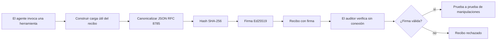
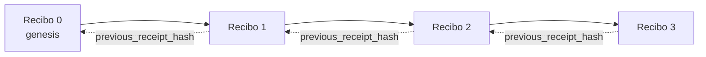

[Ver el video de la lección: Asegurando agentes de IA con recibos criptográficos](https://youtu.be/PLACEHOLDER_VIDEO_ID)

> _(El equipo de contenido de Microsoft agregará el video de la lección y la miniatura después de la fusión, siguiendo el patrón de las lecciones 14 / 15.)_

# Asegurando agentes de IA con recibos criptográficos

## Introducción

Esta lección cubrirá:

- Por qué las pistas de auditoría para agentes de IA son importantes para el cumplimiento, la depuración y la confianza.
- Qué es un recibo criptográfico y cómo se diferencia de una línea de registro no firmada.
- Cómo producir un recibo firmado para la llamada a una herramienta del agente en Python puro.
- Cómo verificar un recibo fuera de línea y detectar manipulaciones.
- Cómo encadenar recibos para que eliminar o reordenar uno rompa la cadena.
- Qué prueban los recibos y qué explícitamente no prueban.

## Objetivos de aprendizaje

Después de completar esta lección, sabrás cómo:

- Identificar los modos de falla que motivan la procedencia criptográfica de las acciones del agente.
- Producir un recibo firmado con Ed25519 sobre una carga útil JSON canónica.
- Verificar un recibo de forma independiente usando solo la clave pública del firmante.
- Detectar manipulaciones al volver a ejecutar la verificación sobre un recibo modificado.
- Construir una secuencia encadenada por hash de recibos y explicar por qué la cadena importa.
- Reconocer el límite entre lo que prueban los recibos (atribución, integridad, orden) y lo que no prueban (correctitud de la acción, solidez de la política).

## El problema: la pista de auditoría de tu agente

Imagina que has desplegado un agente de IA para Contoso Travel. El agente lee solicitudes de clientes, llama a una API de vuelos para buscar opciones y reserva asientos en nombre del cliente. El último trimestre, el agente procesó 50,000 reservaciones.

Hoy llega un auditor. Hace una pregunta simple: "Muéstrame lo que hizo tu agente."

Le entregas tus archivos de registro. El auditor los revisa y hace una pregunta más difícil: "¿Cómo sé que estos registros no fueron editados?"

Este es el problema de la pista de auditoría. La mayoría de los despliegues de agentes hoy dependen de:

- **Registros de aplicación**: escritos por el propio agente, editables por cualquiera con acceso al sistema de archivos.
- **Servicios de registro en la nube**: evidencian manipulaciones a nivel de plataforma pero solo si el auditor confía en el operador de la plataforma.
- **Registros de transacciones de base de datos**: adecuados para cambios en bases de datos pero no para llamadas arbitrarias a herramientas.

Ninguno de estos puede responder a la pregunta del auditor sin requerir que el auditor confíe en alguien (tú, tu proveedor de nube, tu proveedor de base de datos). Para uso interno, esa confianza suele ser aceptable. Para cargas reguladas (finanzas, salud, cualquier cosa sujeta a la Ley de IA de la UE), no lo es.

Los recibos criptográficos resuelven esto al hacer que cada acción del agente sea verificable de forma independiente. El auditor no necesita confiar en ti. Solo necesita tu clave pública y el recibo mismo.

## ¿Qué es un recibo criptográfico?

Un recibo es un objeto JSON que registra lo que hizo un agente, firmado con una firma digital.



Un recibo mínimo se ve así:

```json
{
  "type": "agent.tool_call.v1",
  "agent_id": "contoso-travel-bot",
  "tool_name": "lookup_flights",
  "tool_args_hash": "sha256:a3f9c1...",
  "result_hash": "sha256:7b2e1d...",
  "policy_id": "contoso-travel-policy-v3",
  "timestamp": "2026-04-25T14:30:00Z",
  "sequence": 47,
  "previous_receipt_hash": "sha256:9d4e6a...",
  "signature": {
    "alg": "EdDSA",
    "sig": "c5af83...",
    "public_key": "8f3b2c..."
  }
}
```

Tres propiedades hacen el trabajo:

1. **La firma**. El recibo es firmado por la pasarela del agente usando una clave privada Ed25519. Cualquiera con la clave pública correspondiente puede verificar la firma sin conexión. Manipular cualquier campo invalida la firma.

2. **Codificación canónica**. Antes de firmar, el recibo se serializa usando el Esquema de Canonicalización JSON (JCS, RFC 8785). Esto asegura que dos implementaciones que producen el mismo recibo lógico produzcan una salida byteidéntica. Sin canonicidad, diferentes serializadores JSON producirían firmas diferentes para el mismo contenido.

3. **Encadenamiento por hash**. El campo `previous_receipt_hash` enlaza cada recibo con el anterior. Eliminar o reordenar un recibo rompe todos los recibos que vienen después. La manipulación se vuelve visible a nivel de cadena incluso si las firmas individuales son ignoradas.

Juntas, estas propiedades proporcionan tres garantías:

- **Atribución**: esta clave firmó este contenido.
- **Integridad**: el contenido no ha cambiado desde la firma.
- **Orden**: este recibo vino después de ese recibo en la cadena.

## Produciendo un recibo en Python

No necesitas una biblioteca especial para producir un recibo. Los primitivas criptográficas están ampliamente disponibles y la lógica son unas pocas docenas de líneas de Python.

Los ejercicios prácticos en `code_samples/18-signed-receipts.ipynb` recorren el flujo completo. La versión resumida:

```python
import json
import hashlib
import base64
from nacl import signing
from jcs import canonicalize  # RFC 8785 JSON canónico

def b64url_nopad(data: bytes) -> str:
    return base64.urlsafe_b64encode(data).decode("ascii").rstrip("=")

def sha256_canonical(obj) -> str:
    """SHA-256 of a Python object's JCS-canonical JSON form."""
    return f"sha256:{hashlib.sha256(canonicalize(obj)).hexdigest()}"

# Generar o cargar una clave de firma (en producción, almacenar en un almacén de claves)
signing_key = signing.SigningKey.generate()
verify_key = signing_key.verify_key

# Construir la carga útil del recibo (sin firma aún)
tool_args = {"origin": "SYD", "destination": "LAX"}
tool_result = [{"flight": "QF11", "price": 1850, "stops": 0}]

payload = {
    "type": "agent.tool_call.v1",
    "agent_id": "contoso-travel-bot",
    "tool_name": "lookup_flights",
    "tool_args_hash": sha256_canonical(tool_args),
    "result_hash": sha256_canonical(tool_result),
    "policy_id": "contoso-travel-policy-v3",
    "timestamp": "2026-04-25T14:30:00Z",
    "sequence": 0,
    "previous_receipt_hash": None,
}

# Canónica, hashear, firmar.
canonical_bytes = canonicalize(payload)
message_hash = hashlib.sha256(canonical_bytes).digest()
signature_bytes = signing_key.sign(message_hash).signature

# Adjuntar un objeto de firma estructurado.
receipt = {
    **payload,
    "signature": {
        "alg": "EdDSA",
        "sig": b64url_nopad(signature_bytes),
        "public_key": b64url_nopad(bytes(verify_key)),
    },
}
```

Ese es todo el pipeline de firma. Los ejercicios en el cuaderno explican cada paso.

## Verificando un recibo y detectando manipulación

La verificación es la operación inversa:

```python
import base64
import hashlib
from nacl import signing
from nacl.exceptions import BadSignatureError
from jcs import canonicalize

def b64url_decode(s: str) -> bytes:
    padding = "=" * ((4 - len(s) % 4) % 4)
    return base64.urlsafe_b64decode(s + padding)

def verify_receipt(receipt: dict) -> bool:
    # La firma es un objeto estructurado: {"alg", "sig", "public_key"}.
    sig_obj = receipt.get("signature")
    if not sig_obj or sig_obj.get("alg") != "EdDSA":
        return False

    # Reconstruir la carga útil que fue realmente firmada (todo excepto la firma).
    payload = {k: v for k, v in receipt.items() if k != "signature"}

    canonical_bytes = canonicalize(payload)
    message_hash = hashlib.sha256(canonical_bytes).digest()

    try:
        verify_key = signing.VerifyKey(b64url_decode(sig_obj["public_key"]))
        verify_key.verify(message_hash, b64url_decode(sig_obj["sig"]))
        return True
    except BadSignatureError:
        return False
```

Esta función toma un recibo y devuelve `True` si la firma es válida, `False` de lo contrario. No hay llamada a red, ninguna dependencia de servicio, ni necesidad de confiar en terceros.

Para ver la detección de manipulación en acción, el cuaderno muestra:

1. Producción de un recibo válido y confirmación de que verifica.
2. Modificación de un byte del campo `tool_args_hash`.
3. Reejecución de la verificación y observación del fallo.

Esta es la demostración práctica de que los recibos evidencian manipulación: cualquier modificación, por pequeña que sea, rompe la firma.

## Encadenando recibos para agentes de múltiples pasos

Un solo recibo firmado protege una acción. Una cadena de recibos protege una secuencia.



Cada recibo registra el hash del recibo anterior. Para eliminar silenciosamente el recibo 2, un atacante necesitaría:

- Modificar el campo `previous_receipt_hash` del recibo 3 (rompe la firma del recibo 3), O
- Forjar una nueva firma sobre un recibo 3 modificado (requiere la clave privada del agente).

Si la clave privada está en un bóveda de claves de hardware y publicas la clave pública con cada recibo, ninguno de estos ataques es factible sin detección.

El cuaderno recorre:

1. Construcción de una cadena de tres recibos.
2. Verificación de que cada `previous_receipt_hash` coincide con el hash real del recibo anterior.
3. Manipulación de un recibo en medio y observación de la ruptura de la cadena en ese punto exacto.

Así produces una pista de auditoría que un auditor externo puede verificar sin confiar en ti.

## Qué prueban los recibos (y qué no prueban)

Esta es la sección más importante de esta lección. Los recibos son poderosos pero su poder es limitado.

**Los recibos prueban tres cosas:**

1. **Atribución**: una clave específica firmó una carga útil específica.
2. **Integridad**: la carga útil no ha cambiado desde la firma.
3. **Orden**: este recibo vino después de ese recibo en la cadena de hashes.

**Los recibos NO prueban:**

1. **Correctitud**: que la acción del agente fue la acción correcta. Un recibo puede firmarse para una respuesta incorrecta tan limpiamente como para una correcta.
2. **Cumplimiento de políticas**: que la política referenciada en `policy_id` se evaluó realmente, o que hubiera permitido esta acción si se hubiera comprobado. El recibo registra lo que se dijo, no lo que se hizo cumplir.
3. **Identidad más allá de la clave**: el recibo dice "esta clave firmó este contenido." No dice "este humano autorizó esto." Conectar una clave con una persona u organización requiere infraestructura de identidad separada (un directorio, un registro de clave pública, etc.).
4. **Veracidad de las entradas**: si el agente recibe un prompt manipulado y actúa basándose en él, el recibo registra fielmente la acción. Los recibos están aguas abajo de la validación de entrada, no son un sustituto de ella.

Este límite es importante por dos razones:

- Te dice para qué son útiles los recibos: hacer que el comportamiento del agente sea auditable y evidencie manipulaciones, incluso a través de límites organizacionales.
- Te dice qué capas adicionales necesitas: validación de entrada (Lección 6), aplicación de políticas (cubierto brevemente más abajo) e infraestructura de identidad (fuera del alcance de esta lección).

Un error común es pensar que "tenemos recibos" significa "estamos gobernados." No es así. Los recibos son una base. La gobernanza es el sistema que construyes encima.

## Referencias de producción

El código Python en esta lección es intencionalmente mínimo para que puedas leer cada línea y entender exactamente qué sucede. En producción, tienes dos opciones:

1. **Construir directamente sobre las primitivas criptográficas.** Las 50 líneas que viste arriba son suficientes para muchos casos de uso. PyNaCl (Ed25519) y el paquete `jcs` (JSON canónico) son librerías bien mantenidas y auditadas.

2. **Usar una biblioteca de recibos de producción.** Varios proyectos open source implementan el mismo patrón con características adicionales (rotación de claves, verificación por lotes, distribución de conjunto JWK, integración con motores de políticas):
   - El formato de recibo usado en esta lección sigue un borrador de Internet IETF (`draft-farley-acta-signed-receipts`) que está en proceso de estandarización.
   - El Microsoft Agent Governance Toolkit combina recibos con decisiones políticas basadas en Cedar; ver el Tutorial 33 en ese repositorio para un ejemplo completo.
   - Los paquetes `protect-mcp` (npm) y `@veritasacta/verify` (npm) proveen implementaciones en Node para firma de recibos y verificación offline, destinados a envolver cualquier servidor MCP con una pista de auditoría con evidencia de manipulación.
   - El SDK Python **[nobulex](https://github.com/arian-gogani/nobulex)** (`pip install nobulex`) provee el mismo patrón de firma Ed25519 + JCS en Python con integraciones para LangChain y CrewAI, incluyendo vectores de prueba cruzada publicados y un mapeo de cumplimiento aportado vía [PR OWASP #2210](https://github.com/OWASP/CheatSheetSeries/pull/2210).

La decisión entre hacer tu propio código o usar una biblioteca es similar a la decisión entre escribir tu propia biblioteca JWT o usar una ya testeada: ambas son razonables; la biblioteca ahorra tiempo y reduce la superficie de auditoría; hacerlo desde cero te obliga a entender cada primitiva. Esta lección enseña el camino desde cero para que tengas la base para cualquiera de las dos opciones.

## Prueba de conocimiento

Evalúa tu comprensión antes de pasar al ejercicio práctico.

**1. Un recibo se firma con la clave privada Ed25519 del agente. El auditor solo tiene la clave pública. ¿Puede el auditor verificar el recibo sin conexión?**

<details>
<summary>Respuesta</summary>

Sí. La verificación Ed25519 requiere solo la clave pública y los bytes firmados. No hay llamada a red ni dependencia de servicios. Esta es la propiedad que hace útiles los recibos en contextos desconectados, multi-organización o bajo baja confianza.
</details>

**2. Un atacante modifica el campo `policy_id` de un recibo para decir que estuvo gobernado por una política más permisiva. La firma fue sobre la carga útil original. ¿Qué sucede durante la verificación?**

<details>
<summary>Respuesta</summary>

La verificación falla. La firma fue calculada sobre los bytes canónicos de la carga original; modificar cualquier campo cambia esos bytes canónicos, cambia el hash SHA-256 y hace inválida la firma. El atacante necesitaría la clave privada para producir una nueva firma válida, la cual no tiene.
</details>

**3. ¿Por qué el recibo incluye un `tool_args_hash` y un `result_hash` en lugar de los argumentos y resultados brutos?**

<details>
<summary>Respuesta</summary>

Por dos razones. Primero, el recibo puede necesitar archivarse o transmitirse en entornos donde filtrar el contenido bruto (PII, datos comerciales) es un problema. El hashing mantiene el recibo pequeño y el contenido privado; el auditor verifica que el hash coincide con una copia almacenada por separado del contenido real. Segundo, los hashes tienen tamaño fijo; un recibo con hashes está acotado en tamaño sin importar qué tan grandes fueron las entradas y salidas.
</details>

**4. El campo `previous_receipt_hash` enlaza cada recibo con su predecesor. Si un atacante elimina silenciosamente un recibo en medio de una cadena, ¿qué se vuelve inválido?**

<details>
<summary>Respuesta</summary>

Cada recibo que vino después del eliminado. Sus campos `previous_receipt_hash` ya no coinciden con la cadena real (porque el recibo al que referían ya no existe o la cadena apunta ahora a un predecesor diferente). Para ocultar la eliminación, el atacante tendría que volver a firmar cada recibo posterior, lo que requiere la clave privada.
</details>

**5. Un recibo verifica correctamente. ¿Prueba eso que la acción del agente fue correcta, sólida o cumplió con la política?**

<details>
<summary>Respuesta</summary>

No. Un recibo válido prueba tres cosas: atribución (esta clave firmó este contenido), integridad (el contenido no ha cambiado) y orden (este recibo vino después de ese). No prueba que la acción fue correcta, que se evaluó la política nombrada en `policy_id` o que el agente siguió todas las reglas. Los recibos hacen auditable el comportamiento del agente, no necesariamente correcto. Este es el límite más importante en la lección.
</details>

## Ejercicio práctico

Abre `code_samples/18-signed-receipts.ipynb` y completa las cuatro secciones:

1. **Sección 1**: Firma tu primer recibo y verifica que es válido.
2. **Sección 2**: Manipula el recibo y observa que la verificación falla.
3. **Sección 3**: Construye una cadena de tres recibos y verifica la integridad de la cadena.
4. **Sección 4**: Aplica el patrón a un agente construido con el Microsoft Agent Framework: envuelve una llamada a herramienta en firma de recibo, luego verifica el recibo de forma independiente.
**Desafío adicional 1:** extiende el esquema del recibo con un campo adicional de tu elección (por ejemplo, un ID de solicitud para seguimiento), actualiza la lógica canónica de firma para incluirlo y confirma que el recibo todavía se verifica correctamente mediante un recorrido de ida y vuelta. Luego modifica el campo después de la firma y confirma que la verificación falla. Esto te obliga a entender cómo cada byte de la codificación canónica contribuye a la firma.

**Desafío adicional 2:** calcula el hash SHA-256 de dos de tus recibos juntos (concatenando sus bytes canónicos en un orden determinista) e inserta el resumen resultante como un nuevo campo en un tercer recibo antes de firmarlo. Verifica que los tres recibos todavía se verifiquen correctamente. Acabas de construir una prueba de inclusión en un solo paso: quien tenga el tercer recibo puede demostrar que los dos primeros existían en el momento en que se firmó, sin necesidad de revelar su contenido. Este es el patrón que usan los recibos de divulgación selectiva a escala (compromisos Merkle, RFC 6962).

## Conclusión

Los recibos criptográficos proporcionan a los agentes de IA una pista de auditoría que es:

- **Verificable de forma independiente**: cualquier parte con la clave pública puede verificar, sin dependencia de servicios.
- **Evidente de manipulación**: cualquier modificación invalida la firma.
- **Portátil**: un recibo es un pequeño archivo JSON; puede archivarse, transmitirse y verificarse en cualquier lugar.
- **Alineado con estándares**: construido sobre Ed25519 (RFC 8032), JCS (RFC 8785) y SHA-256, todos primitivas ampliamente desplegadas.

No son un sustituto para la validación de entradas, aplicación de políticas o infraestructura de identidad. Son una base para esas capas. Cuando despliegas agentes en cargas de trabajo reguladas, flujos de trabajo multi-organización, o en cualquier contexto donde un auditor futuro no pueda confiar en ti, los recibos son cómo haces que la pista de auditoría sea honesta.

La lección más importante: los recibos prueban quién dijo qué y cuándo. No prueban que lo dicho sea verdadero o correcto. Mantén esa distinción clara. Es la diferencia entre un sistema de procedencia honesto y uno engañoso.

## Lista de verificación para producción

Cuando estés listo para avanzar de esta lección a desplegar agentes con recibos firmados en un entorno real:

- [ ] **Mueve la clave de firma fuera del portátil del desarrollador.** Usa Azure Key Vault, AWS KMS o un módulo de seguridad de hardware. La clave privada que firma tus recibos nunca debe estar en control de versiones o en texto plano en máquinas de aplicación.
- [ ] **Publica la clave pública de verificación.** Los auditores la necesitan para verificar sin conexión. El patrón estándar es un JWK Set en una URL conocida (RFC 7517), por ejemplo, `https://your-org.example.com/.well-known/agent-keys.json`.
- [ ] **Ancla la cadena externamente.** Periódicamente escribe el hash del último encabezado de la cadena en un registro de transparencia (Sigstore Rekor, autoridad de sello temporal RFC 3161 o un segundo sistema interno) para que una parte externa pueda confirmar "esta cadena existía en este momento."
- [ ] **Almacena los recibos de forma inmutable.** El almacenamiento append-only (Azure Storage con políticas de inmutabilidad, AWS S3 Object Lock) impide que un interno reescriba la historia a nivel de almacenamiento.
- [ ] **Decide sobre la retención.** Muchos regímenes de cumplimiento requieren retención de varios años. Planea el crecimiento de recibos (cada recibo es ~500 bytes; un agente con 10K llamadas por día produce ~1.8 GB por año).
- [ ] **Documenta qué no cubren los recibos.** Los recibos prueban atribución, integridad y orden. Tu runbook debe listar explícitamente qué controles adicionales (validación de entradas, aplicación de políticas, limitación de tasas, infraestructura de identidad) acompañan a los recibos en tu postura de gobernanza.

### ¿Tienes más preguntas sobre cómo asegurar agentes de IA?

Únete al [Discord de Microsoft Foundry](https://aka.ms/ai-agents/discord) para encontrarte con otros aprendices, asistir a horas de oficina y resolver tus dudas sobre agentes de IA.

## Más allá de esta lección

Esta lección cubre firmas de un solo recibo y secuencias encadenadas por hash. Las mismas primitivas componen varios patrones más avanzados que puedes encontrar a medida que evoluciona tu postura de gobernanza:

- **Divulgación selectiva.** Cuando los campos de un recibo están comprometidos independientemente (árbol Merkle estilo RFC 6962), puedes revelar campos específicos a auditores específicos y probar que el resto no ha cambiado sin exponerlos. Útil cuando el mismo recibo debe satisfacer una auditoría completa (que quiere exhaustividad) y regulaciones de minimización de datos como GDPR (que quieren que el auditor vea lo menos posible).
- **Revocación de recibos.** Si una clave de firma se compromete, necesitas una forma de marcar todos los recibos firmados con esa clave como no confiables desde un momento dado en adelante. Patrones estándar: claves de firma de corta duración más una lista de revocación publicada, o un registro de transparencia con entradas de revocación.
- **Recibos bilaterales / con firma dividida.** Algunas implementaciones dividen el payload firmado en mitades pre-ejecución (`authorization_*`) y post-ejecución (`result_*`) con firmas independientes, útil cuando la decisión de autorización y el resultado observado son producidos por actores diferentes o en momentos distintos. Esto se compone aditivamente sobre el formato de recibo enseñado en esta lección.
- **Composición de payloads.** Un recibo sella los bytes que pongas en `result_hash`. Los payloads del mundo real suelen ser más ricos que resultado de una sola llamada de herramienta: razonamiento previo a la decisión (predicción del modelo, opciones consideradas, evidencias y su completitud, postura de riesgo, cadena de responsabilidad, resultado de puntos de control) pueden residir dentro del payload, sellados por un solo recibo. Esto mantiene el formato del recibo minimalista mientras deja evolucionar esquemas de payload por dominio.
- **Conformidad entre implementaciones.** Varias implementaciones independientes del mismo formato de recibo (Python, TypeScript, Rust, Go) se verifican con vectores de prueba compartidos. Si construyes tu propia implementación, validar contra vectores publicados confirma la compatibilidad de protocolo.
- **Migración post-cuántica.** Ed25519 está ampliamente desplegado hoy pero no es resistente a la computación cuántica. El formato de recibo es ágil respecto al algoritmo: el campo `signature.alg` puede llevar `ML-DSA-65` (el estándar de firma post-cuántica del NIST) cuando necesites migrar. Planea un período de transición donde los recibos estén firmados doblemente.

## Recursos adicionales

- <a href="https://datatracker.ietf.org/doc/draft-farley-acta-signed-receipts/" target="_blank">Borrador IETF: Recibos firmados de decisiones para control de acceso máquina a máquina</a>
- <a href="https://learn.microsoft.com/azure/ai-studio/responsible-use-of-ai-overview" target="_blank">Resumen de IA responsable (Azure AI)</a>
- <a href="https://datatracker.ietf.org/doc/html/rfc8032" target="_blank">RFC 8032: Algoritmo de firma digital Ed25519 (EdDSA)</a>
- <a href="https://datatracker.ietf.org/doc/html/rfc8785" target="_blank">RFC 8785: Esquema de Canonicalización JSON (JCS)</a>
- <a href="https://datatracker.ietf.org/doc/html/rfc6962" target="_blank">RFC 6962: Transparencia de certificados</a> (construcción de árbol Merkle usado por recibos de divulgación selectiva)
- <a href="https://github.com/microsoft/agent-governance-toolkit/blob/main/docs/tutorials/33-offline-verifiable-receipts.md" target="_blank">Microsoft Agent Governance Toolkit, Tutorial 33: Recibos de decisión verificables offline</a>
- <a href="https://github.com/ScopeBlind/agent-governance-testvectors" target="_blank">Vectores de prueba para conformidad entre implementaciones</a> para el formato de recibo usado en esta lección (Apache-2.0)
- <a href="https://pynacl.readthedocs.io/" target="_blank">Documentación PyNaCl</a> (Ed25519 en Python)

## Lección anterior

[Construcción de agentes para uso en computadora (CUA)](../15-browser-use/README.md)

## Próxima lección

_(Por determinar por los responsables del plan de estudios)_

---

<!-- CO-OP TRANSLATOR DISCLAIMER START -->
**Descargo de responsabilidad**:
Este documento ha sido traducido utilizando el servicio de traducción automática [Co-op Translator](https://github.com/Azure/co-op-translator). Aunque nos esforzamos por la precisión, tenga en cuenta que las traducciones automatizadas pueden contener errores o inexactitudes. El documento original en su idioma nativo debe considerarse la fuente autorizada. Para información crítica, se recomienda una traducción profesional humana. No somos responsables de cualquier malentendido o interpretación errónea que surja del uso de esta traducción.
<!-- CO-OP TRANSLATOR DISCLAIMER END -->