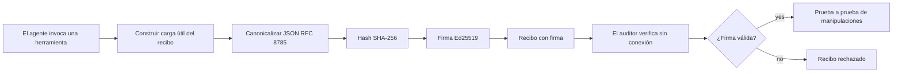
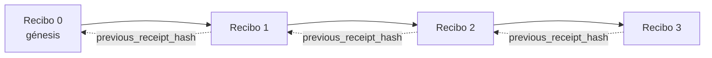

[Watch the lesson video: Asegurando Agentes de IA con Recibos Criptográficos](https://youtu.be/PLACEHOLDER_VIDEO_ID)

> _(El equipo de contenido de Microsoft añadirá el video de la lección y la miniatura después de la fusión, siguiendo el patrón de la lección 14 / 15.)_

# Asegurando Agentes de IA con Recibos Criptográficos

## Introducción

Esta lección cubrirá:

- Por qué las pistas de auditoría para agentes de IA son importantes para el cumplimiento, la depuración y la confianza.
- Qué es un recibo criptográfico y en qué se diferencia de una línea de registro sin firmar.
- Cómo producir un recibo firmado para una llamada de herramienta de un agente en Python simple.
- Cómo verificar un recibo sin conexión y detectar manipulaciones.
- Cómo encadenar recibos para que eliminar o reordenar uno rompa la cadena.
- Qué prueban los recibos y qué explícitamente no prueban.

## Objetivos de aprendizaje

Después de completar esta lección, sabrá cómo:

- Identificar los modos de fallo que motivan la procedencia criptográfica para las acciones del agente.
- Producir un recibo firmado con Ed25519 sobre una carga útil JSON canónica.
- Verificar un recibo de forma independiente usando solo la clave pública del firmante.
- Detectar manipulaciones al volver a ejecutar la verificación en un recibo modificado.
- Construir una secuencia de recibos enlazados por hash y explicar por qué la cadena es importante.
- Reconocer el límite entre lo que los recibos prueban (atribución, integridad, orden) y lo que no prueban (corrección de la acción, solidez de la política).

## El problema: la pista de auditoría de su agente

Imagine que ha desplegado un agente de IA para Contoso Travel. El agente lee las solicitudes de los clientes, llama a una API de vuelos para buscar opciones y reserva asientos en nombre del cliente. El último trimestre, el agente procesó 50,000 reservas.

Hoy llega un auditor. Pregunta algo sencillo: "Muéstreme qué hizo su agente."

Usted entrega sus archivos de registro. El auditor los revisa y plantea la pregunta más difícil: "¿Cómo sé que estos registros no fueron editados?"

Este es el problema de la pista de auditoría. La mayoría de los despliegues de agentes hoy en día dependen de:

- **Registros de aplicación**: escritos por el propio agente, editables por cualquiera con acceso al sistema de archivos.
- **Servicios de registro en la nube**: a prueba de manipulaciones a nivel de plataforma pero solo si el auditor confía en el operador de la plataforma.
- **Registros de transacciones de base de datos**: adecuados para cambios en bases de datos pero no para llamadas arbitrarias a herramientas.

Ninguno de estos puede responder a la pregunta del auditor sin que el auditor deba confiar en alguien (usted, su proveedor de nube, su proveedor de base de datos). Para uso interno, esa confianza suele ser aceptable. Para cargas reguladas (finanzas, salud, cualquier cosa sujeta a la Ley de IA de la UE), no lo es.

Los recibos criptográficos solucionan esto haciendo que cada acción del agente sea verificable de manera independiente. El auditor no necesita confiar en usted. Solo necesita su clave pública y el recibo mismo.

## ¿Qué es un recibo criptográfico?

Un recibo es un objeto JSON que registra lo que hizo un agente, firmado con una firma digital.


```mermaid
flowchart LR
    A[El agente invoca una herramienta] --> B[Construir carga útil del recibo]
    B --> C[Canonicalizar JSON RFC 8785]
    C --> D[Hash SHA-256]
    D --> E[Firma Ed25519]
    E --> F[Recibo con firma]
    F --> G[El auditor verifica sin conexión]
    G --> H{¿Firma válida?}
    H -- yes --> I[Prueba a prueba de manipulaciones]
    H -- no --> J[Recibo rechazado]
```
  
Un recibo mínimo se ve así:

```json
{
  "type": "agent.tool_call.v1",
  "agent_id": "contoso-travel-bot",
  "tool_name": "lookup_flights",
  "tool_args_hash": "sha256:a3f9c1...",
  "result_hash": "sha256:7b2e1d...",
  "policy_id": "contoso-travel-policy-v3",
  "timestamp": "2026-04-25T14:30:00Z",
  "sequence": 47,
  "previous_receipt_hash": "sha256:9d4e6a...",
  "signature": {
    "alg": "EdDSA",
    "sig": "c5af83...",
    "public_key": "8f3b2c..."
  }
}
```
  
Tres propiedades hacen el trabajo:

1. **La firma**. El recibo es firmado por la puerta de enlace del agente usando una clave privada Ed25519. Cualquiera con la clave pública correspondiente puede verificar la firma sin conexión. Manipular cualquier campo invalida la firma.

2. **Codificación canónica**. Antes de firmar, el recibo se serializa usando el Esquema de Canonicalización JSON (JCS, RFC 8785). Esto asegura que dos implementaciones que producen el mismo recibo lógico generen una salida idéntica byte a byte. Sin canonicalización, diferentes serializadores JSON producirían diferentes firmas para el mismo contenido.

3. **Encadenamiento por hash**. El campo `previous_receipt_hash` enlaza cada recibo con el anterior. Eliminar o reordenar un recibo rompe todos los recibos posteriores. La manipulación se vuelve visible a nivel de la cadena incluso si se eluden firmas individuales.

Estas propiedades juntas proporcionan tres garantías:

- **Atribución**: esta clave firmó este contenido.
- **Integridad**: el contenido no ha cambiado desde la firma.
- **Orden**: este recibo vino después de ese recibo en la cadena.

## Produciendo un recibo en Python

No necesita una biblioteca especial para producir un recibo. Las primitivas criptográficas están ampliamente disponibles y la lógica son unas pocas decenas de líneas en Python.

Los ejercicios prácticos en `code_samples/18-signed-receipts.ipynb` recorren todo el flujo. La versión resumida:

```python
import json
import hashlib
import base64
from nacl import signing
from jcs import canonicalize  # JSON canónico RFC 8785

def b64url_nopad(data: bytes) -> str:
    return base64.urlsafe_b64encode(data).decode("ascii").rstrip("=")

def sha256_canonical(obj) -> str:
    """SHA-256 of a Python object's JCS-canonical JSON form."""
    return f"sha256:{hashlib.sha256(canonicalize(obj)).hexdigest()}"

# Generar o cargar una clave de firma (en producción, almacenar en una bóveda de claves)
signing_key = signing.SigningKey.generate()
verify_key = signing_key.verify_key

# Construir la carga útil del recibo (aún sin firma)
tool_args = {"origin": "SYD", "destination": "LAX"}
tool_result = [{"flight": "QF11", "price": 1850, "stops": 0}]

payload = {
    "type": "agent.tool_call.v1",
    "agent_id": "contoso-travel-bot",
    "tool_name": "lookup_flights",
    "tool_args_hash": sha256_canonical(tool_args),
    "result_hash": sha256_canonical(tool_result),
    "policy_id": "contoso-travel-policy-v3",
    "timestamp": "2026-04-25T14:30:00Z",
    "sequence": 0,
    "previous_receipt_hash": None,
}

# Canonicalizar, hashear, firmar.
canonical_bytes = canonicalize(payload)
message_hash = hashlib.sha256(canonical_bytes).digest()
signature_bytes = signing_key.sign(message_hash).signature

# Adjuntar un objeto de firma estructurado.
receipt = {
    **payload,
    "signature": {
        "alg": "EdDSA",
        "sig": b64url_nopad(signature_bytes),
        "public_key": b64url_nopad(bytes(verify_key)),
    },
}
```
  
Ese es todo el pipeline de firma. Los ejercicios en el cuaderno explican cada paso.

## Verificando un recibo y detectando manipulaciones

La verificación es la operación inversa:

```python
import base64
import hashlib
from nacl import signing
from nacl.exceptions import BadSignatureError
from jcs import canonicalize

def b64url_decode(s: str) -> bytes:
    padding = "=" * ((4 - len(s) % 4) % 4)
    return base64.urlsafe_b64decode(s + padding)

def verify_receipt(receipt: dict) -> bool:
    # La firma es un objeto estructurado: {"alg", "sig", "public_key"}.
    sig_obj = receipt.get("signature")
    if not sig_obj or sig_obj.get("alg") != "EdDSA":
        return False

    # Reconstruir la carga útil que realmente fue firmada (todo excepto la firma).
    payload = {k: v for k, v in receipt.items() if k != "signature"}

    canonical_bytes = canonicalize(payload)
    message_hash = hashlib.sha256(canonical_bytes).digest()

    try:
        verify_key = signing.VerifyKey(b64url_decode(sig_obj["public_key"]))
        verify_key.verify(message_hash, b64url_decode(sig_obj["sig"]))
        return True
    except BadSignatureError:
        return False
```
  
Esta función toma un recibo y devuelve `True` si la firma es válida, `False` de lo contrario. No hay llamada de red, ni dependencia de servicios, ni necesidad de confiar en terceros.

Para ver la detección de manipulaciones en acción, el cuaderno muestra:

1. Producción de un recibo válido y confirmación de que verifica.
2. Modificación de un byte del campo `tool_args_hash`.
3. Reejecución de la verificación y observación del fallo.

Esta es la demostración práctica de que los recibos son a prueba de manipulaciones: cualquier modificación, por pequeña que sea, rompe la firma.

## Encadenando recibos para agentes con múltiples pasos

Un solo recibo firmado protege una acción. Una cadena de recibos protege una secuencia.


```mermaid
flowchart LR
    R0[Recibo 0<br/>génesis] --> R1[Recibo 1]
    R1 --> R2[Recibo 2]
    R2 --> R3[Recibo 3]
    R1 -. previous_receipt_hash .-> R0
    R2 -. previous_receipt_hash .-> R1
    R3 -. previous_receipt_hash .-> R2
```
  
Cada recibo registra el hash del recibo anterior. Para eliminar en silencio el recibo 2, un atacante necesitaría ya sea:

- Modificar el campo `previous_receipt_hash` del recibo 3 (rompe la firma del recibo 3), O
- Forjar una nueva firma en un recibo 3 modificado (requiere la clave privada del agente).

Si la clave privada está en un almacén de claves hardware y publica la clave pública con cada recibo, ningún ataque es factible sin ser detectado.

El cuaderno recorre:

1. Construir una cadena de tres recibos.
2. Verificar que el `previous_receipt_hash` de cada recibo coincide con el hash real del recibo anterior.
3. Manipular un recibo en medio y observar cómo la cadena se rompe en ese punto exacto.

Así es como se produce una pista de auditoría que un auditor externo puede verificar sin necesidad de confiar en usted.

## Qué prueban los recibos (y qué no)

Esta es la sección más importante de esta lección. Los recibos son poderosos pero su poder tiene límites.

**Los recibos prueban tres cosas:**

1. **Atribución**: una clave específica firmó una carga útil específica.
2. **Integridad**: la carga útil no ha cambiado desde la firma.
3. **Orden**: este recibo vino después de ese recibo en la cadena de hash.

**Los recibos NO prueban:**

1. **Corrección**: que la acción del agente fue la acción correcta. Un recibo puede firmarse por una respuesta errónea tan limpiamente como por una correcta.
2. **Cumplimiento de políticas**: que la política referenciada en `policy_id` fue evaluada realmente, o que habría permitido esta acción si se hubiera comprobado. El recibo registra lo que se afirmó, no lo que se aplicó.
3. **Identidad más allá de la clave**: el recibo dice "esta clave firmó este contenido." No dice "esta persona autorizó esto." Conectar una clave a una persona u organización requiere infraestructura de identidad aparte (un directorio, un registro de claves públicas, etc.).
4. **Veracidad de las entradas**: si el agente recibe un prompt manipulado y actúa en consecuencia, el recibo registra fielmente la acción. Los recibos están abajo en la validación de entradas, no son un sustituto.

Este límite es importante por dos razones:

- Indica para qué son útiles los recibos: hacer que el comportamiento del agente sea auditable y evidente en caso de manipulaciones, incluso a través de límites organizacionales.
- Indica qué capas adicionales aún necesita: validación de entradas (Lección 6), aplicación de políticas (cubierto brevemente más abajo) e infraestructura de identidad (fuera del alcance de esta lección).

Un error común es asumir que "tenemos recibos" significa "estamos gobernados." No es así. Los recibos son una base. La gobernanza es el sistema que construye encima.

## Referencias de producción

El código Python en esta lección es intencionalmente mínimo para que pueda leer cada línea y entender exactamente qué está pasando. En producción, tiene dos opciones:

1. **Construir directamente sobre las primitivas criptográficas.** Las 50 líneas que vio arriba son suficientes para muchos casos. PyNaCl (Ed25519) y el paquete `jcs` (JSON canónico) son bibliotecas bien mantenidas y auditadas.

2. **Usar una biblioteca de recibos para producción.** Varios proyectos open source implementan el mismo patrón con características adicionales (rotación de claves, verificación en lote, distribución de conjuntos JWK, integración con motores de políticas):
   - El formato de recibo usado en esta lección sigue un borrador IETF Internet-Draft (`draft-farley-acta-signed-receipts`) actualmente en proceso de estandarización.
   - El Microsoft Agent Governance Toolkit combina recibos con decisiones políticas basadas en Cedar; vea el Tutorial 33 en ese repositorio para un ejemplo completo.
   - Los paquetes `protect-mcp` (npm) y `@veritasacta/verify` (npm) proporcionan una implementación Node de la firma de recibos y verificación sin conexión, destinada a envolver cualquier servidor MCP con una pista de auditoría evidente en caso de manipulación.
   - El SDK Python **[nobulex](https://github.com/arian-gogani/nobulex)** (`pip install nobulex`) ofrece el mismo patrón de firma Ed25519 + JCS en Python con integraciones para LangChain y CrewAI, incluyendo vectores de prueba de validación cruzada publicados y un mapeo de cumplimiento aportado vía [OWASP PR #2210](https://github.com/OWASP/CheatSheetSeries/pull/2210).

La decisión entre hacer su propio código y usar una biblioteca refleja la decisión entre escribir su propia biblioteca JWT y usar una probada: ambas son razonables; la biblioteca ahorra tiempo y reduce la superficie de auditoría; el enfoque desde cero lo obliga a entender cada primitiva. Esta lección enseña el camino desde cero para que tenga la base para cualquiera de las dos opciones.

## Comprobación de conocimientos

Ponga a prueba su comprensión antes de pasar al ejercicio práctico.

**1. Un recibo está firmado con la clave privada Ed25519 del agente. El auditor solo tiene la clave pública. ¿Puede el auditor verificar el recibo sin conexión?**

<details>
<summary>Respuesta</summary>

Sí. La verificación Ed25519 requiere solo la clave pública y los bytes firmados. No hay llamada a la red, ni dependencia de servicios. Esta es la propiedad que hace los recibos útiles en auditorías aisladas, multi-organizacionales o de baja confianza.
</details>

**2. Un atacante modifica el campo `policy_id` de un recibo para afirmar que estaba gobernado por una política más permisiva. La firma fue sobre la carga original. ¿Qué ocurre durante la verificación?**

<details>
<summary>Respuesta</summary>

La verificación falla. La firma se calculó sobre los bytes canónicos de la carga original; modificar cualquier campo cambia los bytes canónicos, lo que cambia el hash SHA-256, invalidando la firma. El atacante necesitaría la clave privada para producir una firma válida fresca, la cual no tiene.
</details>

**3. ¿Por qué el recibo incluye un `tool_args_hash` y un `result_hash` en lugar de los argumentos y resultados en bruto?**

<details>
<summary>Respuesta</summary>

Dos razones. Primero, el recibo puede necesitar archivarse o transmitirse en entornos donde filtrar el contenido en bruto (información personal, datos empresariales) es un problema. El hash mantiene el recibo pequeño y el contenido privado; el auditor verifica que el hash coincida con una copia almacenada por separado del contenido real. Segundo, los hashes tienen tamaño fijo; un recibo con hashes es limitado en tamaño sin importar cuán grandes fueron los insumos y resultados.
</details>

**4. El campo `previous_receipt_hash` vincula cada recibo con su predecesor. Si un atacante elimina silenciosamente un recibo en medio de una cadena, ¿qué se invalida?**

<details>
<summary>Respuesta</summary>

Todos los recibos que vinieron después del eliminado. Sus campos `previous_receipt_hash` ya no coinciden con la cadena real (porque el recibo referenciado ya no existe o la cadena ahora apunta a un predecesor diferente). Para ocultar la eliminación, el atacante tendría que volver a firmar cada recibo posterior, lo que requiere la clave privada.
</details>

**5. Un recibo verifica correctamente. ¿Prueba eso que la acción del agente fue correcta, sólida o conforme a la política?**

<details>
<summary>Respuesta</summary>

No. Un recibo válido prueba tres cosas: atribución (esta clave firmó este contenido), integridad (el contenido no ha cambiado) y orden (este recibo vino después de aquel). NO prueba que la acción fue correcta, que la política nombrada en `policy_id` fue realmente evaluada o que el agente siguió todas las reglas. Los recibos hacen auditable el comportamiento del agente, no necesariamente correcto. Este es el límite más importante de la lección.
</details>

## Ejercicio práctico

Abra `code_samples/18-signed-receipts.ipynb` y complete las cuatro secciones:

1. **Sección 1**: Firme su primer recibo y verifíquelo.
2. **Sección 2**: Manipule el recibo y observe que la verificación falla.
3. **Sección 3**: Construya una cadena de tres recibos y verifique la integridad de la cadena.
4. **Sección 4**: Aplique el patrón a un agente construido con Microsoft Agent Framework: envuelva una llamada a una herramienta en la firma de recibos, luego verifique el recibo de forma independiente.
**Desafío adicional 1:** extiende el esquema del recibo con un campo adicional de tu elección (por ejemplo, un ID de solicitud para rastreo), actualiza la lógica canónica de firmado para incluirlo, y confirma que el recibo sigue pasando la verificación ida y vuelta. Luego modifica el campo después de firmar y confirma que la verificación falla. Esto te obliga a entender cómo cada byte de la codificación canónica contribuye a la firma.

**Desafío adicional 2:** calcula el hash SHA-256 de dos de tus recibos juntos (concatena sus bytes canónicos en un orden determinista) e inserta el resumen resultante como un nuevo campo en un tercer recibo antes de firmarlo. Verifica que los tres recibos sigan pasando la verificación ida y vuelta. Acabas de construir una prueba de inclusión en un solo paso: cualquier persona que tenga el tercer recibo puede probar que los dos primeros existían en el momento en que fue firmado, sin necesidad de revelar su contenido. Este es el patrón que usan los recibos de revelación selectiva a escala (compromisos Merkle, RFC 6962).

## Conclusión

Los recibos criptográficos ofrecen a los agentes de IA una pista de auditoría que es:

- **Verificable de forma independiente**: cualquier parte con la clave pública puede verificar, sin dependencia de servicios.
- **A prueba de manipulaciones**: cualquier modificación invalida la firma.
- **Portátil**: un recibo es un archivo JSON pequeño; puede archivarse, transmitirse y verificarse en cualquier lugar.
- **Alineado con estándares**: construido sobre Ed25519 (RFC 8032), JCS (RFC 8785) y SHA-256, todas primitivas ampliamente desplegadas.

No sustituyen la validación de entrada, la aplicación de políticas ni la infraestructura de identidad. Son la base para esas capas. Cuando despliegas agentes en cargas de trabajo reguladas, flujos laborales entre múltiples organizaciones, o en cualquier entorno donde un auditor futuro no pueda suponerse que confíe en ti, los recibos son cómo haces que la pista de auditoría sea honesta.

La conclusión más importante: los recibos prueban quién dijo qué y cuándo. No prueban que lo que se dijo sea verdad o correcto. Mantén esa distinción firmemente. Es la diferencia entre un sistema de procedencia honesto y uno engañoso.

## Lista de Verificación para Producción

Cuando estés listo para pasar de esta lección a desplegar agentes que firmen recibos en un entorno real:

- [ ] **Mueve la clave de firma fuera del portátil del desarrollador.** Usa Azure Key Vault, AWS KMS o un módulo de seguridad hardware. La clave privada que firma tus recibos nunca debe estar en control de código o en texto plano en máquinas de aplicación.
- [ ] **Publica la clave pública de verificación.** Los auditores la necesitan para verificar sin conexión. El patrón estándar es un JWK Set en una URL bien conocida (RFC 7517), por ejemplo, `https://your-org.example.com/.well-known/agent-keys.json`.
- [ ] **Ancla la cadena externamente.** Escribe periódicamente el hash de la cabeza más reciente de la cadena en un registro de transparencia (Sigstore Rekor, autoridad de tiempo RFC 3161, o un segundo sistema interno) para que una parte externa pueda confirmar "esta cadena existía en este momento."
- [ ] **Almacena los recibos de forma inmutable.** El almacenamiento de solo anexado (Azure Storage con políticas de inmutabilidad, AWS S3 Object Lock) evita que un interno reescriba la historia a nivel de almacenamiento.
- [ ] **Decide sobre la retención.** Muchos regímenes de cumplimiento requieren retención de varios años. Planifica el crecimiento de los recibos (cada recibo pesa ~500 bytes; un agente que realiza 10K llamadas por día genera ~1.8 GB al año).
- [ ] **Documenta qué no cubren los recibos.** Los recibos prueban atribución, integridad y orden. Tu libro de operaciones debe listar explícitamente qué controles adicionales (validación de entrada, aplicación de políticas, limitación de tasa, infraestructura de identidad) complementan a los recibos en tu postura de gobierno.

### ¿Tienes más preguntas sobre cómo asegurar agentes de IA?

Únete al [Microsoft Foundry Discord](https://aka.ms/ai-agents/discord) para reunirte con otros aprendices, asistir a horas de oficina y resolver tus preguntas sobre agentes de IA.

## Más allá de esta lección

Esta lección cubre la firma de recibos individuales y secuencias encadenadas por hash. Las mismas primitivas componen varios patrones más avanzados que puedes encontrar a medida que madura tu postura de gobierno:

- **Revelación selectiva.** Cuando los campos de un recibo están comprometidos de forma independiente (árbol Merkle estilo RFC 6962), puedes revelar campos específicos a auditores específicos y probar que el resto no cambió sin exponerlos. Útil cuando el mismo recibo debe satisfacer tanto una auditoría exhaustiva (que desea completitud) como regulaciones de minimización de datos como GDPR (que quieren que el auditor vea lo menos posible).
- **Revocación de recibos.** Si una clave de firma se compromete, necesitas una forma de marcar todos los recibos firmados por esa clave como no confiables desde un punto en adelante. Patrones estándar: claves de firma con corta vida más una lista de revocación publicada, o un registro de transparencia con entradas de revocación.
- **Recibos bilaterales / con firma dividida.** Algunas implementaciones dividen la carga firmada en mitades pre-ejecución (`authorization_*`) y post-ejecución (`result_*`) con firmas independientes, útil cuando la decisión de autorización y el resultado observado son producidos por actores diferentes o en tiempos distintos. Esto se compone sobre el formato de recibo enseñado en esta lección.
- **Composición de carga.** Un recibo sella los bytes que pongas en `result_hash`. Las cargas útiles del mundo real suelen ser más ricas que un solo resultado de llamada de herramienta: razonamiento pre-decisional (predicción del modelo, opciones consideradas, evidencia y su completitud, postura de riesgo, cadena de responsabilidad, resultado de puertas) pueden vivir dentro de la carga, sellados por un único recibo. Esto mantiene el formato del recibo minimalista mientras permite que los esquemas de carga evolucionen por dominio.
- **Conformidad entre implementaciones.** Múltiples implementaciones independientes del mismo formato de recibo (Python, TypeScript, Rust, Go) se verifican entre sí usando vectores de prueba compartidos. Si construyes tu propia implementación, validar contra vectores publicados confirma compatibilidad de protocolo.
- **Migración post-cuántica.** Ed25519 está ampliamente desplegado hoy pero no es resistente a la computación cuántica. El formato del recibo es ágil en cuanto a algoritmos: el campo `signature.alg` puede llevar `ML-DSA-65` (el estándar de firma post-cuántica de NIST) cuando se necesite migrar. Planifica un período de transición donde los recibos estén firmados doblemente.

## Recursos adicionales

- <a href="https://datatracker.ietf.org/doc/draft-farley-acta-signed-receipts/" target="_blank">Borrador IETF: Recibos de Decisión Firmados para Control de Acceso Máquina a Máquina</a>
- <a href="https://learn.microsoft.com/azure/ai-studio/responsible-use-of-ai-overview" target="_blank">Resumen de IA Responsable (Azure IA)</a>
- <a href="https://datatracker.ietf.org/doc/html/rfc8032" target="_blank">RFC 8032: Algoritmo de Firma Digital Edwards-Curve (EdDSA)</a>
- <a href="https://datatracker.ietf.org/doc/html/rfc8785" target="_blank">RFC 8785: Esquema de Canonicalización JSON (JCS)</a>
- <a href="https://datatracker.ietf.org/doc/html/rfc6962" target="_blank">RFC 6962: Transparencia de Certificados</a> (construcción de árbol Merkle usada por recibos de revelación selectiva)
- <a href="https://github.com/microsoft/agent-governance-toolkit/blob/main/docs/tutorials/33-offline-verifiable-receipts.md" target="_blank">Microsoft Agent Governance Toolkit, Tutorial 33: Recibos de Decisión Verificables sin Conexión</a>
- <a href="https://github.com/ScopeBlind/agent-governance-testvectors" target="_blank">Vectores de prueba de conformidad entre implementaciones</a> para el formato de recibo usado en esta lección (Apache-2.0)
- <a href="https://pynacl.readthedocs.io/" target="_blank">Documentación de PyNaCl</a> (Ed25519 en Python)

## Lección anterior

[Construcción de agentes de uso de computadora (CUA)](../15-browser-use/README.md)

---

<!-- CO-OP TRANSLATOR DISCLAIMER START -->
**Descargo de responsabilidad**:
Este documento ha sido traducido utilizando el servicio de traducción automática [Co-op Translator](https://github.com/Azure/co-op-translator). Aunque nos esforzamos por la precisión, tenga en cuenta que las traducciones automatizadas pueden contener errores o inexactitudes. El documento original en su idioma nativo debe considerarse la fuente autorizada. Para información crítica, se recomienda una traducción profesional humana. No somos responsables de cualquier malentendido o interpretación errónea que surja del uso de esta traducción.
<!-- CO-OP TRANSLATOR DISCLAIMER END -->