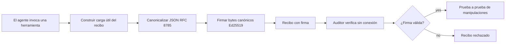
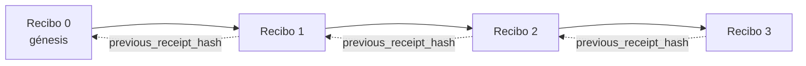

[Mira el video de la lección: Asegurando Agentes de IA con Recibos Criptográficos](https://youtu.be/PLACEHOLDER_VIDEO_ID)

> _(Video de la lección y miniatura serán añadidos por el equipo de contenido de Microsoft después de la fusión, siguiendo el patrón de la lección 14 / 15.)_

# Asegurando Agentes de IA con Recibos Criptográficos

## Introducción

Esta lección cubrirá:

- Por qué las pistas de auditoría para agentes de IA son importantes para cumplimiento, depuración y confianza.
- Qué es un recibo criptográfico y cómo se diferencia de una línea de registro sin firmar.
- Cómo producir un recibo firmado para una llamada a herramienta de un agente en Python puro.
- Cómo verificar un recibo sin conexión y detectar manipulaciones.
- Cómo encadenar recibos para que eliminar o reordenar uno rompa la cadena.
- Qué prueban los recibos y qué explícitamente no prueban.

## Objetivos de Aprendizaje

Después de completar esta lección, sabrás cómo:

- Identificar los modos de falla que motivan la procedencia criptográfica para acciones de agentes.
- Producir un recibo firmado con Ed25519 sobre una carga útil JSON canónica.
- Verificar un recibo de forma independiente usando solo la clave pública del firmante.
- Detectar manipulaciones volviendo a ejecutar la verificación en un recibo modificado.
- Construir una secuencia encadenada de recibos y explicar por qué la cadena importa.
- Reconocer el límite entre lo que los recibos prueban (atribución, integridad, orden) y lo que no (corrección de la acción, solidez de la política).

## El Problema: La Pista de Auditoría de Tu Agente

Imagina que has implementado un agente de IA para Contoso Travel. El agente lee solicitudes de clientes, llama a una API de vuelos para buscar opciones y reserva asientos en nombre del cliente. El último trimestre, el agente procesó 50,000 reservas.

Hoy llega un auditor. Hace una pregunta simple: "Muéstrame lo que hizo tu agente."

Entregas tus archivos de registro. El auditor los examina y plantea una pregunta más difícil: "¿Cómo sé que estos registros no fueron editados?"

Este es el problema de la pista de auditoría. La mayoría de las implementaciones de agentes hoy dependen de:

- **Registros de aplicación**: escritos por el propio agente, editables por cualquiera con acceso al sistema de archivos.
- **Servicios de registro en la nube**: evidentes de manipulación a nivel de plataforma pero solo si el auditor confía en el operador de la plataforma.
- **Registros de transacciones de base de datos**: bien adaptados para cambios en bases de datos pero no para llamadas arbitrarias a herramientas.

Ninguno de estos puede responder a la pregunta del auditor sin requerir que el auditor confíe en alguien (tú, tu proveedor en la nube, tu proveedor de base de datos). Para uso interno, esa confianza suele ser aceptable. Para cargas reguladas (finanzas, salud, cualquier cosa sujeta al AI Act de la UE), no lo es.

Los recibos criptográficos resuelven esto haciendo cada acción del agente verificable de forma independiente. El auditor no necesita confiar en ti. Solo necesita tu clave pública y el recibo mismo.

## ¿Qué es un Recibo Criptográfico?

Un recibo es un objeto JSON que registra lo que hizo un agente, firmado con una firma digital.


```mermaid
flowchart LR
    A[El agente invoca una herramienta] --> B[Construir carga útil del recibo]
    B --> C[Canonicalizar JSON RFC 8785]
    C --> E[Firmar bytes canónicos Ed25519]
    E --> F[Recibo con firma]
    F --> G[Auditor verifica sin conexión]
    G --> H{¿Firma válida?}
    H -- yes --> I[Prueba a prueba de manipulaciones]
    H -- no --> J[Recibo rechazado]
```

Un recibo mínimo luce así:

```json
{
  "type": "agent.tool_call.v1",
  "agent_id": "contoso-travel-bot",
  "tool_name": "lookup_flights",
  "tool_args_hash": "sha256:a3f9c1...",
  "result_hash": "sha256:7b2e1d...",
  "policy_id": "contoso-travel-policy-v3",
  "timestamp": "2026-04-25T14:30:00Z",
  "sequence": 47,
  "previous_receipt_hash": "sha256:9d4e6a...",
  "signature": {
    "alg": "EdDSA",
    "sig": "c5af83...",
    "public_key": "8f3b2c..."
  }
}
```

Tres propiedades están haciendo el trabajo:

1. **La firma**. El recibo es firmado por la puerta de enlace del agente usando una clave privada Ed25519. Cualquiera con la clave pública correspondiente puede verificar la firma sin conexión. Manipular cualquier campo invalida la firma.

2. **Codificación canónica**. Antes de firmar, el recibo se serializa usando JSON Canonicalization Scheme (JCS, RFC 8785). Esto asegura que dos implementaciones produciendo el mismo recibo lógico produzcan salida idéntica byte a byte. Sin canonicidad, diferentes serializadores JSON producirían firmas distintas para el mismo contenido.

3. **Encadenamiento por hash**. El campo `previous_receipt_hash` vincula cada recibo con el anterior. Eliminar o reordenar un recibo rompe todos los recibos que vinieron después. La manipulación se vuelve visible a nivel de cadena aunque se eludan firmas individuales.

Juntas estas propiedades proveen tres garantías:

- **Atribución**: esta clave firmó este contenido.
- **Integridad**: el contenido no ha cambiado desde la firma.
- **Orden**: este recibo vino después de ese recibo en la cadena.

## Produciendo un Recibo en Python

No necesitas una biblioteca especial para producir un recibo. Las primitivas criptográficas están ampliamente disponibles y la lógica es unas pocas decenas de líneas de Python.

Los ejercicios prácticos en `code_samples/18-signed-receipts.ipynb` recorren todo el flujo. La versión resumida:

```python
import json
import hashlib
import base64
from nacl import signing
from jcs import canonicalize  # JSON canónico RFC 8785

def b64url_nopad(data: bytes) -> str:
    return base64.urlsafe_b64encode(data).decode("ascii").rstrip("=")

def sha256_canonical(obj) -> str:
    """SHA-256 of a Python object's JCS-canonical JSON form."""
    return f"sha256:{hashlib.sha256(canonicalize(obj)).hexdigest()}"

# Generar o cargar una clave de firma (en producción, almacenar en un almacén de claves)
signing_key = signing.SigningKey.generate()
verify_key = signing_key.verify_key

# Construir la carga útil del recibo (aún sin firma)
tool_args = {"origin": "SYD", "destination": "LAX"}
tool_result = [{"flight": "QF11", "price": 1850, "stops": 0}]

payload = {
    "type": "agent.tool_call.v1",
    "agent_id": "contoso-travel-bot",
    "tool_name": "lookup_flights",
    "tool_args_hash": sha256_canonical(tool_args),
    "result_hash": sha256_canonical(tool_result),
    "policy_id": "contoso-travel-policy-v3",
    "timestamp": "2026-04-25T14:30:00Z",
    "sequence": 0,
    "previous_receipt_hash": None,
}

# Canonicalizar y firmar directamente los bytes JCS. PureEdDSA realiza hashes internamente.
canonical_bytes = canonicalize(payload)
signature_bytes = signing_key.sign(canonical_bytes).signature

# Adjuntar un objeto de firma estructurado.
receipt = {
    **payload,
    "signature": {
        "alg": "EdDSA",
        "sig": b64url_nopad(signature_bytes),
        "public_key": b64url_nopad(bytes(verify_key)),
    },
}
```

Esa es toda la canalización de firma. Los ejercicios en el cuaderno explican cada paso.

## Verificando un Recibo y Detectando Manipulaciones

La verificación es la operación inversa:

```python
import base64
import hashlib
from nacl import signing
from nacl.exceptions import BadSignatureError
from jcs import canonicalize

def b64url_decode(s: str) -> bytes:
    padding = "=" * ((4 - len(s) % 4) % 4)
    return base64.urlsafe_b64decode(s + padding)

def verify_receipt(receipt: dict) -> bool:
    # La firma es un objeto estructurado: {"alg", "sig", "public_key"}.
    sig_obj = receipt.get("signature")
    if not sig_obj or sig_obj.get("alg") != "EdDSA":
        return False

    # Reconstruir la carga útil que fue realmente firmada (todo excepto la firma).
    payload = {k: v for k, v in receipt.items() if k != "signature"}

    canonical_bytes = canonicalize(payload)

    try:
        verify_key = signing.VerifyKey(b64url_decode(sig_obj["public_key"]))
        verify_key.verify(canonical_bytes, b64url_decode(sig_obj["sig"]))
        return True
    except BadSignatureError:
        return False
```

Esta función toma un recibo y retorna `True` si la firma es válida, `False` de lo contrario. No hay llamada a la red, ni dependencia de servicios, ni confianza necesaria en terceros.

Para ver la detección de manipulación en acción, el cuaderno recorre:

1. Producir un recibo válido y confirmar que verifica.
2. Modificar un byte del campo `tool_args_hash`.
3. Volver a ejecutar la verificación y ver que falla.

Esta es la demostración práctica que los recibos evidencian manipulaciones: cualquier modificación, por pequeña que sea, rompe la firma.

## Encadenando Recibos para Agentes con Múltiples Pasos

Un solo recibo firmado protege una acción. Una cadena de recibos protege una secuencia.


```mermaid
flowchart LR
    R0[Recibo 0<br/>génesis] --> R1[Recibo 1]
    R1 --> R2[Recibo 2]
    R2 --> R3[Recibo 3]
    R1 -. previous_receipt_hash .-> R0
    R2 -. previous_receipt_hash .-> R1
    R3 -. previous_receipt_hash .-> R2
```

Cada recibo registra el hash del recibo anterior. Para eliminar silenciosamente el recibo 2, un atacante necesitaría o:

- Modificar el campo `previous_receipt_hash` del recibo 3 (rompe la firma del recibo 3), O
- Forjar una nueva firma sobre un recibo 3 modificado (requiere la clave privada del agente).

Si la clave privada está en un almacén hardware y publicas la clave pública con cada recibo, ninguno de los ataques es factible sin detección.

El cuaderno recorre:

1. Construir una cadena de tres recibos.
2. Verificar que el `previous_receipt_hash` de cada recibo coincide con el hash real del recibo previo.
3. Manipular un recibo en el medio y ver que la cadena se rompe justo en ese punto.

Así produces una pista de auditoría que un auditor externo puede verificar sin confiar en ti.

## Qué Prueban los Recibos (y Qué No)

Esta es la sección más importante de esta lección. Los recibos son poderosos pero su poder es limitado.

**Los recibos prueban tres cosas:**

1. **Atribución**: una clave específica firmó una carga útil específica.
2. **Integridad**: la carga útil no ha cambiado desde la firma.
3. **Orden**: este recibo vino después de ese recibo en la cadena de hashes.

**Los recibos NO prueban:**

1. **Corrección**: que la acción del agente fue la acción correcta. Un recibo puede firmarse por una respuesta equivocada tan limpiamente como por una correcta.
2. **Cumplimiento de políticas**: que la política referenciada en `policy_id` fue realmente evaluada, o que habría permitido esta acción si se hubiera comprobado. El recibo registra lo que se afirmó, no lo que se hizo cumplir.
3. **Identidad más allá de la clave**: el recibo dice "esta clave firmó este contenido". No dice "este humano autorizó esto". Conectar una clave a una persona u organización requiere infraestructura de identidad separada (un directorio, un registro de claves públicas, etc.).
4. **Veracidad de las entradas**: si el agente recibe un prompt manipulado y actúa en base a él, el recibo registra la acción fielmente. Los recibos están aguas abajo de la validación de entradas, no son un sustituto de ella.

Este límite importa por dos razones:

- Te indica para qué son útiles los recibos: hacer que el comportamiento del agente sea auditable y evidente de manipulaciones, incluso a través de límites organizacionales.
- Te indica qué capas adicionales necesitas aún: validación de entradas (Lección 6), aplicación de políticas (cubierto brevemente más abajo), e infraestructura de identidad (fuera del alcance de esta lección).

Un error común es asumir que "tenemos recibos" significa "estamos gobernados". No es así. Los recibos son una base. La gobernanza es el sistema que construyes encima.

## Probar que un Humano Aprobó la Acción Exacta

El punto 3 arriba merece su propia sección: un recibo de acción dice "esta clave firmó este contenido", nunca "un humano autorizó esto." Para acciones de alto riesgo (reembolsos, eliminaciones, transferencias bancarias), los marcos de gobernanza requieren cada vez más esa declaración faltante, y puede producirse con las mismas primitivas que ya construiste en esta lección.

El cuaderno complementario `code_samples/human-authorization-receipts.ipynb` añade un segundo tipo de recibo, `human.approval.v1`, con la misma forma de sobre que los recibos de la lección (una carga útil tipada firmada por Ed25519 sobre sus bytes canónicos JCS, con el objeto `signature` fuera de los bytes firmados). Un aprobador nombrado firma la **acción canónica completa y su digest** antes de la ejecución; el recibo de acción del agente lleva el **mismo digest de acción** y un `parent_approval_ref`, el `receipt_hash` de la aprobación, la misma convención que `previous_receipt_hash` en la cadena que construiste arriba. Un `verify_chain` recorre ambos artefactos bajo **registros de claves fijas separadas** (claves de aprobadores vs claves de agentes), así que la ruta de código es compartida pero las autoridades nunca lo son.

La propiedad que esto compra, expresada cuidadosamente: *el humano aprobó esta acción exacta, y el agente ejecutó exactamente esa acción aprobada.* Los fixtures de rechazo del cuaderno son lo que hace que la propiedad sea real y no solo una afirmación:

- el conjunto clásico: manipulación, diputado confundido, repetición, claves forjadas en cualquiera de los lados, input mal formado;
- **autoridad obsoleta**: una firma que todavía verifica, rechazada de todos modos porque la versión de la política cambió, la clave del aprobador fue rotada fuera del registro fijo, o la aprobación expiró antes de la ejecución;
- **sustitución de digest**: un recibo de acción válido firmado que apunta a una aprobación *real* que liga una acción canónica *diferente*.

Cada fallo rechaza con una razón distinta, así que un auditor leyendo un rechazo puede decir si la autoridad caducó o la acción ejecutada cambió. La regla que enseña el cuaderno: una aprobación firmada no es autoridad por sí misma. La autoridad existe solo si ambos recibos todavía enlazan a la misma acción canónica al momento de la ejecución. El recibo de aprobación humana es una composición educativa definida por esta lección, no un tipo de recibo definido por `draft-farley-acta-signed-receipts`.

## Referencias de Producción

El código Python en esta lección es intencionalmente mínimo para que puedas leer cada línea y entender exactamente qué está pasando. En producción tienes dos opciones:

1. **Construir directamente sobre las primitivas criptográficas.** Las 50 líneas que viste arriba son suficientes para muchos casos de uso. PyNaCl (Ed25519) y el paquete `jcs` (JSON canónico) son bibliotecas bien mantenidas y auditadas.

2. **Usar una biblioteca de recibos para producción.** Varios proyectos open-source implementan el mismo patrón con características adicionales (rotación de claves, verificación por lotes, distribución de JWK Set, integración con motores de políticas):
   - La canalización de firma usa las convenciones de JCS y ámbito de firma en un borrador independiente IETF Internet-Draft ([`draft-farley-acta-signed-receipts`](https://datatracker.ietf.org/doc/draft-farley-acta-signed-receipts/), revisión 02). El recibo plano educativo de esta lección difiere del sobre `{payload, signature}` del borrador y no se presenta como una implementación conforme. El borrador publica una suite de conformidad compartida ([agent-governance-testvectors](https://github.com/ScopeBlind/agent-governance-testvectors)) para implementaciones enfocadas en su formato en red.
   - El Microsoft Agent Governance Toolkit compone recibos con decisiones de política basadas en Cedar; consulta el Tutorial 33 en ese repositorio para un ejemplo de extremo a extremo.
   - Los paquetes `protect-mcp` (npm) y `@veritasacta/verify` (npm) proveen una implementación basada en Node de firma de recibos y verificación offline, diseñada para envolver cualquier servidor MCP con una pista de auditoría evidente de manipulación, incluyendo un flujo de co-firma retenida en el que una acción en pausa emite un recibo de aprobación ligado al digest de la acción (respaldado por WebAuthn en el flujo de escritorio), el mismo patrón de recibo de aprobación que el cuaderno de autorización humana arriba.
   - El SDK Python **[nobulex](https://github.com/arian-gogani/nobulex)** (`pip install nobulex`) provee el mismo patrón de firma Ed25519 + JCS en Python con integraciones LangChain y CrewAI, incluyendo vectores de prueba para validación cruzada publicados y un mapeo de cumplimiento contribuido vía [OWASP PR #2210](https://github.com/OWASP/CheatSheetSeries/pull/2210).

La decisión entre construir tu propia solución o usar una biblioteca refleja la decisión entre escribir tu propia biblioteca JWT y usar una probada: ambas son razonables; la biblioteca ahorra tiempo y reduce la superficie de auditoría; el enfoque desde cero te obliga a entender cada primitiva. Esta lección enseña el camino desde cero para que tengas la base para cualquiera de las dos opciones.

## Verificación de Conocimientos

Pon a prueba tu comprensión antes de pasar al ejercicio práctico.

**1. Un recibo está firmado con la clave privada Ed25519 del agente. El auditor solo tiene la clave pública. ¿Puede el auditor verificar el recibo sin conexión?**

<details>
<summary>Respuesta</summary>

Sí. La verificación Ed25519 requiere solo la clave pública y los bytes firmados. No hay llamada a la red, ni dependencia de servicios. Esta es la propiedad que hace útiles los recibos en entornos aislados, multi-organizacionales o de baja confianza para auditorías.
</details>

**2. Un atacante modifica el campo `policy_id` de un recibo para afirmar que estuvo gobernado por una política más permisiva. La firma fue sobre la carga útil original. ¿Qué ocurre durante la verificación?**

<details>
<summary>Respuesta</summary>


La verificación falla. La firma se calculó sobre los bytes canónicos de la carga útil original; modificar cualquier campo cambia esos bytes, lo que invalida la firma. El atacante necesitaría la clave privada para producir una firma válida nueva, la cual no posee.
</details>

**3. ¿Por qué el recibo incluye un `tool_args_hash` y `result_hash` en lugar de los argumentos y resultados en bruto?**

<details>
<summary>Respuesta</summary>

Por dos motivos. Primero, el recibo puede necesitar archivarse o transmitirse en entornos donde filtrar el contenido en bruto (PII, datos comerciales) es un problema. Hashear mantiene el recibo pequeño y el contenido privado; el auditor verifica que el hash coincida con una copia almacenada por separado del contenido real. Segundo, los hashes tienen un tamaño fijo; un recibo con hashes tiene un tamaño limitado independientemente de lo grandes que sean las entradas y salidas.
</details>

**4. El campo `previous_receipt_hash` vincula cada recibo con su predecesor. Si un atacante elimina silenciosamente un recibo en medio de una cadena, ¿qué se vuelve inválido?**

<details>
<summary>Respuesta</summary>

Todos los recibos que vinieron después del eliminado. Sus campos `previous_receipt_hash` ya no coinciden con la cadena real (porque el recibo al que hacían referencia ya no existe, o la cadena ahora apunta a un predecesor diferente). Para ocultar la eliminación, el atacante tendría que volver a firmar cada recibo posterior, lo cual requiere la clave privada.
</details>

**5. Un recibo se verifica correctamente. ¿Eso prueba que la acción del agente fue correcta, válida o conforme a la política?**

<details>
<summary>Respuesta</summary>

No. Un recibo válido demuestra tres cosas: atribución (esta clave firmó este contenido), integridad (el contenido no ha cambiado) y orden (este recibo vino después de aquel recibo). NO prueba que la acción fuera correcta, que la política nombrada en `policy_id` haya sido realmente evaluada, ni que el agente siguió todas las reglas. Los recibos hacen que el comportamiento del agente sea auditable, no necesariamente correcto. Esta es la distinción más importante en la lección.
</details>

## Ejercicio Práctico

Abra `code_samples/18-signed-receipts.ipynb` y complete las cuatro secciones:

1. **Sección 1**: Firme su primer recibo y verifíquelo.
2. **Sección 2**: Manipule el recibo y observe la falla en la verificación.
3. **Sección 3**: Construya una cadena de tres recibos y verifique la integridad de la cadena.
4. **Sección 4**: Aplique el patrón a un agente construido con Microsoft Agent Framework: envuelva una llamada a herramienta en la firma del recibo, luego verifique el recibo de forma independiente.

**Desafío adicional 1:** extienda el esquema del recibo con un campo adicional a su elección (por ejemplo, un ID de solicitud para trazabilidad), actualice la lógica de firma canónica para incluirlo y confirme que el recibo aún pasa por la verificación sin problemas. Luego modifique el campo después de la firma y confirme que la verificación falla. Esto le obliga a entender cómo cada byte de la codificación canónica contribuye a la firma.

**Desafío adicional 2:** Calcule el hash SHA-256 combinando dos de sus recibos (concatenando sus bytes canónicos en un orden determinista) e incorpore el resumen resultante como un nuevo campo en un tercer recibo antes de firmarlo. Verifique que los tres recibos todavía pasen la verificación. Acaba de construir una prueba de inclusión de un solo paso: cualquiera que tenga el tercer recibo puede demostrar que los dos primeros existían en el momento en que se firmó, sin necesidad de revelar sus contenidos. Este es el patrón que los recibos de divulgación selectiva usan a escala (compromisos Merkle, RFC 6962).

## Conclusión

Los recibos criptográficos brindan a los agentes de IA una pista de auditoría que es:

- **Verificable de forma independiente**: cualquier parte con la clave pública puede verificar, sin dependencia de servicio.
- **Evidente ante manipulación**: cualquier modificación invalida la firma.
- **Portátil**: un recibo es un pequeño archivo JSON; puede archivarse, transmitirse y verificarse en cualquier lugar.
- **Alineado con estándares**: construido sobre Ed25519 (RFC 8032), JCS (RFC 8785) y SHA-256, todas primitivas ampliamente desplegadas.

No son un sustituto de la validación de entrada, la aplicación de políticas o la infraestructura de identidad. Son una base para esas capas. Cuando desplegue agentes en cargas reguladas, flujos de trabajo multi-organización o cualquier entorno donde un auditor futuro no pueda confiar en usted, los recibos son cómo hace honesta la pista de auditoría.

La conclusión más importante: los recibos prueban quién dijo qué y cuándo. No prueban que lo dicho sea verdadero o correcto. Mantenga esa distinción clara. Es la diferencia entre un sistema de procedencia honesto y uno engañoso.

## Lista de verificación para producción

Cuando esté listo para avanzar desde esta lección hasta desplegar agentes con recibos firmados en un entorno real:

- [ ] **Mueva la clave de firma fuera del portátil del desarrollador.** Use Azure Key Vault, AWS KMS o un módulo de seguridad de hardware. La clave privada que firma sus recibos nunca debe residir en control de código fuente ni en texto plano en máquinas de aplicación.
- [ ] **Publique la clave pública de verificación.** Los auditores la necesitan para verificar offline. El patrón estándar es un conjunto JWK en una URL conocida (RFC 7517), por ejemplo, `https://your-org.example.com/.well-known/agent-keys.json`.
- [ ] **Ancle la cadena externamente.** Periódicamente escriba el hash de la cabeza de la cadena a un registro de transparencia (Sigstore Rekor, autoridad de timestamp RFC 3161, o un segundo sistema interno) para que un tercero externo pueda confirmar "esta cadena existía en este momento."
- [ ] **Almacene recibos de forma inmutable.** Un almacenamiento de blobs de solo anexado (Azure Storage con políticas de inmutabilidad, AWS S3 Object Lock) previene que un insider reescriba la historia a nivel de almacenamiento.
- [ ] **Decida la retención.** Muchos regímenes de cumplimiento requieren retención de múltiples años. Planee el crecimiento de recibos (cada recibo es ~500 bytes; un agente que hace 10K llamadas por día produce ~1.8 GB por año).
- [ ] **Documente lo que los recibos no cubren.** Los recibos prueban atribución, integridad y orden. Su guía operativa debe listar explícitamente qué controles adicionales (validación de entrada, aplicación de políticas, limitación de tasa, infraestructura de identidad) acompañan a los recibos en su postura de gobernanza.

### ¿Tiene más preguntas sobre cómo asegurar agentes de IA?

Únase al [Microsoft Foundry Discord](https://aka.ms/ai-agents/discord) para encontrarse con otros estudiantes, asistir a horas de oficina y obtener respuestas a sus preguntas sobre agentes de IA.

## Más allá de esta lección

Esta lección cubre la firma de recibos individuales y secuencias encadenadas con hashes. Las mismas primitivas se componen en varios patrones más avanzados que puede encontrar a medida que madura su postura de gobernanza:

- **Divulgación selectiva.** Cuando los campos de un recibo están comprometidos de forma independiente (árbol Merkle estilo RFC 6962), puede revelar campos específicos a auditores específicos y demostrar que el resto no ha cambiado sin exponerlos. Útil cuando el mismo recibo debe satisfacer tanto una auditoría exhaustiva (que quiere completitud) como regulaciones de minimización de datos como GDPR (que quieren que el auditor vea lo menos posible).
- **Revocación de recibos.** Si una clave de firma es comprometida, necesita una forma de marcar todos los recibos firmados por esa clave como no confiables desde cierto momento en adelante. Patrones estándar: claves de firma de corta duración más una lista de revocación publicada, o un registro de transparencia con entradas de revocación.
- **Recibos bilaterales / de firma dividida.** Algunas implementaciones dividen la carga firmada en medias pre-ejecución (`authorization_*`) y post-ejecución (`result_*`) con firmas independientes, útil cuando la decisión de autorización y el resultado observado son producidos por actores o en tiempos diferentes. Esto se suma aditivamente sobre el formato de recibo enseñado en esta lección.
- **Composición de carga útil.** Un recibo sella los bytes que pone en `result_hash`. Las cargas útiles reales suelen ser más ricas que un solo resultado de llamada a herramienta: razonamientos pre-decisionales (predicción de modelo, opciones consideradas, evidencia y su completitud, postura de riesgo, cadena de responsabilidad, resultado de puerta) pueden residir dentro de la carga, sellados por un solo recibo. Esto mantiene el formato del recibo minimalista mientras permite que los esquemas de carga evolutivos de dominio en dominio.
- **Conformidad entre implementaciones.** Múltiples implementaciones independientes del mismo formato de recibo (Python, TypeScript, Rust, Go) se verifican entre sí con vectores de prueba compartidos. Si construye su propia implementación, validar contra vectores publicados confirma compatibilidad de protocolo.
- **Migración poscuántica.** Ed25519 está ampliamente desplegado hoy pero no es resistente a la computación cuántica. El formato de recibo es ágil en algoritmos: el campo `signature.alg` puede portar `ML-DSA-65` (el estándar de firma poscuántico de NIST) cuando necesite migrar. Planee un período de transición donde los recibos estén firmados en doble modo.

## Recursos adicionales

- <a href="https://datatracker.ietf.org/doc/draft-farley-acta-signed-receipts/" target="_blank">Borrador IETF: Recibos de Decisión Firmados para Control de Acceso Máquina a Máquina</a>
- <a href="https://learn.microsoft.com/azure/ai-studio/responsible-use-of-ai-overview" target="_blank">Resumen de IA Responsable (Azure AI)</a>
- <a href="https://datatracker.ietf.org/doc/html/rfc8032" target="_blank">RFC 8032: Algoritmo de Firma Digital de Curva Edwards (EdDSA)</a>
- <a href="https://datatracker.ietf.org/doc/html/rfc8785" target="_blank">RFC 8785: Esquema de Canonicalización JSON (JCS)</a>
- <a href="https://datatracker.ietf.org/doc/html/rfc6962" target="_blank">RFC 6962: Transparencia de Certificados</a> (Construcción de árbol Merkle usado por recibos de divulgación selectiva)
- <a href="https://github.com/microsoft/agent-governance-toolkit/blob/main/docs/tutorials/33-offline-verifiable-receipts.md" target="_blank">Microsoft Agent Governance Toolkit, Tutorial 33: Recibos de Decisión Verificables Offline</a>
- <a href="https://github.com/ScopeBlind/agent-governance-testvectors" target="_blank">Vectores de prueba de conformidad entre implementaciones</a> para el formato de recibo usado en esta lección (Apache-2.0)
- <a href="https://pynacl.readthedocs.io/" target="_blank">Documentación PyNaCl</a> (Ed25519 en Python)

## Lección anterior

[Creación de agentes de IA locales](../17-creating-local-ai-agents/README.md)

---

<!-- CO-OP TRANSLATOR DISCLAIMER START -->
**Descargo de responsabilidad**:
Este documento ha sido traducido utilizando el servicio de traducción automática [Co-op Translator](https://github.com/Azure/co-op-translator). Aunque nos esforzamos por la precisión, tenga en cuenta que las traducciones automatizadas pueden contener errores o inexactitudes. El documento original en su idioma nativo debe considerarse la fuente autorizada. Para información crítica, se recomienda una traducción profesional humana. No somos responsables de cualquier malentendido o interpretación errónea que surja del uso de esta traducción.
<!-- CO-OP TRANSLATOR DISCLAIMER END -->