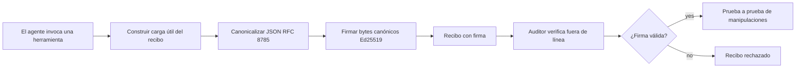
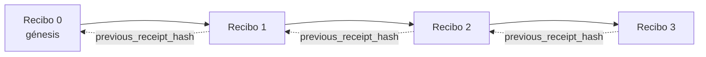

[Ver el video de la lección: Asegurando agentes de IA con recibos criptográficos](https://youtu.be/PLACEHOLDER_VIDEO_ID)

> _(El video de la lección y la miniatura serán añadidos por el equipo de contenido de Microsoft después de la fusión, siguiendo el patrón de la lección 14 / 15.)_

# Asegurando agentes de IA con recibos criptográficos

## Introducción

Esta lección cubrirá:

- Por qué los rastros de auditoría para agentes de IA son importantes para cumplimiento, depuración y confianza.
- Qué es un recibo criptográfico y cómo se diferencia de una línea de registro no firmada.
- Cómo producir un recibo firmado para la llamada a una herramienta de un agente en Python simple.
- Cómo verificar un recibo sin conexión y detectar manipulaciones.
- Cómo encadenar recibos para que eliminar o reordenar uno rompa la cadena.
- Qué prueban los recibos y qué no prueban explícitamente.

## Objetivos de aprendizaje

Al completar esta lección, sabrás cómo:

- Identificar las formas de falla que motivan la procedencia criptográfica para acciones de agentes.
- Producir un recibo firmado con Ed25519 sobre una carga útil JSON canónica.
- Verificar un recibo de manera independiente usando solo la clave pública del firmante.
- Detectar manipulaciones re-ejecutando la verificación sobre un recibo modificado.
- Construir una secuencia de recibos encadenados por hash y explicar por qué la cadena es importante.
- Reconocer el límite entre lo que prueban los recibos (atribución, integridad, orden) y lo que no (corrección de la acción, solidez de la política).

## El problema: el rastro de auditoría de tu agente

Imagina que has desplegado un agente de IA para Contoso Travel. El agente lee solicitudes de clientes, llama a una API de vuelos para buscar opciones y reserva asientos en nombre del cliente. El último trimestre, el agente procesó 50,000 reservas.

Hoy llega un auditor. Hace una pregunta simple: "Muéstrame qué hizo tu agente."

Le entregas tus archivos de registro. El auditor los revisa y hace la pregunta más difícil: "¿Cómo sé que estos registros no fueron editados?"

Este es el problema del rastro de auditoría. La mayoría de los despliegues de agentes hoy dependen de:

- **Registros de aplicación**: escritos por el propio agente, editables por cualquiera con acceso al sistema de archivos.
- **Servicios de registro en la nube**: evidencian manipulación a nivel de plataforma pero solo si el auditor confía en el operador de la plataforma.
- **Registros de transacciones de base de datos**: adecuados para cambios en la base de datos pero no para llamadas arbitrarias a herramientas.

Ninguno de estos puede responder a la pregunta del auditor sin que el auditor tenga que confiar en alguien (tú, tu proveedor de nube, tu proveedor de base de datos). Para uso interno, esa confianza suele ser aceptable. Para cargas reguladas (finanzas, salud, cualquier cosa sujeta al Acta de IA de la UE), no lo es.

Los recibos criptográficos resuelven esto haciendo que cada acción del agente sea verificable de forma independiente. El auditor no necesita confiar en ti. Solo necesita tu clave pública y el recibo mismo.

## ¿Qué es un recibo criptográfico?

Un recibo es un objeto JSON que registra lo que hizo un agente, firmado con una firma digital.


```mermaid
flowchart LR
    A[El agente invoca una herramienta] --> B[Construir carga útil del recibo]
    B --> C[Canonicalizar JSON RFC 8785]
    C --> E[Firmar bytes canónicos Ed25519]
    E --> F[Recibo con firma]
    F --> G[Auditor verifica fuera de línea]
    G --> H{¿Firma válida?}
    H -- yes --> I[Prueba a prueba de manipulaciones]
    H -- no --> J[Recibo rechazado]
```

Un recibo minimalista se ve así:

```json
{
  "type": "agent.tool_call.v1",
  "agent_id": "contoso-travel-bot",
  "tool_name": "lookup_flights",
  "tool_args_hash": "sha256:a3f9c1...",
  "result_hash": "sha256:7b2e1d...",
  "policy_id": "contoso-travel-policy-v3",
  "timestamp": "2026-04-25T14:30:00Z",
  "sequence": 47,
  "previous_receipt_hash": "sha256:9d4e6a...",
  "signature": {
    "alg": "EdDSA",
    "sig": "c5af83...",
    "public_key": "8f3b2c..."
  }
}
```

Tres propiedades están haciendo el trabajo:

1. **La firma**. El recibo está firmado por la puerta de enlace del agente usando una clave privada Ed25519. Cualquiera con la clave pública correspondiente puede verificar la firma sin conexión. Manipular cualquier campo invalida la firma.

2. **Codificación canónica**. Antes de firmar, el recibo se serializa usando JSON Canonicalization Scheme (JCS, RFC 8785). Esto asegura que dos implementaciones que produzcan el mismo recibo lógico produzcan salida idéntica byte a byte. Sin canonicalización, diferentes serializadores JSON producirían firmas distintas para el mismo contenido.

3. **Encadenamiento por hash**. El campo `previous_receipt_hash` enlaza cada recibo con el anterior. Eliminar o reordenar un recibo rompe todos los recibos posteriores en la cadena. La manipulación se vuelve visible a nivel de cadena aun si se saltan firmas individuales.

Juntas estas propiedades proveen tres garantías:

- **Atribución**: esta clave firmó este contenido.
- **Integridad**: el contenido no ha cambiado desde la firma.
- **Orden**: este recibo vino después de ese recibo en la cadena.

## Produciendo un recibo en Python

No necesitas una biblioteca especial para producir un recibo. Los primitivos criptográficos están ampliamente disponibles y la lógica es unas pocas docenas de líneas en Python.

Los ejercicios prácticos en `code_samples/18-signed-receipts.ipynb` recorren todo el flujo completo. La versión resumen:

```python
import json
import hashlib
import base64
from nacl import signing
from jcs import canonicalize  # JSON canónico RFC 8785

def b64url_nopad(data: bytes) -> str:
    return base64.urlsafe_b64encode(data).decode("ascii").rstrip("=")

def sha256_canonical(obj) -> str:
    """SHA-256 of a Python object's JCS-canonical JSON form."""
    return f"sha256:{hashlib.sha256(canonicalize(obj)).hexdigest()}"

# Generar o cargar una clave de firma (en producción, almacenar en una bóveda de claves)
signing_key = signing.SigningKey.generate()
verify_key = signing_key.verify_key

# Construir la carga útil del recibo (aún sin firma)
tool_args = {"origin": "SYD", "destination": "LAX"}
tool_result = [{"flight": "QF11", "price": 1850, "stops": 0}]

payload = {
    "type": "agent.tool_call.v1",
    "agent_id": "contoso-travel-bot",
    "tool_name": "lookup_flights",
    "tool_args_hash": sha256_canonical(tool_args),
    "result_hash": sha256_canonical(tool_result),
    "policy_id": "contoso-travel-policy-v3",
    "timestamp": "2026-04-25T14:30:00Z",
    "sequence": 0,
    "previous_receipt_hash": None,
}

# Canonicalizar y firmar los bytes JCS directamente. PureEdDSA hace el hash internamente.
canonical_bytes = canonicalize(payload)
signature_bytes = signing_key.sign(canonical_bytes).signature

# Adjuntar un objeto de firma estructurado.
receipt = {
    **payload,
    "signature": {
        "alg": "EdDSA",
        "sig": b64url_nopad(signature_bytes),
        "public_key": b64url_nopad(bytes(verify_key)),
    },
}
```

Esa es toda la línea de firma. Los ejercicios en el notebook explican cada paso.

## Verificando un recibo y detectando manipulaciones

La verificación es la operación inversa:

```python
import base64
import hashlib
from nacl import signing
from nacl.exceptions import BadSignatureError
from jcs import canonicalize

def b64url_decode(s: str) -> bytes:
    padding = "=" * ((4 - len(s) % 4) % 4)
    return base64.urlsafe_b64decode(s + padding)

def verify_receipt(receipt: dict) -> bool:
    # La firma es un objeto estructurado: {"alg", "sig", "public_key"}.
    sig_obj = receipt.get("signature")
    if not sig_obj or sig_obj.get("alg") != "EdDSA":
        return False

    # Reconstruir la carga útil que fue firmada realmente (todo excepto la firma).
    payload = {k: v for k, v in receipt.items() if k != "signature"}

    canonical_bytes = canonicalize(payload)

    try:
        verify_key = signing.VerifyKey(b64url_decode(sig_obj["public_key"]))
        verify_key.verify(canonical_bytes, b64url_decode(sig_obj["sig"]))
        return True
    except BadSignatureError:
        return False
```

Esta función toma un recibo y devuelve `True` si la firma es válida, `False` en caso contrario. No hay llamada a red, ni dependencia de servicios, ni confianza en terceros requerida.

Para ver la detección de manipulación en acción, el notebook muestra:

1. Producir un recibo válido y confirmar que verifica.
2. Modificar un byte del campo `tool_args_hash`.
3. Re-ejecutar la verificación y ver que falla.

Esta es la demostración práctica de que los recibos son evidentes en cuanto a manipulaciones: cualquier modificación, por pequeña que sea, rompe la firma.

## Encadenando recibos para agentes de múltiples pasos

Un recibo firmado protege una acción. Una cadena de recibos protege una secuencia.


```mermaid
flowchart LR
    R0[Recibo 0<br/>génesis] --> R1[Recibo 1]
    R1 --> R2[Recibo 2]
    R2 --> R3[Recibo 3]
    R1 -. previous_receipt_hash .-> R0
    R2 -. previous_receipt_hash .-> R1
    R3 -. previous_receipt_hash .-> R2
```

Cada recibo registra el hash del recibo anterior. Para eliminar silenciosamente el recibo 2, un atacante necesitaría:

- Modificar el campo `previous_receipt_hash` del recibo 3 (rompe la firma del recibo 3), O
- Forjar una nueva firma sobre un recibo 3 modificado (requiere la clave privada del agente).

Si la clave privada está en un almacén de claves hardware y publicas la clave pública con cada recibo, ninguno de estos ataques es factible sin ser detectado.

El notebook muestra:

1. Construir una cadena de tres recibos.
2. Verificar que el `previous_receipt_hash` de cada recibo coincida con el hash real del recibo previo.
3. Manipular un recibo en medio y ver cómo la cadena se rompe justo en ese punto.

Así es como se produce un rastro de auditoría que un auditor externo puede verificar sin tener que confiar en ti.

## Qué prueban los recibos (y qué no prueban)

Esta es la sección más importante de esta lección. Los recibos son poderosos pero su poder es limitado.

**Los recibos prueban tres cosas:**

1. **Atribución**: una clave específica firmó una carga útil específica.
2. **Integridad**: la carga útil no ha cambiado desde la firma.
3. **Orden**: este recibo vino después de ese recibo en la cadena de hash.

**Los recibos NO prueban:**

1. **Corrección**: que la acción del agente fue la acción correcta. Un recibo puede estar firmado para una respuesta incorrecta tan limpiamente como para una correcta.
2. **Cumplimiento de la política**: que la política referenciada en `policy_id` fue realmente evaluada, o que hubiera permitido esta acción si se hubiera verificado. El recibo registra lo que se dijo, no lo que se hizo cumplir.
3. **Identidad más allá de la clave**: el recibo dice "esta clave firmó este contenido." No dice "este humano autorizó esto." Conectar una clave con una persona u organización requiere una infraestructura de identidad separada (un directorio, un registro de clave pública, etc.).
4. **Veracidad de las entradas**: si el agente recibe un prompt manipulado y actúa en consecuencia, el recibo registra fielmente la acción. Los recibos están después de la validación de entradas, no son un sustituto de ella.

Este límite importa por dos razones:

- Te dice para qué son útiles los recibos: hacer que el comportamiento del agente sea auditable y evidente en cuanto a manipulaciones, incluso a través de límites organizacionales.
- Te dice qué capas adicionales aún necesitas: validación de entradas (Lección 6), aplicación de políticas (cubierto brevemente abajo) e infraestructura de identidad (fuera del alcance de esta lección).

Un error común es suponer que "tenemos recibos" significa "estamos gobernados". No es así. Los recibos son una base. La gobernanza es el sistema que construyes encima.

## Demostrando que un humano aprobó la acción exacta

El punto 3 arriba merece su propia sección: un recibo de acción dice "esta clave firmó este contenido," nunca "un humano autorizó esto." Para acciones de alto riesgo (reembolsos, eliminaciones, transferencias bancarias), los marcos de gobernanza exigen cada vez más esa declaración faltante, y se puede producir con los mismos primitivos que ya construiste en esta lección.

El notebook sucesor `code_samples/human-authorization-receipts.ipynb` añade un segundo tipo de recibo, `human.approval.v1`, con la misma forma de sobre que los recibos de la lección (una carga útil tipada firmada por Ed25519 sobre sus bytes canónicos JCS, con el objeto `signature` fuera de los bytes firmados). Un aprobador nombrado firma la **acción canónica completa y su digest** antes de la ejecución; el recibo de acción del agente lleva el **mismo digest de la acción** y una `parent_approval_ref`, el `receipt_hash` de la aprobación, la misma convención que `previous_receipt_hash` en la cadena que construiste arriba. Una `verify_chain` revisa ambos artefactos bajo **registros de claves fijados separados** (claves de aprobador vs claves de agente), así que el camino de código es compartido pero las autoridades nunca lo son.

La propiedad que esto otorga, expresada con cuidado: *el humano aprobó esta acción exacta, y el agente ejecutó exactamente esa acción aprobada.* Los arreglos de rechazo del notebook son los que hacen que esta propiedad sea real y no solo una afirmación:

- el conjunto clásico: manipulación, atacante confuso, reproducción, claves forjadas en cualquiera de las partes, entrada malformada;
- **autoridad obsoleta**: una firma que aún verifica, rechazada de todos modos porque la versión de la política cambió, la clave del aprobador fue rotada fuera del registro fijado, o la aprobación venció antes de la ejecución;
- **sustitución de digest**: un recibo de acción válido apuntando a una aprobación *real* que enlaza una acción canónica *diferente*.

Cada rechazo tiene una razón distinta, así un auditor leyendo un rechazo puede saber si la autoridad se volvió obsoleta o si la acción ejecutada cambió. La regla que enseña el notebook: una aprobación firmada no es autoridad por sí sola. La autoridad existe solo si ambos recibos aún se refieren a la misma acción canónica en el momento de la ejecución. El recibo de aprobación humana es una composición educativa definida por esta lección, no un tipo de recibo definido por `draft-farley-acta-signed-receipts`.

## Referencias para producción

El código Python en esta lección es intencionalmente minimalista para que puedas leer cada línea y entender exactamente qué sucede. En producción, tienes dos opciones:

1. **Construir directamente sobre los primitivos criptográficos.** Las 50 líneas que viste arriba son suficientes para muchos casos de uso. PyNaCl (Ed25519) y el paquete `jcs` (JSON canónico) son bibliotecas bien mantenidas y auditadas.

2. **Usar una biblioteca de recibos para producción.** Varios proyectos de código abierto implementan el mismo patrón con características adicionales (rotación de claves, verificación en lote, distribución JWK Set, integración con motores de políticas):
   - La línea de firma usa JCS y convenciones de ámbito de firma en un Borrador Independiente del IETF ([`draft-farley-acta-signed-receipts`](https://datatracker.ietf.org/doc/draft-farley-acta-signed-receipts/), revisión 02). El recibo plano educativo de esta lección difiere del sobre `{payload, signature}` del borrador y no se presenta como una implementación conforme. El borrador publica una suite de conformidad compartida ([agent-governance-testvectors](https://github.com/ScopeBlind/agent-governance-testvectors)) para implementaciones dirigidas a su formato wire.
   - El Microsoft Agent Governance Toolkit compone recibos con decisiones de políticas basadas en Cedar; ve el Tutorial 33 en ese repositorio para un ejemplo de extremo a extremo.
   - Los paquetes `protect-mcp` (npm) y `@veritasacta/verify` (npm) proporcionan una implementación basada en Node para firma de recibos y verificación sin conexión, destinada a envolver cualquier servidor MCP con un rastro de auditoría evidente de manipulaciones, incluyendo un flujo de co-firma retenido en el que una acción pausada emite un recibo de aprobación vinculado al digest de la acción (respaldado por WebAuthn en el flujo de escritorio), el mismo patrón de recibo de aprobación del notebook de autorización humana arriba.
   - El SDK Python **[nobulex](https://github.com/arian-gogani/nobulex)** (`pip install nobulex`) proporciona el mismo patrón de firma Ed25519 + JCS en Python con integraciones LangChain y CrewAI, incluyendo vectores de prueba de validación cruzada publicados y un mapeo de cumplimiento aportado vía [OWASP PR #2210](https://github.com/OWASP/CheatSheetSeries/pull/2210).

La decisión entre crear tu propia solución y usar una biblioteca es similar a la decisión entre escribir tu propia biblioteca JWT o usar una probada: ambas son razonables; la biblioteca ahorra tiempo y reduce la superficie de auditoría; el enfoque desde cero te obliga a entender cada primitivo. Esta lección enseña el camino desde cero para que tengas la base para cualquiera de las opciones.

## Comprobación de conocimientos

Pon a prueba tu comprensión antes de pasar al ejercicio práctico.

**1. Un recibo está firmado con la clave privada Ed25519 del agente. El auditor tiene solo la clave pública. ¿Puede el auditor verificar el recibo sin conexión?**

<details>
<summary>Respuesta</summary>

Sí. La verificación Ed25519 requiere solo la clave pública y los bytes firmados. No hay llamadas a red, ni dependencia de servicio. Esta es la propiedad que hace útiles los recibos en entornos aislados, multi-organizacionales o de baja confianza.
</details>

**2. Un atacante modifica el campo `policy_id` de un recibo para afirmar que estuvo gobernado por una política más permisiva. La firma fue sobre la carga original. ¿Qué ocurre durante la verificación?**

<details>
<summary>Respuesta</summary>


La verificación falla. La firma se calculó sobre los bytes canónicos de la carga útil original; modificar cualquier campo cambia esos bytes, lo que hace que la firma sea inválida. El atacante necesitaría la clave privada para producir una firma válida nueva, la cual no posee.
</details>

**3. ¿Por qué el recibo incluye un `tool_args_hash` y `result_hash` en lugar de los argumentos y resultados en bruto?**

<details>
<summary>Respuesta</summary>

Dos razones. Primero, puede ser necesario archivar o transmitir el recibo en entornos donde filtrar el contenido en bruto (PII, datos comerciales) es un problema. El hash mantiene el recibo pequeño y el contenido privado; el auditor verifica que el hash coincida con una copia almacenada por separado del contenido real. Segundo, los hashes tienen un tamaño fijo; un recibo con hashes tiene un tamaño acotado sin importar qué tan grandes fueran las entradas y salidas.
</details>

**4. El campo `previous_receipt_hash` enlaza cada recibo con su predecesor. Si un atacante elimina silenciosamente un recibo del medio de una cadena, ¿qué se vuelve inválido?**

<details>
<summary>Respuesta</summary>

Todos los recibos que vinieron después del eliminado. Sus campos `previous_receipt_hash` ya no coinciden con la cadena real (porque el recibo al que hacían referencia ya no existe, o la cadena ahora apunta a un predecesor diferente). Para ocultar la eliminación, el atacante tendría que volver a firmar cada recibo posterior, lo que requiere la clave privada.
</details>

**5. Un recibo se verifica correctamente. ¿Eso prueba que la acción del agente fue correcta, válida o conforme a la política?**

<details>
<summary>Respuesta</summary>

No. Un recibo válido prueba tres cosas: atribución (esta clave firmó este contenido), integridad (el contenido no ha cambiado) y orden (este recibo vino después de ese recibo). NO prueba que la acción fue correcta, que la política nombrada en `policy_id` se evaluó realmente, o que el agente siguió cada regla. Los recibos hacen auditable el comportamiento del agente, no necesariamente correcto. Esta es la frontera más importante de la lección.
</details>

## Ejercicio práctico

Abre `code_samples/18-signed-receipts.ipynb` y completa las cuatro secciones:

1. **Sección 1**: Firma tu primer recibo y verifícalo.
2. **Sección 2**: Modifica el recibo y observa la falla en la verificación.
3. **Sección 3**: Construye una cadena de tres recibos y verifica la integridad de la cadena.
4. **Sección 4**: Aplica el patrón a un agente construido con Microsoft Agent Framework: envuelve una llamada a una herramienta en la firma del recibo, luego verifica el recibo independientemente.

**Desafío adicional 1:** extiende el esquema del recibo con un campo adicional de tu elección (por ejemplo, un ID de solicitud para rastreo), actualiza la lógica canónica de firma para incluirlo y confirma que el recibo aún puede verificarse correctamente. Luego modifica el campo después de firmar y confirma que la verificación falla. Esto te obliga a entender cómo cada byte de la codificación canónica contribuye a la firma.

**Desafío adicional 2:** Haz un hash SHA-256 combinando dos de tus recibos (concatena sus bytes canónicos en un orden determinista) y embebe el resumen resultante como un nuevo campo en un tercer recibo antes de firmarlo. Verifica que los tres recibos aún pueden verificarse. Has construido una prueba de inclusión de un paso: cualquiera con el tercer recibo puede probar que los dos primeros existían en el momento de la firma, sin revelar su contenido. Este es el patrón que usan los recibos de divulgación selectiva a escala (compromisos de Merkle, RFC 6962).

## Conclusión

Los recibos criptográficos dan a los agentes de IA una pista de auditoría que es:

- **Verificable independientemente**: cualquier parte con la clave pública puede verificar sin dependencia de servicios.
- **Evidente a manipulaciones**: cualquier modificación invalida la firma.
- **Portátil**: un recibo es un archivo JSON pequeño; puede archivarse, transmitirse y verificarse en cualquier lugar.
- **Alineado con estándares**: construido sobre Ed25519 (RFC 8032), JCS (RFC 8785) y SHA-256, todos primitivos ampliamente desplegados.

No son un sustituto para validación de entradas, aplicación de políticas o infraestructura de identidad. Son la base para esas capas. Cuando despliegas agentes en cargas reguladas, flujos de trabajo multiorganización o cualquier entorno donde un auditor futuro no pueda confiar en ti, los recibos son cómo haces honesta la pista de auditoría.

La lección más importante: los recibos prueban quién dijo qué y cuándo. No prueban que lo dicho sea verdadero o correcto. Sostén firmemente esta distinción. Es la diferencia entre un sistema de procedencia honesto y uno engañoso.

## Lista de verificación para producción

Cuando estés listo para pasar de esta lección a desplegar agentes con recibos firmados en un entorno real:

- [ ] **Mueve la clave de firma fuera del laptop del desarrollador.** Usa Azure Key Vault, AWS KMS o un módulo de seguridad de hardware. La clave privada que firma tus recibos nunca debe residir en control de código fuente ni en texto plano en máquinas de aplicación.
- [ ] **Publica la clave pública de verificación.** Los auditores la necesitan para verificar offline. El patrón estándar es un Conjunto JWK en una URL conocida (RFC 7517), p. ej., `https://your-org.example.com/.well-known/agent-keys.json`.
- [ ] **Ancla la cadena externamente.** Periódicamente escribe el hash del último cabezal de cadena en un log de transparencia (Sigstore Rekor, autoridad de tiempo RFC 3161, o un segundo sistema interno) para que una parte externa pueda confirmar "esta cadena existía en este momento."
- [ ] **Almacena los recibos de forma inmutable.** El almacenamiento append-only (Azure Storage con políticas de inmutabilidad, AWS S3 Object Lock) previene que un interno reescriba la historia a nivel de almacenamiento.
- [ ] **Decide la retención.** Muchos regímenes de cumplimiento requieren retención por múltiples años. Planea el crecimiento de recibos (cada recibo es ~500 bytes; un agente que hace 10K llamadas al día produce ~1.8 GB por año).
- [ ] **Documenta lo que los recibos no cubren.** Los recibos prueban atribución, integridad y orden. Tu manual operativo debe listar explícitamente qué controles adicionales (validación de entrada, aplicación de políticas, limitación de tasa, infraestructura de identidad) complementan los recibos en tu postura de gobernanza.

### ¿Tienes más preguntas sobre cómo asegurar agentes de IA?

Únete al [Microsoft Foundry Discord](https://aka.ms/ai-agents/discord) para conectar con otros estudiantes, asistir a horas de oficina y resolver tus preguntas sobre agentes de IA.

## Más allá de esta lección

Esta lección cubre la firma de recibos simples y secuencias encadenadas con hashes. Las mismas primitivas se combinan en varios patrones más avanzados que puedes encontrar a medida que madura tu postura de gobernanza:

- **Divulgación selectiva.** Cuando los campos de un recibo están comprometidos independientemente (árbol de Merkle estilo RFC 6962), puedes revelar campos específicos a auditores específicos y probar que el resto no cambió sin exponerlo. Útil cuando un mismo recibo debe satisfacer una auditoría exhaustiva (que quiere completitud) y regulaciones de minimización de datos como GDPR (que quieren que el auditor vea lo menos posible).
- **Revocación de recibos.** Si una clave de firma se compromete, necesitas marcar todos los recibos firmados con esa clave como no confiables desde un punto en adelante. Patrones estándar: claves de firma de corta duración más una lista de revocación publicada, o un log de transparencia con entradas de revocación.
- **Recibos con firma bilateral/dividida.** Algunas implementaciones separan la carga firmada en pre-ejecución (`authorization_*`) y post-ejecución (`result_*`) con firmas independientes, útil cuando la decisión de autorización y el resultado observado son producidos por actores distintos o en tiempos distintos. Esto se suma al formato de recibo enseñado en esta lección.
- **Composición de la carga.** Un recibo sella cualquier byte que pongas en `result_hash`. Las cargas reales suelen ser más ricas que un solo resultado de llamada a herramienta: el razonamiento previo a la decisión (predicción del modelo, opciones consideradas, evidencia y su completitud, postura de riesgo, cadena de responsabilidad, resultado de puerta) puede vivir dentro de la carga sellada por un solo recibo. Esto mantiene el formato de recibo minimalista mientras permite que los esquemas de carga evolucionen dominio por dominio.
- **Conformidad cruzada de implementación.** Múltiples implementaciones independientes del mismo formato de recibo (Python, TypeScript, Rust, Go) verifican entre sí usando vectores de prueba compartidos. Si construyes tu propia implementación, validar contra vectores publicados confirma la compatibilidad en wire.
- **Migración post-cuántica.** Ed25519 es ampliamente desplegado hoy pero no es resistente a quantum. El formato de recibo es ágil en algoritmos: el campo `signature.alg` puede llevar `ML-DSA-65` (el estándar NIST de firmas post-cuánticas) cuando necesites migrar. Planea un periodo de transición donde los recibos estén firmados doblemente.

## Recursos adicionales

- <a href="https://datatracker.ietf.org/doc/draft-farley-acta-signed-receipts/" target="_blank">Borrador IETF: Recibos de decisiones firmadas para control de acceso máquina a máquina</a>
- <a href="https://learn.microsoft.com/azure/ai-studio/responsible-use-of-ai-overview" target="_blank">Resumen de IA responsable (Azure AI)</a>
- <a href="https://datatracker.ietf.org/doc/html/rfc8032" target="_blank">RFC 8032: Algoritmo de firma digital sobre curvas Edwards (EdDSA)</a>
- <a href="https://datatracker.ietf.org/doc/html/rfc8785" target="_blank">RFC 8785: Esquema de canonicidad JSON (JCS)</a>
- <a href="https://datatracker.ietf.org/doc/html/rfc6962" target="_blank">RFC 6962: Transparencia de certificados</a> (construcción de árbol de Merkle usada por recibos de divulgación selectiva)
- <a href="https://github.com/microsoft/agent-governance-toolkit/blob/main/docs/tutorials/33-offline-verifiable-receipts.md" target="_blank">Microsoft Agent Governance Toolkit, Tutorial 33: Recibos de decisiones verificables offline</a>
- <a href="https://github.com/ScopeBlind/agent-governance-testvectors" target="_blank">Vectores de prueba para conformidad cruzada</a> del formato de recibo usado en esta lección (Apache-2.0)
- <a href="https://pynacl.readthedocs.io/" target="_blank">Documentación PyNaCl</a> (Ed25519 en Python)

## Lección anterior

[Creando agentes locales de IA](../17-creating-local-ai-agents/README.md)

---

<!-- CO-OP TRANSLATOR DISCLAIMER START -->
**Descargo de responsabilidad**:
Este documento ha sido traducido utilizando el servicio de traducción automática [Co-op Translator](https://github.com/Azure/co-op-translator). Aunque nos esforzamos por la precisión, tenga en cuenta que las traducciones automatizadas pueden contener errores o inexactitudes. El documento original en su idioma nativo debe considerarse la fuente autorizada. Para información crítica, se recomienda una traducción profesional humana. No somos responsables de cualquier malentendido o interpretación errónea que surja del uso de esta traducción.
<!-- CO-OP TRANSLATOR DISCLAIMER END -->