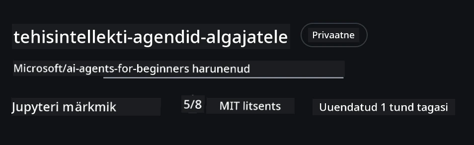

# Kursuse seadistamine

## Sissejuhatus

Selles õppetükis käsitletakse, kuidas käivitada selle kursuse koodinäiteid.

## Liitu teiste õppijatega ja saa abi

Enne oma repo kloonimisega alustamist liitu [AI Agents For Beginners Discordi kanaliga](https://aka.ms/ai-agents/discord), et saada abi seadistamisel, esitada küsimusi kursuse kohta või suhelda teiste õppijatega.

## Klooni või tee sellest repost forkit

Alustamiseks palun klooni või tee selle GitHubi repositooriumi forkit. See teeb sinu enda versiooni kursuse materjalidest, et saaksid koodi käivitada, testida ja kohandada!

Seda saab teha, klõpsates lingil <a href="https://github.com/microsoft/ai-agents-for-beginners/fork" target="_blank">repo forkimiseks</a>.

Sul peaks nüüd olema enda forkitud versioon selle kursuse materjalidest järgmises lingis:



### Pealiskaudne kloon (soovitatav töötubade / Codespaces jaoks)

  > Täielik repositoorium võib olla suur (~3 GB), kui alla laadid kogu ajaloo ja kõik failid. Kui osaled ainult töötubades või vajad ainult mõnda õppetüki kausta, väldib pealiskaudne kloonimine (või osaline kloonimine) enamiku alla laadimist, kärpides ajalugu ja/või jättes blobid vahele.

#### Kiire pealiskaudne kloon — minimaalne ajalugu, kõik failid

Asenda alltoodud käskudes `<your-username>` oma forki URL-i (või upstream URL, kui eelistad).

Et kloonida vaid viimaseid commit’e (väike allalaadimine):

```bash|powershell
git clone --depth 1 https://github.com/<your-username>/ai-agents-for-beginners.git
```

Et kloonida kindlat haru:

```bash|powershell
git clone --depth 1 --branch <branch-name> https://github.com/<your-username>/ai-agents-for-beginners.git
```


#### Osaline (nõrk) kloon — minimaalsed blobid + vaid valitud kaustad

See kasutab osalist kloonimist ja sparse-checkout funktsiooni (nõuab Giti 2.25+ ja soovitatavalt tänapäevast Git’i osalise kloonimise toega):

```bash|powershell
git clone --depth 1 --filter=blob:none --sparse https://github.com/<your-username>/ai-agents-for-beginners.git
```

Mine repo kaustasisesele tasemele:

```bash|powershell
cd ai-agents-for-beginners
```

Seejärel määra, milliseid kaustu soovid (näide allpool näitab kahte kausta):

```bash|powershell
git sparse-checkout set 00-course-setup 01-intro-to-ai-agents
```

Pärast kloonimist ja failide kontrollimist, kui vajad ainult faile ja soovid kettaruumi vabastada (ilma git-ajaloata), palun kustuta repositooriumi metaandmed (💀 pöördumatu — kaotad kogu Git funktsionaalsuse: pole commite, pull’e, push’e ega ajaloo juurdepääsu).

```bash
# zsh/bash
rm -rf .git
```

```powershell
# PowerShell
Remove-Item -Recurse -Force .git
```


#### GitHub Codespaces’i kasutamine (soovitatav, et vältida suuri lokaalseid allalaadimisi)

- Loo selle repo jaoks uus Codespace [GitHub UI kaudu](https://github.com/codespaces).

- Uue Codespace terminalis käivita mõni ülaltoodud pealiskaudse või osalise kloonimise käsk, et laadida Codespace tööruumi vaid vajalikud õppetüki kaustad.

- Valikuline: pärast kloonimist Codespaces eemaldage .git kataloog, et saada lisaruumi tagasi (vt eespool kustutuskäske).

- Märkus: Kui eelistad avada repo otse Codespaces ilma lisa kloonita, ole teadlik, et Codespaces ehitab devcontainer keskkonna ja võib siiski paigaldada rohkem, kui vajad. Pealiskaudse klooni tegemine uues Codespace’is annab sulle parema kontrolli kettakasutuse üle.

#### Näpunäited

- Asenda klooni URL alati oma forgi omaga, kui soovid muuta või teha commit’e.
- Kui hiljem vajad rohkem ajalugu või faile, saad need tuua fetch’i või kohandada sparse-checkout’i lisakaustade jaoks.

## Koodi käivitamine

See kursus pakub seeriat Jupyter märkmikke, mida saad jooksutada, et saada praktilist kogemust AI agentide loomisel.

Koodinäited kasutavad **Microsoft Agent Frameworki (MAF)** koos `AzureAIProjectAgentProvider`-ga, mis ühendub **Azure AI Agent Service V2** (vastuste API) kaudu **Microsoft Foundry**ga.

Kõik Python märkmikud on sildistatud `*-python-agent-framework.ipynb`.

## Nõuded

- Python 3.12+
  - **MÄRKUS**: Kui sul pole Pahtoni versiooni 3.12 paigaldatud, paigalda see kindlasti. Seejärel loo venv Python3.12-ga, et tagada õige versioonide paigaldus requirements.txt failist.

    >Näide

    Loo Python venv kaust:

    ```bash|powershell
    python -m venv venv
    ```

    Seejärel aktiveeri venv keskkond jaoks:

    ```bash
    # zsh/bash
    source venv/bin/activate
    ```
  
    ```dos
    # Command Prompt for Windows
    venv\Scripts\activate
    ```


- .NET 10+: .NET näidiskoodi jaoks paigalda [.NET 10 SDK](https://dotnet.microsoft.com/download/dotnet/10.0) või uuem. Kontrolli paigaldatud .NET SDK versiooni:

    ```bash|powershell
    dotnet --list-sdks
    ```


- **Azure CLI** — Autentimiseks vajalik. Paigalda lehelt [aka.ms/installazurecli](https://aka.ms/installazurecli).
- **Azure tellimus** — Microsoft Foundry ja Azure AI Agent Service juurdepääsuks.
- **Microsoft Foundry projekt** — Projekt koos kasutusele võetud mudeliga (nt `gpt-4o`). Vaata [Samm 1](../../../00-course-setup) allpool.

Selle reposti juurkataloogis on kaasas `requirements.txt` fail, mis sisaldab kõiki vajalikke Python-pakette koodinäidete käivitamiseks.

Paigaldamiseks käivita oma terminalis reposti juurkataloogis:

```bash|powershell
pip install -r requirements.txt
```


Soovitame kasutada Python virtuaalkeskkonda, et vältida konflikte ja probleeme.

## VSCode seadistamine

Veendu, et kasutad VSCode’s õiget Pythoni versiooni.


## Microsoft Foundry ja Azure AI Agent Service seadistamine

### Samm 1: Loo Microsoft Foundry projekt

Sinu märkmike käivitamiseks vajad Azure AI Foundry **hubi** ja **projekti** kasutusele võetud mudeliga.

1. Mine aadressile [ai.azure.com](https://ai.azure.com) ja logi sisse oma Azure kontoga.
2. Loo **hub** (või kasuta olemasolevat). Vaata: [Hubi ressursside ülevaade](https://learn.microsoft.com/azure/ai-foundry/concepts/ai-resources).
3. Hubis loo **projekt**.
4. Pane mudel (nt `gpt-4o`) tööle **Models + Endpoints** → **Deploy model**.

### Samm 2: Leia projekti lõpp-punkt ja mudeli kasutuse nimi

Microsoft Foundry portaali projektist:

- **Projekti lõpp-punkt** — Mine **Ülevaade** lehele ja kopeeri lõpp-punkti URL.


- **Mudeli kasutuse nimi** — Mine **Models + Endpoints**, vali kasutusele võetud mudel ja vaata **Deployment name** (nt `gpt-4o`).

### Samm 3: Logi Azure’i sisse käsuga `az login`

Kõik märkmikud autentivad end kasutades **`AzureCliCredential`** — API võtmeid pole vaja hallata. Selleks pead olema sisse logitud Azure CLI kaudu.

1. **Paigalda Azure CLI**, kui pole veel paigaldatud: [aka.ms/installazurecli](https://aka.ms/installazurecli)

2. **Logi sisse** käivitades:

    ```bash|powershell
    az login
    ```

    Või kui oled remote- või Codespace keskkonnas ilma brauserita:

    ```bash|powershell
    az login --use-device-code
    ```

3. **Vali tellimus**, kui küsitakse — vali see, kus on asuv Foundry projekt.

4. **Kontrolli** sisseminekut:

    ```bash|powershell
    az account show
    ```

> **Miks `az login`?** Märkmikud kasutavad autentimiseks `AzureCliCredential`-i `azure-identity` paketist, mis tähendab, et sinu Azure CLI sessioon tagab volitused — pole vaja API võtmeid või saladusi `.env` failis. See on [parim turvatavahe](https://learn.microsoft.com/azure/developer/ai/keyless-connections).

### Samm 4: Loo oma `.env` fail

Kopeeri näidissfail:

```bash
# zsh/bash
cp .env.example .env
```

```powershell
# PowerShell
Copy-Item .env.example .env
```

Ava `.env` ja täida need kaks väärtust:

```env
AZURE_AI_PROJECT_ENDPOINT=https://<your-project>.services.ai.azure.com/api/projects/<your-project-id>
AZURE_AI_MODEL_DEPLOYMENT_NAME=gpt-4o
```

| Muutuja | Kust leida |
|----------|-----------------|
| `AZURE_AI_PROJECT_ENDPOINT` | Foundry portaali → sinu projekt → **Ülevaade** leht |
| `AZURE_AI_MODEL_DEPLOYMENT_NAME` | Foundry portaali → **Models + Endpoints** → sinu kasutusele võetud mudeli nimi |

Sellega on enamik õppetükke valmis! Märkmikud autentivad end automaatselt sinu `az login` sessiooni kaudu.

### Samm 5: Paigalda Python sõltuvused

```bash|powershell
pip install -r requirements.txt
```

Soovitame seda käivitada varem loodud virtuaalkeskkonnas.

## Täiendav seadistus Õppetüki 5 jaoks (Agentic RAG)

Õppetükk 5 kasutab **Azure AI Search**-i, et teha otsingupõhist genereerimist (retrieval-augmented generation). Kui plaanid seda õppetükki jooksutada, lisa need muutujad oma `.env` faili:

| Muutuja | Kust leida |
|----------|-----------------|
| `AZURE_SEARCH_SERVICE_ENDPOINT` | Azure portaali → sinu **Azure AI Search** ressurss → **Ülevaade** → URL |
| `AZURE_SEARCH_API_KEY` | Azure portaali → sinu **Azure AI Search** ressurss → **Seaded** → **Võtmed** → peamine admin võtme |

## Täiendav seadistus Õppetükkide 6 ja 8 jaoks (GitHub mudelid)

Mõned märkmikud õppetükkides 6 ja 8 kasutavad **GitHub Models** asemel Azure AI Foundryt. Kui plaanid neid proove käivitada, lisa need muutujad oma `.env` faili:

| Muutuja | Kust leida |
|----------|-----------------|
| `GITHUB_TOKEN` | GitHub → **Seaded** → **Arendaja seaded** → **Isikliku juurdepääsu tokenid** |
| `GITHUB_ENDPOINT` | Kasuta `https://models.inference.ai.azure.com` (vaikimisi väärtus) |
| `GITHUB_MODEL_ID` | Kasutatava mudeli nimi (näiteks `gpt-4o-mini`) |

## Täiendav seadistus Õppetüki 8 jaoks (Bing põhine töövoog)

Õppetüki 8 tingimusliku töövoo märkmik kasutab **Bing grounding’ut** Azure AI Foundry kaudu. Kui plaanid seda proovida, lisa see muutuja oma `.env` faili:

| Muutuja | Kust leida |
|----------|-----------------|
| `BING_CONNECTION_ID` | Azure AI Foundry portaal → sinu projekt → **Haldus** → **Ühendatud ressursid** → sinu Bing ühendus → kopeeri ühenduse ID |

## Veaotsing

### SSL sertifikaadi kontrolli vead macOS-il

Kui kasutad macOS-i ja saad vea nagu:

```plaintext
ssl.SSLCertVerificationError: [SSL: CERTIFICATE_VERIFY_FAILED] certificate verify failed: self-signed certificate in certificate chain
```

See on tuntud probleem Pythonil macOS-il, kus süsteemi SSL sertifikaate ei usaldata automaatselt. Proovi järgmisi lahendusi järjekorras:

**Variant 1: Käivita Python’i Install Certificates skript (soovitatav)**

```bash
# Asenda 3.XX oma paigaldatud Python versiooniga (nt 3.12 või 3.13):
/Applications/Python\ 3.XX/Install\ Certificates.command
```

**Variant 2: Kasuta `connection_verify=False` oma märkmikus (ainult GitHub mudelite märkmikud)**

Õppetüki 6 märkmikus (`06-building-trustworthy-agents/code_samples/06-system-message-framework.ipynb`) on juba kommentaariga tööringi näidis olemas. Kommenteeri välja `connection_verify=False`, kui kliendi lood:

```python
client = ChatCompletionsClient(
    endpoint=endpoint,
    credential=AzureKeyCredential(token),
    connection_verify=False,  # SSL-i kontrolli keelamine, kui tekivad sertifikaadivead
)
```

> **⚠️ Hoiatus:** SSL kontrolli keelamine (`connection_verify=False`) vähendab turvalisust, jättes sertifikaadi valideerimise vahele. Kasuta seda vaid arenduslikul testimisel ajutise lahendusena, mitte tootmiskeskkonnas.

**Variant 3: Paigalda ja kasuta `truststore`-i**

```bash
pip install truststore
```

Lisa seejärel oma märkmiku või skripti algusesse enne võrgu päringuid:

```python
import truststore
truststore.inject_into_ssl()
```

## Jääd kuskile kinni?

Kui sul tekib selle seadistuse käivitamisel probleeme, tule meie <a href="https://discord.gg/kzRShWzttr" target="_blank">Azure AI Community Discordi</a> või <a href="https://github.com/microsoft/ai-agents-for-beginners/issues?WT.mc_id=academic-105485-koreyst" target="_blank">loo probleemiraport</a>.

## Järgmine õppetükk

Nüüd oled valmis selle kursuse koodi jooksma. Soovime palju edu AI agentide maailma avastamisel!

[Intro AI agentidest ja agentide kasutusjuhtumitest](../01-intro-to-ai-agents/README.md)

---

<!-- CO-OP TRANSLATOR DISCLAIMER START -->
**Vastutusest loobumine**:
See dokument on tõlgitud AI-tõlketeenuse [Co-op Translator](https://github.com/Azure/co-op-translator) abil. Kuigi püüame tagada täpsust, tuleb arvestada, et automatiseeritud tõlgetes võib esineda vigu või ebatäpsusi. Originaaldokument oma algkeeles tuleks pidada autoriteetseks allikaks. Olulise teabe puhul soovitatakse kasutada professionaalset inimtõlget. Me ei vastuta selle tõlkega seotud arusaamatuste ega valesti mõistmiste eest.
<!-- CO-OP TRANSLATOR DISCLAIMER END -->