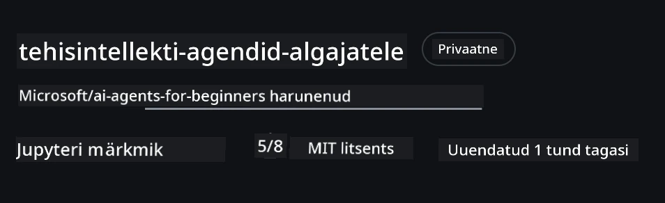
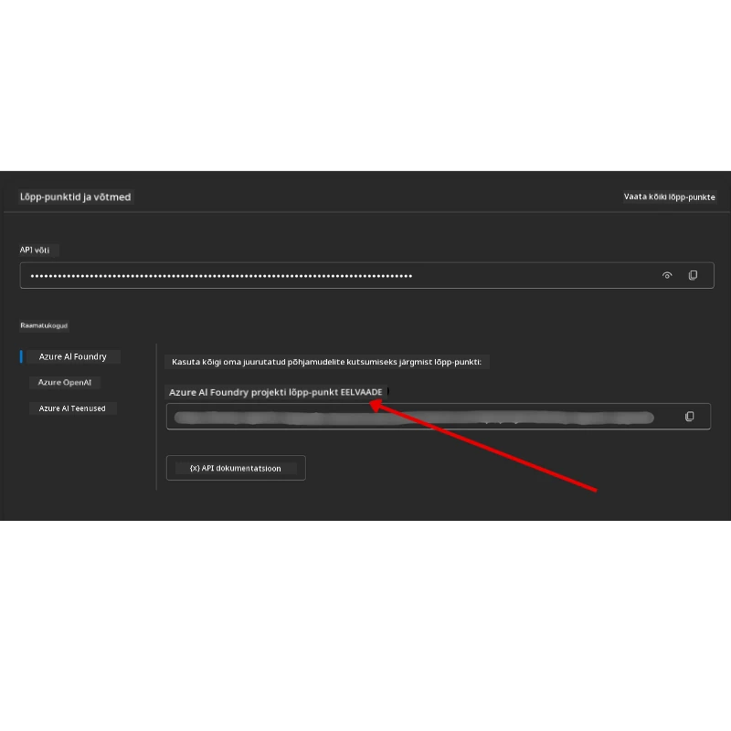

# Kursuse seadistamine

## Sissejuhatus

Selles õppetükis käsitletakse, kuidas käivitada selle kursuse koodi näited.

## Liitu teiste õppijatega ja saa abi

Enne kui hakkad oma repo kloonima, liitu [AI Agents For Beginners Discordi kanaliga](https://aka.ms/ai-agents/discord), et saada abi seadistamisel, kursuse kohta tekkinud küsimustele või ühendada teiste õppijatega.

## Klooni või loo sellest repost fork

Alustamiseks palun klooni või loo GitHubi repost sellele fork. See loob sulle kursuse materjalidest oma versiooni, et saaksid koodi käivitada, testida ja kohandada!

Seda saab teha, klikkides lingile <a href="https://github.com/microsoft/ai-agents-for-beginners/fork" target="_blank">repo forkimiseks</a>

Sul peaks nüüd olema selle kursuse oma forkitud versioon järgneval lingil:



### Madala sügavusega kloonimine (soovitatav töötoa / Codespacesi jaoks)

  > Täielik hoidla võib olla suur (~3 GB), kui alla laadida kogu ajalugu ja kõik failid. Kui osaled ainult töötoas või vajad vaid mõnda õppetükikataloogi, siis madala sügavusega kloonimine (või harv kloon) väldib suure osa allalaadimisest, kärpides ajaloo ja/või vahele jättes andmeplokid.

#### Kiire madala sügavusega kloonimine — minimaalne ajalugu, kõik failid

Asenda alltoodud käskudes `<your-username>` oma forki URL-iga (või upstream URL, kui soovid).

Kloonimiseks ainult uusimate commitide ajaloo allalaadimiseks (väike allalaadimine):

```bash|powershell
git clone --depth 1 https://github.com/<your-username>/ai-agents-for-beginners.git
```

Kindla haru kloonimiseks:

```bash|powershell
git clone --depth 1 --branch <branch-name> https://github.com/<your-username>/ai-agents-for-beginners.git
```

#### Osaline (harv) kloonimine — minimaalne hulga plokke + ainult valitud kaustad

See kasutab osalist kloonimist ja sparse-checkouti (nõuab Git 2.25+ ja soovitatav on kaasaegne Git osalise klonimise toetusega):

```bash|powershell
git clone --depth 1 --filter=blob:none --sparse https://github.com/<your-username>/ai-agents-for-beginners.git
```

Liigu repo kausta:

```bash|powershell
cd ai-agents-for-beginners
```

Seejärel määra, milliseid kaustu tahad (alltoodud näites kaks kausta):

```bash|powershell
git sparse-checkout set 00-course-setup 01-intro-to-ai-agents
```

Pärast kloonimist ja failide kontrollimist, kui vajad ainult faile ja soovid ruumi vabastada (ilma git ajaloota), kustuta repode metadata (💀 pöördumatu — kaotad kõik Git funktsioonid: pole commite, pull’e, push’e ega ajaloo ligipääsu).

```bash
# zsh/bash
rm -rf .git
```

```powershell
# PowerShell
Remove-Item -Recurse -Force .git
```

#### GitHub Codespacesi kasutamine (soovitatav kohalike suurte allalaadimiste vältimiseks)

- Loo selle repoga uus Codespace GitHubi UI kaudu [GitHub UI](https://github.com/codespaces).  

- Uue loodud codespace’i terminalis käivita üks ülaltoodud madala sügavusega või harva kloonimise käskudest, et tuua Codespace’i töökeskkonda vaid vajalikud õppetükkide kaustad.
- Vabatahtlik: pärast kloonimist inside Codespaces, eemalda .git, et vabastada lisaruumi (vaata eelnevaid kustutuskäske).
- Märkus: Kui eelistad avada repo otse Codespacesis (ilma lisakloonimiseta), siis arvestada tuleb, et Codespaces loob devcontainer keskkonna ja võib siiski provisioning'uks alla laadida rohkem, kui vajad. Uue Codespace sees madala sügavusega kloonimine annab sulle rohkem kontrolli kettaruumi kasutuse üle.

#### Näpunäited

- Asenda alati klooni URL oma forki URL-iga, kui soovid muuta/kinnitama hakata.
- Kui hiljem vajad rohkem ajalugu või faile, võid need hankida või sparse-checkouti häälestada, et lisada täiendavaid kaustu.

## Koodi käivitamine

See kursus pakub ridamisi Jupyter Notebooks’e, mida saad käivitada, et saada praktiline kogemus AI-agendite loomisel.

Koodi näited kasutavad **Microsoft Agent Frameworki (MAF)** koos `FoundryChatClient`-iga, mis ühendub **Microsoft Foundry Agent Service V2** (Responses API) kaudu **Microsoft Foundry’ga**.

Kõik Pythoni notebookid on märgistatud kui `*-python-agent-framework.ipynb`.

## Nõuded

- Python 3.12+
  - **MÄRKUS**: Kui sul pole Python3.12 paigaldatud, veendu, et paigaldate selle. Seejärel loo oma venv, kasutades python3.12, et tagada sobivate versioonide paigaldus requirements.txt failist.
  
    >Näide

    Loo Python venv kataloog:

    ```bash|powershell
    python -m venv venv
    ```

    Seejärel aktiveeri venv keskkond:

    ```bash
    # zsh/bash
    source venv/bin/activate
    ```
  
    ```dos
    # Command Prompt for Windows
    venv\Scripts\activate
    ```

- .NET 10+: Näidiskoodide jaoks, mis kasutavad .NET-i, veendu, et oled paigaldanud [.NET 10 SDK](https://dotnet.microsoft.com/download/dotnet/10.0) või uuema. Kontrolli oma paigaldatud .NET SDK versiooni:

    ```bash|powershell
    dotnet --list-sdks
    ```

- **Azure CLI** — vajalik autentimiseks. Paigalda aadressilt [aka.ms/installazurecli](https://aka.ms/installazurecli).
- **Azure tellimus** — ligipääsuks Microsoft Foundry ja Microsoft Foundry Agent Service’ile.
- **Microsoft Foundry projekt** — projekt, millel on juurutatud mudel (nt `gpt-4o`). Vaata allpool [1. sammu](#1-samm-loo-microsoft-foundry-projekt).

Selle hoidla juurkataloogis on `requirements.txt` fail, mis sisaldab kõiki vajalikke Python pakette koodi näidete käitamiseks.

Sa saad need paigaldada, käivitades oma terminalis hoidla juurkataloogis järgmise käsu:

```bash|powershell
pip install -r requirements.txt
```

Soovitame luua Python virtuaalkeskkonna, et vältida konflikte ja probleeme.

## VSCode seadistamine

Veendu, et kasutad VSCode’is õiget Python versiooni.


## Microsoft Foundry ja Microsoft Foundry Agent Service seadistamine

### 1. samm: Loo Microsoft Foundry projekt

Sul peab olema Microsoft Foundry **hub** ja **projekt** juurutatud mudeliga, et notebook’e käivitada.

1. Mine aadressile [ai.azure.com](https://ai.azure.com) ja logi sisse oma Azure kontoga.
2. Loo **hub** (või kasuta olemasolevat). Vaata: [Hub resources overview](https://learn.microsoft.com/azure/ai-foundry/concepts/ai-resources).
3. Hub’is loo **projekt**.
4. Juuruta mudel (nt `gpt-4o`) sektsioonist **Models + Endpoints** → **Deploy model**.

### 2. samm: Hangi oma projekti endpoint ja mudeli juurutuse nimi

Microsoft Foundry portaali projekti alt:

- **Project Endpoint** — Mine lehele **Overview** ja kopeeri sihtpunkti URL.



- **Model Deployment Name** — Mine sektsiooni **Models + Endpoints**, vali oma juurutatud mudel ja märgi üles **Deployment name** (nt `gpt-4o`).

### 3. samm: Logi Azure’i sisse käsuga `az login`

Kõik notebook’id kasutavad autentimiseks **`AzureCliCredential`** — pole vaja API võtmeid hallata. See eeldab, et oled Azure CLI kaudu sisse logitud.

1. **Paigalda Azure CLI**, kui pole veel tehtud: [aka.ms/installazurecli](https://aka.ms/installazurecli)

2. **Logi sisse** käivitades:

    ```bash|powershell
    az login
    ```

    Kui oled kaugel või Codespace keskkonnas ilma veebibrauserita:

    ```bash|powershell
    az login --use-device-code
    ```

3. **Vali tellimus**, kui küsitakse — vali see, mille sees on su Foundry projekt.

4. **Kontrolli**, et oled sisse logitud:

    ```bash|powershell
    az account show
    ```

> **Miks kasutada `az login`?** Notebook’id autentivad kasutades `AzureCliCredential` `azure-identity` paketist. See tähendab, et sinu Azure CLI sessioon annab volitused — pole vaja API võtmeid ega saladusi `.env` failis. See on hea turvalisuse tava ([security best practice](https://learn.microsoft.com/azure/developer/ai/keyless-connections)).

### 4. samm: Loo oma `.env` fail

Kopeeri näidissisu:

```bash
# zsh/bash
cp .env.example .env
```

```powershell
# PowerShell
Copy-Item .env.example .env
```

Ava `.env` ja täida need kaks väärtust:

```env
AZURE_AI_PROJECT_ENDPOINT=https://<your-project>.services.ai.azure.com/api/projects/<your-project-id>
AZURE_AI_MODEL_DEPLOYMENT_NAME=gpt-4o
```

| Muutuja | Kus seda leida |
|----------|-----------------|
| `AZURE_AI_PROJECT_ENDPOINT` | Foundry portaal → sinu projekt → **Overview** leht |
| `AZURE_AI_MODEL_DEPLOYMENT_NAME` | Foundry portaal → **Models + Endpoints** → sinu juurutatud mudeli nimi |

Enamik õppetükkide jaoks ongi kõik! Notebook’id autentivad automaatselt sinu `az login` sessiooni kaudu.

### 5. samm: Paigalda Python sõltuvused

```bash|powershell
pip install -r requirements.txt
```

Soovitame seda käivitada loodud virtuaalkeskkonnas.

## Täiendav seadistus õppetükile 5 (Agentic RAG)

Õppetükk 5 kasutab **Azure AI Search** otsingutoega genereerimiseks. Kui kavatsed seda õppetükki käivitada, lisa need muutujad oma `.env` faili:

| Muutuja | Kus seda leida |
|----------|-----------------|
| `AZURE_SEARCH_SERVICE_ENDPOINT` | Azure portaal → sinu **Azure AI Search** ressurss → **Overview** → URL |
| `AZURE_SEARCH_API_KEY` | Azure portaal → sinu **Azure AI Search** ressurss → **Settings** → **Keys** → peamine administraatori võti |

## Täiendav seadistus õppetükkidele, mis kutsuvad otse Azure OpenAI-d (õppetükid 6 ja 8)

Mõned notebook’id õppetükkides 6 ja 8 kutsuvad otse **Azure OpenAI**-d (kasutades **Responses API**-d), mitte Microsoft Foundry projekti kaudu. Need näited kasutasid varem GitHubi mudeleid, mis on aegunud (väljasurev juulis 2026) ja ei toeta Responses API-d. Kui kavatsed neid näiteid käivitada, lisa need muutujad oma `.env` faili:

| Muutuja | Kus seda leida |
|----------|-----------------|
| `AZURE_OPENAI_ENDPOINT` | Azure portaal → sinu **Azure OpenAI** ressurss → **Keys and Endpoint** → Endpoint (nt `https://<your-resource>.openai.azure.com`) |
| `AZURE_OPENAI_DEPLOYMENT` | Sinu juurutatud mudeli nimi (nt `gpt-4o-mini`), mis toetab Responses API-d |
| `AZURE_OPENAI_API_KEY` | Valikuline — ainult juhul, kui kasutad võtmepõhist autentimist mitte `az login` / Entra ID'd |

> Responses API kasutab stabiilset `/openai/v1/` lõpp-punkti, seega pole vaja `api-version` parameetrit. Logi sisse `az login` abil, et kasutada võtmevaba Entra ID autentimist.

## Alternatiivne pakkuja: MiniMax (OpenAI-ga ühilduv)

[MiniMax](https://platform.minimaxi.com/) pakub suurte kontekstidega mudeleid (kuni 204K tokenit) OpenAI-ga ühilduva API kaudu. Kuna Microsoft Agent Frameworki `OpenAIChatClient` töötab igas OpenAI-ga ühilduvas lõpp-punktis, võid kasutada MiniMaxi otsekohe Azure OpenAI või OpenAI asemel.

Lisa need muutujad oma `.env` faili:

| Muutuja | Kus seda leida |
|----------|-----------------|
| `MINIMAX_API_KEY` | [MiniMax platvorm](https://platform.minimaxi.com/) → API võtmed |
| `MINIMAX_BASE_URL` | Kasuta `https://api.minimax.io/v1` (vaikimisi) |
| `MINIMAX_MODEL_ID` | Kasutatava mudeli nimi (nt `MiniMax-M3`) |

**Näidismudelid**: `MiniMax-M3` (soovitatav), `MiniMax-M2.7`, `MiniMax-M2.7-highspeed` (kiired vastused). Mudelinimed ja kättesaadavus võivad aja jooksul muutuda ning mudelile ligipääs sõltub sinu kontost või piirkonnast — vaata [MiniMax platvormi](https://platform.minimaxi.com/) jooksvat nimekirja. Kui mudel `MiniMax-M3` pole sinu kontole saadaval, määra `MINIMAX_MODEL_ID` mõnele teisele mudelile, millele sul ligipääs on (nt `MiniMax-M2.7`).

Näidiskoodid, mis kasutavad `OpenAIChatClient`-i (nt õppetükk 14 hotelli broneerimise töövoog), tuvastavad ja kasutavad automaatselt sinu MiniMaxi seadistust, kui `MINIMAX_API_KEY` on määratud.

## Alternatiivne pakkuja: Foundry Local (mudelite käitamine seadmes)

[Foundry Local](https://foundrylocal.ai) on kergekaaluline runtime, mis laadib alla, haldab ja teenindab keelemudeleid **täielikult sinu enda arvutis** OpenAI-ga ühilduva API kaudu — pole pilve, pole Azure tellimust, pole API võtmeid. See on suurepärane valik võrguühenduseta arenguks, katsetamiseks ilma pilvekuludeta või andmete säilitamiseks kohal.

Kuna Microsoft Agent Frameworki `OpenAIChatClient` töötab igas OpenAI-ga ühilduvas lõpp-punktis, on Foundry Local mugav kohalik alternatiiv Azure OpenAI-le.

**1. Paigalda Foundry Local**

```bash
# Windows
winget install Microsoft.FoundryLocal

# macOS
brew install foundrylocal
```

**2. Laadi alla ja käivita mudel** (see käivitab ka kohaliku teenuse):

```bash
foundry model list          # nähtavad mudelid
foundry model run phi-4-mini
```

**3. Paigalda kasutatav Python SDK, et leida kohalik lõpp-punkt:**

```bash
pip install foundry-local-sdk
```

**4. Suuna Microsoft Agent Framework oma kohalikule mudelile:**

```python
from foundry_local import FoundryLocalManager
from agent_framework.openai import OpenAIChatClient

# Laadib (vajadusel) alla ja teenindab mudelit kohapeal, seejärel leiab lõpp-punkti/pordi.
manager = FoundryLocalManager("phi-4-mini")

chat_client = OpenAIChatClient(
    base_url=manager.endpoint,      # nt http://localhost:<port>/v1
    api_key=manager.api_key,        # alati "pole vajalik" Foundry Locali puhul
    model_id=manager.get_model_info("phi-4-mini").id,
)

agent = chat_client.as_agent(
    name="LocalAgent",
    instructions="You are a helpful assistant running fully on-device.",
)
```

> **Märkus:** Foundry Local pakub OpenAI-ga ühilduvat **Chat Completions** lõpp-punkti. Kasuta seda lokaalseks arenduseks ja võrguühenduseta stsenaariumiteks. Täieliku **Responses API** funktsionaalsuse (staatilised vestlused, sügav tööriistade orkestreerimine ja agentide stiilis arendus) jaoks kasuta **Azure OpenAI** või **Microsoft Foundry** projekti, nagu näidetes. Vaata [Foundry Local dokumentatsiooni](https://foundrylocal.ai) mudelikataloogi ja platvormitoe kohta.

## Täiendav seadistus õppetükile 8 (Bing Grounding töövoog)


Tingimuslik töölaua märkmik õppetükis 8 kasutab **Bing-põhjust** Microsoft Foundry kaudu. Kui plaanite seda näidet käivitada, lisage see muutuja oma `.env` faili:

| Muutuja | Kus seda leida |
|----------|-----------------|
| `BING_CONNECTION_ID` | Microsoft Foundry portaal → teie projekt → **Management** → **Connected resources** → teie Bing-i ühendus → kopeerige ühenduse ID |

## Tõrkeotsing

### SSL-sertifikaadi kontrolli vead macOS-is

Kui kasutate macOS-i ja ilmneb viga nagu:

```plaintext
ssl.SSLCertVerificationError: [SSL: CERTIFICATE_VERIFY_FAILED] certificate verify failed: self-signed certificate in certificate chain
```

See on tuntud probleem Pythoniga macOS-is, kus süsteemi SSL-sertifikaate ei usaldata automaatselt. Proovige järgnevaid lahendusi antud järjekorras:

**Variant 1: Käivitage Pythoni Install Certificates skript (soovitatav)**

```bash
# Asenda 3.XX oma paigaldatud Pythoni versiooniga (nt 3.12 või 3.13):
/Applications/Python\ 3.XX/Install\ Certificates.command
```

**Variant 2: Kasutage oma märkmikus `connection_verify=False` (ainult GitHub Models märkmike jaoks)**

Õppetüki 6 märkmikus (`06-building-trustworthy-agents/code_samples/06-system-message-framework.ipynb`) on juba lisatud kommenteeritud lahendus. Avage kommentaar `connection_verify=False` kliendi loomisel:

```python
client = ChatCompletionsClient(
    endpoint=endpoint,
    credential=AzureKeyCredential(token),
    connection_verify=False,  # Keela SSL-i kontroll, kui ilmneb sertifikaatide tõrkeid
)
```

> **⚠️ Hoiduge:** SSL-kontrolli keelamine (`connection_verify=False`) vähendab turvalisust, jättes sertifikaadi valideerimise vahele. Kasutage seda ainult ajutise lahendusena arenduskeskkonnas, mitte kunagi tootmises.

**Variant 3: Installige ja kasutage `truststore`-i**

```bash
pip install truststore
```

Seejärel lisage oma märkmiku või skripti algusesse enne võrguühenduse loomist:

```python
import truststore
truststore.inject_into_ssl()
```

## Jäädud kuhugi kinni?

Kui teil tekib selle seadistuse käivitamisel probleeme, liituge meie <a href="https://discord.gg/kzRShWzttr" target="_blank">Azure AI Community Discord</a> või <a href="https://github.com/microsoft/ai-agents-for-beginners/issues?WT.mc_id=academic-105485-koreyst" target="_blank">looge probleem</a>.

## Järgmine õppetükk

Olete nüüd valmis selle kursuse koodi käivitama. Edu õppimisel ja AI agentide maailma tundmaõppimisel! 

[Sissejuhatus AI agentidesse ja nende kasutusjuhtumid](../01-intro-to-ai-agents/README.md)

---

<!-- CO-OP TRANSLATOR DISCLAIMER START -->
**Lahtiütlus**:
See dokument on tõlgitud kasutades AI tõlketeenust [Co-op Translator](https://github.com/Azure/co-op-translator). Kuigi me püüdleme täpsuse poole, palun pange tähele, et automatiseeritud tõlgetes võib esineda vigu või ebatäpsusi. Originaaldokument selle emakeeles tuleks pidada autoriteetseks allikaks. Olulise teabe puhul soovitatakse kasutada professionaalset inimtõlget. Me ei vastuta selle tõlkega seotud eksimustest või valesti mõistmistest.
<!-- CO-OP TRANSLATOR DISCLAIMER END -->