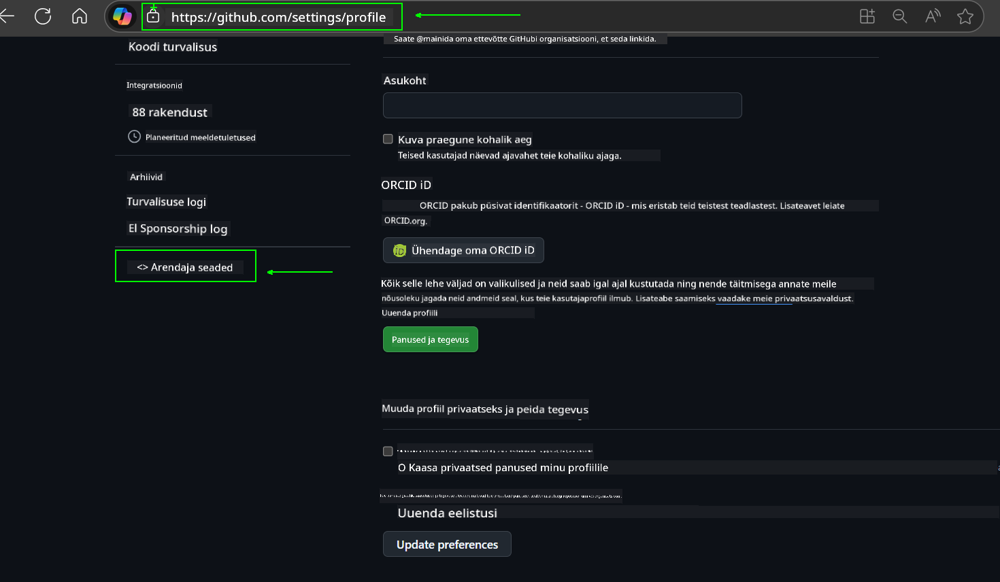
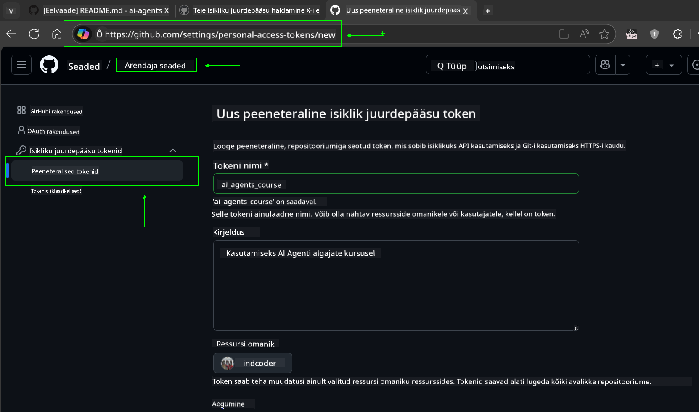
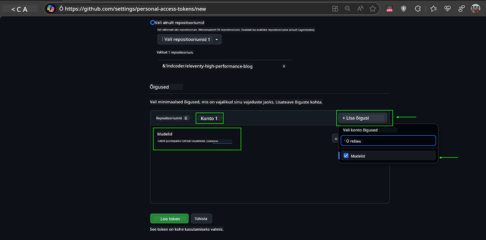
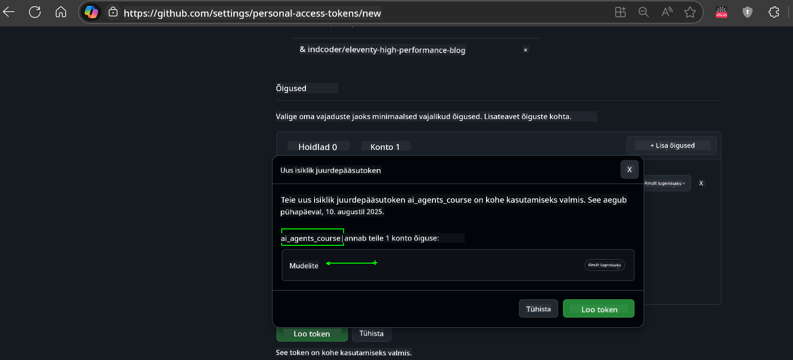

<!--
CO_OP_TRANSLATOR_METADATA:
{
  "original_hash": "96eb7f95375daa3e91778ca0295a55d9",
  "translation_date": "2025-10-15T11:59:50+00:00",
  "source_file": "00-course-setup/README.md",
  "language_code": "et"
}
-->
# Kursuse seadistamine

## Sissejuhatus

Selles õppetükis käsitletakse, kuidas käivitada selle kursuse koodinäiteid.

## Liitu teiste õppijatega ja saa abi

Enne kui hakkad oma repositooriumi kloonima, liitu [AI Agents For Beginners Discord kanaliga](https://aka.ms/ai-agents/discord), et saada abi seadistamisega, esitada küsimusi kursuse kohta või luua ühendust teiste õppijatega.

## Klooni või hargi see repositoorium

Alustamiseks klooni või hargi GitHubi repositoorium. See loob sinu enda versiooni kursuse materjalidest, et saaksid koodi käivitada, testida ja kohandada!

Seda saab teha, klõpsates lingil <a href="https://github.com/microsoft/ai-agents-for-beginners/fork" target="_blank">hargi repositoorium</a>.

Nüüd peaks sul olema selle kursuse enda hargitud versioon järgmisel lingil:


### Madal kloonimine (soovitatav töötubade / Codespaces jaoks)

  >Täielik repositoorium võib olla suur (~3 GB), kui alla laadida kogu ajalugu ja kõik failid. Kui osaled ainult töötoas või vajad ainult mõnda õppetüki kausta, siis madal kloonimine (või osaline kloonimine) väldib suurema osa allalaadimisest, kärpides ajalugu ja/või vahele jättes suured failid.

#### Kiire madal kloonimine — minimaalne ajalugu, kõik failid

Asenda `<your-username>` allolevates käskudes oma hargi URL-iga (või algse URL-iga, kui eelistad).

Kloonimiseks ainult viimase commit'i ajalooga (väike allalaadimine):

```bash|powershell
git clone --depth 1 https://github.com/<your-username>/ai-agents-for-beginners.git
```

Kloonimiseks kindla haruga:

```bash|powershell
git clone --depth 1 --branch <branch-name> https://github.com/<your-username>/ai-agents-for-beginners.git
```

#### Osaline (hõre) kloonimine — minimaalsed failid + ainult valitud kaustad

See kasutab osalist kloonimist ja hõredat kontrollimist (vajab Git 2.25+ ja soovitatavalt kaasaegset Git'i osalise kloonimise toetusega):

```bash|powershell
git clone --depth 1 --filter=blob:none --sparse https://github.com/<your-username>/ai-agents-for-beginners.git
```

Liigu repositooriumi kausta:

Bash'i jaoks:

```bash
cd ai-agents-for-beginners
```

Powershell'i jaoks:

```powershell
Set-Location ai-agents-for-beginners
```

Seejärel määra, milliseid kaustu soovid (näiteks allpool on näidatud kaks kausta):

```bash|powershell
git sparse-checkout set 00-course-setup 01-intro-to-ai-agents
```

Pärast kloonimist ja failide kontrollimist, kui vajad ainult faile ja soovid ruumi vabastada (ilma git'i ajaloota), kustuta repositooriumi metaandmed (💀 pöördumatu — kaotad kogu Git'i funktsionaalsuse: ei saa teha commit'e, tõmmata, lükata ega ajalugu vaadata).

Linux/macOS jaoks:

```bash
rm -rf .git
```

Windowsi jaoks:

```powershell
Remove-Item -Recurse -Force .git
```

#### GitHub Codespaces'i kasutamine (soovitatav kohalike suurte allalaadimiste vältimiseks)

- Loo uus Codespace selle repositooriumi jaoks [GitHubi kasutajaliidese kaudu](https://github.com/codespaces).  

- Uues Codespaces'i terminalis käivita üks ülaltoodud madala/hõreda kloonimise käskudest, et tuua ainult vajalikud õppetükkide kaustad Codespaces'i tööruumi.
- Valikuline: pärast kloonimist Codespaces'is eemalda .git, et vabastada lisaruumi (vaata ülaltoodud eemaldamise käske).
- Märkus: Kui eelistad avada repositooriumi otse Codespaces'is (ilma täiendava kloonimiseta), siis tea, et Codespaces loob arenduskonteineri keskkonna ja võib siiski ette valmistada rohkem, kui vaja. Madala klooni tegemine värskes Codespaces'is annab sulle rohkem kontrolli kettaruumi kasutamise üle.

#### Näpunäited

- Asenda alati klooni URL oma hargiga, kui soovid redigeerida/commit'ida.
- Kui hiljem vajad rohkem ajalugu või faile, saad need fetch'ida või kohandada hõredat kontrollimist, et lisada täiendavaid kaustu.

## Koodi käivitamine

See kursus pakub mitmeid Jupyter Notebook'e, mida saad käivitada, et saada praktilisi kogemusi AI agentide loomisel.

Koodinäited kasutavad kas:

**Vajalik GitHubi konto - Tasuta**:

1) Semantic Kernel Agent Framework + GitHub Models Marketplace. Märgistatud kui (semantic-kernel.ipynb)
2) AutoGen Framework + GitHub Models Marketplace. Märgistatud kui (autogen.ipynb)

**Vajalik Azure'i tellimus**:
3) Azure AI Foundry + Azure AI Agent Service. Märgistatud kui (azureaiagent.ipynb)

Soovitame proovida kõiki kolme tüüpi näiteid, et näha, milline neist sulle kõige paremini sobib.

Sõltuvalt valitud variandist määratakse kindlaks, milliseid seadistusetappe allpool järgida:

## Nõuded

- Python 3.12+
  - **MÄRKUS**: Kui sul pole Python 3.12 installitud, veendu, et installid selle. Seejärel loo oma venv, kasutades python3.12, et tagada õige versioonide installimine requirements.txt failist.
  
    >Näide

    Loo Python venv kataloog:

    ``` bash
    python3 -m venv venv
    ```

    Seejärel aktiveeri venv keskkond:

    macOS ja Linux

    ```bash
    source venv/bin/activate
    ```
  
    Windows

    ```bash
    venv\Scripts\activate
    ```

- GitHubi konto - Juurdepääsuks GitHub Models Marketplace'ile
- Azure'i tellimus - Juurdepääsuks Azure AI Foundry'le
- Azure AI Foundry konto - Juurdepääsuks Azure AI Agent Service'ile

Oleme lisanud `requirements.txt` faili selle repositooriumi juurkausta, mis sisaldab kõiki vajalikke Python'i pakette koodinäidete käivitamiseks.

Sa saad need installida, käivitades järgmise käsu oma terminalis repositooriumi juurkaustas:

```bash
pip install -r requirements.txt
```
Soovitame luua Python'i virtuaalse keskkonna, et vältida konflikte ja probleeme.

## VSCode'i seadistamine
Veendu, et kasutad VSCode'is õiget Python'i versiooni.


## Seadistamine GitHub Models näidete jaoks 

### Samm 1: Hangi oma GitHubi isiklik juurdepääsutoken (PAT)

See kursus kasutab GitHub Models Marketplace'i, mis pakub tasuta juurdepääsu suurtele keelemudelitele (LLM), mida saad kasutada AI agentide loomiseks.

GitHubi mudelite kasutamiseks pead looma [GitHubi isikliku juurdepääsutokeni](https://docs.github.com/en/authentication/keeping-your-account-and-data-secure/managing-your-personal-access-tokens).

Seda saab teha, minnes oma <a href="https://github.com/settings/personal-access-tokens" target="_blank">isikliku juurdepääsutokeni seadete lehele</a> oma GitHubi kontol.

Palun järgi [vähima privileegi põhimõtet](https://docs.github.com/en/get-started/learning-to-code/storing-your-secrets-safely) tokeni loomisel. See tähendab, et peaksid andma tokenile ainult need õigused, mis on vajalikud selle kursuse koodinäidete käitamiseks.

1. Vali ekraani vasakult küljelt **Arendaja seaded** ja seejärel `Peenhäälestatud tokenid`.
   

    Seejärel vali `Loo uus token`.

    

2. Sisesta tokenile kirjeldav nimi, mis peegeldab selle eesmärki, et seda hiljem oleks lihtne tuvastada.


    🔐 Tokeni kehtivuse soovitus

    Soovitatav kehtivusaeg: 30 päeva
    Turvalisuse suurendamiseks võid valida lühema perioodi — näiteks 7 päeva 🛡️
    See on suurepärane viis seada isiklik eesmärk ja lõpetada kursus, hoides samal ajal õppimise hoogu üleval 🚀.

    

3. Piira tokeni ulatust oma hargitud repositooriumiga.

    

4. Piira tokeni õigusi: **Õiguste** all klõpsa **Konto** vahekaardil ja vajuta "+ Lisa õigused" nuppu. Ilmub rippmenüü. Otsi **Mudelid** ja märgi selle kastike.
    

5. Kontrolli enne tokeni loomist vajalikke õigusi. 

6. Enne tokeni loomist veendu, et oled valmis tokeni turvaliselt salvestama, näiteks paroolihalduri seifi, kuna seda ei kuvata uuesti pärast loomist. 

Kopeeri oma äsja loodud token. Nüüd lisa see kursuse `.env` faili.


### Samm 2: Loo oma `.env` fail

`.env` faili loomiseks käivita oma terminalis järgmine käsk.

```bash
cp .env.example .env
```

See kopeerib näidisfaili ja loob `.env` sinu kataloogi, kuhu saad täita keskkonnamuutujate väärtused.

Kopeeritud tokeniga ava `.env` fail oma lemmiktekstitöötlusprogrammis ja kleebi oma token `GITHUB_TOKEN` väljale.


Nüüd peaksid saama käivitada selle kursuse koodinäiteid.

## Seadistamine Azure AI Foundry ja Azure AI Agent Service näidete jaoks

### Samm 1: Hangi oma Azure'i projekti lõpp-punkt


Järgi juhiseid Azure AI Foundry keskuse ja projekti loomiseks siin: [Keskuse ressursside ülevaade](https://learn.microsoft.com/en-us/azure/ai-foundry/concepts/ai-resources)


Kui oled oma projekti loonud, pead hankima oma projekti ühenduse stringi.

Seda saab teha, minnes oma projekti **Ülevaate** lehele Azure AI Foundry portaalis.


### Samm 2: Loo oma `.env` fail

`.env` faili loomiseks käivita oma terminalis järgmine käsk.

```bash
cp .env.example .env
```

See kopeerib näidisfaili ja loob `.env` sinu kataloogi, kuhu saad täita keskkonnamuutujate väärtused.

Kopeeritud tokeniga ava `.env` fail oma lemmiktekstitöötlusprogrammis ja kleebi oma token `PROJECT_ENDPOINT` väljale.

### Samm 3: Logi sisse Azure'i

Turvalisuse parimate tavade järgimiseks kasutame [võtmeta autentimist](https://learn.microsoft.com/azure/developer/ai/keyless-connections?tabs=csharp%2Cazure-cli?WT.mc_id=academic-105485-koreyst), et autentida Azure OpenAI-sse Microsoft Entra ID-ga. 

Järgmiseks ava terminal ja käivita `az login --use-device-code`, et logida sisse oma Azure'i kontole.

Kui oled sisse loginud, vali oma tellimus terminalis.


## Täiendavad keskkonnamuutujad - Azure Search ja Azure OpenAI 

Agentic RAG õppetüki - õppetükk 5 - jaoks on näited, mis kasutavad Azure Search'i ja Azure OpenAI-d.

Kui soovid neid näiteid käivitada, pead lisama järgmised keskkonnamuutujad oma `.env` faili:

### Ülevaate leht (Projekt)

- `AZURE_SUBSCRIPTION_ID` - Vaata **Projekti üksikasju** oma projekti **Ülevaate** lehel.

- `AZURE_AI_PROJECT_NAME` - Vaata oma projekti **Ülevaate** lehe ülaosas.

- `AZURE_OPENAI_SERVICE` - Leia see **Kaasatud võimekused** vahekaardilt **Azure OpenAI Service** kohta **Ülevaate** lehel.

### Halduse keskus

- `AZURE_OPENAI_RESOURCE_GROUP` - Mine **Projekti omadused** lehele **Ülevaate** lehel **Halduse keskuses**.

- `GLOBAL_LLM_SERVICE` - **Ühendatud ressursid** all leia **Azure AI Services** ühenduse nimi. Kui pole loetletud, vaata **Azure'i portaalis** oma ressursigrupi all AI Services ressursi nime.

### Mudelid + Lõpp-punktide leht

- `AZURE_OPENAI_EMBEDDING_DEPLOYMENT_NAME` - Vali oma sisseehitatud mudel (nt `text-embedding-ada-002`) ja pane tähele **Paigutuse nime** mudeli üksikasjadest.

- `AZURE_OPENAI_CHAT_DEPLOYMENT_NAME` - Vali oma vestlusmudel (nt `gpt-4o-mini`) ja pane tähele **Paigutuse nime** mudeli üksikasjadest.

### Azure'i portaal

- `AZURE_OPENAI_ENDPOINT` - Otsi **Azure AI teenused**, klõpsa sellel, seejärel mine **Ressursside haldus**, **Võtmed ja lõpp-punkt**, kerige alla "Azure OpenAI lõpp-punktid" ja kopeerige see, mis ütleb "Keelte API-d".

- `AZURE_OPENAI_API_KEY` - Samalt ekraanilt kopeeri VÕTI 1 või VÕTI 2.

- `AZURE_SEARCH_SERVICE_ENDPOINT` - Leia oma **Azure AI Search** ressurss, klõpsa sellel ja vaata **Ülevaate** lehte.

- `AZURE_SEARCH_API_KEY` - Seejärel mine **Seaded** ja seejärel **Võtmed**, et kopeerida esmane või teisene administraatori võti.

### Välisveebileht

- `AZURE_OPENAI_API_VERSION` - Külasta [API versiooni elutsükli](https://learn.microsoft.com/en-us/azure/ai-services/openai/api-version-deprecation#latest-ga-api-release) lehte **Viimase GA API väljaande** all.

### Võtmeta autentimise seadistamine

Selle asemel, et oma mandaate kõvakodeerida, kasutame võtmeta ühendust Azure OpenAI-ga. Selleks impordime `DefaultAzureCredential` ja hiljem kutsume `DefaultAzureCredential` funktsiooni, et saada mandaadi.

```python
from azure.identity import DefaultAzureCredential, InteractiveBrowserCredential
```

## Jäid kuskile toppama?
Kui sul tekib probleeme selle seadistuse käivitamisel, liitu meiega <a href="https://discord.gg/kzRShWzttr" target="_blank">Azure AI kogukonna Discordis</a> või <a href="https://github.com/microsoft/ai-agents-for-beginners/issues?WT.mc_id=academic-105485-koreyst" target="_blank">loo probleem</a>.

## Järgmine õppetund

Nüüd oled valmis käivitama selle kursuse koodi. Rõõmsat õppimist AI agentide maailma kohta!

[Sissejuhatus AI agentidesse ja agentide kasutusjuhtumid](../01-intro-to-ai-agents/README.md)

---

**Lahtiütlus**:  
See dokument on tõlgitud AI tõlketeenuse [Co-op Translator](https://github.com/Azure/co-op-translator) abil. Kuigi püüame tagada täpsust, palume arvestada, et automaatsed tõlked võivad sisaldada vigu või ebatäpsusi. Algne dokument selle algses keeles tuleks pidada autoriteetseks allikaks. Olulise teabe puhul soovitame kasutada professionaalset inimtõlget. Me ei vastuta arusaamatuste või valesti tõlgenduste eest, mis võivad tekkida selle tõlke kasutamise tõttu.