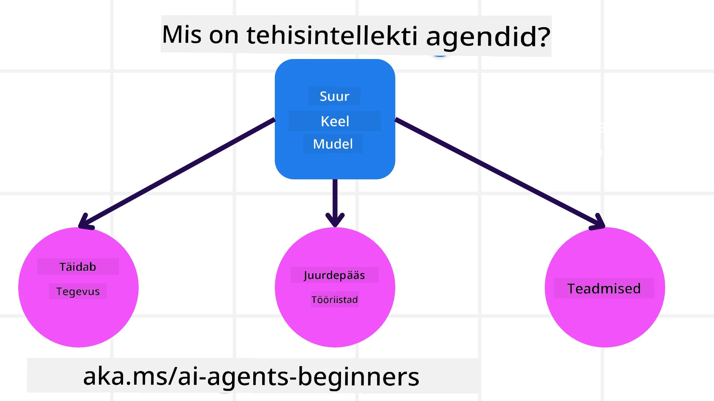
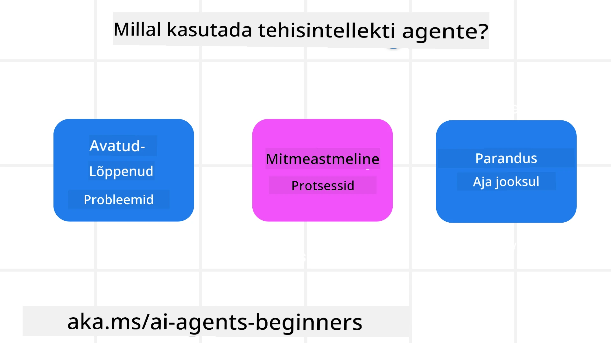

> _(Klõpsa ülaloleval pildil, et vaadata selle tunni videot)_

# Sissejuhatus AI Agentidesse ja Agendi Kasutuskordadesse

Tere tulemast kursusele "AI Agendid algajatele"! See kursus pakub põhilisi teadmisi ja rakendusnäiteid AI Agentide ülesehitamiseks.

Liitu <a href="https://discord.gg/kzRShWzttr" target="_blank">Azure AI Discord kogukonnaga</a>, et kohtuda teiste õppijate ja AI Agentide loojaid ning esitama kõik küsimused, mis sul selle kursuse kohta on.

Selle kursuse alustamiseks hakkame paremini mõistma, mis on AI Agendid ja kuidas me saame neid kasutada rakendustes ja töövoogudes, mida me ehitame.

## Sissejuhatus

See tund käsitleb:

- Mis on AI Agendid ja millised on erinevad agentide tüübid?
- Millised kasutusjuhtumid sobivad AI Agentidele kõige paremini ja kuidas nad meid aidata saavad?
- Millised on mõned põhielemendid, kui disainime Agentseid lahendusi?

## Õpieesmärgid
Pärast selle tundi läbimist peaksid sa olema võimeline:

- Mõistma AI Agendi kontseptsioone ja kuidas need erinevad teistest AI lahendustest.
- Rakendama AI Agente kõige tõhusamalt.
- Kujundama Agentseid lahendusi produktiivselt nii kasutajatele kui klientidele.

## AI Agentide määratlemine ja tüübid

### Mis on AI Agendid?

AI Agendid on **süsteemid**, mis võimaldavad **suurte keelemudelite (LLM-ide)** kaudu **tegevusi sooritada**, laiendades nende võimekust, andes LLM-idele **ligipääsu tööriistadele** ja **teadmistele**.

Lahutame selle määratluse väiksemateks osadeks:

- **Süsteem** - On oluline mõelda agentidele mitte ainult ühe komponendina, vaid paljude komponentide süsteemina. Algsel tasemel on AI Agendi komponendid:
  - **Keskkond** - määratletud ruum, kus AI Agent tegutseb. Näiteks kui meil oleks reisibroneerimise AI Agent, võiks keskkonnaks olla reisibroneerimise süsteem, mida AI Agent kasutab ülesannete täitmiseks.
  - **Andurid** - Keskkonnal on informatsioon ja see annab tagasisidet. AI Agendid kasutavad andureid, et koguda ja tõlgendada infot keskkonna hetkeseisundi kohta. Reisibroneerimise agendi näites võib reisibroneerimise süsteem anda infot näiteks hotellide saadavuse või lennupiletite hindade kohta.
  - **Aktivaatorid** - Kui AI Agent saab viimase keskkonna seisundi, otsustab agent, millist tegevust ülesande täitmiseks sooritada, et keskkonda muuta. Reisibroneerimise agendi puhul võib see olla kasutajale saadava toa broneerimine.

**Suured Keelemudelid** - Agendi kontseptsioon eksisteeris juba enne LLM-ide loomist. AI Agentide ehitamise eelis LLM-idega on nende võime tõlgendada inimkeelt ja andmeid. See võime võimaldab LLM-idel tõlgendada keskkonna infot ja määratleda plaani keskkonna muutmiseks.

**Tegevuste sooritamine** - Välja AI Agentide süsteemidest on LLM-id piiratud olukordadega, kus tegevus on sisuliselt kasutaja lõigu põhjal sisu või info genereerimine. AI Agentide süsteemides saavad LLM-id täita ülesandeid, tõlgendades kasutaja taotlust ja kasutades tööriistu, mis on nende keskkonnas kättesaadavad.

**Ligipääs tööriistadele** - Mida LLM saab kasutada, määrab 1) keskkond, kus ta tegutseb, ja 2) AI Agendi arendaja. Meie reisibüroo näite puhul on agendi tööriistad piiratud broneerimissüsteemis saadaolevate operatsioonidega ja/või arendaja võib piirati agendi tööriistade ligipääsu lendudele.

**Mälu+Teadmised** - Mälu võib olla lühiajaline, juhul kui see puudutab kasutaja ja agendi vestlust. Pikemaajalises perspektiivis, lisaks keskkonna infot, võivad AI Agendid hankida teadmisi ka teistest süsteemidest, teenustest, tööriistadest ja isegi teistelt agentidelt. Reisibüroo näites võib see olla info kasutaja reisieelistuste kohta kliendiandmebaasis.

### Erinevad agentide tüübid

Nüüd, kui meil on üldine AI Agentide definitsioon, vaatame mõningaid konkreetseid agentide tüüpe ja kuidas neid võiks rakendada reisibroneerimise AI agendi puhul.

| **Agendi tüüp**              | **Kirjeldus**                                                                                                                      | **Näide**                                                                                                                                                                                                                   |
| ---------------------------- | --------------------------------------------------------------------------------------------------------------------------------- | --------------------------------------------------------------------------------------------------------------------------------------------------------------------------------------------------------------------------- |
| **Lihtsad refleksagendid**   | Teevad koheseid tegevusi eeldefineeritud reeglite alusel.                                                                         | Reisibüroo agent tõlgendab e-kirja konteksti ja edastab reisikaebused klienditeenindusele.                                                                                                                                  |
| **Mudelpõhised refleksagendid** | Tegevused toimuvad maailma mudeli ja selle muutuste põhjal.                                                                      | Reisibüroo agent hakkab prioriseerima marsruute, kus on toimunud märkimisväärsed hinnamuutused, baseerudes ajaloolisele hinnainfole.                                                                                       |
| **Eesmärgipõhised agendid**  | Loovad plaane spetsiifiliste eesmärkide saavutamiseks, tõlgendades eesmärki ja määrates tegevused selle saavutamiseks.             | Reisibüroo agent broneerib reisi, määrates vajalikud reisikorraldused (auto, ühistransport, lennud) praegusest asukohast sihtkohta.                                                                                         |
| **Kasulikkuspõhised agendid** | Võtavad arvesse eelistusi ja kaaluvad numbriliselt kompromisse, et määrata, kuidas eesmärke saavutada.                           | Reisibüroo agent maksimeerib kasulikkust, kaaludes reisibroneeringu mugavust vs kulu.                                                                                                                                        |
| **Õppivad agendid**          | Paranevad aja jooksul, reageerides tagasisidele ja kohandades tegevusi vastavalt.                                                | Reisibüroo agent parandab end klientide tagasiside põhjal pärast reisi tehtud uuringutest, tehes tulevaste broneeringute korral muudatusi.                                                                                   |
| **Hierarhilised agendid**    | Sisaldavad mitut agenti kihilises süsteemis, kus kõrgema taseme agendid jagavad ülesandeid alamagentidele täitmiseks.             | Reisibüroo agent tühistab reisi, jagades ülesande alamülesanneteks (nt täpsete broneeringute tühistamine) ja lastes alamagentidel need täita, teatades tulemuse kõrgema taseme agendile.                                    |
| **Mitmeagendisüsteemid (MAS)** | Agendid täidavad ülesandeid iseseisvalt, kas koostöös või konkurentsis.                                                         | Koostöö: Mitmed agendid broneerivad konkreetseid reisiteenuseid nagu hotellid, lennud ja meelelahutus. Konkurents: Mitmed agendid haldavad ja konkureerivad ühise hotelli broneerimiskalendri üle, et klienti hotelli paigutada. |

## Millal kasutada AI Agente

Varasemal alal kasutasime reisibüroo näidet, et selgitada, kuidas erinevaid agentide tüüpe saab rakendada erinevates reisibroneerimise stsenaariumites. Jätkame selle rakenduse kasutamist kogu kursuse jooksul.

Vaatame kasutusjuhtumeid, mille puhul AI Agendid sobivad kõige paremini:

- **Avatud otsaga probleemid** - lastes LLM-il määrata vajalikud sammud ülesande täitmiseks, kuna seda ei saa alati kõvasti defineerida töövoogu.
- **Mitmeastmelised protsessid** - ülesanded, mis nõuavad keerukustaset, kus AI Agent peab kasutama tööriistu või infot mitme etapina ühe looku asemel.
- **Aja jooksul parenemine** - ülesanded, kus agent saab ajas paraneda, saades tagasisidet kas oma keskkonnast või kasutajatelt, et pakkuda paremat kasulikkust.

Räägime AI Agentide kasutamise muudest kaalutlustest usaldusväärsete AI Agentide loomise tunnis.

## Agentsete lahenduste põhialused

### Agendi arendus

Esimene samm AI Agendi süsteemi disainimisel on määratleda tööriistad, tegevused ja käitumised. Selles kursuses keskendume **Azure AI Agent Service** kasutamisele oma Agentide määratlemiseks. See pakub funktsioone nagu:

- Vabade mudelite valik, näiteks OpenAI, Mistral ja Llama
- Litsentseeritud andmete kasutamine pakkujate kaudu nagu Tripadvisor
- Standardiseeritud OpenAPI 3.0 tööriistade kasutamine

### Agentseid mustreid

Suhtlus LLM-idega toimub läbi promptide. Arvestades AI Agentide poolautonoomset olemust, ei ole alati võimalik ega vajalik pärast muutust keskkonnas LLM-i käsitsi uuesti promptida. Kasutame **Agentseid mustreid**, mis võimaldavad meil LLM-i käsitleda mitmel sammul skaleeritavamal viisil.

See kursus jaguneb praegu populaarsete Agentsete mustriteks.

### Agentsed raamistikud

Agentsed raamistikud võimaldavad arendajatel realiseerida agentseid mustreid koodi kaudu. Need pakuvad malle, pistikprogramme ja tööriistu parema AI Agentide koostöö jaoks. Need eelised annavad parema jälgitavuse ja probleemide lahendamise võime AI Agentide süsteemidele.

Selles kursuses uurime Microsoft Agent Frameworki (MAF) tootmisvalmiste AI Agentide ehitamiseks.

## Näidiskoodid

- Python: [Agent Framework](./code_samples/01-python-agent-framework.ipynb)
- .NET: [Agent Framework](./code_samples/01-dotnet-agent-framework.md)

## Kas sul on AI Agentide kohta veel küsimusi?

Liitu [Microsoft Foundry Discordiga](https://aka.ms/ai-agents/discord), et kohtuda teiste õppijatega, osaleda konsultatsioonides ja saada vastuseid oma AI Agentide küsimustele.

## Eelmine tund

[Kurssi seadistamine](../00-course-setup/README.md)

## Järgmine tund

[Agentsed raamistike uurimine](../02-explore-agentic-frameworks/README.md)

---

<!-- CO-OP TRANSLATOR DISCLAIMER START -->
**Vastutusest loobumine**:
See dokument on tõlgitud kasutades tehisintellektil põhinevat tõlketeenust [Co-op Translator](https://github.com/Azure/co-op-translator). Kuigi me püüame täpsust, palun olge teadlikud, et automaatsed tõlked võivad sisaldada vigu või ebatäpsusi. Originaaldokument selle emakeeles tuleks pidada autoriteetseks allikaks. Olulise teabe puhul soovitatakse kasutada professionaalset inimtõlget. Me ei vastuta nende arusaamade ega valesti mõistmiste eest, mis võivad tekkida selle tõlke kasutamisest.
<!-- CO-OP TRANSLATOR DISCLAIMER END -->