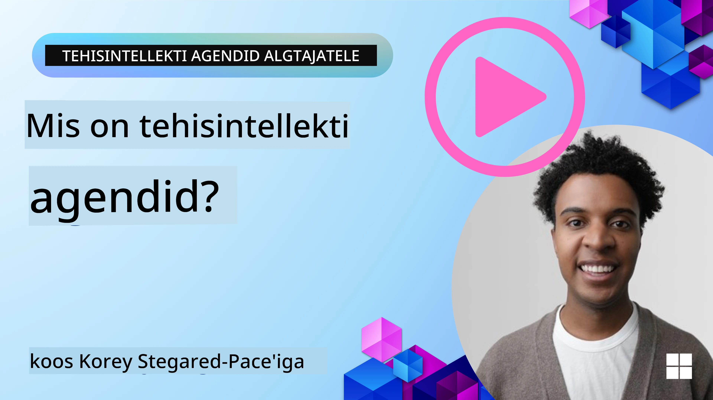
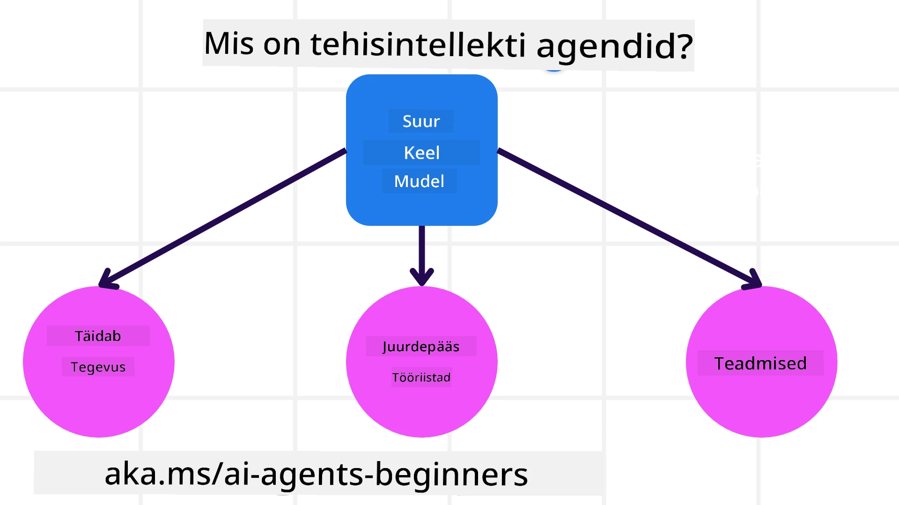
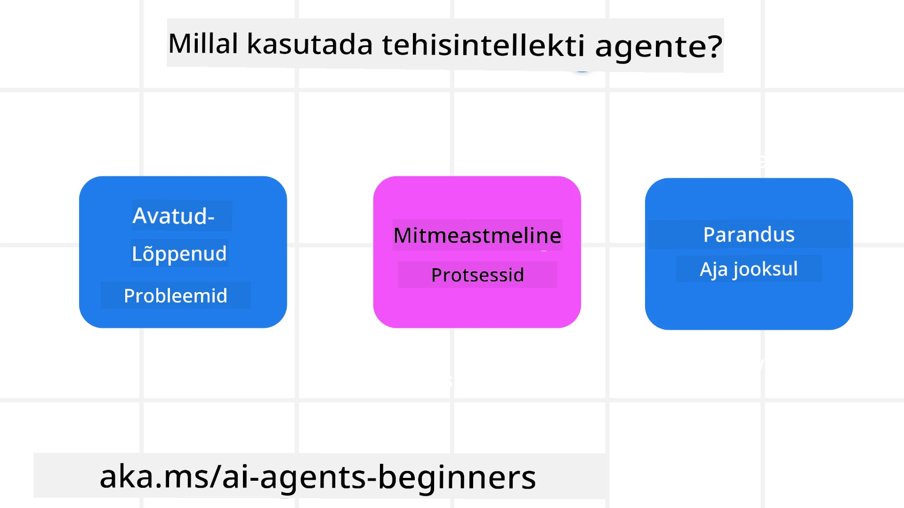

> _(Klõpsake ülaloleval pildil, et vaadata selle õppetunni videot)_

# Sissejuhatus tehisintellektil põhinevatesse agentidesse ja nende kasutusjuhtudesse

Tere tulemast **Algajate tehisintellekti agentide** kursusele! See kursus annab teile põhiteadmised — ja tõelise töökoodi — et alustada tehisintellekti agentide loomist algusest peale.

Tere tulemast <a href="https://discord.gg/kzRShWzttr" target="_blank">Azure AI Discord kogukonda</a> — seal on palju õppureid ja tehisintellekti arendajaid, kes vastavad hea meelega küsimustele.

Enne kui hakkame ehitama, veendume, et saame tegelikult aru, mis on tehisintellekti agent ja millal on mõistlik seda kasutada.

---

## Sissejuhatus

Selles õppetunnis käsitleme:

- Mis on tehisintellekti agentid ja millised erinevad tüübid eksisteerivad
- Milliste ülesannete jaoks on tehisintellekti agentid kõige paremini sobivad
- Põhikomponendid, mida kasutad agentuurse lahenduse kavandamisel

## Õpieesmärgid

Selle õppetunni lõpuks peaksid suutma:

- Selgitada, mis on tehisintellekti agent ja kuidas see erineb tavalisest tehisintellekti lahendusest
- Teada, millal kaaluda tehisintellekti agendi kasutamist (ja millal mitte)
- Kavandada lihtsa agentuuri lahendus reaalse maailma probleemile

---

## Tehisintellekti agentide määratlemine ja tüübid

### Mis on tehisintellekti agentid?

Siin on lihtne viis selle mõistmiseks:

> **Tehisintellekti agentid on süsteemid, mis lasevad suurte keelemudelitel (LLM-idel) tegelikult *tegusid sooritada* — andes neile tööriistad ja teadmised maailmas tegutsemiseks, mitte ainult vastamiseks.**

Vaatame seda veidi lähemalt:

- **Süsteem** — Tehisintellekti agent ei ole lihtsalt üks asi, see on osade kogum, mis töötavad koos. Iga agendi põhikomponendid on kolm:
  - **Keskkond** — Ruumi osa, kus agent töötab. Reisibroneerimisagendi puhul on see broneerimisplatvorm ise.
  - **Sensorid** — Kuidas agent loeb oma keskkonda. Meie reisiagent võib kontrollida hotellide saadaolevust või lendude hindu.
  - **Aktivaatorid** — Kuidas agent tegutseb. Reisagent võib broneerida toa, saata kinnituse või tühistada broneeringu.

- **Suured keelemudelid** — Agendid eksisteerisid enne LLM-e, kuid just LLM-id muudavad tänapäevased agendid nii võimsaks. Nad mõistavad loomulikku keelt, suudavad konteksti analüüsida ja muuta ebamäärase kasutajapäringu konkreetseks tegevuskavaks.

- **Tegevuste sooritamine** — Ilma agendisüsteemita genereerib LLM ainult teksti. Agendisüsteemis saab LLM tegelikult *täita* samme — otsida andmebaasist, kutsuda API-d, saata sõnumit.

- **Ligipääs tööriistadele** — Milliseid tööriistu agent saab kasutada, sõltub (1) keskkonnast, kus ta töötab, ja (2) mida arendaja talle annab. Reisagent võib lennupileteid otsida, kuid ei pruugi kliendiandmeid muuta — kõik sõltub sellest, mida ühendad.

- **Mälu + Teadmised** — Agentidel võib olla lühiajaline mälu (praegune vestlus) ja pikaajaline mälu (kliendiandmebaas, varasemad suhtlused). Reisagent võib "mäletada", et eelistad aknaäärseid kohti.

---

### Erinevad tehisintellekti agentide tüübid

Kõik agendid pole ehitatud ühtemoodi. Siin on peamiste tüüpide ülevaade, kasutades reisiagentuuri näidet:

| **Agendi tüüp** | **Mida ta teeb** | **Reisiagendi näide** |
|---|---|---|
| **Lihtsad refleksagendid** | Järgivad rangelt kodeeritud reegleid — ei mälu ega planeerimist. | Näeb kaebuskirja → edastab klienditoele. Lõpp. |
| **Mudelpõhised refleksagendid** | Hoidavad sisemist maailma mudelit ja uuendavad seda, kui olukord muutub. | Jälgib ajaloolisi lennuhindu ja märgib marsruudid, mis muutuvad ootamatult kalliks. |
| **Eesmärgipõhised agendid** | Omavad eesmärki ja leiavad sammhaaval tee selle saavutamiseks. | Broneerib kogu reisi (lennud, auto, hotell) sinu asukohast sihtkohta jõudmiseks. |
| **Kasulikkuspõhised agendid** | Ei leia lihtsalt *mõnda* lahendust — otsib *parimat* lahendust, tasakaalustades kompromisse. | Hõlbustab hinna ja mugavuse kaalumist, et leida reisi, mis sobib sinu eelistustega kõige paremini. |
| **Õppivad agendid** | Paranevad ajaga, õppides tagasiside põhjal. | Kohandab tulevasi broneerimissoovitusi pärast reisi tehtud küsitlusi. |
| **Hierarhilised agendid** | Kõrgema taseme agent jagab töö alamülesanneteks ja delegeerib madalama taseme agentidele. | "Tühista reis" päring jaguneb: tühista lend, tühista hotell, tühista autorent — igaüht käsitleb alamagend. |
| **Mitme agendi süsteemid (MAS)** | Mitmed iseseisvad agendid töötavad koos (või konkureerivad). | Koostöölises süsteemis haldavad eraldi agendid hotelle, lende ja meelelahutust. Konkurentsis võistlevad mitmed agendid, et täita hotellite kohti parima hinnaga. |

---

## Millal kasutada tehisintellekti agente

See, et sa *saa* kasutada tehisintellekti agenti, ei tähenda, et peaksid seda alati tegema. Siin on olukorrad, kus agendid tõesti säravad:

- **Avatud lõpp-punktiga probleemid** — Kui probleemi lahendamise samme ei saa eelnevalt programmeerida. Sul on vaja, et LLM leiaks tee dünaamiliselt.
- **Mitme sammu protsessid** — Ülesanded, mis nõuavad tööriistade kasutamist mitmel korral, mitte ainult ühe otsingu või genereerimise puhul.
- **Ajaga paranemine** — Kui soovid, et süsteem muutuks targemaks kasutajate tagasiside või keskkonna signaalide põhjal.

Sellest, millal (ja millal *mitte*) kasutada tehisintellekti agente, räägime rohkem kursuse hilisemas osas **Usaldusväärsete tehisintellekti agentide loomine**.

---

## Agentuursete lahenduste põhialused

### Agendi arendus

Esimene asi, mida agendi loomisel teha, on määratleda *mida ta teha saab* — millised on selle tööriistad, tegevused ja käitumised.

Selles kursuses kasutame peamise platvormina **Microsoft Foundry Agent Service**-i. See toetab:

- Pakkujate, nagu OpenAI, Mistral ja Meta (Llama), mudeleid
- Pakkujate, nagu Tripadvisor, litsentseeritud andmeid
- Standardiseeritud OpenAPI 3.0 tööriistade definitsioone

### Agentuursed mustrid

Suhelda saab LLM-idega päringute kaudu. Agentide puhul ei saa kõiki päringuid käsitsi koostada — agent peab tegutsema mitme sammuna. Siin tulevadki mängu **agentuursed mustrid**. Need on taaskasutatavad strateegiad LLM-ide pärimiseks ja korraldamiseks suuremahulises, usaldusväärsemas vormis.

See kursus on üles ehitatud kõige tavapärasematele ja kasulikumatele agentuursetele mustritele.

### Agentuursed raamistikud

Agentuursed raamistikud annavad arendajatele ettevalmistatud mallid, tööriistad ja infrastruktuuri agentide ehitamiseks. Need muudavad lihtsamaks:

- Tööriistade ja võimete ühendamise
- Agentide tegevuse jälgimise (ja juhuks, kui midagi valesti läheb, silumise)
- Koostöö paljude agentide vahel

Selles kursuses keskendume **Microsoft Agent Framework (MAF)**-ile, mis sobib tootmisvalmis agentide ehitamiseks.

---

## Koodinäited

Valmis näha seda tegutsemises? Siin on selle õppetunni koodinäited:

- 🐍 Python: [Agent Framework](./code_samples/01-python-agent-framework.ipynb)
- 🔷 .NET: [Agent Framework](./code_samples/01-dotnet-agent-framework.md)

---

## Kas sul on küsimusi?

Liitu [Microsoft Foundry Discord](https://discord.com/invite/ATgtXmAS5D) kanaliga, et suhelda teiste õppuritega, osaleda kontoritundides ja saada kogukonnalt tehisintellekti agentidega seotud küsimustele vastuseid.

---

## Eelmine õppetund

[Kursuse seadistamine](../00-course-setup/README.md)

## Järgmine õppetund

[Agentuursete raamistikute uurimine](../02-explore-agentic-frameworks/README.md)

---

<!-- CO-OP TRANSLATOR DISCLAIMER START -->
**Lahtiütlus**:
See dokument on tõlgitud kasutades AI tõlketeenust [Co-op Translator](https://github.com/Azure/co-op-translator). Kuigi me püüdleme täpsuse poole, palun pange tähele, et automatiseeritud tõlgetes võib esineda vigu või ebatäpsusi. Originaaldokument selle emakeeles tuleks pidada autoriteetseks allikaks. Olulise teabe puhul soovitatakse kasutada professionaalset inimtõlget. Me ei vastuta selle tõlkega seotud eksimustest või valesti mõistmistest.
<!-- CO-OP TRANSLATOR DISCLAIMER END -->