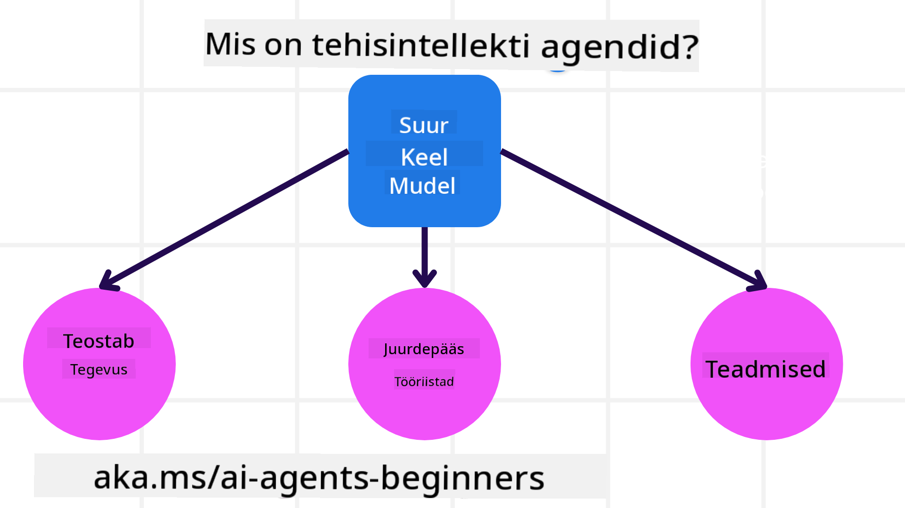
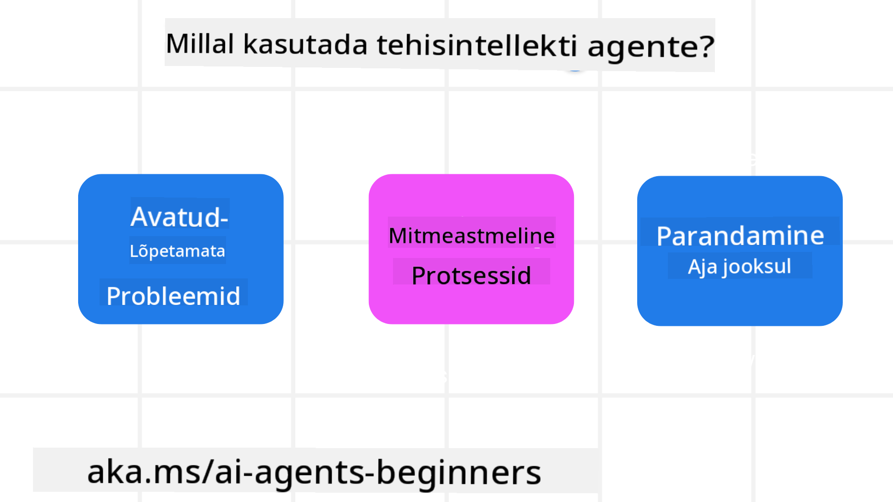

<!--
CO_OP_TRANSLATOR_METADATA:
{
  "original_hash": "1e40fe956ff79462a02a17080b125041",
  "translation_date": "2025-10-11T11:11:37+00:00",
  "source_file": "01-intro-to-ai-agents/README.md",
  "language_code": "et"
}
-->

> _(Klõpsa ülaloleval pildil, et vaadata selle õppetunni videot)_

# Sissejuhatus tehisintellekti agentidesse ja nende kasutusjuhtudesse

Tere tulemast kursusele "Tehisintellekti agendid algajatele"! See kursus pakub põhiteadmisi ja praktilisi näiteid tehisintellekti agentide loomiseks.

Liitu <a href="https://discord.gg/kzRShWzttr" target="_blank">Azure AI Discordi kogukonnaga</a>, et kohtuda teiste õppijate ja tehisintellekti agentide arendajatega ning esitada küsimusi, mis sul selle kursuse kohta võivad tekkida.

Kursuse alustamiseks tutvume esmalt tehisintellekti agentide olemusega ja sellega, kuidas neid saab kasutada rakendustes ja töövoogudes, mida me loome.

## Sissejuhatus

Selles õppetunnis käsitletakse:

- Mis on tehisintellekti agendid ja millised on nende erinevad tüübid?
- Millised kasutusjuhtumid sobivad kõige paremini tehisintellekti agentidele ja kuidas need meid aidata saavad?
- Millised on mõned põhilised ehitusplokid agentlike lahenduste kujundamisel?

## Õpieesmärgid
Pärast selle õppetunni läbimist peaksid sa olema võimeline:

- Mõistma tehisintellekti agentide kontseptsioone ja seda, kuidas need erinevad teistest tehisintellekti lahendustest.
- Rakendama tehisintellekti agente kõige tõhusamalt.
- Kujundama agentlikke lahendusi produktiivselt nii kasutajate kui klientide jaoks.

## Tehisintellekti agentide määratlemine ja tüübid

### Mis on tehisintellekti agendid?

Tehisintellekti agendid on **süsteemid**, mis võimaldavad **suurtel keelemudelitel (LLM)** **teostada tegevusi**, laiendades nende võimekust, andes LLM-idele **juurdepääsu tööriistadele** ja **teadmistele**.

Lõhume selle definitsiooni väiksemateks osadeks:

- **Süsteem** - Oluline on mõelda agentidest mitte kui üksikust komponendist, vaid kui paljude komponentide süsteemist. Tehisintellekti agendi põhikomponendid on:
  - **Keskkond** - Määratletud ruum, kus tehisintellekti agent tegutseb. Näiteks, kui meil oleks reisibroneerimise tehisintellekti agent, võiks keskkond olla reisibroneerimise süsteem, mida agent kasutab ülesannete täitmiseks.
  - **Sensorid** - Keskkond sisaldab teavet ja annab tagasisidet. Tehisintellekti agendid kasutavad sensoreid, et koguda ja tõlgendada teavet keskkonna praeguse seisundi kohta. Reisibroneerimise agendi näites võib reisibroneerimise süsteem anda teavet, nagu hotellide saadavus või lennupiletite hinnad.
  - **Aktuaatorid** - Kui tehisintellekti agent saab keskkonna praeguse seisundi, määrab agent praeguse ülesande jaoks, millist tegevust teha, et keskkonda muuta. Reisibroneerimise agendi puhul võib see olla kasutajale toa broneerimine.

**Suured keelemudelid** - Agentide kontseptsioon eksisteeris juba enne LLM-ide loomist. Tehisintellekti agentide loomise eelis LLM-idega on nende võime tõlgendada inimkeelt ja andmeid. See võime võimaldab LLM-idel tõlgendada keskkonnainfot ja määratleda plaani keskkonna muutmiseks.

**Tegevuste teostamine** - Väljaspool tehisintellekti agentide süsteeme on LLM-id piiratud olukordadega, kus tegevus seisneb sisu või teabe genereerimises kasutaja sisendi põhjal. Tehisintellekti agentide süsteemides suudavad LLM-id täita ülesandeid, tõlgendades kasutaja taotlust ja kasutades tööriistu, mis on nende keskkonnas saadaval.

**Juurdepääs tööriistadele** - Millistele tööriistadele LLM-il on juurdepääs, määratakse 1) keskkonna järgi, kus ta tegutseb, ja 2) tehisintellekti agendi arendaja poolt. Meie reisibroneerimise agendi näites on agendi tööriistad piiratud broneerimissüsteemi pakutavate toimingutega ja/või arendaja võib piirata agendi tööriistade juurdepääsu ainult lendudele.

**Mälu+Teadmised** - Mälu võib olla lühiajaline vestluse kontekstis kasutaja ja agendi vahel. Pikaajaliselt, väljaspool keskkonna pakutavat teavet, saavad tehisintellekti agendid hankida teadmisi teistest süsteemidest, teenustest, tööriistadest ja isegi teistelt agentidelt. Reisibroneerimise näites võivad need teadmised olla teave kasutaja reisieelistuste kohta, mis asuvad kliendibaasis.

### Erinevad agentide tüübid

Nüüd, kui meil on üldine tehisintellekti agentide definitsioon, vaatame mõningaid konkreetseid agentide tüüpe ja kuidas neid rakendataks reisibroneerimise tehisintellekti agendis.

| **Agendi tüüp**               | **Kirjeldus**                                                                                                                        | **Näide**                                                                                                                                                                                                                   |
| ----------------------------- | ------------------------------------------------------------------------------------------------------------------------------------- | ----------------------------------------------------------------------------------------------------------------------------------------------------------------------------------------------------------------------------- |
| **Lihtsad refleksiagendid**   | Teostavad koheseid tegevusi eelmääratletud reeglite alusel.                                                                            | Reisibroneerimise agent tõlgendab e-kirja konteksti ja suunab reisikaebused klienditeenindusse.                                                                                                                              |
| **Mudelpõhised refleksiagendid** | Teostavad tegevusi maailma mudeli ja selle mudeli muutuste alusel.                                                                    | Reisibroneerimise agent prioritiseerib marsruute, kus on märkimisväärsed hinnamuutused, tuginedes juurdepääsule ajaloolistele hinnandmetele.                                                                                   |
| **Eesmärgipõhised agendid**   | Loovad plaane konkreetsete eesmärkide saavutamiseks, tõlgendades eesmärki ja määrates tegevused selle saavutamiseks.                   | Reisibroneerimise agent broneerib reisi, määrates vajalikud reisikorraldused (auto, ühistransport, lennud) praegusest asukohast sihtkohta.                                                                                     |
| **Kasupõhised agendid**       | Arvestavad eelistusi ja kaaluvad kompromisse numbriliselt, et määrata, kuidas eesmärke saavutada.                                      | Reisibroneerimise agent maksimeerib kasu, kaaludes mugavust vs. kulusid reisibroneerimisel.                                                                                                                                  |
| **Õppivad agendid**           | Parandavad aja jooksul, reageerides tagasisidele ja kohandades vastavalt tegevusi.                                                    | Reisibroneerimise agent paraneb, kasutades klientide tagasisidet pärast reisi, et teha tulevaste broneeringute osas kohandusi.                                                                                               |
| **Hierarhilised agendid**     | Koosnevad mitmest agendist kihilises süsteemis, kus kõrgema taseme agendid jagavad ülesandeid alamagentidele täitmiseks.               | Reisibroneerimise agent tühistab reisi, jagades ülesande alamülesanneteks (näiteks konkreetsete broneeringute tühistamine) ja lastes alamagentidel need täita, andes aru kõrgema taseme agendile.                                                                     |
| **Multi-Agent Systems (MAS)** | Agendid täidavad ülesandeid iseseisvalt, kas koostöös või konkurentsis.                                                               | Koostöö: Mitmed agendid broneerivad konkreetseid reisiteenuseid, nagu hotellid, lennud ja meelelahutus. Konkurents: Mitmed agendid haldavad ja konkureerivad jagatud hotellibroneeringu kalendris, et broneerida kliente hotelli. |

## Millal kasutada tehisintellekti agente

Eelmises osas kasutasime reisibroneerimise kasutusjuhtumit, et selgitada, kuidas erinevaid agentide tüüpe saab kasutada erinevates reisibroneerimise stsenaariumides. Jätkame selle rakenduse kasutamist kogu kursuse vältel.

Vaatame, millist tüüpi kasutusjuhtumid sobivad kõige paremini tehisintellekti agentidele:

- **Avatud probleemid** - võimaldades LLM-il määrata vajalikud sammud ülesande täitmiseks, kuna neid ei saa alati töövoogu eelnevalt kodeerida.
- **Mitmeastmelised protsessid** - ülesanded, mis nõuavad teatud keerukust, kus tehisintellekti agent peab kasutama tööriistu või teavet mitme pöörde jooksul, mitte ainult ühe korra.
- **Paranemine aja jooksul** - ülesanded, kus agent saab aja jooksul paraneda, saades tagasisidet kas oma keskkonnast või kasutajatelt, et pakkuda paremat kasu.

Rohkem kaalutlusi tehisintellekti agentide kasutamise kohta käsitleme usaldusväärsete tehisintellekti agentide loomise õppetunnis.

## Agentlike lahenduste põhitõed

### Agendi arendamine

Esimene samm tehisintellekti agendi süsteemi kujundamisel on tööriistade, tegevuste ja käitumiste määratlemine. Selles kursuses keskendume **Azure AI Agent Service** kasutamisele oma agentide määratlemiseks. See pakub funktsioone nagu:

- Avatud mudelite valik, nagu OpenAI, Mistral ja Llama
- Litsentsitud andmete kasutamine selliste pakkujate kaudu nagu Tripadvisor
- Standardiseeritud OpenAPI 3.0 tööriistade kasutamine

### Agentlikud mustrid

LLM-idega suhtlemine toimub sisendite kaudu. Arvestades tehisintellekti agentide poolautonoomset olemust, ei ole alati võimalik ega vajalik LLM-i käsitsi uuesti sisestada pärast keskkonna muutust. Kasutame **agentlikke mustreid**, mis võimaldavad meil LLM-i sisestada mitme sammu jooksul skaleeritavamal viisil.

See kursus on jagatud mõningate praegu populaarsete agentlike mustrite järgi.

### Agentlikud raamistikud

Agentlikud raamistikud võimaldavad arendajatel agentlikke mustreid koodi kaudu rakendada. Need raamistikud pakuvad malle, pluginaid ja tööriistu paremaks tehisintellekti agentide koostööks. Need eelised pakuvad paremat jälgitavust ja tõrkeotsingut tehisintellekti agentide süsteemides.

Selles kursuses uurime teaduspõhist AutoGen raamistikku ja tootmisvalmis Agent raamistikku Semantic Kernelist.

### Kas sul on rohkem küsimusi tehisintellekti agentide kohta?

Liitu [Azure AI Foundry Discordiga](https://aka.ms/ai-agents/discord), et kohtuda teiste õppijatega, osaleda vastuvõtuaegadel ja saada vastuseid oma tehisintellekti agentide küsimustele.

## Eelmine õppetund

[Course Setup](../00-course-setup/README.md)

## Järgmine õppetund

[Agentlike raamistikude uurimine](../02-explore-agentic-frameworks/README.md)

---

**Lahtiütlus**:  
See dokument on tõlgitud AI tõlketeenuse [Co-op Translator](https://github.com/Azure/co-op-translator) abil. Kuigi püüame tagada täpsust, palume arvestada, et automaatsed tõlked võivad sisaldada vigu või ebatäpsusi. Algne dokument selle algses keeles tuleks pidada autoriteetseks allikaks. Olulise teabe puhul soovitame kasutada professionaalset inimtõlget. Me ei vastuta selle tõlke kasutamisest tulenevate arusaamatuste või valesti tõlgenduste eest.