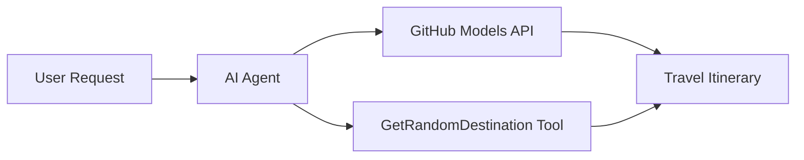

<!--
CO_OP_TRANSLATOR_METADATA:
{
  "original_hash": "23afd9be7b6ba5b69a44c3b6a78e07f6",
  "translation_date": "2025-11-06T10:07:52+00:00",
  "source_file": "01-intro-to-ai-agents/code_samples/01-dotnet-agent-framework.md",
  "language_code": "et"
}
-->
# 🌍 AI-reisiagent Microsoft Agent Frameworkiga (.NET)

## 📋 Stsenaariumi ülevaade

See märkmik näitab, kuidas luua intelligentset reisiplaneerimise agenti, kasutades Microsoft Agent Frameworki .NET jaoks. Agent suudab automaatselt koostada isikupärastatud päevareise juhuslikesse sihtkohtadesse üle maailma.

**Peamised võimekused:**
- 🎲 **Juhuslik sihtkoha valik**: Kasutab kohandatud tööriista puhkusekohtade valimiseks
- 🗺️ **Intelligentne reisiplaneerimine**: Loob üksikasjalikud päevapõhised reisiplaanid
- 🔄 **Reaalajas voogedastus**: Toetab nii koheseid kui ka voogedastusega vastuseid
- 🛠️ **Kohandatud tööriistade integreerimine**: Näitab, kuidas laiendada agendi võimekust

## 🔧 Tehniline arhitektuur

### Põhitehnoloogiad
- **Microsoft Agent Framework**: Viimane .NET-i rakendus AI-agentide arendamiseks
- **GitHub Models integratsioon**: Kasutab GitHubi AI mudelite järeldusteenust
- **OpenAI API ühilduvus**: Kasutab OpenAI klienditeeke koos kohandatud lõpp-punktidega
- **Turvaline konfiguratsioon**: API võtmete haldamine keskkonnapõhiselt

### Peamised komponendid
1. **AIAgent**: Peamine agent, mis haldab vestluse voogu
2. **Kohandatud tööriistad**: `GetRandomDestination()` funktsioon, mis on agendile kättesaadav
3. **Vestluskliendi**: GitHub Models-põhine vestlusliides
4. **Voogedastuse tugi**: Reaalajas vastuste genereerimise võimekus

### Integratsioonimuster


## 🚀 Alustamine

**Eeltingimused:**
- .NET 10.0 või uuem
- GitHub Models API juurdepääsutoken
- Keskkonnamuutujad seadistatud `.env` failis

**Nõutavad keskkonnamuutujad:**
```env
GITHUB_TOKEN=your_github_token
GITHUB_ENDPOINT=https://models.inference.ai.azure.com
GITHUB_MODEL_ID=gpt-4o-mini
```

Käivitage allolev koodijupp järjestikku, et näha reisiagent töös!

---

## .NET Ühe faili rakendus: AI-reisiagendi näide

Vaadake `01-dotnet-agent-framework.cs` täielikku käivitatavat koodinäidet.

```bash
dotnet run 01-dotnet-agent-framework.cs
```

### Näidiskood

```csharp
static string GetRandomDestination()
{
    var destinations = new List<string>
    {
        "Paris, France",
        "Tokyo, Japan",
        "New York City, USA",
        "Sydney, Australia",
        "Rome, Italy",
        "Barcelona, Spain",
        "Cape Town, South Africa",
        "Rio de Janeiro, Brazil",
        "Bangkok, Thailand",
        "Vancouver, Canada"
    };
    var random = new Random();
    int index = random.Next(destinations.Count);
    return destinations[index];
}

// Extract configuration from environment variables
var github_endpoint = Environment.GetEnvironmentVariable("GITHUB_ENDPOINT") ?? throw new InvalidOperationException("GITHUB_ENDPOINT is not set.");
var github_model_id = Environment.GetEnvironmentVariable("GITHUB_MODEL_ID") ?? "gpt-4o-mini";
var github_token = Environment.GetEnvironmentVariable("GITHUB_TOKEN") ?? throw new InvalidOperationException("GITHUB_TOKEN is not set.");

// Configure OpenAI Client Options
var openAIOptions = new OpenAIClientOptions()
{
    Endpoint = new Uri(github_endpoint)
};

// Initialize OpenAI Client with GitHub Models Configuration
var openAIClient = new OpenAIClient(new ApiKeyCredential(github_token), openAIOptions);

// Create AI Agent with Travel Planning Capabilities
AIAgent agent = openAIClient
    .GetChatClient(github_model_id)
    .CreateAIAgent(
        instructions: "You are a helpful AI Agent that can help plan vacations for customers at random destinations",
        tools: [AIFunctionFactory.Create(GetRandomDestination)]
    );

// Execute Agent: Plan a Day Trip (Non-Streaming)
Console.WriteLine(await agent.RunAsync("Plan me a day trip"));

// Execute Agent: Plan a Day Trip (Streaming Response)
await foreach (var update in agent.RunStreamingAsync("Plan me a day trip"))
{
    Console.Write(update);
}
```

---

**Lahtiütlus**:  
See dokument on tõlgitud AI tõlketeenuse [Co-op Translator](https://github.com/Azure/co-op-translator) abil. Kuigi püüame tagada täpsust, palume arvestada, et automaatsed tõlked võivad sisaldada vigu või ebatäpsusi. Algne dokument selle algses keeles tuleks pidada autoriteetseks allikaks. Olulise teabe puhul soovitame kasutada professionaalset inimtõlget. Me ei vastuta selle tõlke kasutamisest tulenevate arusaamatuste või valesti tõlgenduste eest.