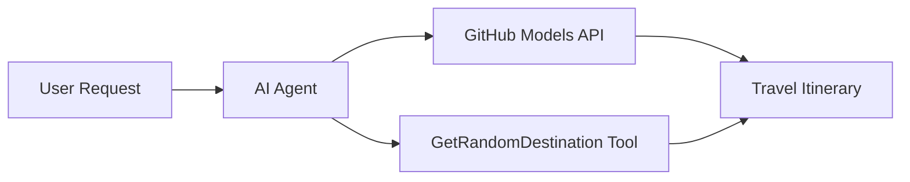

# 🌍 AI-reisiagent Microsoft Agent Frameworkiga (.NET)

## 📋 Stsenaariumi ülevaade

See märkmik näitab, kuidas luua intelligentset reisiplaneerimise agenti, kasutades Microsoft Agent Frameworki .NET jaoks. Agent suudab automaatselt koostada isikupärastatud päevaseid reisiplaane juhuslike sihtkohtade jaoks üle maailma.

**Peamised võimekused:**
- 🎲 **Juhuslik sihtkoha valik**: Kasutab kohandatud tööriista puhkusekohtade valimiseks
- 🗺️ **Tark reisiplaanimine**: Loob üksikasjalikud päevaplaanid
- 🔄 **Reaalajas voogedastus**: Toetab nii koheseid kui ka voogedastusega vastuseid
- 🛠️ **Kohandatud tööriistade integreerimine**: Näitab, kuidas laiendada agendi funktsionaalsust

## 🔧 Tehniline arhitektuur

### Põhitehnoloogiad
- **Microsoft Agent Framework**: Viimane .NET-i rakendus AI-agentide arendamiseks
- **GitHub Models integratsioon**: Kasutab GitHubi AI mudelite järeldusteenust
- **OpenAI API ühilduvus**: Kasutab OpenAI klienditeeke koos kohandatud lõpp-punktidega
- **Turvaline konfiguratsioon**: API võtmete haldamine keskkonnapõhiselt

### Peamised komponendid
1. **AIAgent**: Peamine agent, mis haldab vestluse voogu
2. **Kohandatud tööriistad**: `GetRandomDestination()` funktsioon, mis on agendile kättesaadav
3. **Vestluskliendi**: GitHub Models-põhine vestlusliides
4. **Voogedastuse tugi**: Reaalajas vastuste genereerimise võimekus

### Integreerimismuster


## 🚀 Alustamine

**Eeltingimused:**
- .NET 9.0 või uuem
- GitHub Models API juurdepääsuvõti
- Keskkonnamuutujad seadistatud `.env` failis

**Nõutavad keskkonnamuutujad:**
```env
GITHUB_TOKEN=your_github_token
GITHUB_ENDPOINT=https://models.inference.ai.azure.com
GITHUB_MODEL_ID=gpt-4o-mini
```

Käivitage allolevad lahtrid järjest, et näha reisiagent töös!

---

## .NET Single File App: AI Travel Agent Example

See `01-dotnet-agent-framework.cs` for the complete runnable code sample.

Käivitage allolev koodinäide:

```bash
dotnet run 01-dotnet-agent-framework.cs
```

### Sample Code

```csharp
static string GetRandomDestination()
{
    var destinations = new List<string>
    {
        "Paris, France",
        "Tokyo, Japan",
        "New York City, USA",
        "Sydney, Australia",
        "Rome, Italy",
        "Barcelona, Spain",
        "Cape Town, South Africa",
        "Rio de Janeiro, Brazil",
        "Bangkok, Thailand",
        "Vancouver, Canada"
    };
    var random = new Random();
    int index = random.Next(destinations.Count);
    return destinations[index];
}

// Extract configuration from environment variables
var github_endpoint = Environment.GetEnvironmentVariable("GITHUB_ENDPOINT") ?? throw new InvalidOperationException("GITHUB_ENDPOINT is not set.");
var github_model_id = Environment.GetEnvironmentVariable("GITHUB_MODEL_ID") ?? "gpt-4o-mini";
var github_token = Environment.GetEnvironmentVariable("GITHUB_TOKEN") ?? throw new InvalidOperationException("GITHUB_TOKEN is not set.");

// Configure OpenAI Client Options
var openAIOptions = new OpenAIClientOptions()
{
    Endpoint = new Uri(github_endpoint)
};

// Initialize OpenAI Client with GitHub Models Configuration
var openAIClient = new OpenAIClient(new ApiKeyCredential(github_token), openAIOptions);

// Create AI Agent with Travel Planning Capabilities
AIAgent agent = openAIClient
    .GetChatClient(github_model_id)
    .CreateAIAgent(
        instructions: "You are a helpful AI Agent that can help plan vacations for customers at random destinations",
        tools: [AIFunctionFactory.Create(GetRandomDestination)]
    );

// Execute Agent: Plan a Day Trip (Non-Streaming)
Console.WriteLine(await agent.RunAsync("Plan me a day trip"));

// Execute Agent: Plan a Day Trip (Streaming Response)
await foreach (var update in agent.RunStreamingAsync("Plan me a day trip"))
{
    Console.Write(update);
}
```
