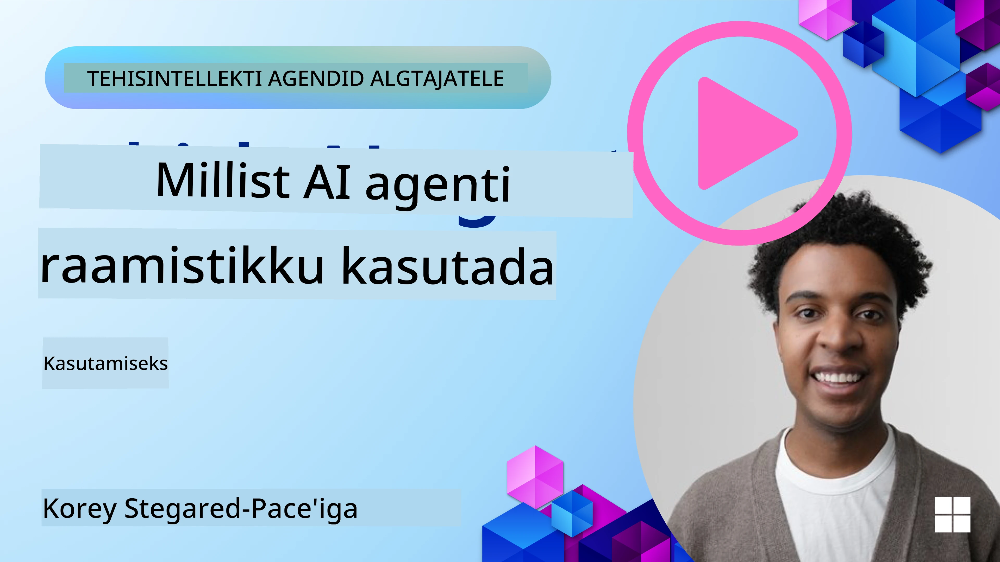

[](https://youtu.be/ODwF-EZo_O8?si=1xoy_B9RNQfrYdF7)

> _(Klõpsake ülaloleval pildil, et vaadata selle õppetunni videot)_

# Uurige AI-agentide raamistikke

AI-agentide raamistikeks nimetatakse tarkvaraplatvorme, mis on loodud AI-agentide lihtsustamiseks, juurutamiseks ja haldamiseks. Need raamistikud pakuvad arendajatele eelvalmis komponente, abstraktsioone ja tööriistu, mis sujuvdavad keerukate AI-süsteemide arendamist.

Need raamistikud aitavad arendajatel keskenduda oma rakenduste unikaalsetele aspektidele, pakkudes standardiseeritud lähenemisi levinud väljakutsetele AI-agentide arendamisel. Need parandavad AI-süsteemide ülesehitamist mitmekülgsust, ligipääsetavust ja tulemuslikkust.

## Sissejuhatus

Selles õppetunnis käsitletakse:

- Mis on AI-agentide raamistikud ja mida need arendajatele võimaldavad saavutada?
- Kuidas meeskonnad saavad neid kasutada oma agendi võimekuse kiireks prototüüpimiseks, iteratsiooniks ja parendamiseks?
- Millised on erinevused Microsofti loodud raamistikute ja tööriistade vahel (<a href="https://aka.ms/ai-agents-beginners/ai-agent-service" target="_blank">Azure AI Agent Service</a> ja <a href="https://learn.microsoft.com/azure/ai-services/openai/how-to/responses" target="_blank">Microsoft Agent Framework</a>)?
- Kas ma saan otseselt integreerida oma olemasolevad Azure ökoloogiasse kuuluvad tööriistad või on mul vaja eraldiseisvaid lahendusi?
- Mis on Azure AI Agents teenus ja kuidas see mind aitab?

## Õpieesmärgid

Selle õppetunni eesmärk on aidata teil mõista:

- AI-agentide raamistike rolli AI arenduses.
- Kuidas kasutada AI-agentide raamistikke intelligentselt agentide loomisel.
- Peamisi võimeid, mida AI-agentide raamistikud pakuvad.
- Erinevusi Microsoft Agent Frameworki ja Azure AI Agent Service vahel.

## Mis on AI-agentide raamistikud ja mida need arendajatele võimaldavad teha?

Traditsioonilised AI-raamistikud aitavad teil integreerida tehisintellekti oma rakendustesse ja parandada neid järgmistel viisidel:

- **Isikupärastamine**: AI suudab analüüsida kasutajate käitumist ja eelistusi, et pakkuda isikupärastatud soovitusi, sisu ja kogemusi. 
Näide: Netflixi-laadsed voogedastusplatvormid kasutavad AI-d, et soovitada filme ja seriaale vaatamishalduse ajaloo põhjal, suurendades kasutajate kaasatust ja rahulolu.
- **Automatiseerimine ja tõhusus**: AI suudab automatiseerida rutiinseid ülesandeid, sujuvamaks muuta töövooge ja parandada tegevuse tõhusust. 
Näide: Klienditeeninduse rakendused kasutavad AI-jõul töötavaid vestlusroboteid sagedaste päringute käsitlemiseks, vähendades vastamisaegu ja vabastades inimagente keerukamate küsimuste lahendamiseks.
- **Parendatud kasutajakogemus**: AI suudab parandada üldist kasutajakogemust, pakkudes nutikaid funktsioone nagu hääletuvastus, loomuliku keele töötlemine ja ennustav tekstisisestus. 
Näide: Virtuaalsed assistendid nagu Siri ja Google Assistant kasutavad AI-d, et mõista ja vastata häälkäsklustele, lihtsustades kasutajate suhtlust seadmetega.

### See kõik kõlab hästi, aga miks siis on vaja AI-agentide raamistikke?

AI-agentide raamistikud tähendavad midagi enamat kui pelgalt AI-raamistikud. Neid on loodud intelligentsete agentide loomiseks, kes suudavad suhelda kasutajate, teiste agentide ja keskkonnaga, et saavutada kindlaid eesmärke. Need agendid võivad näidata autonoomset käitumist, teha otsuseid ja kohaneda muutuvate tingimustega. Vaatame mõningaid AI-agentide raamistike võimalusi:

- **Agentide koostöö ja koordineerimine**: Võimaldavad luua mitut AI-agenti, kes saavad ühiselt töötada, suhelda ja koordineerida keerukate ülesannete lahendamist.
- **Tööülesannete automatiseerimine ja haldamine**: Pakuvad mehhanisme mitmeastmeliste töövoogude automatiseerimiseks, ülesannete delegeerimiseks ja dünaamiliseks juhtimiseks agentide vahel.
- **Kontekstipõhine mõistmine ja kohanemine**: Varustavad agente võimega mõista konteksti, kohaneda muutuva keskkonnaga ning teha otsuseid reaalajas saadud info põhjal.

Kokkuvõttes võimaldavad agendid teil teha rohkem, viia automatiseerimine järgmisele tasemele ning luua targemaid süsteeme, mis suudavad keskkonnast õppida ja kohanduda.

## Kuidas kiiresti prototüüpida, iteratiivselt arendada ja parandada agendi võimekust?

See valdkond areneb kiiresti, kuid enamikul AI-agentide raamistikest on mõned ühised elemendid, mis aitavad kiirelt prototüüpi luua ja iteratsioonides edasi liikuda, nimelt moodulid, koostöövahendid ja reaalajas õppimine. Vaatame neid lähemalt:

- **Kasutage moodulkogumeid**: AI SDK-d pakuvad eelvalmis komponente nagu AI- ja mäluühendused, funktsioonikutsed loomulikus keeles või koodipistikprogrammide abil, mallid jne.
- **Rakendage koostöövahendeid**: Kujundage agendid spetsiifiliste rollidega ja tööülesannetega, mis võimaldab testida ja täiustada koostööd töövoogudes.
- **Õppimine reaalajas**: Rakendage tagasisidetsükleid, kus agendid õpivad interaktsioonidest ja kohandavad oma käitumist dünaamiliselt.

### Kasutage moodulkogumeid

Nagu Microsoft Agent Framework, pakuvad SDK-d eelvalmis komponente nagu AI-ühendused, tööriistade definitsioonid ja agentide haldus.

**Kuidas meeskonnad saavad neid kasutada**: Meeskonnad saavad kiiresti kokku panna funktsionaalse prototüübi, ilma et peaks alustama nullist, võimaldades kiiret katsetamist ja iteratsiooni.

**Praktiline toimimine**: Võite kasutada eelvalmis parserit kasutaja sisendist info väljavõtmiseks, mälu moodulit andmete salvestamiseks ja pärimiseks ning malligeneraatorit kasutajatega suhtlemiseks – kõik see ilma komponentide nullist loomata.

**Näidiskood**. Vaatame näidet, kuidas kasutada Microsoft Agent Frameworki koos `AzureAIProjectAgentProvider`-ga, et mudel reageeriks kasutaja sisendile tööriistade kutsumise abil:

``` python
# Microsoft Agent Frameworki Pythoni näide

import asyncio
import os
from typing import Annotated

from agent_framework.azure import AzureAIProjectAgentProvider
from azure.identity import AzureCliCredential


# Määratlege näidetööriista funktsioon reisi broneerimiseks
def book_flight(date: str, location: str) -> str:
    """Book travel given location and date."""
    return f"Travel was booked to {location} on {date}"


async def main():
    provider = AzureAIProjectAgentProvider(credential=AzureCliCredential())
    agent = await provider.create_agent(
        name="travel_agent",
        instructions="Help the user book travel. Use the book_flight tool when ready.",
        tools=[book_flight],
    )

    response = await agent.run("I'd like to go to New York on January 1, 2025")
    print(response)
    # Näidistulemus: Teie lend New Yorki 1. jaanuaril 2025 on edukalt broneeritud. Head reisi! ✈️🗽


if __name__ == "__main__":
    asyncio.run(main())
```

Selles näites näete, kuidas saate eelvalmis parseri abil väljavõtta kasutaja sisendist olulist teavet, näiteks lennu broneerimistaotlusel päritolu, sihtkoha ja kuupäeva. See moodulipõhine lähenemine võimaldab keskenduda kõrgema astme loogikale.

### Rakendage koostöövahendeid

Raamistikud nagu Microsoft Agent Framework võimaldavad luua mitut agenti, kes saavad ühiselt töötada.

**Kuidas meeskonnad saavad neid kasutada**: Meeskonnad saavad disainida agendid konkreetsete rollide ja ülesannetega, võimaldades neid koostöö töövoogudes testida ja täiustada ning parandada süsteemi üldist tõhusust.

**Praktiline toimimine**: Võite luua agentide meeskonna, kus iga agent täidab spetsialiseeritud funktsiooni nagu andmete hankimine, analüüs või otsustamine. Need agendid suhtlevad omavahel ja jagavad infot ühise eesmärgi saavutamiseks, näiteks kasutajaküsimusele vastamiseks või ülesande täitmiseks.

**Näidiskood (Microsoft Agent Framework)**:

```python
# Mitme agendi loomine, mis töötavad koos Microsoft Agent Frameworki abil

import os
from agent_framework.azure import AzureAIProjectAgentProvider
from azure.identity import AzureCliCredential

provider = AzureAIProjectAgentProvider(credential=AzureCliCredential())

# Andmete hankimise agent
agent_retrieve = await provider.create_agent(
    name="dataretrieval",
    instructions="Retrieve relevant data using available tools.",
    tools=[retrieve_tool],
)

# Andmete analüüsi agent
agent_analyze = await provider.create_agent(
    name="dataanalysis",
    instructions="Analyze the retrieved data and provide insights.",
    tools=[analyze_tool],
)

# Käivita agendid ülesande täitmiseks järjestikku
retrieval_result = await agent_retrieve.run("Retrieve sales data for Q4")
analysis_result = await agent_analyze.run(f"Analyze this data: {retrieval_result}")
print(analysis_result)
```

Eelnevast koodist näete, kuidas luua ülesanne, mis sisaldab mitut agenti, kes koos analüüsivad andmeid. Iga agent täidab spetsiifilist funktsiooni ning töö toimub agentide koordineerimisega soovitud tulemuse saavutamiseks. Pühendatud agentide loomine spetsialiseeritud rollidega parandab ülesande tõhusust ja tulemuslikkust.

### Õppige reaalajas

Arenenud raamistikud pakuvad võimekust konteksti mõistmiseks ja kohandamiseks reaalajas.

**Kuidas meeskonnad saavad neid kasutada**: Meeskonnad saavad rakendada tagasisidetsükleid, kus agendid õpivad interaktsioonidest ja muudavad käitumist dünaamiliselt, võimaldades pidevat paremaks muutumist ja võimekuse täiustamist.

**Praktiline toimimine**: Agendid saavad analüüsida kasutajate tagasisidet, keskkonnaandmeid ja töö tulemeid, et uuendada teadmistebaasi, kohandada otsustusalgoritme ja aja jooksul oma sooritust parandada. See iteratiivne õppimisprotsess võimaldab agentidel kohaneda muutuvate tingimustega ja kasutajate eelistustega, tõstes kogu süsteemi efektiivsust.

## Millised on erinevused Microsoft Agent Frameworki ja Azure AI Agent Service vahel?

Neid lähenemisi saab võrrelda erinevatest aspektidest, kuid vaatleme peamisi erinevusi nende disaini, võimekuse ja sihtotstarbe järgi:

## Microsoft Agent Framework (MAF)

Microsoft Agent Framework pakub sujuva SDK AI-agentide loomiseks kasutades `AzureAIProjectAgentProvider`-it. See võimaldab arendajatel luua agente, kes kasutavad Azure OpenAI mudeleid sisseehitatud tööriistade kutsumise, vestluse haldamise ja ettevõtte taseme turvalisusega Azure identiteedi kaudu.

**Kasutusjuhtumid**: Tootmiskõlbulike AI-agentide loomine tööriistade kasutamise, mitmeastmeliste töövoogude ja ettevõtte integratsiooniga stsenaariumites.

Siin on mõned Microsoft Agent Frameworki olulised peamised mõisted:

- **Agendid**. Agent luuakse `AzureAIProjectAgentProvider` abil ja konfigureeritakse nime, juhiste ja tööriistadega. Agent saab:
  - **Käsitleda kasutaja sõnumeid** ja genereerida vastuseid Azure OpenAI mudelite abil.
  - **Kutsuda tööriistu** automaatselt vestluse konteksti põhjal.
  - **Hõlbustada vestluse olekut** mitme interaktsiooni vältel.

Siin on koodinäide, kuidas agenti luua:

    ```python
    import os
    from agent_framework.azure import AzureAIProjectAgentProvider
    from azure.identity import AzureCliCredential

    provider = AzureAIProjectAgentProvider(credential=AzureCliCredential())
    agent = await provider.create_agent(
        name="my_agent",
        instructions="You are a helpful assistant.",
    )

    response = await agent.run("Hello, World!")
    print(response)
    ```

- **Tööriistad**. Raamistik toetab tööriistade defineerimist Python funktsioonidena, mida agent saab automaatselt kutsuda. Tööriistad registreeritakse agenti loomisel:

    ```python
    def get_weather(location: str) -> str:
        """Get the current weather for a location."""
        return f"The weather in {location} is sunny, 72\u00b0F."

    agent = await provider.create_agent(
        name="weather_agent",
        instructions="Help users check the weather.",
        tools=[get_weather],
    )
    ```

- **Mitme agenti koordineerimine**. Võite luua mitmeid agente, kellel on erinevad spetsialiseerumised, ning koordineerida nende tööd:

    ```python
    planner = await provider.create_agent(
        name="planner",
        instructions="Break down complex tasks into steps.",
    )

    executor = await provider.create_agent(
        name="executor",
        instructions="Execute the planned steps using available tools.",
        tools=[execute_tool],
    )

    plan = await planner.run("Plan a trip to Paris")
    result = await executor.run(f"Execute this plan: {plan}")
    ```

- **Azure identiteedi integratsioon**. Raamistik kasutab turvaliseks ja võtmepõhiseks autentimiseks `AzureCliCredential`-i (või `DefaultAzureCredential`-i), mis elimineerib vajaduse API võtmepõhiseks haldamiseks.

## Azure AI Agent Service

Azure AI Agent Service on uuem teenus, mis tutvustati Microsoft Ignite 2024 raames. See võimaldab AI-agentide arendust ja juurutamist paindlikumate mudelitega, näiteks otse avatud lähtekoodiga LLM-ide nagu Llama 3, Mistral ja Cohere kutsumisega.

Azure AI Agent Service pakub tugevamaid ettevõtte taseme turvamehhanisme ja andmete säilitamise meetodeid, sobides hästi ettevõtlusrakendusteks.

Teenusega töötab välja karbist koos Microsoft Agent Framework, mis võimaldab agentide ehitamist ja juurutamist.

See teenus on hetkel avalikus eelvaates ja toetab agentide ehitamiseks Pythoni ja C# keeli.

Kasutades Azure AI Agent Service Python SDK-d, saame luua agendi kasutaja määratletud tööriistaga:

```python
import asyncio
from azure.identity import DefaultAzureCredential
from azure.ai.projects import AIProjectClient

# Määra tööriistafunktsioonid
def get_specials() -> str:
    """Provides a list of specials from the menu."""
    return """
    Special Soup: Clam Chowder
    Special Salad: Cobb Salad
    Special Drink: Chai Tea
    """

def get_item_price(menu_item: str) -> str:
    """Provides the price of the requested menu item."""
    return "$9.99"


async def main() -> None:
    credential = DefaultAzureCredential()
    project_client = AIProjectClient.from_connection_string(
        credential=credential,
        conn_str="your-connection-string",
    )

    agent = project_client.agents.create_agent(
        model="gpt-4o-mini",
        name="Host",
        instructions="Answer questions about the menu.",
        tools=[get_specials, get_item_price],
    )

    thread = project_client.agents.create_thread()

    user_inputs = [
        "Hello",
        "What is the special soup?",
        "How much does that cost?",
        "Thank you",
    ]

    for user_input in user_inputs:
        print(f"# User: '{user_input}'")
        message = project_client.agents.create_message(
            thread_id=thread.id,
            role="user",
            content=user_input,
        )
        run = project_client.agents.create_and_process_run(
            thread_id=thread.id, agent_id=agent.id
        )
        messages = project_client.agents.list_messages(thread_id=thread.id)
        print(f"# Agent: {messages.data[0].content[0].text.value}")


if __name__ == "__main__":
    asyncio.run(main())
```

### Peamised mõisted

Azure AI Agent Service põhikontseptsioonid on:

- **Agent**. Azure AI Agent Service integreerub Microsoft Foundry-ga. AI Foundry sees tegutseb AI Agent kui "tark" mikroteenus, mida saab kasutada küsimustele vastamiseks (RAG), toimingute sooritamiseks või töövoogude täielikuks automatiseerimiseks. Seda saavutatakse genereeriva tehisintellekti mudelite ja tööriistade ühendamise kaudu, mis võimaldavad agentidel ligipääsu ja suhtlust reaalse maailma andmeallikatega. Siin on näide agendist:

    ```python
    agent = project_client.agents.create_agent(
        model="gpt-4o-mini",
        name="my-agent",
        instructions="You are helpful agent",
        tools=code_interpreter.definitions,
        tool_resources=code_interpreter.resources,
    )
    ```

    Selles näites luuakse agent mudeliga `gpt-4o-mini`, nimega `my-agent` ja juhistega `You are helpful agent`. Agent on varustatud tööriistade ja ressurssidega kooditõlgendamise ülesannete täitmiseks.

- **Vestlustema ja sõnumid**. Vestlustema on veel üks tähtis mõiste. See esindab vestlust või suhtlust agendi ja kasutaja vahel. Vestlustemasid saab kasutada vestluse jälgimiseks, kontekstiteabe salvestamiseks ja interaktsiooni oleku haldamiseks. Siin on näide vestlustemast:

    ```python
    thread = project_client.agents.create_thread()
    message = project_client.agents.create_message(
        thread_id=thread.id,
        role="user",
        content="Could you please create a bar chart for the operating profit using the following data and provide the file to me? Company A: $1.2 million, Company B: $2.5 million, Company C: $3.0 million, Company D: $1.8 million",
    )
    
    # Ask the agent to perform work on the thread
    run = project_client.agents.create_and_process_run(thread_id=thread.id, agent_id=agent.id)
    
    # Fetch and log all messages to see the agent's response
    messages = project_client.agents.list_messages(thread_id=thread.id)
    print(f"Messages: {messages}")
    ```

    Eelnenud koodist näete vestlustema loomist. Seejärel saadetakse sõnum vestlustemasse. Kõne `create_and_process_run` kaudu palutakse agendil vestlustemal tööd teha. Lõpuks kogutakse sõnumid ja logitakse agendi vastuse nägemiseks. Sõnumid näitavad vestluse kulgu kasutaja ja agendi vahel. Oluline on mõista ka seda, et sõnumid võivad olla erinevat tüüpi, nagu tekst, pilt või fail – st agendi töö tulemus võib olla näiteks pildivastus või tekstiline vastus. Arendajana saate neid andmeid kasutada vastuse edasiseks töötlemiseks või kasutajale esitamiseks.

- **Integreerub Microsoft Agent Frameworkiga**. Azure AI Agent Service töötab sujuvalt koos Microsoft Agent Frameworkiga, mis tähendab, et saate agente luua kasutades `AzureAIProjectAgentProvider` ning juurutada neid Agent Service kaudu tootmiskeskkondades.

**Kasutusjuhtumid**: Azure AI Agent Service on mõeldud ettevõtte rakendustele, mis vajavad turvalist, skaleeritavat ja paindlikku AI-agentide juurutust.

## Millised on erinevused nende lähenemiste vahel?

Kuigi kattuvust on, on mõned disaini, võimekuse ja sihtotstarbe alased erinevused:

- **Microsoft Agent Framework (MAF)**: On tootmiskõlbulik SDK AI-agentide loomiseks. Pakub lihtsustatud API-t agentide loomiseks tööriistade kutsumise, vestluse halduse ja Azure identiteedi integratsiooniga.
- **Azure AI Agent Service**: On platvorm ja juurutusteenus Azure Foundry-s agentidele. Pakub sisseehitatud ühenduvust teenustega nagu Azure OpenAI, Azure AI Search, Bing Search ja koodi täitmine.

Kas ikka pole kindel, millise valida?

### Kasutusjuhtumid

Vaatame, kas saame aidata mõningate levinumate kasutusjuhtumite kaudu:

> K: Ma ehitan tootmisvalmis AI-agentide rakendusi ja tahan kiiresti alustada
>

>V: Microsoft Agent Framework on suurepärane valik. See pakub lihtsat, Pythonipärast API-d `AzureAIProjectAgentProvider` kaudu, mis võimaldab defineerida agente tööriistade ja juhistega vaid mõne koodireaga.

>K: Mul on vaja ettevõtte taseme juurutust koos Azure integratsioonidega nagu Search ja koodi täitmine
>
> V: Azure AI Agent Service on parim lahendus. See on platvormiteenus, mis pakub sisseehitatud võimekusi mitme mudeli, Azure AI Searchi, Bing Searchi ja Azure Functions jaoks. See teeb lihtsaks agentide loomise Foundry portaalis ja nende mastaapse juurutamise.
 
> K: Olen endiselt segaduses, anna mulle üks valik
>
> V: Alusta Microsoft Agent Frameworkiga agentide loomiseks ja kasuta seejärel Azure AI Agent Service’i, kui vajad agentide juurutamist ja mastaapimist tootmises. See võimaldab teil kiiresti agentide loogikat arendada, olles samas valmis ettevõtte juurutuseks.

Võtame erinevused kokku tabelis:

| Raamistik | Fookus | Põhimõisted | Kasutusjuhtumid |
| --- | --- | --- | --- |
| Microsoft Agent Framework | Sujuv agenți SDK tööriistakutsete võimalusega | Agendid, tööriistad, Azure identiteet | AI-agentide loomine, tööriistade kasutamine, mitmeastmelised töövood |
| Azure AI Agent Service | Paindlikud mudelid, ettevõtte turvalisus, koodi genereerimine, tööriistakutsed | Modulaarsus, koostöö, protsessi orkestreerimine | Turvaline, skaleeritav ja paindlik AI-agentide juurutus |

## Kas saan oma olemasolevaid Azure ökoloogiasse kuuluvaid tööriistu otse integreerida või on vaja eraldiseisvaid lahendusi?
Vastus on jah, saate olemasolevaid Azure ökosüsteemi tööriistu integreerida otse Azure AI Agent Service'iga, eriti kuna see on üles ehitatud sujuvaks tööks koos teiste Azure teenustega. Näiteks võiksite integreerida Bingi, Azure AI Searchi ja Azure Functions'i. Samuti on olemas sügav integratsioon Microsoft Foundryga.

Microsoft Agent Framework integreerub samuti Azure teenustega läbi `AzureAIProjectAgentProvider` ja Azure identiteedi, võimaldades teil kutsuda Azure teenuseid otse oma agendi tööriistadest.

## Näidiskoodid

- Python: [Agent Framework](./code_samples/02-python-agent-framework.ipynb)
- .NET: [Agent Framework](./code_samples/02-dotnet-agent-framework.md)

## Rohkem küsimusi AI Agent Frameworksi kohta?

Liituge [Microsoft Foundry Discordiga](https://aka.ms/ai-agents/discord), et kohtuda teiste õppuritega, osaleda konsultatsioonitundides ning saada vastuseid AI agendi küsimustele.

## Viited

- <a href="https://techcommunity.microsoft.com/blog/azure-ai-services-blog/introducing-azure-ai-agent-service/4298357" target="_blank">Azure Agent Service</a>
- <a href="https://learn.microsoft.com/azure/ai-services/openai/how-to/responses" target="_blank">Microsoft Agent Framework - Azure OpenAI Responses</a>
- <a href="https://learn.microsoft.com/azure/ai-services/agents/overview" target="_blank">Azure AI Agent service</a>

## Eelmine õppeetapp

[Introduction to AI Agents and Agent Use Cases](../01-intro-to-ai-agents/README.md)

## Järgmine õppeetapp

[Understanding Agentic Design Patterns](../03-agentic-design-patterns/README.md)

---

<!-- CO-OP TRANSLATOR DISCLAIMER START -->
**Lahtiütlus**:
See dokument on tõlgitud kasutades tehisintellekti tõlketeenust [Co-op Translator](https://github.com/Azure/co-op-translator). Kuigi püüame tagada täpsust, palun pidage meeles, et automatiseeritud tõlked võivad sisaldada vigu või ebatäpsusi. Originaaldokument selle emakeeles tuleks pidada autoriteetseks allikaks. Olulise teabe puhul soovitatakse professionaalset inimtõlget. Me ei vastuta käesoleva tõlke kasutamisest tulenevate arusaamatuste või väär tõlgenduste eest.
<!-- CO-OP TRANSLATOR DISCLAIMER END -->