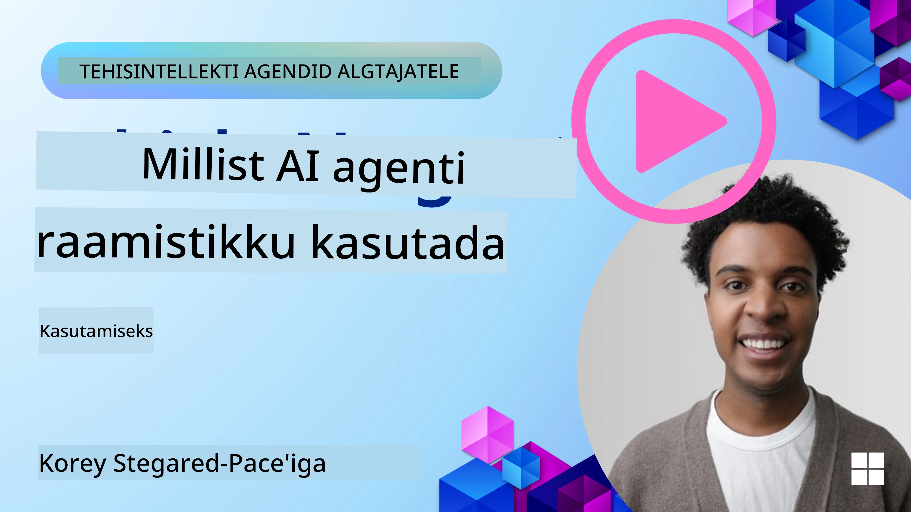

[](https://youtu.be/ODwF-EZo_O8?si=1xoy_B9RNQfrYdF7)

> _(Klõpsake ülaloleval pildil, et vaadata selle õppetunni videot)_

# Uurime AI-agendisüsteeme

AI-agendisüsteemid on tarkvaraplatvormid, mis on loodud AI-agentide loomise, juurutamise ja haldamise lihtsustamiseks. Need raamistikud pakuvad arendajatele eelvalmis komponente, abstraktsioone ja tööriistu, mis sujuvdavad keerukate AI-süsteemide arendust.

Need raamistikud aitavad arendajatel keskenduda oma rakenduste ainulaadsetele aspektidele, pakkudes standardiseeritud lähenemisviise AI-agentide arenduse korduvatele väljakutsetele. Nad parandavad AI-süsteemide skaleeritavust, ligipääsetavust ja tõhusust.

## Sissejuhatus

Selles õppetunnis käsitleme:

- Mis on AI-agendisüsteemid ja mida need arendajatele võimaldavad saavutada?
- Kuidas meeskonnad saavad neid kasutada agentide võimaluste kiireks prototüüpimiseks, kordamiseks ja parandamiseks?
- Millised erinevused on Microsofti loodud raamistikel ja tööriistadel (<a href="https://aka.ms/ai-agents-beginners/ai-agent-service" target="_blank">Microsoft Foundry Agent Service</a> ja <a href="https://learn.microsoft.com/azure/ai-services/openai/how-to/responses" target="_blank">Microsoft Agent Framework</a>)?
- Kas saan oma olemasolevaid Azure'i ökosüsteemi tööriistu otse integreerida või on vaja eraldiseisvaid lahendusi?
- Mis on Microsoft Foundry Agent Service ja kuidas see mind aitab?

## Õpieesmärgid

Selle õppetunni eesmärk on aidata teil mõista:

- AI-agendisüsteemide rolli AI arenduses.
- Kuidas ära kasutada AI-agendisüsteeme intelligentsete agentide loomiseks.
- AI-agendisüsteemide poolt võimaldatud peamisi omadusi.
- Erinevusi Microsoft Agent Frameworki ja Microsoft Foundry Agent Service’i vahel.

## Mis on AI-agendisüsteemid ja mida need arendajatele võimaldavad teha?

Traditsioonilised AI-raamistikud aitavad teil integrendada AI-d oma rakendustesse ning muuta need rakendused paremaks järgmiste võimaluste kaudu:

- **Isikupärastamine**: AI suudab analüüsida kasutaja käitumist ja eelistusi, pakkudes isikupärastatud soovitusi, sisu ja kogemusi.
Näide: voogedastusteenused nagu Netflix kasutavad AI-d, et pakkuda filme ja saateid vaatamisajaloo põhjal, parandades kasutajate kaasatust ja rahulolu.
- **Automatiseerimine ja efektiivsus**: AI suudab automatiseerida korduvaid ülesandeid, sujuvalt korraldada töövooge ja parandada töö efektiivsust.
Näide: klienditeenindusrakendused kasutavad AI-toega vestlusroboteid korduvate päringute käsitlemiseks, lühendades reageerimisaegu ja vabastades inimagentide ressursse keerukamate probleemide jaoks.
- **Parendatud kasutajakogemus**: AI parandab üldist kasutajakogemust, pakkudes intelligentsed funktsioone nagu hääl­tuvastus, loomuliku keele töötlemine ja ennustav tekst.
Näide: virtuaalsed assistendid nagu Siri ja Google Assistant kasutavad AI-d, et mõista ja vastata häälkäsklustele, muutes seadmetega suhtlemise lihtsamaks.

### Kõlab ju suurepäraselt, miks siis on meil vaja AI-agendisüsteemi?

AI-agendisüsteemid on palju enamat kui tavalised AI-raamistikud. Need on loodud intelligentsete agentide loomiseks, kes suudavad suhelda kasutajate, teiste agentide ja keskkonnaga, et saavutada kindlaid eesmärke. Need agendid suudavad käituda autonoomselt, teha otsuseid ja kohaneda muutuvate tingimustega. Vaatame mõningaid AI-agendisüsteemide võimalusi:

- **Agentide koostöö ja koordineerimine**: võimaldavad luua mitut AI-agenti, kes suudavad koos töötada, suhelda ja koordineerida keerukate ülesannete lahendamiseks.
- **Ülesannete automatiseerimine ja haldamine**: pakuvad mehhanisme mitmeastmeliste töövoogude automatiseerimiseks, ülesannete delegeerimiseks ja dünaamiliseks halduseks agentide vahel.
- **Kontekstipõhine mõistmine ja kohanemine**: varustavad agente võimega mõista konteksti, kohaneda muutuvate oludega ja teha otsuseid reaalajas saadud info põhjal.

Kokkuvõttes võimaldavad agentide süsteemid teil teha rohkem, viia automatiseerimine järgmisele tasemele ning luua intelligentsemaid süsteeme, mis suudavad oma keskkonnast õppida ja kohaneda.

## Kuidas kiiresti prototüüpi teha, iteratsioone läbi viia ja agentide võimeid parandada?

See on kiirelt arenev valdkond, kuid enamik AI-agendisüsteemides on mõned ühised funktsioonid, mis aitavad kiirelt prototüüpida ja iteratsiooni teha – nimelt moodulkomponendid, koostöö tööriistad ja reaalajas õppimine. Vaatame neid lähemalt:

- **Kasuta moodulkomponente**: AI arenduskeskkonnad pakuvad eelvalmis komponente nagu AI ja mälu liidesed, funktsioonide kutsumine loomulikus keeles või koodilaiendite abil, käsuviiba mallid ja palju muud.
- **Kasuta koostöövahendeid**: kujunda agendid kindlate ülesannete ja rollidega, võimaldades neil testida ja täiustada koostöövooge.
- **Õpi reaalajas**: rakenda tagasisideahelad, kus agendid õpivad suhtlustest ja kohandavad dünaamiliselt oma käitumist.

### Kasuta moodulkomponente

Microsofti Agent Framework pakub eelvalmis komponente nagu AI-liidesed, tööriistade definitsioonid ja agentide haldus.

**Kuidas meeskonnad saavad neid kasutada**: meeskonnad saavad kiiresti koostada toimiva prototüübi, kasutades neid komponente, ilma et peaks alustama nullist, võimaldades kiiret eksperimenteerimist ja iteratsiooni.

**Praktiline kasutus**: võite kasutada eelvalmis parserit, et tuvastada kasutaja sisendist vajalik info, mälumoodulit andmete salvestamiseks ja toomiseks ning käsuviiba generaatorit kasutajate suhtlemiseks – kõik ilma komponentide käsitsi ehitamiseta.

**Näidis kood**. Vaatame näidet, kuidas kasutada Microsoft Agent Frameworki koos `FoundryChatClient`-iga, et mudel vastaks kasutaja sisendile tööriistade kutsumisega:

``` python
# Microsoft Agent Framework Pythoni näidis

import asyncio
import os

from agent_framework import tool
from agent_framework.foundry import FoundryChatClient
from azure.identity import AzureCliCredential


# Määratle näidistööriista funktsioon reisi broneerimiseks
@tool(approval_mode="never_require")
def book_flight(date: str, location: str) -> str:
    """Book travel given location and date."""
    return f"Travel was booked to {location} on {date}"


async def main():
    provider = FoundryChatClient(
        project_endpoint=os.environ["AZURE_AI_PROJECT_ENDPOINT"],
        model=os.environ["AZURE_AI_MODEL_DEPLOYMENT_NAME"],
        credential=AzureCliCredential(),
    )
    agent = provider.as_agent(
        name="travel_agent",
        instructions="Help the user book travel. Use the book_flight tool when ready.",
        tools=[book_flight],
    )

    response = await agent.run("I'd like to go to New York on January 1, 2025")
    print(response)
    # Näidisväljund: Teie lend New Yorki 1. jaanuaril 2025 on edukalt broneeritud. Head reisi! ✈️🗽


if __name__ == "__main__":
    asyncio.run(main())
```

Sellest näitest näete, kuidas kasutada eelvalmis parserit, et ekstraheerida võtmeinfo kasutaja sisendist, nagu lennupileti broneerimise päritolu, sihtkoht ja kuupäev. See moodulpõhine lähenemine võimaldab keskenduda kõrgetasemelisele loogikale.

### Kasuta koostöövahendeid

Sellised raamistikud nagu Microsoft Agent Framework võimaldavad luua mitut agenti, kes töötavad koos.

**Kuidas meeskonnad saavad neid kasutada**: meeskonnad saavad kujundada agendid kindlate rollide ja ülesannetega, võimaldades testida ja täiustada koostöövooge ning parandada kogu süsteemi efektiivsust.

**Praktiline kasutus**: võite luua agentide meeskonna, kus iga agent täidab spetsialiseeritud funktsiooni, nagu andmete kogumine, analüüs või otsustamine. Need agendid saavad omavahel suhelda ja infot jagada, et saavutada ühine eesmärk, näiteks vastata kasutaja päringule või täita ülesannet.

**Näidis kood (Microsoft Agent Framework)**:

```python
# Mitme agendi loomine, kes töötavad koos Microsoft Agent Frameworki abil

import os
from agent_framework.foundry import FoundryChatClient
from azure.identity import AzureCliCredential

provider = FoundryChatClient(
    project_endpoint=os.environ["AZURE_AI_PROJECT_ENDPOINT"],
    model=os.environ["AZURE_AI_MODEL_DEPLOYMENT_NAME"],
    credential=AzureCliCredential(),
)

# Andmete hankimise agent
agent_retrieve = provider.as_agent(
    name="dataretrieval",
    instructions="Retrieve relevant data using available tools.",
    tools=[retrieve_tool],
)

# Andmeanalüüsi agent
agent_analyze = provider.as_agent(
    name="dataanalysis",
    instructions="Analyze the retrieved data and provide insights.",
    tools=[analyze_tool],
)

# Agentide järjestikune käivitamine ülesandel
retrieval_result = await agent_retrieve.run("Retrieve sales data for Q4")
analysis_result = await agent_analyze.run(f"Analyze this data: {retrieval_result}")
print(analysis_result)
```

Näites näete, kuidas luua ülesanne, mis hõlmab mitut agenti andmete analüüsimiseks. Iga agent täidab konkreetset funktsiooni ning ülesanne viiakse ellu agentide koordineerimise kaudu, et saavutada soovitud tulemus. Erinevate rollidega spetsialiseeritud agentide loomine parandab ülesande tõhusust ja jõudlust.

### Õpi reaalajas

Täiustatud raamistikud pakuvad võimeid reaalajas konteksti mõistmiseks ja kohanemiseks.

**Kuidas meeskonnad saavad neid kasutada**: meeskonnad saavad rakendada tagasisidesilmuseid, kus agendid õpivad suhtlustest ning kohandavad oma käitumist dünaamiliselt, võimaldades pidevat täiustamist ja võimete täiendamist.

**Praktiline kasutus**: agendid saavad analüüsida kasutajate tagasisidet, keskkonnast kogutud andmeid ja ülesande tulemusi, et uuendada oma teadmistebaasi, kohandada otsustusalgoritme ja aja jooksul jõudlust parandada. See iteratiivne õppimine võimaldab agentidel kohaneda muutuvate tingimuste ja kasutajate eelistustega, parandades süsteemi üldist tõhusust.

## Millised on erinevused Microsoft Agent Frameworki ja Microsoft Foundry Agent Service vahel?

Neid lähenemisi saab võrrelda mitmel moel, kuid vaatame olulisi erinevusi nende disaini, võimete ja sihtkasutuse põhjal:

## Microsoft Agent Framework (MAF)

Microsoft Agent Framework pakub sujuvat SDK-d AI-agentide loomisel, kasutades `FoundryChatClient`-i. See lubab arendajatel luua agente, kes kasutavad Azure OpenAI mudeleid, koos sisseehitatud tööriista kutsumise, vestluse halduse ja ettevõtte taseme turvalisusega Azure'i identiteedi kaudu.

**Kasutusjuhtumid**: tootmistasemel AI-agentide loomine tööriistade kasutamise, mitmeastmeliste töövoogude ja ettevõtte integratsioonidega.

Siin on mõned Microsoft Agent Frameworki keskseid mõisteid:

- **Agendid**. Agent luuakse `FoundryChatClient`-i kaudu ning see konfigureeritakse nime, juhiste ja tööriistadega. Agent saab:
  - **Töötleda kasutaja sõnumeid** ja genereerida vastuseid Azure OpenAI mudelite abil.
  - **Kutsuda tööriistu** automaatselt vastavalt vestluse kontekstile.
  - **Hoidke vestluse seisundit** mitme suhtluse vältel.

  Siin on koodinäide agendi loomisest:

    ```python
    import os
    from agent_framework.foundry import FoundryChatClient
    from azure.identity import AzureCliCredential

    provider = FoundryChatClient(
        project_endpoint=os.environ["AZURE_AI_PROJECT_ENDPOINT"],
        model=os.environ["AZURE_AI_MODEL_DEPLOYMENT_NAME"],
        credential=AzureCliCredential(),
    )
    agent = provider.as_agent(
        name="my_agent",
        instructions="You are a helpful assistant.",
    )

    response = await agent.run("Hello, World!")
    print(response)
    ```

- **Tööriistad**. Raamistik toetab tööriistade defineerimist Python funktsioonidena, mida agent saab automaatselt kutsuda. Tööriistad registreeritakse agendi loomisel:

    ```python
    def get_weather(location: str) -> str:
        """Get the current weather for a location."""
        return f"The weather in {location} is sunny, 72\u00b0F."

    agent = provider.as_agent(
        name="weather_agent",
        instructions="Help users check the weather.",
        tools=[get_weather],
    )
    ```

- **Mitme-agendi koordineerimine**. Võite luua mitu agenti erinevate spetsialiseerumistega ja koordineerida nende tööd:

    ```python
    planner = provider.as_agent(
        name="planner",
        instructions="Break down complex tasks into steps.",
    )

    executor = provider.as_agent(
        name="executor",
        instructions="Execute the planned steps using available tools.",
        tools=[execute_tool],
    )

    plan = await planner.run("Plan a trip to Paris")
    result = await executor.run(f"Execute this plan: {plan}")
    ```

- **Azure'i identiteedi integratsioon**. Raamistik kasutab `AzureCliCredential`-i (või `DefaultAzureCredential`-i) turvaliseks ja võtiteta autentimiseks, välistades vajaduse API võtmeid käsitsi hallata.

## Microsoft Foundry Agent Service

Microsoft Foundry Agent Service on uuem teenus, mis tutvustati Microsoft Ignite 2024 konverentsil. See võimaldab arendada ja juurutada AI-agente paindlikemate mudelitega, näiteks kutsudes otse avatud lähtekoodiga LLM-e nagu Llama 3, Mistral ja Cohere.

Microsoft Foundry Agent Service pakub tugevamaid ettevõtte turvamehhanisme ja andmete salvestamise meetodeid, mistõttu sobib see ettevõtete tasandi rakendusteks.

See töötab kooskõlas Microsoft Agent Frameworkiga agentide loomise ja juurutamise jaoks.

Teenus on hetkel avalikus eelvaates ja toetab agentide ülesehitamiseks Pythoni ja C# keelt.

Kasutades Microsoft Foundry Agent Service Python SDK-d, saame luua agendi kasutajapõhise tööriistaga:

```python
import asyncio
from azure.identity import DefaultAzureCredential
from azure.ai.projects import AIProjectClient

# Määratle tööriistafunktsioonid
def get_specials() -> str:
    """Provides a list of specials from the menu."""
    return """
    Special Soup: Clam Chowder
    Special Salad: Cobb Salad
    Special Drink: Chai Tea
    """

def get_item_price(menu_item: str) -> str:
    """Provides the price of the requested menu item."""
    return "$9.99"


async def main() -> None:
    credential = DefaultAzureCredential()
    project_client = AIProjectClient.from_connection_string(
        credential=credential,
        conn_str="your-connection-string",
    )

    agent = project_client.agents.create_agent(
        model="gpt-4o-mini",
        name="Host",
        instructions="Answer questions about the menu.",
        tools=[get_specials, get_item_price],
    )

    thread = project_client.agents.create_thread()

    user_inputs = [
        "Hello",
        "What is the special soup?",
        "How much does that cost?",
        "Thank you",
    ]

    for user_input in user_inputs:
        print(f"# User: '{user_input}'")
        message = project_client.agents.create_message(
            thread_id=thread.id,
            role="user",
            content=user_input,
        )
        run = project_client.agents.create_and_process_run(
            thread_id=thread.id, agent_id=agent.id
        )
        messages = project_client.agents.list_messages(thread_id=thread.id)
        print(f"# Agent: {messages.data[0].content[0].text.value}")


if __name__ == "__main__":
    asyncio.run(main())
```

### Keskseid mõisteid

Microsoft Foundry Agent Service’i kesksemad mõisted on:

- **Agent**. Microsoft Foundry Agent Service integreerub Microsoft Foundry’ga. Microsoft Foundry’s tegutseb AI Agent kui „tark“ mikroteenus, mida saab kasutada küsimustele vastamiseks (RAG), toimingute sooritamiseks või töövoogude täielikuks automatiseerimiseks. Seda tehakse, ühendades generatiivsete AI mudelite võimsuse tööriistadega, mis võimaldavad ligipääsu ja suhtlust reaalmaailma andmeallikatega. Siin on näide agendist:

    ```python
    agent = project_client.agents.create_agent(
        model="gpt-4o-mini",
        name="my-agent",
        instructions="You are helpful agent",
        tools=code_interpreter.definitions,
        tool_resources=code_interpreter.resources,
    )
    ```

    Selles näites on agent loodud mudeliga `gpt-4o-mini`, nimega `my-agent` ja juhistega „You are helpful agent“. Agent on varustatud tööriistade ja ressurssidega, et täita koodi tõlgendamise ülesandeid.

- **Teema ja sõnumid**. Teema on teine oluline kontseptsioon. See tähistab vestlust või suhtlust agendi ja kasutaja vahel. Teemasid kasutatakse vestluse edenemise jälgimiseks, kontekstiinfo salvestamiseks ja suhtluse seisundi haldamiseks. Siin on näide teemast:

    ```python
    thread = project_client.agents.create_thread()
    message = project_client.agents.create_message(
        thread_id=thread.id,
        role="user",
        content="Could you please create a bar chart for the operating profit using the following data and provide the file to me? Company A: $1.2 million, Company B: $2.5 million, Company C: $3.0 million, Company D: $1.8 million",
    )
    
    # Palu agendil teostada tööd lõimel
    run = project_client.agents.create_and_process_run(thread_id=thread.id, agent_id=agent.id)
    
    # Hangi ja logi kõik sõnumid, et näha agendi vastust
    messages = project_client.agents.list_messages(thread_id=thread.id)
    print(f"Messages: {messages}")
    ```

    Eelnevas koodis luuakse teema, millele seejärel saadetakse sõnum. `create_and_process_run` meetodi kutsumisega palutakse agendil teema kallal töö teha. Lõpuks sõnumid hangitakse ja logitakse, et näha agendi vastust. Sõnumid näitavad vestluse edenemist kasutaja ja agendi vahel. Samuti on oluline mõista, et sõnumid võivad olla erinevat tüüpi, näiteks tekst, pilt või fail – see tähendab, et agendi töö võib olla teksti- või pildipõhine vastus. Arendajana saate seda infot kasutada vastuse edasiseks töötlemiseks või kasutajale esitamiseks.

- **Integreerub Microsoft Agent Frameworkiga**. Microsoft Foundry Agent Service töötab sujuvalt koos Microsoft Agent Frameworkiga, mis tähendab, et võite luua agente `FoundryChatClient` abil ning juurutada neid Agent Service’i kaudu tootmiskeskkonda.

**Kasutusjuhtumid**: Microsoft Foundry Agent Service on mõeldud ettevõtte klassi rakendustele, mis nõuavad turvalist, skaleeritavat ja paindlikku AI-agentide juurutamist.

## Milline on nende lähenemiste vahe?
 
Tundub, et kattuvust on, kuid disaini, võimete ja sihtkasutuse poolest on olulisi erinevusi:
 
- **Microsoft Agent Framework (MAF)**: tootmistaseme SDK AI-agentide loomiseks. Pakub sujuvat API-d agentide loomiseks tööriistade kutsumise, vestluse halduse ja Azure identiteedi integreerimisega.
- **Microsoft Foundry Agent Service**: platvorm ja juurutusteenus Microsoft Foundry’s agentidele. Pakub sisseehitatud ühenduvust sellistele teenustele nagu Azure OpenAI, Azure AI Search, Bing Search ja koodi täitmine.
 
Ei ole ikka kindel, kumba valida?

### Kasutusjuhtumid
 
Vaatame mõningaid tavalisi kasutusjuhtumeid, mis võivad aidata teil otsustada:
 
> K: Ma loon tootmistaseme AI-agentide rakendusi ja soovin kiiresti alustada
>

> V: Microsoft Agent Framework on suurepärane valik. See pakub lihtsat, Python-sarnast API-d läbi `FoundryChatClient`-i, mis võimaldab defineerida agendid tööriistade ja juhistega mõne koodirea jooksul.

> K: Vajan ettevõtte tasemel juurutust koos Azure integratsioonidega nagu Search ja koodi täitmine
>
> V: Microsoft Foundry Agent Service on kõige sobivam. See on platvormiteenus, mis pakub mitme mudeli tuge, Azure AI Searchi, Bing Searchi ja Azure Functions’i. See teeb agendide loomise Foundry portaalis ja nende skaleerimise lihtsaks.
 
> K: Olen endiselt segaduses, anna mulle üks variant
>
> V: Alusta Microsoft Agent Frameworkiga agentide loomiseks ja kasuta seejärel Microsoft Foundry Agent Service’i nende tootmises juurutamiseks ja skaleerimiseks. See lähenemine võimaldab teil oma agentide loogikat kiiresti iteratiivselt arendada, luues selge tee ettevõtte juurutuseks.
 
Summeerime peamised erinevused tabelis:

| Raamistik | Fookus | Põhimõisted | Kasutusjuhtumid |
| --- | --- | --- | --- |
| Microsoft Agent Framework | Sujuv agentide SDK tööriistakutsumisega | Agendid, Tööriistad, Azure Identiteet | AI-agentide loomine, tööriistade kasutus, mitmeastmelised töövood |
| Microsoft Foundry Agent Service | Paindlikud mudelid, ettevõtte turvalisus, koodigeneratsioon, tööriistade kutsumine | Modulaarne, koostöö, protsesside korraldus | Turvaline, skaleeritav ja paindlik AI-agentide juurutus |

## Kas saan oma olemasolevaid Azure’i ökosüsteemi tööriistu otse integreerida või on vaja eraldiseisvaid lahendusi?


Vastus on jah, saate oma olemasolevaid Azure ökosüsteemi tööriistu otse integreerida Microsoft Foundry Agent Teenusega, eriti kuna see on loodud sujuvaks koostööks teiste Azure teenustega. Näiteks võiksite integreerida Bing, Azure AI Search ja Azure Functions. Samuti on sügav integratsioon Microsoft Foundryga.

Microsoft Agent Framework integreerub ka Azure teenustega läbi `FoundryChatClient` ja Azure identiteedi, võimaldades teil helistada Azure teenustele otse oma agentide tööriistade kaudu.

## Näidiskoodid

- Python: [Agent Framework (Microsoft Foundry)](./code_samples/02-python-agent-framework.ipynb)
- Python: [Agent Framework (Azure OpenAI Responses API)](./code_samples/02-python-agent-framework-azure-openai.ipynb)
- .NET: [Agent Framework](./code_samples/02-dotnet-agent-framework.md)

## Kas Sul on Rohkem Küsimusi AI Agentide Raamistike kohta?

Liitu [Microsoft Foundry Discordiga](https://discord.com/invite/ATgtXmAS5D), et kohtuda teiste õppijatega, osaleda tööaegadel ja saada vastused oma AI agentide küsimustele.

## Viited

- <a href="https://techcommunity.microsoft.com/blog/azure-ai-services-blog/introducing-azure-ai-agent-service/4298357" target="_blank">Azure Agent Teenus</a>
- <a href="https://learn.microsoft.com/azure/ai-services/openai/how-to/responses" target="_blank">Microsoft Agent Framework - Azure OpenAI Vastused</a>
- <a href="https://learn.microsoft.com/azure/ai-services/agents/overview" target="_blank">Microsoft Foundry Agent Teenus</a>

## Eelmine Õppetund

[Sissejuhatus AI Agentidesse ja Agentide Kasutusjuhtumitesse](../01-intro-to-ai-agents/README.md)

## Järgmine Õppetund

[Agentliku Disaini Musterite Mõistmine](../03-agentic-design-patterns/README.md)

---

<!-- CO-OP TRANSLATOR DISCLAIMER START -->
**Lahtiütlus**:
See dokument on tõlgitud kasutades AI tõlketeenust [Co-op Translator](https://github.com/Azure/co-op-translator). Kuigi me püüdleme täpsuse poole, palun pange tähele, et automatiseeritud tõlgetes võib esineda vigu või ebatäpsusi. Originaaldokument selle emakeeles tuleks pidada autoriteetseks allikaks. Olulise teabe puhul soovitatakse kasutada professionaalset inimtõlget. Me ei vastuta selle tõlkega seotud eksimustest või valesti mõistmistest.
<!-- CO-OP TRANSLATOR DISCLAIMER END -->