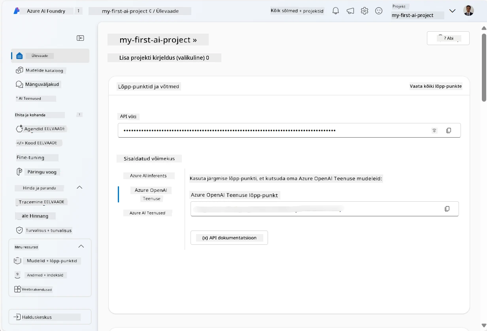
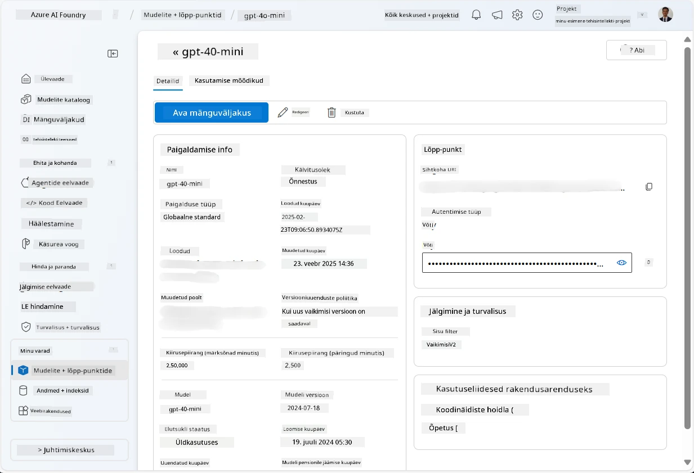
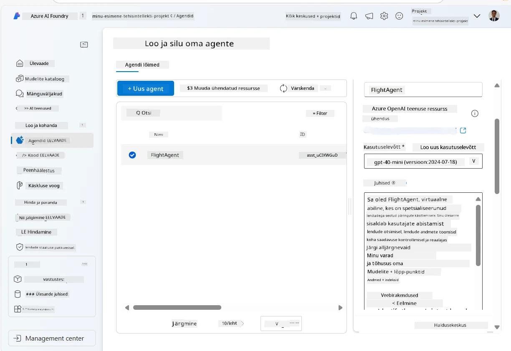
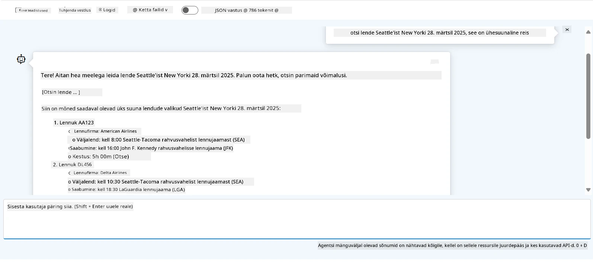

# Microsoft Foundry agendi teenuse arendus

Selles harjutuses kasutate Microsoft Foundry agendi teenuse tööriistu [Microsoft Foundry portaalis](https://ai.azure.com/?WT.mc_id=academic-105485-koreyst), et luua agent lennupiletite broneerimiseks. Agent suudab kasutajatega suhelda ja pakkuda teavet lendude kohta.

## Eeltingimused

Selle harjutuse lõpuleviimiseks on teil vaja järgmist:
1. Azure konto aktiivse tellimusega. [Loo konto tasuta](https://azure.microsoft.com/free/?WT.mc_id=academic-105485-koreyst).
2. Teil peavad olema õigused Microsoft Foundry keskuse loomiseks või peaks keegi selle teie jaoks loonud olema.
    - Kui teie roll on Kaastööline või Omanik, saate järgida selles juhendis kirjeldatud samme.

## Looge Microsoft Foundry keskus

> **Märkus:** Microsoft Foundry oli varem tuntud kui Azure AI Studio.

1. Järgige neid juhiseid [Microsoft Foundry](https://learn.microsoft.com/en-us/azure/ai-studio/?WT.mc_id=academic-105485-koreyst) blogipostitusest Microsoft Foundry keskuse loomiseks.
2. Kui teie projekt on loodud, sulgege kõik kuvatavad vihjed ja vaadake Microsoft Foundry portaali projekti lehte, mis peaks välja nägema sarnaselt järgmise pildiga:

    

## Mudeli juurutamine

1. Projekti vasakul paanil valige jaotises **Minu varad** leht **Mudelite + lõpp-punktid**.
2. Lehel **Mudelite + lõpp-punktid** valige vahekaardil **Mudeli juurutused** menüüst **+ Juuruta mudel** valik **Juuruta põhjamudel**.
3. Otsige nimekirjast mudelit `gpt-4o-mini`, valige see ja kinnitage valik.

    > **Märkus**: TPM vähendamine aitab vältida tellimuse kasutusega seotud ülekoormust.

    

## Agendi loomine

Kuna olete mudeli juurutanud, saate nüüd luua agendi. Agent on vestluslik tehisintellekti mudel, mida saab kasutada kasutajatega suhtlemiseks.

1. Projekti vasakul paanil valige jaotises **Koosta & kohanda** leht **Agendid**.
2. Klõpsake nuppu **+ Loo agent**, et luua uus agent. Dialoogiboksis **Agendi seadistamine**:
    - Sisestage agendi nimi, näiteks `FlightAgent`.
    - Veenduge, et oleks valitud varem loodud mudeli juurutus `gpt-4o-mini`.
    - Määrake **Juhised** vastavalt promptile, mida soovite agendi järgida. Siin on näide:
    ```
    You are FlightAgent, a virtual assistant specialized in handling flight-related queries. Your role includes assisting users with searching for flights, retrieving flight details, checking seat availability, and providing real-time flight status. Follow the instructions below to ensure clarity and effectiveness in your responses:

    ### Task Instructions:
    1. **Recognizing Intent**:
       - Identify the user's intent based on their request, focusing on one of the following categories:
         - Searching for flights
         - Retrieving flight details using a flight ID
         - Checking seat availability for a specified flight
         - Providing real-time flight status using a flight number
       - If the intent is unclear, politely ask users to clarify or provide more details.
        
    2. **Processing Requests**:
        - Depending on the identified intent, perform the required task:
        - For flight searches: Request details such as origin, destination, departure date, and optionally return date.
        - For flight details: Request a valid flight ID.
        - For seat availability: Request the flight ID and date and validate inputs.
        - For flight status: Request a valid flight number.
        - Perform validations on provided data (e.g., formats of dates, flight numbers, or IDs). If the information is incomplete or invalid, return a friendly request for clarification.

    3. **Generating Responses**:
    - Use a tone that is friendly, concise, and supportive.
    - Provide clear and actionable suggestions based on the output of each task.
    - If no data is found or an error occurs, explain it to the user gently and offer alternative actions (e.g., refine search, try another query).
    
    ```
> [!NOTE]
> Täpsema prompti jaoks võite vaadata [seda repositooriumi](https://github.com/ShivamGoyal03/RoamMind) lisateabe saamiseks.
    
> Lisaks võite lisada **Teadmusbaasi** ja **Tegevusi**, et täiustada agendi võimekust pakkuda rohkem teavet ja teostada kasutajapäringutel automaatseid ülesandeid. Selle harjutuse jaoks võite need sammud vahele jätta.
    


3. Uue mitme AI agenti loomiseks klõpsake lihtsalt nuppu **Uus agent**. Värskelt loodud agent kuvatakse seejärel lehel Agendid.


## Agendi testimine

Pärast agendi loomist saate seda testida, et näha, kuidas see kasutajate päringutele Microsoft Foundry portaali mänguväljakul reageerib.

1. Oma agendi **Seadista** paanil valige ülaosas nupp **Proovi mänguväljakul**.
2. Mänguväljaku paanil saate agenti kasutada, kirjutades vestlusaknas päringuid. Näiteks võite paluda agendil otsida lende Seattle'ist New Yorki 28. kuupäeval.

    > **Märkus**: Agent ei pruugi pakkuda täpseid vastuseid, kuna selles harjutuses ei kasutata reaalajas andmeid. Eesmärk on testida agendi võimet mõista ja reageerida kasutajapäringutele vastavalt määratud juhistele.

    

3. Pärast agendi testimist saate seda edasi kohandada, lisades rohkem kavatsusi, treeningandmeid ja tegevusi selle võimekuse tõstmiseks.

## Resursside puhastamine

Kui olete agendi testimise lõpetanud, saate selle kustutada, et vältida lisakulusid.
1. Avage [Azure portaal](https://portal.azure.com) ja vaadake selle ressursigrupi sisu, kuhu te selles harjutuses kasutatud keskuse ressursid juurutasite.
2. Tööriistaribal valige **Kustuta ressursirühm**.
3. Sisestage ressursirühma nimi ja kinnitage kustutamine.

## Ressursid

- [Microsoft Foundry dokumentatsioon](https://learn.microsoft.com/en-us/azure/ai-studio/?WT.mc_id=academic-105485-koreyst)
- [Microsoft Foundry portaal](https://ai.azure.com/?WT.mc_id=academic-105485-koreyst)
- [Alustamine Microsoft Foundryga](https://techcommunity.microsoft.com/blog/educatordeveloperblog/getting-started-with-azure-ai-studio/4095602?WT.mc_id=academic-105485-koreyst)
- [AI agentide alused Azure’is](https://learn.microsoft.com/en-us/training/modules/ai-agent-fundamentals/?WT.mc_id=academic-105485-koreyst)
- [Azure AI Discord](https://aka.ms/AzureAI/Discord)

---

<!-- CO-OP TRANSLATOR DISCLAIMER START -->
**Lahtiütlus**:
See dokument on tõlgitud kasutades AI tõlketeenust [Co-op Translator](https://github.com/Azure/co-op-translator). Kuigi me püüdleme täpsuse poole, palun pange tähele, et automatiseeritud tõlgetes võib esineda vigu või ebatäpsusi. Originaaldokument selle emakeeles tuleks pidada autoriteetseks allikaks. Olulise teabe puhul soovitatakse kasutada professionaalset inimtõlget. Me ei vastuta selle tõlkega seotud eksimustest või valesti mõistmistest.
<!-- CO-OP TRANSLATOR DISCLAIMER END -->