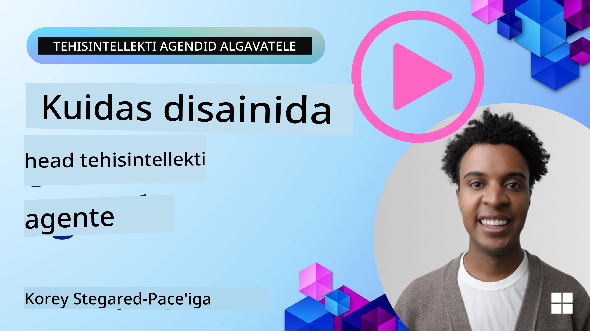
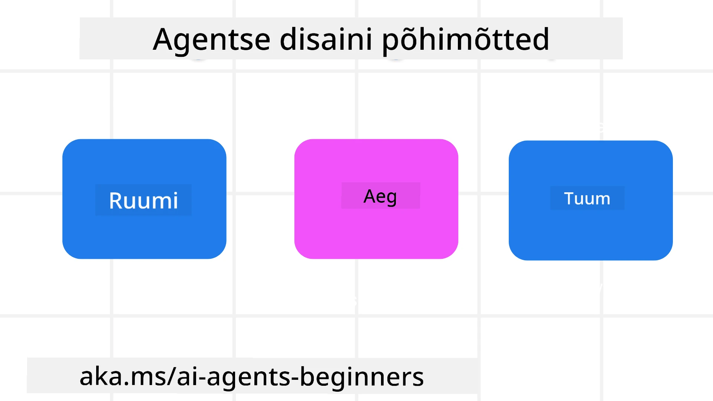

> _(Videotunni vaatamiseks klõpsake ülaloleval pildil)_
# AI agentide kujundamise põhimõtted

## Sissejuhatus

AI agentide süsteemide loomisel on palju erinevaid lähenemisi. Kuna ebamäärasus on generatiivse tehisintellekti kujunduse omadus, mitte viga, võib inseneridel olla keeruline aru saada, kust alustada. Oleme loonud inimkeskse kasutajakogemuse disainipõhimõtted, mis võimaldavad arendajatel ehitada kliendikeskseid agentuuri süsteeme, et lahendada nende ärivajadusi. Need disainipõhimõtted ei ole määrav arhitektuur, vaid lähtepunkt meeskondadele, kes määratlevad ja loovad agentide kogemusi.

Üldiselt peaksid agendid:

- Laiendama ja suurendama inimvõimeid (ajurünnak, probleemilahendus, automatiseerimine jms)
- Täitma teadmiste lünki (viima mind teadmiste valdkonnas kiirelt toimima, tõlkimine jms)
- Võimaldama ja toetama koostööd viisil, mis vastab meie isiklikele eelistustele teistega töötamisel
- Muutma meid paremaks versiooniks iseendast (nt elu- ja tööalane treener, aidates õppida emotsioonide reguleerimist ja teadlikkuse oskusi, vastupidavuse kasvatamine jne)

## Selles tunnis käsitletakse

- Mis on agentuuri disainipõhimõtted
- Millised juhised tuleks järgida nende põhimõtete rakendamisel
- Näited, kuidas disainipõhimõtteid kasutada

## Õpieesmärgid

Pärast selle tunni läbimist suudate:

1. Selgitada, mis on agentuuri disainipõhimõtted
2. Selgitada agentuuri disainipõhimõtete kasutamise juhiseid
3. Mõista, kuidas ehitada agenti, kasutades agentuuri disainipõhimõtteid

## Agentuuri disainipõhimõtted

### Agent (Ruum)

See on keskkond, kus agent tegutseb. Need põhimõtted juhivad, kuidas kujundada agente, kes tegutsevad füüsilises ja digitaalses maailmas.

- **Ühendamine, mitte sulandumine** – aidata inimestel üksteise, sündmuste ja rakendatava teadmisega ühenduda, et võimaldada koostööd ja sidet.
- Agendid aitavad ühendada sündmusi, teadmisi ja inimesi.
- Agendid toovad inimesed üksteisele lähemale. Nad ei ole loodud inimeste asendamiseks ega alavääristamiseks.
- **Lihtsalt ligipääsetav, kuid aeg-ajalt nähtamatu** – agent tegutseb peamiselt taustal ja torkab esile vaid siis, kui see on asjakohane ja sobiv.
  - Agent on lihtsalt leitav ja juurdepääsetav volitatud kasutajatele igas seadmes või platvormil.
  - Agent toetab mitmemodaalseid sisendeid ja väljundeid (heli, hääl, tekst jne).
  - Agent võib sujuvalt liikuda esiplaanilt taustale; olla proaktiivne või reaktiivne sõltuvalt kasutaja vajaduste tunnetamisest.
  - Agent võib tegutseda nähtamatus vormis, kuid tema taustaprotsesside rada ja koostöö teiste agentidega on kasutajale läbipaistev ja juhitav.

### Agent (Aeg)

See kirjeldab, kuidas agent tegutseb aja jooksul. Need põhimõtted juhivad, kuidas kujundada agente, kes suhtlevad mineviku, oleviku ja tulevikuga.

- **Minevik**: Ajaloo peegeldamine, mis hõlmab nii olekut kui konteksti.
  - Agent pakub asjakohasemaid tulemusi, analüüsides rikkalikumat ajaloolist teavet peale sündmuste, inimeste või olekute.
  - Agent loob ühendusi minevikusündmuste vahel ja tegeleb aktiivselt mälestustega, et kaasata praeguseid olukordi.
- **Praegu**: Julgustades rohkem kui teavitades.
  - Agent kehastab põhjalikku lähenemist inimeste suhtluses. Kui sündmus toimub, läheb agent üle staatilisest teavitamisest või muust staatilisest formaalsusest. Agent võib lihtsustada protsesse või dünaamiliselt genereerida vihjeid, et suunata kasutaja tähelepanu õigele hetkele.
  - Agent edastab teavet vastavalt kontekstuaalsele keskkonnale, sotsiaalsetele ja kultuurilistele muutustele ning kohandub kasutaja kavatsustega.
  - Agendi suhtlus võib olla järkjärguline, areneda ja muutuda järjest keerukamaks, et pikaajalises perspektiivis kasutajaid toetada.
- **Tulevik**: Kohandumine ja areng.
  - Agent kohandub erinevate seadmete, platvormide ja modaliteetidega.
  - Agent kohandub kasutaja käitumise, juurdepääsetavuse vajadustega ja on vabalt kohandatav.
  - Agent kujuneb ja areneb pideva kasutajate suhtluse kaudu.

### Agent (Tuumik)

Need on olulised elemendid agendi tuumikus.

- **Kasuta ebakindlust, kuid loo usaldus**.
  - Agentilt oodatakse teatavat ebakindlust. Ebakindlus on agendi disaini oluline osa.
  - Usaldus ja läbipaistvus on agendi disaini aluspõhimõtted.
  - Inimesed kontrollivad, millal agent on sisse või välja lülitatud, ja agendi olek on alati selgelt nähtav.

## Juhised nende põhimõtete rakendamiseks

Järgides eelnevaid disainipõhimõtteid, kasutage järgmisi juhiseid:

1. **Läbipaistvus**: Teatage kasutajale, et AI on kaasatud, kuidas see toimib (kaasa arvatud varasemad tegevused) ning kuidas tagasisidet anda ja süsteemi muuta.
2. **Kontroll**: Võimaldage kasutajal süsteemi kohandada, eelistusi määrata ja personaliseerida ning omada kontrolli süsteemi ja selle omaduste üle (sealhulgas suutlikkus unustada).
3. **Järjepidevus**: Püüdke tagada järjepidev mitmemodaalne kogemus seadmete ja lõpp-punktide vahel. Kasutage võimalusel tuttavaid kasutajaliidese elemente (nt mikrofonikoon häälkäsklusteks) ja vähendage kliendi kognitiivset koormust võimalikult palju (nt lühikesed vastused, visuaalsed abivahendid ja "Loe rohkem" sisu).

## Kuidas kujundada reisibüroo agendit, kasutades neid põhimõtteid ja juhiseid

Kujutage ette, et kujundate reisibüroo agendit, siin on, kuidas võiksite mõelda disainipõhimõtete ja juhiste kasutamisele:

1. **Läbipaistvus** – Andke kasutajale teada, et reisibüroo agent on tehisintellektil põhinev agent. Esitage mõned põhilised juhised, kuidas alustada (nt "Tervitus" sõnum, näidiskäsklused). Kirjutage see tootelehele selgelt üles. Näidake kasutaja varasemalt esitatud käskluste loendit. Selgitage, kuidas tagasisidet anda (nt pöidla üles/alla, nupp "Saada tagasisidet"). Täpsustage, kas agendil on kasutus- või teemarikked.
2. **Kontroll** – Veenduge, et oleks selge, kuidas kasutaja saab pärast agendi loomist süsteemisätete abil seda muuta. Võimaldage kasutajal valida, kui kõneka agent on, tema kirjutamisstiil ja piirangud teemadel, millest agent ei tohiks rääkida. Lubage kasutajal vaadata ja kustutada seotud faile või andmeid, käsklusi ja varasemaid vestlusi.
3. **Järjepidevus** – Veenduge, et ikoonid "Jaga käsklust", faili või foto lisamiseks ning kellegi või millegi märgistamiseks oleksid standardsed ja äratuntavad. Kasutage agendi failide üleslaadimiseks/jagamises pabeklambriikooni ja graafika üleslaadimiseks pildiikooni.

## Näidiskoodid

- Python: [Agent Framework](./code_samples/03-python-agent-framework.ipynb)
- .NET: [Agent Framework](./code_samples/03-dotnet-agent-framework.md)

## Kas teil on AI agentide disainimustrite kohta lisaküsimusi?

Liituge [Microsoft Foundry Discord](https://discord.com/invite/ATgtXmAS5D) kanaliga, et kohtuda teiste õppijatega, osaleda kontorituuridel ja saada vastused oma AI agentide küsimustele.

## Lisamaterjalid

- <a href="https://openai.com" target="_blank">Agentuuri tehisintellekti süsteemide juhtimise tavad | OpenAI</a>
- <a href="https://microsoft.com" target="_blank">HAX tööriistakomplekti projekt - Microsoft Research</a>
- <a href="https://responsibleaitoolbox.ai" target="_blank">Vastutustundliku AI tööriistakast</a>

## Eelmise tunni ülesanne

[Agentuuri raamistike uurimine](../02-explore-agentic-frameworks/README.md)

## Järgmine tund

[Tööriistade kasutamise disainimuster](../04-tool-use/README.md)

---

<!-- CO-OP TRANSLATOR DISCLAIMER START -->
**Lahtiütlus**:
See dokument on tõlgitud kasutades AI tõlketeenust [Co-op Translator](https://github.com/Azure/co-op-translator). Kuigi me püüdleme täpsuse poole, palun pange tähele, et automatiseeritud tõlgetes võib esineda vigu või ebatäpsusi. Originaaldokument selle emakeeles tuleks pidada autoriteetseks allikaks. Olulise teabe puhul soovitatakse kasutada professionaalset inimtõlget. Me ei vastuta selle tõlkega seotud eksimustest või valesti mõistmistest.
<!-- CO-OP TRANSLATOR DISCLAIMER END -->