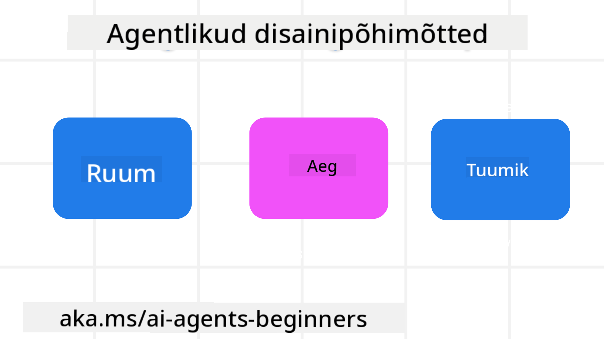

<!--
CO_OP_TRANSLATOR_METADATA:
{
  "original_hash": "4c46e4ff9e349c521e2b0b17f51afa64",
  "translation_date": "2025-10-11T11:21:25+00:00",
  "source_file": "03-agentic-design-patterns/README.md",
  "language_code": "et"
}
-->

> _(Klõpsa ülaloleval pildil, et vaadata selle õppetunni videot)_
# AI Agentliku Disaini Põhimõtted

## Sissejuhatus

AI agentlike süsteemide loomise kohta on palju erinevaid mõtteviise. Arvestades, et ebaselgus on generatiivse AI disainis pigem omadus kui viga, võib inseneridel olla keeruline otsustada, kust alustada. Oleme loonud inimkesksete kasutajakogemuse disainipõhimõtete komplekti, et aidata arendajatel luua kliendikeskseid agentlikke süsteeme, mis vastavad nende ärivajadustele. Need disainipõhimõtted ei ole etteantud arhitektuur, vaid pigem lähtepunkt meeskondadele, kes määratlevad ja arendavad agentide kogemusi.

Üldiselt peaksid agendid:

- Laiendama ja suurendama inimvõimekusi (ajurünnakud, probleemide lahendamine, automatiseerimine jne)
- Täitma teadmiste lünki (aitama omandada teadmisi, tõlkida jne)
- Soodustama ja toetama koostööd viisil, mis sobib meie eelistustega teistega töötamisel
- Muutma meid paremaks versiooniks iseendast (nt elutreener/ülesannete juht, aidates õppida emotsionaalset regulatsiooni ja teadveloleku oskusi, suurendades vastupidavust jne)

## Selles õppetunnis käsitletakse

- Mis on agentliku disaini põhimõtted
- Milliseid juhiseid järgida nende disainipõhimõtete rakendamisel
- Näiteid disainipõhimõtete kasutamisest

## Õppeesmärgid

Pärast selle õppetunni läbimist suudad:

1. Selgitada, mis on agentliku disaini põhimõtted
2. Selgitada juhiseid agentliku disaini põhimõtete kasutamiseks
3. Mõista, kuidas luua agenti, kasutades agentliku disaini põhimõtteid

## Agentliku Disaini Põhimõtted

### Agent (Ruum)

See on keskkond, kus agent tegutseb. Need põhimõtted juhendavad meid agentide kujundamisel füüsilises ja digitaalses maailmas.

- **Ühendamine, mitte eraldamine** – aidata inimesi ühendada teiste inimeste, sündmuste ja rakendatavate teadmistega, et võimaldada koostööd ja ühendust.
- Agendid aitavad ühendada sündmusi, teadmisi ja inimesi.
- Agendid toovad inimesi üksteisele lähemale. Need ei ole loodud inimeste asendamiseks või alavääristamiseks.
- **Lihtsasti ligipääsetav, kuid vahel nähtamatu** – agent tegutseb suuresti taustal ja sekkub ainult siis, kui see on asjakohane ja vajalik.
  - Agent on volitatud kasutajatele igal seadmel või platvormil kergesti leitav ja ligipääsetav.
  - Agent toetab mitmeliigilisi sisendeid ja väljundeid (heli, hääl, tekst jne).
  - Agent suudab sujuvalt liikuda esiplaanilt taustale; proaktiivsest reaktiivseks, sõltuvalt kasutaja vajaduste tajumisest.
  - Agent võib tegutseda nähtamatul kujul, kuid selle taustaprotsess ja koostöö teiste agentidega on kasutajale läbipaistev ja kontrollitav.

### Agent (Aeg)

See on viis, kuidas agent tegutseb ajas. Need põhimõtted juhendavad meid agentide kujundamisel, mis suhtlevad mineviku, oleviku ja tulevikuga.

- **Minevik**: Ajaloo kajastamine, mis hõlmab nii seisundit kui konteksti.
  - Agent pakub asjakohasemaid tulemusi, analüüsides rikkalikumaid ajaloolisi andmeid, mitte ainult sündmusi, inimesi või seisundeid.
  - Agent loob ühendusi minevikusündmustest ja kajastab aktiivselt mälu, et tegeleda praeguste olukordadega.
- **Olevik**: Märguanded, mitte ainult teavitused.
  - Agent kehastab terviklikku lähenemist inimestega suhtlemisel. Kui sündmus toimub, läheb agent kaugemale staatilisest teavitusest või muust formaalsusest. Agent suudab lihtsustada protsesse või dünaamiliselt luua vihjeid, et suunata kasutaja tähelepanu õigel hetkel.
  - Agent edastab teavet, mis põhineb kontekstuaalsel keskkonnal, sotsiaalsetel ja kultuurilistel muutustel ning on kohandatud kasutaja kavatsustele.
  - Agentide interaktsioon võib olla järk-järguline, arenedes ja kasvades keerukuses, et pikaajaliselt kasutajaid võimestada.
- **Tulevik**: Kohanemine ja areng.
  - Agent kohaneb erinevate seadmete, platvormide ja viisidega.
  - Agent kohaneb kasutaja käitumise, ligipääsetavuse vajadustega ja on vabalt kohandatav.
  - Agent kujuneb ja areneb pideva kasutajate interaktsiooni kaudu.

### Agent (Tuumik)

Need on agendi disaini põhielemendid.

- **Ebamäärasuse aktsepteerimine, kuid usalduse loomine**.
  - Teatud tasemel agendi ebamäärasus on oodatav. Ebamäärasus on agendi disaini oluline element.
  - Usaldus ja läbipaistvus on agendi disaini aluskihid.
  - Inimesed kontrollivad, millal agent on sisse/välja lülitatud, ja agendi staatus on alati selgelt nähtav.

## Juhised nende põhimõtete rakendamiseks

Eelnevaid disainipõhimõtteid kasutades järgige järgmisi juhiseid:

1. **Läbipaistvus**: Teavitage kasutajat, et AI on kaasatud, kuidas see toimib (sh varasemad tegevused) ja kuidas anda tagasisidet ning süsteemi muuta.
2. **Kontroll**: Võimaldage kasutajal kohandada, määrata eelistusi ja isikupärastada ning kontrollida süsteemi ja selle atribuute (sh unustamise võimalus).
3. **Järjepidevus**: Püüdke pakkuda järjepidevaid, mitmeliigilisi kogemusi erinevatel seadmetel ja lõpp-punktides. Kasutage võimalusel tuttavaid UI/UX elemente (nt mikrofoni ikoon häälinteraktsiooniks) ja vähendage kliendi kognitiivset koormust nii palju kui võimalik (nt lühikesed vastused, visuaalsed abivahendid ja „Loe rohkem“ sisu).

## Kuidas kujundada reisibüroo agenti, kasutades neid põhimõtteid ja juhiseid

Kujutage ette, et kujundate reisibüroo agenti. Siin on, kuidas võiks mõelda disainipõhimõtete ja juhiste kasutamisele:

1. **Läbipaistvus** – Teavitage kasutajat, et reisibüroo agent on AI-põhine agent. Pakkuge mõned põhilised juhised alustamiseks (nt „Tere“ sõnum, näidisviited). Dokumenteerige see selgelt tootelehel. Näidake kasutajale varasemate päringute loendit. Tehke selgeks, kuidas anda tagasisidet (pöidlad üles ja alla, „Saada tagasisidet“ nupp jne). Selgitage selgelt, kui agendil on kasutus- või teemapiirangud.
2. **Kontroll** – Tehke selgeks, kuidas kasutaja saab agenti pärast selle loomist muuta, näiteks süsteemi viite kaudu. Võimaldage kasutajal valida, kui põhjalik agent on, selle kirjutamisstiil ja mis tahes piirangud, millest agent ei peaks rääkima. Lubage kasutajal vaadata ja kustutada seotud faile või andmeid, päringuid ja varasemaid vestlusi.
3. **Järjepidevus** – Veenduge, et ikoonid, nagu „Jaga päringut“, faili või foto lisamine ja kellegi või millegi märgistamine, oleksid standardsed ja äratuntavad. Kasutage kirjaklambri ikooni, et näidata faili üleslaadimist/jagamist agendiga, ja pildiikooni graafika üleslaadimise tähistamiseks.

### Kas teil on rohkem küsimusi AI agentliku disaini mustrite kohta?

Liituge [Azure AI Foundry Discordiga](https://aka.ms/ai-agents/discord), et kohtuda teiste õppijatega, osaleda vastuvõtutundides ja saada vastuseid oma AI agentide küsimustele.

## Täiendavad ressursid

- <a href="https://openai.com" target="_blank">Agentlike AI süsteemide juhtimise praktikad | OpenAI</a>
- <a href="https://microsoft.com" target="_blank">HAX Toolkit Project - Microsoft Research</a>
- <a href="https://responsibleaitoolbox.ai" target="_blank">Vastutustundliku AI tööriistakast</a>

## Eelmine õppetund

[Agentlike raamistikude uurimine](../02-explore-agentic-frameworks/README.md)

## Järgmine õppetund

[Tööriistade kasutamise disainimuster](../04-tool-use/README.md)

---

**Lahtiütlus**:  
See dokument on tõlgitud AI tõlketeenuse [Co-op Translator](https://github.com/Azure/co-op-translator) abil. Kuigi püüame tagada täpsust, palume arvestada, et automaatsed tõlked võivad sisaldada vigu või ebatäpsusi. Algne dokument selle algses keeles tuleks pidada autoriteetseks allikaks. Olulise teabe puhul soovitame kasutada professionaalset inimtõlget. Me ei vastuta selle tõlke kasutamisest tulenevate arusaamatuste või valesti tõlgenduste eest.